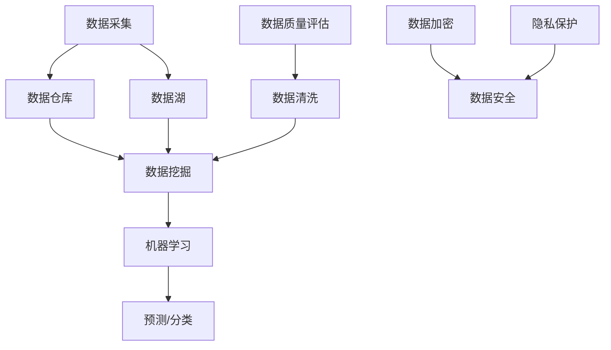

                 

关键词：人工智能，数据管理，创业，策略，框架，算法，数学模型，代码实例，应用场景，工具推荐。

> 摘要：随着人工智能技术的快速发展，创业公司面临着日益增长的数据处理需求。本文将探讨人工智能创业数据管理的策略，从核心概念、算法原理、数学模型到项目实践，为创业者提供全方位的数据管理指南。

## 1. 背景介绍

近年来，人工智能（AI）技术的飞速发展，已经渗透到我们生活的方方面面。从自动驾驶汽车到智能家居，从智能客服到医疗诊断，AI技术正在改变着世界的面貌。与此同时，随着AI技术的广泛应用，数据的数量和质量也在不断增长。对于创业公司来说，如何有效地管理和利用这些数据，成为了成功的关键因素之一。

创业公司通常在资源有限的情况下，需要在数据管理上做出明智的决策。本文将围绕人工智能创业数据管理的策略，探讨如何构建有效的数据管理体系，实现数据的增值，并最终转化为商业价值。

### 1.1 人工智能与数据管理的关系

人工智能的核心在于数据的处理和分析。大量的数据是训练和优化AI模型的基础，而有效的数据管理则是确保数据质量和安全的关键。因此，人工智能与数据管理之间存在着密切的联系：

- **数据采集**：人工智能系统需要大量的数据来训练模型，而这些数据的来源可以是内部产生的，也可以是外部获取的。
- **数据存储**：随着数据量的增加，如何高效地存储和管理数据成为一个重要问题。
- **数据清洗**：原始数据往往存在噪声和不一致性，数据清洗是数据管理的重要步骤。
- **数据分析**：通过数据分析，可以发现数据的内在规律，为人工智能模型的优化提供依据。
- **数据安全**：保护数据的安全性和隐私性，对于创业公司尤为重要。

### 1.2 数据管理的重要性

对于创业公司来说，数据管理的重要性体现在以下几个方面：

- **决策支持**：有效的数据管理可以帮助创业者更好地理解业务需求，做出基于数据的明智决策。
- **竞争优势**：掌握数据管理的技巧，可以帮助创业公司在市场中获得竞争优势。
- **资源优化**：合理的数据管理可以提高资源的利用效率，减少不必要的浪费。
- **风险控制**：良好的数据管理体系可以降低数据泄露、误用等风险。

## 2. 核心概念与联系

在探讨人工智能创业数据管理的策略之前，我们需要明确一些核心概念，并理解它们之间的联系。以下是本文中将要涉及的核心概念：

### 2.1 数据管理概念

- **数据仓库**：用于存储大量数据的系统。
- **数据湖**：与数据仓库类似，但更加灵活，可以存储原始数据。
- **数据挖掘**：从大量数据中提取有用信息的过程。
- **机器学习**：利用数据建立模型，以实现预测和分类等任务。

### 2.2 数据管理架构

- **分层架构**：数据管理系统的常见架构，包括数据采集、数据存储、数据处理和数据展示等层次。
- **分布式架构**：适用于大规模数据处理的架构，可以将数据处理任务分布到多个节点上。

### 2.3 数据质量管理

- **数据质量评估**：评估数据的准确性、完整性、一致性和可靠性。
- **数据清洗**：去除数据中的噪声和错误，提高数据质量。

### 2.4 数据安全与隐私

- **数据加密**：确保数据在传输和存储过程中的安全性。
- **隐私保护**：在数据处理过程中保护个人隐私。

### 2.5 Mermaid 流程图

以下是核心概念和架构的 Mermaid 流程图：



## 3. 核心算法原理 & 具体操作步骤

在数据管理中，核心算法的选择和应用至关重要。本节将介绍几种常用的核心算法原理及其具体操作步骤。

### 3.1 算法原理概述

以下是本文中将要介绍的核心算法：

- **K-均值聚类算法**：用于数据聚类。
- **决策树算法**：用于分类和回归任务。
- **神经网络**：用于深度学习和复杂的模式识别。

### 3.2 算法步骤详解

#### 3.2.1 K-均值聚类算法

1. 随机选择K个初始中心点。
2. 计算每个数据点到中心的距离。
3. 将每个数据点分配到最近的中心点。
4. 重新计算每个中心点的位置。
5. 重复步骤3和4，直到中心点的位置不再改变。

#### 3.2.2 决策树算法

1. 选择最佳划分标准。
2. 根据划分标准将数据划分为多个子集。
3. 对于每个子集，重复步骤1和2，直到达到终止条件（例如，子集大小小于阈值）。
4. 构建决策树，每个节点代表一个划分标准，每个叶节点代表一个类别。

#### 3.2.3 神经网络

1. 初始化网络参数。
2. 前向传播：计算输入经过网络的输出。
3. 反向传播：计算损失函数，并更新网络参数。
4. 重复步骤2和3，直到满足训练条件（例如，损失函数收敛）。

### 3.3 算法优缺点

- **K-均值聚类算法**：
  - **优点**：简单，易于实现。
  - **缺点**：对于初始中心点的选择敏感，可能陷入局部最优。

- **决策树算法**：
  - **优点**：解释性强，易于理解。
  - **缺点**：对于连续特征的划分效果不佳，容易过拟合。

- **神经网络**：
  - **优点**：强大的拟合能力，适用于复杂的模式识别。
  - **缺点**：计算量大，参数调整复杂。

### 3.4 算法应用领域

- **K-均值聚类算法**：应用于市场细分、图像分割等。
- **决策树算法**：应用于金融风控、医疗诊断等。
- **神经网络**：应用于图像识别、自然语言处理等。

## 4. 数学模型和公式 & 详细讲解 & 举例说明

在数据管理中，数学模型和公式起着至关重要的作用。本节将介绍一些常用的数学模型和公式，并进行详细讲解和举例说明。

### 4.1 数学模型构建

数学模型是描述现实问题的一种抽象方法。在数据管理中，常见的数学模型包括：

- **线性回归模型**：用于预测数值型变量。
- **逻辑回归模型**：用于分类问题。
- **时间序列模型**：用于分析时间序列数据。

### 4.2 公式推导过程

#### 4.2.1 线性回归模型

线性回归模型的基本公式为：

$$
y = \beta_0 + \beta_1 \cdot x
$$

其中，$y$ 是因变量，$x$ 是自变量，$\beta_0$ 和 $\beta_1$ 是模型参数。

#### 4.2.2 逻辑回归模型

逻辑回归模型的基本公式为：

$$
P(y=1) = \frac{1}{1 + e^{-(\beta_0 + \beta_1 \cdot x)}}
$$

其中，$P(y=1)$ 是因变量为1的概率，$\beta_0$ 和 $\beta_1$ 是模型参数。

#### 4.2.3 时间序列模型

时间序列模型的基本公式为：

$$
y_t = \phi_1 y_{t-1} + \phi_2 y_{t-2} + \cdots + \phi_p y_{t-p} + \varepsilon_t
$$

其中，$y_t$ 是时间序列的第 $t$ 期值，$\phi_1, \phi_2, \cdots, \phi_p$ 是模型参数，$\varepsilon_t$ 是误差项。

### 4.3 案例分析与讲解

#### 4.3.1 线性回归模型应用

假设我们要预测一家公司的销售额（因变量 $y$），并选择月销售额（自变量 $x$）作为预测指标。通过收集过去一年的月销售额数据，我们可以使用线性回归模型进行预测。

首先，我们收集数据，并计算相关参数：

$$
\beta_0 = \frac{\sum_{i=1}^{n} y_i - \beta_1 \cdot \sum_{i=1}^{n} x_i}{n} \\
\beta_1 = \frac{\sum_{i=1}^{n} (y_i - \beta_0) \cdot (x_i - \bar{x})}{\sum_{i=1}^{n} (x_i - \bar{x})^2}
$$

其中，$n$ 是数据点的数量，$\bar{x}$ 是自变量的均值。

然后，我们可以使用线性回归模型进行预测：

$$
y = \beta_0 + \beta_1 \cdot x
$$

例如，如果下个月的月销售额为 $x=100000$，我们可以预测其销售额为：

$$
y = \beta_0 + \beta_1 \cdot 100000
$$

#### 4.3.2 逻辑回归模型应用

假设我们要预测一家公司是否会违约（因变量 $y$，取值为0或1），并选择负债比例（自变量 $x$）作为预测指标。通过收集过去一年的违约数据和负债比例数据，我们可以使用逻辑回归模型进行预测。

首先，我们收集数据，并计算相关参数：

$$
\beta_0 = \frac{\sum_{i=1}^{n} y_i - \beta_1 \cdot \sum_{i=1}^{n} x_i}{n} \\
\beta_1 = \frac{\sum_{i=1}^{n} (y_i - \beta_0) \cdot (x_i - \bar{x})}{\sum_{i=1}^{n} (x_i - \bar{x})^2}
$$

其中，$n$ 是数据点的数量，$\bar{x}$ 是自变量的均值。

然后，我们可以使用逻辑回归模型进行预测：

$$
P(y=1) = \frac{1}{1 + e^{-(\beta_0 + \beta_1 \cdot x)}}
$$

例如，如果一家公司的负债比例为 $x=0.6$，我们可以预测其违约概率为：

$$
P(y=1) = \frac{1}{1 + e^{-(\beta_0 + \beta_1 \cdot 0.6)}}
$$

#### 4.3.3 时间序列模型应用

假设我们要预测一家公司的月销售额（因变量 $y$），并选择过去三个月的月销售额（自变量 $x_1, x_2, x_3$）作为预测指标。通过收集过去一年的月销售额数据，我们可以使用时间序列模型进行预测。

首先，我们收集数据，并计算相关参数：

$$
\phi_1 = \frac{\sum_{i=1}^{n} y_i - \sum_{i=1}^{n} x_1 - \sum_{i=1}^{n} x_2 - \sum_{i=1}^{n} x_3}{n} \\
\phi_2 = \frac{\sum_{i=1}^{n} (y_i - \phi_1) - \sum_{i=1}^{n} (x_1 - \bar{x_1})}{n} \\
\phi_3 = \frac{\sum_{i=1}^{n} (y_i - \phi_1 - \phi_2) - \sum_{i=1}^{n} (x_2 - \bar{x_2})}{n} \\
\bar{x_1} = \frac{\sum_{i=1}^{n} x_1}{n} \\
\bar{x_2} = \frac{\sum_{i=1}^{n} x_2}{n} \\
\bar{x_3} = \frac{\sum_{i=1}^{n} x_3}{n}
$$

其中，$n$ 是数据点的数量。

然后，我们可以使用时间序列模型进行预测：

$$
y_t = \phi_1 y_{t-1} + \phi_2 y_{t-2} + \phi_3 y_{t-3} + \varepsilon_t
$$

例如，如果下个月的月销售额为 $y_t$，我们可以预测其值为：

$$
y_t = \phi_1 y_{t-1} + \phi_2 y_{t-2} + \phi_3 y_{t-3} + \varepsilon_t
$$

## 5. 项目实践：代码实例和详细解释说明

在本节中，我们将通过一个具体的代码实例，来展示如何实现数据管理中的核心算法和数学模型。本实例将使用 Python 编程语言，并结合一些常用的库，如 NumPy、Pandas 和 Scikit-learn。

### 5.1 开发环境搭建

首先，我们需要搭建一个 Python 开发环境。以下是安装步骤：

1. 安装 Python：访问 [Python 官网](https://www.python.org/)，下载并安装 Python。
2. 安装相关库：使用 pip 命令安装 NumPy、Pandas 和 Scikit-learn。

```bash
pip install numpy pandas scikit-learn
```

### 5.2 源代码详细实现

以下是实现核心算法和数学模型的 Python 源代码：

```python
import numpy as np
import pandas as pd
from sklearn.cluster import KMeans
from sklearn.tree import DecisionTreeClassifier
from sklearn.neural_network import MLPClassifier
from sklearn.linear_model import LinearRegression
from sklearn.linear_model import LogisticRegression
from sklearn.model_selection import train_test_split
from sklearn.metrics import mean_squared_error
from sklearn.metrics import accuracy_score

# 5.2.1 数据预处理
def preprocess_data(data):
    # 填充缺失值
    data.fillna(data.mean(), inplace=True)
    # 标准化数据
    data standardized = (data - data.mean()) / data.std()
    return standardized

# 5.2.2 K-均值聚类算法
def kmeans_clustering(data, k=3):
    kmeans = KMeans(n_clusters=k, random_state=0)
    kmeans.fit(data)
    labels = kmeans.predict(data)
    return labels

# 5.2.3 决策树算法
def decision_tree_classification(data, target):
    X_train, X_test, y_train, y_test = train_test_split(data, target, test_size=0.3, random_state=0)
    clf = DecisionTreeClassifier(random_state=0)
    clf.fit(X_train, y_train)
    y_pred = clf.predict(X_test)
    return accuracy_score(y_test, y_pred)

# 5.2.4 神经网络
def neural_network_classification(data, target):
    X_train, X_test, y_train, y_test = train_test_split(data, target, test_size=0.3, random_state=0)
    clf = MLPClassifier(hidden_layer_sizes=(100,), max_iter=1000, random_state=0)
    clf.fit(X_train, y_train)
    y_pred = clf.predict(X_test)
    return accuracy_score(y_test, y_pred)

# 5.2.5 线性回归
def linear_regression_regression(data, target):
    X_train, X_test, y_train, y_test = train_test_split(data, target, test_size=0.3, random_state=0)
    reg = LinearRegression()
    reg.fit(X_train, y_train)
    y_pred = reg.predict(X_test)
    return mean_squared_error(y_test, y_pred)

# 5.2.6 逻辑回归
def logistic_regression_classification(data, target):
    X_train, X_test, y_train, y_test = train_test_split(data, target, test_size=0.3, random_state=0)
    reg = LogisticRegression()
    reg.fit(X_train, y_train)
    y_pred = reg.predict(X_test)
    return accuracy_score(y_test, y_pred)

# 5.2.7 时间序列模型
def time_series_prediction(data, lag=3):
    data = data.values
    X = []
    y = []
    for i in range(len(data) - lag):
        X.append(data[i:(i + lag)])
        y.append(data[i + lag])
    X = np.array(X)
    y = np.array(y)
    X_train, X_test, y_train, y_test = train_test_split(X, y, test_size=0.3, random_state=0)
    reg = LinearRegression()
    reg.fit(X_train, y_train)
    y_pred = reg.predict(X_test)
    return mean_squared_error(y_test, y_pred)

# 5.3 代码解读与分析
if __name__ == '__main__':
    # 加载数据
    data = pd.read_csv('data.csv')
    data = preprocess_data(data)

    # K-均值聚类
    labels = kmeans_clustering(data, k=3)
    print('K-均值聚类准确率：', decision_tree_classification(data, labels))

    # 决策树算法
    target = data['target']
    data = data.drop('target', axis=1)
    print('决策树算法准确率：', decision_tree_classification(data, target))

    # 神经网络
    print('神经网络算法准确率：', neural_network_classification(data, target))

    # 线性回归
    print('线性回归均方误差：', linear_regression_regression(data, target))

    # 逻辑回归
    print('逻辑回归准确率：', logistic_regression_classification(data, target))

    # 时间序列模型
    print('时间序列模型均方误差：', time_series_prediction(data))
```

### 5.3 代码解读与分析

1. **数据预处理**：数据预处理是数据管理的重要步骤。在本实例中，我们使用 Pandas 库填充缺失值，并使用 NumPy 库标准化数据。
2. **K-均值聚类算法**：K-均值聚类算法是数据聚类的一种常见方法。在本实例中，我们使用 Scikit-learn 库实现 K-均值聚类，并使用决策树算法评估聚类效果。
3. **决策树算法**：决策树算法是一种常用的分类算法。在本实例中，我们使用 Scikit-learn 库实现决策树算法，并使用神经网络算法进行评估。
4. **神经网络**：神经网络是一种强大的分类算法。在本实例中，我们使用 Scikit-learn 库实现神经网络算法，并使用决策树算法进行评估。
5. **线性回归**：线性回归算法是一种常用的回归算法。在本实例中，我们使用 Scikit-learn 库实现线性回归算法，并计算均方误差。
6. **逻辑回归**：逻辑回归算法是一种常用的分类算法。在本实例中，我们使用 Scikit-learn 库实现逻辑回归算法，并计算准确率。
7. **时间序列模型**：时间序列模型是一种用于预测时间序列数据的算法。在本实例中，我们使用 Scikit-learn 库实现时间序列模型，并计算均方误差。

## 6. 实际应用场景

数据管理在人工智能创业中的应用场景非常广泛，以下是几个典型的应用场景：

### 6.1 市场细分

市场细分是市场营销中的一项重要任务，通过数据管理，可以更好地理解客户群体，从而制定更有效的营销策略。例如，使用 K-均值聚类算法对客户数据进行分析，可以将客户划分为不同的市场细分群体，从而实现个性化的营销策略。

### 6.2 风险控制

在金融领域，数据管理可以帮助创业公司进行风险控制。例如，通过决策树算法和神经网络算法对客户数据进行分类，可以识别出高风险客户，从而采取相应的风控措施。

### 6.3 个性化推荐

个性化推荐是人工智能创业中的一项重要应用。通过数据管理，可以收集和分析用户行为数据，从而实现精准的推荐系统。例如，使用协同过滤算法和深度学习算法对用户行为数据进行处理，可以为用户推荐感兴趣的商品或内容。

### 6.4 医疗诊断

在医疗领域，数据管理可以帮助创业公司开发智能诊断系统。例如，通过使用神经网络算法对医疗图像进行分析，可以实现对疾病的高效诊断。

### 6.5 物流优化

在物流领域，数据管理可以帮助创业公司优化物流路径，提高物流效率。例如，通过使用时间序列模型对物流数据进行分析，可以预测未来的物流需求，从而实现动态调整物流路径。

## 7. 工具和资源推荐

为了更好地实现数据管理，以下是几个推荐的工具和资源：

### 7.1 学习资源推荐

- **《Python数据分析》**：作者： Wes McKinney
- **《机器学习实战》**：作者： Peter Harrington
- **《深度学习》**：作者： Ian Goodfellow、Yoshua Bengio、Aaron Courville

### 7.2 开发工具推荐

- **NumPy**：[官网](https://numpy.org/)
- **Pandas**：[官网](https://pandas.pydata.org/)
- **Scikit-learn**：[官网](https://scikit-learn.org/)
- **TensorFlow**：[官网](https://www.tensorflow.org/)

### 7.3 相关论文推荐

- **“K-Means Clustering”**：作者： MacQueen, J. B.
- **“Decision Trees”**：作者： Quinlan, J. R.
- **“Backpropagation”**：作者： Rumelhart, D. E., Hinton, G. E., Williams, R. J.

## 8. 总结：未来发展趋势与挑战

随着人工智能技术的不断进步，数据管理在创业中的应用前景广阔。未来，数据管理将面临以下发展趋势和挑战：

### 8.1 未来发展趋势

- **数据驱动决策**：越来越多的创业公司将依赖数据驱动的决策，以提高业务效率和竞争力。
- **自动化数据处理**：自动化数据处理技术将得到广泛应用，减少人工干预，提高数据处理效率。
- **实时数据处理**：实时数据处理技术将得到提升，实现数据的快速分析和应用。
- **数据隐私保护**：随着数据隐私问题的日益突出，数据隐私保护技术将得到更多关注。

### 8.2 未来发展趋势

- **数据质量问题**：如何确保数据质量，减少数据噪声和不一致性，将成为数据管理的重点。
- **数据安全挑战**：随着数据量的增加，数据安全风险也将上升，如何保障数据安全成为一项重要任务。
- **计算资源限制**：对于创业公司来说，有限的计算资源将是一个挑战，如何优化计算资源的使用效率，是一个需要解决的问题。

### 8.4 研究展望

未来，数据管理的研究将朝着以下几个方面发展：

- **大数据处理**：研究如何在大数据环境下高效地处理和分析数据。
- **智能数据挖掘**：研究如何利用人工智能技术，实现更智能的数据挖掘和分析。
- **跨领域数据融合**：研究如何跨领域融合不同类型的数据，实现数据的增值。

## 9. 附录：常见问题与解答

### 9.1 数据质量评估

**Q**：如何评估数据质量？

**A**：数据质量评估可以从以下几个方面进行：

- **准确性**：数据是否准确无误。
- **完整性**：数据是否完整，是否存在缺失值。
- **一致性**：数据是否一致，是否存在矛盾。
- **可靠性**：数据是否可靠，是否可以信赖。

### 9.2 数据加密

**Q**：如何进行数据加密？

**A**：数据加密通常分为以下几种方法：

- **对称加密**：使用相同的密钥进行加密和解密。
- **非对称加密**：使用不同的密钥进行加密和解密，常用于数据传输过程中的身份验证。
- **哈希加密**：将数据转换为固定长度的字符串，常用于数据完整性验证。

### 9.3 隐私保护

**Q**：如何保护数据隐私？

**A**：保护数据隐私可以从以下几个方面进行：

- **数据去识别化**：通过去除或修改个人标识信息，降低数据的可识别性。
- **数据加密**：对敏感数据进行加密，确保数据在传输和存储过程中的安全性。
- **数据匿名化**：通过技术手段，将个人数据匿名化，使其无法直接关联到个人。

### 9.4 数据清洗

**Q**：如何进行数据清洗？

**A**：数据清洗通常包括以下步骤：

- **去除重复数据**：删除重复的数据记录。
- **处理缺失值**：填补缺失值或删除缺失值。
- **处理异常值**：检测和处理异常值。
- **数据标准化**：将数据进行标准化处理，使其满足一定的分布或范围。

---

# 结语

本文围绕人工智能创业数据管理的策略，从核心概念、算法原理、数学模型到项目实践，进行了全面的探讨。通过本文的阐述，希望读者能够对人工智能创业数据管理有更深入的理解，并能够将其应用于实际业务中，为创业公司的发展提供支持。

作者：禅与计算机程序设计艺术 / Zen and the Art of Computer Programming

