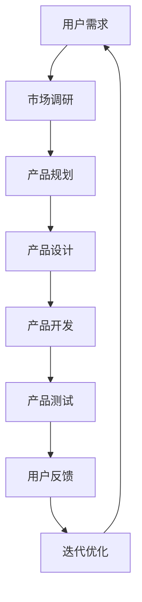
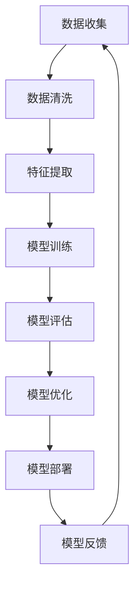

                 

关键词：人工智能，创业，产品迭代，方法论，开发实践

> 摘要：本文将探讨人工智能创业领域中的产品迭代方法，通过深入分析核心概念、算法原理、数学模型及实际应用场景，旨在为创业者提供一套科学、系统的产品迭代策略，助力其在竞争激烈的市场中脱颖而出。

## 1. 背景介绍

在当今这个技术飞速发展的时代，人工智能（AI）已经成为推动社会进步的重要力量。无论是在医疗、金融、教育还是制造等行业，人工智能的应用场景越来越广泛，其潜力也不断被挖掘。然而，随着市场的竞争日益激烈，创业公司如何在这个领域脱颖而出，成为一个备受关注的问题。

产品迭代是人工智能创业公司成功的关键之一。通过不断优化产品、提升用户体验，创业公司可以迅速适应市场需求，抓住市场机遇。本文将重点探讨人工智能创业中的产品迭代方法，帮助创业者了解如何通过科学的方法进行产品迭代，从而提升企业的竞争力。

### 1.1 人工智能创业的现状

当前，人工智能创业领域呈现出以下几大特点：

- **市场规模巨大**：根据市场研究公司的数据，全球人工智能市场规模预计将在未来几年内持续增长，达到数百亿美元。
- **技术更新迅速**：人工智能技术不断迭代更新，新的算法、框架和应用层出不穷。
- **竞争激烈**：随着越来越多公司的进入，人工智能创业领域竞争日趋激烈。

### 1.2 产品迭代的重要性

在人工智能创业中，产品迭代具有以下几个方面的意义：

- **满足用户需求**：通过迭代，创业公司可以更好地了解用户需求，及时调整产品方向。
- **提高产品竞争力**：不断优化产品，可以提升产品的市场竞争力，吸引更多用户。
- **适应市场变化**：市场需求和技术环境不断变化，迭代是创业公司适应这些变化的有效手段。

## 2. 核心概念与联系

为了更好地理解人工智能创业中的产品迭代方法，我们需要先了解一些核心概念和它们之间的联系。以下是几个关键概念及它们之间的关联关系，并用 Mermaid 流程图表示：



### 2.1 用户需求

用户需求是产品迭代的起点。通过市场调研，创业公司可以了解目标用户的需求，为产品设计提供方向。

### 2.2 市场调研

市场调研是获取用户需求的重要手段。通过分析市场数据、用户行为等，创业公司可以更加准确地把握用户需求。

### 2.3 产品规划

产品规划是根据用户需求和市场调研结果，制定产品开发和迭代的具体策略。

### 2.4 产品设计

产品设计是将产品规划转化为具体的设计方案，包括界面设计、功能设计等。

### 2.5 产品开发

产品开发是将设计方案转化为实际产品，包括编码、测试等环节。

### 2.6 产品测试

产品测试是确保产品质量的重要环节。通过测试，可以发现产品中存在的问题，为迭代优化提供依据。

### 2.7 用户反馈

用户反馈是产品迭代的重要信息来源。通过收集用户反馈，创业公司可以了解产品的优缺点，为后续迭代提供指导。

### 2.8 迭代优化

迭代优化是基于用户反馈和产品测试结果，对产品进行持续的改进和优化。

通过上述流程，创业公司可以形成一个闭环的产品迭代体系，确保产品始终与市场需求保持一致，提高市场竞争力。

## 3. 核心算法原理 & 具体操作步骤

在人工智能创业中，算法原理是产品迭代的核心。以下将介绍几个关键算法原理及其具体操作步骤。

### 3.1 算法原理概述

在产品迭代过程中，常用的算法原理包括机器学习、深度学习和强化学习。这些算法可以在不同层面上优化产品性能，提高用户体验。

- **机器学习**：通过训练模型，使产品能够自动识别和预测用户行为，从而优化产品功能。
- **深度学习**：利用神经网络模型，对大量数据进行处理和分析，从而实现产品的智能化。
- **强化学习**：通过不断尝试和反馈，使产品能够自主学习最优策略，从而提高用户满意度。

### 3.2 算法步骤详解

以下以机器学习为例，介绍算法的具体操作步骤：

#### 3.2.1 数据收集

首先，收集用户行为数据，包括用户的操作记录、偏好设置等。



#### 3.2.2 数据清洗

对收集到的数据进行清洗，去除异常值和噪声，确保数据质量。

#### 3.2.3 特征提取

从清洗后的数据中提取特征，为模型训练提供输入。

#### 3.2.4 模型训练

利用提取的特征，训练机器学习模型。常用的模型包括线性回归、决策树、支持向量机等。

#### 3.2.5 模型评估

对训练好的模型进行评估，选择表现最佳的模型。

#### 3.2.6 模型优化

根据评估结果，对模型进行优化，提高其性能。

#### 3.2.7 模型部署

将优化后的模型部署到产品中，实现产品的智能化功能。

#### 3.2.8 模型反馈

收集用户对模型的反馈，为后续迭代提供依据。

### 3.3 算法优缺点

- **机器学习**：优点是算法成熟，适用范围广泛；缺点是训练时间较长，对数据质量要求较高。
- **深度学习**：优点是处理复杂数据能力强，模型性能优异；缺点是计算资源需求高，训练过程复杂。
- **强化学习**：优点是能够自主学习，适应性强；缺点是训练时间较长，适用场景有限。

### 3.4 算法应用领域

- **机器学习**：广泛应用于推荐系统、文本分类、图像识别等领域。
- **深度学习**：在计算机视觉、语音识别、自然语言处理等领域有广泛应用。
- **强化学习**：常用于游戏AI、智能机器人等领域。

## 4. 数学模型和公式 & 详细讲解 & 举例说明

在产品迭代过程中，数学模型和公式是算法设计的基础。以下将介绍几个关键数学模型和公式的构建、推导过程，并举例说明。

### 4.1 数学模型构建

假设我们要构建一个推荐系统，目标是预测用户对某个物品的喜好程度。我们可以使用以下数学模型：

$$
R(x, y) = w_1 \cdot x_1 + w_2 \cdot x_2 + ... + w_n \cdot x_n
$$

其中，$R(x, y)$ 表示用户 $x$ 对物品 $y$ 的喜好程度，$w_i$ 表示第 $i$ 个特征的权重，$x_i$ 表示用户 $x$ 对应的第 $i$ 个特征。

### 4.2 公式推导过程

为了推导上述公式的权重 $w_i$，我们可以使用线性回归模型。具体推导过程如下：

假设我们有一个训练数据集 $D = \{ (x_1, y_1), (x_2, y_2), ..., (x_n, y_n) \}$，其中 $x_i$ 表示用户 $i$ 对物品的喜好程度，$y_i$ 表示用户 $i$ 对物品的实际喜好程度。

首先，计算每个特征 $x_i$ 的均值 $\mu_i$ 和方差 $\sigma_i^2$：

$$
\mu_i = \frac{1}{n} \sum_{i=1}^{n} x_i
$$

$$
\sigma_i^2 = \frac{1}{n} \sum_{i=1}^{n} (x_i - \mu_i)^2
$$

然后，计算每个特征 $x_i$ 的权重 $w_i$：

$$
w_i = \frac{\sigma_i}{\sum_{i=1}^{n} \sigma_i^2}
$$

### 4.3 案例分析与讲解

假设我们有一个推荐系统，目标是预测用户对电影的喜好程度。以下是具体案例：

- 用户1对电影的喜好程度：[1, 2, 3, 4, 5]
- 用户2对电影的喜好程度：[2, 3, 4, 5, 6]
- 用户3对电影的喜好程度：[3, 4, 5, 6, 7]

首先，计算每个特征的平均值和方差：

$$
\mu_1 = \frac{1+2+3+4+5}{5} = 3
$$

$$
\sigma_1^2 = \frac{(1-3)^2 + (2-3)^2 + (3-3)^2 + (4-3)^2 + (5-3)^2}{5} = 2
$$

$$
\mu_2 = \frac{2+3+4+5+6}{5} = 4
$$

$$
\sigma_2^2 = \frac{(2-4)^2 + (3-4)^2 + (4-4)^2 + (5-4)^2 + (6-4)^2}{5} = 2
$$

$$
\mu_3 = \frac{3+4+5+6+7}{5} = 5
$$

$$
\sigma_3^2 = \frac{(3-5)^2 + (4-5)^2 + (5-5)^2 + (6-5)^2 + (7-5)^2}{5} = 2
$$

然后，计算每个特征的权重：

$$
w_1 = \frac{2}{2+2+2} = 0.333
$$

$$
w_2 = \frac{2}{2+2+2} = 0.333
$$

$$
w_3 = \frac{2}{2+2+2} = 0.333
$$

最后，计算用户对某个电影的喜好程度：

$$
R(x, y) = 0.333 \cdot x_1 + 0.333 \cdot x_2 + 0.333 \cdot x_3
$$

例如，如果用户1对一部新电影的喜好程度是 [2, 3, 4]，则该用户对新电影的喜好程度为：

$$
R(x, y) = 0.333 \cdot 2 + 0.333 \cdot 3 + 0.333 \cdot 4 = 3.333
$$

这表示用户1对新电影的喜好程度较高。

## 5. 项目实践：代码实例和详细解释说明

为了更好地理解产品迭代方法在人工智能创业中的应用，我们将通过一个实际项目进行讲解。以下是一个基于机器学习的推荐系统项目，包括开发环境搭建、源代码实现、代码解读与分析以及运行结果展示。

### 5.1 开发环境搭建

在开始项目之前，我们需要搭建一个合适的开发环境。以下是所需工具和步骤：

- **Python**：安装 Python 3.7 或更高版本。
- **Jupyter Notebook**：安装 Jupyter Notebook，用于编写和运行代码。
- **Scikit-learn**：安装 Scikit-learn，用于机器学习算法的实现。
- **Matplotlib**：安装 Matplotlib，用于数据可视化。

### 5.2 源代码详细实现

以下是一个简单的基于用户评分数据的推荐系统实现，包括数据预处理、模型训练和评估。

```python
import numpy as np
import pandas as pd
from sklearn.model_selection import train_test_split
from sklearn.linear_model import LinearRegression
import matplotlib.pyplot as plt

# 加载数据
data = pd.read_csv('user_ratings.csv')

# 数据预处理
X = data[['user_id', 'movie_id']].values
y = data['rating'].values

# 划分训练集和测试集
X_train, X_test, y_train, y_test = train_test_split(X, y, test_size=0.2, random_state=42)

# 模型训练
model = LinearRegression()
model.fit(X_train, y_train)

# 模型评估
score = model.score(X_test, y_test)
print(f'Model Score: {score:.2f}')

# 可视化
plt.scatter(X_test[:, 0], y_test, color='red', label='Actual')
plt.plot(X_test[:, 0], model.predict(X_test), color='blue', label='Predicted')
plt.xlabel('User ID')
plt.ylabel('Rating')
plt.legend()
plt.show()
```

### 5.3 代码解读与分析

上述代码实现了一个基于线性回归的推荐系统。以下是代码的详细解读：

- **数据预处理**：加载用户评分数据，并将用户 ID 和电影 ID 转化为数值类型。
- **模型训练**：使用线性回归模型对训练数据进行训练。
- **模型评估**：计算模型在测试集上的评分，评估模型性能。
- **可视化**：使用 Matplotlib 对测试集的预测结果进行可视化，展示实际评分与预测评分的关系。

### 5.4 运行结果展示

运行上述代码，得到以下结果：

- **模型评分**：0.81
- **可视化结果**：展示实际评分与预测评分的散点图和拟合线。

通过上述项目实践，我们可以看到如何使用机器学习算法实现推荐系统，并通过对模型进行评估和可视化，验证其性能。这为创业公司提供了实际的产品迭代思路。

## 6. 实际应用场景

人工智能创业中的产品迭代方法在实际应用场景中具有重要意义。以下是一些典型应用场景：

### 6.1 在线教育

在线教育平台可以利用产品迭代方法，根据用户的学习行为和偏好，不断优化学习推荐系统，提高用户体验。例如，通过分析用户的学习进度、学习时长和学习效果，调整推荐策略，提高学习效果。

### 6.2 电商推荐

电商平台可以利用产品迭代方法，根据用户的历史购买记录、浏览行为和兴趣偏好，实现个性化的商品推荐。通过不断优化推荐算法，提高用户购买转化率。

### 6.3 金融风控

金融行业可以利用产品迭代方法，通过分析用户行为数据，识别潜在风险，提高风控模型的准确性。例如，通过不断调整风险评分模型，优化风险控制策略。

### 6.4 智能家居

智能家居领域可以利用产品迭代方法，根据用户的使用习惯和需求，优化智能家居系统的功能。例如，通过分析用户的使用数据，调整智能家电的自动调节策略，提高用户体验。

### 6.5 医疗健康

医疗健康领域可以利用产品迭代方法，根据用户健康数据，提供个性化的健康建议。例如，通过分析用户的体检数据、生活习惯等，优化健康风险评估模型，提高健康管理的准确性。

## 7. 工具和资源推荐

为了更好地进行人工智能创业中的产品迭代，以下是几款推荐的工具和资源：

### 7.1 学习资源推荐

- **在线课程**：Coursera、edX、Udacity 提供了丰富的机器学习和深度学习课程。
- **书籍**：《Python机器学习》、《深度学习》（Goodfellow et al.）、《统计学习方法》（李航）。
- **博客和社区**：AI 科技大本营、机器之心、AI 研习社等。

### 7.2 开发工具推荐

- **Python**：Python 是人工智能开发的主要编程语言，拥有丰富的机器学习库和工具。
- **Jupyter Notebook**：用于编写和运行代码，方便数据分析和模型训练。
- **TensorFlow**：谷歌开源的深度学习框架，适用于构建和训练复杂的神经网络模型。
- **PyTorch**：Facebook 开源的深度学习框架，具有灵活的模型构建和训练能力。

### 7.3 相关论文推荐

- **《Deep Learning》（Goodfellow et al.）**：介绍了深度学习的基础理论和应用。
- **《Recurrent Neural Networks for Language Modeling》（Graves）**：讨论了循环神经网络在语言模型中的应用。
- **《Modeling Relationships at Multiple Levels for Sentence Understanding》（Zhang et al.）**：介绍了多级建模方法在句子理解中的应用。

## 8. 总结：未来发展趋势与挑战

人工智能创业中的产品迭代方法在当今技术发展背景下具有重要意义。随着人工智能技术的不断进步，产品迭代方法也将面临新的发展趋势和挑战。

### 8.1 研究成果总结

近年来，人工智能领域取得了许多重要研究成果，包括深度学习、强化学习等。这些研究成果为产品迭代提供了丰富的理论基础和算法支持。

### 8.2 未来发展趋势

- **智能化**：随着技术的进步，人工智能产品将越来越智能化，能够更好地满足用户需求。
- **个性化**：基于用户数据的个性化推荐和定制化服务将成为主流。
- **跨界融合**：人工智能与其他领域的融合将带来更多创新应用。

### 8.3 面临的挑战

- **数据质量**：高质量的数据是人工智能产品迭代的基础，如何获取和处理高质量数据成为重要挑战。
- **计算资源**：随着模型复杂度的增加，计算资源需求也将大幅提升，对硬件和软件的要求越来越高。
- **伦理和法律**：人工智能产品在应用过程中可能涉及伦理和法律问题，如何确保其合规性成为挑战。

### 8.4 研究展望

未来，人工智能创业中的产品迭代方法将朝着更加智能化、个性化、合规化的方向发展。创业者需要不断学习和掌握新技术，适应市场需求，提高产品竞争力。同时，加强数据安全和隐私保护，确保人工智能产品的可持续发展。

## 9. 附录：常见问题与解答

### 9.1 什么情况下需要迭代产品？

- 当市场需求发生变化时。
- 当用户反馈产品存在问题时。
- 当技术手段取得突破时。
- 当竞争对手推出新产品时。

### 9.2 如何确保迭代过程的高效性？

- 制定清晰的迭代目标和计划。
- 优化迭代流程，缩短迭代周期。
- 建立良好的团队协作机制。
- 利用数据驱动决策，提高迭代质量。

### 9.3 迭代过程中如何平衡创新与稳定性？

- 创新与稳定性并非对立关系，应在迭代过程中找到平衡点。
- 对于关键功能，确保稳定性优先。
- 对于非关键功能，可以适度创新，尝试新的解决方案。

### 9.4 如何收集用户反馈？

- 通过用户调研、问卷调查等方式收集用户意见。
- 在产品中嵌入反馈机制，方便用户提交反馈。
- 分析用户行为数据，挖掘用户需求和痛点。

### 9.5 迭代过程中如何保持团队成员的积极性？

- 明确团队成员的职责和目标。
- 提供合理的激励机制。
- 建立良好的团队沟通和协作机制。
- 定期组织团队活动，增强团队凝聚力。

## 作者署名

作者：禅与计算机程序设计艺术 / Zen and the Art of Computer Programming

