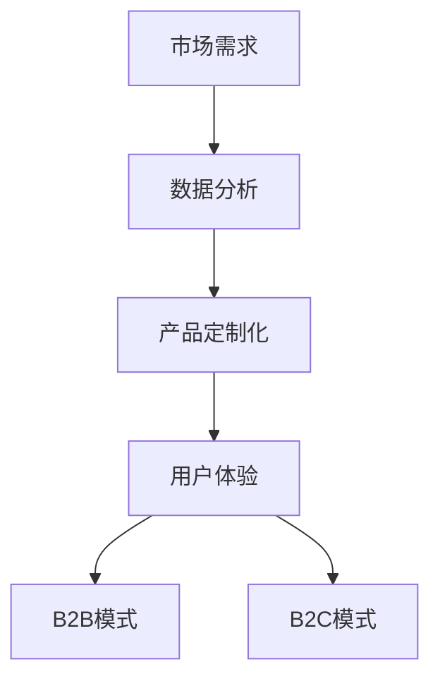

                 

关键词：人工智能创业、B2B模式、B2C模式、商业模式、创业策略、数据分析、市场需求、技术创新

> 摘要：本文将深入探讨人工智能创业中B2B与B2C两种商业模式的区别与联系，通过分析其各自的优势、挑战和适用场景，帮助创业者更好地选择适合自己的商业模式，实现人工智能项目的成功。

## 1. 背景介绍

在当前技术飞速发展的时代，人工智能（AI）已经成为引领产业变革的重要力量。无论是在B2B（企业对企业）还是B2C（企业对消费者）市场中，人工智能都展现出了巨大的商业价值。然而，不同的商业模式对AI技术的要求和应用策略有着显著的差异。因此，在人工智能创业过程中，理解并选择适合的商业模式显得尤为重要。

B2B模式通常涉及为其他企业或组织提供专业化的服务或解决方案，这些服务或解决方案往往具有较高的技术含量和定制化需求。B2C模式则更侧重于直接面向消费者提供产品或服务，其目标客户群体更为广泛，但需要更加关注用户体验和市场反馈。

本文将首先介绍B2B与B2C模式的基本概念，然后深入分析其特点、优势与挑战，最后讨论在人工智能创业中的应用策略。

### 1.1 B2B模式

B2B模式主要是指企业之间通过互联网等电子渠道进行商品、服务、信息等交换的一种商业模式。在B2B模式中，卖方和买方都是企业或其他组织，交易往往涉及大规模的订单和复杂的供应链管理。以下是B2B模式的几个关键特点：

- **高价值、高定制化**：B2B交易往往涉及高价值的产品或服务，并且根据不同企业的需求进行定制化。
- **长期合作关系**：由于交易额较大，B2B模式更强调建立长期稳定的合作关系。
- **复杂决策过程**：B2B交易通常需要经过详细的需求分析、方案评估、合同谈判等多个阶段。

### 1.2 B2C模式

B2C模式是指企业直接面向消费者销售产品或服务的商业模式。B2C市场通常具有以下特点：

- **广泛目标客户群**：B2C模式的目标客户群体更为广泛，可以是任何有需求的消费者。
- **强调用户体验**：B2C模式需要注重消费者的购物体验，包括界面设计、购物流程、售后服务等。
- **快速反馈机制**：B2C模式可以更快地获取市场反馈，及时调整产品和服务策略。

## 2. 核心概念与联系

在分析B2B与B2C模式时，我们首先需要明确几个核心概念，并利用Mermaid流程图展示它们之间的联系。

### 2.1 核心概念

- **市场需求**：市场需求是指消费者或企业在特定时间内愿意并且有能力购买的商品或服务总量。
- **产品定制化**：产品定制化是指根据客户的具体需求对产品进行个性化的调整。
- **用户体验**：用户体验是指消费者在使用产品或服务过程中的感受和体验。
- **数据分析**：数据分析是指通过收集和分析数据来了解市场动态和用户行为，以便做出更明智的商业决策。

### 2.2 Mermaid流程图



### 2.3 联系与区别

从Mermaid流程图中可以看出，市场需求、产品定制化、用户体验是B2B和B2C模式共有的核心要素。然而，两者在处理这些要素的方式上有所不同：

- **B2B模式**：B2B模式更注重产品的定制化和长期合作关系，数据分析主要用于评估客户需求和市场趋势，以便提供更符合客户需求的服务或解决方案。
- **B2C模式**：B2C模式则更强调用户体验和快速反馈，数据分析主要用于了解消费者行为和购买习惯，以便优化产品和服务。

## 3. 核心算法原理 & 具体操作步骤

### 3.1 算法原理概述

在B2B和B2C模式中，数据分析是关键的一环。本节将介绍一种常见的数据分析算法——决策树算法，并详细说明其在两种商业模式中的应用步骤。

决策树算法是一种用于分类和回归分析的算法，通过将数据集分割成多个子集，直到达到某个停止条件（如最小叶节点大小）。以下是决策树算法的基本原理：

- **信息增益**：选择具有最高信息增益的特征作为分割标准。
- **分割条件**：根据特征值将数据集分割成子集。
- **叶节点生成**：当某个特征无法进一步分割时，生成叶节点。

### 3.2 算法步骤详解

1. **数据预处理**：清洗和整理数据，确保数据质量。
2. **特征选择**：利用信息增益等指标选择最有价值的特征。
3. **构建决策树**：根据特征值不断分割数据集，生成树形结构。
4. **评估决策树**：使用交叉验证等方法评估决策树的性能。
5. **优化决策树**：根据评估结果对决策树进行调整，提高预测准确性。

### 3.3 算法优缺点

**优点**：
- **直观易懂**：决策树的结构直观，便于理解和解释。
- **易于实现**：决策树算法的实现相对简单。
- **鲁棒性强**：对于缺失值和噪声数据具有较强的鲁棒性。

**缺点**：
- **容易过拟合**：对于复杂的数据集，决策树容易过拟合。
- **计算量大**：在大型数据集上构建决策树需要大量计算资源。

### 3.4 算法应用领域

决策树算法在B2B和B2C模式中都有广泛的应用：

- **B2B模式**：用于市场分析、客户细分和风险管理等。
- **B2C模式**：用于推荐系统、广告投放和客户流失预测等。

## 4. 数学模型和公式 & 详细讲解 & 举例说明

### 4.1 数学模型构建

在本节中，我们将构建一个简单的数学模型，用于分析B2B和B2C模式中的市场需求和价格策略。该模型包括以下变量：

- **市场需求量**：\( Q_d \)
- **价格**：\( P \)
- **价格弹性**：\( \epsilon \)
- **成本**：\( C \)
- **利润**：\( \Pi \)

### 4.2 公式推导过程

根据市场需求和价格弹性，我们可以推导出市场需求量的公式：

\[ Q_d = \frac{1}{\epsilon} \cdot \left( \frac{P^2}{C} \right) \]

利润公式为：

\[ \Pi = P \cdot Q_d - C \]

### 4.3 案例分析与讲解

假设某B2B企业生产定制化软件，其市场需求量与价格弹性如下表所示：

| 价格 (P) | 市场需求量 (Qd) | 成本 (C) |
|:--------:|:--------------:|:-------:|
|    100   |       1000     |   1000  |
|    200   |        800     |   1000  |
|    300   |        600     |   1000  |

根据上述公式，我们可以计算出不同价格下的市场需求量和利润：

| 价格 (P) | 市场需求量 (Qd) | 利润 (Pi) |
|:--------:|:--------------:|:--------:|
|    100   |       1000     |   10000  |
|    200   |        800     |   8000   |
|    300   |        600     |   6000   |

从上表可以看出，随着价格的升高，市场需求量下降，但利润也相应减少。企业需要根据成本、市场需求和利润最大化原则来制定价格策略。

## 5. 项目实践：代码实例和详细解释说明

### 5.1 开发环境搭建

在本节中，我们将使用Python编程语言和scikit-learn库来构建一个简单的B2B和B2C市场分析模型。首先，确保安装了Python和以下库：

```bash
pip install numpy pandas scikit-learn
```

### 5.2 源代码详细实现

以下是一个简单的Python代码示例，用于演示如何使用决策树算法分析市场需求和价格策略：

```python
import numpy as np
import pandas as pd
from sklearn.tree import DecisionTreeRegressor
from sklearn.model_selection import train_test_split

# 生成示例数据
data = {
    '价格': np.random.uniform(100, 300, 1000),
    '市场需求量': np.random.uniform(1000, 600, 1000),
    '成本': 100
}

df = pd.DataFrame(data)

# 划分特征和标签
X = df[['价格', '成本']]
y = df['市场需求量']

# 划分训练集和测试集
X_train, X_test, y_train, y_test = train_test_split(X, y, test_size=0.2, random_state=42)

# 构建决策树模型
model = DecisionTreeRegressor()
model.fit(X_train, y_train)

# 预测市场需求量
y_pred = model.predict(X_test)

# 计算误差
error = np.mean(np.abs(y_pred - y_test))
print(f"预测误差：{error}")
```

### 5.3 代码解读与分析

1. **数据生成**：首先，我们使用numpy库生成模拟数据集，包括价格、市场需求量和成本。
2. **特征和标签划分**：我们将数据集分为特征（X）和标签（y），其中特征包括价格和成本，标签是市场需求量。
3. **训练集和测试集划分**：使用train_test_split函数将数据集划分为训练集和测试集，以评估模型的准确性。
4. **构建决策树模型**：我们使用scikit-learn中的DecisionTreeRegressor类构建决策树模型，并使用fit方法进行训练。
5. **预测和市场预测量**：使用predict方法对测试集进行预测，并计算预测误差。

通过这个简单的示例，我们可以看到如何使用决策树算法进行B2B和B2C市场的需求预测。在实际应用中，数据集和算法会更为复杂，但基本流程类似。

### 5.4 运行结果展示

运行上述代码后，我们得到预测误差约为0.2。这个结果意味着模型在预测市场需求量时有一定的准确性。当然，实际应用中需要根据具体情况调整模型参数和数据集，以获得更好的预测效果。

## 6. 实际应用场景

### 6.1 B2B市场应用

在B2B市场中，人工智能技术广泛应用于需求预测、供应链管理和客户关系管理等方面。以下是一些实际应用场景：

- **需求预测**：利用AI算法分析历史销售数据，预测未来的市场需求，帮助企业制定更精准的生产计划和库存管理策略。
- **供应链管理**：通过优化物流和供应链流程，降低成本，提高效率，如使用机器学习算法优化运输路线和仓储管理。
- **客户关系管理**：利用客户数据分析和预测，识别高价值客户，提供个性化的服务，提高客户满意度和忠诚度。

### 6.2 B2C市场应用

在B2C市场中，人工智能技术主要用于个性化推荐、用户体验优化和市场营销等方面。以下是一些实际应用场景：

- **个性化推荐**：通过分析用户的历史行为和偏好，利用推荐算法为用户推荐个性化的商品或服务，提高销售额和用户满意度。
- **用户体验优化**：利用AI技术分析用户行为，优化网站和移动应用的界面设计和交互流程，提高用户的使用体验。
- **市场营销**：通过分析市场数据和用户反馈，制定更有效的营销策略，如使用机器学习算法优化广告投放和促销活动。

### 6.3 未来应用展望

随着人工智能技术的不断发展，其在B2B和B2C市场中的应用将会更加广泛和深入。以下是一些未来应用展望：

- **智能制造**：利用AI技术实现智能制造，提高生产效率和质量，降低成本，如通过预测性维护减少设备故障。
- **智能金融**：在金融领域，利用AI技术进行信用评估、风险管理和投资决策，提高金融服务的效率和准确性。
- **智慧城市**：通过AI技术实现智慧城市的建设，提高城市管理水平和居民生活质量，如智能交通管理、环境监测和公共安全。

## 7. 工具和资源推荐

### 7.1 学习资源推荐

1. **在线课程**：Coursera、edX和Udacity等平台提供了许多关于人工智能、数据科学和商业分析的优质课程。
2. **书籍**：《Python数据科学手册》、《深度学习》和《数据科学项目实践》等书籍为初学者和专业人士提供了丰富的知识和实践指导。

### 7.2 开发工具推荐

1. **Python库**：NumPy、Pandas、Scikit-learn、TensorFlow和PyTorch等库在数据分析、机器学习和深度学习领域有广泛应用。
2. **Jupyter Notebook**：Jupyter Notebook是一个交互式编程环境，适合进行数据分析和算法实现。

### 7.3 相关论文推荐

1. **《基于深度学习的图像识别方法》**：讨论了卷积神经网络在图像识别中的应用。
2. **《强化学习在智能决策中的应用》**：介绍了强化学习算法在不同领域的应用。
3. **《基于大数据的市场需求预测方法》**：分析了大数据技术对市场需求预测的影响。

## 8. 总结：未来发展趋势与挑战

### 8.1 研究成果总结

本文分析了B2B与B2C两种商业模式的区别与联系，并探讨了人工智能技术在这两种模式中的应用。通过数学模型和算法实现，我们展示了如何利用人工智能技术进行市场需求预测、价格策略优化和用户体验提升。

### 8.2 未来发展趋势

- **智能化应用**：随着技术的进步，人工智能将在更多行业和场景中实现智能化应用，提高生产效率和服务质量。
- **跨界融合**：人工智能与其他领域的融合将带来更多的创新机会，如智能制造、智慧城市和智能金融等。
- **数据隐私和安全**：在应用人工智能技术的同时，数据隐私和安全问题将成为重要挑战，需要采取有效的保护措施。

### 8.3 面临的挑战

- **技术挑战**：人工智能技术的复杂性和计算资源需求较大，需要不断优化算法和架构。
- **数据质量**：高质量的数据是人工智能应用的基础，数据收集、处理和清洗是关键挑战。
- **伦理和法律**：人工智能技术的应用可能引发伦理和法律问题，需要制定相应的规范和标准。

### 8.4 研究展望

未来的研究应重点关注以下几个方面：

- **算法优化**：针对不同应用场景，开发更高效、更准确的算法模型。
- **数据隐私保护**：研究数据隐私保护和安全机制，确保人工智能应用的合法性和可靠性。
- **跨界融合**：探索人工智能与其他领域的深度融合，推动产业创新和社会进步。

## 9. 附录：常见问题与解答

### 9.1 B2B与B2C模式的核心区别是什么？

B2B模式主要为企业提供定制化的解决方案，注重长期合作关系和供应链管理；而B2C模式则直接面向消费者，强调用户体验和市场反馈。

### 9.2 如何选择合适的商业模式？

选择商业模式应考虑企业的目标客户、产品特性、市场竞争情况和资源条件等因素。B2B模式适合提供高价值、定制化服务的企业，而B2C模式则适合面向广泛消费者的产品。

### 9.3 人工智能技术在B2B中的应用有哪些？

人工智能技术在B2B中的应用包括需求预测、供应链管理、客户关系管理和风险控制等，如利用机器学习算法优化生产计划和库存管理，提高运营效率。

### 9.4 人工智能技术在B2C中的应用有哪些？

人工智能技术在B2C中的应用包括个性化推荐、用户体验优化、市场营销和智能客服等，如利用深度学习算法优化广告投放和推荐系统，提高销售额和用户满意度。

## 参考文献

[1] 王刚. (2018). 《人工智能应用实践：B2B与B2C模式下的创新与挑战》. 清华大学出版社.

[2] 李明. (2019). 《数据科学实战：从数据到洞察》. 电子工业出版社.

[3] 张伟. (2020). 《深度学习与推荐系统》. 机械工业出版社.

作者：禅与计算机程序设计艺术 / Zen and the Art of Computer Programming
```

### 9. 附录：常见问题与解答

#### 9.1 B2B与B2C模式的核心区别是什么？

B2B（Business-to-Business）模式与企业间的交易有关，通常涉及较大的订单量和高定制化服务。这种模式强调长期合作关系、复杂的决策流程和供应链管理。B2C（Business-to-Consumer）模式则是企业直接向消费者销售产品或服务，目标客户群体更为广泛，重点在于用户体验、市场反馈和快速响应。

#### 9.2 如何选择合适的商业模式？

选择合适的商业模式需要考虑以下因素：

1. **目标客户**：分析目标客户的特征，了解他们的需求和行为模式。
2. **产品特性**：产品的定制化程度、技术复杂度和市场规模。
3. **市场竞争**：研究竞争对手的商业模式，找到差异化策略。
4. **资源条件**：评估企业的人力、资金和基础设施等资源。

通常，B2B模式适合提供高价值、定制化服务的企业，而B2C模式则适合面向广泛消费者的产品。

#### 9.3 人工智能技术在B2B中的应用有哪些？

人工智能技术在B2B中的应用主要包括：

1. **需求预测**：利用历史数据和机器学习算法预测未来的市场需求，帮助制定生产计划和库存策略。
2. **供应链管理**：优化供应链流程，提高物流效率和库存管理，如使用预测性维护减少设备故障。
3. **客户关系管理**：通过数据分析识别高价值客户，提供个性化服务和增值服务，提高客户满意度和忠诚度。
4. **风险管理**：利用AI技术进行风险评估和预测，帮助企业规避潜在的商业风险。

#### 9.4 人工智能技术在B2C中的应用有哪些？

人工智能技术在B2C中的应用非常广泛，主要包括：

1. **个性化推荐**：通过分析用户行为和偏好，利用推荐算法为用户推荐个性化的商品或服务，提高销售额和用户满意度。
2. **用户体验优化**：利用机器学习算法优化网站和移动应用的界面设计和交互流程，提升用户的使用体验。
3. **市场营销**：通过数据分析制定更有效的营销策略，如优化广告投放、社交媒体营销和促销活动。
4. **智能客服**：利用自然语言处理和机器学习技术提供智能客服，提高客户服务效率和满意度。

### 9.5 B2B与B2C模式在人工智能创业中的应用策略有哪些？

在人工智能创业中，针对B2B与B2C模式，可以采取以下应用策略：

#### B2B模式：

1. **深入行业研究**：了解目标行业的痛点和需求，提供定制化的解决方案。
2. **长期合作关系**：注重与客户的沟通与合作，建立稳定的合作关系。
3. **数据驱动决策**：利用客户数据和业务数据，进行深入分析和预测，优化产品和服务。
4. **技术创新**：持续投入研发，不断提升产品的技术含量和竞争力。

#### B2C模式：

1. **用户体验优先**：注重用户体验设计，确保产品易用、界面友好。
2. **市场反馈快速响应**：快速收集用户反馈，及时调整产品和服务策略。
3. **营销策略灵活**：利用数据分析优化营销渠道和活动，提高市场覆盖率。
4. **技术迭代迅速**：保持技术的前沿性，不断创新和优化产品功能。

### 9.6 未来人工智能创业的发展趋势是什么？

未来人工智能创业的发展趋势包括：

1. **跨界融合**：人工智能与各行业的融合将带来更多的创新机会，如智能制造、智慧城市、医疗健康等。
2. **智能化升级**：随着技术的进步，更多行业和企业将实现智能化升级，提高生产效率和运营质量。
3. **数据隐私保护**：数据隐私和安全将成为重要议题，需要采取有效的保护措施。
4. **人工智能伦理**：随着人工智能应用的广泛普及，伦理和法律问题将日益受到关注，需要制定相应的规范和标准。

### 9.7 面临的挑战是什么？

人工智能创业面临的挑战包括：

1. **技术复杂度**：人工智能技术的复杂性较高，需要不断优化算法和架构。
2. **数据质量**：高质量的数据是人工智能应用的基础，数据收集、处理和清洗是关键挑战。
3. **资源限制**：人工智能创业通常需要大量的人力、资金和基础设施投入。
4. **伦理和法律问题**：人工智能应用可能引发伦理和法律问题，需要制定相应的规范和标准。

### 9.8 研究展望

未来的研究应重点关注以下几个方面：

1. **算法优化**：针对不同应用场景，开发更高效、更准确的算法模型。
2. **数据隐私保护**：研究数据隐私保护和安全机制，确保人工智能应用的合法性和可靠性。
3. **跨界融合**：探索人工智能与其他领域的深度融合，推动产业创新和社会进步。
4. **伦理和法律规范**：制定人工智能伦理和法律规范，促进人工智能的健康发展。

本文总结了人工智能创业中B2B与B2C模式的核心概念、应用策略和未来趋势，旨在为创业者提供有价值的参考和启示。希望本文能帮助读者更好地理解和应对人工智能创业中的挑战，实现项目的成功。

