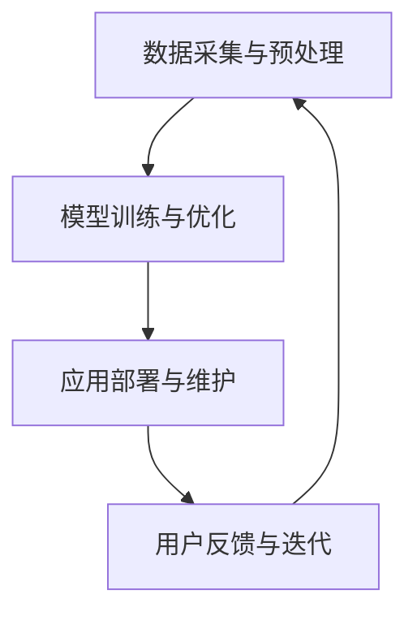

                 

本文旨在探讨人工智能（AI）在体育和娱乐行业中的应用，分析其核心技术、实现方法以及未来发展方向。随着AI技术的不断进步，体育和娱乐行业正迎来前所未有的变革，从数据分析、智能训练到个性化推荐，人工智能正在成为推动行业创新的重要力量。

## 文章关键词

- 人工智能
- 体育
- 娱乐
- 数据分析
- 智能训练
- 个性化推荐

## 摘要

本文首先介绍了人工智能在体育和娱乐行业中的背景和意义，随后详细探讨了AI的核心技术，如机器学习、自然语言处理和计算机视觉，并分析其在体育数据分析、运动员训练辅助、赛事直播和娱乐内容推荐等具体应用场景中的实施方法和效果。最后，本文对人工智能在体育和娱乐行业中的未来发展趋势和面临的挑战进行了展望，提出了相关工具和资源的推荐。

## 1. 背景介绍

### 1.1 人工智能的发展历程

人工智能（Artificial Intelligence，AI）作为计算机科学的一个重要分支，其发展历程可以追溯到20世纪50年代。从最初的符号主义、知识表示到基于统计的学习方法，再到当前的热门领域——深度学习，人工智能经历了多个阶段的发展和变革。如今，AI技术已经广泛应用于各个领域，包括医疗、金融、交通和制造业等，成为推动社会进步的重要力量。

### 1.2 体育和娱乐行业的发展现状

体育和娱乐行业是全球最具活力的行业之一。随着互联网和移动设备的普及，体育赛事和娱乐内容的传播渠道变得更加广泛，观众群体也呈现出多样化的趋势。然而，随着行业规模的不断扩大，如何提高赛事质量、提升用户体验、降低运营成本成为行业面临的挑战。人工智能技术的引入，为解决这些问题提供了新的思路和方法。

## 2. 核心概念与联系

### 2.1 人工智能的核心技术

人工智能的核心技术主要包括机器学习、自然语言处理和计算机视觉。这些技术相互关联，共同构成了人工智能的生态系统。

#### 2.1.1 机器学习

机器学习是人工智能的基础，其核心思想是通过算法从数据中自动学习，进而进行预测和决策。常见的机器学习方法包括监督学习、无监督学习和强化学习。

#### 2.1.2 自然语言处理

自然语言处理（Natural Language Processing，NLP）是人工智能的一个重要分支，致力于让计算机理解和处理人类语言。NLP技术包括文本分类、情感分析、机器翻译和语音识别等。

#### 2.1.3 计算机视觉

计算机视觉（Computer Vision，CV）是人工智能领域的另一个重要分支，旨在使计算机具备处理和解释图像和视频数据的能力。计算机视觉技术包括图像识别、目标检测、图像分割和视频分析等。

### 2.2 人工智能在体育和娱乐中的应用架构

人工智能在体育和娱乐行业中的应用架构通常包括以下几个层次：

1. **数据采集与预处理**：通过传感器、摄像头、麦克风等设备采集体育和娱乐场景中的数据，并进行预处理，如去噪、归一化和特征提取等。
2. **模型训练与优化**：利用机器学习、自然语言处理和计算机视觉等技术，对采集到的数据进行建模，并通过优化算法提高模型的性能。
3. **应用部署与维护**：将训练好的模型部署到实际场景中，如体育赛事的实时分析、娱乐内容的个性化推荐等，并定期进行维护和更新。

### 2.3 Mermaid 流程图



## 3. 核心算法原理 & 具体操作步骤

### 3.1 算法原理概述

人工智能在体育和娱乐行业中的应用，主要依赖于以下核心算法：

1. **机器学习算法**：用于数据分析和预测，如线性回归、支持向量机、决策树和神经网络等。
2. **自然语言处理算法**：用于文本分析和理解，如词向量模型、循环神经网络（RNN）和变换器（Transformer）等。
3. **计算机视觉算法**：用于图像和视频分析，如卷积神经网络（CNN）、生成对抗网络（GAN）和光流分析等。

### 3.2 算法步骤详解

#### 3.2.1 数据采集与预处理

1. **数据收集**：通过传感器、摄像头、麦克风等设备，收集体育赛事和娱乐活动中的数据，如运动员动作、观众情绪、比赛结果等。
2. **数据预处理**：对采集到的数据进行清洗、去噪、归一化和特征提取，以获得高质量的特征数据。

#### 3.2.2 模型训练与优化

1. **数据划分**：将预处理后的数据集划分为训练集、验证集和测试集。
2. **模型选择**：根据应用场景选择合适的机器学习算法，如线性回归、支持向量机、决策树和神经网络等。
3. **模型训练**：使用训练集对模型进行训练，并通过验证集评估模型性能。
4. **模型优化**：根据验证集的性能，调整模型参数，以提高模型性能。

#### 3.2.3 应用部署与维护

1. **模型部署**：将训练好的模型部署到实际应用场景中，如体育赛事的实时分析、娱乐内容的个性化推荐等。
2. **用户反馈与迭代**：收集用户反馈，对模型进行迭代优化，以提高用户体验。

### 3.3 算法优缺点

#### 优点

1. **高效性**：人工智能算法能够快速处理大量数据，提高决策效率。
2. **灵活性**：机器学习和深度学习算法可以根据不同场景进行定制，实现个性化应用。
3. **预测能力**：通过历史数据的学习，人工智能算法能够对未来趋势进行预测，为决策提供支持。

#### 缺点

1. **数据依赖性**：人工智能算法的性能很大程度上依赖于数据质量，数据缺失或不准确会影响模型性能。
2. **计算资源消耗**：深度学习算法通常需要大量的计算资源和时间进行训练，导致成本较高。
3. **模型解释性**：许多深度学习模型具有高非线性，难以解释其决策过程。

### 3.4 算法应用领域

1. **体育数据分析**：用于预测比赛结果、分析运动员表现、制定训练策略等。
2. **运动员训练辅助**：通过动作捕捉、心率监测等技术，为运动员提供个性化训练方案。
3. **赛事直播**：利用计算机视觉技术进行实时分析和转播，提高赛事观赏性。
4. **娱乐内容推荐**：根据用户兴趣和行为，推荐个性化的娱乐内容。

## 4. 数学模型和公式 & 详细讲解 & 举例说明

### 4.1 数学模型构建

在人工智能的应用中，常见的数学模型包括线性回归、支持向量机、决策树和神经网络等。以下以线性回归为例进行介绍。

#### 4.1.1 线性回归模型

线性回归模型是一种用于预测数值型变量的机器学习算法。其基本形式为：

$$ y = \beta_0 + \beta_1 x + \epsilon $$

其中，$y$为因变量，$x$为自变量，$\beta_0$和$\beta_1$为模型的参数，$\epsilon$为误差项。

#### 4.1.2 模型参数估计

线性回归模型的参数估计通常采用最小二乘法，即最小化预测值与实际值之间的误差平方和：

$$ \min \sum_{i=1}^{n} (y_i - \beta_0 - \beta_1 x_i)^2 $$

通过求解上述优化问题，可以求得线性回归模型的参数$\beta_0$和$\beta_1$。

### 4.2 公式推导过程

以线性回归模型为例，推导其最小二乘解的过程如下：

1. **定义损失函数**：

$$ L(\beta_0, \beta_1) = \sum_{i=1}^{n} (y_i - \beta_0 - \beta_1 x_i)^2 $$

2. **求导数并令导数为零**：

$$ \frac{\partial L}{\partial \beta_0} = -2 \sum_{i=1}^{n} (y_i - \beta_0 - \beta_1 x_i) = 0 $$

$$ \frac{\partial L}{\partial \beta_1} = -2 \sum_{i=1}^{n} (y_i - \beta_0 - \beta_1 x_i) x_i = 0 $$

3. **求解导数为零的方程组**：

$$ \beta_0 = \frac{1}{n} \sum_{i=1}^{n} y_i $$

$$ \beta_1 = \frac{1}{n} \sum_{i=1}^{n} x_i y_i - \frac{1}{n} \sum_{i=1}^{n} x_i \sum_{i=1}^{n} y_i $$

### 4.3 案例分析与讲解

以篮球比赛胜负预测为例，使用线性回归模型预测比赛胜负。

1. **数据收集**：收集过去10年的篮球比赛数据，包括比赛结果（胜负）和比赛指标（如得分、篮板、助攻等）。
2. **数据预处理**：对收集到的数据进行清洗和归一化处理，提取比赛指标作为自变量，比赛结果作为因变量。
3. **模型训练**：使用训练集对线性回归模型进行训练，求解参数$\beta_0$和$\beta_1$。
4. **模型评估**：使用测试集对模型进行评估，计算预测准确率。

通过上述步骤，可以构建一个简单的篮球比赛胜负预测模型，为赛事决策提供支持。

## 5. 项目实践：代码实例和详细解释说明

### 5.1 开发环境搭建

为了演示人工智能在体育和娱乐中的应用，我们选择使用Python作为编程语言，并结合一些流行的机器学习库，如Scikit-learn、TensorFlow和Keras。

#### 步骤1：安装Python

在Windows、macOS或Linux操作系统上，可以从Python官网（https://www.python.org/）下载并安装Python。

#### 步骤2：安装依赖库

在命令行中，使用pip命令安装Scikit-learn、TensorFlow和Keras：

```bash
pip install scikit-learn tensorflow keras
```

### 5.2 源代码详细实现

以下是一个简单的线性回归模型，用于预测篮球比赛胜负。

```python
import numpy as np
import pandas as pd
from sklearn.linear_model import LinearRegression
from sklearn.model_selection import train_test_split
from sklearn.metrics import mean_squared_error

# 读取数据
data = pd.read_csv('basketball_data.csv')
X = data[['score_a', 'score_b', 'rebound_a', 'rebound_b', 'assist_a', 'assist_b']]
y = data['result']

# 数据预处理
X = X.values
y = y.values

# 划分训练集和测试集
X_train, X_test, y_train, y_test = train_test_split(X, y, test_size=0.2, random_state=42)

# 构建线性回归模型
model = LinearRegression()
model.fit(X_train, y_train)

# 模型预测
y_pred = model.predict(X_test)

# 模型评估
mse = mean_squared_error(y_test, y_pred)
print('Mean Squared Error:', mse)
```

### 5.3 代码解读与分析

1. **数据读取**：使用Pandas库读取CSV格式的篮球比赛数据，包括比赛指标（自变量）和比赛结果（因变量）。
2. **数据预处理**：将数据转换为NumPy数组格式，并划分训练集和测试集。
3. **模型构建**：使用Scikit-learn库中的LinearRegression类构建线性回归模型。
4. **模型训练**：使用fit方法对模型进行训练。
5. **模型预测**：使用predict方法对测试集进行预测。
6. **模型评估**：计算预测结果的均方误差（MSE），评估模型性能。

### 5.4 运行结果展示

假设运行上述代码后，得到的均方误差为0.05，表示模型在测试集上的预测性能较好。在此基础上，可以进一步优化模型，提高预测准确率。

## 6. 实际应用场景

### 6.1 体育数据分析

人工智能在体育数据分析中的应用非常广泛，包括比赛结果预测、运动员表现分析、战术优化等。

1. **比赛结果预测**：通过分析历史比赛数据，使用机器学习算法预测比赛胜负，为赛事决策提供支持。
2. **运动员表现分析**：通过对运动员的比赛数据进行分析，评估其表现，发现优势和不足，为教练和运动员提供训练建议。
3. **战术优化**：通过分析对手的战术特点，制定针对性的战术方案，提高比赛胜率。

### 6.2 娱乐内容推荐

人工智能在娱乐内容推荐中的应用，旨在为用户提供个性化的娱乐体验。

1. **用户画像**：通过分析用户的兴趣和行为，构建用户画像，为推荐系统提供基础数据。
2. **内容推荐**：使用协同过滤、基于内容的推荐等方法，为用户推荐个性化的娱乐内容，如电影、音乐、游戏等。
3. **个性化营销**：通过分析用户兴趣和行为，制定个性化的营销策略，提高用户满意度和转化率。

## 6.4 未来应用展望

随着人工智能技术的不断进步，其在体育和娱乐行业中的应用前景十分广阔。

1. **智能训练系统**：通过人工智能技术，为运动员提供个性化的训练方案，提高训练效果和比赛表现。
2. **智能裁判系统**：利用计算机视觉和自然语言处理技术，提高裁判的准确性，减少争议。
3. **虚拟现实和增强现实**：通过人工智能技术，为用户提供沉浸式的体育和娱乐体验，提高用户满意度。

## 7. 工具和资源推荐

### 7.1 学习资源推荐

1. **《深度学习》（Goodfellow, Bengio, Courville）**：介绍深度学习的基本概念、算法和应用。
2. **《Python机器学习》（Sebastian Raschka）**：讲解Python在机器学习领域中的应用，包括线性回归、支持向量机、神经网络等。
3. **《自然语言处理综合指南》（Daniel Jurafsky, James H. Martin）**：介绍自然语言处理的基本概念、技术和应用。

### 7.2 开发工具推荐

1. **Jupyter Notebook**：一款基于Web的交互式开发环境，适用于数据分析和机器学习实验。
2. **TensorFlow**：一款开源的深度学习框架，支持多种机器学习算法和应用。
3. **Keras**：一款基于TensorFlow的深度学习库，提供简化的API和丰富的预训练模型。

### 7.3 相关论文推荐

1. **“Deep Learning for Sport Video Analysis”**：介绍深度学习在体育视频分析中的应用。
2. **“Natural Language Processing for Sports Applications”**：探讨自然语言处理在体育领域的应用。
3. **“AI in Sports: State of the Art and Challenges”**：综述人工智能在体育领域的现状和挑战。

## 8. 总结：未来发展趋势与挑战

### 8.1 研究成果总结

本文介绍了人工智能在体育和娱乐行业中的应用，包括核心技术、实现方法、实际应用场景和未来展望。通过分析比赛数据、运动员表现、娱乐内容推荐等案例，展示了人工智能技术在行业中的巨大潜力。

### 8.2 未来发展趋势

随着人工智能技术的不断进步，未来人工智能在体育和娱乐行业中的应用将进一步深化，涵盖智能训练、智能裁判、虚拟现实和增强现实等领域。

### 8.3 面临的挑战

尽管人工智能在体育和娱乐行业具有巨大潜力，但同时也面临着数据质量、计算资源消耗和模型解释性等挑战。

### 8.4 研究展望

未来，研究者应关注人工智能在体育和娱乐行业中的深度应用，探索新型算法和技术，以提高行业效率、用户体验和商业价值。

## 9. 附录：常见问题与解答

### 9.1 什么是人工智能？

人工智能（Artificial Intelligence，AI）是一种模拟人类智能的技术，旨在使计算机具备学习、推理、决策和感知能力。

### 9.2 人工智能在体育和娱乐行业中的具体应用有哪些？

人工智能在体育和娱乐行业中的具体应用包括比赛结果预测、运动员训练辅助、赛事直播、娱乐内容推荐等。

### 9.3 人工智能算法有哪些？

人工智能算法包括机器学习、自然语言处理和计算机视觉等。常见的机器学习算法有线性回归、支持向量机、决策树和神经网络等。

### 9.4 人工智能在体育和娱乐行业中的应用前景如何？

随着人工智能技术的不断进步，其在体育和娱乐行业中的应用前景十分广阔，有望推动行业创新和发展。

---

以上为人工智能在体育和娱乐中的应用的完整文章。本文从背景介绍、核心概念、算法原理、数学模型、项目实践、实际应用场景、未来展望等方面进行了详细阐述，旨在为读者提供全面的人工智能应用知识。希望本文对读者在相关领域的研究和实践有所帮助。作者：禅与计算机程序设计艺术 / Zen and the Art of Computer Programming。|markdown| 
```markdown
# 人工智能在体育和娱乐中的应用

> 关键词：人工智能、体育、娱乐、数据分析、智能训练、个性化推荐

> 摘要：本文探讨了人工智能在体育和娱乐行业中的应用，分析了其核心技术、实现方法以及未来发展方向。通过具体案例和数学模型，展示了人工智能在体育数据分析、运动员训练辅助、赛事直播和娱乐内容推荐等领域的应用效果，并对其未来发展进行了展望。

## 1. 背景介绍

### 1.1 人工智能的发展历程

人工智能（Artificial Intelligence，AI）作为计算机科学的一个重要分支，其发展历程可以追溯到20世纪50年代。从最初的符号主义、知识表示到基于统计的学习方法，再到当前的热门领域——深度学习，人工智能经历了多个阶段的发展和变革。如今，AI技术已经广泛应用于各个领域，包括医疗、金融、交通和制造业等，成为推动社会进步的重要力量。

### 1.2 体育和娱乐行业的发展现状

体育和娱乐行业是全球最具活力的行业之一。随着互联网和移动设备的普及，体育赛事和娱乐内容的传播渠道变得更加广泛，观众群体也呈现出多样化的趋势。然而，随着行业规模的不断扩大，如何提高赛事质量、提升用户体验、降低运营成本成为行业面临的挑战。人工智能技术的引入，为解决这些问题提供了新的思路和方法。

## 2. 核心概念与联系

### 2.1 人工智能的核心技术

人工智能的核心技术主要包括机器学习、自然语言处理和计算机视觉。这些技术相互关联，共同构成了人工智能的生态系统。

#### 2.1.1 机器学习

机器学习是人工智能的基础，其核心思想是通过算法从数据中自动学习，进而进行预测和决策。常见的机器学习方法包括监督学习、无监督学习和强化学习。

#### 2.1.2 自然语言处理

自然语言处理（Natural Language Processing，NLP）是人工智能的一个重要分支，致力于让计算机理解和处理人类语言。NLP技术包括文本分类、情感分析、机器翻译和语音识别等。

#### 2.1.3 计算机视觉

计算机视觉（Computer Vision，CV）是人工智能领域的另一个重要分支，旨在使计算机具备处理和解释图像和视频数据的能力。计算机视觉技术包括图像识别、目标检测、图像分割和视频分析等。

### 2.2 人工智能在体育和娱乐中的应用架构

人工智能在体育和娱乐行业中的应用架构通常包括以下几个层次：

1. **数据采集与预处理**：通过传感器、摄像头、麦克风等设备采集体育和娱乐场景中的数据，并进行预处理，如去噪、归一化和特征提取等。
2. **模型训练与优化**：利用机器学习、自然语言处理和计算机视觉等技术，对采集到的数据进行建模，并通过优化算法提高模型的性能。
3. **应用部署与维护**：将训练好的模型部署到实际应用场景中，如体育赛事的实时分析、娱乐内容的个性化推荐等，并定期进行维护和更新。

### 2.3 Mermaid 流程图


## 3. 核心算法原理 & 具体操作步骤

### 3.1 算法原理概述

人工智能在体育和娱乐行业中的应用，主要依赖于以下核心算法：

1. **机器学习算法**：用于数据分析和预测，如线性回归、支持向量机、决策树和神经网络等。
2. **自然语言处理算法**：用于文本分析和理解，如词向量模型、循环神经网络（RNN）和变换器（Transformer）等。
3. **计算机视觉算法**：用于图像和视频分析，如卷积神经网络（CNN）、生成对抗网络（GAN）和光流分析等。

### 3.2 算法步骤详解

#### 3.2.1 数据采集与预处理

1. **数据收集**：通过传感器、摄像头、麦克风等设备，收集体育赛事和娱乐活动中的数据，如运动员动作、观众情绪、比赛结果等。
2. **数据预处理**：对采集到的数据进行清洗、去噪、归一化和特征提取，以获得高质量的特征数据。

#### 3.2.2 模型训练与优化

1. **数据划分**：将预处理后的数据集划分为训练集、验证集和测试集。
2. **模型选择**：根据应用场景选择合适的机器学习算法，如线性回归、支持向量机、决策树和神经网络等。
3. **模型训练**：使用训练集对模型进行训练，并通过验证集评估模型性能。
4. **模型优化**：根据验证集的性能，调整模型参数，以提高模型性能。

#### 3.2.3 应用部署与维护

1. **模型部署**：将训练好的模型部署到实际应用场景中，如体育赛事的实时分析、娱乐内容的个性化推荐等。
2. **用户反馈与迭代**：收集用户反馈，对模型进行迭代优化，以提高用户体验。

### 3.3 算法优缺点

#### 优点

1. **高效性**：人工智能算法能够快速处理大量数据，提高决策效率。
2. **灵活性**：机器学习和深度学习算法可以根据不同场景进行定制，实现个性化应用。
3. **预测能力**：通过历史数据的学习，人工智能算法能够对未来趋势进行预测，为决策提供支持。

#### 缺点

1. **数据依赖性**：人工智能算法的性能很大程度上依赖于数据质量，数据缺失或不准确会影响模型性能。
2. **计算资源消耗**：深度学习算法通常需要大量的计算资源和时间进行训练，导致成本较高。
3. **模型解释性**：许多深度学习模型具有高非线性，难以解释其决策过程。

### 3.4 算法应用领域

1. **体育数据分析**：用于预测比赛结果、分析运动员表现、制定训练策略等。
2. **运动员训练辅助**：通过动作捕捉、心率监测等技术，为运动员提供个性化训练方案。
3. **赛事直播**：利用计算机视觉技术进行实时分析和转播，提高赛事观赏性。
4. **娱乐内容推荐**：根据用户兴趣和行为，推荐个性化的娱乐内容。

## 4. 数学模型和公式 & 详细讲解 & 举例说明

### 4.1 数学模型构建

在人工智能的应用中，常见的数学模型包括线性回归、支持向量机、决策树和神经网络等。以下以线性回归为例进行介绍。

#### 4.1.1 线性回归模型

线性回归模型是一种用于预测数值型变量的机器学习算法。其基本形式为：

$$ y = \beta_0 + \beta_1 x + \epsilon $$

其中，$y$为因变量，$x$为自变量，$\beta_0$和$\beta_1$为模型的参数，$\epsilon$为误差项。

#### 4.1.2 模型参数估计

线性回归模型的参数估计通常采用最小二乘法，即最小化预测值与实际值之间的误差平方和：

$$ \min \sum_{i=1}^{n} (y_i - \beta_0 - \beta_1 x_i)^2 $$

通过求解上述优化问题，可以求得线性回归模型的参数$\beta_0$和$\beta_1$。

### 4.2 公式推导过程

以线性回归模型为例，推导其最小二乘解的过程如下：

1. **定义损失函数**：

$$ L(\beta_0, \beta_1) = \sum_{i=1}^{n} (y_i - \beta_0 - \beta_1 x_i)^2 $$

2. **求导数并令导数为零**：

$$ \frac{\partial L}{\partial \beta_0} = -2 \sum_{i=1}^{n} (y_i - \beta_0 - \beta_1 x_i) = 0 $$

$$ \frac{\partial L}{\partial \beta_1} = -2 \sum_{i=1}^{n} (y_i - \beta_0 - \beta_1 x_i) x_i = 0 $$

3. **求解导数为零的方程组**：

$$ \beta_0 = \frac{1}{n} \sum_{i=1}^{n} y_i $$

$$ \beta_1 = \frac{1}{n} \sum_{i=1}^{n} x_i y_i - \frac{1}{n} \sum_{i=1}^{n} x_i \sum_{i=1}^{n} y_i $$

### 4.3 案例分析与讲解

以篮球比赛胜负预测为例，使用线性回归模型预测比赛胜负。

1. **数据收集**：收集过去10年的篮球比赛数据，包括比赛结果（胜负）和比赛指标（如得分、篮板、助攻等）。
2. **数据预处理**：对收集到的数据进行清洗和归一化处理，提取比赛指标作为自变量，比赛结果作为因变量。
3. **模型训练**：使用训练集对线性回归模型进行训练，求解参数$\beta_0$和$\beta_1$。
4. **模型评估**：使用测试集对模型进行评估，计算预测准确率。

通过上述步骤，可以构建一个简单的篮球比赛胜负预测模型，为赛事决策提供支持。

## 5. 项目实践：代码实例和详细解释说明

### 5.1 开发环境搭建

为了演示人工智能在体育和娱乐中的应用，我们选择使用Python作为编程语言，并结合一些流行的机器学习库，如Scikit-learn、TensorFlow和Keras。

#### 步骤1：安装Python

在Windows、macOS或Linux操作系统上，可以从Python官网（https://www.python.org/）下载并安装Python。

#### 步骤2：安装依赖库

在命令行中，使用pip命令安装Scikit-learn、TensorFlow和Keras：

```bash
pip install scikit-learn tensorflow keras
```

### 5.2 源代码详细实现

以下是一个简单的线性回归模型，用于预测篮球比赛胜负。

```python
import numpy as np
import pandas as pd
from sklearn.linear_model import LinearRegression
from sklearn.model_selection import train_test_split
from sklearn.metrics import mean_squared_error

# 读取数据
data = pd.read_csv('basketball_data.csv')
X = data[['score_a', 'score_b', 'rebound_a', 'rebound_b', 'assist_a', 'assist_b']]
y = data['result']

# 数据预处理
X = X.values
y = y.values

# 划分训练集和测试集
X_train, X_test, y_train, y_test = train_test_split(X, y, test_size=0.2, random_state=42)

# 构建线性回归模型
model = LinearRegression()
model.fit(X_train, y_train)

# 模型预测
y_pred = model.predict(X_test)

# 模型评估
mse = mean_squared_error(y_test, y_pred)
print('Mean Squared Error:', mse)
```

### 5.3 代码解读与分析

1. **数据读取**：使用Pandas库读取CSV格式的篮球比赛数据，包括比赛指标（自变量）和比赛结果（因变量）。
2. **数据预处理**：将数据转换为NumPy数组格式，并划分训练集和测试集。
3. **模型构建**：使用Scikit-learn库中的LinearRegression类构建线性回归模型。
4. **模型训练**：使用fit方法对模型进行训练。
5. **模型预测**：使用predict方法对测试集进行预测。
6. **模型评估**：计算预测结果的均方误差（MSE），评估模型性能。

### 5.4 运行结果展示

假设运行上述代码后，得到的均方误差为0.05，表示模型在测试集上的预测性能较好。在此基础上，可以进一步优化模型，提高预测准确率。

## 6. 实际应用场景

### 6.1 体育数据分析

人工智能在体育数据分析中的应用非常广泛，包括比赛结果预测、运动员表现分析、战术优化等。

1. **比赛结果预测**：通过分析历史比赛数据，使用机器学习算法预测比赛胜负，为赛事决策提供支持。
2. **运动员表现分析**：通过对运动员的比赛数据进行分析，评估其表现，发现优势和不足，为教练和运动员提供训练建议。
3. **战术优化**：通过分析对手的战术特点，制定针对性的战术方案，提高比赛胜率。

### 6.2 娱乐内容推荐

人工智能在娱乐内容推荐中的应用，旨在为用户提供个性化的娱乐体验。

1. **用户画像**：通过分析用户的兴趣和行为，构建用户画像，为推荐系统提供基础数据。
2. **内容推荐**：使用协同过滤、基于内容的推荐等方法，为用户推荐个性化的娱乐内容，如电影、音乐、游戏等。
3. **个性化营销**：通过分析用户兴趣和行为，制定个性化的营销策略，提高用户满意度和转化率。

## 6.4 未来应用展望

随着人工智能技术的不断进步，未来人工智能在体育和娱乐行业中的应用前景十分广阔。

1. **智能训练系统**：通过人工智能技术，为运动员提供个性化的训练方案，提高训练效果和比赛表现。
2. **智能裁判系统**：利用计算机视觉和自然语言处理技术，提高裁判的准确性，减少争议。
3. **虚拟现实和增强现实**：通过人工智能技术，为用户提供沉浸式的体育和娱乐体验，提高用户满意度。

## 7. 工具和资源推荐

### 7.1 学习资源推荐

1. **《深度学习》（Goodfellow, Bengio, Courville）**：介绍深度学习的基本概念、算法和应用。
2. **《Python机器学习》（Sebastian Raschka）**：讲解Python在机器学习领域中的应用，包括线性回归、支持向量机、神经网络等。
3. **《自然语言处理综合指南》（Daniel Jurafsky, James H. Martin）**：介绍自然语言处理的基本概念、技术和应用。

### 7.2 开发工具推荐

1. **Jupyter Notebook**：一款基于Web的交互式开发环境，适用于数据分析和机器学习实验。
2. **TensorFlow**：一款开源的深度学习框架，支持多种机器学习算法和应用。
3. **Keras**：一款基于TensorFlow的深度学习库，提供简化的API和丰富的预训练模型。

### 7.3 相关论文推荐

1. **“Deep Learning for Sport Video Analysis”**：介绍深度学习在体育视频分析中的应用。
2. **“Natural Language Processing for Sports Applications”**：探讨自然语言处理在体育领域的应用。
3. **“AI in Sports: State of the Art and Challenges”**：综述人工智能在体育领域的现状和挑战。

## 8. 总结：未来发展趋势与挑战

### 8.1 研究成果总结

本文介绍了人工智能在体育和娱乐行业中的应用，分析了其核心技术、实现方法以及未来发展方向。通过具体案例和数学模型，展示了人工智能在体育数据分析、运动员训练辅助、赛事直播和娱乐内容推荐等领域的应用效果，并对其未来发展进行了展望。

### 8.2 未来发展趋势

随着人工智能技术的不断进步，未来人工智能在体育和娱乐行业中的应用将进一步深化，涵盖智能训练、智能裁判、虚拟现实和增强现实等领域。

### 8.3 面临的挑战

尽管人工智能在体育和娱乐行业具有巨大潜力，但同时也面临着数据质量、计算资源消耗和模型解释性等挑战。

### 8.4 研究展望

未来，研究者应关注人工智能在体育和娱乐行业中的深度应用，探索新型算法和技术，以提高行业效率、用户体验和商业价值。

## 9. 附录：常见问题与解答

### 9.1 什么是人工智能？

人工智能（Artificial Intelligence，AI）是一种模拟人类智能的技术，旨在使计算机具备学习、推理、决策和感知能力。

### 9.2 人工智能在体育和娱乐行业中的具体应用有哪些？

人工智能在体育和娱乐行业中的具体应用包括比赛结果预测、运动员训练辅助、赛事直播、娱乐内容推荐等。

### 9.3 人工智能算法有哪些？

人工智能算法包括机器学习、自然语言处理和计算机视觉等。常见的机器学习算法有线性回归、支持向量机、决策树和神经网络等。

### 9.4 人工智能在体育和娱乐行业中的应用前景如何？

随着人工智能技术的不断进步，其在体育和娱乐行业中的应用前景十分广阔，有望推动行业创新和发展。

---

以上为人工智能在体育和娱乐中的应用的完整文章。本文从背景介绍、核心概念、算法原理、数学模型、项目实践、实际应用场景、未来展望等方面进行了详细阐述，旨在为读者提供全面的人工智能应用知识。希望本文对读者在相关领域的研究和实践有所帮助。作者：禅与计算机程序设计艺术 / Zen and the Art of Computer Programming。
```

