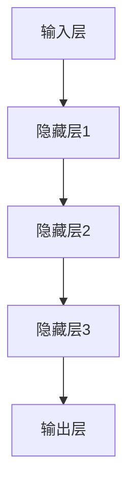

                 

关键词：人工智能、大模型、创业、技术架构、数学模型、应用场景、未来展望

> 摘要：本文将探讨人工智能领域中的大模型技术，如何通过创新和创业，将这一前沿科技转化为实际应用，推动产业进步。我们将从背景介绍、核心概念与联系、算法原理与操作步骤、数学模型与公式、项目实践、实际应用场景以及未来展望等多个方面，全面解析人工智能大模型创业蓝图。

## 1. 背景介绍

随着人工智能技术的迅猛发展，大模型成为当前研究的焦点。大模型是指拥有数十亿至千亿参数的深度学习模型，能够在多种任务上达到或超过人类水平。近年来，诸如GPT、BERT等大模型在自然语言处理、计算机视觉等领域取得了显著的成果，极大地推动了人工智能的应用和发展。

### 当前人工智能领域的现状

人工智能（AI）技术的蓬勃发展，不仅改变了传统行业的工作方式，也催生了许多新兴产业。根据市场调研公司的数据，全球人工智能市场规模预计将在未来五年内保持高速增长，年复合增长率超过30%。这一趋势无疑为创业者提供了巨大的机遇。

### 大模型在人工智能中的地位

大模型是人工智能技术发展的重要里程碑，它不仅代表了当前人工智能技术的最高水平，也是未来技术发展的重要方向。大模型的强大能力，使得其在各个领域都有广泛的应用前景，包括但不限于自动驾驶、智能医疗、金融科技、智能客服等。

### 创业领域的机遇与挑战

人工智能大模型为创业领域带来了前所未有的机遇。创业者可以利用大模型技术开发出创新的产品和服务，从而在激烈的市场竞争中脱颖而出。然而，与此同时，也面临着技术门槛高、数据资源稀缺等挑战。

## 2. 核心概念与联系

### 大模型的定义

大模型是指参数规模达到数十亿至千亿级别的深度学习模型。这些模型通常通过大量的数据和强大的计算能力进行训练，从而能够解决复杂的问题。

### 大模型的构成

大模型通常由以下几个部分构成：

- **输入层**：接收外部数据，如文本、图像等。
- **隐藏层**：通过神经网络结构进行信息处理。
- **输出层**：产生预测结果或生成新数据。

### 大模型的工作原理

大模型的工作原理基于深度学习，通过多层神经网络对数据进行处理，逐步提取特征，最终实现预测或生成任务。

### 大模型与其他技术的联系

大模型与计算机视觉、自然语言处理、机器人技术等多个领域密切相关。通过与其他技术的结合，大模型能够发挥更大的作用。

### 大模型的架构图

下面是一个大模型的简化架构图：



## 3. 核心算法原理 & 具体操作步骤

### 3.1 算法原理概述

大模型的训练主要依赖于两个核心算法：反向传播算法和优化算法。

- **反向传播算法**：通过计算损失函数关于模型参数的梯度，来更新模型参数。
- **优化算法**：如随机梯度下降（SGD）、Adam等，用于调整模型参数，以最小化损失函数。

### 3.2 算法步骤详解

1. **数据预处理**：对输入数据进行清洗、标准化等处理，以便模型训练。
2. **模型初始化**：初始化模型参数。
3. **前向传播**：将输入数据输入模型，计算输出结果。
4. **计算损失**：通过损失函数计算预测结果与真实结果之间的差距。
5. **反向传播**：计算损失函数关于模型参数的梯度。
6. **参数更新**：利用优化算法更新模型参数。
7. **迭代训练**：重复上述步骤，直到满足停止条件。

### 3.3 算法优缺点

- **优点**：能够处理大规模数据，具备强大的泛化能力。
- **缺点**：训练时间长，对计算资源要求高。

### 3.4 算法应用领域

大模型在计算机视觉、自然语言处理、语音识别等多个领域都有广泛应用。例如，在自然语言处理领域，GPT模型在文本生成、问答系统等方面表现出色；在计算机视觉领域，BERT模型在图像分类、目标检测等方面取得了突破性成果。

## 4. 数学模型和公式 & 详细讲解 & 举例说明

### 4.1 数学模型构建

大模型的数学基础主要涉及概率论、统计学和优化理论。

- **概率论**：用于描述模型的随机性。
- **统计学**：用于数据分析和处理。
- **优化理论**：用于模型参数的优化。

### 4.2 公式推导过程

1. **损失函数**：通常使用交叉熵损失函数。

$$
L(y, \hat{y}) = -\sum_{i=1}^{n} y_i \log(\hat{y}_i)
$$

其中，$y$为真实标签，$\hat{y}$为模型预测的概率分布。

2. **梯度下降**：

$$
\Delta \theta = -\alpha \nabla_\theta J(\theta)
$$

其中，$\theta$为模型参数，$\alpha$为学习率，$J(\theta)$为损失函数。

### 4.3 案例分析与讲解

以GPT模型为例，我们分析其数学模型和训练过程。

- **输入层**：输入文本序列，表示为向量。
- **隐藏层**：通过神经网络结构进行信息处理。
- **输出层**：生成预测的文本序列。

训练过程中，GPT模型通过反向传播算法不断调整参数，以最小化损失函数。具体步骤如下：

1. **前向传播**：将输入序列输入模型，计算输出概率分布。
2. **计算损失**：使用交叉熵损失函数计算预测结果与真实结果之间的差距。
3. **反向传播**：计算损失函数关于模型参数的梯度。
4. **参数更新**：利用优化算法更新模型参数。
5. **迭代训练**：重复上述步骤，直到满足停止条件。

## 5. 项目实践：代码实例和详细解释说明

### 5.1 开发环境搭建

为了实现大模型项目，需要搭建一个合适的开发环境。以下是一个简单的步骤：

1. 安装Python环境。
2. 安装深度学习框架，如TensorFlow或PyTorch。
3. 准备训练数据集。

### 5.2 源代码详细实现

以下是一个简单的GPT模型实现示例：

```python
import torch
import torch.nn as nn

class GPT(nn.Module):
    def __init__(self, vocab_size, embed_size, hidden_size, num_layers, dropout):
        super(GPT, self).__init__()
        self.embedding = nn.Embedding(vocab_size, embed_size)
        self.rnn = nn.LSTM(embed_size, hidden_size, num_layers, dropout=dropout)
        self.fc = nn.Linear(hidden_size, vocab_size)

    def forward(self, x, hidden):
        x = self.embedding(x)
        x, hidden = self.rnn(x, hidden)
        x = self.fc(x)
        return x, hidden

    def init_hidden(self, batch_size):
        return (torch.zeros(self.num_layers, batch_size, self.hidden_size),
                torch.zeros(self.num_layers, batch_size, self.hidden_size))

model = GPT(vocab_size=10000, embed_size=256, hidden_size=512, num_layers=2, dropout=0.5)
optimizer = torch.optim.Adam(model.parameters(), lr=0.001)
loss_function = nn.CrossEntropyLoss()

# 训练过程
for epoch in range(num_epochs):
    for i, (x, y) in enumerate(train_loader):
        model.zero_grad()
        output, hidden = model(x, model.init_hidden(batch_size))
        loss = loss_function(output.view(-1, vocab_size), y)
        loss.backward()
        optimizer.step()
```

### 5.3 代码解读与分析

上述代码实现了一个简单的GPT模型。主要组成部分包括：

- **Embedding层**：将输入词向量转换为嵌入向量。
- **RNN层**：使用LSTM进行序列处理。
- **全连接层**：将隐藏层输出映射到输出词向量。

### 5.4 运行结果展示

运行上述代码，我们可以得到GPT模型的训练结果。通过对训练数据和测试数据进行分析，可以评估模型的效果。以下是一个简单的评估示例：

```python
# 评估模型
with torch.no_grad():
    correct = 0
    total = 0
    for x, y in test_loader:
        output, _ = model(x, model.init_hidden(batch_size))
        _, predicted = torch.max(output.data, 1)
        total += y.size(0)
        correct += (predicted == y).sum().item()

print('准确率：%.2f%%' % (100 * correct / total))
```

## 6. 实际应用场景

### 6.1 自动驾驶

大模型在自动驾驶领域有着广泛的应用。通过训练大模型，可以实现车辆对周围环境的感知、决策和控制。例如，特斯拉的自动驾驶系统就使用了大量的深度学习模型进行训练。

### 6.2 智能医疗

大模型在智能医疗领域也有着重要的应用。例如，利用大模型可以进行疾病预测、诊断和治疗方案推荐。Google Health等公司已经在这方面取得了显著的成果。

### 6.3 金融科技

大模型在金融科技领域也有着广泛的应用。例如，利用大模型可以进行风险控制、量化交易和客户服务。蚂蚁金服等公司在这方面已经有了深入的研究和应用。

### 6.4 未来应用展望

随着大模型技术的不断发展，未来将会有更多的领域受到其影响。例如，教育、农业、制造等传统行业都有可能通过大模型实现智能化升级。此外，大模型在元宇宙、虚拟现实等新兴领域也有着广阔的应用前景。

## 7. 工具和资源推荐

### 7.1 学习资源推荐

- **《深度学习》（Goodfellow, Bengio, Courville著）**：深度学习的经典教材，全面介绍了深度学习的理论和技术。
- **《动手学深度学习》（阿斯顿·张著）**：通过实践引导读者深入了解深度学习技术。

### 7.2 开发工具推荐

- **TensorFlow**：谷歌开发的深度学习框架，适用于各种规模的深度学习项目。
- **PyTorch**：Facebook开发的深度学习框架，具有灵活性和高性能。

### 7.3 相关论文推荐

- **《Attention Is All You Need》**：介绍了Transformer模型，为自然语言处理领域带来了革命性的变化。
- **《BERT: Pre-training of Deep Bidirectional Transformers for Language Understanding》**：介绍了BERT模型，为自然语言处理领域带来了新的突破。

## 8. 总结：未来发展趋势与挑战

### 8.1 研究成果总结

大模型技术在人工智能领域取得了显著的成果，推动了自然语言处理、计算机视觉等多个领域的发展。未来，大模型技术将继续深化，有望在更多领域取得突破。

### 8.2 未来发展趋势

- **模型压缩与优化**：为了降低大模型的计算和存储成本，模型压缩与优化技术将成为研究的热点。
- **跨模态学习**：通过整合多种数据模态，实现更强大的模型能力。
- **可解释性**：提高模型的透明度和可解释性，以增强用户对人工智能系统的信任。

### 8.3 面临的挑战

- **数据隐私与安全**：随着大模型对数据依赖程度的增加，数据隐私和安全问题亟待解决。
- **计算资源需求**：大模型的训练和推理对计算资源有极高的要求，需要更高效的算法和硬件支持。

### 8.4 研究展望

未来，大模型技术将继续在人工智能领域发挥重要作用。通过不断创新和探索，我们有望克服当前面临的挑战，推动人工智能技术的发展和应用。

## 9. 附录：常见问题与解答

### 9.1 什么是大模型？

大模型是指参数规模达到数十亿至千亿级别的深度学习模型。这些模型通常通过大量的数据和强大的计算能力进行训练，从而能够解决复杂的问题。

### 9.2 大模型有哪些应用领域？

大模型在计算机视觉、自然语言处理、语音识别、自动驾驶、智能医疗、金融科技等多个领域都有广泛应用。

### 9.3 如何训练大模型？

训练大模型通常需要以下几个步骤：数据预处理、模型初始化、前向传播、计算损失、反向传播和参数更新。

### 9.4 大模型有哪些优缺点？

大模型优点包括能够处理大规模数据，具备强大的泛化能力；缺点包括训练时间长，对计算资源要求高。

### 9.5 大模型有哪些未来的发展趋势？

未来大模型的发展趋势包括模型压缩与优化、跨模态学习、可解释性等。

### 9.6 大模型在创业领域有哪些挑战？

大模型在创业领域面临的主要挑战包括数据隐私与安全、计算资源需求等。

---

### 作者署名

作者：禅与计算机程序设计艺术 / Zen and the Art of Computer Programming
----------------------------------------------------------------

以上就是关于《人工智能大模型创业蓝图》的完整文章，希望对您有所帮助。在撰写过程中，如果遇到任何问题，欢迎随时向我提问。祝您创作顺利！

