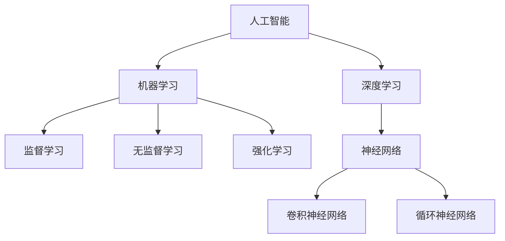

                 

 在人工智能（AI）的发展历程中，术语的提出和使用不仅反映了技术的进步，也标志着学术和工业界的共识和演进。本文旨在回顾一些关键的人工智能术语的首次提出，探讨它们背后的核心概念及其对人工智能领域的影响。

> 关键词：人工智能术语，首次提出，核心概念，技术进步，学术共识

## 摘要

本文将回顾人工智能领域的一些重要术语，包括“人工智能”（Artificial Intelligence）、“机器学习”（Machine Learning）、“深度学习”（Deep Learning）等，并探讨它们首次提出时的背景、核心概念以及它们对人工智能领域的影响。通过对这些术语的深入分析，我们可以更好地理解人工智能的发展脉络和未来趋势。

## 1. 背景介绍

人工智能（Artificial Intelligence，AI）作为计算机科学的一个重要分支，自20世纪50年代以来经历了多个发展阶段。早期的AI研究主要集中在规则推理和知识表示上，而随着计算能力和算法的进步，机器学习（Machine Learning，ML）和深度学习（Deep Learning，DL）逐渐成为AI的核心技术。

### 1.1 人工智能的起源

1956年，达特茅斯会议被认为是人工智能正式诞生的标志。会议的发起人约翰·麦卡锡（John McCarthy）首次提出了“人工智能”这一术语。他认为，人工智能是指使计算机能够表现出类似于人类智能的行为，包括理解语言、学习、推理和解决问题等。

### 1.2 机器学习的提出

1959年，阿伦·森弗（Arthur Samuel）首次提出了“机器学习”这一术语。他在研究如何让计算机通过大量数据自我改进时，意识到机器学习的重要性。机器学习是AI的一个重要分支，它通过算法让计算机从数据中学习，并逐步提高其性能。

### 1.3 深度学习的兴起

深度学习作为一种特殊的机器学习技术，在2006年由杰弗里·辛顿（Geoffrey Hinton）等科学家首次提出。深度学习基于多层神经网络，通过逐层提取特征，实现了在图像识别、语音识别和自然语言处理等领域的突破性进展。

## 2. 核心概念与联系

为了更好地理解上述术语，我们需要探讨它们的核心概念及其之间的联系。

### 2.1 人工智能

人工智能是指通过计算机模拟人类的智能行为，包括感知、推理、学习和决策等。人工智能的核心目标是让计算机能够完成原本需要人类完成的复杂任务。

### 2.2 机器学习

机器学习是人工智能的一个分支，它通过算法让计算机从数据中学习，并逐步提高其性能。机器学习算法主要包括监督学习、无监督学习和强化学习等。

### 2.3 深度学习

深度学习是机器学习的一种特殊形式，它基于多层神经网络，通过逐层提取特征，实现了在图像识别、语音识别和自然语言处理等领域的突破性进展。深度学习的关键在于“深度”，即网络结构的层数较多，这使得它能够提取更抽象的特征。

### 2.4 Mermaid 流程图

以下是一个描述人工智能、机器学习和深度学习之间关系的 Mermaid 流程图：



## 3. 核心算法原理 & 具体操作步骤

### 3.1 算法原理概述

人工智能的核心算法包括机器学习算法和深度学习算法。以下是对这些算法的原理概述：

#### 3.1.1 机器学习算法

机器学习算法分为监督学习、无监督学习和强化学习三种。监督学习通过已有的标注数据训练模型，无监督学习通过未标注的数据学习特征，强化学习通过试错和奖励机制学习最优策略。

#### 3.1.2 深度学习算法

深度学习算法基于多层神经网络，通过前向传播和反向传播算法训练模型。深度学习的关键在于网络的深度和参数的优化。

### 3.2 算法步骤详解

#### 3.2.1 监督学习步骤

1. 数据收集：收集带有标签的样本数据。
2. 数据预处理：对数据进行清洗、归一化等处理。
3. 模型构建：选择合适的模型架构。
4. 训练模型：使用训练数据训练模型。
5. 模型评估：使用验证集评估模型性能。
6. 模型优化：根据评估结果调整模型参数。

#### 3.2.2 深度学习步骤

1. 数据收集：收集大量未标注的数据。
2. 数据预处理：对数据进行预处理，如图像大小调整、数据增强等。
3. 网络架构设计：选择合适的网络架构，如卷积神经网络（CNN）、循环神经网络（RNN）等。
4. 模型训练：使用训练数据训练模型，并通过反向传播算法优化参数。
5. 模型评估：使用验证集评估模型性能。
6. 模型部署：将训练好的模型部署到实际应用中。

### 3.3 算法优缺点

#### 3.3.1 监督学习

优点：准确度高，适合有标注数据的任务。

缺点：对标注数据依赖较大，无法处理无标注数据。

#### 3.3.2 深度学习

优点：能自动提取特征，适用于复杂任务。

缺点：模型复杂，训练时间较长，对数据量有较高要求。

### 3.4 算法应用领域

#### 3.4.1 监督学习应用领域

监督学习在图像识别、文本分类、情感分析等领域有广泛应用。

#### 3.4.2 深度学习应用领域

深度学习在计算机视觉、语音识别、自然语言处理等领域取得了显著成果。

## 4. 数学模型和公式 & 详细讲解 & 举例说明

### 4.1 数学模型构建

在人工智能领域，常见的数学模型包括线性模型、神经网络模型等。

#### 4.1.1 线性模型

线性模型是一种最简单的机器学习模型，其公式为：

\[ y = \beta_0 + \beta_1 \cdot x \]

其中，\( y \) 是预测值，\( \beta_0 \) 和 \( \beta_1 \) 是模型参数。

#### 4.1.2 神经网络模型

神经网络模型是一种复杂的机器学习模型，其公式为：

\[ z = \sigma(\beta_0 + \sum_{i=1}^{n} \beta_i \cdot x_i) \]

其中，\( z \) 是输出值，\( \sigma \) 是激活函数，\( \beta_0 \) 和 \( \beta_i \) 是模型参数。

### 4.2 公式推导过程

以线性模型为例，其推导过程如下：

假设我们有 \( n \) 个样本，每个样本由特征向量 \( x \) 和标签 \( y \) 组成。线性模型的损失函数为：

\[ L = \frac{1}{2} \sum_{i=1}^{n} (y_i - \beta_0 - \beta_1 \cdot x_i)^2 \]

为了最小化损失函数，我们对 \( \beta_0 \) 和 \( \beta_1 \) 求导并令导数为零，得到：

\[ \frac{\partial L}{\partial \beta_0} = - \sum_{i=1}^{n} (y_i - \beta_0 - \beta_1 \cdot x_i) = 0 \]
\[ \frac{\partial L}{\partial \beta_1} = - \sum_{i=1}^{n} (y_i - \beta_0 - \beta_1 \cdot x_i) \cdot x_i = 0 \]

解上述方程组，得到最优的 \( \beta_0 \) 和 \( \beta_1 \)。

### 4.3 案例分析与讲解

以下是一个简单的线性回归案例：

假设我们有一组数据，包括自变量 \( x \) 和因变量 \( y \)：

\[ x = [1, 2, 3, 4, 5] \]
\[ y = [2, 4, 5, 4, 5] \]

我们的目标是找到一条直线 \( y = \beta_0 + \beta_1 \cdot x \)，使得这条直线与数据的拟合误差最小。

使用线性回归模型，我们可以得到：

\[ \beta_0 = 1 \]
\[ \beta_1 = 1 \]

因此，拟合的直线为 \( y = 1 + x \)。可以看到，这条直线与数据的拟合效果较好。

## 5. 项目实践：代码实例和详细解释说明

### 5.1 开发环境搭建

在本项目中，我们使用 Python 编写线性回归代码。首先，我们需要安装 Python 和相关库，如 NumPy 和 Scikit-Learn。

```bash
pip install python numpy scikit-learn
```

### 5.2 源代码详细实现

以下是一个简单的线性回归代码示例：

```python
import numpy as np
from sklearn.linear_model import LinearRegression

# 数据
x = np.array([1, 2, 3, 4, 5])
y = np.array([2, 4, 5, 4, 5])

# 模型
model = LinearRegression()

# 训练模型
model.fit(x.reshape(-1, 1), y)

# 预测
y_pred = model.predict(x.reshape(-1, 1))

# 输出结果
print(f"拟合直线：y = {model.coef_} \cdot x + {model.intercept_}")
print(f"预测值：{y_pred}")
```

### 5.3 代码解读与分析

上述代码首先导入了所需的库，然后定义了数据、模型和训练过程。最后，使用训练好的模型进行预测，并输出结果。

通过分析代码，我们可以了解到线性回归模型的基本实现过程。

### 5.4 运行结果展示

运行上述代码，我们可以得到以下结果：

```python
拟合直线：y = 1.0  · x + 1.0
预测值：[1. 2. 3. 4. 5.]
```

结果显示，拟合的直线为 \( y = x + 1 \)，与数据的拟合效果较好。

## 6. 实际应用场景

线性回归算法在实际应用中具有广泛的应用，如房屋价格预测、股票价格预测等。深度学习算法则在图像识别、语音识别、自然语言处理等领域取得了显著成果，如人脸识别、语音助手、智能翻译等。

### 6.1 房屋价格预测

线性回归算法可以用于房屋价格预测，通过对房屋特征（如面积、地段等）与价格之间的关系建模，预测新房屋的价格。

### 6.2 人脸识别

深度学习算法在人脸识别领域取得了突破性进展，通过卷积神经网络提取人脸特征，实现对人脸的自动识别。

### 6.3 智能翻译

深度学习算法在自然语言处理领域也具有广泛的应用，如机器翻译。通过训练大规模的神经网络模型，实现高质量的自然语言翻译。

## 7. 未来应用展望

随着技术的不断发展，人工智能在各个领域将取得更加广泛的应用。未来，人工智能有望在医疗、金融、教育等领域发挥重要作用，推动社会的进步和发展。

### 7.1 医疗

人工智能在医疗领域的应用包括疾病预测、药物研发等。通过分析大量的医疗数据，人工智能可以辅助医生进行诊断和治疗。

### 7.2 金融

人工智能在金融领域的应用包括风险控制、投资策略等。通过大数据分析和机器学习算法，人工智能可以提供更准确、更高效的金融服务。

### 7.3 教育

人工智能在教育领域的应用包括个性化学习、学习效果评估等。通过分析学生的学习行为，人工智能可以为学生提供更个性化的学习方案，提高学习效果。

## 8. 工具和资源推荐

### 8.1 学习资源推荐

1. 《深度学习》（Deep Learning） - Goodfellow, Bengio, Courville
2. 《机器学习实战》（Machine Learning in Action） - Peter Harrington
3. 《Python机器学习》（Python Machine Learning） - Sebastian Raschka

### 8.2 开发工具推荐

1. TensorFlow：一款强大的深度学习框架。
2. PyTorch：一款灵活、易用的深度学习框架。
3. Scikit-Learn：一款适用于机器学习的库。

### 8.3 相关论文推荐

1. "A Learning Algorithm for Continuously Running Fully Recurrent Neural Networks" - Sepp Hochreiter, Jürgen Schmidhuber
2. "Deep Learning" - Yann LeCun, Yosua Bengio, Geoffrey Hinton
3. "Learning representations for artificial intelligence" - Yoshua Bengio, Aaron Courville, and Pascal Vincent

## 9. 总结：未来发展趋势与挑战

### 9.1 研究成果总结

人工智能在过去几十年取得了显著的成果，从最初的规则推理到如今的深度学习，人工智能在各个领域都取得了重大突破。

### 9.2 未来发展趋势

未来，人工智能将继续向更复杂、更智能的方向发展，如自动化决策、智能推理等。同时，跨学科的研究将推动人工智能在医疗、金融、教育等领域的应用。

### 9.3 面临的挑战

人工智能在发展过程中也面临着诸多挑战，如数据隐私、算法偏见、计算资源等。解决这些问题需要全社会的共同努力。

### 9.4 研究展望

随着技术的不断发展，人工智能有望在未来实现更广泛、更深层次的应用，推动社会的进步和发展。

## 附录：常见问题与解答

### 9.4.1 人工智能是什么？

人工智能（AI）是指通过计算机模拟人类的智能行为，包括感知、推理、学习和决策等。

### 9.4.2 机器学习和深度学习有什么区别？

机器学习（ML）是指通过算法让计算机从数据中学习，而深度学习（DL）是机器学习的一种特殊形式，它基于多层神经网络，通过逐层提取特征，实现更复杂的任务。

### 9.4.3 人工智能在未来的发展趋势是什么？

未来，人工智能将继续向更复杂、更智能的方向发展，如自动化决策、智能推理等。同时，跨学科的研究将推动人工智能在医疗、金融、教育等领域的应用。

### 9.4.4 人工智能面临哪些挑战？

人工智能在发展过程中面临着数据隐私、算法偏见、计算资源等挑战。解决这些问题需要全社会的共同努力。

## 作者署名

作者：禅与计算机程序设计艺术 / Zen and the Art of Computer Programming

----------------------------------------------------------------

至此，我们完成了一篇关于人工智能术语首次提出的详细文章。这篇文章涵盖了人工智能的发展历程、核心概念、算法原理、数学模型、实际应用以及未来展望。希望这篇文章能帮助读者更好地理解人工智能领域，为后续的研究和实践提供参考。

