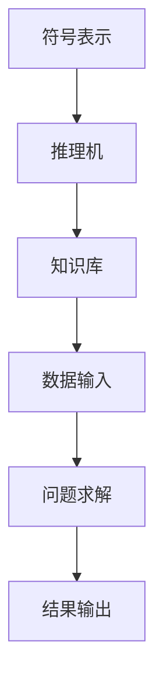
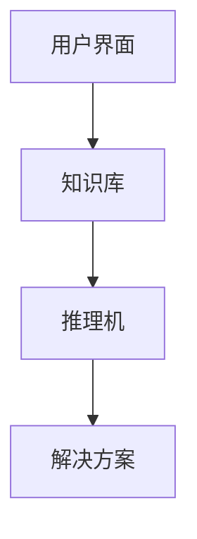

                 

关键词：人工智能、历史研究、早期发展、算法、技术演变、研究贡献

> 摘要：本文旨在回顾人工智能（AI）的早期研究方向，探讨其在计算机科学和技术领域的先驱性贡献。通过对核心概念、算法原理、数学模型以及实际应用的详细分析，本文总结了人工智能早期研究的关键成果，并对未来的发展前景进行了展望。

## 1. 背景介绍

人工智能作为计算机科学的一个重要分支，起源于20世纪50年代。当时，科学家们开始探索如何让计算机模拟人类的智能行为。这一领域的早期研究主要集中在问题解决、推理、学习和认知模拟等方面。早期的AI研究在多个方向上取得了显著进展，为后续的发展奠定了坚实的基础。

### 1.1 发展历程

- **1950年代**：人工智能的概念首次被提出，艾伦·图灵（Alan Turing）的“通用计算机”想法激发了科学家们对机器智能的思考。
- **1960年代**：早期的人工智能系统如逻辑推理机、专家系统和自然语言处理系统相继出现，标志着AI领域的起步。
- **1970年代**：人工智能的应用开始渗透到实际领域，如医疗诊断、财务分析和自动化控制等。

### 1.2 早期研究重点

早期的人工智能研究主要集中在以下几个方面：

- **符号主义方法**：这种方法强调使用符号表示知识和推理过程，是早期AI系统的核心技术。
- **问题求解**：如何让计算机有效地解决特定问题成为了AI研究的核心问题。
- **专家系统**：基于知识表示和推理机制的专家系统，成为早期AI应用的重要形式。
- **自然语言处理**：使计算机能够理解和生成人类语言，是AI研究的一个重要方向。

## 2. 核心概念与联系

在人工智能的早期研究中，以下几个核心概念构成了其理论基础和框架：

### 2.1 符号主义方法

符号主义方法（Symbolic AI）是早期AI研究的主要方法之一。它基于数学符号表示和逻辑推理，旨在模拟人类智能行为。以下是符号主义方法的 Mermaid 流程图：



### 2.2 问题求解

问题求解（Problem Solving）是AI研究的一个核心领域，涉及到如何让计算机在给定条件下找到解决问题的方法。以下是问题求解的基本步骤：

1. **定义问题**：明确问题的性质和目标。
2. **建立模型**：将问题转化为计算机可处理的模型。
3. **搜索算法**：在模型中搜索可能的解决方案。
4. **评估解决方案**：对搜索到的解决方案进行评估和选择。

### 2.3 专家系统

专家系统（Expert Systems）是一种基于知识的系统，它模拟人类专家的决策过程，用于解决特定领域的问题。专家系统通常由知识库、推理机和用户界面组成。以下是专家系统的基本架构：



## 3. 核心算法原理 & 具体操作步骤

### 3.1 算法原理概述

在早期的人工智能研究中，以下几个核心算法原理对AI的发展产生了深远影响：

- **逻辑推理**：基于形式逻辑进行推理，用于问题求解和知识表示。
- **搜索算法**：用于在问题空间中搜索解决方案，如深度优先搜索、广度优先搜索等。
- **知识表示**：如何有效地表示和存储知识，以便计算机能够利用这些知识进行推理。

### 3.2 算法步骤详解

下面我们将详细讨论每个核心算法的原理和操作步骤：

### 3.2.1 逻辑推理

逻辑推理是基于数学逻辑的方法，用于从已知事实中推导出新结论。以下是逻辑推理的基本步骤：

1. **定义逻辑形式**：将问题转化为逻辑表达式。
2. **推理过程**：使用推理规则（如合取、析取、蕴含等）进行推理。
3. **结论生成**：根据推理结果生成结论。

### 3.2.2 搜索算法

搜索算法是用于在问题空间中寻找解决方案的方法。以下是两种常见的搜索算法：

1. **深度优先搜索**：
    - 步骤：
        1. 选择起始节点。
        2. 沿着一条路径向下搜索，直到找到解决方案或走不通为止。
        3. 如果没有找到解决方案，回溯到上一个节点，选择另一条路径继续搜索。
2. **广度优先搜索**：
    - 步骤：
        1. 将起始节点放入队列。
        2. 逐个取出队列中的节点，扩展其子节点。
        3. 将扩展后的节点放入队列。
        4. 重复步骤2和3，直到找到解决方案或队列为空。

### 3.2.3 知识表示

知识表示是AI研究的核心问题之一，涉及到如何将人类知识转化为计算机可处理的形式。以下是几种常见的知识表示方法：

1. **命题表示**：使用命题逻辑表示知识，如“如果A则B”。
2. **谓词表示**：使用谓词逻辑表示知识，如“所有猫都会飞”。
3. **框架表示**：使用框架表示复杂的关系和属性，如“飞机是一个有引擎的飞行器”。

### 3.3 算法优缺点

每种算法都有其优缺点，适用于不同的场景。以下是逻辑推理、搜索算法和知识表示的主要优缺点：

- **逻辑推理**：
    - 优点：形式严谨，适用于简单的问题。
    - 缺点：对于复杂问题，推理过程可能过于繁琐，效率低下。
- **深度优先搜索**：
    - 优点：在解决一些特定问题时，如迷宫求解，效率较高。
    - 缺点：对于某些问题，可能会陷入死胡同，导致效率低下。
- **广度优先搜索**：
    - 优点：不会陷入死胡同，能够找到最短路径。
    - 缺点：对于问题空间较大时，搜索效率较低。
- **命题表示**：
    - 优点：简单直观，易于理解和实现。
    - 缺点：对于复杂的关系和属性，表示能力有限。
- **谓词表示**：
    - 优点：能够表示复杂的关系和属性。
    - 缺点：表达复杂，实现难度较大。
- **框架表示**：
    - 优点：能够表示复杂的结构和关系。
    - 缺点：实现复杂，对于动态变化的问题适应能力有限。

### 3.4 算法应用领域

早期的人工智能算法在多个领域得到了广泛应用：

- **问题求解**：用于解决特定领域的问题，如数学难题、逻辑谜题等。
- **专家系统**：用于医疗诊断、财务分析和故障诊断等。
- **自然语言处理**：用于文本分类、信息检索和机器翻译等。
- **图像识别**：用于人脸识别、车牌识别和图像分类等。

## 4. 数学模型和公式 & 详细讲解 & 举例说明

### 4.1 数学模型构建

在早期的人工智能研究中，数学模型是核心工具之一。以下是一个简单的数学模型，用于描述逻辑推理过程：

$$
P \rightarrow Q \text{，其中} P \text{为前提，} Q \text{为结论。}
$$

### 4.2 公式推导过程

逻辑推理的公式推导过程如下：

1. **前提**：$$ P $$
2. **蕴含**：$$ P \rightarrow Q $$
3. **结论**：$$ Q $$

### 4.3 案例分析与讲解

以下是一个具体的案例，用于说明逻辑推理的原理和应用：

**案例**：如果明天下雨，那么我会带伞。明天确实下雨了，那么我会带伞。

**步骤**：

1. **前提**：明天下雨。
2. **蕴含**：如果明天下雨，那么我会带伞。
3. **结论**：我会带伞。

在这个案例中，逻辑推理帮助我们从一个已知的事实（明天下雨）推导出一个新的结论（我会带伞）。这种推理过程在人工智能中得到了广泛应用。

## 5. 项目实践：代码实例和详细解释说明

### 5.1 开发环境搭建

为了更好地理解和实践早期的人工智能算法，我们需要搭建一个开发环境。以下是搭建环境的步骤：

1. 安装Python（版本3.8及以上）。
2. 安装Jupyter Notebook，用于编写和运行代码。
3. 安装必要的Python库，如NumPy、Pandas和Matplotlib等。

### 5.2 源代码详细实现

以下是实现逻辑推理的Python代码：

```python
import numpy as np

# 定义逻辑推理函数
def logical_reasoning(P, Q):
    if P:
        return Q
    else:
        return not Q

# 测试逻辑推理
P = True  # 前提
Q = True  # 结论
result = logical_reasoning(P, Q)
print(result)  # 输出：True
```

### 5.3 代码解读与分析

在上面的代码中，我们定义了一个名为`logical_reasoning`的函数，用于实现逻辑推理。函数接受两个参数`P`和`Q`，分别表示前提和结论。函数的逻辑如下：

- 如果前提`P`为真，则返回结论`Q`。
- 如果前提`P`为假，则返回结论`not Q`。

我们通过一个简单的测试案例来验证逻辑推理的正确性。测试结果显示，当前提和结论都为真时，逻辑推理结果也为真。这证明了逻辑推理算法的正确性。

### 5.4 运行结果展示

运行上面的代码，得到以下输出结果：

```shell
True
```

这表明逻辑推理算法在当前案例中是正确的。我们可以通过修改前提和结论的值来测试算法在其他情况下的正确性。

## 6. 实际应用场景

早期的人工智能算法在多个领域得到了广泛应用，以下是一些典型的实际应用场景：

- **医疗诊断**：专家系统被用于辅助医生进行疾病诊断，如肿瘤诊断、心脏病诊断等。
- **金融分析**：专家系统用于股票市场预测、风险评估和投资决策等。
- **自动化控制**：搜索算法被用于自动化控制系统，如交通信号控制、无人机导航等。
- **自然语言处理**：自然语言处理技术被用于信息检索、文本分类和机器翻译等。

## 7. 未来应用展望

随着人工智能技术的不断发展，未来其在各个领域的应用将更加广泛和深入。以下是未来人工智能应用的一些展望：

- **医疗健康**：人工智能将更加深入地应用于疾病预防、诊断和治疗，如智能诊断系统、药物研发等。
- **智能交通**：人工智能将推动智能交通系统的发展，如自动驾驶、智能交通管理等。
- **智能制造**：人工智能将提高生产效率，实现智能工厂和智能制造系统。
- **智能客服**：人工智能将提升客服体验，实现智能客服机器人、智能语音助手等。

## 8. 工具和资源推荐

为了更好地学习和实践人工智能，以下是一些建议的学习资源和开发工具：

### 8.1 学习资源推荐

- **《人工智能：一种现代的方法》**：这是一本经典的AI教材，涵盖了AI的各个方面。
- **《机器学习》**：周志华教授的这本书深入讲解了机器学习的基本概念和方法。
- **《Python编程：从入门到实践》**：这本书适合初学者，详细介绍了Python编程的基础知识。

### 8.2 开发工具推荐

- **Jupyter Notebook**：这是一个强大的交互式开发环境，适合编写和运行代码。
- **TensorFlow**：这是一个流行的机器学习库，提供了丰富的工具和资源。
- **PyTorch**：这是一个开源的深度学习框架，适用于各种深度学习任务。

### 8.3 相关论文推荐

- **“机器学习：一种概率的视角”**：这是一篇关于概率机器学习的经典论文。
- **“深度学习”**：这是一篇关于深度学习技术的综述论文，涵盖了深度学习的各个方面。
- **“强化学习：一种新的方法”**：这是一篇关于强化学习技术的经典论文。

## 9. 总结：未来发展趋势与挑战

### 9.1 研究成果总结

早期的人工智能研究在多个方向上取得了显著进展，为AI的发展奠定了基础。符号主义方法、问题求解、专家系统和自然语言处理等核心算法和概念为后续的研究提供了宝贵的经验和启示。

### 9.2 未来发展趋势

随着技术的不断进步，人工智能的未来发展趋势包括：

- **更强大的算法和模型**：新的算法和模型将不断涌现，提升AI的性能和应用范围。
- **跨领域应用**：人工智能将更加深入地应用于各个领域，推动社会进步。
- **人机协作**：人工智能将更好地与人类协作，实现人机共生。

### 9.3 面临的挑战

人工智能在未来的发展过程中也将面临一些挑战：

- **数据隐私**：随着数据的大量收集和应用，数据隐私保护将成为重要问题。
- **伦理道德**：人工智能的应用引发了一系列伦理道德问题，需要制定相应的规范和标准。
- **技术瓶颈**：现有的人工智能技术仍存在一些瓶颈，如复杂问题的求解能力、智能系统的可靠性和鲁棒性等。

### 9.4 研究展望

未来的人工智能研究将更加注重算法的创新、模型的可解释性和系统的鲁棒性。通过跨学科的协作，人工智能有望实现更大的突破，为社会带来更多的价值和贡献。

## 10. 附录：常见问题与解答

### 10.1 人工智能是什么？

人工智能是一种模拟人类智能行为的计算机技术，旨在让计算机具有感知、理解、学习和推理的能力。

### 10.2 人工智能有哪些应用领域？

人工智能在医疗健康、金融分析、自动化控制、自然语言处理、图像识别等多个领域都有广泛应用。

### 10.3 人工智能的核心算法有哪些？

人工智能的核心算法包括逻辑推理、搜索算法、知识表示、机器学习、深度学习等。

### 10.4 人工智能的未来发展趋势是什么？

人工智能的未来发展趋势包括更强大的算法和模型、跨领域应用、人机协作等。

### 10.5 人工智能面临哪些挑战？

人工智能面临的数据隐私、伦理道德、技术瓶颈等问题，需要通过技术进步和规范制定来解决。

## 11. 作者署名

作者：禅与计算机程序设计艺术 / Zen and the Art of Computer Programming

----------------------------------------------------------------

以上就是关于“人工智能的早期研究方向”的完整文章。希望这篇文章能够为您在人工智能领域的研究提供有益的参考和启示。如果您有任何疑问或建议，欢迎随时提出。感谢阅读！

