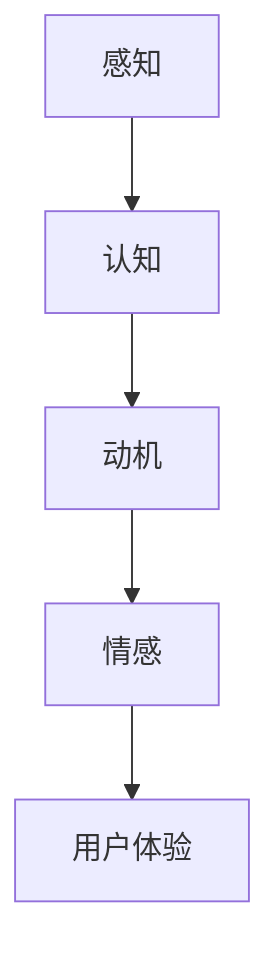

                 

关键词：人机交互，用户界面设计，代码实战，UI/UX设计，用户体验，交互心理学，前端开发，响应式设计，框架对比，最佳实践

> 摘要：本文将深入探讨人机交互与用户界面设计的核心原理，并通过实际代码实例分析，展示如何在现代前端开发中实现优秀的人机交互体验。文章将涵盖UI/UX设计基础、核心算法原理、数学模型与公式、项目实践以及未来应用展望，旨在为开发者提供全面的技术指南和实战经验。

## 1. 背景介绍

随着互联网和移动设备的普及，用户界面设计（UI/UX）已成为软件开发不可或缺的一部分。人机交互（Human-Computer Interaction, HCI）领域的快速发展推动了这一领域的进步，使得软件系统能够更好地满足用户的需求，提供直观、高效、愉悦的交互体验。

在过去的几十年中，人机交互和用户界面设计经历了多个发展阶段。从最初的命令行界面到图形用户界面（GUI），再到触摸屏和手势控制，交互方式不断进化。同时，前端开发技术的飞速发展，如HTML5、CSS3、JavaScript框架等，为开发者提供了丰富的工具和库，使得创建现代化、适应性强的用户界面变得更加容易。

然而，设计出色的用户界面不仅仅需要技术实现，更需要深入了解用户行为和心理。交互心理学（Interaction Psychology）的研究为此提供了重要启示，帮助我们理解用户如何与界面交互，并优化设计以提高用户体验。

## 2. 核心概念与联系

### 2.1 UI/UX设计基础

UI（用户界面设计）和UX（用户体验设计）是两个紧密相关的领域，但它们关注的重点不同。UI设计主要关注界面的视觉元素和布局，确保用户界面具有吸引力、易读性和一致性。UX设计则更注重用户的需求、行为和满意度，通过研究用户行为和反馈，设计出直观、高效、愉悦的交互流程。

### 2.2 交互心理学

交互心理学涉及多个研究领域，包括感知、认知、动机和情感等。以下是一个简化的Mermaid流程图，展示了交互心理学的主要概念和它们之间的联系。



### 2.3 前端开发技术

前端开发技术的进步为UI/UX设计提供了强大的支持。以下是前端开发中的几个关键技术：

- **HTML5**：提供了丰富的语义化标签和多媒体支持，使得构建复杂、适应性强的网页变得更加容易。
- **CSS3**：通过样式表可以实现对网页布局、颜色、字体等视觉元素的精细控制，提高了页面的美观度和一致性。
- **JavaScript**：作为一种脚本语言，JavaScript可以用于动态地改变网页内容和行为，实现丰富的交互效果。

### 2.4 响应式设计与框架对比

随着设备种类的多样化，响应式设计（Responsive Design）变得越来越重要。响应式设计旨在创建能够适应不同屏幕尺寸和分辨率的网页，提供一致的用户体验。以下是一些流行的前端框架和库，它们在响应式设计方面各有优势：

- **Bootstrap**：一个基于CSS的框架，提供了预定义的网格系统、组件和样式，易于快速构建响应式网页。
- **Foundation**：一个现代化的前端框架，强调移动优先的设计，提供了丰富的响应式组件。
- **Tailwind CSS**：一个功能类优先的框架，通过灵活的样式组合，实现了极简的响应式设计。

## 3. 核心算法原理 & 具体操作步骤

### 3.1 算法原理概述

在人机交互和用户界面设计中，算法主要用于处理用户的输入和界面的反馈。以下是一个基本的算法原理概述：

1. **用户输入**：用户通过键盘、鼠标、触摸屏等设备向系统输入指令。
2. **数据处理**：系统根据输入指令进行数据处理，如检索数据、执行操作等。
3. **界面反馈**：系统将处理结果反馈给用户，通过视觉、听觉等途径传递信息。

### 3.2 算法步骤详解

以下是实现上述算法的具体步骤：

1. **用户输入**：使用JavaScript监听用户输入事件，如`keyup`、`click`等。
2. **数据处理**：根据输入指令，调用相应的数据处理函数，如查询数据库、执行计算等。
3. **界面反馈**：使用JavaScript动态更新界面，显示处理结果，如更新文本内容、改变样式等。

### 3.3 算法优缺点

- **优点**：
  - **实时性**：算法能够快速响应用户输入，提供即时的反馈。
  - **灵活性**：可以根据不同的输入和需求，动态调整处理逻辑。
- **缺点**：
  - **性能问题**：复杂的算法可能对系统性能造成较大负担。
  - **可维护性**：随着功能的增加，算法可能会变得复杂，降低可维护性。

### 3.4 算法应用领域

算法在人机交互和用户界面设计中具有广泛的应用，包括但不限于：

- **搜索与推荐**：通过算法分析用户行为，提供个性化的搜索结果和推荐内容。
- **表单验证**：对用户输入进行验证，确保数据的有效性和完整性。
- **动画与过渡**：使用算法实现动态的动画效果和页面过渡，提升用户体验。

## 4. 数学模型和公式 & 详细讲解 & 举例说明

### 4.1 数学模型构建

在人机交互和用户界面设计中，数学模型主要用于模拟用户行为、评估用户体验等。以下是一个简单的数学模型，用于预测用户在某项任务中的操作时间。

$$
T = f(A, B, C)
$$

其中，$T$表示用户完成某项任务的时间，$A$表示任务的复杂性，$B$表示用户的能力水平，$C$表示界面设计的友好程度。

### 4.2 公式推导过程

公式的推导过程涉及多个心理学和认知科学的研究成果。以下是一个简化的推导过程：

1. **任务复杂性**：任务复杂性$A$反映了任务的难度和复杂性，通常使用经验公式进行估算。
2. **用户能力水平**：用户能力水平$B$反映了用户完成任务的能力，可以通过测试和评估确定。
3. **界面设计友好程度**：界面设计友好程度$C$反映了界面设计的质量，可以通过用户研究、问卷等手段进行评估。

### 4.3 案例分析与讲解

假设我们有一个简单的任务，用户需要在一个表格中填写若干项数据。我们可以使用上述数学模型来预测用户完成任务的时间。

- **任务复杂性$A$**：假设任务包括填写姓名、地址、电话号码等三项内容，每项内容的填写复杂度为1，总复杂度为3。
- **用户能力水平$B$**：假设用户的能力水平为中等，能力水平$B$为2。
- **界面设计友好程度$C$**：假设界面设计友好，用户能够轻松找到所需字段，界面友好程度$C$为3。

根据上述参数，我们可以计算出用户完成任务的时间：

$$
T = f(3, 2, 3) = 3 \times 2 \times 3 = 18
$$

因此，预计用户完成任务需要18分钟。这个模型可以帮助我们在设计界面时，预测用户的行为和操作时间，从而优化界面设计。

## 5. 项目实践：代码实例和详细解释说明

### 5.1 开发环境搭建

为了实现一个基本的用户界面，我们需要搭建一个开发环境。以下是使用Vue.js框架搭建Vue项目的步骤：

1. **安装Node.js**：从官网下载并安装Node.js。
2. **安装Vue CLI**：打开命令行，运行`npm install -g @vue/cli`安装Vue CLI。
3. **创建项目**：运行`vue create my-app`创建一个新项目，选择默认配置。
4. **进入项目目录**：进入项目目录，运行`cd my-app`。

### 5.2 源代码详细实现

以下是使用Vue.js实现一个简单登录界面的代码示例：

```vue
<template>
  <div id="app">
    <h1>登录界面</h1>
    <form @submit.prevent="login">
      <label for="username">用户名：</label>
      <input type="text" v-model="username" required>
      <br>
      <label for="password">密码：</label>
      <input type="password" v-model="password" required>
      <br>
      <button type="submit">登录</button>
    </form>
  </div>
</template>

<script>
export default {
  data() {
    return {
      username: '',
      password: ''
    };
  },
  methods: {
    login() {
      // 登录逻辑处理
      console.log('登录成功');
    }
  }
};
</script>

<style>
#app {
  font-family: Avenir, Helvetica, Arial, sans-serif;
  -webkit-font-smoothing: antialiased;
  -moz-osx-font-smoothing: grayscale;
  text-align: center;
  color: #2c3e50;
  margin-top: 60px;
}
</style>
```

### 5.3 代码解读与分析

上述代码是一个简单的Vue.js项目，包含一个登录界面。以下是代码的解读与分析：

- **模板部分**：使用Vue的模板语法，定义了登录界面的结构。`<form>`标签包含了两个`<input>`标签和一个`<button>`标签，分别用于输入用户名、密码和提交表单。
- **数据部分**：使用`data`函数返回一个对象，包含`username`和`password`两个属性，用于绑定表单的输入值。
- **方法部分**：定义了一个名为`login`的方法，用于处理表单提交事件。在方法中，我们仅进行了简单的输出操作，实际应用中应包含登录验证逻辑。
- **样式部分**：使用CSS3样式表，定义了界面的基本样式。

### 5.4 运行结果展示

在本地开发环境中，运行Vue项目，打开浏览器，访问`http://localhost:8080/`，即可看到登录界面的运行结果。

## 6. 实际应用场景

人机交互与用户界面设计在多个领域有着广泛的应用，以下是一些典型的实际应用场景：

- **电子商务**：电商平台通过优化用户界面和交互设计，提升用户的购物体验，增加销售额。
- **社交媒体**：社交媒体平台通过设计友好的用户界面和交互方式，吸引用户参与，提高用户活跃度。
- **金融科技**：金融科技公司通过先进的人机交互技术，提供安全、高效的金融服务，赢得用户信任。
- **教育领域**：在线教育平台通过优化用户界面和交互设计，提升学习效果，增加用户满意度。

### 6.4 未来应用展望

随着技术的不断发展，人机交互与用户界面设计领域将继续迎来新的变革：

- **人工智能与大数据**：人工智能和大数据技术的进步，将为人机交互和用户界面设计提供更深入的用户行为分析和个性化服务。
- **增强现实与虚拟现实**：增强现实（AR）和虚拟现实（VR）技术的发展，将带来全新的交互体验，改变用户界面的形态。
- **可穿戴设备**：随着可穿戴设备的普及，用户界面设计需要适应更加多样化的交互方式，如语音、手势等。

## 7. 工具和资源推荐

### 7.1 学习资源推荐

- **书籍**：
  - 《设计心理学》
  - 《前端开发手册》
  - 《人机交互：设计、评价与实现》
- **在线课程**：
  - Coursera上的《用户界面设计》
  - Udemy上的《Vue.js从入门到精通》
- **博客与社区**：
  - Medium上的UI/UX设计专题
  - Stack Overflow前端开发问答社区

### 7.2 开发工具推荐

- **设计工具**：
  - Sketch
  - Adobe XD
  - Figma
- **前端开发工具**：
  - Vue CLI
  - Webpack
  - Babel

### 7.3 相关论文推荐

- 《Affective Design: Using Emotion in Interaction Design》
- 《MobileHCI: Design and Evaluation of Mobile Interaction》
- 《The Design of Everyday Things》

## 8. 总结：未来发展趋势与挑战

### 8.1 研究成果总结

人机交互与用户界面设计领域的研究成果显著，包括对用户行为和心理的深入理解、交互技术的不断创新、用户体验评估方法的完善等。这些成果推动了软件系统的用户体验不断提升。

### 8.2 未来发展趋势

- **个性化与智能化**：随着人工智能和大数据技术的发展，用户界面设计将更加注重个性化和智能化。
- **多模态交互**：增强现实、虚拟现实等技术的普及，将带来多模态交互的体验。
- **可持续设计**：环境保护意识的提高，将促使设计师关注可持续性，减少资源浪费。

### 8.3 面临的挑战

- **技术快速更新**：前端技术的快速更新，对开发者的学习和适应能力提出了更高要求。
- **用户体验评估**：如何准确评估用户体验，仍是一个亟待解决的挑战。
- **跨平台兼容**：随着设备种类的增多，实现跨平台的兼容性设计变得越来越复杂。

### 8.4 研究展望

未来，人机交互与用户界面设计领域将继续向智能化、个性化、多模态交互方向发展。同时，研究者将更加关注用户体验评估方法和可持续设计，推动这一领域的发展。

## 9. 附录：常见问题与解答

### 9.1 如何提高用户体验？

- **研究用户需求**：深入了解用户的需求和期望，设计出符合用户习惯的界面。
- **优化交互流程**：简化操作步骤，减少用户认知负担。
- **视觉设计**：使用清晰、简洁的视觉元素，提高界面的易读性。

### 9.2 前端开发中如何实现响应式设计？

- **使用框架**：如Bootstrap、Foundation等，提供响应式组件和样式。
- **媒体查询**：使用CSS3的媒体查询，根据屏幕尺寸调整布局和样式。
- **弹性布局**：使用弹性布局（Flexbox）和网格布局（Grid），实现适应不同屏幕尺寸的界面。

### 9.3 如何进行用户体验评估？

- **用户测试**：通过实际用户测试，收集用户反馈，评估用户体验。
- **问卷调查**：设计问卷，收集用户对界面和交互的评价。
- **A/B测试**：将不同版本的界面展示给用户，比较不同版本的用户行为和满意度。

---

本文全面介绍了人机交互与用户界面设计的核心原理、算法、数学模型、项目实践以及未来发展趋势。希望本文能为开发者提供有价值的参考和实战经验，助力他们在现代前端开发中实现卓越的用户体验。作者：禅与计算机程序设计艺术 / Zen and the Art of Computer Programming。

