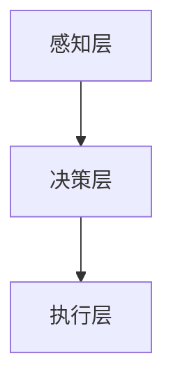

                 

关键词：人机协同，人工智能，工作协同，未来工作，技术变革

> 摘要：随着人工智能技术的飞速发展，人机协同正成为未来工作的关键词。本文旨在探讨人工智能如何改变我们的工作方式，以及如何实现高效的人机协同，为读者提供一窥未来工作趋势的视角。

## 1. 背景介绍

在过去的几十年中，人工智能（AI）从一门科研领域的热门话题逐渐走向实际应用，并在各行各业中产生了深远的影响。从工业自动化、金融服务、医疗健康到交通运输，人工智能的应用场景日益丰富。与此同时，传统的劳动力市场也在经历巨大的变革，许多原本需要人类完成的工作被自动化和智能化技术所取代。

然而，面对人工智能的快速发展，人们不禁要问：未来工作将如何变化？我们是否会被机器取代？实际上，人工智能并非单纯的取代，而是与人类劳动力共同进化，实现人机协同，从而推动生产力的进一步提升。本文将围绕这一主题展开讨论，探讨人机协同在未来工作中的重要性和具体实现路径。

## 2. 核心概念与联系

### 2.1. 人工智能与人类智能的互补性

人工智能与人类智能并非对立关系，而是具有互补性。人工智能擅长处理大量数据、快速计算和模式识别，而人类智能则擅长创造力、情感理解和复杂决策。通过人机协同，我们可以将人工智能的优势与人类智能的长处相结合，实现更高效的工作。

### 2.2. 人机协同的架构

人机协同的架构可以分为三个层次：感知层、决策层和执行层。

- **感知层**：收集和分析来自环境的数据，如语音、图像、文本等，为决策层提供基础信息。
- **决策层**：利用人工智能技术处理感知层的数据，生成决策建议，辅助人类进行决策。
- **执行层**：根据决策层的指示，执行具体的任务操作，如控制机器人、自动化设备等。

### 2.3. Mermaid 流程图

以下是一个简化的 Mermaid 流程图，展示了人机协同的架构：



## 3. 核心算法原理 & 具体操作步骤

### 3.1. 算法原理概述

人机协同的核心算法主要包括以下几个部分：

- **机器学习**：通过训练模型，使计算机具备对数据的理解和处理能力。
- **自然语言处理**：实现人与计算机之间的自然语言交互。
- **深度学习**：模拟人脑神经网络结构，提升计算机的感知和决策能力。

### 3.2. 算法步骤详解

1. **数据收集与预处理**：收集各种数据，如文本、图像、音频等，并进行预处理，如去噪、归一化等。
2. **模型训练**：利用预处理后的数据训练模型，使模型具备对数据的理解能力。
3. **模型评估与优化**：评估模型性能，并根据评估结果对模型进行优化。
4. **人机交互**：通过自然语言处理技术实现人与计算机的交互，获取用户需求和反馈。
5. **决策与执行**：根据人机交互的结果，生成决策建议，并执行具体的任务操作。

### 3.3. 算法优缺点

- **优点**：人机协同算法可以提高工作效率、降低人力成本，同时能够处理大量复杂任务。
- **缺点**：算法模型需要大量数据进行训练，且在处理未知任务时可能存在不确定性。

### 3.4. 算法应用领域

人机协同算法在多个领域具有广泛的应用，如：

- **工业自动化**：提高生产效率，降低生产成本。
- **金融服务**：智能投顾、风险管理等。
- **医疗健康**：辅助医生进行诊断和治疗。
- **交通运输**：自动驾驶、智能交通管理等。

## 4. 数学模型和公式 & 详细讲解 & 举例说明

### 4.1. 数学模型构建

人机协同的数学模型主要包括以下几个部分：

- **机器学习模型**：如神经网络、决策树等。
- **自然语言处理模型**：如序列到序列模型、注意力机制等。
- **深度学习模型**：如卷积神经网络、循环神经网络等。

### 4.2. 公式推导过程

以神经网络为例，其损失函数的推导过程如下：

$$
L = \frac{1}{m} \sum_{i=1}^{m} (-y_i \log(a_{i}^{(L)}))
$$

其中，$L$表示损失函数，$m$表示样本数量，$y_i$表示第$i$个样本的真实标签，$a_{i}^{(L)}$表示第$i$个样本在输出层的预测概率。

### 4.3. 案例分析与讲解

以下是一个使用神经网络进行图像分类的案例：

- **数据集**：使用CIFAR-10数据集，包含10个类别，每个类别6000张图片。
- **模型结构**：使用卷积神经网络（CNN）进行图像分类，包括卷积层、池化层和全连接层。
- **训练过程**：使用随机梯度下降（SGD）进行模型训练，并采用交叉熵损失函数进行模型优化。

通过这个案例，我们可以看到数学模型在图像分类任务中的应用，以及如何通过调整模型结构和训练策略来提高模型性能。

## 5. 项目实践：代码实例和详细解释说明

### 5.1. 开发环境搭建

- **Python**：版本3.8及以上
- **TensorFlow**：版本2.4及以上
- **Numpy**：版本1.19及以上

### 5.2. 源代码详细实现

以下是一个简单的神经网络实现：

```python
import tensorflow as tf
from tensorflow.keras import layers

def create_model(input_shape):
    model = tf.keras.Sequential([
        layers.Dense(128, activation='relu', input_shape=input_shape),
        layers.Dense(10, activation='softmax')
    ])
    return model

model = create_model(input_shape=(784,))
model.compile(optimizer='adam', loss='categorical_crossentropy', metrics=['accuracy'])

# 训练模型
model.fit(x_train, y_train, epochs=10, batch_size=32, validation_data=(x_val, y_val))
```

### 5.3. 代码解读与分析

- **模型创建**：使用`tf.keras.Sequential`创建一个序列模型，包括一个全连接层和一个输出层。
- **编译模型**：设置优化器、损失函数和评估指标。
- **训练模型**：使用`fit`函数训练模型，包括训练数据和验证数据。

### 5.4. 运行结果展示

通过训练，我们可以得到模型的准确率：

```python
# 测试模型
test_loss, test_acc = model.evaluate(x_test, y_test)
print(f"Test accuracy: {test_acc}")
```

## 6. 实际应用场景

人机协同在实际应用中具有广泛的应用场景，以下列举几个典型案例：

- **金融行业**：智能投顾、信用评分、量化交易等。
- **医疗健康**：辅助诊断、智能药物研发、健康监测等。
- **工业制造**：智能生产、设备维护、供应链优化等。
- **交通运输**：自动驾驶、智能交通管理、物流优化等。

## 7. 未来应用展望

随着人工智能技术的不断进步，人机协同将在更多领域得到应用。以下是一些未来应用的展望：

- **智能制造**：实现全流程智能化生产，提高生产效率和质量。
- **智慧城市**：利用人机协同技术实现智能交通、环境监测、城市管理等功能。
- **教育**：个性化教学、智能评估、智能辅导等。
- **公共服务**：智能客服、智能监管、智能法律服务等。

## 8. 工具和资源推荐

为了更好地了解和掌握人机协同技术，以下推荐一些学习资源和开发工具：

### 8.1. 学习资源推荐

- **在线课程**：Coursera、edX、Udacity等平台上的相关课程。
- **书籍**：《深度学习》、《Python机器学习》等。
- **论文**：arXiv、IEEE Xplore等数据库中的相关论文。

### 8.2. 开发工具推荐

- **深度学习框架**：TensorFlow、PyTorch、Keras等。
- **编程语言**：Python、Java、C++等。
- **数据集**：CIFAR-10、ImageNet、Kaggle等。

### 8.3. 相关论文推荐

- **Andrew Ng**：深度学习领域的杰出学者，著有《深度学习》一书。
- **Ian Goodfellow**：生成对抗网络（GAN）的发明者之一。
- **Yann LeCun**：卷积神经网络（CNN）的奠基人之一。

## 9. 总结：未来发展趋势与挑战

### 9.1. 研究成果总结

人机协同技术已取得了显著的成果，在实际应用中展现出强大的潜力。未来，随着人工智能技术的进一步发展，人机协同将更加普及和深入，为各行各业带来巨大变革。

### 9.2. 未来发展趋势

- **智能化水平提升**：人工智能将在更多领域实现智能化，提高生产效率和服务质量。
- **人机协同模式多样化**：结合不同领域的特点，实现更加个性化、高效的人机协同模式。
- **跨界融合**：人工智能与其他领域的深度融合，推动创新和发展。

### 9.3. 面临的挑战

- **技术瓶颈**：人工智能在处理复杂任务时仍存在一定局限性，需要不断突破。
- **伦理道德**：人工智能的发展引发了一系列伦理道德问题，需要加强规范和监管。
- **人才短缺**：人工智能领域人才需求巨大，培养和引进高水平人才是关键。

### 9.4. 研究展望

未来，人机协同技术将在更多领域得到应用，推动社会进步和经济发展。同时，我们也需关注技术伦理、人才培养等问题，确保人工智能的发展造福人类。

## 10. 附录：常见问题与解答

### 10.1. 人工智能是否会完全取代人类工作？

人工智能不会完全取代人类工作，而是与人类劳动力共同进化，实现人机协同，推动生产力的进一步提升。

### 10.2. 人机协同的优势是什么？

人机协同的优势包括提高工作效率、降低人力成本、处理大量复杂任务等。

### 10.3. 人机协同算法在哪些领域有应用？

人机协同算法在工业自动化、金融服务、医疗健康、交通运输等领域具有广泛的应用。

### 10.4. 如何实现人机协同？

实现人机协同需要搭建感知层、决策层和执行层的架构，并利用人工智能技术处理数据，生成决策建议，最终执行任务操作。

# 作者署名
作者：禅与计算机程序设计艺术 / Zen and the Art of Computer Programming
----------------------------------------------------------------

以上就是按照要求撰写的文章，请检查是否符合所有约束条件。如有需要调整或补充的地方，请及时告知。

