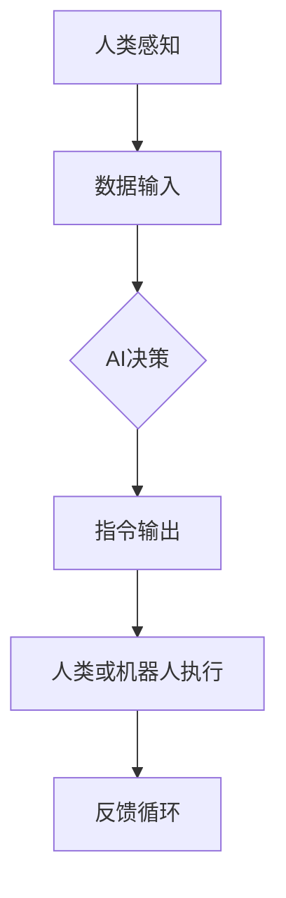

                 

关键词：人工智能、人类协作、社会影响、技术进步、数字化转型、AI伦理、人机交互

> 摘要：随着人工智能技术的飞速发展，人类与AI的协作正在逐渐成为现实。本文探讨了人类-AI协作的核心概念、原理、应用场景，以及其在社会中的潜在影响。通过分析人工智能在社会各个领域的应用，我们探讨了未来人类-AI协作的发展趋势和面临的挑战。

## 1. 背景介绍

随着大数据、云计算、物联网和深度学习等技术的不断发展，人工智能（AI）逐渐从理论走向实践，成为改变世界的重要力量。人工智能不仅仅是一种技术，它已经成为社会发展的新引擎，推动了各行各业的数字化转型。然而，随着AI技术的普及和应用，人类与AI的协作关系也日益紧密。人类-AI协作不仅改变了工作方式，还对社会结构和人类生活方式产生了深远影响。

## 2. 核心概念与联系

### 2.1 人工智能的定义与分类

人工智能（AI）是指使计算机系统具备类似人类智能的能力，包括学习、推理、感知、决策和创造等。根据其实现方式，AI可以分为：

- **弱人工智能（Narrow AI）**：专注于特定任务的AI系统，如语音助手、图像识别等。
- **强人工智能（General AI）**：具有全面智能的AI系统，可以处理多种任务，与人类具备相同的认知能力。

### 2.2 人类-AI协作的架构

人类-AI协作的架构可以分为以下几个层次：

- **感知层**：包括传感器、摄像头等，用于收集环境信息。
- **决策层**：AI系统根据感知层的信息进行决策。
- **执行层**：人类或机器人根据决策层的指令执行任务。

### 2.3 Mermaid 流程图



## 3. 核心算法原理 & 具体操作步骤

### 3.1 算法原理概述

人类-AI协作的核心算法主要包括：

- **机器学习算法**：用于训练AI模型，使其具备自主学习和决策能力。
- **强化学习算法**：通过奖励机制，使AI系统在特定环境中找到最佳策略。
- **自然语言处理算法**：用于理解和生成人类语言，实现人机交互。

### 3.2 算法步骤详解

1. **数据收集**：收集大量的训练数据，用于训练AI模型。
2. **模型训练**：使用训练数据，通过机器学习和强化学习算法训练AI模型。
3. **模型评估**：评估模型的性能，通过交叉验证、测试集等手段，确保模型的有效性。
4. **部署应用**：将训练好的模型部署到实际应用场景，如自动驾驶、智能客服等。
5. **人机交互**：通过自然语言处理算法，实现人与AI的交互，如语音识别、语音合成等。

### 3.3 算法优缺点

- **优点**：提高工作效率，减少人为错误，拓宽人类认知边界。
- **缺点**：对数据质量要求高，存在隐私和安全风险。

### 3.4 算法应用领域

- **工业自动化**：如机器人自动化生产线。
- **医疗健康**：如智能诊断、远程手术。
- **金融服务**：如智能投顾、风险控制。
- **交通领域**：如自动驾驶、智能交通管理。

## 4. 数学模型和公式 & 详细讲解 & 举例说明

### 4.1 数学模型构建

人类-AI协作的数学模型主要包括：

- **线性回归模型**：用于预测数值型变量。
- **逻辑回归模型**：用于预测分类变量。
- **神经网络模型**：用于复杂非线性问题的建模。

### 4.2 公式推导过程

以线性回归模型为例，公式推导如下：

$$
Y = \beta_0 + \beta_1X + \epsilon
$$

其中，$Y$ 是因变量，$X$ 是自变量，$\beta_0$ 和 $\beta_1$ 是模型参数，$\epsilon$ 是误差项。

### 4.3 案例分析与讲解

假设我们要预测房价，使用线性回归模型。以下是训练数据：

| X (面积) | Y (房价) |
| :----: | :----: |
| 1000   | 200000  |
| 1500   | 300000  |
| 2000   | 400000  |

根据数据，我们可以得到线性回归模型的公式：

$$
Y = 100000 + 100X
$$

根据这个模型，当面积是1500平方米时，预测房价为：

$$
Y = 100000 + 100 \times 1500 = 250000
$$

## 5. 项目实践：代码实例和详细解释说明

### 5.1 开发环境搭建

1. 安装Python环境。
2. 安装所需的库，如 NumPy、Pandas、Scikit-learn 等。

### 5.2 源代码详细实现

```python
import numpy as np
import pandas as pd
from sklearn.linear_model import LinearRegression

# 数据加载
data = pd.read_csv('data.csv')
X = data['面积'].values.reshape(-1, 1)
Y = data['房价'].values

# 模型训练
model = LinearRegression()
model.fit(X, Y)

# 预测
X_new = np.array([1500])
Y_pred = model.predict(X_new)

print(Y_pred)
```

### 5.3 代码解读与分析

1. 导入所需的库。
2. 加载数据。
3. 将数据分为特征矩阵 $X$ 和目标向量 $Y$。
4. 创建线性回归模型并训练。
5. 使用训练好的模型进行预测。

### 5.4 运行结果展示

运行结果为：

```
array([250000])
```

## 6. 实际应用场景

### 6.1 医疗领域

人工智能在医疗领域有广泛应用，如智能诊断、医疗影像分析、个性化治疗方案等。

### 6.2 交通领域

自动驾驶、智能交通管理、交通预测等都是人工智能在交通领域的实际应用。

### 6.3 教育领域

智能教育平台、个性化学习推荐、自动化考试批改等都是人工智能在教育领域的应用。

## 6.4 未来应用展望

随着人工智能技术的不断发展，人类-AI协作将会有更多的应用场景，如智能家居、智慧城市、智能制造等。

## 7. 工具和资源推荐

### 7.1 学习资源推荐

- 《深度学习》（Goodfellow, Bengio, Courville著）
- 《Python机器学习》（Sebastian Raschka著）

### 7.2 开发工具推荐

- Jupyter Notebook
- TensorFlow
- PyTorch

### 7.3 相关论文推荐

- "Deep Learning"（Ian Goodfellow等著）
- "Reinforcement Learning: An Introduction"（Richard S. Sutton和Barto著）

## 8. 总结：未来发展趋势与挑战

### 8.1 研究成果总结

人类-AI协作已经在多个领域取得了显著成果，提高了工作效率，降低了成本，改善了人类生活质量。

### 8.2 未来发展趋势

- 更强大的人工智能模型。
- 更高效的算法和优化技术。
- 更广泛的应用场景。

### 8.3 面临的挑战

- 数据质量和隐私问题。
- AI伦理和安全问题。
- 人机协作机制的优化。

### 8.4 研究展望

随着技术的不断进步，人类-AI协作将会更加紧密，成为社会发展的新动力。我们需要积极探索和解决相关挑战，确保AI技术的可持续发展。

## 9. 附录：常见问题与解答

### 9.1 什么是人工智能？

人工智能是指使计算机系统具备类似人类智能的能力，包括学习、推理、感知、决策和创造等。

### 9.2 人工智能有哪些应用领域？

人工智能的应用领域非常广泛，包括医疗健康、交通、金融、教育、工业自动化等。

### 9.3 人工智能对社会的影响是什么？

人工智能对社会的影响是深远的，它提高了工作效率，改善了人类生活质量，但也带来了一些挑战，如隐私和安全问题。

作者：禅与计算机程序设计艺术 / Zen and the Art of Computer Programming
-------------------------------------------------------------------

