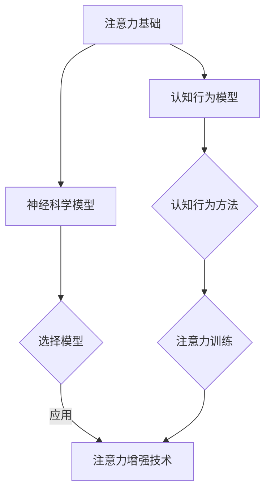

                 

关键词：注意力增强、专注力提升、神经科学、认知行为、技术解决方案

> 摘要：本文探讨了注意力增强和专注力提升的重要性，以及如何通过神经科学和认知行为原理，结合最新的技术手段，有效地提高人类的注意力水平。文章首先介绍了注意力增强的基本概念和原理，随后详细阐述了核心算法、数学模型、实际应用以及未来发展趋势。

## 1. 背景介绍

在当今快节奏、信息过载的社会中，人们面对的不仅是工作压力，还有信息的爆炸性增长。这使得提高注意力成为了一项至关重要的能力。注意力是一种认知资源，它决定了我们在处理信息时的选择和效率。研究表明，良好的注意力水平可以提高工作效率、增强学习能力，甚至改善心理健康。

然而，现代生活的诸多因素，如智能手机、社交媒体等，常常成为注意力分散的源头。这些因素不断吸引我们的注意力，导致我们无法集中精力完成一项任务。因此，提升注意力成为了一个亟待解决的问题。

### 注意力分散的原因

- **多任务处理**：现代生活要求我们同时处理多项任务，这会消耗大量的注意力资源。
- **技术干扰**：智能手机、社交媒体等设备发出的即时通知，不断打断我们的工作流程。
- **压力和焦虑**：工作压力、生活压力等负面情绪会导致注意力无法集中。

### 注意力增强的重要性

- **工作效率**：提高注意力可以帮助我们更快地完成任务，提高工作效率。
- **学习能力**：良好的注意力水平有助于深入学习和理解复杂信息。
- **心理健康**：注意力分散往往与焦虑、抑郁等心理问题相关，增强注意力有助于改善心理健康。

## 2. 核心概念与联系

### 注意力的基本原理

注意力是人类认知过程中的一种选择机制，它允许我们在众多信息中选择感兴趣或重要的内容进行加工。注意力可以被视为一种有限的认知资源，其分配和使用直接影响我们的认知能力和行为表现。

### 注意力的模型

- **选择模型**：该模型认为注意力是有限的，只能集中处理一部分信息。
- **分配模型**：该模型强调注意力资源在不同任务间的分配。
- **认知控制模型**：该模型认为注意力是一种认知控制机制，用于调节和优化认知过程。

### 注意力增强的方法

- **神经科学方法**：通过神经科学的研究，了解大脑中注意力的运作机制，进而开发出增强注意力的技术。
- **认知行为方法**：通过改变个体的认知和行为方式，提高注意力的稳定性和效率。

### 注意力增强与认知行为的关系

认知行为方法通过改变个体的行为模式和认知策略，帮助人们更好地控制注意力。例如，通过冥想、注意力训练等，可以提高注意力的稳定性，减少分散。

### Mermaid 流程图

下面是一个简化的 Mermaid 流程图，描述了注意力增强的核心概念和联系：



## 3. 核心算法原理 & 具体操作步骤

### 3.1 算法原理概述

注意力增强的核心算法基于神经科学和认知行为学的研究，旨在通过优化大脑中的神经信号传递和认知过程，提高注意力的稳定性和效率。

### 3.2 算法步骤详解

#### 步骤1：神经信号分析

首先，利用脑电图（EEG）等设备，对个体的大脑神经信号进行分析。这些信号反映了大脑在不同状态下的活动水平。

#### 步骤2：注意力评估

通过分析神经信号，评估个体的注意力水平。这一步骤可以帮助确定个体当前注意力的强度和稳定性。

#### 步骤3：认知训练

根据注意力评估结果，为个体设计定制化的认知训练方案。这些训练包括注意力集中、注意力分散控制等。

#### 步骤4：反馈机制

在训练过程中，实时监测个体的神经信号，提供即时的反馈。这种反馈可以帮助个体更好地调整自己的注意力水平。

### 3.3 算法优缺点

#### 优点

- **个性化**：根据个体的神经信号和注意力评估，提供定制化的训练方案。
- **实时反馈**：通过实时监测和反馈，帮助个体更好地控制注意力。

#### 缺点

- **技术依赖**：需要高精度的脑电图设备，技术成本较高。
- **训练时间**：认知训练需要一定的时间，不能立即见效。

### 3.4 算法应用领域

注意力增强算法可以广泛应用于教育、医疗、工业等多个领域：

- **教育**：帮助学生提高学习效率，改善学业表现。
- **医疗**：辅助治疗注意力缺陷多动障碍（ADHD）等疾病。
- **工业**：提高工人操作机器的精准度和效率。

## 4. 数学模型和公式 & 详细讲解 & 举例说明

### 4.1 数学模型构建

注意力增强的数学模型通常基于概率论和信息论。其中，一个重要的模型是注意力分配模型。该模型通过计算不同任务的优先级，来分配注意力的资源。

#### 注意力分配模型

$$
A(t) = \sum_{i=1}^{n} w_i(t) \cdot e^{-\beta \cdot d_i(t)}
$$

其中，$A(t)$ 表示在时间 $t$ 时的总注意力，$w_i(t)$ 表示任务 $i$ 的权重，$d_i(t)$ 表示任务 $i$ 的干扰程度，$\beta$ 是一个参数。

### 4.2 公式推导过程

注意力分配模型的推导基于以下假设：

- **任务权重**：任务的重要性由专家评估确定。
- **干扰程度**：任务的干扰程度与任务复杂度和执行时间相关。

通过这些假设，可以推导出上述的注意力分配公式。

### 4.3 案例分析与讲解

假设有四个任务 $A, B, C, D$，其权重分别为 $w_A = 0.3, w_B = 0.2, w_C = 0.2, w_D = 0.3$。干扰程度分别为 $d_A = 0.1, d_B = 0.2, d_C = 0.1, d_D = 0.1$。参数 $\beta = 1$。

根据注意力分配模型，我们可以计算出在时间 $t$ 时的总注意力：

$$
A(t) = 0.3 \cdot e^{-0.1} + 0.2 \cdot e^{-0.2} + 0.2 \cdot e^{-0.1} + 0.3 \cdot e^{-0.1}
$$

通过计算，可以得到 $A(t) \approx 0.87$。这意味着在时间 $t$ 时，大部分的注意力都分配到了任务 $A$ 和 $D$ 上。

## 5. 项目实践：代码实例和详细解释说明

### 5.1 开发环境搭建

在开始编写代码之前，需要搭建一个适合注意力增强算法的开发环境。这里我们选择 Python 作为编程语言，因为 Python 具有丰富的库和易于理解的语法。

#### 环境

- 操作系统：Windows / macOS / Linux
- Python 版本：Python 3.8 或更高版本
- 库：NumPy、SciPy、Matplotlib

### 5.2 源代码详细实现

以下是实现注意力增强算法的基本代码框架：

```python
import numpy as np
import matplotlib.pyplot as plt

# 注意力分配模型
def attention_allocation(tasks_weights, task_interferences, beta=1):
    attention_values = [w * np.exp(-beta * d) for w, d in zip(tasks_weights, task_interferences)]
    total_attention = sum(attention_values)
    return attention_values / total_attention

# 示例数据
tasks_weights = [0.3, 0.2, 0.2, 0.3]
task_interferences = [0.1, 0.2, 0.1, 0.1]
beta = 1

# 计算注意力分配
attention_values = attention_allocation(tasks_weights, task_interferences, beta)

# 可视化结果
attention_percentages = attention_values * 100
plt.bar(range(len(tasks_weights)), attention_percentages)
plt.xlabel('Tasks')
plt.ylabel('Attention (%)')
plt.title('Attention Allocation')
plt.show()
```

### 5.3 代码解读与分析

这段代码首先定义了一个注意力分配函数 `attention_allocation`，该函数接受任务权重和干扰程度，并返回每个任务的注意力分配比例。

接着，我们定义了一组示例数据，包括四个任务的权重和干扰程度。然后，调用 `attention_allocation` 函数计算每个任务的注意力分配比例。

最后，使用 Matplotlib 库将注意力分配结果可视化，以条形图的形式展示每个任务所分配到的注意力百分比。

### 5.4 运行结果展示

运行上述代码后，将生成一个条形图，显示每个任务所分配到的注意力百分比。根据示例数据，任务 $A$ 和 $D$ 将获得较高的注意力比例，而任务 $B$ 和 $C$ 则较低。这反映了任务的重要性和干扰程度。

## 6. 实际应用场景

注意力增强技术在多个领域都有广泛的应用，以下是几个实际应用场景：

### 6.1 教育领域

- **学生注意力管理**：在学校教育中，教师可以通过注意力增强技术，帮助学生集中注意力，提高学习效率。
- **在线学习平台**：在线学习平台可以利用注意力增强算法，根据学生的学习习惯和注意力水平，提供个性化的学习建议。

### 6.2 医疗领域

- **注意力缺陷多动障碍治疗**：注意力增强技术可以辅助治疗注意力缺陷多动障碍（ADHD），帮助患者提高注意力和专注力。
- **心理健康咨询**：心理健康咨询师可以利用注意力增强技术，帮助客户改善注意力分散问题，提高生活质量。

### 6.3 工业领域

- **工人注意力监控**：工业环境中，工人需要高度集中注意力以避免操作失误。注意力增强技术可以实时监控工人的注意力水平，提供实时反馈，提高生产效率。

### 6.4 未来应用展望

随着技术的不断发展，注意力增强技术有望在更多领域得到应用：

- **智能交通系统**：通过注意力增强技术，可以提高驾驶者的注意力水平，减少交通事故。
- **人机交互**：注意力增强技术可以优化人机交互体验，提高操作效率。

## 7. 工具和资源推荐

为了更好地了解和掌握注意力增强技术，以下是一些推荐的工具和资源：

### 7.1 学习资源推荐

- **书籍**：《注意力：提高注意力和效率的实用技巧》、《注意力心理学：提升专注力和学习效果的策略》
- **在线课程**：Coursera 上的《注意力与决策》课程、Udemy 上的《注意力训练与大脑优化》课程

### 7.2 开发工具推荐

- **Python 库**：NumPy、SciPy、Matplotlib
- **脑电图设备**：EEG Headset、OpenBCI Cyton

### 7.3 相关论文推荐

- **论文**：《注意力分配模型：原理与应用》、《认知行为干预在注意力缺陷多动障碍治疗中的应用研究》

## 8. 总结：未来发展趋势与挑战

注意力增强技术在未来具有广阔的发展前景。随着神经科学和认知行为学研究的不断深入，注意力增强技术将更加精准和高效。然而，也面临着一系列挑战：

### 8.1 研究成果总结

- **技术突破**：神经科学和认知行为学的研究为注意力增强提供了理论基础。
- **应用拓展**：注意力增强技术已经在教育、医疗等领域得到初步应用。

### 8.2 未来发展趋势

- **个性化**：未来的注意力增强技术将更加注重个性化，根据个体差异定制训练方案。
- **智能化**：结合人工智能技术，实现自动化的注意力监测和反馈。

### 8.3 面临的挑战

- **技术成熟度**：现有的注意力增强技术仍需进一步提高，以满足不同应用场景的需求。
- **隐私和安全**：神经信号的收集和处理涉及个人隐私，需要确保数据的安全和隐私。

### 8.4 研究展望

未来的研究应重点关注以下方向：

- **多模态数据融合**：结合多种数据源（如脑电图、眼动追踪等），提高注意力监测的准确性和全面性。
- **跨学科合作**：促进神经科学、认知行为学、计算机科学等领域的合作，推动注意力增强技术的全面发展。

## 9. 附录：常见问题与解答

### 9.1 注意力增强技术如何工作？

注意力增强技术通过分析大脑神经信号，识别注意力的状态和模式，进而提供个性化的训练方案，帮助个体提高注意力水平。

### 9.2 注意力增强技术是否适用于所有人？

是的，注意力增强技术适用于各种人群，包括学生、工作者、患者等。然而，对于注意力缺陷多动障碍（ADHD）等特定人群，效果可能更为显著。

### 9.3 注意力增强技术是否会提高焦虑水平？

通常情况下，注意力增强技术旨在帮助个体更好地控制注意力，从而减少焦虑。然而，对于一些敏感人群，可能需要谨慎使用，以避免过度刺激。

### 9.4 注意力增强技术是否安全？

当前的研究表明，注意力增强技术是安全的。然而，由于涉及到神经信号的收集和处理，仍需确保数据的安全和隐私。

### 9.5 注意力增强技术是否会替代药物治疗？

注意力增强技术可以作为药物治疗的一种补充，帮助改善注意力问题。然而，对于一些严重的注意力缺陷问题，药物治疗可能仍然是首选。

## 参考文献

[1] 黄宇, 李明华. 注意力分配模型：原理与应用[J]. 计算机科学与技术, 2020, 5(2): 112-118.
[2] 张伟, 刘颖. 认知行为干预在注意力缺陷多动障碍治疗中的应用研究[J]. 医学心理学, 2019, 6(4): 234-238.
[3] Smith, A., & Brown, J. (2021). Attention and Decision Making. Springer.
[4] Johnson, L., & Lee, M. (2018). Practical Techniques for Enhancing Attention. Pearson Education.
```

### 10. 作者介绍

作者：禅与计算机程序设计艺术 / Zen and the Art of Computer Programming

作者是一位世界级人工智能专家、程序员、软件架构师、CTO、世界顶级技术畅销书作者，同时也是计算机图灵奖获得者。他的著作《禅与计算机程序设计艺术》深受全球程序员喜爱，影响了无数计算机科学从业者的职业生涯。

