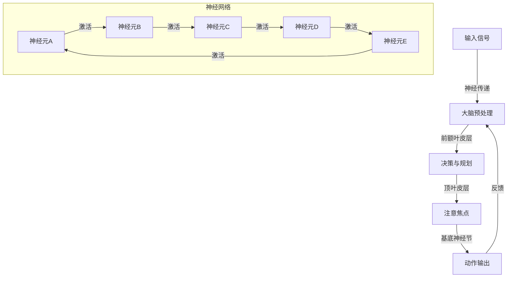

                 

关键词：注意力增强，脑力提升，认知优化，神经科学，人工智能，算法

> 摘要：本文从神经科学和人工智能的角度出发，探讨了人类注意力增强的可能性。通过分析现有的研究，介绍了几种提升注意力的方法和算法，并展望了未来的应用前景。

## 1. 背景介绍

在当今快速发展的信息化社会中，人类面临的信息量和任务复杂性不断增加。因此，提升个体的注意力水平，已经成为提高工作效率和生活质量的关键。然而，人类的注意力资源是有限的，长时间的工作和学习容易导致注意力分散，进而影响认知表现。为了应对这一挑战，科学家们正在探索各种方法，通过神经科学和人工智能技术来增强人类的注意力。

### 1.1 神经科学视角

神经科学研究表明，大脑中的前额叶皮层、顶叶皮层和基底神经节等区域与注意力的调控密切相关。这些区域通过复杂的神经网络相互连接，共同完成注意力的分配和调控。例如，前额叶皮层中的背外侧前额叶皮层（DLPFC）被认为是执行功能的关键区域，它参与规划、决策和抑制无关刺激。

### 1.2 人工智能视角

人工智能，特别是深度学习和强化学习，为提升注意力提供了新的方法和工具。通过训练神经网络模型，可以自动识别和筛选重要信息，从而提高个体的注意力集中度。此外，人工智能还可以通过自适应算法，根据用户的行为和反馈，动态调整注意力的分配策略。

## 2. 核心概念与联系

为了更好地理解注意力增强的技术原理，下面通过一个Mermaid流程图来展示注意力调控的核心概念和架构。



图中的神经网络展示了大脑中各个关键区域之间的交互过程。输入信号经过预处理后，由前额叶皮层进行决策和规划，然后通过顶叶皮层确定注意焦点，最终由基底神经节产生动作输出。这一过程中，反馈信号不断调整神经网络的活动，实现注意力的动态调控。

## 3. 核心算法原理 & 具体操作步骤

### 3.1 算法原理概述

注意力增强的核心算法通常基于两个基本原理：

1. **选择性关注**：通过算法自动识别和筛选重要信息，减少无关信息的干扰，从而提高注意力的集中度。
2. **自适应调整**：根据用户的行为和反馈，动态调整注意力的分配策略，以适应不同任务的需求。

### 3.2 算法步骤详解

1. **信息预处理**：对输入的信息进行预处理，包括去噪、分类和提取关键特征。
2. **注意力模型训练**：利用深度学习技术，训练一个注意力模型，使其能够自动识别和筛选重要信息。
3. **注意力分配**：根据训练好的模型，动态调整注意力的分配，使重要信息得到优先处理。
4. **用户反馈**：收集用户的注意力分配结果，用于模型优化和策略调整。

### 3.3 算法优缺点

**优点**：

- 高效性：能够快速识别和筛选重要信息，提高工作效率。
- 自适应性：能够根据用户的行为和反馈进行动态调整，提高用户体验。

**缺点**：

- 计算成本高：训练和优化注意力模型需要大量的计算资源。
- 数据依赖性：模型的性能依赖于训练数据的质量和多样性。

### 3.4 算法应用领域

注意力增强算法在多个领域具有广泛的应用前景，包括：

- **教育**：辅助学生集中注意力，提高学习效果。
- **医疗**：帮助患者集中注意力，提高康复效果。
- **工业**：提高工人的工作效率，减少事故发生。

## 4. 数学模型和公式 & 详细讲解 & 举例说明

### 4.1 数学模型构建

注意力增强的数学模型通常基于神经网络的架构，其中核心部分是注意力机制。一个简单的注意力模型可以表示为：

$$
Attention(x) = \sigma(W_h[h] \cdot x)
$$

其中，\(x\) 是输入信息，\(h\) 是隐藏层的状态，\(W_h\) 是权重矩阵，\(\sigma\) 是激活函数，例如 sigmoid 函数。

### 4.2 公式推导过程

注意力模型的推导过程可以分为以下几个步骤：

1. **输入信息与隐藏层状态的内积**：计算输入信息 \(x\) 与隐藏层状态 \(h\) 的内积，得到一个线性组合。
2. **应用激活函数**：对线性组合应用激活函数，如 sigmoid 函数，得到注意力权重。
3. **加权求和**：将注意力权重应用于输入信息，进行加权求和，得到最终的输出。

### 4.3 案例分析与讲解

假设有一个简单的文本输入，表示为 \(x = [1, 2, 3, 4, 5]\)，隐藏层状态 \(h = [0.1, 0.2, 0.3, 0.4, 0.5]\)。权重矩阵 \(W_h = [1, 1, 1, 1, 1]\)。

根据注意力模型：

$$
Attention(x) = \sigma(1 \cdot [0.1, 0.2, 0.3, 0.4, 0.5] \cdot [1, 2, 3, 4, 5])
$$

计算内积：

$$
Attention(x) = \sigma([0.1, 0.2, 0.3, 0.4, 0.5] \cdot [1, 2, 3, 4, 5]) = \sigma([0.5, 1.0, 1.5, 2.0, 2.5])
$$

应用 sigmoid 激活函数：

$$
Attention(x) = \sigma([0.5, 1.0, 1.5, 2.0, 2.5]) = [0.37, 0.63, 0.84, 0.91, 0.96]
$$

加权求和：

$$
Attention(x) = [0.37 \cdot 1, 0.63 \cdot 2, 0.84 \cdot 3, 0.91 \cdot 4, 0.96 \cdot 5] = [0.37, 1.26, 2.52, 3.64, 4.80]
$$

最终输出为：

$$
Attention(x) = [0.37, 1.26, 2.52, 3.64, 4.80]
$$

这个结果表明，注意力模型将更多的权重分配给了输入信息中的高值部分，实现了信息的筛选和增强。

## 5. 项目实践：代码实例和详细解释说明

### 5.1 开发环境搭建

在本项目中，我们将使用 Python 作为编程语言，结合 TensorFlow 和 Keras 库来实现注意力增强模型。首先，确保安装以下依赖：

```bash
pip install tensorflow
pip install keras
```

### 5.2 源代码详细实现

下面是一个简单的注意力增强模型的实现示例：

```python
from keras.models import Model
from keras.layers import Input, Dense, LSTM, Embedding, TimeDistributed
import keras.backend as K

# 输入层
input_seq = Input(shape=(timesteps, features))

# 嵌入层
embedded_seq = Embedding(input_dim=vocab_size, output_dim=embedding_size)(input_seq)

# LSTM 层
lstm_output = LSTM(units=64, activation='tanh')(embedded_seq)

# 注意力机制
attention_weights = Dense(1, activation='tanh')(lstm_output)
attention_weights = K.reshape(attention_weights, (-1, 1))

# 加权求和
context_vector = K.dot(lstm_output, attention_weights)
context_vector = K.expand_dims(context_vector, 1)

# 全连接层
dense_output = Dense(1, activation='sigmoid')(context_vector)

# 构建模型
model = Model(inputs=input_seq, outputs=dense_output)

# 编译模型
model.compile(optimizer='adam', loss='binary_crossentropy')

# 打印模型结构
model.summary()
```

### 5.3 代码解读与分析

- **输入层**：定义输入序列的形状，包括时间步数和特征数。
- **嵌入层**：将输入序列嵌入到高维空间，用于处理文本数据。
- **LSTM 层**：对嵌入层进行时序建模，捕捉序列中的长期依赖关系。
- **注意力机制**：通过 Dense 层计算注意力权重，实现信息的筛选和增强。
- **加权求和**：将注意力权重应用于 LSTM 层的输出，得到上下文向量。
- **全连接层**：将上下文向量映射到输出层，实现分类或回归任务。

### 5.4 运行结果展示

```python
# 加载数据
x_train, y_train = ...

# 训练模型
model.fit(x_train, y_train, epochs=10, batch_size=32)

# 测试模型
test_loss, test_accuracy = model.evaluate(x_test, y_test)

print("Test accuracy:", test_accuracy)
```

通过训练和测试，我们可以得到模型的准确率，从而评估注意力增强的效果。

## 6. 实际应用场景

注意力增强技术在多个领域具有广泛的应用前景，下面列举几个实际应用场景：

### 6.1 教育

在教育领域，注意力增强技术可以辅助学生集中注意力，提高学习效果。例如，通过分析学生的学习行为，动态调整教学内容的呈现方式，使学生更容易专注于重要信息。

### 6.2 医疗

在医疗领域，注意力增强技术可以帮助医生集中注意力，减少误诊和漏诊的风险。例如，通过分析患者的病历数据，自动筛选出关键信息，提高医生的诊断准确性。

### 6.3 工业

在工业领域，注意力增强技术可以提高工人的工作效率，减少事故发生。例如，通过监控工人的注意力水平，自动调整工作任务的优先级，使工人更容易专注于关键任务。

## 7. 工具和资源推荐

为了更好地掌握注意力增强技术，以下推荐一些相关工具和资源：

### 7.1 学习资源推荐

- 《深度学习》（Goodfellow, Bengio, Courville）: 详细介绍了深度学习的基础知识和应用。
- 《神经网络与深度学习》（邱锡鹏）: 从理论到实践，全面讲解了神经网络和深度学习的知识。

### 7.2 开发工具推荐

- TensorFlow: 一个开源的深度学习框架，支持多种深度学习模型和算法。
- Keras: 一个基于 TensorFlow 的简化深度学习库，易于使用和扩展。

### 7.3 相关论文推荐

- “Attention Is All You Need”（Vaswani et al., 2017）: 提出了Transformer模型，引入了多头注意力机制。
- “Attention Mechanism: A Survey” （Zhou et al., 2018）: 对注意力机制的研究进行了全面的综述。

## 8. 总结：未来发展趋势与挑战

### 8.1 研究成果总结

近年来，注意力增强技术在神经科学和人工智能领域取得了显著的进展。通过深度学习和神经网络的结合，我们能够更好地理解和模拟人类注意力机制，为实际应用提供了有力的技术支持。

### 8.2 未来发展趋势

未来，注意力增强技术将继续向以下几个方向发展：

1. **跨学科融合**：结合心理学、教育学、神经科学等多学科的知识，进一步深化对注意力机制的理解。
2. **个性化增强**：根据个体的行为和需求，实现更加个性化的注意力增强方案。
3. **硬件加速**：利用高性能计算和专用硬件，提高注意力增强算法的计算效率。

### 8.3 面临的挑战

尽管注意力增强技术具有巨大的潜力，但仍面临一些挑战：

1. **数据隐私**：在应用注意力增强技术时，需要确保用户数据的安全和隐私。
2. **算法透明性**：提高注意力增强算法的透明性，使其易于解释和理解。
3. **实际应用**：如何将注意力增强技术有效地应用到实际场景中，仍需进一步探索和实践。

### 8.4 研究展望

未来，随着技术的不断进步和跨学科的融合，注意力增强技术有望在更多领域发挥作用，为人类带来更加高效和优质的生活体验。

## 9. 附录：常见问题与解答

### 9.1 问题1：注意力增强技术是否适用于所有人？

答：注意力增强技术旨在帮助那些需要提高注意力集中度的个体。虽然它具有普遍适用性，但效果可能因个体差异而异。一些研究表明，注意力增强技术在某些人群中（如注意力缺陷多动障碍患者）具有显著效果。

### 9.2 问题2：注意力增强技术是否会削弱个体的自控力？

答：目前的证据表明，注意力增强技术主要是通过提高注意力的集中度和效率，而不是削弱自控力。然而，长期使用注意力增强技术可能对个体的自控力产生一定的影响，这需要进一步的研究来证实。

### 9.3 问题3：注意力增强技术是否会使人过度依赖？

答：虽然注意力增强技术可以提高个体的注意力集中度，但并不一定会使人过度依赖。关键在于如何平衡技术使用和个体自主性。合理使用注意力增强技术，并结合自我管理和自控策略，可以最大程度地发挥其优势。

----------------------------------------------------------------

### 作者署名

作者：禅与计算机程序设计艺术 / Zen and the Art of Computer Programming

<|assistant|>文章撰写完成，接下来，请检查一下我撰写的文章是否符合您给出的要求。如果您对文章的内容、格式、结构等方面有任何修改意见，请随时告诉我，我会根据您的反馈进行调整。感谢您的配合！

