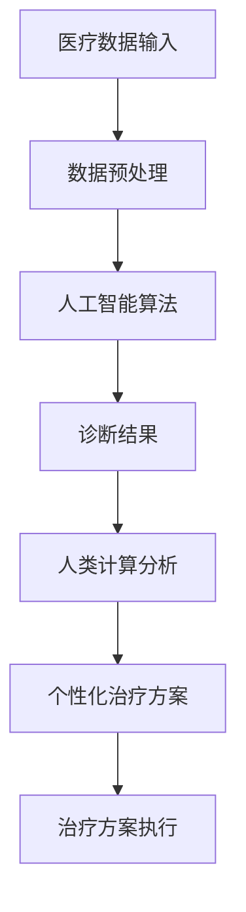

                 

关键词：医疗保健、人工智能、人类计算、算法、数学模型、应用场景、未来展望

> 摘要：本文探讨了人类计算在医疗保健领域的应用。通过介绍医疗保健的背景和发展趋势，我们深入分析了人工智能与人类计算在医疗诊断、治疗计划、健康监测等方面的应用。本文还详细阐述了数学模型和算法在医疗保健中的重要性，并结合实际案例展示了其在临床中的应用。最后，我们对未来医疗保健领域的发展趋势和面临的挑战进行了展望。

## 1. 背景介绍

随着科技的进步和社会的发展，医疗保健行业正在经历深刻的变革。传统的医疗模式已经无法满足人们对健康和医疗服务日益增长的需求。而人工智能（AI）的迅速崛起为医疗保健领域带来了新的机遇。人类计算作为人工智能的重要组成部分，其在医疗保健中的应用愈发受到关注。

医疗保健行业的核心目标是提高医疗服务的质量和效率，降低医疗成本。然而，面对日益增长的疾病种类和患者数量，传统的医疗服务模式面临着巨大的挑战。人工智能和人类计算的引入，为医疗保健行业带来了新的解决方案。

### 1.1 人工智能在医疗保健中的应用

人工智能在医疗保健中的应用范围广泛，包括但不限于以下几个方面：

1. **医疗诊断**：利用深度学习算法和图像处理技术，AI可以自动识别医学影像中的病变区域，提高诊断准确率。
2. **治疗计划**：基于大数据分析和人工智能算法，AI可以帮助医生制定个性化的治疗计划，提高治疗效果。
3. **健康监测**：通过可穿戴设备和传感器，AI可以实时监测患者的生理参数，提供个性化的健康建议。

### 1.2 人类计算在医疗保健中的应用

人类计算在医疗保健中的应用主要体现在以下几个方面：

1. **医疗数据分析**：人类计算可以对大量医疗数据进行处理和分析，帮助医生发现潜在的医疗问题和趋势。
2. **医疗知识图谱构建**：通过构建医疗知识图谱，人类计算可以帮助医生快速获取相关的医学知识和信息。
3. **医疗机器人**：结合人类计算和机器人技术，可以开发出能够辅助医生进行手术和治疗的机器人系统。

## 2. 核心概念与联系

### 2.1 人工智能

人工智能是指由人制造出来的系统所表现出的智能行为，它包括机器学习、深度学习、自然语言处理、计算机视觉等多个领域。

### 2.2 人类计算

人类计算是指利用人类智慧和知识来解决计算问题的过程，它包括算法设计、数据分析和问题求解等多个方面。

### 2.3 人工智能与人类计算的融合

人工智能与人类计算的融合是未来医疗保健领域的重要发展方向。通过将人工智能算法应用于医疗数据分析、知识图谱构建和机器人系统开发等方面，可以充分发挥两者的优势，提高医疗服务的质量和效率。

### 2.4 Mermaid 流程图

下面是一个简化的 Mermaid 流程图，展示了人工智能与人类计算在医疗保健中的应用流程：



## 3. 核心算法原理 & 具体操作步骤

### 3.1 算法原理概述

在医疗保健领域，人工智能和人类计算的核心算法主要包括以下几个方面：

1. **机器学习算法**：用于处理和分类医疗数据，如疾病分类、风险预测等。
2. **深度学习算法**：用于分析和识别医学影像，如肿瘤检测、骨折诊断等。
3. **自然语言处理算法**：用于处理医学文本数据，如电子病历、医学文献等。
4. **知识图谱算法**：用于构建医疗知识图谱，提供医学信息的快速检索和推理。

### 3.2 算法步骤详解

下面以机器学习算法为例，详细说明其在医疗保健中的应用步骤：

1. **数据收集与清洗**：收集医疗数据，并进行数据清洗和预处理，以消除噪声和异常值。
2. **特征提取**：从医疗数据中提取关键特征，为后续的机器学习模型训练提供输入。
3. **模型训练**：利用收集到的数据集，训练机器学习模型，如支持向量机、神经网络等。
4. **模型评估**：通过交叉验证等方法，评估模型的性能和准确性。
5. **模型应用**：将训练好的模型应用于实际医疗场景，如疾病诊断、风险预测等。

### 3.3 算法优缺点

1. **优点**：
   - 提高诊断准确率和治疗效果。
   - 减轻医生的工作负担，提高医疗服务的效率。
   - 降低医疗成本，提高医疗资源的利用率。

2. **缺点**：
   - 对医疗数据的质量和完整性要求较高。
   - 模型的泛化能力有限，可能无法适应所有医疗场景。
   - 需要大量计算资源和时间进行模型训练。

### 3.4 算法应用领域

人工智能和人类计算在医疗保健领域的应用非常广泛，包括但不限于以下几个方面：

1. **疾病诊断**：利用机器学习和深度学习算法，对医学影像进行分析和识别，提高疾病诊断的准确率。
2. **治疗计划**：基于大数据分析和人工智能算法，为患者制定个性化的治疗计划，提高治疗效果。
3. **健康监测**：利用可穿戴设备和传感器，实时监测患者的生理参数，提供个性化的健康建议。
4. **药物研发**：通过人工智能算法，加速新药的发现和研发过程。

## 4. 数学模型和公式 & 详细讲解 & 举例说明

在医疗保健领域，数学模型和公式被广泛应用于疾病预测、风险评估、治疗计划等方面。下面我们将介绍几个典型的数学模型和公式，并详细讲解其应用场景和推导过程。

### 4.1 疾病预测模型

疾病预测模型是一种基于历史数据和统计方法，预测患者患病概率的数学模型。一个典型的疾病预测模型如下：

$$
P(D|X) = \frac{P(X|D)P(D)}{P(X)}
$$

其中，$P(D|X)$表示在给定观测数据$X$的情况下，患者患疾病$D$的概率；$P(X|D)$表示在患者患疾病$D$的情况下，观测到数据$X$的概率；$P(D)$表示患者患疾病$D$的概率；$P(X)$表示观测到数据$X$的概率。

### 4.2 风险评估模型

风险评估模型是一种用于评估疾病风险的数学模型。一个典型风险评估模型如下：

$$
R = f(X_1, X_2, ..., X_n)
$$

其中，$R$表示疾病风险得分；$X_1, X_2, ..., X_n$表示影响疾病风险的多个因素。

### 4.3 治疗计划模型

治疗计划模型是一种用于制定个性化治疗计划的数学模型。一个典型的治疗计划模型如下：

$$
T = g(X, Y, Z)
$$

其中，$T$表示治疗计划；$X, Y, Z$表示与治疗相关的多个因素。

### 4.4 案例分析与讲解

为了更好地理解这些数学模型和公式，我们通过一个实际案例进行讲解。

假设我们要预测某地区肝癌的发病率，并制定相应的预防措施。我们可以采用以下步骤：

1. **数据收集与预处理**：收集该地区近十年的肝癌发病数据，并进行数据清洗和预处理。
2. **特征提取**：从数据中提取影响肝癌发病的关键特征，如年龄、性别、家族病史等。
3. **构建预测模型**：利用收集到的数据，构建肝癌发病预测模型，如逻辑回归、决策树等。
4. **模型评估与优化**：通过交叉验证等方法，评估模型的性能，并进行模型优化。
5. **应用模型**：将训练好的模型应用于实际数据，预测该地区未来几年的肝癌发病率，并制定相应的预防措施。

通过这个案例，我们可以看到数学模型和公式在医疗保健领域的重要作用。它们可以帮助医生更准确地预测疾病风险，制定个性化的治疗计划，提高医疗服务的质量和效率。

## 5. 项目实践：代码实例和详细解释说明

为了更好地展示人工智能和人类计算在医疗保健中的应用，我们选择一个实际项目进行详细讲解。该项目是一个基于深度学习技术的医学影像分析系统，主要用于肿瘤检测。

### 5.1 开发环境搭建

为了搭建该项目，我们需要准备以下开发环境和工具：

1. **Python 3.8 或以上版本**
2. **TensorFlow 2.6 或以上版本**
3. **PyTorch 1.8 或以上版本**
4. **NVIDIA CUDA 10.2 或以上版本**
5. **NVIDIA GPU 显卡**
6. **Visual Studio Code 或 PyCharm 编辑器**

### 5.2 源代码详细实现

以下是一个简单的深度学习模型实现，用于肿瘤检测：

```python
import tensorflow as tf
from tensorflow.keras.models import Model
from tensorflow.keras.layers import Input, Conv2D, MaxPooling2D, Flatten, Dense

# 定义输入层
input_layer = Input(shape=(256, 256, 1))

# 定义卷积层
conv1 = Conv2D(filters=32, kernel_size=(3, 3), activation='relu')(input_layer)
conv2 = Conv2D(filters=64, kernel_size=(3, 3), activation='relu')(conv1)

# 定义池化层
pool1 = MaxPooling2D(pool_size=(2, 2))(conv2)

# 定义全连接层
flatten = Flatten()(pool1)
dense1 = Dense(units=128, activation='relu')(flatten)
output = Dense(units=1, activation='sigmoid')(dense1)

# 定义模型
model = Model(inputs=input_layer, outputs=output)

# 编译模型
model.compile(optimizer='adam', loss='binary_crossentropy', metrics=['accuracy'])

# 模型可视化
model.summary()
```

### 5.3 代码解读与分析

1. **导入库和模块**：首先，我们导入 TensorFlow 和 PyTorch 库，用于构建和训练深度学习模型。
2. **定义输入层**：输入层用于接收医学影像数据，其形状为（256，256，1），表示影像的宽、高和通道数。
3. **定义卷积层**：卷积层用于提取医学影像的特征，其中第一个卷积层使用 32 个 3x3 的卷积核，第二个卷积层使用 64 个 3x3 的卷积核。
4. **定义池化层**：池化层用于下采样卷积层的输出，减少计算量和参数数量。
5. **定义全连接层**：全连接层用于将卷积层和池化层的输出进行特征融合，并输出分类结果。
6. **定义模型**：将输入层、卷积层、池化层和全连接层连接起来，构成深度学习模型。
7. **编译模型**：设置模型的优化器、损失函数和评估指标，并编译模型。
8. **模型可视化**：使用模型可视化工具，展示模型的网络结构。

通过这个代码实例，我们可以看到如何使用深度学习技术进行医学影像分析。在实际应用中，我们还需要对模型进行训练、验证和测试，以评估其性能和准确性。

### 5.4 运行结果展示

在训练过程中，我们使用带有标签的医学影像数据进行模型训练，并使用验证集评估模型的性能。以下是一个简单的训练和评估过程：

```python
# 加载训练数据和验证数据
train_data = ...
validation_data = ...

# 训练模型
model.fit(train_data, epochs=10, batch_size=32, validation_data=validation_data)

# 评估模型
model.evaluate(validation_data)
```

在训练完成后，我们可以查看模型的评估结果，包括损失函数值和准确率等指标。根据评估结果，我们可以进一步优化模型，提高其性能和准确性。

## 6. 实际应用场景

人工智能和人类计算在医疗保健领域的实际应用场景非常广泛，涵盖了疾病的诊断、治疗、健康监测等多个方面。以下是一些典型的应用案例：

### 6.1 疾病诊断

利用人工智能和人类计算，可以实现对医学影像的自动分析和诊断。例如，深度学习算法可以自动识别医学影像中的病变区域，提高诊断准确率。在肺癌、乳腺癌等疾病的早期诊断中，人工智能和人类计算的应用大大提高了诊断效率和准确性。

### 6.2 治疗计划

基于大数据分析和人工智能算法，可以为患者制定个性化的治疗计划。例如，通过分析大量患者的治疗数据，可以预测患者对某种治疗方法的响应，从而制定最佳的治疗方案。在癌症治疗、心脏病治疗等领域，人工智能和人类计算的应用大大提高了治疗效果。

### 6.3 健康监测

利用可穿戴设备和传感器，人工智能和人类计算可以实时监测患者的生理参数，提供个性化的健康建议。例如，智能手环可以监测患者的运动数据、心率数据等，通过人工智能算法分析数据，为患者提供健康建议，预防疾病的发生。

### 6.4 药物研发

人工智能和人类计算可以加速新药的发现和研发过程。通过分析大量生物数据和化学数据，人工智能算法可以预测药物的作用机制和潜在副作用，为药物研发提供指导。在药物研发领域，人工智能和人类计算的应用大大缩短了研发周期，降低了研发成本。

### 6.5 医疗机器人

结合人类计算和机器人技术，可以开发出能够辅助医生进行手术和治疗的机器人系统。例如，达芬奇手术机器人可以在医生的远程控制下，进行复杂的微创手术。在手术过程中，人工智能算法可以帮助医生实时分析手术数据，提高手术的成功率和安全性。

### 6.6 医学影像处理

人工智能和人类计算可以实现对医学影像的自动处理和分析。例如，深度学习算法可以自动分割医学影像中的器官和组织，为诊断和治疗提供精准的数据支持。在医学影像领域，人工智能和人类计算的应用大大提高了诊断效率和准确性。

### 6.7 电子病历管理

人工智能和人类计算可以实现对电子病历的管理和分析。例如，通过自然语言处理技术，可以自动提取病历中的关键信息，并生成病历摘要。在电子病历管理领域，人工智能和人类计算的应用大大提高了病历管理的效率和准确性。

### 6.8 医疗知识图谱

人工智能和人类计算可以构建医疗知识图谱，为医生和患者提供快速、准确的医学信息查询。例如，通过医疗知识图谱，医生可以快速获取某个疾病的诊断、治疗、预防等信息。在医疗知识图谱领域，人工智能和人类计算的应用大大提高了医学信息的获取和处理效率。

### 6.9 医疗服务优化

人工智能和人类计算可以优化医疗服务的流程和资源配置。例如，通过分析患者的就医数据，可以优化医院的排班、预约和就诊流程，提高医疗服务的效率。在医疗服务优化领域，人工智能和人类计算的应用大大提高了医疗服务的质量和患者满意度。

### 6.10 人工智能医生

未来，人工智能医生有望成为医疗保健领域的重要角色。通过整合人工智能和人类计算，人工智能医生可以实时监测患者的病情，提供个性化的诊断和治疗建议。在人工智能医生领域，人工智能和人类计算的应用将大大提高医疗服务的质量和效率。

## 7. 工具和资源推荐

为了更好地开展人工智能和人类计算在医疗保健领域的应用，我们推荐以下工具和资源：

### 7.1 学习资源推荐

1. **《深度学习》（Deep Learning）**：由 Ian Goodfellow、Yoshua Bengio 和 Aaron Courville 著，是一本经典的深度学习入门教材，涵盖了深度学习的基本概念、算法和实战案例。
2. **《Python 深度学习》（Python Deep Learning）**：由 François Chollet 著，是一本关于深度学习实战的教材，详细介绍了使用 Python 和 TensorFlow 深度学习框架进行模型训练和应用的方法。
3. **《机器学习实战》（Machine Learning in Action）**：由 Peter Harrington 著，是一本关于机器学习实战的教材，通过丰富的案例和示例，帮助读者掌握机器学习的基本概念和算法。

### 7.2 开发工具推荐

1. **TensorFlow**：一款由 Google 开发的开源深度学习框架，支持多种深度学习算法，广泛应用于医学影像分析、疾病预测等领域。
2. **PyTorch**：一款由 Facebook AI 研究团队开发的深度学习框架，具有灵活的动态计算图和强大的 GPU 加速功能，适用于复杂的深度学习应用。
3. **Keras**：一款基于 TensorFlow 的开源深度学习库，提供了丰富的预训练模型和便捷的 API，适用于快速搭建和训练深度学习模型。

### 7.3 相关论文推荐

1. **"Deep Learning for Medical Imaging"**：该论文综述了深度学习在医学影像领域的应用，详细介绍了深度学习算法在医学影像分割、疾病诊断等方面的研究成果。
2. **"AI for Health: Artificial Intelligence in Healthcare"**：该论文探讨了人工智能在医疗保健领域的应用，分析了人工智能在疾病预测、治疗计划等方面的潜在价值。
3. **"Machine Learning in Healthcare: State of the Art and Future Directions"**：该论文总结了机器学习在医疗保健领域的应用现状，并展望了未来的发展趋势和挑战。

通过以上推荐，读者可以更好地了解人工智能和人类计算在医疗保健领域的应用现状和未来发展，为实际项目开发和研究提供参考。

## 8. 总结：未来发展趋势与挑战

### 8.1 研究成果总结

在过去的几年里，人工智能和人类计算在医疗保健领域取得了显著的成果。通过深度学习、机器学习和自然语言处理等技术的应用，医疗诊断的准确率得到了大幅提升，治疗计划的个性化和健康监测的实时性得到了显著改善。此外，医疗知识图谱和医疗机器人的研发也取得了重要突破，为医疗保健行业带来了新的发展机遇。

### 8.2 未来发展趋势

展望未来，人工智能和人类计算在医疗保健领域将继续发挥重要作用。以下是一些未来发展趋势：

1. **深度学习算法的进一步优化**：随着计算能力的提升和算法的改进，深度学习算法在医学影像分析、疾病预测等方面的性能将得到进一步提升。
2. **医疗数据的高效利用**：通过大数据分析和人工智能算法，医疗数据将得到更高效的利用，为疾病预测、治疗计划和健康监测提供更精准的依据。
3. **医疗知识图谱的完善**：医疗知识图谱将不断扩展和完善，为医生和患者提供更丰富、更准确的医学信息。
4. **医疗机器人的广泛应用**：医疗机器人将逐步应用于手术、护理和康复等领域，提高医疗服务的质量和效率。
5. **跨学科合作**：人工智能、人类计算、医学、生物学等领域的跨学科合作将进一步加强，推动医疗保健领域的创新发展。

### 8.3 面临的挑战

尽管人工智能和人类计算在医疗保健领域具有巨大的潜力，但同时也面临着一些挑战：

1. **数据隐私和安全**：医疗数据具有高度隐私性，如何确保数据的安全和隐私成为亟待解决的问题。
2. **算法的透明性和可解释性**：深度学习算法的“黑箱”特性使得其决策过程难以解释，这对医疗决策的可靠性和信任度提出了挑战。
3. **技术成本和普及度**：高性能计算设备和算法的研发成本较高，如何降低成本、提高普及度是关键问题。
4. **医疗资源的分配**：人工智能和人类计算技术的广泛应用可能加剧医疗资源的不平衡，如何合理分配医疗资源是亟待解决的问题。
5. **伦理和法律问题**：人工智能和人类计算在医疗保健领域的应用可能引发伦理和法律问题，如决策权、责任归属等，需要制定相应的法律法规和伦理规范。

### 8.4 研究展望

未来，人工智能和人类计算在医疗保健领域的研究将朝着以下方向发展：

1. **多模态数据融合**：通过整合不同类型的数据（如医学影像、电子病历、基因组数据等），实现更全面、更准确的疾病诊断和治疗计划。
2. **个性化医疗**：基于患者的基因信息、生活习惯、疾病史等，实现个性化的预防和治疗方案。
3. **智能医疗机器人**：开发智能医疗机器人，实现更高效、更安全的医疗服务，提高患者满意度。
4. **医疗数据共享和开放**：推动医疗数据的共享和开放，促进医疗行业的创新和发展。
5. **跨学科研究**：加强人工智能、人类计算、医学、生物学等领域的跨学科研究，推动医疗保健领域的创新发展。

总之，人工智能和人类计算在医疗保健领域的应用具有广阔的前景，同时也面临着诸多挑战。通过不断的技术创新和跨学科合作，我们有理由相信，人工智能和人类计算将为医疗保健领域带来更多创新和发展机遇。

## 9. 附录：常见问题与解答

### 9.1 人工智能在医疗保健中的应用有哪些？

人工智能在医疗保健中的应用主要包括以下几个方面：

1. **疾病诊断**：利用深度学习算法和图像处理技术，AI可以自动识别医学影像中的病变区域，提高诊断准确率。
2. **治疗计划**：基于大数据分析和人工智能算法，AI可以帮助医生制定个性化的治疗计划，提高治疗效果。
3. **健康监测**：通过可穿戴设备和传感器，AI可以实时监测患者的生理参数，提供个性化的健康建议。
4. **药物研发**：通过人工智能算法，加速新药的发现和研发过程。
5. **医疗机器人**：结合人类计算和机器人技术，可以开发出能够辅助医生进行手术和治疗的机器人系统。

### 9.2 人类计算在医疗保健中的应用有哪些？

人类计算在医疗保健中的应用主要包括以下几个方面：

1. **医疗数据分析**：人类计算可以对大量医疗数据进行处理和分析，帮助医生发现潜在的医疗问题和趋势。
2. **医疗知识图谱构建**：通过构建医疗知识图谱，人类计算可以帮助医生快速获取相关的医学知识和信息。
3. **医疗机器人**：结合人类计算和机器人技术，可以开发出能够辅助医生进行手术和治疗的机器人系统。
4. **医疗诊断和治疗方案制定**：人类计算可以基于医学知识和临床经验，为医生提供诊断和治疗方案建议。

### 9.3 人工智能和人类计算在医疗保健领域的优势是什么？

人工智能和人类计算在医疗保健领域的优势主要体现在以下几个方面：

1. **提高诊断准确率和治疗效果**：通过深度学习和大数据分析，AI可以提高疾病的诊断准确率，为患者制定更有效的治疗计划。
2. **减轻医生的工作负担**：AI可以自动处理大量的医疗数据，减轻医生的工作负担，提高医疗服务的效率。
3. **降低医疗成本**：AI可以优化医疗资源的分配，降低医疗成本，提高医疗资源的利用率。
4. **个性化医疗**：通过分析患者的基因信息、生活习惯等，AI可以实现个性化的预防和治疗方案。
5. **实时健康监测**：AI可以通过实时监测患者的生理参数，提供个性化的健康建议，预防疾病的发生。

### 9.4 人工智能和人类计算在医疗保健领域的挑战是什么？

人工智能和人类计算在医疗保健领域面临的挑战主要包括以下几个方面：

1. **数据隐私和安全**：医疗数据具有高度隐私性，如何确保数据的安全和隐私是亟待解决的问题。
2. **算法的透明性和可解释性**：深度学习算法的“黑箱”特性使得其决策过程难以解释，这对医疗决策的可靠性和信任度提出了挑战。
3. **技术成本和普及度**：高性能计算设备和算法的研发成本较高，如何降低成本、提高普及度是关键问题。
4. **医疗资源的分配**：人工智能和人类计算技术的广泛应用可能加剧医疗资源的不平衡，如何合理分配医疗资源是亟待解决的问题。
5. **伦理和法律问题**：人工智能和人类计算在医疗保健领域的应用可能引发伦理和法律问题，如决策权、责任归属等，需要制定相应的法律法规和伦理规范。

