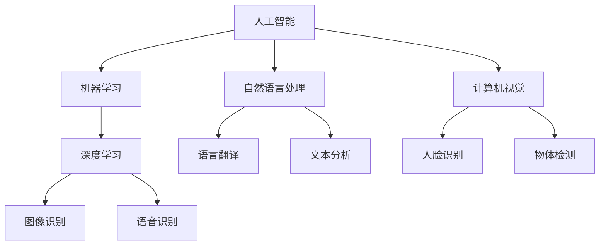

                 

 在当今这个快速发展的AI时代，人类计算的就业前景变得尤为重要。本文将探讨AI时代下人类计算的角色、技能需求、以及未来的发展趋势。我们将通过详细的分析和实例，帮助您了解这个领域的最新动态和挑战。

## 关键词

- 人工智能
- 人类计算
- 就业前景
- 技术技能
- 职业发展

## 摘要

本文旨在为读者提供AI时代人类计算领域的全景图。我们将深入探讨AI如何影响就业市场，人类计算技能的演变，以及未来可能出现的职业机会和挑战。通过分析现有的数据和案例，我们将揭示哪些技能将成为未来的关键，并探讨如何为这一转变做好准备。

## 1. 背景介绍

人工智能（AI）已经成为现代科技的核心驱动力。从自动驾驶汽车到智能助手，从医疗诊断到金融交易，AI正在深刻地改变我们的生活方式和工作方式。随着AI技术的不断进步，传统的计算任务正在自动化，这对未来的就业市场产生了深远的影响。

### 1.1 AI的发展历史

AI的研究始于20世纪50年代，当时的科学家们希望通过模拟人类思维过程来实现机器的智能。虽然早期的AI系统在特定任务上取得了显著成就，但它们在处理复杂、不确定的任务时仍存在局限性。随着计算能力的提升和数据量的增加，深度学习等现代AI技术在过去十年中取得了突破性进展。

### 1.2 AI对就业市场的影响

AI技术的广泛应用不仅带来了生产效率的提升，还引发了就业市场的变革。一方面，自动化和智能化的进程使得一些传统职位面临被取代的风险；另一方面，新的职业机会也在不断涌现。了解这一变革的背景和趋势，对于个人职业规划至关重要。

## 2. 核心概念与联系

在深入探讨AI时代的人类计算之前，我们需要理解一些核心概念和它们之间的联系。以下是AI时代的一些关键概念及其相互关系，附带的Mermaid流程图将帮助您更好地理解这些概念。

### 2.1 关键概念

- **人工智能（AI）**：模拟人类智能的计算机系统。
- **机器学习（ML）**：AI的一个分支，通过数据学习来改进性能。
- **深度学习（DL）**：机器学习的一个子领域，使用多层神经网络进行学习。
- **自然语言处理（NLP）**：使计算机能够理解、解释和生成人类语言的技术。
- **计算机视觉（CV）**：使计算机能够理解和解释视觉信息的技术。

### 2.2 Mermaid流程图



## 3. 核心算法原理 & 具体操作步骤

在了解核心概念之后，让我们来探讨一些AI领域中的核心算法原理和具体操作步骤。

### 3.1 算法原理概述

AI算法的核心在于如何从数据中学习并做出预测或决策。以下是几种常用的算法：

- **线性回归**：用于预测数值输出。
- **逻辑回归**：用于分类问题。
- **支持向量机（SVM）**：用于分类和回归。
- **神经网络**：用于复杂的非线性预测和分类。

### 3.2 算法步骤详解

以神经网络为例，以下是基本的操作步骤：

1. **数据预处理**：清洗和转换数据，使其适合训练。
2. **模型构建**：定义网络的架构，包括输入层、隐藏层和输出层。
3. **权重初始化**：随机初始化网络权重。
4. **前向传播**：计算网络的输出。
5. **反向传播**：更新权重，以最小化损失函数。
6. **迭代训练**：重复步骤4和5，直到达到预定的训练次数或损失值。

### 3.3 算法优缺点

每种算法都有其优缺点。例如，神经网络可以处理复杂的问题，但训练时间较长；线性回归简单快速，但可能无法捕捉非线性关系。

### 3.4 算法应用领域

AI算法广泛应用于各种领域，包括：

- **医疗诊断**：通过图像识别和自然语言处理，辅助医生进行诊断。
- **金融分析**：通过预测市场趋势和风险管理，提高投资效率。
- **制造业**：通过计算机视觉和机器人技术，提高生产效率和产品质量。

## 4. 数学模型和公式 & 详细讲解 & 举例说明

在AI算法中，数学模型和公式起着至关重要的作用。以下是一些常用的数学模型和公式的详细讲解及举例。

### 4.1 数学模型构建

- **损失函数**：用于衡量预测值与实际值之间的差距。
- **优化算法**：用于更新模型参数，以最小化损失函数。

### 4.2 公式推导过程

以损失函数为例，常见的有均方误差（MSE）：

$$
MSE = \frac{1}{n}\sum_{i=1}^{n}(y_i - \hat{y_i})^2
$$

其中，$y_i$是实际值，$\hat{y_i}$是预测值，$n$是样本数量。

### 4.3 案例分析与讲解

假设我们有一个分类问题，使用逻辑回归模型进行预测。我们可以使用以下步骤：

1. **数据预处理**：标准化特征值。
2. **模型构建**：定义逻辑回归模型。
3. **训练模型**：使用训练数据训练模型。
4. **评估模型**：使用测试数据评估模型性能。

## 5. 项目实践：代码实例和详细解释说明

以下是一个简单的神经网络训练实例，我们将使用Python和TensorFlow库来实现。

### 5.1 开发环境搭建

首先，确保安装了Python和TensorFlow库。可以使用以下命令进行安装：

```bash
pip install tensorflow
```

### 5.2 源代码详细实现

```python
import tensorflow as tf
from tensorflow.keras import layers

# 定义模型
model = tf.keras.Sequential([
    layers.Dense(64, activation='relu', input_shape=(784,)),
    layers.Dense(10, activation='softmax')
])

# 编译模型
model.compile(optimizer='adam',
              loss='categorical_crossentropy',
              metrics=['accuracy'])

# 训练模型
model.fit(x_train, y_train, epochs=5)

# 评估模型
loss, accuracy = model.evaluate(x_test, y_test)
print(f"Test accuracy: {accuracy:.2f}")
```

### 5.3 代码解读与分析

这段代码首先定义了一个简单的神经网络模型，包含一个输入层、一个隐藏层和一个输出层。隐藏层使用ReLU激活函数，输出层使用softmax激活函数以实现多类分类。模型使用adam优化器和交叉熵损失函数进行编译，并使用训练数据训练5个周期。最后，使用测试数据评估模型性能。

### 5.4 运行结果展示

在训练完成后，我们得到了测试数据的准确率。例如，如果测试准确率为95%，这表明模型在未知数据上的表现良好。

## 6. 实际应用场景

AI技术在各行各业都有广泛的应用。以下是一些实际应用场景：

- **医疗保健**：通过AI诊断疾病、预测患者病情。
- **金融服务**：通过AI进行风险管理、自动化交易。
- **制造业**：通过AI优化生产流程、提高产品质量。
- **零售业**：通过AI进行个性化推荐、客户行为分析。

### 6.4 未来应用展望

随着AI技术的不断进步，未来可能会有更多的领域受益。例如，AI可能会在环境保护、能源管理、教育等领域发挥重要作用。

## 7. 工具和资源推荐

### 7.1 学习资源推荐

- 《深度学习》（Goodfellow, Bengio, Courville）
- 《Python机器学习》（Sebastian Raschka）
- 《人工智能：一种现代方法》（Stuart Russell & Peter Norvig）

### 7.2 开发工具推荐

- TensorFlow
- PyTorch
- Keras

### 7.3 相关论文推荐

- "Deep Learning: Methods and Applications"（Goodfellow et al., 2016）
- "Generative Adversarial Networks"（Goodfellow et al., 2014）
- "Recurrent Neural Networks for Language Modeling"（Graves et al., 2013）

## 8. 总结：未来发展趋势与挑战

### 8.1 研究成果总结

AI领域在过去几年中取得了显著进展，从语音识别到图像识别，从自然语言处理到自动驾驶，AI技术正在不断突破边界。

### 8.2 未来发展趋势

随着计算能力的提升和数据量的增加，AI技术将更加成熟和普及。未来的发展趋势可能包括：

- 更强大的算法和模型
- 更加智能的自动化系统
- 更广泛的应用领域

### 8.3 面临的挑战

尽管AI技术具有巨大的潜力，但仍然面临一些挑战：

- 数据隐私和安全
- 资源分配和公平性
- 伦理和法律问题

### 8.4 研究展望

为了应对这些挑战，未来的研究可能集中在以下几个方面：

- 算法的可解释性
- 安全和隐私保护
- 跨学科研究

## 9. 附录：常见问题与解答

### 9.1 什么是深度学习？

深度学习是一种机器学习方法，使用多层神经网络进行学习，以处理复杂的非线性问题。

### 9.2 机器学习和深度学习有什么区别？

机器学习是更广泛的领域，包括多种学习算法，而深度学习是机器学习的一个子领域，专注于使用多层神经网络。

### 9.3 如何入门AI？

可以通过学习基础数学（线性代数、微积分等），掌握Python编程，并阅读相关书籍和论文来入门AI。

### 9.4 AI会取代人类吗？

AI可能会取代一些重复性和低技能的任务，但在需要创造力、判断力和人际交往的领域，AI暂时还无法完全取代人类。

## 作者署名

作者：禅与计算机程序设计艺术 / Zen and the Art of Computer Programming

----------------------------------------------------------------

以上就是本文的全部内容。希望本文能够帮助您更好地理解AI时代人类计算的职业前景，并激发您在这个领域的热情。在AI不断发展的今天，掌握相关技能将为您的职业发展带来无限可能。

