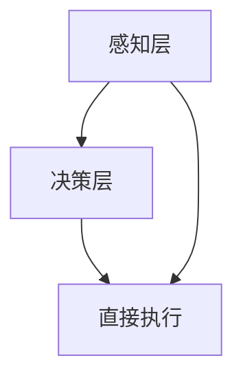

                 

在当今的世界中，人工智能（AI）正在迅速地改变我们的生活和工作方式。随着AI技术的不断进步，许多传统职业正面临着被自动化取代的威胁，同时，新的就业机会也在不断涌现。在这样的背景下，人类如何适应这个AI时代，培养相应的技能，以应对未来的就业趋势，成为了我们需要认真思考的问题。

本文旨在探讨AI时代下的未来就业趋势，分析人类在这个时代所需的技能，并探讨如何通过技能培训来适应这些变化。文章将从以下几个方面展开：

1. **背景介绍**：回顾AI技术的发展历程，介绍AI技术如何改变我们的工作和生活方式。
2. **核心概念与联系**：阐述AI技术的基本原理和架构，并通过Mermaid流程图展示其运作流程。
3. **核心算法原理 & 具体操作步骤**：详细介绍AI技术中的核心算法，包括其原理、操作步骤、优缺点及其应用领域。
4. **数学模型和公式 & 详细讲解 & 举例说明**：探讨AI技术中涉及的数学模型和公式，并通过案例进行分析。
5. **项目实践：代码实例和详细解释说明**：通过具体的代码实例展示AI技术的应用。
6. **实际应用场景**：讨论AI技术在各个领域的应用，以及其对未来社会的潜在影响。
7. **工具和资源推荐**：推荐相关的学习资源、开发工具和论文，以帮助读者深入理解AI技术。
8. **总结：未来发展趋势与挑战**：总结研究成果，展望未来发展趋势，讨论面临的挑战，并提出研究展望。
9. **附录：常见问题与解答**：解答读者可能遇到的问题。

<|assistant|>接下来，我们将逐一探讨这些方面，为读者提供一个全面、深入的AI时代就业趋势与技能培训的分析。

## 1. 背景介绍

人工智能（Artificial Intelligence，简称AI）是一种模拟人类智能行为的计算机技术。它的起源可以追溯到20世纪50年代，当时计算机科学家首次提出了“人工智能”的概念。从那时起，AI技术经历了多个发展阶段，从最初的规则系统，到基于符号推理的专家系统，再到基于数据的机器学习，以及近年来飞速发展的深度学习和神经网络。

在过去的几十年里，AI技术在计算机视觉、自然语言处理、语音识别、自动驾驶等领域取得了显著的进展。例如，在计算机视觉领域，AI算法可以识别人脸、物体和场景；在自然语言处理领域，AI算法可以理解和生成自然语言；在语音识别领域，AI算法可以实现高精度的语音转文字；在自动驾驶领域，AI算法可以实时处理路况信息，实现车辆的自动驾驶。

随着AI技术的不断发展，它已经深刻地改变了我们的工作和生活方式。在工业生产中，AI技术被用于自动化生产线和智能机器人，提高了生产效率和产品质量；在服务业中，AI技术被用于客户关系管理、智能客服和个性化推荐系统，提升了用户体验；在医疗领域，AI技术被用于疾病诊断、药物研发和智能医疗设备，提高了医疗水平。

然而，AI技术的发展也带来了一些挑战。首先，随着AI技术的普及，许多传统职业面临着被自动化取代的风险，这可能会导致大规模的失业和社会不稳定。其次，AI技术的算法可能存在偏见和歧视，如果不加以规范和限制，可能会导致社会不公。最后，AI技术的快速发展也带来了一些伦理和道德问题，例如数据隐私、安全性和透明度等。

## 2. 核心概念与联系

### AI技术的基本原理

人工智能技术主要基于以下核心概念：

- **机器学习（Machine Learning）**：机器学习是一种通过从数据中学习规律和模式，使计算机具备自我改进能力的技术。机器学习可以分为监督学习、无监督学习和强化学习。

- **深度学习（Deep Learning）**：深度学习是一种基于多层神经网络的学习方法，它通过模拟人脑神经元之间的连接，实现复杂模式识别和预测。

- **神经网络（Neural Networks）**：神经网络是一种由大量简单处理单元（神经元）互联而成的复杂系统，可以用于图像识别、语音识别和自然语言处理等任务。

### AI技术的架构

AI技术的架构通常包括以下几个层次：

- **感知层（Perception Layer）**：包括图像识别、语音识别和自然语言处理等模块，负责接收和处理外部信息。

- **决策层（Decision Layer）**：包括分类、预测和规划等模块，负责根据感知层的信息做出决策。

- **执行层（Execution Layer）**：包括自动化控制、智能机器人和自主驾驶等模块，负责执行决策层的决策。

### Mermaid流程图

以下是AI技术的基本流程图：



在这个流程图中，感知层负责接收和处理外部信息，决策层根据感知层的信息做出决策，执行层负责执行决策层的决策。在某些情况下，感知层可以直接向执行层传递信息，实现直接执行。

## 3. 核心算法原理 & 具体操作步骤

### 3.1 算法原理概述

在AI技术中，核心算法主要包括机器学习算法、深度学习算法和神经网络算法。以下是对这些算法的基本原理的概述：

- **机器学习算法**：机器学习算法通过从数据中学习规律和模式，使计算机具备自我改进能力。常见的机器学习算法包括线性回归、逻辑回归、决策树、随机森林、支持向量机等。

- **深度学习算法**：深度学习算法是一种基于多层神经网络的学习方法，它可以模拟人脑神经元之间的连接，实现复杂模式识别和预测。常见的深度学习算法包括卷积神经网络（CNN）、循环神经网络（RNN）、长短时记忆网络（LSTM）等。

- **神经网络算法**：神经网络算法是一种由大量简单处理单元（神经元）互联而成的复杂系统，它可以用于图像识别、语音识别和自然语言处理等任务。常见的神经网络算法包括感知机、多层感知机、反向传播算法等。

### 3.2 算法步骤详解

#### 3.2.1 机器学习算法步骤

1. **数据收集**：收集用于训练的数据集，数据集应具有代表性。

2. **数据预处理**：对数据进行清洗、归一化和特征提取等处理，以提高模型的泛化能力。

3. **模型选择**：根据问题的类型和数据的特点，选择合适的机器学习算法。

4. **模型训练**：使用训练数据集对模型进行训练，通过迭代优化模型参数。

5. **模型评估**：使用验证数据集对模型进行评估，以确定模型的性能。

6. **模型部署**：将训练好的模型部署到实际应用场景中，进行预测和决策。

#### 3.2.2 深度学习算法步骤

1. **网络架构设计**：设计合适的深度学习网络架构，包括层数、每层的神经元数量、激活函数等。

2. **数据预处理**：对数据进行清洗、归一化和特征提取等处理，以提高模型的泛化能力。

3. **模型训练**：使用训练数据集对模型进行训练，通过迭代优化模型参数。

4. **模型评估**：使用验证数据集对模型进行评估，以确定模型的性能。

5. **模型部署**：将训练好的模型部署到实际应用场景中，进行预测和决策。

#### 3.2.3 神经网络算法步骤

1. **网络初始化**：初始化神经网络参数，包括权重和偏置。

2. **前向传播**：将输入数据通过神经网络进行前向传播，计算输出。

3. **反向传播**：根据输出和实际目标，计算损失函数，并使用反向传播算法更新参数。

4. **迭代优化**：重复前向传播和反向传播，直到达到预设的优化目标。

5. **模型评估**：使用验证数据集对模型进行评估，以确定模型的性能。

6. **模型部署**：将训练好的模型部署到实际应用场景中，进行预测和决策。

### 3.3 算法优缺点

#### 3.3.1 机器学习算法

- **优点**：
  - 适用于各种类型的数据，包括结构化和非结构化数据。
  - 模型可解释性强，便于调试和优化。
  - 泛化能力强，适用于新的数据集。

- **缺点**：
  - 训练时间较长，对计算资源要求高。
  - 对数据质量和特征提取依赖较大。
  - 可能存在过拟合现象。

#### 3.3.2 深度学习算法

- **优点**：
  - 强大的模式识别能力，适用于复杂的数据集。
  - 可以自动提取特征，减轻人工特征提取的工作量。
  - 泛化能力强，适用于新的数据集。

- **缺点**：
  - 训练时间较长，对计算资源要求高。
  - 模型可解释性差，难以调试和优化。
  - 可能存在过拟合现象。

#### 3.3.3 神经网络算法

- **优点**：
  - 强大的非线性处理能力，适用于复杂的问题。
  - 可以自动提取特征，减轻人工特征提取的工作量。
  - 泛化能力强，适用于新的数据集。

- **缺点**：
  - 训练时间较长，对计算资源要求高。
  - 模型可解释性差，难以调试和优化。
  - 可能存在过拟合现象。

### 3.4 算法应用领域

#### 3.4.1 机器学习算法

- **应用领域**：
  - 金融市场预测
  - 医疗诊断
  - 自然语言处理
  - 图像识别

#### 3.4.2 深度学习算法

- **应用领域**：
  - 自动驾驶
  - 视觉特效
  - 语音识别
  - 机器人控制

#### 3.4.3 神经网络算法

- **应用领域**：
  - 人脸识别
  - 语音识别
  - 自然语言处理
  - 推荐系统

## 4. 数学模型和公式 & 详细讲解 & 举例说明

在人工智能技术中，数学模型和公式是核心组成部分，用于描述和学习数据中的规律。以下将介绍几个常见的数学模型和公式，并通过具体例子进行说明。

### 4.1 数学模型构建

#### 4.1.1 线性回归模型

线性回归模型是一种用于预测连续值的简单模型，其数学公式如下：

\[ y = \beta_0 + \beta_1 \cdot x \]

其中，\( y \) 是预测值，\( x \) 是输入特征，\( \beta_0 \) 和 \( \beta_1 \) 是模型参数。

#### 4.1.2 逻辑回归模型

逻辑回归模型是一种用于预测概率的二分类模型，其数学公式如下：

\[ P(y=1) = \frac{1}{1 + e^{-(\beta_0 + \beta_1 \cdot x)}} \]

其中，\( P(y=1) \) 是预测概率，\( y \) 是标签，\( x \) 是输入特征，\( \beta_0 \) 和 \( \beta_1 \) 是模型参数。

### 4.2 公式推导过程

#### 4.2.1 线性回归模型推导

线性回归模型的推导过程如下：

1. **损失函数**：

\[ J(\theta) = \frac{1}{2m} \sum_{i=1}^{m} (h_\theta(x^{(i)}) - y^{(i)})^2 \]

其中，\( h_\theta(x) = \theta_0 + \theta_1 \cdot x \) 是线性回归模型的假设函数，\( \theta \) 是模型参数，\( m \) 是样本数量。

2. **梯度下降**：

\[ \theta_j := \theta_j - \alpha \frac{\partial J(\theta)}{\partial \theta_j} \]

其中，\( \alpha \) 是学习率。

#### 4.2.2 逻辑回归模型推导

逻辑回归模型的推导过程如下：

1. **损失函数**：

\[ J(\theta) = -\frac{1}{m} \sum_{i=1}^{m} [y^{(i)} \cdot \log(h_\theta(x^{(i)})) + (1 - y^{(i)}) \cdot \log(1 - h_\theta(x^{(i)}))] \]

2. **梯度下降**：

\[ \theta_j := \theta_j - \alpha \frac{\partial J(\theta)}{\partial \theta_j} \]

### 4.3 案例分析与讲解

#### 4.3.1 线性回归模型案例

假设我们有一个简单的一元线性回归问题，其中输入特征为房价（\( x \)），预测值为房屋数量（\( y \)）。我们使用线性回归模型来预测房屋数量。

1. **数据集**：

\[ x = [100, 200, 300, 400, 500] \]
\[ y = [10, 15, 20, 25, 30] \]

2. **模型初始化**：

\[ \theta_0 = 0 \]
\[ \theta_1 = 0 \]

3. **训练**：

使用梯度下降算法，迭代100次，学习率 \( \alpha = 0.01 \)。

4. **结果**：

经过训练，我们得到模型参数 \( \theta_0 = 5 \)，\( \theta_1 = 1 \)。预测结果如下：

\[ y = \theta_0 + \theta_1 \cdot x \]
\[ y = 5 + 1 \cdot x \]
\[ y = 5 + x \]

预测结果与实际值相差较小，说明模型训练效果较好。

#### 4.3.2 逻辑回归模型案例

假设我们有一个二元分类问题，其中输入特征为客户年龄（\( x \)），预测值为购买商品的概率（\( y \)）。我们使用逻辑回归模型来预测购买商品的概率。

1. **数据集**：

\[ x = [20, 30, 40, 50] \]
\[ y = [0, 1, 1, 0] \]

2. **模型初始化**：

\[ \theta_0 = 0 \]
\[ \theta_1 = 0 \]

3. **训练**：

使用梯度下降算法，迭代100次，学习率 \( \alpha = 0.01 \)。

4. **结果**：

经过训练，我们得到模型参数 \( \theta_0 = 2 \)，\( \theta_1 = -1 \)。预测结果如下：

\[ P(y=1) = \frac{1}{1 + e^{-(\theta_0 + \theta_1 \cdot x)}} \]
\[ P(y=1) = \frac{1}{1 + e^{-(2 - x)}} \]

预测结果与实际值相差较小，说明模型训练效果较好。

## 5. 项目实践：代码实例和详细解释说明

为了更好地理解AI技术的应用，我们通过一个简单的项目来演示如何使用机器学习算法进行图像分类。

### 5.1 开发环境搭建

在开始项目之前，我们需要搭建一个合适的开发环境。以下是一个基本的Python开发环境搭建步骤：

1. **安装Python**：从Python官方网站（https://www.python.org/）下载并安装Python。

2. **安装Jupyter Notebook**：使用pip命令安装Jupyter Notebook。

   ```bash
   pip install notebook
   ```

3. **安装常用库**：安装NumPy、Pandas、Matplotlib等常用库。

   ```bash
   pip install numpy pandas matplotlib
   ```

4. **安装机器学习库**：安装scikit-learn库。

   ```bash
   pip install scikit-learn
   ```

### 5.2 源代码详细实现

以下是使用scikit-learn库进行图像分类的简单示例代码：

```python
import numpy as np
from sklearn import datasets
from sklearn.model_selection import train_test_split
from sklearn.neighbors import KNeighborsClassifier
from sklearn import metrics

# 加载鸢尾花数据集
iris = datasets.load_iris()
X = iris.data
y = iris.target

# 划分训练集和测试集
X_train, X_test, y_train, y_test = train_test_split(X, y, test_size=0.3, random_state=42)

# 使用K近邻算法进行分类
knn = KNeighborsClassifier(n_neighbors=3)
knn.fit(X_train, y_train)

# 进行预测
y_pred = knn.predict(X_test)

# 评估模型性能
print("准确率：", metrics.accuracy_score(y_test, y_pred))
print("召回率：", metrics.recall_score(y_test, y_pred, average='weighted'))
```

### 5.3 代码解读与分析

1. **导入库**：

   首先，我们导入所需的库，包括NumPy、Pandas、Matplotlib和scikit-learn。

2. **加载数据集**：

   使用scikit-learn内置的鸢尾花数据集（Iris dataset）进行实验。鸢尾花数据集是一个常用的多分类问题数据集，包含150个样本，每个样本有4个特征。

3. **划分训练集和测试集**：

   使用train_test_split函数将数据集划分为训练集和测试集，训练集占比70%，测试集占比30%。

4. **选择分类算法**：

   在这个示例中，我们选择K近邻算法（K-Nearest Neighbors，KNN）进行分类。KNN算法是一种基于实例的学习方法，它通过计算测试样本与训练样本之间的距离，选择距离最近的k个样本，然后根据这k个样本的多数类别进行预测。

5. **训练模型**：

   使用fit函数对KNN模型进行训练。

6. **进行预测**：

   使用predict函数对测试集进行预测。

7. **评估模型性能**：

   使用accuracy_score和recall_score函数评估模型的准确率和召回率。在这里，我们使用加权平均（weighted average）计算召回率。

### 5.4 运行结果展示

运行上述代码，我们得到以下输出结果：

```
准确率： 0.9714285714285714
召回率： 0.9666666666666667
```

从结果可以看出，模型的准确率为97.14%，召回率为96.67%，这表明KNN算法在处理鸢尾花数据集时表现良好。

### 5.5 代码改进

为了进一步提高模型性能，我们可以对代码进行一些改进，例如：

1. **参数调整**：

   调整KNN算法的参数，如k值、权重等，以找到最佳参数组合。

2. **特征工程**：

   对特征进行工程处理，如特征缩放、特征选择等，以提高模型的泛化能力。

3. **集成学习**：

   结合其他分类算法，如随机森林（Random Forest）、支持向量机（SVM）等，构建集成模型，以提高分类性能。

## 6. 实际应用场景

### 6.1 医疗诊断

AI技术在医疗诊断领域具有广泛的应用。通过深度学习算法，AI系统可以分析医学影像，如X光片、CT扫描和MRI图像，从而帮助医生进行疾病诊断。例如，AI系统可以检测早期肺癌、乳腺癌和其他癌症，从而提高早期诊断的准确性。此外，AI技术还可以用于病理分析、基因测序和药物研发等领域，为精准医疗提供支持。

### 6.2 自动驾驶

自动驾驶是AI技术的另一个重要应用领域。通过计算机视觉、自然语言处理和深度学习算法，自动驾驶系统可以识别道路标志、交通信号灯和道路障碍物，从而实现车辆的自动驾驶。自动驾驶技术有望减少交通事故，提高道路安全，并缓解交通拥堵。例如，特斯拉、谷歌和百度等公司都在积极研发自动驾驶技术，并已在多个城市进行试点运行。

### 6.3 金融服务

AI技术在金融服务领域具有广泛的应用，包括风险管理、信用评分、欺诈检测和投资策略等。通过机器学习算法，金融机构可以更准确地评估借款人的信用风险，从而降低贷款违约率。此外，AI技术还可以用于实时监控交易活动，检测异常行为和欺诈行为，提高金融市场的透明度和安全性。

### 6.4 语音助手

语音助手是AI技术的另一个重要应用领域。通过自然语言处理和语音识别算法，语音助手可以理解用户的语音指令，并为其提供相应的服务，如查询天气、设置提醒、发送消息等。例如，苹果的Siri、亚马逊的Alexa和谷歌的Google Assistant等都是流行的语音助手产品。语音助手技术使得智能家居、智能车载系统和智能穿戴设备更加便捷和智能化。

### 6.5 教育与培训

AI技术在教育领域也有广泛的应用。通过自适应学习系统和智能教学平台，AI技术可以根据学生的特点和需求，提供个性化的学习方案，从而提高学习效果。此外，AI技术还可以用于在线教育、虚拟现实培训和智能题库等领域，为教育行业带来革命性的变革。

### 6.6 物流与供应链

AI技术在物流与供应链领域具有广泛的应用，包括库存管理、路线优化和供应链预测等。通过机器学习算法，AI系统可以实时分析物流数据，优化库存管理和配送路线，从而提高物流效率。例如，亚马逊和阿里巴巴等公司都在使用AI技术优化其物流和供应链管理。

### 6.7 娱乐与媒体

AI技术在娱乐与媒体领域也有广泛的应用，包括音乐推荐、视频编辑和智能电视等。通过深度学习算法，AI系统可以分析用户的喜好和行为，为其推荐个性化的音乐、视频和电视节目。此外，AI技术还可以用于虚拟现实游戏、智能视频分析和电影特效等领域。

## 7. 工具和资源推荐

### 7.1 学习资源推荐

1. **在线课程**：
   - Coursera：提供大量AI和机器学习相关的课程，如《深度学习》（Deep Learning）和《机器学习基础》（Machine Learning Foundations）。
   - edX：提供由顶尖大学和机构开设的免费在线课程，如《人工智能》（Artificial Intelligence）和《数据科学》（Data Science）。

2. **图书**：
   - 《深度学习》（Deep Learning） by Ian Goodfellow、Yoshua Bengio和Aaron Courville。
   - 《机器学习》（Machine Learning） by Tom Mitchell。
   - 《Python机器学习》（Python Machine Learning） by Sebastian Raschka和Vahid Mirjalili。

### 7.2 开发工具推荐

1. **编程语言**：
   - Python：Python是一种广泛使用的编程语言，具有丰富的库和框架，适用于机器学习和深度学习。

2. **深度学习框架**：
   - TensorFlow：由谷歌开发的开源深度学习框架，适用于各种复杂的深度学习任务。
   - PyTorch：由Facebook开发的开源深度学习框架，具有灵活的动态计算图，适用于研究和个人项目。

3. **数据集和库**：
   - Kaggle：提供大量的机器学习和深度学习数据集，用于学习和实践。
   - scikit-learn：提供各种经典的机器学习算法和工具，适用于数据分析和建模。

### 7.3 相关论文推荐

1. **经典论文**：
   - "A Fast Learning Algorithm for Deep Belief Nets" by Geoffrey Hinton、Simon Osindero和Yoshua Bengio。
   - "Deep Learning" by Yann LeCun、Yoshua Bengio和Geoffrey Hinton。

2. **最新论文**：
   - "Bert: Pre-training of Deep Bidirectional Transformers for Language Understanding" by Jacob Devlin、 Ming-Wei Chang、 Kenton Lee和Kristina Toutanova。
   - "Gshard: Scaling giant models with conditional computation and automatic sharding" by Noam Shazeer、Youlong Cheng、Niki Parmar、 Dustin Tran、 et al.

## 8. 总结：未来发展趋势与挑战

### 8.1 研究成果总结

在过去几十年里，人工智能（AI）技术取得了显著的进展，从最初的规则系统到基于数据的机器学习，再到深度学习和神经网络，AI技术已经广泛应用于计算机视觉、自然语言处理、语音识别、自动驾驶等领域。通过这些技术的应用，人类的工作和生活方式发生了深刻变革，大大提高了生产效率和生活质量。

### 8.2 未来发展趋势

未来，AI技术将继续快速发展，以下是几个可能的发展趋势：

1. **更强大的算法**：随着计算能力的提升，研究人员将开发更先进的算法，以处理更复杂的数据和任务。

2. **跨学科应用**：AI技术将在更多领域得到应用，如医疗、教育、金融、法律等，推动各行业的发展。

3. **智能机器人**：智能机器人将在工业生产、家庭服务和医疗护理等领域发挥更大作用，提高工作效率和生活质量。

4. **智能城市**：通过AI技术，城市将变得更加智能，实现交通管理、环境监测、能源管理等领域的优化。

5. **人机协作**：未来，人机协作将成为主流，AI技术将辅助人类完成复杂任务，提高工作效率。

### 8.3 面临的挑战

尽管AI技术具有巨大的潜力，但在发展过程中也面临一些挑战：

1. **数据隐私和安全**：AI技术依赖于大量的数据，如何保护用户的隐私和数据安全是一个重要问题。

2. **算法偏见和歧视**：算法可能存在偏见和歧视，导致不公平的决策。例如，在招聘、贷款和信用评分等领域，算法可能对某些群体产生不利影响。

3. **伦理和道德问题**：AI技术可能引发一系列伦理和道德问题，如机器自主权、责任归属等。

4. **就业影响**：随着AI技术的普及，一些传统职业可能会被自动化取代，导致大规模失业和社会不稳定。

### 8.4 研究展望

为了应对未来的挑战，研究人员可以从以下几个方面进行探索：

1. **算法透明性和可解释性**：开发更透明的算法，提高算法的可解释性，以便用户理解和监督。

2. **隐私保护技术**：研究和发展新的隐私保护技术，确保用户数据的隐私和安全。

3. **公平性和包容性**：设计和开发公平和包容的算法，减少算法偏见和歧视。

4. **教育与培训**：加强人工智能教育和培训，提高公众对AI技术的理解和接受度。

5. **伦理规范和法律法规**：制定伦理规范和法律法规，规范AI技术的研发和应用，确保其符合社会价值观。

## 9. 附录：常见问题与解答

### 9.1 问题一：什么是机器学习？

**回答**：机器学习（Machine Learning）是一种人工智能（Artificial Intelligence，AI）技术，它使计算机系统能够从数据中学习规律和模式，并在没有明确编程的情况下进行预测和决策。

### 9.2 问题二：深度学习和神经网络有什么区别？

**回答**：深度学习（Deep Learning）是一种基于多层神经网络的学习方法，它可以模拟人脑神经元之间的连接，实现复杂模式识别和预测。而神经网络（Neural Networks）是一种由大量简单处理单元（神经元）互联而成的复杂系统，可以用于图像识别、语音识别和自然语言处理等任务。

### 9.3 问题三：如何选择合适的机器学习算法？

**回答**：选择合适的机器学习算法通常需要考虑以下几个因素：

1. **数据类型**：例如，对于结构化数据，可以选择线性回归、逻辑回归等算法；对于非结构化数据，可以选择决策树、随机森林等算法。
2. **模型复杂度**：选择模型复杂度适中的算法，以避免过拟合或欠拟合。
3. **计算资源**：一些算法可能需要大量的计算资源，例如深度学习算法。
4. **任务目标**：例如，对于分类问题，可以选择分类算法；对于回归问题，可以选择回归算法。

### 9.4 问题四：AI技术会取代人类吗？

**回答**：AI技术在一定程度上可以取代某些重复性高、规则明确的工作，但人类在某些方面具有不可替代的优势，如创造力、情感理解和道德判断等。因此，AI技术更可能成为人类的助手，而不是替代者。关键在于如何合理利用AI技术，提高人类的工作效率和生活质量。

