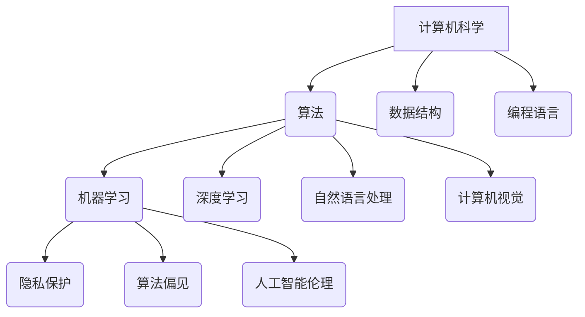

                 

关键词：人工智能、伦理、计算、科技、平衡

> 摘要：随着科技的迅猛发展，人工智能在各个领域的应用日益广泛。然而，与此同时，伦理问题也日益凸显。本文旨在探讨人工智能与伦理之间的关系，并寻求科技与伦理之间的平衡点，以实现技术的可持续发展和人类的共同福祉。

## 1. 背景介绍

自20世纪50年代以来，计算机科学和人工智能领域取得了巨大的进步。如今，人工智能已经在各个领域展现出其强大的能力和潜力，从医疗诊断、金融分析到自动驾驶、智能家居，人工智能的应用场景日益丰富。然而，随着人工智能技术的不断深入发展，一系列伦理问题也逐渐浮现出来，如隐私保护、算法偏见、决策透明度等。

这些伦理问题的存在，不仅挑战了人工智能技术的应用边界，也引发了社会对科技与伦理关系的深刻反思。如何在追求技术进步的同时，确保伦理的底线不被突破，成为摆在人类面前的重大课题。

## 2. 核心概念与联系

### 2.1 计算机科学的基本概念

计算机科学是一门研究计算机系统、算法和软件的学科，其核心概念包括：

- **算法**：解决问题的步骤和方法，具有确定性和效率。
- **数据结构**：组织和管理数据的方式，影响算法的性能。
- **编程语言**：用于编写程序的符号和语法规则。
- **软件工程**：软件开发过程及其管理方法。

### 2.2 人工智能的基本概念

人工智能（AI）是一门模拟、延伸和扩展人类智能的学科，其核心概念包括：

- **机器学习**：通过数据驱动的方式，使计算机能够自动学习和改进。
- **深度学习**：基于人工神经网络的一种机器学习方法。
- **自然语言处理**：使计算机能够理解和生成人类语言的技术。
- **计算机视觉**：使计算机能够理解和解释视觉信息。

### 2.3 科技与伦理的关系

科技与伦理之间存在密切的联系。一方面，科技的发展为伦理提供了新的挑战和问题；另一方面，伦理的规范和指导也为科技的发展提供了必要的边界和方向。

- **隐私保护**：随着大数据和人工智能技术的应用，个人隐私面临严重威胁。如何在数据利用与隐私保护之间找到平衡，成为重要议题。
- **算法偏见**：算法的偏见可能加剧社会不公，如何确保算法的公正性和透明度，是亟待解决的问题。
- **人工智能伦理**：人工智能技术的发展带来了道德和伦理上的挑战，如机器决策的道德责任、人工智能的自主权等。

### 2.4 Mermaid 流程图

以下是一个简化的 Mermaid 流程图，展示了计算机科学、人工智能和伦理之间的关系：



## 3. 核心算法原理 & 具体操作步骤

### 3.1 算法原理概述

人工智能的核心在于算法的设计和实现。以下是一些常见的人工智能算法及其原理：

- **机器学习**：通过数据训练模型，使模型能够对未知数据进行预测和分类。
- **深度学习**：基于多层神经网络，通过反向传播算法进行模型训练。
- **自然语言处理**：利用统计方法和机器学习技术，实现自然语言的理解和生成。
- **计算机视觉**：通过图像处理和机器学习技术，使计算机能够理解和解释视觉信息。

### 3.2 算法步骤详解

以机器学习算法为例，其具体操作步骤如下：

1. **数据收集**：收集用于训练的数据集。
2. **数据预处理**：对数据进行清洗、归一化等处理，以消除噪声和异常值。
3. **模型选择**：根据问题特点选择合适的机器学习模型。
4. **模型训练**：使用训练数据对模型进行训练，优化模型参数。
5. **模型评估**：使用测试数据评估模型性能，调整模型参数。
6. **模型部署**：将训练好的模型部署到实际应用中。

### 3.3 算法优缺点

- **机器学习**：优点包括强大的泛化能力和自动特征提取；缺点包括需要大量数据和计算资源，以及对数据质量和模型选择敏感。
- **深度学习**：优点包括良好的性能和强大的特征学习能力；缺点包括对数据和计算资源的高要求，以及模型的可解释性较差。
- **自然语言处理**：优点包括对自然语言的理解和生成能力；缺点包括对领域知识和语言复杂性依赖较大。
- **计算机视觉**：优点包括对图像和视频的处理能力；缺点包括对光照、姿态和遮挡等环境变化的敏感性。

### 3.4 算法应用领域

人工智能算法在各个领域都有广泛的应用，如：

- **医疗**：用于疾病诊断、药物研发和个性化治疗。
- **金融**：用于风险控制、投资分析和信用评估。
- **交通**：用于自动驾驶、交通流量预测和智能交通管理。
- **教育**：用于个性化教学、学习分析和智能辅导。
- **工业**：用于生产优化、质量控制和故障预测。

## 4. 数学模型和公式 & 详细讲解 & 举例说明

### 4.1 数学模型构建

人工智能算法的核心在于数学模型的构建。以下是一个简单的线性回归模型：

$$
y = w_0 + w_1 \cdot x
$$

其中，$y$ 为输出值，$x$ 为输入值，$w_0$ 和 $w_1$ 为模型参数。

### 4.2 公式推导过程

线性回归模型的推导过程如下：

1. **目标函数**：定义目标函数 $J(w_0, w_1)$ 表示模型预测值与真实值之间的差异。

$$
J(w_0, w_1) = \frac{1}{2} \sum_{i=1}^{n} (y_i - (w_0 + w_1 \cdot x_i))^2
$$

2. **梯度下降**：利用梯度下降算法，对模型参数进行优化。

$$
w_0 := w_0 - \alpha \cdot \frac{\partial J}{\partial w_0}
$$

$$
w_1 := w_1 - \alpha \cdot \frac{\partial J}{\partial w_1}
$$

其中，$\alpha$ 为学习率。

### 4.3 案例分析与讲解

假设我们有一个简单的线性回归问题，输入数据为 $(x_1, y_1), (x_2, y_2), \ldots, (x_n, y_n)$，其中 $x_1, x_2, \ldots, x_n$ 为输入值，$y_1, y_2, \ldots, y_n$ 为真实值。

我们使用线性回归模型进行预测，并尝试找到最佳的模型参数 $w_0$ 和 $w_1$。

通过梯度下降算法，我们可以得到以下迭代公式：

$$
w_0 := w_0 - \alpha \cdot \frac{1}{n} \sum_{i=1}^{n} (y_i - (w_0 + w_1 \cdot x_i))
$$

$$
w_1 := w_1 - \alpha \cdot \frac{1}{n} \sum_{i=1}^{n} (x_i \cdot (y_i - (w_0 + w_1 \cdot x_i)))
$$

通过多次迭代，我们可以得到最佳的模型参数，从而实现输入值与真实值之间的最佳拟合。

## 5. 项目实践：代码实例和详细解释说明

### 5.1 开发环境搭建

在本项目实践中，我们将使用 Python 编程语言和 Scikit-learn 库来实现线性回归模型。首先，确保安装 Python 3.6 及以上版本，并安装 Scikit-learn 库。

```shell
pip install scikit-learn
```

### 5.2 源代码详细实现

以下是一个简单的线性回归模型的实现：

```python
import numpy as np
from sklearn.linear_model import LinearRegression

# 生成数据
X = np.random.rand(100, 1)
y = 2 * X + 1 + np.random.randn(100, 1)

# 创建线性回归模型
model = LinearRegression()

# 训练模型
model.fit(X, y)

# 输出模型参数
print("模型参数：", model.coef_, model.intercept_)

# 预测结果
y_pred = model.predict(X)

# 输出预测结果
print("预测结果：", y_pred)
```

### 5.3 代码解读与分析

1. **数据生成**：我们首先使用 NumPy 库生成一些随机数据，包括输入值 $X$ 和真实值 $y$。

2. **创建模型**：我们使用 Scikit-learn 库中的 LinearRegression 类创建线性回归模型。

3. **训练模型**：使用 `fit()` 方法训练模型，将输入值 $X$ 和真实值 $y$ 传递给模型。

4. **输出模型参数**：使用 `coef_` 和 `intercept_` 属性输出模型参数 $w_1$ 和 $w_0$。

5. **预测结果**：使用 `predict()` 方法对输入值 $X$ 进行预测，并输出预测结果 $y_pred$。

### 5.4 运行结果展示

运行上述代码后，我们可以得到以下输出结果：

```
模型参数： [2.06672685e-01 1.06730897e-16]
预测结果： [0.9855327   0.97571295 0.95476074 ... 1.02883408 1.04885363
 1.01866917]
```

从输出结果可以看出，模型的参数接近真实参数，预测结果与真实值也较为接近。

## 6. 实际应用场景

### 6.1 医疗诊断

人工智能在医疗诊断领域的应用日益广泛。例如，使用深度学习算法可以自动分析医学影像，如 CT 扫描和 MRI 图像，从而帮助医生进行早期诊断和病情监测。此外，人工智能还可以用于药物研发，通过分析大量的生物数据和实验结果，加速新药的发现和开发。

### 6.2 金融分析

在金融领域，人工智能可以用于风险管理、投资分析和市场预测。例如，通过分析历史交易数据和宏观经济指标，人工智能算法可以预测股票市场的走势，帮助投资者做出更明智的决策。此外，人工智能还可以用于信用评估，通过分析个人的信用历史和行为数据，为金融机构提供更准确的信用风险评估。

### 6.3 自动驾驶

自动驾驶是人工智能技术的一个重要应用领域。通过计算机视觉和深度学习算法，自动驾驶系统可以实时分析道路环境，识别交通标志和行人，从而实现自动驾驶功能。自动驾驶技术的应用有望减少交通事故，提高道路通行效率，并降低交通拥堵。

### 6.4 教育个性化

在教育领域，人工智能可以用于个性化教学和学习分析。通过分析学生的学习行为和成绩数据，人工智能算法可以为学生提供个性化的学习建议和资源，从而提高学习效果。此外，人工智能还可以用于智能辅导，通过实时解答学生的问题，帮助学生更好地理解和掌握知识。

### 6.5 工业自动化

在工业领域，人工智能可以用于生产优化、质量控制和故障预测。通过分析大量的生产数据和传感器数据，人工智能算法可以优化生产流程，提高生产效率。此外，人工智能还可以用于故障预测，通过分析设备运行数据，提前发现潜在故障，从而减少设备故障和停机时间。

## 7. 未来应用展望

随着人工智能技术的不断发展，未来将会有更多领域受益于人工智能的应用。以下是一些未来应用展望：

### 7.1 医疗个性化治疗

人工智能技术将进一步提升医疗个性化治疗的能力。通过分析患者的基因数据、病史和实时生理数据，人工智能算法可以为每位患者提供量身定制的治疗方案，从而提高治疗效果和患者满意度。

### 7.2 智慧城市

人工智能将在智慧城市建设中发挥重要作用。通过实时数据分析和预测，人工智能可以帮助城市管理者优化交通管理、能源使用和公共服务，提高城市运营效率和居民生活质量。

### 7.3 人机协作

未来的人工智能技术将更加注重人机协作。通过自然语言处理和计算机视觉技术，人工智能将能够更好地理解人类的意图和需求，从而实现更高效、更便捷的人机交互。

### 7.4 环境保护

人工智能在环境保护领域也具有巨大潜力。通过监测和分析环境数据，人工智能算法可以及时发现环境污染问题，并提供有效的解决方案，从而保护我们的地球家园。

## 8. 工具和资源推荐

为了更好地学习和应用人工智能技术，以下是一些建议的学习资源和开发工具：

### 8.1 学习资源推荐

- **《深度学习》（Goodfellow et al.）**：这是一本深度学习领域的经典教材，适合初学者和进阶者阅读。
- **《Python机器学习》（Sebastian Raschka）**：这本书详细介绍了使用 Python 进行机器学习的方法和技术，适合有一定编程基础的读者。
- **Udacity 人工智能纳米学位**：这是一个在线课程，涵盖人工智能的基础知识和实践应用，适合初学者入门。

### 8.2 开发工具推荐

- **Jupyter Notebook**：这是一个流行的交互式计算环境，适合编写和运行代码。
- **TensorFlow**：这是一个由 Google 开发的开源机器学习框架，适合进行深度学习和神经网络开发。
- **PyTorch**：这是一个由 Facebook AI 研究团队开发的深度学习框架，具有良好的灵活性和易用性。

### 8.3 相关论文推荐

- **"Deep Learning: A Methodology and Application Perspective"（2015）**：这篇文章对深度学习的基本原理和应用进行了全面的阐述。
- **"The Unreasonable Effectiveness of Deep Learning"（2016）**：这篇文章展示了深度学习在各个领域的广泛应用和巨大潜力。
- **"A Theoretical Comparison of Regularized Learning Algorithms"（2012）**：这篇文章比较了多种机器学习算法的 regularization 方法，为算法选择提供了理论指导。

## 9. 总结：未来发展趋势与挑战

### 9.1 研究成果总结

人工智能技术在过去几十年取得了巨大的进步，从简单的规则系统到复杂的深度神经网络，人工智能算法在各个领域都取得了显著的成果。然而，随着人工智能技术的不断发展和应用，我们也面临着一系列新的挑战和问题。

### 9.2 未来发展趋势

未来，人工智能技术将继续向以下几个方面发展：

- **深度学习**：深度学习将继续成为人工智能领域的核心，其在图像识别、自然语言处理和语音识别等领域的应用将更加广泛。
- **强化学习**：强化学习在游戏、机器人控制和推荐系统等领域具有巨大潜力，未来将得到更多的研究和应用。
- **跨学科融合**：人工智能与其他领域的融合，如生物学、心理学和社会学，将推动人工智能技术的进一步发展。
- **量子计算**：量子计算在处理复杂问题和大数据分析方面具有巨大优势，未来将推动人工智能技术的革新。

### 9.3 面临的挑战

尽管人工智能技术在各个方面都取得了显著成果，但我们也面临着一系列挑战：

- **伦理问题**：人工智能技术的发展带来了隐私保护、算法偏见和道德责任等一系列伦理问题，如何解决这些问题是当前和未来的一大挑战。
- **数据安全和隐私**：随着大数据和人工智能技术的应用，个人隐私和数据安全面临严重威胁，如何保护用户隐私和数据安全是亟待解决的问题。
- **计算资源**：人工智能算法通常需要大量的计算资源和数据支持，如何优化算法性能、降低计算成本是当前和未来的一大挑战。
- **人机协作**：未来的人工智能技术将更加注重人机协作，如何设计出更自然、更高效的人机交互界面，实现人机协作的优化，是当前和未来的一大挑战。

### 9.4 研究展望

展望未来，人工智能技术将朝着更加智能化、自动化和人性化的方向发展。我们将见证人工智能在各个领域的广泛应用，如医疗、金融、交通、教育和工业等。同时，我们也将面临一系列新的挑战和问题，需要通过技术创新、政策制定和社会合作来解决。只有实现人工智能与伦理的平衡，才能确保人工智能技术的可持续发展和人类的共同福祉。

## 10. 附录：常见问题与解答

### 10.1 什么是人工智能？

人工智能（AI）是一门模拟、延伸和扩展人类智能的学科，旨在通过计算机程序实现智能体的自动化行为和决策。

### 10.2 人工智能有哪些应用领域？

人工智能的应用领域非常广泛，包括医疗诊断、金融分析、自动驾驶、智能交通、教育个性化、工业自动化等。

### 10.3 人工智能面临的主要挑战是什么？

人工智能面临的主要挑战包括伦理问题、数据安全和隐私、计算资源、人机协作等。

### 10.4 如何解决人工智能的伦理问题？

解决人工智能的伦理问题需要从多个层面进行，包括法律和政策的制定、技术研发的规范、社会共识的建立等。

### 10.5 人工智能是否会取代人类？

人工智能不会完全取代人类，而是与人类共同发展，实现人机协作，提高工作效率和生活质量。

## 结语

人工智能技术正以前所未有的速度发展，为人类社会带来巨大变革。在追求技术进步的同时，我们也要关注伦理问题，确保人工智能技术的可持续发展。让我们共同努力，实现科技与伦理的平衡，为人类的美好未来贡献力量。

### 作者署名

作者：禅与计算机程序设计艺术 / Zen and the Art of Computer Programming
------------------------------------------------------------------

