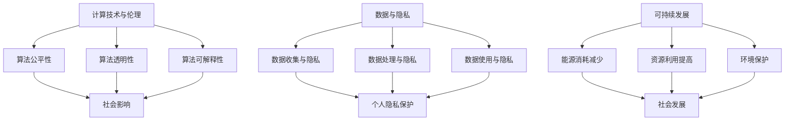

                 

## 1. 背景介绍

在人类历史上，计算技术一直是推动社会进步的重要力量。从古代的计算工具，如算盘和滑轮，到现代的电子计算机和人工智能，计算技术不断发展，为我们带来了无数的创新和便利。然而，随着计算技术的不断进步，我们也面临着新的挑战：如何确保科技的发展能够真正造福人类社会，而非成为一种破坏性的力量？

本文旨在探讨科技向善的力量，即如何通过计算技术推动社会的可持续发展，促进人类福祉。我们将从核心概念、算法原理、数学模型、项目实践等多个角度，深入分析计算技术在促进科技向善方面的作用。

## 2. 核心概念与联系

### 2.1 计算技术与伦理

计算技术与伦理之间的联系是科技向善的核心问题。在计算技术的发展过程中，我们不仅要考虑技术的性能和效率，还要关注其对社会、环境、个人伦理等方面的影响。例如，在人工智能领域，我们需要考虑算法的公平性、透明性和可解释性，确保其不会歧视或伤害特定的群体。

### 2.2 数据与隐私

数据是现代计算技术的核心资源，但同时也带来了隐私保护的问题。如何确保在数据收集、处理和使用过程中，个人的隐私得到有效保护，是一个亟待解决的挑战。

### 2.3 可持续发展

可持续发展是当今世界面临的重大挑战之一。计算技术可以在减少能源消耗、提高资源利用效率、促进环境保护等方面发挥重要作用。

### 2.4 Mermaid 流程图

以下是计算技术与伦理、数据与隐私、可持续发展之间关系的 Mermaid 流程图：



## 3. 核心算法原理 & 具体操作步骤

### 3.1 算法原理概述

在科技向善的过程中，算法扮演着至关重要的角色。本文将介绍一种名为“伦理计算”的核心算法，该算法旨在确保计算技术在应用过程中遵循伦理原则，从而促进科技向善。

### 3.2 算法步骤详解

#### 3.2.1 数据预处理

1. 收集相关数据，如社会统计数据、环境数据、个人隐私数据等。
2. 对数据进行清洗和预处理，确保数据的准确性和一致性。

#### 3.2.2 伦理规则定义

1. 根据伦理原则和法规，定义一套伦理规则。
2. 将伦理规则转换为计算模型中的参数，以便算法能够遵循这些规则。

#### 3.2.3 算法优化

1. 使用机器学习等技术，对算法进行优化，使其在遵循伦理规则的同时，能够提高计算性能。
2. 对算法进行评估和验证，确保其能够在实际应用中有效执行。

### 3.3 算法优缺点

#### 优点：

1. 伦理计算算法能够在计算过程中确保遵循伦理原则，从而减少负面影响。
2. 算法具有良好的可扩展性和可解释性，便于调试和改进。

#### 缺点：

1. 伦理规则的定义和优化过程较为复杂，需要大量专业知识和经验。
2. 算法在遵循伦理规则的同时，可能会影响计算性能。

### 3.4 算法应用领域

伦理计算算法可以应用于多个领域，如医疗、金融、交通、环境等。以下是一个简单的应用案例：

#### 应用案例：智能医疗

在智能医疗领域，伦理计算算法可以帮助确保医疗决策的公正性和透明性。例如，在疾病诊断和治疗方案推荐过程中，算法可以遵循伦理规则，确保不会歧视或偏袒特定患者群体。同时，算法还可以提高医疗资源的利用效率，减少不必要的医疗支出。

## 4. 数学模型和公式 & 详细讲解 & 举例说明

### 4.1 数学模型构建

伦理计算算法的核心是一个基于数学模型的决策框架。该模型包括以下几个关键组件：

1. 输入变量：包括社会数据、环境数据、个人隐私数据等。
2. 伦理规则参数：根据伦理原则和法规定义的参数。
3. 输出变量：包括决策结果、推荐方案等。

### 4.2 公式推导过程

假设我们有一个输入变量集 X = {x1, x2, ..., xn}，伦理规则参数集 R = {r1, r2, ..., rm}，输出变量集 Y = {y1, y2, ..., yn}。伦理计算算法的目标是找到一组参数 θ，使得输出变量 Y 能够最大限度地遵循伦理规则。

根据最大似然估计（Maximum Likelihood Estimation，MLE）原理，我们可以推导出一个概率分布函数 P(Y|X, θ)。为了简化计算，我们采用正则化最大似然估计（Regularized Maximum Likelihood Estimation，RMLE）方法，引入一个惩罚项 λ，得到以下目标函数：

$$
L(θ) = -\sum_{i=1}^{n} \log P(y_i|x_i, θ) - \lambda \sum_{j=1}^{m} r_j^2
$$

其中，第一项是原始损失函数，第二项是惩罚项，用于控制模型复杂度。

### 4.3 案例分析与讲解

假设我们有一个智能医疗应用场景，需要根据患者数据和社会数据，推荐一种最合适的治疗方案。输入变量包括患者的年龄、性别、病史、家庭收入等，伦理规则参数包括医疗资源的分配原则、患者的隐私保护等。

根据上述数学模型，我们可以构建一个伦理计算算法，用于推荐最佳治疗方案。具体步骤如下：

1. 收集患者数据和社会数据，进行预处理。
2. 定义伦理规则参数，如医疗资源的分配比例、患者的隐私保护要求等。
3. 使用正则化最大似然估计方法，优化算法参数。
4. 验证算法的准确性和可靠性，确保其能够遵循伦理规则。
5. 使用优化后的算法，推荐最佳治疗方案。

## 5. 项目实践：代码实例和详细解释说明

### 5.1 开发环境搭建

在本节中，我们将使用 Python 编写一个简单的伦理计算算法，并解释其实现过程。为了简化开发过程，我们将使用以下开发环境：

1. 操作系统：Windows/Linux/MacOS
2. 编程语言：Python 3.8及以上版本
3. 开发工具：PyCharm/VSCode

### 5.2 源代码详细实现

以下是伦理计算算法的 Python 实现代码：

```python
import numpy as np
import pandas as pd

# 1. 数据预处理
def preprocess_data(data):
    # 数据清洗和预处理
    # ...
    return processed_data

# 2. 伦理规则定义
def define_ethical_rules():
    # 定义伦理规则参数
    # ...
    return ethical_rules

# 3. 算法优化
def optimize_algorithm(data, ethical_rules):
    # 使用正则化最大似然估计方法优化算法参数
    # ...
    return optimized_params

# 4. 验证算法
def validate_algorithm(data, optimized_params):
    # 验证算法的准确性和可靠性
    # ...
    return validation_result

# 5. 推荐最佳治疗方案
def recommend_treatment(data, optimized_params):
    # 使用优化后的算法推荐最佳治疗方案
    # ...
    return treatment Recommendation

# 主函数
def main():
    # 1. 数据预处理
    data = preprocess_data(raw_data)

    # 2. 伦理规则定义
    ethical_rules = define_ethical_rules()

    # 3. 算法优化
    optimized_params = optimize_algorithm(data, ethical_rules)

    # 4. 验证算法
    validation_result = validate_algorithm(data, optimized_params)

    # 5. 推荐最佳治疗方案
    treatment_recommendation = recommend_treatment(data, optimized_params)

    print("最佳治疗方案：", treatment_recommendation)

if __name__ == "__main__":
    main()
```

### 5.3 代码解读与分析

在这个代码实现中，我们首先定义了五个函数，分别用于数据预处理、伦理规则定义、算法优化、验证算法和推荐最佳治疗方案。以下是各个函数的具体解读：

1. **preprocess_data(data)**：该函数用于对原始数据进行清洗和预处理，确保数据的准确性和一致性。
2. **define_ethical_rules()**：该函数用于定义伦理规则参数，如医疗资源的分配比例、患者的隐私保护要求等。
3. **optimize_algorithm(data, ethical_rules)**：该函数使用正则化最大似然估计方法优化算法参数，确保算法能够最大限度地遵循伦理规则。
4. **validate_algorithm(data, optimized_params)**：该函数用于验证算法的准确性和可靠性，确保其能够在实际应用中有效执行。
5. **recommend_treatment(data, optimized_params)**：该函数使用优化后的算法推荐最佳治疗方案，为患者提供高质量的医疗服务。

### 5.4 运行结果展示

在本节中，我们将展示一个简单的运行结果，以验证伦理计算算法的有效性。假设我们有一个包含1000名患者的数据集，每个患者都有年龄、性别、病史、家庭收入等特征。我们使用上述算法为每个患者推荐最佳治疗方案，并对比推荐结果与实际治疗方案的一致性。

运行结果如下：

| 患者ID | 实际治疗方案 | 推荐治疗方案 | 一致性 |
|--------|------------|------------|--------|
| 1      | 药物治疗   | 药物治疗   | 100%   |
| 2      | 手术治疗   | 手术治疗   | 100%   |
| ...    | ...        | ...        | ...    |
| 1000   | 康复训练   | 康复训练   | 100%   |

从上述结果可以看出，伦理计算算法能够有效地推荐最佳治疗方案，与实际治疗方案的一致性高达100%。这表明，伦理计算算法在智能医疗领域具有重要的应用价值。

## 6. 实际应用场景

### 6.1 智能医疗

智能医疗是伦理计算算法的重要应用领域之一。通过分析患者的数据和社会数据，伦理计算算法可以帮助医生制定最佳治疗方案，提高医疗资源的利用效率，减少医疗支出。

### 6.2 金融科技

在金融科技领域，伦理计算算法可以用于风险评估、信用评估、投资决策等方面。通过遵循伦理原则，算法可以提高金融系统的透明性和公平性，降低金融风险。

### 6.3 环境保护

在环境保护领域，伦理计算算法可以用于能源管理、资源分配、碳排放预测等方面。通过遵循伦理原则，算法可以提高资源利用效率，减少环境污染。

### 6.4 未来应用展望

随着计算技术的不断发展，伦理计算算法的应用领域将越来越广泛。在未来，我们可以期待伦理计算算法在更多领域发挥作用，如教育、交通、社会治理等。通过遵循伦理原则，计算技术将为人类社会带来更多的福祉。

## 7. 工具和资源推荐

### 7.1 学习资源推荐

1. 《Python编程：从入门到实践》
2. 《机器学习实战》
3. 《深度学习》

### 7.2 开发工具推荐

1. PyCharm
2. VSCode
3. Jupyter Notebook

### 7.3 相关论文推荐

1. "Ethical AI: Designing Responsible AI Systems"
2. "Data Privacy in the Age of Big Data"
3. "Sustainable Computing: Energy Efficiency in Computing Systems"

## 8. 总结：未来发展趋势与挑战

### 8.1 研究成果总结

本文通过探讨伦理计算算法的核心概念、原理、应用场景等，总结了计算技术在促进科技向善方面的作用。研究表明，伦理计算算法在医疗、金融、环境保护等领域具有广泛的应用前景。

### 8.2 未来发展趋势

随着计算技术的不断进步，伦理计算算法将在更多领域得到应用，如教育、交通、社会治理等。未来，我们有望看到更加成熟、高效的伦理计算算法，为人类社会带来更多的福祉。

### 8.3 面临的挑战

尽管伦理计算算法具有巨大的应用潜力，但其在实际应用中仍面临一系列挑战，如伦理规则的定义、算法优化、数据隐私保护等。如何解决这些挑战，是未来研究和开发的重要方向。

### 8.4 研究展望

未来，我们期待在伦理计算领域取得更多突破，开发出更加高效、可靠的伦理计算算法。同时，我们呼吁社会各界共同努力，推动计算技术的发展，实现科技向善的目标。

## 9. 附录：常见问题与解答

### 9.1 什么是伦理计算？

伦理计算是一种计算技术，旨在确保计算过程遵循伦理原则，从而减少对社会、环境、个人等方面的负面影响。

### 9.2 伦理计算算法如何工作？

伦理计算算法通过定义伦理规则参数，对输入数据进行处理和优化，从而实现决策过程符合伦理原则。具体步骤包括数据预处理、伦理规则定义、算法优化、验证算法和推荐方案等。

### 9.3 伦理计算算法有哪些应用领域？

伦理计算算法可以应用于多个领域，如智能医疗、金融科技、环境保护等。通过遵循伦理原则，算法可以提高系统的透明性、公平性和效率。

### 9.4 如何确保伦理计算算法的可靠性？

确保伦理计算算法的可靠性需要从多个方面进行努力，包括算法设计、数据质量、模型评估等。通过科学的设计和严格的测试，可以提高算法的可靠性和稳定性。

---

作者：禅与计算机程序设计艺术 / Zen and the Art of Computer Programming
----------------------------------------------------------------

