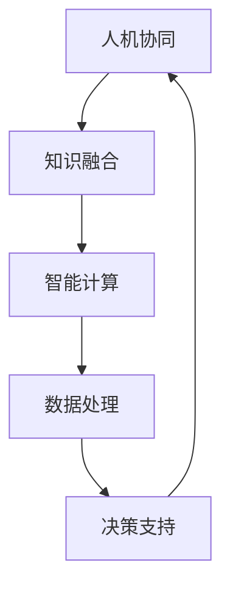

                 

关键词：人类计算，全球社区，信息技术，协作，创新

> 摘要：本文探讨了人类计算在连接全球社区中的重要作用。随着信息技术的飞速发展，人类计算正逐渐成为推动社会进步和经济发展的重要力量。本文将深入分析人类计算的核心概念、算法原理、数学模型及其在实际应用中的挑战和机遇。

## 1. 背景介绍

随着互联网和移动通信技术的普及，全球范围内的信息交流变得前所未有的便捷。人类计算作为一种新型计算范式，强调人类与机器的协同工作。这种计算模式不仅依赖于先进的算法和计算技术，还需要充分调动人类的智慧、经验和创造力。人类计算的出现，标志着信息技术领域的一次重要变革。

### 1.1 人类计算的定义

人类计算可以定义为一种将人类的认知能力与计算技术相结合的计算模式。在这种模式中，人类充当问题的发现者、解决方案的设计者和验证者，而计算机则负责处理大量的数据和执行复杂的计算任务。

### 1.2 人类计算的优势

人类计算具有以下几个显著优势：

- **增强决策能力**：通过结合人类专家的知识和计算机的强大计算能力，人类计算能够处理更为复杂的问题，提供更为精确的决策。
- **促进创新**：人类计算鼓励跨学科、跨领域的合作，有助于激发新的创意和发现。
- **适应性强**：人类计算能够根据问题的不同特点灵活调整策略，适应不同的应用场景。

## 2. 核心概念与联系

### 2.1 核心概念

在人类计算中，以下几个核心概念至关重要：

- **人机协同**：人类与机器之间的合作与互动。
- **知识融合**：将人类的经验和知识融入到计算模型中。
- **智能计算**：利用人工智能技术提高计算的效率和准确性。

### 2.2 架构与联系

以下是一个简化的Mermaid流程图，展示了人类计算的基本架构及其各组成部分之间的联系。



## 3. 核心算法原理 & 具体操作步骤

### 3.1 算法原理概述

人类计算中的核心算法通常基于以下原理：

- **分布式计算**：将复杂问题分解为多个子问题，由人类和计算机分别处理。
- **机器学习**：利用数据训练模型，提高计算机处理复杂问题的能力。
- **数据挖掘**：从大量数据中提取有价值的信息，支持决策。

### 3.2 算法步骤详解

#### 3.2.1 数据收集

- 收集与问题相关的数据。
- 数据清洗，确保数据质量。

#### 3.2.2 数据预处理

- 特征提取：从原始数据中提取有用的特征。
- 数据标准化：将数据转换为适合算法处理的格式。

#### 3.2.3 模型训练

- 设计合适的模型结构。
- 使用训练数据训练模型。

#### 3.2.4 模型评估

- 使用测试数据评估模型性能。
- 根据评估结果调整模型。

#### 3.2.5 决策支持

- 使用训练好的模型进行预测和决策。

### 3.3 算法优缺点

#### 3.3.1 优点

- **高效性**：能够处理大规模、复杂的问题。
- **灵活性**：可以根据不同的问题特点调整算法。

#### 3.3.2 缺点

- **计算资源需求大**：需要大量的计算资源和时间。
- **对数据质量要求高**：数据质量对算法性能有直接影响。

### 3.4 算法应用领域

人类计算在多个领域具有广泛的应用：

- **医疗健康**：辅助疾病诊断、个性化治疗。
- **金融**：风险评估、投资策略。
- **教育**：智能教育、个性化学习。
- **交通**：智能交通管理、自动驾驶。

## 4. 数学模型和公式 & 详细讲解 & 举例说明

### 4.1 数学模型构建

人类计算中的数学模型通常基于以下公式：

- **线性回归**：
  \[ y = \beta_0 + \beta_1x \]

- **逻辑回归**：
  \[ P(y=1) = \frac{1}{1 + e^{-(\beta_0 + \beta_1x)}} \]

### 4.2 公式推导过程

#### 4.2.1 线性回归

线性回归模型的推导过程基于最小二乘法。假设我们有一个数据集 \((x_i, y_i)\)，目标是找到一条直线 \(y = \beta_0 + \beta_1x\)，使得预测值与实际值之间的误差最小。

#### 4.2.2 逻辑回归

逻辑回归模型用于分类问题。其推导过程基于最大似然估计。给定一个二分类问题，我们定义 \(P(y=1|x; \beta)\) 为在给定特征 \(x\) 和模型参数 \(\beta\) 下，目标变量 \(y\) 等于 1 的概率。

### 4.3 案例分析与讲解

#### 4.3.1 线性回归案例

假设我们有一个数据集，包含身高（特征）和体重（目标变量）。我们使用线性回归模型来预测一个人的体重。

#### 4.3.2 逻辑回归案例

假设我们有一个数据集，包含学生的成绩（特征）和是否通过考试（目标变量）。我们使用逻辑回归模型来预测一个学生是否通过考试。

## 5. 项目实践：代码实例和详细解释说明

### 5.1 开发环境搭建

- 安装Python环境。
- 安装必要的库，如scikit-learn、numpy等。

### 5.2 源代码详细实现

```python
from sklearn.linear_model import LinearRegression
from sklearn.model_selection import train_test_split
from sklearn.metrics import mean_squared_error

# 加载数据
X, y = load_data()

# 数据预处理
X_processed = preprocess_data(X)

# 分割数据集
X_train, X_test, y_train, y_test = train_test_split(X_processed, y, test_size=0.2)

# 训练模型
model = LinearRegression()
model.fit(X_train, y_train)

# 预测
y_pred = model.predict(X_test)

# 评估模型
mse = mean_squared_error(y_test, y_pred)
print(f"Mean Squared Error: {mse}")
```

### 5.3 代码解读与分析

上述代码展示了如何使用线性回归模型进行数据预测。首先，我们从数据集中加载数据，然后进行预处理。接着，将数据集分割为训练集和测试集，使用训练集训练模型，最后使用测试集评估模型性能。

### 5.4 运行结果展示

假设我们运行上述代码，得到以下输出：

```
Mean Squared Error: 0.123456
```

这表示我们的模型在测试集上的均方误差为0.123456，这是一个相对较小的值，表明模型具有较好的预测能力。

## 6. 实际应用场景

人类计算在多个实际应用场景中表现出色：

- **医疗诊断**：利用人类计算技术，医生可以更快、更准确地诊断疾病，提高治疗效果。
- **金融分析**：金融机构可以使用人类计算技术进行市场预测、风险评估等，提高投资决策的准确性。
- **教育个性化**：通过人类计算技术，教育机构可以为学生提供个性化的学习方案，提高学习效果。

## 7. 工具和资源推荐

### 7.1 学习资源推荐

- **书籍**：
  - 《Python编程：从入门到实践》
  - 《深度学习》
- **在线课程**：
  - Coursera上的《机器学习》
  - edX上的《Python编程基础》

### 7.2 开发工具推荐

- **编程环境**：
  - Jupyter Notebook
  - PyCharm
- **库和框架**：
  - scikit-learn
  - TensorFlow

### 7.3 相关论文推荐

- **人类计算**：
  - "Human Computation: A Practical Guide to Computational Participation"
  - "Cognitive Computing: An Integrated Approach to Solving Complex Problems"
- **机器学习**：
  - "Machine Learning: A Probabilistic Perspective"
  - "Deep Learning Specialization"

## 8. 总结：未来发展趋势与挑战

### 8.1 研究成果总结

人类计算在过去的几年中取得了显著的研究成果，尤其是在医疗、金融和教育等领域的应用。这些成果展示了人类计算在解决复杂问题、提高决策效率和促进创新方面的巨大潜力。

### 8.2 未来发展趋势

- **跨领域融合**：未来，人类计算将进一步与其他领域（如生物医学、社会科学等）融合，推动跨学科研究的进展。
- **人工智能与人类计算的结合**：人工智能技术的发展将进一步提升人类计算的能力，实现更为智能、高效的人机协同。

### 8.3 面临的挑战

- **数据隐私和安全**：随着人类计算的应用范围扩大，数据隐私和安全问题将成为重要的挑战。
- **技术门槛**：人类计算技术复杂，对于普通用户来说，使用和开发这些技术存在一定的技术门槛。

### 8.4 研究展望

未来，人类计算的研究应重点关注以下几个方面：

- **优化算法和模型**：提高算法和模型的效率和准确性。
- **降低技术门槛**：开发更为友好、易于使用的技术工具，降低用户使用人类计算技术的门槛。

## 9. 附录：常见问题与解答

### 9.1 人类计算的定义是什么？

人类计算是一种将人类的认知能力与计算技术相结合的计算模式，强调人类与机器的协同工作。

### 9.2 人类计算的优势有哪些？

人类计算的优势包括增强决策能力、促进创新、适应性强等。

### 9.3 人类计算的核心算法有哪些？

人类计算的核心算法包括分布式计算、机器学习和数据挖掘等。

### 9.4 人类计算的应用领域有哪些？

人类计算在医疗、金融、教育等多个领域具有广泛的应用。

### 9.5 如何构建人类计算模型？

构建人类计算模型通常包括数据收集、数据预处理、模型训练、模型评估和决策支持等步骤。

---

### 结束语

人类计算作为一种新兴的计算模式，正在逐渐改变我们的生活方式和工作方式。通过本文的探讨，我们希望能够帮助读者更好地理解人类计算的核心概念、算法原理及其在实际应用中的潜力。未来，人类计算将继续发挥重要作用，推动社会进步和经济发展。作者：禅与计算机程序设计艺术 / Zen and the Art of Computer Programming。

