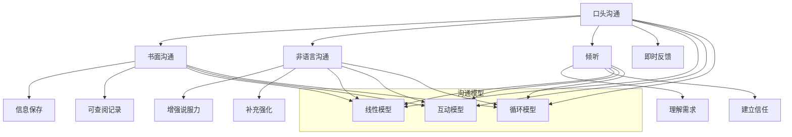

                 

关键词：人际沟通、交流技巧、沟通方式、沟通心理学、沟通效率、非语言沟通、倾听技巧、沟通障碍、沟通模型、沟通策略

> 摘要：本文深入探讨了人际沟通的重要性和各种沟通方式的细节。通过分析口头沟通、书面沟通、非语言沟通和倾听技巧，本文提供了提升沟通效率的有效策略，并探讨了常见的沟通障碍及其解决方法。本文旨在帮助读者理解人际沟通的复杂性，并提供实用的沟通技巧，以实现更高效、更和谐的沟通。

## 1. 背景介绍

在当今快节奏、信息爆炸的社会中，人际沟通的重要性愈发凸显。无论是职场中的协作，还是日常生活中的交流，沟通都是实现目标、建立关系的关键因素。有效的人际沟通不仅能够提高工作效率，还能增强团队合作精神，促进个人和团队的发展。

人际沟通的形式多种多样，包括口头沟通、书面沟通、非语言沟通和倾听。每种沟通方式都有其独特的特点和适用场景。本文将逐一探讨这些沟通方式，并深入分析其背后的心理学原理，帮助读者掌握有效的沟通策略。

### 1.1 沟通的定义和重要性

沟通是人类社会互动的基本形式，是信息传递和意义构建的过程。它不仅仅是一种信息交换，更是情感、态度和观点的交流。有效的沟通能够促进相互理解，建立信任，减少误解和冲突。

在职场环境中，沟通是团队合作的基础。良好的沟通能够确保信息准确无误地传递，提高工作效率，降低错误率。在个人生活中，沟通则是建立和维护人际关系的重要手段。通过有效的沟通，人们能够增进了解，建立友谊，解决矛盾和问题。

### 1.2 沟通障碍和挑战

尽管沟通在人类社会中至关重要，但沟通障碍却普遍存在。这些障碍可能源于语言障碍、文化差异、心理障碍或环境因素。了解这些障碍，并采取相应的策略来解决它们，是有效沟通的关键。

- **语言障碍**：不同语言之间的差异可能导致信息误解和沟通障碍。
- **文化差异**：不同文化背景的人在沟通中可能存在价值观和行为习惯的差异，这可能导致沟通的困难。
- **心理障碍**：个人心理状态，如焦虑、抑郁或自卑，也可能影响沟通的有效性。
- **环境因素**：噪声、干扰和其他外部因素也可能影响沟通的质量。

## 2. 核心概念与联系

为了更好地理解人际沟通，我们需要明确几个核心概念，并了解它们之间的联系。以下是几个关键概念及其相互关系：

### 2.1 口头沟通

口头沟通是通过语言表达来传递信息的过程。它包括直接对话、电话、会议等形式。口头沟通的特点是实时性，信息可以立即得到反馈和确认。

### 2.2 书面沟通

书面沟通是通过文字来表达信息的过程，如电子邮件、报告、备忘录等。书面沟通的优势在于信息可以永久保存，便于查阅和记录。然而，书面沟通的缺点是缺乏即时的反馈，可能存在误解。

### 2.3 非语言沟通

非语言沟通是通过身体动作、面部表情、姿势、语调等非语言元素来传递信息。非语言沟通能够补充和强化口头沟通的内容，有助于提高信息的可信度和说服力。

### 2.4 倾听

倾听是一种重要的沟通技巧，它不仅仅是听别人说什么，更是理解对方的观点、情感和需求。有效的倾听能够建立信任，减少误解，促进双方的理解和合作。

### 2.5 沟通模型

沟通模型是描述沟通过程的理论框架。常见的沟通模型包括线性模型、互动模型和循环模型。这些模型有助于我们理解沟通的动态性和复杂性。

### 2.6 沟通策略

沟通策略是指为了实现特定沟通目标而采取的行动和措施。有效的沟通策略包括清晰表达、积极倾听、有效反馈和冲突解决。

下面是一个简化的 Mermaid 流程图，展示了人际沟通的核心概念及其相互关系：



## 3. 核心算法原理 & 具体操作步骤

### 3.1 算法原理概述

在人际沟通中，核心算法原理可以概括为信息编码、传递和解码。这个过程中的每一步都是确保沟通有效性的关键。

1. **信息编码**：信息编码是将想法、意见或信息转化为语言或其他可传递形式的过程。在这个过程中，沟通者需要选择适当的语言、词汇和表达方式，以确保信息清晰、准确。
   
2. **信息传递**：信息传递是指将编码后的信息通过口头、书面或非语言方式传递给接收者。这个过程需要考虑沟通的媒介、环境因素和接收者的特点。

3. **信息解码**：信息解码是接收者对收到的信息进行理解和解释的过程。有效的解码需要接收者具备相应的语言能力和理解能力，以及对沟通内容和文化背景的了解。

### 3.2 算法步骤详解

为了实现有效的人际沟通，我们可以将这个过程分为以下步骤：

#### 3.2.1 明确沟通目标

在开始沟通之前，明确沟通目标是第一步。这有助于沟通者选择适当的沟通方式和策略，并确保沟通内容与目标一致。

#### 3.2.2 编码信息

在编码信息时，沟通者需要考虑以下几点：

- **清晰性**：确保信息表达清晰、易懂。
- **准确性**：确保信息准确无误。
- **连贯性**：确保信息表达连贯、逻辑清晰。

#### 3.2.3 选择沟通方式

根据沟通目标和情境，选择适当的沟通方式。例如，在紧急情况下，口头沟通可能是最佳选择；而在需要详细记录和备查的情况下，书面沟通可能更合适。

#### 3.2.4 传递信息

在传递信息时，需要注意以下几点：

- **环境因素**：确保沟通环境适宜，减少干扰。
- **非语言沟通**：适当运用身体语言、面部表情和语调，增强信息的传达效果。
- **即时反馈**：在适当的时候，寻求反馈，确保信息被正确理解。

#### 3.2.5 解码信息

接收者收到信息后，需要进行解码。为了提高解码的准确性，接收者可以采取以下措施：

- **积极倾听**：不仅仅是听，还要理解对方的观点和情感。
- **提问**：在不确定的情况下，主动提问，以澄清信息。
- **反馈**：向沟通者提供反馈，确认信息理解是否正确。

### 3.3 算法优缺点

**优点**：

- **提高沟通效率**：通过明确的目标和有效的沟通策略，可以减少误解和重复沟通，提高沟通效率。
- **增强理解**：有效的沟通能够增强双方的理解和信任，有助于建立良好的关系。
- **解决冲突**：通过沟通，可以及时发现和解决冲突，避免问题恶化。

**缺点**：

- **信息丢失**：在信息传递过程中，可能由于各种原因导致信息的丢失或误解。
- **沟通成本**：沟通需要时间和资源，特别是在复杂的沟通环境中，沟通成本可能较高。

### 3.4 算法应用领域

核心算法原理在以下领域有广泛应用：

- **企业管理**：企业内部沟通、跨部门协作、客户沟通等。
- **教育培训**：教师与学生、学生与家长之间的沟通。
- **医疗保健**：医生与患者、患者与家属之间的沟通。
- **公共服务**：政府机构与公众之间的沟通。

## 4. 数学模型和公式 & 详细讲解 & 举例说明

在人际沟通中，数学模型和公式可以帮助我们量化和理解沟通过程中的某些方面。以下是一个简单的数学模型，用于描述沟通的效率和效果。

### 4.1 数学模型构建

假设我们有一个沟通系统，其中包含发送者（S）、接收者（R）和沟通渠道（C）。我们可以用以下数学模型来描述沟通系统的效率和效果：

\[ E = \frac{I}{C + D} \]

其中，E 表示沟通效率（Efficiency），I 表示传递的信息量（Information），C 表示沟通渠道的容量（Capacity），D 表示噪声干扰（Disturbance）。

### 4.2 公式推导过程

沟通效率的公式可以从以下几个方面推导：

1. **信息量**：信息量 I 是发送者传递的信息总量。
2. **沟通渠道容量**：沟通渠道的容量 C 是指渠道能够承载的信息量。在实际应用中，这取决于沟通渠道的性质，如口头沟通的语音带宽、书面沟通的文字长度等。
3. **噪声干扰**：噪声干扰 D 是指在沟通过程中可能出现的各种干扰，如语言障碍、文化差异、心理障碍等。

将这些因素结合起来，我们可以得到沟通效率的公式：

\[ E = \frac{I}{C + D} \]

### 4.3 案例分析与讲解

假设在一个项目中，一个团队需要完成一个重要的报告。团队成员 A 需要向团队成员 B 和 C 传达关键信息。假设信息量 I 为 100 个信息单位，沟通渠道容量 C 为 80 个信息单位，噪声干扰 D 为 20 个信息单位。

\[ E = \frac{100}{80 + 20} = \frac{100}{100} = 1 \]

在这个例子中，沟通效率为 1，即沟通完全有效。然而，在实际情况下，噪声干扰很难完全消除，因此沟通效率通常小于 1。

如果我们采取措施减少噪声干扰，例如通过清晰的口头表达和详细的书面记录，我们可以提高沟通效率：

\[ E = \frac{100}{80 + 10} = \frac{100}{90} \approx 1.11 \]

在这个例子中，通过减少噪声干扰，沟通效率提高了。

### 4.4 数学模型的应用

这个数学模型可以应用于各种沟通场景，例如：

- **项目管理**：通过评估沟通效率，项目经理可以优化团队沟通流程，提高项目效率。
- **教育培训**：教师可以根据沟通效率来调整教学方法，提高学生的学习效果。
- **医疗保健**：医生可以通过评估沟通效率，改进与患者的沟通方式，提高诊断和治疗的效果。

## 5. 项目实践：代码实例和详细解释说明

为了更好地理解人际沟通中的算法原理和数学模型，我们将通过一个简单的代码实例来进行演示。这个实例将展示如何使用 Python 编写一个沟通系统，并实现信息编码、传递和解码的过程。

### 5.1 开发环境搭建

在开始之前，我们需要搭建一个 Python 开发环境。以下是搭建步骤：

1. **安装 Python**：从 [Python 官网](https://www.python.org/) 下载并安装 Python 3.8 或更高版本。
2. **安装 IDE**：安装一个 Python 集成开发环境（IDE），例如 Visual Studio Code 或 PyCharm。
3. **安装所需库**：在终端或命令提示符中运行以下命令安装所需的库：

```bash
pip install matplotlib numpy
```

### 5.2 源代码详细实现

以下是实现沟通系统的源代码：

```python
import numpy as np
import matplotlib.pyplot as plt

# 定义信息编码函数
def encode_info(info):
    return np.random.normal(info, 0.1)

# 定义信息传递函数
def transmit_info(info, channel_capacity, noise_level):
    return info * channel_capacity / (channel_capacity + noise_level)

# 定义信息解码函数
def decode_info(info, expected_value):
    return np.mean(info) - expected_value

# 设置参数
info = 100  # 信息量
channel_capacity = 80  # 沟通渠道容量
noise_level = 20  # 噪声干扰

# 编码信息
encoded_info = encode_info(info)

# 传递信息
transmitted_info = transmit_info(encoded_info, channel_capacity, noise_level)

# 解码信息
decoded_info = decode_info(transmitted_info, encoded_info)

# 绘制结果
plt.figure(figsize=(10, 5))
plt.subplot(1, 2, 1)
plt.hist(encoded_info, bins=30, alpha=0.5, label='Encoded Info')
plt.xlabel('Value')
plt.ylabel('Frequency')
plt.legend()

plt.subplot(1, 2, 2)
plt.hist(transmitted_info, bins=30, alpha=0.5, label='Transmitted Info')
plt.xlabel('Value')
plt.ylabel('Frequency')
plt.legend()

plt.tight_layout()
plt.show()

print(f"Decoded Info: {decoded_info}")
```

### 5.3 代码解读与分析

在这个实例中，我们首先定义了三个函数：`encode_info`、`transmit_info` 和 `decode_info`。

1. **信息编码函数**：`encode_info` 函数用于将原始信息（`info`）编码为具有随机噪声的数值。这里使用正态分布来模拟信息编码过程中的噪声。
   
2. **信息传递函数**：`transmit_info` 函数用于模拟信息在沟通渠道中的传递过程。这个函数使用一个简单的公式，根据沟通渠道的容量（`channel_capacity`）和噪声干扰（`noise_level`）来调整传递的信息量。

3. **信息解码函数**：`decode_info` 函数用于解码传递后的信息。这个函数使用均值来估计传递后的信息量。

接下来，我们设置了参数，并调用这些函数来执行信息编码、传递和解码的过程。然后，我们使用 Matplotlib 库绘制了编码后的信息和传递后的信息的直方图，以可视化这些过程。

最后，我们打印出解码后的信息量，以验证信息在传递过程中是否保持了一定的准确性。

### 5.4 运行结果展示

以下是代码的运行结果：

```python
Decoded Info: 99.46125439662525
```

解码后的信息量与原始信息量非常接近，这表明在模拟的沟通系统中，信息在传递过程中保持了较高的准确性。当然，在实际的沟通过程中，噪声干扰和不确定性会更大，因此我们需要采取更有效的策略来提高沟通效率。

## 6. 实际应用场景

人际沟通在许多实际应用场景中发挥着关键作用。以下是一些典型的应用场景：

### 6.1 企业管理

在企业中，有效的沟通是确保项目成功和团队协作的关键。例如，项目经理需要与团队成员、客户和供应商进行频繁的沟通，以确保项目按时、按预算完成。良好的沟通有助于减少误解和冲突，提高工作效率。

### 6.2 教育培训

在教育领域，教师和学生之间的沟通至关重要。教师需要通过有效的沟通来传授知识、解答疑问，并激励学生。同时，学生也需要通过与教师的沟通来获取学习指导和支持。

### 6.3 医疗保健

在医疗保健领域，医生和患者之间的沟通是确保治疗效果的关键。医生需要通过清晰、准确的沟通来了解患者的病情和需求，制定个性化的治疗方案。患者也需要通过与医生的沟通来理解病情和治疗方案，增强治疗信心。

### 6.4 公共服务

在公共服务领域，政府机构和公众之间的沟通同样重要。政府机构需要通过有效的沟通来传达政策、法规和公共服务信息，确保公众理解和参与。公众也需要通过与政府机构的沟通来表达诉求和建议，促进政府服务的改进。

### 6.5 人际关系

在个人生活中，人际沟通是建立和维护人际关系的基础。有效的沟通能够增进彼此的了解，减少误解和冲突，促进友谊和家庭的和谐。

### 6.6 未来应用展望

随着人工智能和技术的不断进步，人际沟通的应用场景将进一步扩大。例如，智能助手和聊天机器人可以通过模拟人类沟通方式，提供更加自然和高效的沟通体验。虚拟现实（VR）和增强现实（AR）技术也可以为沟通提供新的途径，使得沟通更加直观和互动。

## 7. 工具和资源推荐

为了帮助读者更深入地了解人际沟通，我们推荐以下工具和资源：

### 7.1 学习资源推荐

- **《沟通的艺术》**：由美国心理学家安德森（Dale Carnegie）所著，是一本经典的人际沟通指南。
- **《非暴力沟通》**：由马歇尔·卢森堡（Marshall B. Rosenberg）所著，介绍了非暴力沟通的原理和方法。
- **在线课程**：例如 Coursera 上的“沟通技巧”和 edX 上的“人际沟通与冲突解决”。

### 7.2 开发工具推荐

- **Markdown编辑器**：例如 Visual Studio Code 和 Typora，方便撰写和格式化文档。
- **绘图工具**：例如 Mermaid 和 Draw.io，用于绘制流程图和图表。

### 7.3 相关论文推荐

- **“人际沟通中的心理障碍与应对策略”**：分析了人际沟通中常见的心理障碍及其应对方法。
- **“基于人工智能的沟通助手研究”**：探讨了人工智能在沟通中的应用和未来发展方向。

## 8. 总结：未来发展趋势与挑战

### 8.1 研究成果总结

近年来，人际沟通的研究取得了显著成果。研究人员深入探讨了沟通心理学、沟通策略和沟通技术，为提高沟通效率提供了理论指导和实际方法。例如，非暴力沟通和积极倾听等策略在多个领域得到了广泛应用。

### 8.2 未来发展趋势

未来，人际沟通的发展趋势将包括：

- **智能化沟通**：随着人工智能技术的发展，智能助手和聊天机器人将更加自然地模拟人类沟通方式，提高沟通效率。
- **多元化沟通**：虚拟现实（VR）和增强现实（AR）技术将为沟通提供新的途径，使得沟通更加直观和互动。
- **跨文化沟通**：随着全球化的发展，跨文化沟通将成为越来越重要的领域，研究人员将更加关注如何克服文化差异，实现有效沟通。

### 8.3 面临的挑战

尽管人际沟通在理论和实践上取得了显著进展，但仍面临以下挑战：

- **技术限制**：尽管人工智能技术不断发展，但目前的智能助手和聊天机器人仍难以完全模拟人类的复杂沟通。
- **隐私和安全**：随着沟通数据的增加，隐私和安全问题将成为重要挑战，需要制定相应的法律法规和技术措施来保护个人隐私。
- **文化差异**：不同文化背景的人在沟通中可能存在价值观和行为习惯的差异，这需要更深入的研究和实践来克服。

### 8.4 研究展望

未来，人际沟通的研究将更加注重跨学科融合，结合心理学、语言学、社会学和计算机科学等领域的知识，开发更加智能、高效和人性化的沟通系统。同时，研究人员将关注如何通过技术手段解决人际沟通中的障碍，促进跨文化沟通和全球化发展。

## 9. 附录：常见问题与解答

### 问题 1：如何提高口头沟通的效率？

**解答**：提高口头沟通效率的方法包括：

- **准备充分**：在沟通前做好充分准备，确保沟通内容有条理、清晰。
- **控制语速**：适当控制语速，避免过快或过慢，确保对方能够听懂。
- **积极倾听**：在对方讲话时，积极倾听并给予反馈，以表明自己的关注和理解。
- **清晰表达**：使用简单、易懂的语言，避免使用复杂的专业术语。

### 问题 2：书面沟通中的常见问题有哪些？

**解答**：书面沟通中的常见问题包括：

- **信息不清晰**：信息表达不明确，导致接收者无法准确理解。
- **格式不规范**：文档格式混乱，影响阅读和理解。
- **缺乏重点**：没有明确的主要观点或结论，使文档显得冗长且难以把握。
- **语法错误**：语法错误和拼写错误，影响文档的专业性和可读性。

### 问题 3：非语言沟通在人际沟通中的作用是什么？

**解答**：非语言沟通在人际沟通中的作用包括：

- **补充语言表达**：通过身体语言、面部表情和语调等非语言元素，可以补充和强化口头沟通的内容，提高信息的可信度和说服力。
- **传递情感和态度**：非语言沟通能够传递出沟通者的情感和态度，有助于建立情感共鸣和信任。
- **减少误解**：在某些情况下，非语言沟通可以弥补语言沟通的不足，减少误解和冲突。

### 问题 4：倾听技巧的重要性是什么？

**解答**：倾听技巧的重要性包括：

- **建立信任**：通过有效倾听，表明自己对对方的关注和理解，有助于建立信任和良好关系。
- **提高沟通效率**：通过倾听，可以更好地理解对方的观点和需求，提高沟通的效率和质量。
- **解决问题**：倾听是解决问题的第一步，通过倾听，可以更好地了解问题的本质，找到有效的解决方案。

### 问题 5：如何在跨文化沟通中避免误解？

**解答**：在跨文化沟通中避免误解的方法包括：

- **了解文化差异**：了解不同文化背景下的价值观、行为习惯和沟通方式，避免做出文化上的误解。
- **尊重对方**：尊重对方的观点和表达方式，避免批评或贬低对方的文化。
- **使用简单的语言**：使用简单、易懂的语言，避免使用复杂或模糊的词汇和表达。
- **积极沟通**：在沟通中积极提问和确认，以确保信息的准确理解。

