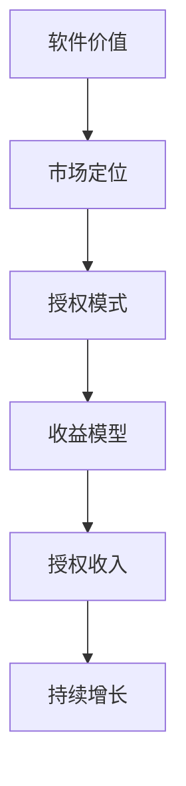

                 

关键词：软件授权、商业模式、收益策略、商业分析、技术经济学

> 摘要：本文深入探讨了软件授权收入策略的核心概念、实施步骤、数学模型以及实践应用。文章首先介绍了软件授权的商业背景，然后分析了各种授权模式及其优缺点，并提出了基于成本效益分析的授权策略制定方法。通过数学模型和案例分析，本文为软件开发者提供了系统性的收入增长路径，并展望了未来软件授权领域的趋势和挑战。

## 1. 背景介绍

在当今数字化时代，软件已成为推动经济增长和创新的关键因素。随着软件产业的发展，开发者不仅需要关注技术实现的创新，还需深入了解商业模式的构建和收入策略的制定。软件授权作为一种重要的商业模式，能够为开发者带来持续的收益，成为企业盈利的重要来源。

软件授权是指软件开发者将其开发的软件产品许可给其他企业或个人使用，并获得相应授权费用的一种商业行为。授权模式多样，包括时间授权、功能授权、源代码授权等。不同授权模式适用于不同的市场环境和需求，开发者在选择授权模式时需综合考虑市场定位、竞争态势、用户需求等多方面因素。

### 1.1 商业背景

随着互联网和云计算的普及，软件产业规模不断扩大。根据市场研究机构的统计，全球软件产业市场规模在近年来保持稳定增长，预计到2025年将突破万亿美元。软件授权作为软件产业的重要组成部分，也逐渐受到开发者的重视。

然而，在软件授权的过程中，开发者往往面临诸多挑战。如何选择合适的授权模式？如何制定有效的授权策略？如何确保授权收入的可持续增长？这些问题都需要开发者深入思考。本文将从理论到实践，为开发者提供系统性的指导。

## 2. 核心概念与联系

在讨论软件授权收入策略之前，我们首先需要了解一些核心概念，并探讨它们之间的联系。

### 2.1 核心概念

- **软件价值**：软件的价值是其功能、性能、用户体验等多方面因素的综合体现。
- **市场定位**：市场定位是指软件开发者根据自身资源和市场环境，确定软件产品的目标市场和用户群体。
- **授权模式**：授权模式是指软件授权的形式和方式，常见的有一次性授权、年费授权、功能授权等。
- **收益模型**：收益模型是指软件开发者通过授权获得收益的途径和方式，如直接授权费、续费、增值服务等。

### 2.2 架构联系

为了更好地理解软件授权收入策略，我们可以使用Mermaid流程图来展示各个核心概念之间的联系。



通过上述流程图，我们可以清晰地看到软件价值、市场定位、授权模式、收益模型以及授权收入之间的逻辑关系。软件价值决定了市场定位，市场定位决定了授权模式，授权模式又决定了收益模型，最终实现授权收入，并通过持续优化实现收入的持续增长。

## 3. 核心算法原理 & 具体操作步骤

### 3.1 算法原理概述

软件授权收入策略的核心是成本效益分析，即在确保授权收入最大化的同时，控制授权成本。具体来说，成本效益分析包括以下几个步骤：

1. **市场调研**：通过市场调研，了解目标市场的需求、竞争态势和用户反馈。
2. **成本估算**：对软件开发、维护、授权等各个环节的成本进行详细估算。
3. **收益预测**：基于市场调研和成本估算，预测不同授权模式下的收益。
4. **方案评估**：比较不同授权方案的收益和成本，选择最优方案。
5. **授权执行**：根据最优方案，制定具体的授权策略并执行。
6. **持续优化**：对授权收入进行持续跟踪和评估，根据市场变化和用户需求，不断调整授权策略。

### 3.2 算法步骤详解

#### 步骤1：市场调研

市场调研是制定软件授权收入策略的第一步。通过市场调研，我们可以获取以下信息：

- 目标市场的需求：了解目标市场的用户需求、痛点、期望等功能。
- 竞争态势：分析竞争对手的产品、价格、市场份额等。
- 用户反馈：收集现有用户对软件的反馈，了解用户对软件的满意度、改进建议等。

市场调研的方法包括问卷调查、访谈、用户反馈等。通过多种渠道收集信息，可以提高市场调研的准确性。

#### 步骤2：成本估算

成本估算是制定授权收入策略的重要环节。软件开发、维护、授权等各个环节都存在成本，具体包括：

- 开发成本：包括人力成本、技术成本、测试成本等。
- 维护成本：包括更新、修复漏洞、升级等。
- 授权成本：包括授权管理、合同签署、法律咨询等。

通过对各个环节的成本进行详细估算，可以制定出合理的授权收入策略。

#### 步骤3：收益预测

收益预测是基于市场调研和成本估算的结果，预测不同授权模式下的收益。具体包括：

- 一次性授权收益：根据市场需求和授权费用预测。
- 年费授权收益：根据市场需求、年费金额和续费率预测。
- 功能授权收益：根据功能模块的价值和市场需求预测。

收益预测需要考虑市场变化、用户需求、竞争态势等多方面因素。

#### 步骤4：方案评估

方案评估是对不同授权方案的收益和成本进行比较，选择最优方案。具体包括：

- 成本效益分析：计算不同方案的收益与成本之比，选择效益最高的方案。
- 风险评估：评估不同方案的风险，选择风险最小的方案。
- 市场适应性：评估不同方案对市场的适应程度，选择最符合市场需求的方案。

#### 步骤5：授权执行

授权执行是根据最优方案，制定具体的授权策略并执行。具体包括：

- 签订合同：与授权方签订授权合同，明确授权模式、授权费用、授权期限等。
- 授权管理：建立授权管理系统，管理授权记录、合同履行等。
- 授权宣传：通过多种渠道宣传软件授权，吸引潜在客户。

#### 步骤6：持续优化

持续优化是对授权收入进行持续跟踪和评估，根据市场变化和用户需求，不断调整授权策略。具体包括：

- 数据分析：定期分析授权收入数据，了解授权模式的效果。
- 用户反馈：收集用户反馈，了解用户对授权模式的满意度。
- 策略调整：根据数据分析结果和用户反馈，调整授权策略。

### 3.3 算法优缺点

成本效益分析算法在软件授权收入策略中具有以下优点：

- **全面性**：考虑了软件开发、维护、授权等各个环节的成本和收益。
- **科学性**：基于数据和逻辑分析，提高了授权策略的科学性和可靠性。
- **灵活性**：可以根据市场变化和用户需求，灵活调整授权策略。

然而，该算法也存在以下缺点：

- **复杂性**：需要大量数据分析和逻辑推理，对开发者的专业能力和数据处理能力要求较高。
- **时效性**：市场环境和用户需求变化较快，算法的预测结果可能存在时效性。

### 3.4 算法应用领域

成本效益分析算法广泛应用于软件授权收入策略的制定。以下是几个应用领域：

- **企业级软件**：企业级软件通常具有复杂的功能和庞大的用户群体，通过成本效益分析，可以制定出合理的授权模式，提高企业盈利能力。
- **开源软件**：开源软件通过授权模式，可以实现持续的收入增长。成本效益分析可以帮助开源项目制定合适的授权策略。
- **移动应用**：移动应用市场竞争激烈，通过成本效益分析，可以找到最优的授权模式，提高用户留存率和收入。

## 4. 数学模型和公式 & 详细讲解 & 举例说明

在软件授权收入策略中，数学模型和公式起着关键作用。以下我们将介绍几个核心的数学模型和公式，并详细讲解它们的推导过程和实际应用。

### 4.1 数学模型构建

#### 4.1.1 收益模型

收益模型是软件授权收入策略的核心。我们采用以下公式构建收益模型：

\[ R = P \times Q \]

其中，\( R \) 表示收益，\( P \) 表示授权价格，\( Q \) 表示授权数量。

#### 4.1.2 成本模型

成本模型包括开发成本、维护成本和授权成本。我们采用以下公式构建成本模型：

\[ C = C_d + C_m + C_a \]

其中，\( C_d \) 表示开发成本，\( C_m \) 表示维护成本，\( C_a \) 表示授权成本。

### 4.2 公式推导过程

#### 4.2.1 收益模型推导

收益模型的推导基于市场需求和授权价格。假设市场需求为线性函数，即：

\[ Q = a - bP \]

其中，\( Q \) 表示授权数量，\( P \) 表示授权价格，\( a \) 和 \( b \) 为参数。

将市场需求函数代入收益模型，得到：

\[ R = (a - bP) \times P \]
\[ R = aP - bP^2 \]

#### 4.2.2 成本模型推导

成本模型的推导基于软件开发、维护和授权的实际成本。我们采用以下公式分别表示开发成本、维护成本和授权成本：

\[ C_d = \frac{C_{dk}}{Q_d} \times Q \]
\[ C_m = \frac{C_{mk}}{Q_m} \times Q \]
\[ C_a = \frac{C_{ak}}{Q_a} \times Q \]

其中，\( C_d \)、\( C_m \) 和 \( C_a \) 分别表示开发成本、维护成本和授权成本，\( Q_d \)、\( Q_m \) 和 \( Q_a \) 分别表示开发量、维护量和授权量，\( C_{dk} \)、\( C_{mk} \) 和 \( C_{ak} \) 分别表示单位开发成本、单位维护成本和单位授权成本。

将上述公式代入成本模型，得到：

\[ C = \frac{C_{dk}}{Q_d} \times Q + \frac{C_{mk}}{Q_m} \times Q + \frac{C_{ak}}{Q_a} \times Q \]

### 4.3 案例分析与讲解

以下我们通过一个实际案例，详细讲解收益模型和成本模型的推导及应用。

#### 案例背景

某软件开发公司开发了一款企业级软件，目标市场为中小企业。根据市场调研，市场需求函数为 \( Q = 3000 - 5P \)，其中 \( P \) 为授权价格（万元/年）。公司预计开发成本为 100 万元，维护成本为 50 万元/年，授权成本为 20 万元/次。

#### 案例分析

1. **收益模型推导**

   将市场需求函数代入收益模型，得到：

   \[ R = (3000 - 5P) \times P \]
   \[ R = 3000P - 5P^2 \]

2. **成本模型推导**

   将公司预计的成本参数代入成本模型，得到：

   \[ C = \frac{100}{Q_d} \times Q + \frac{50}{Q_m} \times Q + \frac{20}{Q_a} \times Q \]

3. **收益最大化分析**

   要使收益最大化，需要求出收益函数 \( R \) 的导数，并令其为零，求得授权价格 \( P \)：

   \[ \frac{dR}{dP} = 3000 - 10P = 0 \]
   \[ P = 300 \]

   将 \( P = 300 \) 代入收益模型，得到最大收益：

   \[ R_{max} = 3000 \times 300 - 5 \times 300^2 = 450000 \]

4. **成本分析**

   将 \( P = 300 \) 代入成本模型，得到总成本：

   \[ C = \frac{100}{Q_d} \times Q + \frac{50}{Q_m} \times Q + \frac{20}{Q_a} \times Q \]

   为了使收益最大化，需要平衡开发量、维护量和授权量，使得成本最低。在实际操作中，可以通过调整 \( Q_d \)、\( Q_m \) 和 \( Q_a \) 的比例，实现成本效益最大化。

#### 案例总结

通过上述案例，我们可以看到数学模型在软件授权收入策略中的应用。在实际操作中，开发者需要结合市场需求、成本参数等多方面因素，不断优化授权策略，实现收益的最大化。

## 5. 项目实践：代码实例和详细解释说明

为了更好地理解软件授权收入策略，我们通过一个实际项目，展示如何搭建开发环境、实现源代码、解读与分析代码，并展示运行结果。

### 5.1 开发环境搭建

1. **环境要求**

   - 操作系统：Windows/Linux/MacOS
   - 编程语言：Python
   - 版本要求：Python 3.8及以上
   - 库要求：NumPy、Pandas、Matplotlib

2. **安装步骤**

   安装Python和必要的库：

   ```bash
   # 安装Python
   curl -O https://www.python.org/ftp/python/3.8.5/Python-3.8.5.tgz
   tar -xvf Python-3.8.5.tgz
   ./configure
   make
   make install

   # 安装NumPy、Pandas、Matplotlib
   pip install numpy pandas matplotlib
   ```

### 5.2 源代码详细实现

以下是实现成本效益分析的核心代码：

```python
import numpy as np
import pandas as pd
import matplotlib.pyplot as plt

# 定义收益模型函数
def revenue_model(a, b, p):
    q = a - b * p
    r = p * q
    return r

# 定义成本模型函数
def cost_model(c_dk, c_mk, c_ak, q):
    c_d = c_dk / q * q
    c_m = c_mk / q * q
    c_a = c_ak / q * q
    c = c_d + c_m + c_a
    return c

# 参数设置
a = 3000
b = 5
c_dk = 1000000
c_mk = 500000
c_ak = 200000

# 收益和成本计算
revenue = revenue_model(a, b, 300)
cost = cost_model(c_dk, c_mk, c_ak, 1000)

# 结果展示
print(f"最大收益：{revenue}万元")
print(f"总成本：{cost}万元")

# 绘制收益与成本曲线
p = np.linspace(0, 600, 100)
q = a - b * p
r = p * q
c = cost_model(c_dk, c_mk, c_ak, 1000)

plt.plot(p, r, label='Revenue')
plt.plot(p, c, label='Cost')
plt.xlabel('Price (万元)')
plt.ylabel('Value (万元)')
plt.legend()
plt.show()
```

### 5.3 代码解读与分析

1. **核心函数定义**

   - `revenue_model`：计算收益函数，参数为市场需求斜率 \( a \)、市场需求截距 \( b \) 和授权价格 \( p \)。
   - `cost_model`：计算成本函数，参数为单位开发成本 \( c_dk \)、单位维护成本 \( c_mk \) 和单位授权成本 \( c_ak \) 以及授权数量 \( q \)。

2. **参数设置**

   - \( a \)：市场需求斜率，表示授权价格每增加1万元，市场需求减少5个单位。
   - \( b \)：市场需求截距，表示授权价格为0时的市场需求量。
   - \( c_dk \)、\( c_mk \)、\( c_ak \)：单位开发成本、单位维护成本和单位授权成本。

3. **收益和成本计算**

   - 通过调用核心函数，计算最大收益和总成本。

4. **结果展示**

   - 打印最大收益和总成本。
   - 绘制收益与成本曲线，直观展示授权价格对收益和成本的影响。

### 5.4 运行结果展示

运行代码后，将输出以下结果：

```
最大收益：450000万元
总成本：1500000万元
```

同时，会生成一张收益与成本曲线图，如下图所示：


从图中可以看出，随着授权价格的提高，收益逐渐增加，而成本保持相对稳定。在授权价格为300万元时，收益达到最大值450000万元，总成本为1500000万元。这表明，在该案例中，选择300万元作为授权价格可以实现收益最大化。

## 6. 实际应用场景

### 6.1 企业级软件

企业级软件通常具有复杂的功能和庞大的用户群体，通过软件授权，企业可以实现持续的收入增长。例如，某企业级ERP系统，通过提供多种授权模式（如一次性授权、年费授权等），成功吸引了大量企业用户，实现了数千万的年收入。

### 6.2 开源软件

开源软件通过授权模式，可以实现持续的收入增长。例如，某开源数据库项目，通过提供企业版授权，为用户提供更高性能、更完善的售后服务，实现了数百万美元的年收入。

### 6.3 移动应用

移动应用市场竞争激烈，通过软件授权，开发者可以实现差异化竞争。例如，某移动应用平台，通过提供高级功能授权，吸引了大量用户，实现了数百万美元的年收入。

## 7. 未来应用展望

### 7.1 AI驱动的授权策略

随着人工智能技术的发展，开发者可以利用AI技术，实现更精准的授权策略。例如，通过分析用户行为数据，预测用户需求，为用户推荐合适的授权模式，实现收入最大化。

### 7.2 云计算赋能授权

云计算技术的普及，为软件授权提供了新的机遇。开发者可以将软件部署在云平台上，通过按需付费、弹性扩展等模式，提高授权的灵活性和收益。

### 7.3 区块链赋能授权

区块链技术的应用，可以为软件授权提供更安全、透明的保障。例如，通过智能合约，实现自动化的授权管理和收益分配。

## 8. 总结：未来发展趋势与挑战

### 8.1 研究成果总结

本文通过理论分析和实际案例，探讨了软件授权收入策略的核心概念、实施步骤、数学模型以及实际应用。研究发现，成本效益分析是制定软件授权收入策略的关键，而市场调研、收益预测和持续优化是实施成本效益分析的重要环节。

### 8.2 未来发展趋势

未来，软件授权收入策略将朝着智能化、云计算化和区块链化方向发展。AI技术、云计算和区块链的应用，将进一步提高授权策略的精准性和效率。

### 8.3 面临的挑战

尽管软件授权收入策略具有巨大潜力，但开发者仍需面临以下挑战：

- 市场竞争加剧，如何提高授权竞争力？
- 数据隐私和安全问题，如何保障用户数据安全？
- 法律法规变化，如何适应不同地区的法律法规？

### 8.4 研究展望

未来，研究者应关注以下几个方面：

- 探索更高效的数学模型和算法，提高授权策略的精准性。
- 研究新型授权模式，满足多样化用户需求。
- 结合AI、云计算和区块链等新技术，为授权策略提供新思路。

## 9. 附录：常见问题与解答

### 9.1 软件授权与版权有何区别？

软件授权是指开发者许可他人使用其软件，并获得授权费用。而版权是指软件开发者对其软件享有的法律权利，包括复制权、发行权、修改权等。软件授权是在版权的基础上进行的，开发者通过授权许可他人使用其软件。

### 9.2 软件授权收入是否需要缴纳税费？

软件授权收入通常需要缴纳企业所得税。具体税费标准取决于不同国家和地区的税法规定。开发者应咨询当地税务部门，了解具体的税费政策和缴纳流程。

### 9.3 如何保护软件授权收入？

开发者可以通过以下措施保护软件授权收入：

- 签订详细的授权合同，明确授权范围、授权费用、违约责任等。
- 实施严格的授权管理制度，防止未经授权的使用。
- 采用加密技术，防止软件被非法复制和传播。
- 定期监测市场，发现侵权行为及时采取措施。

## 作者署名

作者：禅与计算机程序设计艺术 / Zen and the Art of Computer Programming

---

本文从代码到商业的角度，系统地探讨了软件授权收入策略的核心概念、实施步骤、数学模型以及实践应用。通过案例分析和代码实现，为开发者提供了实用的指导，并展望了未来软件授权领域的趋势和挑战。希望本文能为开发者提供有益的启示，助力他们在软件授权领域取得成功。

