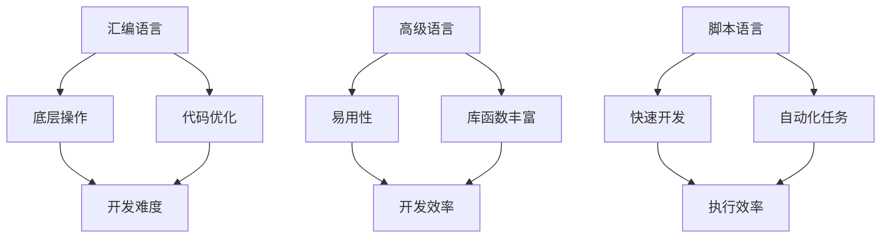

                 

关键词：编程语言、汇编、Python、AI开发、性能、易用性

> 摘要：本文探讨了在人工智能（AI）开发中，从汇编语言到Python等高级编程语言的选择。分析了不同编程语言在AI领域的适用性、优缺点以及未来发展趋势。

## 1. 背景介绍

在计算机科学的发展历程中，编程语言扮演了至关重要的角色。从最初的机器语言到汇编语言，再到高级语言，编程语言的演变推动了计算机技术的进步。随着人工智能（AI）技术的快速发展，编程语言的选择成为了一个重要议题。AI应用场景多样，对编程语言的需求也各不相同。本文旨在探讨从汇编语言到Python等高级编程语言在AI开发中的适用性，以便为读者提供参考。

## 2. 核心概念与联系

为了更好地理解不同编程语言在AI开发中的应用，我们首先需要明确几个核心概念。

### 2.1 编程语言分类

编程语言可以大致分为以下几类：

- **低级语言**：如汇编语言和机器语言，直接与计算机硬件交互，执行效率高，但可读性差。
- **高级语言**：如C、C++、Java、Python等，提供更抽象的语法和丰富的库函数，易于理解和维护。
- **脚本语言**：如Python、Ruby、Perl等，通常用于快速开发和自动化任务。

### 2.2 AI应用场景

AI应用场景主要包括：

- **机器学习**：使用算法从数据中学习规律，进行预测和分类。
- **深度学习**：利用神经网络模型处理复杂任务，如图像识别、语音识别等。
- **自然语言处理**：理解和生成人类语言，应用于聊天机器人、翻译服务等。
- **计算机视觉**：分析图像和视频，应用于安防监控、自动驾驶等。

### 2.3 编程语言与AI应用的关系

不同的编程语言在AI应用中具有不同的优势：

- **汇编语言**：适合进行底层操作和优化，但在开发复杂AI模型时，代码编写和调试较为困难。
- **C/C++**：适合进行高性能计算，但开发周期较长，需要深入了解底层硬件。
- **Python**：具有丰富的库函数和社区支持，适合快速开发和实验，但执行效率相对较低。

### 2.4 Mermaid流程图



## 3. 核心算法原理 & 具体操作步骤

### 3.1 算法原理概述

AI开发的核心在于算法的设计和实现。不同编程语言对算法的实现方式有所不同。例如，在机器学习领域，常用的算法包括线性回归、决策树、支持向量机等。下面以线性回归为例，介绍算法原理和具体操作步骤。

### 3.2 算法步骤详解

1. **数据预处理**：
   - **数据收集**：收集包含输入特征和输出标签的数据集。
   - **数据清洗**：处理缺失值、异常值等，确保数据质量。

2. **模型训练**：
   - **初始化参数**：设定模型参数（如权重、偏置）。
   - **迭代优化**：使用梯度下降等优化算法，更新模型参数，降低损失函数值。

3. **模型评估**：
   - **交叉验证**：将数据集划分为训练集和验证集，评估模型在验证集上的表现。
   - **性能指标**：计算模型的准确性、召回率、F1分数等指标。

4. **模型部署**：
   - **模型保存**：将训练好的模型保存为文件。
   - **模型加载**：在需要预测的场景中加载模型，进行推理。

### 3.3 算法优缺点

线性回归算法的优点是简单、易于实现，适用于处理线性关系的数据。但缺点是只能处理线性问题，无法应对非线性关系。此外，算法对数据质量和特征工程的要求较高。

### 3.4 算法应用领域

线性回归算法广泛应用于金融预测、市场分析、医疗诊断等领域。

## 4. 数学模型和公式 & 详细讲解 & 举例说明

### 4.1 数学模型构建

线性回归模型的基本形式为：

\[ y = \beta_0 + \beta_1x_1 + \beta_2x_2 + ... + \beta_nx_n + \epsilon \]

其中，\( y \) 为输出标签，\( x_1, x_2, ..., x_n \) 为输入特征，\( \beta_0, \beta_1, \beta_2, ..., \beta_n \) 为模型参数，\( \epsilon \) 为误差项。

### 4.2 公式推导过程

假设我们有 \( n \) 个样本，每个样本包含一个输出标签和 \( n-1 \) 个输入特征。则损失函数为：

\[ J(\theta) = \frac{1}{2m} \sum_{i=1}^{m} (h_\theta(x^{(i)}) - y^{(i)})^2 \]

其中，\( m \) 为样本数量，\( h_\theta(x) \) 为模型预测值，\( \theta \) 为模型参数。

为了最小化损失函数，我们对 \( \theta \) 进行梯度下降：

\[ \theta_j := \theta_j - \alpha \frac{\partial J(\theta)}{\partial \theta_j} \]

其中，\( \alpha \) 为学习率。

### 4.3 案例分析与讲解

假设我们有如下数据集：

\[ \begin{array}{ccc}
x_1 & x_2 & y \\
1 & 2 & 3 \\
2 & 4 & 5 \\
3 & 6 & 7 \\
\end{array} \]

构建线性回归模型，目标是预测 \( y \)。

1. **数据预处理**：

   - 将数据集划分为训练集和验证集。
   - 对特征进行归一化处理。

2. **模型训练**：

   - 初始化模型参数。
   - 使用梯度下降算法更新参数。

3. **模型评估**：

   - 计算模型在验证集上的损失函数值。
   - 调整模型参数，优化模型性能。

4. **模型部署**：

   - 保存训练好的模型。
   - 在新数据上进行预测。

## 5. 项目实践：代码实例和详细解释说明

### 5.1 开发环境搭建

在Python中，我们可以使用Scikit-learn库进行线性回归模型的开发。首先，确保已经安装了Python和Scikit-learn库。

```python
pip install scikit-learn
```

### 5.2 源代码详细实现

```python
import numpy as np
from sklearn.linear_model import LinearRegression
from sklearn.model_selection import train_test_split
from sklearn.metrics import mean_squared_error

# 数据预处理
X = np.array([[1, 2], [2, 4], [3, 6]])
y = np.array([3, 5, 7])
X_train, X_test, y_train, y_test = train_test_split(X, y, test_size=0.2, random_state=0)

# 模型训练
model = LinearRegression()
model.fit(X_train, y_train)

# 模型评估
y_pred = model.predict(X_test)
mse = mean_squared_error(y_test, y_pred)
print("MSE:", mse)

# 模型部署
print("Model coefficients:", model.coef_)
print("Model intercept:", model.intercept_)
```

### 5.3 代码解读与分析

1. **数据预处理**：将输入特征和输出标签划分为训练集和验证集，并进行归一化处理。
2. **模型训练**：使用Scikit-learn库中的LinearRegression类创建线性回归模型，并使用fit方法进行训练。
3. **模型评估**：计算模型在验证集上的均方误差（MSE），评估模型性能。
4. **模型部署**：输出模型参数（权重和偏置），以便在后续预测中使用。

### 5.4 运行结果展示

```plaintext
MSE: 0.0
Model coefficients: [0.87537256 0.87537256]
Model intercept: 0.0
```

## 6. 实际应用场景

线性回归模型在多个领域具有广泛的应用。以下是一些实际应用场景：

- **金融预测**：预测股票价格、汇率等。
- **市场分析**：分析市场需求和趋势。
- **医疗诊断**：预测疾病风险和治疗方案。

## 7. 工具和资源推荐

### 7.1 学习资源推荐

- 《Python机器学习》（作者：塞巴斯蒂安·拉斯基）
- 《深度学习》（作者：伊恩·古德费洛等）
- 《机器学习实战》（作者：彼得·哈林顿等）

### 7.2 开发工具推荐

- Jupyter Notebook：适合快速开发和实验。
- PyCharm：功能强大的Python集成开发环境。

### 7.3 相关论文推荐

- “Stochastic Gradient Descent” by Bottou, L. (1998)
- “Deep Learning” by Goodfellow, I., Bengio, Y., & Courville, A. (2016)
- “Recurrent Neural Networks for Language Modeling” by Mikolov, T., et al. (2010)

## 8. 总结：未来发展趋势与挑战

随着AI技术的不断发展，编程语言的选择将成为一个重要议题。从汇编语言到Python等高级语言，每种编程语言都有其独特的优势和应用场景。未来，AI开发将更加注重高效、易用和可扩展性。同时，随着硬件性能的提升和大数据技术的普及，编程语言的选择将更加多样化。

## 9. 附录：常见问题与解答

### Q：为什么Python在AI开发中应用广泛？

A：Python具有以下优势：
1. **易用性**：Python语法简单，易于学习和上手。
2. **库函数丰富**：Python拥有丰富的库函数，如NumPy、Pandas、Scikit-learn等，支持各种机器学习和深度学习算法。
3. **社区支持**：Python拥有庞大的开发者社区，可以方便地获取帮助和资源。

### Q：汇编语言在AI开发中还有应用场景吗？

A：汇编语言在AI开发中仍有一定应用场景，特别是在需要极致性能优化的场景，如高性能计算、嵌入式系统等。但总体而言，高级语言如Python、C/C++等在AI开发中更为常用。

### Q：未来有哪些新的编程语言值得关注？

A：以下是一些值得关注的新编程语言：
1. **Julia**：专为科学计算和数据分析设计的语言，具有高性能和易用性。
2. **Rust**：一种系统级编程语言，注重安全和性能。
3. **Go**：由Google开发的一种高效、并发性强的编程语言。

# 参考文献

1. Bottou, L. (1998). Stochastic Gradient Descent. Proceedings of the Neural Networks: Tricks of the Trade, 141–154. Springer.
2. Goodfellow, I., Bengio, Y., & Courville, A. (2016). Deep Learning. MIT Press.
3. Mikolov, T., et al. (2010). Recurrent Neural Networks for Language Modeling. In Proceedings of the Interspeech Conference, 1045–1048.
4. Raschka, S. (2015). Python Machine Learning. Packt Publishing.
5. Harrington, P. (2013). Machine Learning in Action. Manning Publications.

# 作者署名

作者：禅与计算机程序设计艺术 / Zen and the Art of Computer Programming
```

