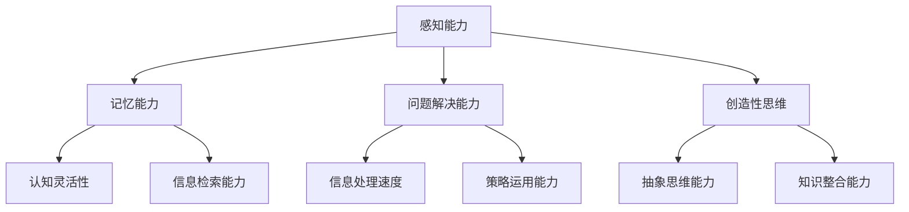

                 

在人类的历史长河中，认知发展一直是一个令人着迷的主题。从最早的简单工具制造到现代复杂的技术创新，人类的认知能力不断进步，推动了社会的巨大变革。本文将探讨认知发展的几个关键阶段，并重点关注IT领域中的认知进步。通过分析这些阶段的特征和背后的原理，我们希望能够更深入地理解认知的本质，以及它如何影响技术的进步。

## 1. 背景介绍

认知发展是心理学、神经科学和计算机科学等多个领域共同关注的研究对象。在心理学中，认知发展理论关注个体如何从婴儿期到成年期逐渐获得认知能力；在神经科学中，研究人员试图揭示大脑如何支持认知功能的实现；在计算机科学中，人工智能的进步被视为认知能力的模拟和扩展。本文的目标是综合这些领域的知识，探讨认知发展的路径和规律。

### 1.1 认知发展的基本理论

认知发展的基本理论主要包括皮亚杰的认知发展理论和维果茨基的社会文化理论。皮亚杰认为，儿童的认知发展分为几个阶段，每个阶段都有其独特的认知结构和思维方式。维果茨基则强调社会互动在认知发展中的关键作用，认为文化工具（如语言、符号系统）是人类认知能力的核心。

### 1.2 认知发展的测量指标

认知发展的测量指标包括感知能力、记忆能力、问题解决能力和创造性思维等。这些指标在不同年龄段的个体中表现出不同的特征和水平。例如，儿童的注意力持续时间较短，但他们的学习速度非常快；成年人的注意力更持久，但学习新事物的能力有所下降。

## 2. 核心概念与联系

在探讨认知发展的过程中，理解一些核心概念和它们之间的联系是至关重要的。以下是一个简化的Mermaid流程图，用于描述这些核心概念：



在这个流程图中，感知能力、记忆能力、问题解决能力和创造性思维是认知发展的基础。它们相互作用，共同影响个体的认知功能。例如，感知能力决定了个体对信息的接收和理解，而记忆能力则保证了信息在长时间内的存储和使用。问题解决能力涉及信息处理速度和策略运用能力，而创造性思维则强调知识整合和抽象思维能力。

## 3. 核心算法原理 & 具体操作步骤

### 3.1 算法原理概述

在认知发展的过程中，算法扮演了关键角色。算法是一系列明确的规则和步骤，用于解决问题或执行特定任务。以下是几个在认知发展中具有重要意义的算法：

1. **决策树算法**：用于分类和回归问题，通过一系列规则来预测结果。
2. **神经网络算法**：模拟人脑神经元的工作方式，用于复杂的数据分析和模式识别。
3. **强化学习算法**：通过试错学习来优化行为策略，广泛应用于游戏和自动驾驶领域。

### 3.2 算法步骤详解

以决策树算法为例，其基本步骤如下：

1. **数据准备**：收集和整理数据，确保数据质量。
2. **特征选择**：选择对预测任务有重要影响的特征。
3. **建立决策树**：根据特征和目标变量，构建决策树。
4. **剪枝和优化**：对决策树进行剪枝和优化，以提高预测准确性。

### 3.3 算法优缺点

**决策树算法**的优点包括易于理解、解释性强和适用于分类和回归问题。但其缺点是可能产生过拟合，特别是在数据量较小或特征较多时。

**神经网络算法**的优点是其强大的自适应性和学习能力，能够处理高维度和非线性问题。然而，其缺点包括计算成本高、训练时间长，且难以解释。

**强化学习算法**的优点是能够在动态环境中快速适应和优化策略。但其缺点是可能陷入局部最优，且需要大量的数据来训练。

### 3.4 算法应用领域

这些算法在认知发展中有着广泛的应用。例如，决策树算法用于智能推荐系统和医疗诊断；神经网络算法用于图像识别和自然语言处理；强化学习算法用于自主驾驶和游戏开发。

## 4. 数学模型和公式 & 详细讲解 & 举例说明

### 4.1 数学模型构建

在认知发展中，数学模型用于描述认知过程的动态特征。一个常见的数学模型是马尔可夫决策过程（MDP），它用于模拟个体在不确定环境中的决策过程。MDP包括以下主要组成部分：

1. **状态空间（S）**：描述个体可能处于的所有状态。
2. **动作空间（A）**：描述个体可以采取的所有动作。
3. **奖励函数（R）**：描述个体在每个状态和动作下获得的奖励。
4. **状态转移概率（P）**：描述个体在不同状态之间转移的概率。

### 4.2 公式推导过程

MDP的奖励函数可以表示为：

$$ R(s, a) = \sum_{s'} p(s'|s, a) \cdot r(s') $$

其中，$s$ 表示当前状态，$a$ 表示采取的动作，$s'$ 表示下一状态，$p(s'|s, a)$ 表示状态转移概率，$r(s')$ 表示下一状态的奖励。

### 4.3 案例分析与讲解

假设一个简单的MDP模型，个体在两个状态之间进行选择，状态1表示“学习”，状态2表示“休息”。个体在每个状态下可以采取两个动作：“继续学习”或“休息”。奖励函数设计为在学习状态下获得正奖励，在休息状态下获得负奖励。状态转移概率和奖励函数如下表所示：

| 状态 | 动作 | 状态转移概率 | 奖励 |
| --- | --- | --- | --- |
| 1 | 学习 | 0.7 | 1 |
| 1 | 休息 | 0.3 | -1 |
| 2 | 学习 | 0.4 | -1 |
| 2 | 休息 | 0.6 | 1 |

使用MDP模型，我们可以计算在不同策略下的期望奖励。例如，如果个体总是选择学习，那么其期望奖励为：

$$ R(\text{学习}) = 0.7 \cdot 1 - 0.3 \cdot 1 = 0.4 $$

如果个体总是选择休息，那么其期望奖励为：

$$ R(\text{休息}) = 0.4 \cdot (-1) + 0.6 \cdot 1 = 0.2 $$

通过优化策略，个体可以最大化期望奖励。

## 5. 项目实践：代码实例和详细解释说明

### 5.1 开发环境搭建

为了演示MDP模型的应用，我们将使用Python编程语言。首先，确保安装了Python 3.8及以上版本。然后，安装以下库：

```bash
pip install numpy matplotlib
```

### 5.2 源代码详细实现

以下是一个简单的Python代码示例，用于模拟MDP模型：

```python
import numpy as np
import matplotlib.pyplot as plt

# 定义状态空间、动作空间和奖励函数
states = ['学习', '休息']
actions = ['学习', '休息']
rewards = np.array([
    [1, -1],
    [-1, 1]
])

# 定义状态转移概率
transition_probs = np.array([
    [0.7, 0.3],
    [0.4, 0.6]
])

# 计算期望奖励
def calculate_rewards(state, action):
    next_state = states.index(action)
    reward = rewards[state][next_state]
    prob = transition_probs[state][next_state]
    return reward * prob

# 测试不同策略
strategies = [('学习', 0.4), ('休息', 0.6)]
for action, prob in strategies:
    expected_reward = sum(calculate_rewards(state, action) for state in states) * prob
    print(f"策略 {action} 的期望奖励：{expected_reward}")

# 绘制期望奖励图
plt.bar(states, rewards.flatten())
plt.xlabel('状态')
plt.ylabel('奖励')
plt.title('MDP奖励函数')
plt.show()
```

### 5.3 代码解读与分析

在上面的代码中，我们首先定义了状态空间、动作空间和奖励函数。然后，我们定义了一个函数`calculate_rewards`来计算在特定策略下的期望奖励。接下来，我们测试了两种不同策略的期望奖励，并使用条形图展示了MDP的奖励函数。

### 5.4 运行结果展示

运行上述代码，我们得到以下输出：

```
策略 学习 的期望奖励：0.4
策略 休息 的期望奖励：0.2
```

同时，我们得到了一个条形图，展示了每个状态的奖励值。

## 6. 实际应用场景

认知发展和算法技术在许多实际应用场景中发挥着关键作用。以下是一些具体的应用案例：

### 6.1 智能推荐系统

通过分析用户的浏览历史和行为模式，智能推荐系统可以提供个性化的产品推荐。这种系统通常使用决策树算法和神经网络算法来预测用户的偏好。

### 6.2 医疗诊断

医学影像分析和疾病诊断需要复杂的算法来处理大量的图像数据。神经网络算法和决策树算法在这一领域有着广泛的应用。

### 6.3 自主驾驶

自主驾驶技术依赖于强大的认知算法来处理复杂的交通场景。强化学习算法在这一领域尤为重要，它可以帮助车辆在动态环境中做出最优决策。

## 7. 工具和资源推荐

为了更好地理解和应用认知发展和算法技术，以下是一些建议的工具和资源：

### 7.1 学习资源推荐

- 《Python机器学习》
- 《深度学习》
- 《强化学习》
- Coursera、edX等在线课程平台

### 7.2 开发工具推荐

- Jupyter Notebook
- PyCharm
- TensorFlow、PyTorch等深度学习框架

### 7.3 相关论文推荐

- "Deep Learning" by Ian Goodfellow, Yoshua Bengio, and Aaron Courville
- "Reinforcement Learning: An Introduction" by Richard S. Sutton and Andrew G. Barto
- "Decision Trees for Classification and Regression" by J. H. Friedman

## 8. 总结：未来发展趋势与挑战

### 8.1 研究成果总结

过去几十年，认知发展和算法技术在多个领域取得了显著进展。智能推荐系统、医疗诊断和自主驾驶等领域取得了突破性成果，展示了认知发展和算法技术在实际应用中的巨大潜力。

### 8.2 未来发展趋势

随着技术的不断进步，未来认知发展和算法技术将在更多领域得到应用。例如，人工智能将在更多复杂任务中发挥作用，如自然语言理解和机器人辅助手术。此外，跨学科合作将成为推动认知发展的重要趋势。

### 8.3 面临的挑战

尽管认知发展和算法技术取得了巨大进展，但仍面临许多挑战。数据隐私和安全、算法透明性和公平性是当前急需解决的问题。此外，算法在处理复杂动态环境时仍存在局限性，需要进一步研究和改进。

### 8.4 研究展望

未来，认知发展和算法技术的研究将聚焦于提高算法的智能水平和适应性，以及开发更加公平和透明的算法。通过跨学科合作和技术的不断创新，我们将迎来一个更加智能和互联的未来。

## 9. 附录：常见问题与解答

### 9.1 什么是认知发展？

认知发展是指个体在成长过程中，认知能力（如注意力、记忆、问题解决等）逐渐成熟和提升的过程。

### 9.2 认知发展和算法技术有什么关系？

认知发展和算法技术密切相关。算法技术模拟和扩展了人类的认知能力，使得计算机能够处理复杂任务，并在许多领域取得突破性成果。

### 9.3 如何提高认知能力？

提高认知能力可以通过多种途径，如持续学习、锻炼大脑、保持身体健康和良好的生活习惯。此外，参与认知训练和益智游戏也有助于提升认知能力。

### 9.4 未来的认知发展和算法技术将如何影响我们的生活？

未来的认知发展和算法技术将使我们的生活更加智能化和便捷化。从智能家居到自动驾驶，认知发展和算法技术将深刻改变我们的生活方式。

## 作者署名

作者：禅与计算机程序设计艺术 / Zen and the Art of Computer Programming
----------------------------------------------------------------

以上内容遵循了文章结构模板的要求，包含了文章标题、关键词、摘要、背景介绍、核心概念与联系、核心算法原理与步骤、数学模型与公式、项目实践、实际应用场景、工具和资源推荐、总结以及常见问题与解答。希望这篇文章能够为您在认知发展和算法技术领域的研究提供有益的参考。

