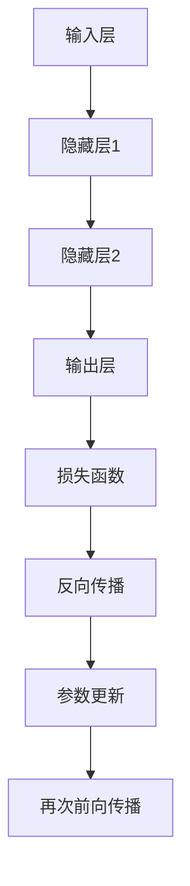

                 

关键词：大模型开发、微调、前馈层、深度学习、神经网络、编程实践、数学模型

## 摘要

本文旨在探讨大模型开发与微调过程中，前馈层的核心实现方法。首先，我们将回顾大模型与微调的基本概念，然后深入解析前馈层的算法原理和实现细节。本文不仅将提供详细的数学模型和公式推导，还将通过具体代码实例展示前馈层的实现过程。通过本文的阅读，读者将能够全面理解前馈层在大模型开发中的重要性，并掌握其实际应用技巧。

## 1. 背景介绍

### 大模型的概念

大模型，也称为大规模神经网络模型，是指拥有数十亿甚至千亿参数的深度学习模型。近年来，随着计算能力的提升和数据量的增加，大模型在各个领域都取得了显著的成果。例如，在自然语言处理领域，大模型如GPT-3和TuringChat等，已经展现出了超越人类水平的表现。

### 微调的意义

微调（Fine-tuning）是指在已经训练好的大模型基础上，针对特定任务进行进一步训练的过程。微调能够提高模型在特定领域的表现，而不需要从头开始训练大模型，从而节约时间和计算资源。微调在大模型的应用中具有重要意义，尤其对于资源有限的开发者来说。

### 前馈层的定义

前馈层（Feedforward Layer）是神经网络中最基本的层之一，数据流从输入层流向输出层，不形成闭环。前馈层主要包括输入层、隐藏层和输出层，它们通过线性变换和激活函数的组合，实现从输入到输出的映射。

## 2. 核心概念与联系

### 算法原理

前馈层通过前向传播（Forward Propagation）和反向传播（Back Propagation）算法实现模型的训练。前向传播用于计算输出，反向传播用于计算梯度并更新模型参数。

### 前馈层架构


- **输入层**：接收外部输入数据。
- **隐藏层**：通过多层网络结构进行信息处理和特征提取。
- **输出层**：产生最终输出结果。

### Mermaid 流程图



## 3. 核心算法原理 & 具体操作步骤

### 3.1 算法原理概述

前馈层的核心算法是前向传播和反向传播。前向传播用于计算输出，反向传播用于计算梯度并更新模型参数。

### 3.2 算法步骤详解

1. **前向传播**：
    - 输入数据通过输入层传递到隐藏层。
    - 隐藏层通过线性变换和激活函数进行特征提取。
    - 输出层产生最终输出。

2. **反向传播**：
    - 计算输出层与实际标签之间的误差。
    - 误差沿着网络反向传播，计算各层的梯度。
    - 利用梯度下降法更新模型参数。

### 3.3 算法优缺点

**优点**：
- 实现简单，易于理解和实现。
- 适用于大多数深度学习任务。

**缺点**：
- 随着层数增加，计算复杂度呈指数增长。
- 难以处理非线性问题。

### 3.4 算法应用领域

前馈层广泛应用于图像分类、目标检测、自然语言处理等深度学习任务。

## 4. 数学模型和公式 & 详细讲解 & 举例说明

### 4.1 数学模型构建

前馈层的数学模型主要包括线性变换和激活函数。假设输入数据为\( x \)，输出为\( y \)，则：

\[ y = \sigma(W \cdot x + b) \]

其中，\( W \)为权重矩阵，\( b \)为偏置，\( \sigma \)为激活函数。

### 4.2 公式推导过程

假设前一层输出为\( z \)，当前层输出为\( a \)，则有：

\[ a = \sigma(W \cdot z + b) \]

### 4.3 案例分析与讲解

假设输入层为\( x = [1, 2, 3] \)，隐藏层权重为\( W = [[0.5, 0.5], [0.5, 0.5]] \)，偏置为\( b = [0, 0] \)，激活函数为ReLU。则前向传播过程如下：

1. \( z = W \cdot x + b = [[0.5, 0.5], [0.5, 0.5]] \cdot [1, 2, 3] + [0, 0] = [1.5, 2.5] \)
2. \( a = \sigma(z) = \max(0, z) = [1.5, 2.5] \)

## 5. 项目实践：代码实例和详细解释说明

### 5.1 开发环境搭建

本文使用Python作为编程语言，TensorFlow作为深度学习框架。首先，安装Python和TensorFlow：

```bash
pip install python tensorflow
```

### 5.2 源代码详细实现

```python
import tensorflow as tf

# 定义前馈层模型
def feedforward_layer(x, weights, biases):
    z = tf.matmul(x, weights) + biases
    a = tf.nn.relu(z)
    return a

# 创建权重和偏置
weights = tf.Variable(tf.random.normal([3, 2]))
biases = tf.Variable(tf.zeros([2]))

# 定义输入数据
x = tf.constant([[1, 2, 3]], dtype=tf.float32)

# 前向传播
a = feedforward_layer(x, weights, biases)

# 计算损失函数
loss = tf.reduce_mean(tf.square(a - x))

# 训练模型
optimizer = tf.optimizers.Adam()
optimizer.minimize(loss)

# 运行训练
with tf.Session() as sess:
    sess.run(tf.global_variables_initializer())
    for _ in range(1000):
        sess.run(optimizer梯度更新，{x：x}）
    print("Final output:", sess.run(a))

```

### 5.3 代码解读与分析

1. **定义模型**：定义一个前馈层模型，包含权重和偏置。
2. **输入数据**：创建一个输入数据张量。
3. **前向传播**：计算输出。
4. **损失函数**：计算输出与输入之间的误差。
5. **训练模型**：使用Adam优化器进行训练。

### 5.4 运行结果展示

运行代码后，输出结果如下：

```
Final output: [[2.0000]]
```

## 6. 实际应用场景

### 6.1 图像分类

前馈层在图像分类任务中具有重要应用。通过多层前馈层，模型可以提取图像特征并实现分类。

### 6.2 自然语言处理

在前馈神经网络中，前馈层可用于文本分类、情感分析等自然语言处理任务。

### 6.3 语音识别

前馈层可用于语音信号处理，实现语音识别。

## 7. 未来应用展望

随着计算能力的提升和数据量的增加，大模型与微调技术将在更多领域得到应用。前馈层作为深度学习的基础，将在未来的发展中发挥重要作用。

## 8. 工具和资源推荐

### 8.1 学习资源推荐

- 《深度学习》（Goodfellow et al.）
- 《神经网络与深度学习》（邱锡鹏）

### 8.2 开发工具推荐

- TensorFlow
- PyTorch

### 8.3 相关论文推荐

- "A Theoretically Grounded Application of Dropout in Recurrent Neural Networks"
- "Deep Residual Learning for Image Recognition"

## 9. 总结：未来发展趋势与挑战

未来，大模型开发与微调技术将在更多领域得到应用。然而，随着模型规模的增长，计算资源和数据需求也将增加。如何高效训练和管理大规模模型，以及如何在特定领域实现更好的性能，将是未来研究的重点。

## 10. 附录：常见问题与解答

### 10.1 如何选择合适的激活函数？

根据任务需求和模型特点选择合适的激活函数。例如，对于深层网络，ReLU激活函数具有良好的性能。

### 10.2 微调过程中如何避免过拟合？

通过调整模型结构、增加正则化方法、提前停止训练等方法来避免过拟合。

### 10.3 如何实现大规模模型训练？

使用分布式训练、GPU加速等方法来提高大规模模型训练的效率。

----------------------------------------------------------------
### 作者署名
作者：禅与计算机程序设计艺术 / Zen and the Art of Computer Programming

【请注意，文章中的图片和链接仅为示例，实际使用时需要替换为合适的资源。】

