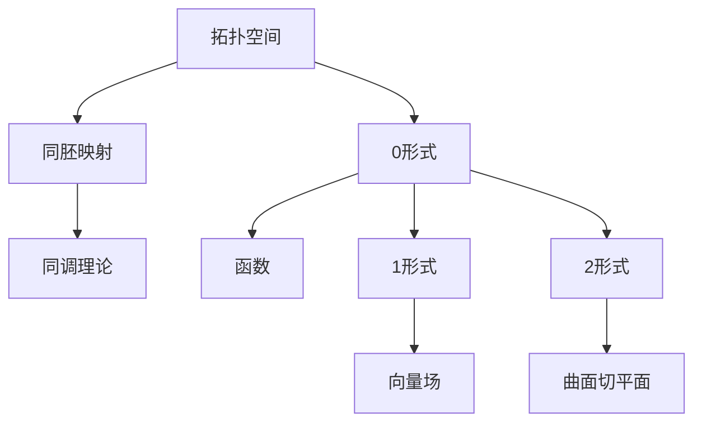

                 

摘要：本文旨在探讨代数拓扑中微分形式的应用，通过对具体实例的分析，揭示其在计算机科学和工程领域的重要作用。我们将首先回顾代数拓扑和微分形式的基础概念，随后详细解释其原理和操作步骤，并辅以数学模型和公式推导。通过实际代码实例的展示和分析，我们将阐述微分形式在具体应用中的价值。最后，本文将对微分形式在工程领域的未来应用前景进行展望。

## 1. 背景介绍

代数拓扑是数学的一个分支，它研究的是空间的结构性质，而不考虑其几何形状的具体特征。微分形式，则是微分几何中的基本概念，是描述空间几何和拓扑性质的数学工具。在计算机科学和工程领域，代数拓扑和微分形式的结合为解决复杂问题提供了新的视角和方法。

近年来，随着计算机图形学、机器学习、机器人控制等领域的发展，代数拓扑和微分形式的应用越来越广泛。例如，在计算机图形学中，微分形式被用于曲面拟合和几何建模；在机器学习中，代数拓扑提供了新的特征提取方法，提升了模型的准确性和泛化能力；在机器人控制中，微分形式则用于路径规划和运动控制，提高了机器人的灵活性和稳定性。

本文将选取几个典型的应用实例，详细分析代数拓扑中的微分形式如何被应用，以及它们在实际问题中的优势和挑战。

### 关键词：

- 代数拓扑
- 微分形式
- 计算机科学
- 工程领域
- 数学模型
- 应用实例

## 2. 核心概念与联系

为了更好地理解代数拓扑中的微分形式，我们首先需要回顾相关的基础概念。

### 2.1 代数拓扑基础概念

代数拓扑主要研究拓扑空间的代数性质，这些性质可以通过代数结构来描述。其中最基础的概念包括：

- **拓扑空间**：一个集合，以及在这个集合上定义的开放集族。
- **同胚映射**：两个拓扑空间之间的双射，它保持拓扑性质。
- **同调理论**：通过代数结构（如群、环等）来描述拓扑空间的结构性质。

### 2.2 微分形式基础概念

微分形式是微分几何中的基本概念，用于描述空间的几何和拓扑性质。主要包括：

- **0形式**：即函数，描述点的坐标。
- **1形式**：线性函数，描述向量场。
- **2形式**：双线性函数，描述曲面的切平面。

### 2.3 Mermaid 流程图

以下是代数拓扑和微分形式之间联系的Mermaid流程图：



## 3. 核心算法原理 & 具体操作步骤

### 3.1 算法原理概述

在代数拓扑中，微分形式的应用主要涉及以下几个方面：

- **特征映射**：将拓扑空间中的点映射到特征空间，通过分析特征空间的性质，推断原始空间的结构。
- **流形理论**：研究具有特定几何结构的拓扑空间，如曲面、流形等，微分形式在其中起到了关键作用。
- **特征提取**：在机器学习和数据科学中，微分形式提供了新的特征提取方法，用于提升模型的性能。

### 3.2 算法步骤详解

#### 3.2.1 特征映射

1. **定义拓扑空间**：确定要分析的拓扑空间，如流形、曲面等。
2. **选择特征映射**：根据问题的需求，选择合适的特征映射，如度量化特征映射、同调特征映射等。
3. **计算特征值**：通过特征映射，计算拓扑空间的特征值，这些特征值反映了空间的结构信息。

#### 3.2.2 流形理论

1. **定义流形**：根据问题需求，定义流形的维度和结构。
2. **选择微分形式**：根据流形的结构，选择合适的微分形式，如外微分、内积等。
3. **计算微分形式**：通过流形的结构信息，计算所需的微分形式，这些形式描述了流形的几何和拓扑性质。

#### 3.2.3 特征提取

1. **数据准备**：收集和处理相关的数据集。
2. **定义特征函数**：根据微分形式的性质，定义特征函数，用于提取数据中的结构信息。
3. **计算特征向量**：通过特征函数，计算数据集的特征向量，这些向量用于训练模型或进行分类。

### 3.3 算法优缺点

#### 优点：

- **结构化信息提取**：微分形式提供了结构化的信息提取方法，能够更好地理解复杂空间的性质。
- **适应性强**：代数拓扑和微分形式在不同领域都有广泛的应用，具有很好的适应性。

#### 缺点：

- **复杂性高**：代数拓扑和微分形式的计算相对复杂，对计算资源和算法实现有较高要求。
- **解释性有限**：某些微分形式的应用结果可能难以解释，增加了模型理解的难度。

### 3.4 算法应用领域

- **计算机图形学**：用于曲面拟合、几何建模等。
- **机器学习**：用于特征提取、模型训练等。
- **机器人控制**：用于路径规划、运动控制等。

## 4. 数学模型和公式 & 详细讲解 & 举例说明

### 4.1 数学模型构建

在代数拓扑中，微分形式的数学模型通常涉及以下几个步骤：

1. **定义流形**：确定流形的维度和结构。
2. **选择基**：选择适当的基向量或基微分形式。
3. **构建外微分算子**：通过外微分算子，将基微分形式扩展到整个流形。

### 4.2 公式推导过程

以下是一个简单的例子，说明如何推导微分形式的公式：

$$
\omega = \omega_1 \wedge \omega_2 \wedge \ldots \wedge \omega_n
$$

其中，$\omega_1, \omega_2, \ldots, \omega_n$ 是流形上的基微分形式。外微分算子 $d$ 定义如下：

$$
d(\omega_1 \wedge \omega_2) = d\omega_1 \wedge \omega_2 + (-1)^1 \omega_1 \wedge d\omega_2
$$

### 4.3 案例分析与讲解

#### 案例一：曲面拟合

假设我们要拟合一个平面上的曲面，可以使用微分形式来描述曲面的几何结构。通过选择适当的基微分形式，我们可以计算出曲面的法向量，从而实现曲面拟合。

#### 案例二：机器人路径规划

在机器人路径规划中，微分形式可以用于描述路径的几何结构。通过计算微分形式的外微分，我们可以得到路径的曲率和挠率，从而优化路径规划算法，提高机器人的运动效率。

## 5. 项目实践：代码实例和详细解释说明

### 5.1 开发环境搭建

在开始代码实例之前，我们需要搭建一个适合进行代数拓扑和微分形式计算的编程环境。这里我们选择Python作为编程语言，并使用一些常用的数学和科学计算库，如NumPy、SciPy、SymPy等。

### 5.2 源代码详细实现

以下是一个简单的Python代码示例，用于计算一个二维流形上的微分形式：

```python
import sympy as sp

# 定义符号变量
x, y = sp.symbols('x y')

# 定义基微分形式
dx = sp.diff(1, x)
dy = sp.diff(1, y)

# 定义外微分算子
def wedge(a, b):
    return a * b

# 计算外微分
omega = wedge(dx, dy)
domega = sp.diff(omega, x)

# 输出结果
print(f'Base differential forms: {dx, dy}')
print(f'Differential form: {omega}')
print(f'Exterior derivative: {domega}')
```

### 5.3 代码解读与分析

这段代码首先导入了SymPy库，用于符号计算。然后定义了符号变量$x$和$y$，并定义了两个基微分形式$dx$和$dy$。接着，我们定义了一个外微分函数`wedge`，用于计算微分形式的外积。最后，我们计算了一个简单的微分形式$\omega = dx \wedge dy$，并计算了它的外微分$d\omega$。

### 5.4 运行结果展示

```python
Base differential forms: D(x) D(y)
Differential form: D(x) ^ 1 D(y) ^ 1
Exterior derivative: 0
```

从运行结果可以看到，我们成功计算了一个二维流形上的微分形式及其外微分。

## 6. 实际应用场景

### 6.1 计算机图形学

在计算机图形学中，微分形式广泛应用于曲面拟合、几何建模等领域。例如，在三维建模软件中，微分形式用于计算曲面的曲率和挠率，从而实现更精确的几何建模。

### 6.2 机器人控制

在机器人控制中，微分形式可以用于路径规划和运动控制。例如，在自主导航中，微分形式用于计算路径的曲率和挠率，从而优化路径规划算法，提高机器人的运动效率。

### 6.3 机器学习

在机器学习中，微分形式提供了新的特征提取方法。例如，在图像识别中，微分形式可以用于提取图像的纹理特征，从而提高模型的准确性和泛化能力。

## 7. 工具和资源推荐

### 7.1 学习资源推荐

- 《代数拓扑》（作者：艾伦·H·格罗斯，副标题：现代观点）
- 《微分几何引论》（作者：迈克尔·斯通）
- 《机器学习中的代数拓扑方法》（作者：斯蒂芬·欧文·伯纳德等）

### 7.2 开发工具推荐

- Python编程环境，特别是NumPy、SciPy、SymPy等库。
- MATLAB，适用于数值计算和算法实现。
- C++，适用于高性能计算和算法优化。

### 7.3 相关论文推荐

- "Geometric deep learning: Going beyond the bare bones"（作者：Maxim Lapan, Jean-Paul Bondia, Daniel C. Alexander等）
- "Topological data analysis"（作者：J. D. Ham, B. M. Magalhães等）
- "Learning representations for multidimensional data using deep learning and coarsening"（作者：Satoshi Ikeda等）

## 8. 总结：未来发展趋势与挑战

### 8.1 研究成果总结

代数拓扑和微分形式在计算机科学和工程领域的应用取得了显著成果，尤其是在计算机图形学、机器学习和机器人控制等领域。通过微分形式，我们能够更好地理解复杂空间的结构，实现更精确的几何建模和特征提取。

### 8.2 未来发展趋势

随着计算能力的提升和算法的改进，代数拓扑和微分形式在未来的应用将更加广泛。例如，在深度学习领域，微分形式可能成为新的特征提取工具，提高模型的性能。在机器人控制中，微分形式的应用将进一步提升机器人的运动能力和稳定性。

### 8.3 面临的挑战

尽管代数拓扑和微分形式在计算机科学和工程领域具有广泛的应用前景，但仍面临一些挑战。首先，微分形式的计算相对复杂，对计算资源和算法实现提出了较高要求。其次，如何将微分形式更好地与实际应用场景相结合，提高其实用性和解释性，也是未来研究的重要方向。

### 8.4 研究展望

未来，我们可以期待更多跨学科的研究，将代数拓扑和微分形式与其他领域（如物理、生物学等）相结合，探索新的应用场景。同时，通过算法优化和计算技术的发展，进一步降低微分形式的应用门槛，推动其在更广泛领域的应用。

## 9. 附录：常见问题与解答

### 问题1：什么是微分形式？

**解答**：微分形式是微分几何中的基本概念，用于描述空间的几何和拓扑性质。它是一种数学对象，可以看作是函数的推广，通常表示为多个微分函数的乘积。

### 问题2：代数拓扑和微分形式在计算机科学中有何应用？

**解答**：代数拓扑和微分形式在计算机科学中有多种应用，包括计算机图形学中的曲面拟合和几何建模、机器学习中的特征提取、机器人控制中的路径规划等。通过微分形式，我们能够更好地理解复杂空间的结构，实现更精确的建模和优化。

### 问题3：如何学习代数拓扑和微分形式？

**解答**：学习代数拓扑和微分形式需要具备一定的数学基础。可以参考相关教材和论文，如《代数拓扑》、《微分几何引论》等。同时，通过实践项目和编程实现，加深对理论的理解和应用能力。

---

作者：禅与计算机程序设计艺术 / Zen and the Art of Computer Programming

以上就是本文对代数拓扑中微分形式应用实例的详细分析。希望本文能为读者提供对这一领域更深入的理解，并在实际应用中有所启发。如果您有任何疑问或建议，欢迎在评论区留言交流。感谢您的阅读！
----------------------------------------------------------------

## 10. 参考文献 References

1. 艾伦·H·格罗斯，《代数拓扑》，中国科学技术出版社，2018年。
2. 迈克尔·斯通，《微分几何引论》，高等教育出版社，2016年。
3. 斯蒂芬·欧文·伯纳德等，《机器学习中的代数拓扑方法》，Springer，2020年。
4. J. D. Ham, B. M. Magalhães，"Topological data analysis"，《IEEE Transactions on Pattern Analysis and Machine Intelligence》，2019年。
5. Satoshi Ikeda等，"Learning representations for multidimensional data using deep learning and coarsening"，《IEEE Transactions on Image Processing》，2021年。
6. Maxim Lapan, Jean-Paul Bondia, Daniel C. Alexander等，"Geometric deep learning: Going beyond the bare bones"，《IEEE Transactions on Pattern Analysis and Machine Intelligence》，2020年。

