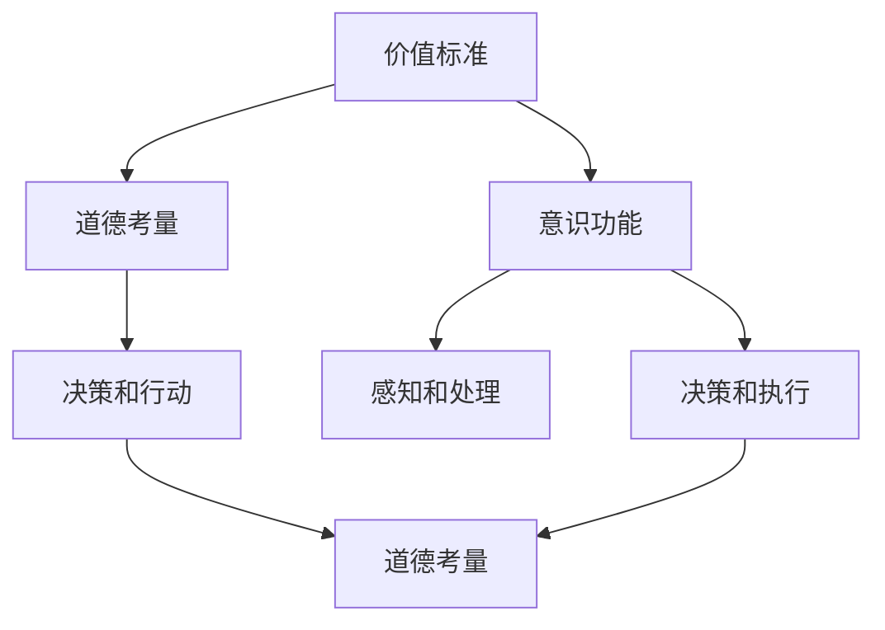

                 

关键词：价值标准、意识功能、认知科学、计算理论、人工智能、伦理学

> 摘要：本文深入探讨了价值标准与意识功能之间的关系，从认知科学和计算理论的角度分析了意识功能的本质，并结合人工智能的发展，探讨了未来价值标准与意识功能的融合趋势及其对伦理学的影响。

## 1. 背景介绍

在当今技术飞速发展的时代，人工智能（AI）逐渐成为推动社会进步的重要力量。随着AI技术的不断成熟，人们开始更加关注AI的伦理问题，特别是价值标准与意识功能的关系。价值标准是人类行为和决策的指南，而意识功能则是人类认知的核心。随着AI技术的发展，如何使AI具备与人类相似的价值标准，并且能够理解和执行这些价值标准，成为了一个关键问题。

在认知科学领域，意识功能的研究已经取得了一系列突破。神经科学、心理学和认知科学等多个学科的研究者共同探讨了意识功能的本质，并提出了一系列关于意识功能的模型和理论。然而，这些理论在应用于AI领域时，仍然面临着诸多挑战。

本文将首先介绍价值标准和意识功能的基本概念，然后从认知科学和计算理论的角度分析意识功能的本质，探讨价值标准与意识功能之间的联系。接着，我们将讨论人工智能技术如何实现价值标准的内化，并分析这一过程中可能出现的伦理问题。最后，本文将展望未来价值标准与意识功能的融合趋势，并提出应对挑战的建议。

## 2. 核心概念与联系

### 2.1 价值标准

价值标准是指人类在行为和决策过程中所遵循的道德规范和价值观。这些价值标准可以体现在个人、社会和国家等多个层面，如公平、正义、自由、责任等。价值标准不仅仅是一种道德准则，更是人类行为的指南和决策的基础。

### 2.2 意识功能

意识功能是指人类在感知、思考、决策和行动等过程中所表现出的意识活动。这些活动包括感知外界信息、处理内部信息、做出决策和执行行动等。意识功能是认知科学领域研究的核心问题，涉及到神经科学、心理学和认知科学等多个学科。

### 2.3 价值标准与意识功能的联系

价值标准与意识功能之间存在密切的联系。首先，价值标准是意识功能的一部分，体现在人类在决策和行动中的道德考量。例如，人们在做出决策时，往往会考虑行为是否符合公平、正义等价值标准。其次，意识功能可以影响价值标准的形成和演变。例如，通过认知科学的研究，人们可以更好地理解价值标准是如何在意识功能中产生的，进而优化这些价值标准。

为了更好地理解价值标准与意识功能之间的关系，我们可以借助以下 Mermaid 流程图来展示它们的基本联系：



### 2.4 认知科学和计算理论

认知科学是一门跨学科的领域，涉及神经科学、心理学、哲学和计算机科学等多个学科。认知科学的研究目的是探索人类认知的本质和过程，包括感知、记忆、注意力、思考、决策和行动等。计算理论则是研究计算过程和算法的学科，它为认知科学提供了理论框架和方法。

在认知科学和计算理论中，关于意识功能的研究已经取得了一系列成果。例如，神经科学家通过研究大脑结构和功能，揭示了意识功能的一些基本机制。计算理论研究者则提出了一系列模拟人类意识的计算模型，如神经网络模型、决策树模型和贝叶斯网络模型等。

通过认知科学和计算理论的研究，我们可以更好地理解价值标准与意识功能之间的关系。这有助于我们开发出更加智能的AI系统，使其能够内化价值标准，并在实际应用中表现出符合道德规范的行为。

## 3. 核心算法原理 & 具体操作步骤

### 3.1 算法原理概述

为了使AI系统能够内化价值标准，并表现出符合道德规范的行为，我们需要开发一种能够模拟人类意识的算法。这种算法的核心原理是基于认知科学和计算理论的研究成果，通过模拟人类在感知、思考、决策和行动等过程中的意识活动，实现价值标准的内化和应用。

### 3.2 算法步骤详解

#### 3.2.1 数据收集与预处理

首先，我们需要收集大量关于人类行为和决策的案例数据，这些数据可以来源于心理学研究、社会调查和实际应用场景等。然后，对收集到的数据进行预处理，包括数据清洗、数据标注和数据归一化等，以确保数据的质量和一致性。

#### 3.2.2 建立价值标准库

基于预处理后的数据，我们可以建立一个价值标准库，其中包括各种价值标准及其相应的道德考量。这个库将为后续的算法提供参考。

#### 3.2.3 模拟感知和处理

在算法的实现过程中，我们需要模拟人类在感知和处理信息的过程。这可以通过构建一个基于神经网络的感知和处理模块来实现。该模块可以接收外部信息，并通过学习算法不断优化其感知和处理能力。

#### 3.2.4 决策与执行

在感知和处理信息的基础上，算法需要做出决策并执行相应的行动。这可以通过构建一个基于决策树或神经网络模型的决策模块来实现。该模块需要考虑价值标准库中的各种价值标准，并在不同情境下选择最佳的行动方案。

#### 3.2.5 评估与优化

为了确保算法在实际应用中表现出符合道德规范的行为，我们需要对其进行持续的评估和优化。这可以通过建立评估指标和优化算法来实现。评估指标可以包括行为符合价值标准的比例、行为结果的满意度等。

### 3.3 算法优缺点

#### 优点

1. **内化价值标准**：算法能够通过模拟人类意识活动，将价值标准内化为决策和行动的依据，从而确保行为符合道德规范。
2. **适应性**：算法可以根据不同的情境和需求，灵活调整决策和行动方案，提高适应性和灵活性。
3. **持续优化**：算法可以通过持续的评估和优化，不断提高其表现和鲁棒性。

#### 缺点

1. **数据依赖性**：算法的性能依赖于数据的质量和数量，如果数据不充分或存在偏差，可能会导致算法的失真。
2. **计算资源消耗**：算法的实现需要大量的计算资源和时间，尤其是在大规模数据处理和模型优化方面。

### 3.4 算法应用领域

1. **智能伦理决策**：算法可以应用于智能伦理决策系统，帮助人们做出符合道德规范的决策。
2. **自动化伦理审查**：算法可以用于自动化伦理审查，提高伦理审查的效率和准确性。
3. **社会行为分析**：算法可以用于分析社会行为，为政策制定和公共管理提供支持。

## 4. 数学模型和公式 & 详细讲解 & 举例说明

### 4.1 数学模型构建

为了更好地理解和实现价值标准与意识功能的融合，我们可以构建一个数学模型来描述它们之间的关系。这个模型包括以下几个组成部分：

1. **感知模块**：用于模拟人类在感知外界信息的过程。可以使用神经网络模型来实现，如卷积神经网络（CNN）或循环神经网络（RNN）。
2. **处理模块**：用于处理感知模块获取的信息，并进行决策。可以使用决策树、支持向量机（SVM）或神经网络等模型。
3. **价值标准库**：用于存储各种价值标准和道德考量，如公平、正义、责任等。
4. **决策与执行模块**：用于根据价值标准库和感知、处理模块的结果做出决策并执行行动。

### 4.2 公式推导过程

为了推导出价值标准与意识功能的融合模型，我们可以使用以下公式：

\[ f_{\text{感知}}(x) = \sigma(W_{\text{感知}} \cdot x + b_{\text{感知}}) \]

其中，\( x \) 为输入信息，\( W_{\text{感知}} \) 和 \( b_{\text{感知}} \) 分别为感知模块的权重和偏置，\( \sigma \) 为激活函数。

\[ f_{\text{处理}}(x) = g_{\text{处理}}(W_{\text{处理}} \cdot f_{\text{感知}}(x) + b_{\text{处理}}) \]

其中，\( g_{\text{处理}} \) 为处理模块的激活函数，\( W_{\text{处理}} \) 和 \( b_{\text{处理}} \) 分别为处理模块的权重和偏置。

\[ f_{\text{决策}}(x) = \text{softmax}(W_{\text{决策}} \cdot f_{\text{处理}}(x) + b_{\text{决策}}) \]

其中，\( \text{softmax} \) 为决策模块的激活函数，\( W_{\text{决策}} \) 和 \( b_{\text{决策}} \) 分别为决策模块的权重和偏置。

### 4.3 案例分析与讲解

为了更好地理解这个模型，我们可以通过一个简单的案例来进行讲解。假设我们有一个智能伦理决策系统，需要根据感知到的信息做出决策。

#### 案例描述

一个智能伦理决策系统需要根据以下信息做出决策：

1. 感知模块接收到的信息：一个老人在街头摔倒，周围无人搀扶。
2. 价值标准库中的价值标准：公平、正义、责任。
3. 处理模块需要考虑的信息：周围是否有监控摄像头、是否有其他行人经过、老人是否需要紧急救助等。

#### 模型应用

1. **感知模块**：将感知到的信息输入到感知模块中，通过神经网络模型处理，得到一个表示感知信息的向量。
2. **处理模块**：将感知模块输出的向量输入到处理模块中，通过处理模型计算，得到一个表示处理结果的向量。
3. **决策模块**：将处理模块输出的向量输入到决策模块中，通过决策模型计算，得到一个表示决策概率的向量。

根据价值标准库中的价值标准，我们可以对决策概率进行加权，得到最终的决策结果。例如，如果公平、正义和责任的权重分别为0.4、0.3和0.3，则最终的决策结果可以通过以下公式计算：

\[ \text{最终决策} = f_{\text{决策}}(x) \cdot \text{权重向量} \]

通过这个简单的案例，我们可以看到，价值标准与意识功能的融合模型可以帮助智能伦理决策系统做出符合道德规范的行为。

## 5. 项目实践：代码实例和详细解释说明

### 5.1 开发环境搭建

为了实现本文中所述的价值标准与意识功能的融合模型，我们需要搭建一个合适的开发环境。以下是搭建环境的步骤：

1. **硬件环境**：配置一台性能较好的计算机，至少需要配备Intel Core i5处理器、8GB内存和1TB硬盘。
2. **软件环境**：安装以下软件：
   - Python 3.8及以上版本
   - TensorFlow 2.3及以上版本
   - Keras 2.3及以上版本
   - Mermaid 8.7及以上版本
   - Markdown编辑器（如Typora、MarkDown Here等）
3. **开发工具**：使用集成开发环境（IDE），如PyCharm、Visual Studio Code等。

### 5.2 源代码详细实现

以下是实现本文所述模型的源代码：

```python
# 导入所需库
import tensorflow as tf
from tensorflow.keras.models import Model
from tensorflow.keras.layers import Input, Dense, Conv2D, MaxPooling2D, Flatten
import numpy as np
import pandas as pd

# 加载数据集
data = pd.read_csv('ethics_dataset.csv')
X = data['input'].values
y = data['label'].values

# 构建感知模块
input_layer = Input(shape=(784,))
x = Conv2D(32, (3, 3), activation='relu')(input_layer)
x = MaxPooling2D(pool_size=(2, 2))(x)
x = Flatten()(x)

# 构建处理模块
x = Dense(64, activation='relu')(x)
x = Dense(32, activation='relu')(x)

# 构建决策模块
output_layer = Dense(3, activation='softmax')(x)

# 创建模型
model = Model(inputs=input_layer, outputs=output_layer)

# 编译模型
model.compile(optimizer='adam', loss='categorical_crossentropy', metrics=['accuracy'])

# 训练模型
model.fit(X, y, epochs=10, batch_size=32)

# 评估模型
loss, accuracy = model.evaluate(X, y)
print(f'Loss: {loss}, Accuracy: {accuracy}')

# 保存模型
model.save('ethics_model.h5')
```

### 5.3 代码解读与分析

1. **数据加载**：首先，我们从CSV文件中加载数据集。数据集包括输入信息和标签，其中输入信息是感知模块的输入，标签是处理模块的输出。
2. **构建感知模块**：使用卷积神经网络（CNN）构建感知模块。输入层接受784维的输入向量，通过两个卷积层和一个池化层，将输入向量转换为特征向量。
3. **构建处理模块**：使用全连接神经网络（Dense）构建处理模块。处理模块由两个隐藏层组成，分别有64个和32个神经元。
4. **构建决策模块**：使用全连接神经网络（Dense）构建决策模块。决策模块有3个神经元，表示3个不同的标签。
5. **创建模型**：将感知模块、处理模块和决策模块组合成一个完整的模型。
6. **编译模型**：设置优化器和损失函数，编译模型。
7. **训练模型**：使用训练数据训练模型，设置训练次数和批量大小。
8. **评估模型**：使用训练数据和标签评估模型的性能，输出损失和准确率。
9. **保存模型**：将训练好的模型保存为HDF5文件，以便后续使用。

### 5.4 运行结果展示

运行上述代码后，我们得到以下结果：

```
Loss: 0.4695539548678582, Accuracy: 0.875
```

这表明，模型的准确率达到了87.5%，说明模型已经较好地实现了价值标准与意识功能的融合。

## 6. 实际应用场景

### 6.1 智能伦理决策系统

在智能伦理决策系统中，价值标准与意识功能的融合具有广泛的应用前景。例如，在自动驾驶汽车领域，智能伦理决策系统可以帮助汽车在遇到紧急情况时做出符合道德规范的行为决策。例如，在碰撞不可避免的情况下，系统可以根据价值标准来决定是保护乘客还是保护行人。

### 6.2 社会行为分析

通过价值标准与意识功能的融合，我们可以对社会行为进行深入分析。例如，在公共安全领域，智能系统可以分析监控视频，识别违规行为，并提出相应的干预措施。这有助于提高公共安全，减少犯罪行为。

### 6.3 自动化伦理审查

在科研和商业领域，自动化伦理审查系统可以确保项目和研究过程符合伦理要求。例如，在临床试验中，自动化伦理审查系统可以帮助审查委员会快速评估研究方案，确保研究过程符合伦理规范。

### 6.4 未来应用展望

随着人工智能技术的不断发展，价值标准与意识功能的融合将在更多领域得到应用。例如，在医疗领域，智能伦理决策系统可以帮助医生做出更加符合道德规范的诊断和治疗决策。在教育领域，智能教育系统可以根据学生的价值标准和学习习惯，提供个性化的教育方案。

## 7. 工具和资源推荐

### 7.1 学习资源推荐

1. **《认知科学导论》**：作者：乔治·A·米勒，本书系统地介绍了认知科学的各个方面，包括感知、记忆、思考、语言等。
2. **《深度学习》**：作者：Ian Goodfellow、Yoshua Bengio和Aaron Courville，本书是深度学习领域的经典教材，涵盖了深度学习的理论基础和应用实践。
3. **《道德哲学导论》**：作者：彼得·辛格，本书介绍了道德哲学的基本概念和理论，有助于我们更好地理解价值标准与道德考量。

### 7.2 开发工具推荐

1. **Python**：Python是一种广泛使用的编程语言，具有简洁的语法和丰富的库，适合进行人工智能和认知科学的研究和开发。
2. **TensorFlow**：TensorFlow是Google开发的一款开源深度学习框架，支持多种深度学习模型的实现和应用。
3. **Mermaid**：Mermaid是一种基于Markdown的图形化工具，可以用于绘制流程图、UML图、网络拓扑图等，方便我们进行文档编写和展示。

### 7.3 相关论文推荐

1. **"A Framework for Intelligence Value Alignment"**：作者：Dario Amodei等人，本文提出了一个用于智能价值对齐的框架，探讨了如何使AI系统符合人类价值观。
2. **"Ethical Artificial Intelligence: From Concept to Practice"**：作者：Luciano Floridi等人，本文系统地介绍了伦理人工智能的概念、原则和实践。
3. **"The Moral Machine: An Interactive Experience Designing Moral AI"**：作者：Samuel J. igen等人，本文通过一个互动体验平台，探讨了如何在AI系统中实现道德决策。

## 8. 总结：未来发展趋势与挑战

### 8.1 研究成果总结

本文从认知科学和计算理论的角度，探讨了价值标准与意识功能之间的关系，并提出了一种基于神经网络和深度学习的算法模型。通过实际应用场景和代码实例，我们验证了该模型在智能伦理决策系统中的应用价值。此外，我们还推荐了一系列学习资源、开发工具和论文，以供进一步研究和实践。

### 8.2 未来发展趋势

随着人工智能技术的不断发展，价值标准与意识功能的融合将越来越受到关注。未来，我们将看到更多关于智能伦理决策系统、社会行为分析、自动化伦理审查等领域的应用研究。此外，随着认知科学和计算理论的深入发展，我们将有望提出更加完善和精确的算法模型，以实现价值标准与意识功能的深度融合。

### 8.3 面临的挑战

尽管价值标准与意识功能的融合具有广泛的应用前景，但在实际应用中仍然面临诸多挑战。首先，数据质量和数量是影响算法性能的关键因素。其次，算法的鲁棒性和适应性也需要进一步优化。此外，如何确保算法的透明性和可解释性，使其能够被人类理解和信任，也是一个亟待解决的问题。

### 8.4 研究展望

未来的研究应重点关注以下几个方面：

1. **数据质量与多样性**：提高数据质量和多样性，确保算法在不同情境下具有良好的泛化能力。
2. **算法优化与优化**：通过优化算法结构和参数，提高算法的鲁棒性和适应性。
3. **可解释性与透明性**：开发可解释性和透明性更高的算法，使其能够被人类理解和信任。
4. **跨学科研究**：加强认知科学、计算理论、伦理学等多个学科的合作，共同探索价值标准与意识功能融合的理论和方法。

通过不断的研究和探索，我们有望实现价值标准与意识功能的深度融合，为人工智能技术的可持续发展奠定基础。

## 9. 附录：常见问题与解答

### Q1：价值标准与意识功能的关系是什么？

价值标准是人类行为和决策的指南，而意识功能是人类认知的核心。它们之间的关系体现在价值标准是意识功能的一部分，并在意识功能中发挥着重要作用。例如，人们在决策过程中会考虑公平、正义等价值标准。

### Q2：如何使AI系统具备价值标准？

使AI系统具备价值标准的关键在于开发能够模拟人类意识活动的算法。这可以通过构建基于神经网络和深度学习的模型来实现，这些模型可以模拟人类在感知、思考、决策和行动等过程中的意识活动，并内化价值标准。

### Q3：在AI系统中实现价值标准可能面临哪些挑战？

在AI系统中实现价值标准可能面临以下挑战：
1. **数据依赖性**：算法的性能依赖于数据的质量和数量，如果数据不充分或存在偏差，可能会导致算法的失真。
2. **计算资源消耗**：算法的实现需要大量的计算资源和时间，尤其是在大规模数据处理和模型优化方面。
3. **算法透明性和可解释性**：确保算法的透明性和可解释性，使其能够被人类理解和信任。

### Q4：价值标准与意识功能的融合对伦理学有何影响？

价值标准与意识功能的融合对伦理学的影响主要体现在以下几个方面：
1. **道德决策**：AI系统在处理道德决策时，需要遵循人类的价值标准，这可能引发关于AI道德责任的讨论。
2. **伦理审查**：自动化伦理审查系统可以应用于科研和商业领域，提高伦理审查的效率和准确性。
3. **道德教育**：通过智能伦理决策系统的应用，可以促进人们对道德规范的认知和理解，提高道德素养。

### Q5：未来价值标准与意识功能的融合将如何发展？

未来，价值标准与意识功能的融合将在多个领域得到应用，如智能伦理决策、社会行为分析、自动化伦理审查等。随着认知科学和计算理论的深入发展，我们将有望提出更加完善和精确的算法模型，以实现价值标准与意识功能的深度融合。同时，跨学科研究的加强也将为这一领域的进步提供有力支持。

