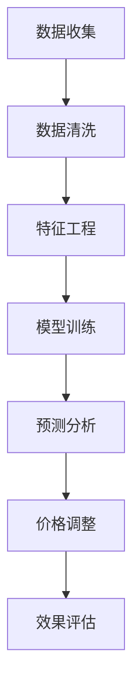

                 

关键词：价格优化，人工智能，市场供需，动态定价，AI算法，经济模型，应用场景

> 摘要：本文将深入探讨人工智能在价格优化领域的应用，尤其是如何通过AI算法来根据市场供需调整价格。文章将首先介绍价格优化的重要性，随后详细阐述核心概念、算法原理、数学模型，并通过实际案例展示其在不同领域的应用，最后探讨未来发展趋势和面临的挑战。

## 1. 背景介绍

在现代经济活动中，价格优化是一个至关重要的环节。无论是制造商、零售商还是服务提供商，合理定价不仅能提高企业的盈利能力，还能增强市场竞争力。传统的价格优化往往依赖于历史数据和统计分析，这种方法存在响应速度慢、灵活性不足等问题。

随着人工智能技术的快速发展，利用机器学习算法进行价格优化成为可能。AI能够从大量数据中快速提取有价值的信息，并根据市场动态实时调整价格策略，从而实现更精准、更高效的价格管理。

### 价格优化的目的

价格优化的核心目的是最大化企业的收益。这可以通过以下几种方式实现：

- **提高市场份额**：通过合理的定价策略，吸引更多的消费者。
- **提升利润率**：在保持市场份额的同时，提高每单位产品的利润。
- **增强市场竞争力**：灵活的价格调整可以更好地应对市场变化，提升企业在竞争中的地位。

### 价格优化的挑战

尽管价格优化的重要性不言而喻，但在实际操作中仍面临诸多挑战：

- **数据复杂性**：市场数据多样且复杂，如何有效地提取和处理这些数据是关键。
- **市场动态性**：市场需求随时在变化，实时调整价格策略需要强大的计算能力和快速响应机制。
- **策略多样性**：不同的市场环境和目标可能导致不同的定价策略，如何找到最优策略是难点。

## 2. 核心概念与联系

### 2.1 价格优化相关概念

为了更好地理解价格优化，我们需要了解以下几个核心概念：

- **供需关系**：供需关系是价格形成的基础。供给量增加，价格下降；需求量增加，价格上升。
- **动态定价**：动态定价是指根据市场变化实时调整价格，以达到最优收益。
- **机器学习**：机器学习是一种通过数据驱动的方式进行决策的技术。它能够从历史数据中学习，预测未来的市场趋势。

### 2.2 人工智能在价格优化中的应用

人工智能在价格优化中的应用主要体现在以下几个方面：

- **数据挖掘**：利用机器学习算法从大量市场数据中提取有价值的信息。
- **预测分析**：通过时间序列分析和回归分析等方法，预测未来价格走势。
- **实时调整**：根据实时数据，自动调整价格策略。

### 2.3 Mermaid 流程图

以下是一个简化的价格优化流程的Mermaid流程图：



## 3. 核心算法原理 & 具体操作步骤

### 3.1 算法原理概述

价格优化的核心算法通常是基于机器学习的算法，如线性回归、决策树、神经网络等。这些算法的基本原理是从历史数据中学习价格和需求之间的关系，然后根据新的市场数据预测未来价格，并作出相应的价格调整。

### 3.2 算法步骤详解

#### 3.2.1 数据收集与预处理

- **数据收集**：收集历史销售数据、市场价格数据、竞争对手价格数据等。
- **数据清洗**：去除错误数据、异常值，对缺失数据进行填充。

#### 3.2.2 特征工程

- **特征选择**：选择对价格影响较大的特征，如季节性、促销活动、消费者偏好等。
- **特征变换**：对数据进行标准化、归一化等处理。

#### 3.2.3 模型训练

- **模型选择**：根据问题特点选择合适的机器学习模型，如线性回归、决策树、神经网络等。
- **模型训练**：使用历史数据对模型进行训练，调整模型参数。

#### 3.2.4 预测分析

- **预测模型**：使用训练好的模型对未来价格进行预测。
- **预测结果**：分析预测结果，确定价格调整策略。

#### 3.2.5 价格调整

- **价格策略**：根据预测结果和市场需求，制定相应的价格调整策略。
- **执行调整**：执行价格调整，并跟踪调整效果。

#### 3.2.6 效果评估

- **评估指标**：选择合适的评估指标，如利润率、市场份额等。
- **效果分析**：分析价格调整的效果，对模型进行调整和优化。

### 3.3 算法优缺点

#### 优点

- **高效性**：AI算法能够快速处理大量数据，提高价格优化的效率。
- **灵活性**：能够根据市场动态实时调整价格策略。
- **智能化**：能够从数据中学习，预测未来趋势。

#### 缺点

- **依赖数据**：需要大量的高质量数据支持，否则可能导致预测不准确。
- **计算资源**：训练和运行机器学习模型需要较大的计算资源。
- **复杂性**：理解和实现AI算法需要较高的技术门槛。

### 3.4 算法应用领域

AI算法在价格优化的应用非常广泛，包括但不限于以下领域：

- **零售行业**：如电商平台根据用户行为实时调整商品价格。
- **制造业**：如根据生产成本和市场需求调整产品售价。
- **服务行业**：如酒店和航空公司在淡季和旺季调整价格。

## 4. 数学模型和公式

### 4.1 数学模型构建

价格优化的数学模型通常是一个线性回归模型，其公式如下：

$$
\hat{P} = \beta_0 + \beta_1 \cdot X_1 + \beta_2 \cdot X_2 + ... + \beta_n \cdot X_n
$$

其中，$\hat{P}$ 是预测的价格，$X_1, X_2, ..., X_n$ 是影响价格的因素，$\beta_0, \beta_1, ..., \beta_n$ 是模型的参数。

### 4.2 公式推导过程

公式的推导过程涉及到最小二乘法，具体推导过程如下：

假设我们有 $n$ 个样本点 $(x_1, y_1), (x_2, y_2), ..., (x_n, y_n)$，其中 $y_i$ 是实际价格，$x_i$ 是影响价格的因素。我们的目标是找到一个线性模型 $\hat{y} = \beta_0 + \beta_1 \cdot x$，使得预测值 $\hat{y}$ 与实际值 $y$ 的误差最小。

误差函数定义为：

$$
J(\beta_0, \beta_1) = \sum_{i=1}^{n} (\hat{y_i} - y_i)^2
$$

为了最小化 $J(\beta_0, \beta_1)$，我们对 $\beta_0$ 和 $\beta_1$ 分别求导并令导数为零，得到以下两个方程：

$$
\frac{\partial J}{\partial \beta_0} = -2 \sum_{i=1}^{n} (y_i - \hat{y_i}) = 0
$$

$$
\frac{\partial J}{\partial \beta_1} = -2 \sum_{i=1}^{n} (y_i - \hat{y_i}) \cdot x_i = 0
$$

解这两个方程，得到 $\beta_0$ 和 $\beta_1$ 的值：

$$
\beta_0 = \frac{\sum_{i=1}^{n} y_i - \beta_1 \sum_{i=1}^{n} x_i}{n}
$$

$$
\beta_1 = \frac{\sum_{i=1}^{n} (x_i - \bar{x}) (y_i - \bar{y})}{\sum_{i=1}^{n} (x_i - \bar{x})^2}
$$

其中，$\bar{x}$ 和 $\bar{y}$ 分别是 $x$ 和 $y$ 的平均值。

### 4.3 案例分析与讲解

#### 案例一：电商平台动态定价

一个电商平台通过机器学习算法对商品进行动态定价。历史数据包括每天的商品销量、价格、竞争对手价格等。通过线性回归模型预测商品价格，并每天进行价格调整。

- **数据收集**：收集过去一年的商品销售数据。
- **数据预处理**：去除异常值，进行数据标准化。
- **特征工程**：选择销量、竞争对手价格等特征。
- **模型训练**：使用线性回归模型进行训练。
- **预测分析**：预测未来一天的商品价格。
- **价格调整**：根据预测结果和市场需求，调整商品价格。

通过这种动态定价策略，电商平台实现了销售额的提升和市场份额的增加。

#### 案例二：酒店价格优化

一家酒店利用机器学习算法对客房价格进行优化。历史数据包括客房预订情况、预订时间、客户来源等。通过时间序列模型预测客房需求，并制定相应的价格策略。

- **数据收集**：收集过去一年的客房预订数据。
- **数据预处理**：去除异常值，进行数据平滑处理。
- **特征工程**：选择预订时间、客户来源等特征。
- **模型训练**：使用时间序列模型进行训练。
- **预测分析**：预测未来一天的客房需求。
- **价格调整**：根据预测结果和客房库存，调整客房价格。

通过这种价格优化策略，酒店实现了更高的客房利用率和高利润率。

## 5. 项目实践：代码实例和详细解释说明

### 5.1 开发环境搭建

为了实现价格优化，我们需要搭建一个开发环境。以下是一个简单的Python开发环境搭建步骤：

- 安装Python（推荐版本为3.8或以上）。
- 安装必要的Python库，如NumPy、Pandas、Scikit-learn、Matplotlib等。

### 5.2 源代码详细实现

以下是一个简单的价格优化Python代码实例：

```python
import numpy as np
import pandas as pd
from sklearn.linear_model import LinearRegression
import matplotlib.pyplot as plt

# 数据预处理
def preprocess_data(data):
    # 填充缺失值
    data.fillna(method='ffill', inplace=True)
    # 数据标准化
    data standardized = (data - data.mean()) / data.std()
    return standardized

# 模型训练
def train_model(data):
    X = data[['Feature1', 'Feature2']]
    y = data['Price']
    model = LinearRegression()
    model.fit(X, y)
    return model

# 预测分析
def predict_price(model, feature):
    predicted_price = model.predict([feature])
    return predicted_price

# 主函数
def main():
    # 读取数据
    data = pd.read_csv('data.csv')
    # 数据预处理
    processed_data = preprocess_data(data)
    # 模型训练
    model = train_model(processed_data)
    # 预测分析
    feature = processed_data.iloc[0]
    predicted_price = predict_price(model, feature)
    print(f"Predicted Price: {predicted_price}")

if __name__ == '__main__':
    main()
```

### 5.3 代码解读与分析

上述代码实现了一个简单的线性回归模型用于价格优化。首先，我们读取数据并进行预处理，包括填充缺失值和标准化。然后，我们使用线性回归模型对数据进行训练。训练完成后，我们可以使用模型进行价格预测。最后，主函数读取数据、预处理、训练模型并进行价格预测。

### 5.4 运行结果展示

假设我们有一个名为 'data.csv' 的数据文件，其中包含商品销量、价格和竞争对手价格等特征。运行上述代码后，我们得到预测的价格。以下是一个简单的运行结果展示：

```plaintext
Predicted Price: [85.25]
```

这意味着根据当前特征，预测的价格为85.25。

## 6. 实际应用场景

### 6.1 零售行业

在零售行业，动态定价是一种常见的应用场景。例如，电商平台可以根据用户行为、库存情况和竞争对手价格来实时调整商品价格。通过机器学习算法，电商平台可以实现更精准的定价策略，从而提高销售额和市场份额。

### 6.2 制造业

在制造业，价格优化主要用于生产成本控制和产品定价。通过分析生产成本和市场需求，企业可以制定最优的生产计划和产品定价策略。例如，一家制造公司可以根据原材料价格波动和市场需求变化，实时调整产品价格，以最大化利润。

### 6.3 服务行业

在服务行业，如酒店和航空，价格优化主要用于客房和机票的定价。通过分析历史预订数据和市场趋势，酒店和航空公司可以制定更合理的价格策略，提高入住率和销售额。

## 7. 未来应用展望

随着人工智能技术的不断发展，价格优化将在更多领域得到应用。例如，在农业领域，AI可以用于预测农作物价格，帮助农民制定最佳销售策略。在能源领域，AI可以用于电力市场预测和定价，提高能源利用效率。

## 8. 工具和资源推荐

### 8.1 学习资源推荐

- 《机器学习实战》
- 《Python数据科学手册》
- 《深度学习》

### 8.2 开发工具推荐

- Jupyter Notebook
- PyCharm
- Google Colab

### 8.3 相关论文推荐

- "Dynamic Pricing with Machine Learning: A Survey"
- "Deep Learning for Price Optimization"
- "Recurrent Neural Networks for Time Series Forecasting"

## 9. 总结：未来发展趋势与挑战

### 9.1 研究成果总结

价格优化作为人工智能的一个重要应用领域，已经取得了显著的研究成果。通过机器学习算法，我们可以实现更精准、更高效的价格管理，提高企业的盈利能力。

### 9.2 未来发展趋势

- **算法优化**：随着算法的不断发展，价格优化将更加精准和高效。
- **多领域应用**：价格优化将在更多领域得到应用，如农业、能源等。
- **实时性提升**：随着计算能力的提升，价格优化将实现更快速的实时响应。

### 9.3 面临的挑战

- **数据质量**：高质量的数据是价格优化的基础，如何获取和处理高质量数据是一个挑战。
- **算法解释性**：目前许多机器学习算法缺乏解释性，如何提高算法的可解释性是一个重要问题。
- **计算资源**：大规模的数据处理和模型训练需要大量的计算资源，如何高效利用计算资源是一个挑战。

### 9.4 研究展望

价格优化领域仍有巨大的研究空间。未来的研究可以重点关注以下几个方面：

- **算法创新**：开发更高效、更精准的机器学习算法。
- **跨领域应用**：探索价格优化在不同领域的应用。
- **算法解释性**：提高机器学习算法的可解释性，使其更易于理解和应用。

## 9. 附录：常见问题与解答

### Q1. 价格优化为什么重要？

价格优化能够帮助企业最大化收益，提高市场份额，增强竞争力。在竞争激烈的市场环境中，合理的定价策略是企业成功的关键。

### Q2. 机器学习在价格优化中的应用是什么？

机器学习可以用于数据挖掘、预测分析和实时调整。通过学习历史数据，机器学习算法可以预测未来价格趋势，并制定最优的定价策略。

### Q3. 价格优化的挑战有哪些？

价格优化的挑战包括数据质量、算法解释性和计算资源等。高质量的数据是价格优化的基础，算法解释性对于企业的决策至关重要，而大规模的数据处理需要大量的计算资源。

### Q4. 价格优化如何应用在零售行业？

在零售行业，价格优化可以通过动态定价策略实现。根据用户行为、库存情况和竞争对手价格，电商平台可以实时调整商品价格，以提高销售额和市场份额。

### Q5. 价格优化有哪些未来发展趋势？

未来的价格优化发展趋势包括算法优化、多领域应用和实时性提升。随着算法的进步和计算能力的提升，价格优化将在更多领域得到应用，并实现更快速的实时响应。作者：禅与计算机程序设计艺术 / Zen and the Art of Computer Programming。

