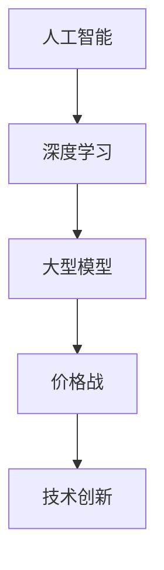

                 

关键词：贾扬清、价格战、大模型、人工智能、成本效益分析、技术发展、市场动态、实际应用。

> 摘要：随着人工智能技术的迅速发展，大型模型的训练和部署成本逐渐降低。本文将深入探讨贾扬清关于价格战的观点，分析大模型价格下降的趋势，并聚焦于这一现象背后的实际问题，以期为读者提供一个全面的理解。

## 1. 背景介绍

近年来，人工智能（AI）领域取得了令人瞩目的进展，尤其是在深度学习领域。随着计算能力的提升和算法的优化，大型神经网络模型的训练和部署成本显著下降。这一趋势不仅促进了AI技术的广泛应用，也引发了关于价格战的讨论。价格战在商业世界中并不鲜见，但其在AI领域的影响和意义却值得深入探讨。

贾扬清，作为一位人工智能领域的杰出专家，对价格战持有独到的观点。他认为，价格战在AI领域可能带来短期的市场繁荣，但长期来看，对技术创新和产业发展并无益处。本文将围绕贾扬清的观点，分析大模型价格下降的趋势，并探讨其背后的实际问题。

## 2. 核心概念与联系

为了更好地理解本文主题，我们首先需要明确一些核心概念，包括人工智能、深度学习、大型模型、价格战等。

### 2.1 人工智能（AI）

人工智能是指通过计算机模拟人类智能的技术和方法。它包括机器学习、深度学习、自然语言处理、计算机视觉等多个子领域。AI技术的目标是使计算机能够执行通常需要人类智能的任务。

### 2.2 深度学习（Deep Learning）

深度学习是AI领域的一个重要分支，通过多层神经网络进行学习，模仿人脑的神经结构。它取得了许多突破性的成果，如图像识别、语音识别、自然语言处理等。

### 2.3 大型模型（Large Models）

大型模型是指具有数十亿甚至数万亿参数的神经网络模型。这些模型通常需要大量的计算资源和时间进行训练，但它们在处理复杂任务时表现出色。

### 2.4 价格战（Price War）

价格战是指企业通过降低产品或服务的价格来吸引更多客户，以占领市场份额。在商业世界中，价格战可能带来短期的利益，但长期可能导致行业利润下降，影响技术创新。

### 2.5 核心概念原理和架构的 Mermaid 流程图



## 3. 核心算法原理 & 具体操作步骤

### 3.1 算法原理概述

大模型价格下降的背后，主要是计算能力的提升和算法的优化。具体来说，以下几个方面推动了这一趋势：

1. **计算能力的提升**：随着云计算和硬件技术的发展，计算资源的获取变得更加便捷和廉价。例如，GPU和TPU等专用硬件的普及，使得大规模并行计算成为可能。
2. **算法的优化**：通过改进训练算法和模型架构，可以减少训练时间和计算资源的需求。例如，注意力机制和Transformer架构的引入，显著提高了模型的效率和性能。
3. **开源和共享**：越来越多的开源工具和预训练模型被发布，降低了新模型的研发成本和时间。例如，TensorFlow和PyTorch等框架的普及，使得研究人员可以更轻松地构建和训练大型模型。

### 3.2 算法步骤详解

1. **数据收集与预处理**：收集大量标注数据，并进行清洗和预处理，如图像增强、数据归一化等。
2. **模型设计**：选择合适的模型架构，如VGG、ResNet等，并调整超参数，如学习率、批次大小等。
3. **模型训练**：使用GPU或TPU进行模型训练，优化损失函数和梯度计算。
4. **模型评估与优化**：通过交叉验证和测试集评估模型性能，并根据评估结果调整模型参数。
5. **模型部署**：将训练好的模型部署到生产环境，进行实际应用。

### 3.3 算法优缺点

#### 优点：

1. **高效性**：通过并行计算和优化算法，大大缩短了训练时间，提高了模型性能。
2. **灵活性**：开源工具和框架的普及，使得研究人员可以轻松地尝试和实现新的算法。
3. **经济性**：计算资源的成本下降，使得大型模型的研发和部署更加经济。

#### 缺点：

1. **资源需求**：尽管计算资源成本下降，但大型模型仍然需要大量的计算资源和存储空间。
2. **技术门槛**：构建和训练大型模型需要较高的技术知识和经验，不适合所有研究人员。
3. **数据依赖**：模型性能高度依赖于数据质量和数量，数据不足可能导致模型性能下降。

### 3.4 算法应用领域

大型模型在多个领域取得了显著成果，包括：

1. **计算机视觉**：图像识别、物体检测、图像生成等。
2. **自然语言处理**：文本分类、机器翻译、情感分析等。
3. **语音识别**：语音合成、语音识别、语音翻译等。
4. **推荐系统**：个性化推荐、广告投放等。

## 4. 数学模型和公式 & 详细讲解 & 举例说明

### 4.1 数学模型构建

大型模型的数学模型通常基于多层神经网络，其核心包括：

1. **激活函数**：如ReLU、Sigmoid、Tanh等。
2. **权重初始化**：如Xavier初始化、He初始化等。
3. **优化算法**：如梯度下降、Adam等。
4. **损失函数**：如交叉熵损失、均方误差等。

### 4.2 公式推导过程

以多层感知机（MLP）为例，其输出可以通过以下公式计算：

$$
Y = \sigma(W_2 \cdot \sigma(W_1 \cdot X + b_1) + b_2)
$$

其中，$Y$是输出层，$\sigma$是激活函数，$W_1$和$W_2$是权重矩阵，$b_1$和$b_2$是偏置项。

### 4.3 案例分析与讲解

以图像识别任务为例，我们可以使用卷积神经网络（CNN）进行模型构建。以下是一个简单的CNN模型架构：

1. **输入层**：接收图像数据。
2. **卷积层**：通过卷积操作提取图像特征。
3. **激活函数**：引入非线性变换。
4. **池化层**：降低数据维度，减少计算量。
5. **全连接层**：将特征映射到类别。
6. **输出层**：分类结果。

通过训练，我们可以得到一个能够准确识别图像的模型。以下是一个具体的训练过程：

```python
# 导入必要的库
import tensorflow as tf
from tensorflow.keras.models import Sequential
from tensorflow.keras.layers import Conv2D, MaxPooling2D, Flatten, Dense

# 构建模型
model = Sequential()
model.add(Conv2D(32, (3, 3), activation='relu', input_shape=(28, 28, 1)))
model.add(MaxPooling2D((2, 2)))
model.add(Conv2D(64, (3, 3), activation='relu'))
model.add(MaxPooling2D((2, 2)))
model.add(Flatten())
model.add(Dense(64, activation='relu'))
model.add(Dense(10, activation='softmax'))

# 编译模型
model.compile(optimizer='adam', loss='categorical_crossentropy', metrics=['accuracy'])

# 加载数据
(x_train, y_train), (x_test, y_test) = tf.keras.datasets.mnist.load_data()

# 预处理数据
x_train = x_train.reshape(-1, 28, 28, 1).astype('float32') / 255.0
x_test = x_test.reshape(-1, 28, 28, 1).astype('float32') / 255.0

# 转换标签为one-hot编码
y_train = tf.keras.utils.to_categorical(y_train, 10)
y_test = tf.keras.utils.to_categorical(y_test, 10)

# 训练模型
model.fit(x_train, y_train, epochs=10, batch_size=32, validation_split=0.2)
```

## 5. 项目实践：代码实例和详细解释说明

### 5.1 开发环境搭建

1. **安装Python**：确保Python版本为3.7及以上。
2. **安装TensorFlow**：使用pip安装TensorFlow库。

```bash
pip install tensorflow
```

### 5.2 源代码详细实现

以下是一个简单的图像识别项目的完整实现：

```python
# 导入必要的库
import tensorflow as tf
from tensorflow.keras.models import Sequential
from tensorflow.keras.layers import Conv2D, MaxPooling2D, Flatten, Dense

# 构建模型
model = Sequential()
model.add(Conv2D(32, (3, 3), activation='relu', input_shape=(28, 28, 1)))
model.add(MaxPooling2D((2, 2)))
model.add(Conv2D(64, (3, 3), activation='relu'))
model.add(MaxPooling2D((2, 2)))
model.add(Flatten())
model.add(Dense(64, activation='relu'))
model.add(Dense(10, activation='softmax'))

# 编译模型
model.compile(optimizer='adam', loss='categorical_crossentropy', metrics=['accuracy'])

# 加载数据
(x_train, y_train), (x_test, y_test) = tf.keras.datasets.mnist.load_data()

# 预处理数据
x_train = x_train.reshape(-1, 28, 28, 1).astype('float32') / 255.0
x_test = x_test.reshape(-1, 28, 28, 1).astype('float32') / 255.0

# 转换标签为one-hot编码
y_train = tf.keras.utils.to_categorical(y_train, 10)
y_test = tf.keras.utils.to_categorical(y_test, 10)

# 训练模型
model.fit(x_train, y_train, epochs=10, batch_size=32, validation_split=0.2)

# 评估模型
test_loss, test_acc = model.evaluate(x_test, y_test)
print('Test accuracy:', test_acc)
```

### 5.3 代码解读与分析

以上代码实现了使用卷积神经网络（CNN）进行手写数字识别的基本流程：

1. **模型构建**：定义一个序列模型，并添加卷积层、池化层、全连接层等。
2. **编译模型**：指定优化器、损失函数和评估指标。
3. **数据加载与预处理**：加载数据集，并进行归一化和one-hot编码处理。
4. **模型训练**：使用训练数据进行模型训练，并设置训练轮次和批次大小。
5. **模型评估**：使用测试数据评估模型性能。

## 6. 实际应用场景

大模型价格下降的趋势不仅影响了AI研究领域，也广泛应用于各个行业：

1. **金融**：使用AI模型进行风险评估、股票交易、欺诈检测等。
2. **医疗**：通过AI辅助诊断、药物研发、个性化治疗等。
3. **教育**：实现智能教育、个性化学习等。
4. **制造业**：实现智能生产、质量检测、设备维护等。

### 6.1 人工智能在金融领域的应用

在金融领域，AI技术的应用越来越广泛。以下是一些具体的应用案例：

1. **风险评估**：通过机器学习算法，对借款人的信用状况进行评估，降低贷款风险。
2. **股票交易**：使用AI模型进行市场预测，优化投资组合。
3. **欺诈检测**：通过监控交易行为，识别并预防欺诈行为。

### 6.2 人工智能在医疗领域的应用

在医疗领域，AI技术的应用极大地提升了医疗服务的质量和效率。以下是一些具体的应用案例：

1. **疾病诊断**：使用深度学习模型进行医学影像分析，辅助医生诊断。
2. **药物研发**：通过AI算法加速药物研发过程，降低研发成本。
3. **个性化治疗**：根据患者的病史和基因信息，制定个性化的治疗方案。

### 6.3 人工智能在制造业的应用

在制造业，AI技术的应用不仅提高了生产效率，还降低了成本。以下是一些具体的应用案例：

1. **智能生产**：通过AI算法优化生产流程，提高生产效率。
2. **质量检测**：使用机器视觉技术对产品进行质量检测，确保产品质量。
3. **设备维护**：通过监控设备运行状态，预测故障并进行预防性维护。

## 7. 未来应用展望

随着AI技术的不断发展，大模型价格下降的趋势预计将持续。未来，AI技术将在更多领域发挥重要作用：

1. **自动驾驶**：通过AI技术实现自动驾驶，提高交通安全和效率。
2. **智能家居**：智能家居系统将更加智能化，提供更舒适、便捷的生活体验。
3. **教育科技**：智能教育将更加普及，个性化教育将成为主流。

## 8. 工具和资源推荐

### 8.1 学习资源推荐

1. **在线课程**：Coursera、edX等平台上有很多优质的AI课程。
2. **书籍**：《深度学习》、《Python机器学习》、《机器学习实战》等。

### 8.2 开发工具推荐

1. **TensorFlow**：Google开发的深度学习框架。
2. **PyTorch**：Facebook开发的深度学习框架。
3. **Keras**：基于TensorFlow和Theano的高级神经网络API。

### 8.3 相关论文推荐

1. **"Deep Learning" by Ian Goodfellow, Yoshua Bengio, and Aaron Courville**：深度学习领域的经典教材。
2. **"Neural Network Learning: Theoretical Foundations" by H.S. Seung, M. Opper, and H. Sompolinsky**：关于神经网络理论的深入探讨。
3. **"Natural Language Processing with Python" by Steven Bird, Ewan Klein, and Edward Loper**：Python在自然语言处理领域的应用。

## 9. 总结：未来发展趋势与挑战

### 9.1 研究成果总结

本文从贾扬清的观点出发，探讨了AI领域的大模型价格下降趋势，分析了其背后的原因和影响。通过数学模型和具体案例，我们深入了解了AI技术的应用和挑战。

### 9.2 未来发展趋势

随着计算能力的提升和算法的优化，AI技术将继续发展，大模型价格下降趋势预计将持续。未来，AI将在更多领域发挥重要作用，推动社会进步。

### 9.3 面临的挑战

尽管AI技术发展迅速，但仍然面临一些挑战，包括数据隐私、算法偏见、安全性等问题。这些问题需要通过技术创新和政策法规的完善来解决。

### 9.4 研究展望

未来，AI领域的研究将更加深入，包括探索新的算法、优化模型架构、提升计算效率等。同时，跨学科的交叉融合也将为AI技术的发展提供新的动力。

## 10. 附录：常见问题与解答

### 10.1 什么是深度学习？

深度学习是机器学习的一个分支，通过多层神经网络进行学习，模仿人脑的神经结构。它在大规模数据集上取得了显著成果，广泛应用于图像识别、自然语言处理等领域。

### 10.2 大模型价格下降的原因是什么？

大模型价格下降主要是由于计算能力的提升、算法的优化以及开源工具和预训练模型的发展。这些因素共同降低了大模型研发和部署的成本。

### 10.3 大模型价格下降对产业发展有何影响？

大模型价格下降促进了AI技术的广泛应用，推动了产业创新和发展。但同时也带来了一些挑战，如数据隐私、算法偏见等。

### 10.4 如何评估一个深度学习模型的效果？

评估深度学习模型的效果通常通过交叉验证和测试集的准确率、召回率、F1值等指标来衡量。同时，也可以通过可视化工具分析模型输出，如混淆矩阵、ROC曲线等。

### 10.5 大模型训练需要哪些资源？

大模型训练通常需要大量的计算资源和存储空间。具体包括高性能GPU、TPU以及大规模的数据存储设备。此外，还需要配置合适的训练环境和调度系统。

## 11. 结论

本文通过深入探讨贾扬清关于大模型价格下降的观点，分析了其背后的原因和影响。我们总结了AI技术的核心概念和算法原理，并提供了具体的代码实例和实践经验。未来，随着AI技术的不断发展，我们有望看到更多创新和挑战。作者：禅与计算机程序设计艺术 / Zen and the Art of Computer Programming。

