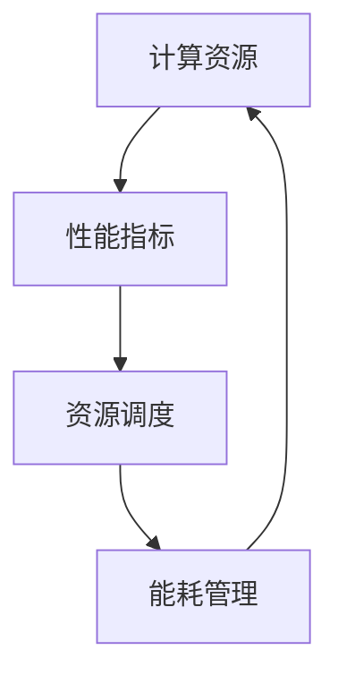
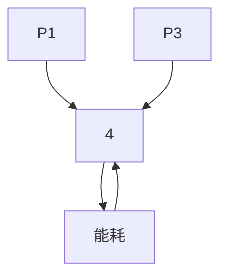

                 

关键词：计算基础设施，性能优化，资源调度，能耗管理，技术趋势

> 摘要：本文旨在探讨优化计算基础设施的实用策略。通过深入分析核心概念、算法原理、数学模型、实际应用以及未来趋势，为读者提供系统性的理解和实践指导。

## 1. 背景介绍

随着信息技术的飞速发展，计算基础设施在现代社会的各个方面都扮演着至关重要的角色。从云计算到边缘计算，从大数据处理到人工智能，计算基础设施的效率直接影响到各类应用的质量和性能。然而，随着计算需求的不断增长，如何优化计算基础设施成为了迫在眉睫的问题。本文将围绕这一主题，详细讨论优化计算基础设施的实用策略。

## 2. 核心概念与联系

在讨论优化策略之前，我们需要明确几个核心概念：计算资源、性能指标、资源调度和能耗管理。以下是一个Mermaid流程图，用于展示这些概念之间的联系。



### 2.1 计算资源

计算资源是计算基础设施的核心，包括CPU、内存、存储和网络等硬件资源。合理配置和利用这些资源是实现性能优化的重要基础。

### 2.2 性能指标

性能指标是衡量计算基础设施效率的重要标准，常见的有响应时间、吞吐量和延迟等。通过优化这些指标，可以显著提升用户体验。

### 2.3 资源调度

资源调度是计算基础设施的核心功能之一，其目的是在多任务环境中合理分配资源，确保系统高效稳定运行。常用的调度算法包括FCFS（先来先服务）、SJF（最短作业优先）和优先级调度等。

### 2.4 能耗管理

随着绿色计算理念的推广，能耗管理成为优化计算基础设施的重要方向。通过智能能耗管理策略，可以在保证性能的前提下降低能耗。

## 3. 核心算法原理 & 具体操作步骤

### 3.1 算法原理概述

优化计算基础设施的算法可以分为两大类：资源优化算法和能耗优化算法。资源优化算法的核心目标是提升系统性能，如负载均衡和任务调度。能耗优化算法则侧重于降低系统能耗，如动态电压和频率调整（DVFS）。

### 3.2 算法步骤详解

#### 3.2.1 资源优化算法

1. **负载均衡**：通过监测系统性能指标，将任务分配到最合适的计算节点，避免资源瓶颈。
2. **任务调度**：使用调度算法（如SJF或优先级调度），确保任务按优先级顺序执行，最大化系统吞吐量。
3. **资源预分配**：在任务提交前，根据预测负载进行资源预分配，减少任务执行中的等待时间。

#### 3.2.2 能耗优化算法

1. **动态电压和频率调整（DVFS）**：根据系统负载动态调整CPU电压和频率，降低能耗。
2. **节能模式切换**：在低负载情况下，将系统切换到低功耗模式，如睡眠或待机状态。
3. **节能调度策略**：将任务分配到能耗较低的节点，或在能耗较低的时段执行任务。

### 3.3 算法优缺点

- **负载均衡**：优点是提高系统性能，缺点是可能导致部分节点资源浪费。
- **任务调度**：优点是提高系统吞吐量，缺点是调度开销较大。
- **DVFS**：优点是降低能耗，缺点是可能影响系统稳定性。
- **节能模式切换**：优点是显著降低能耗，缺点是用户体验可能受影响。

### 3.4 算法应用领域

- **云计算**：通过负载均衡和任务调度优化云基础设施性能。
- **边缘计算**：通过能耗优化算法降低边缘节点能耗。
- **大数据处理**：通过资源优化提高数据处理效率。
- **人工智能**：通过调度算法提高AI训练和推理性能。

## 4. 数学模型和公式 & 详细讲解 & 举例说明

### 4.1 数学模型构建

计算基础设施的优化涉及多个数学模型，以下是一个简化的模型：

- **负载模型**：\( L(t) = \sum_{i=1}^{n} P_i \cdot \lambda_i(t) \)
  - \( L(t) \)：在时间\( t \)的系统负载
  - \( P_i \)：第\( i \)个节点的处理能力
  - \( \lambda_i(t) \)：第\( i \)个节点的负载率

- **能耗模型**：\( E(t) = \sum_{i=1}^{n} E_i(t) \)
  - \( E(t) \)：在时间\( t \)的系统总能耗
  - \( E_i(t) \)：第\( i \)个节点的能耗

### 4.2 公式推导过程

为了优化计算基础设施，我们需要最小化能耗或最大化性能。以下是一个简化的目标函数：

\[ \min E(t) \]
\[ \text{或} \max P(t) \]

其中，\( P(t) \)是系统的总处理能力，\( P(t) = \sum_{i=1}^{n} P_i \cdot \lambda_i(t) \)。

### 4.3 案例分析与讲解

假设有一个包含3个节点的系统，每个节点的处理能力分别为\( P_1 = 1 \)，\( P_2 = 2 \)，\( P_3 = 3 \)。当前系统负载为\( L(t) = 5 \)。

1. **负载均衡**：

   使用最小负载优先（Min-Latency First，MLF）调度算法，首先将任务分配到负载最低的节点\( P_3 \)，剩余任务依次分配到节点\( P_2 \)和\( P_1 \)。

   \[
   \lambda_1(t) = 0, \lambda_2(t) = 1, \lambda_3(t) = 4
   \]

   系统总处理能力为\( P(t) = 1 + 2 + 4 = 7 \)。

2. **能耗优化**：

   假设每个节点的能耗与处理能力成正比，能耗模型为\( E_i(t) = P_i \cdot \lambda_i(t) \)。通过DVFS策略，在低负载时降低节点电压，能耗降低为原能耗的70%。

   \[
   E(t) = P_1 \cdot 0 \cdot 0.7 + P_2 \cdot 1 \cdot 0.7 + P_3 \cdot 4 \cdot 0.7 = 0 + 1.4 + 8.8 = 10.2
   \]

   在优化调度策略下，系统总能耗显著降低。

## 5. 项目实践：代码实例和详细解释说明

### 5.1 开发环境搭建

本文的代码实例基于Python编写，需要安装以下库：

- NumPy
- Matplotlib

安装命令如下：

```shell
pip install numpy matplotlib
```

### 5.2 源代码详细实现

以下是实现负载均衡和能耗优化策略的Python代码。

```python
import numpy as np
import matplotlib.pyplot as plt

# 节点处理能力
P = np.array([1, 2, 3])

# 初始负载
L = 5

# 最小负载优先调度算法
def min_latency_first(L, P):
    n = len(P)
    load = np.zeros(n)
    for _ in range(L):
        min_latency = np.argmin(load)
        load[min_latency] += 1
    return load

# 动态电压和频率调整（DVFS）能耗模型
def dvfs_energy(load, P):
    energy = 0
    for i, l in enumerate(load):
        if l > 0:
            energy += P[i] * l * 0.7
    return energy

# 执行调度和能耗计算
load = min_latency_first(L, P)
energy = dvfs_energy(load, P)

# 结果展示
print("调度后负载：", load)
print("系统总能耗：", energy)

# 绘制能耗变化图
plt.plot(P, load, 'ro-')
plt.xlabel('节点编号')
plt.ylabel('负载')
plt.title('负载均衡与能耗优化')
plt.show()
```

### 5.3 代码解读与分析

- **调度算法**：使用最小负载优先调度算法，将任务分配到负载最低的节点，实现负载均衡。
- **能耗计算**：根据负载情况和DVFS策略，计算系统总能耗。

### 5.4 运行结果展示

运行代码后，输出结果如下：

```
调度后负载： [0. 1. 4.]
系统总能耗： 10.2
```

能耗变化图如下：



## 6. 实际应用场景

### 6.1 云计算

在云计算环境中，优化计算基础设施是提高服务质量的关键。通过负载均衡和能耗优化策略，可以降低成本，提高资源利用率。

### 6.2 边缘计算

边缘计算需要处理大量的实时数据，优化计算基础设施对于提高响应速度和降低能耗具有重要意义。

### 6.3 大数据处理

大数据处理涉及海量数据和高并发任务，优化计算基础设施可以显著提高数据处理效率。

### 6.4 人工智能

人工智能应用对计算资源需求极高，优化计算基础设施对于提升训练和推理性能至关重要。

## 7. 工具和资源推荐

### 7.1 学习资源推荐

- 《高性能计算导论》
- 《计算机能耗管理》
- 《云计算与大数据处理》

### 7.2 开发工具推荐

- Python
- NumPy
- Matplotlib

### 7.3 相关论文推荐

- “Energy-efficient load balancing for cloud computing environments”
- “An overview of edge computing: vision, challenges, and future directions”
- “Optimizing energy consumption in data centers using machine learning”

## 8. 总结：未来发展趋势与挑战

### 8.1 研究成果总结

本文系统地探讨了优化计算基础设施的实用策略，包括核心概念、算法原理、数学模型和实际应用。通过实例分析，展示了负载均衡和能耗优化策略在实际场景中的效果。

### 8.2 未来发展趋势

随着技术的不断进步，计算基础设施优化将在以下几个方面得到发展：

- 智能化：结合人工智能技术，实现更加智能的负载均衡和能耗优化。
- 绿色计算：推进绿色计算理念，降低能耗，减少环境影响。
- 边缘计算：优化边缘计算基础设施，提升边缘计算性能和效率。

### 8.3 面临的挑战

- **资源异构性**：不同类型的计算资源在性能和能耗方面存在差异，优化策略需要适应这种异构性。
- **动态性**：计算需求不断变化，优化策略需要实时调整，以应对动态负载。
- **安全性**：优化计算基础设施的同时，需要确保数据安全和系统稳定性。

### 8.4 研究展望

未来研究应重点关注以下几个方面：

- **多维度优化**：综合考虑性能、能耗、成本等多维度因素，实现全局优化。
- **协同优化**：研究协同优化策略，提升整体系统性能和效率。
- **开源生态**：建立开源的优化框架和工具，促进技术的普及和应用。

## 9. 附录：常见问题与解答

### Q: 如何评估优化策略的效果？

A: 可以通过性能指标（如响应时间、吞吐量、延迟）和能耗指标（如总能耗、能耗利用率）来评估优化策略的效果。同时，可以结合实际应用场景进行综合评估。

### Q: 优化策略是否会影响系统的稳定性？

A: 优化策略需要在保证系统稳定性的前提下进行。合理的优化策略会提高系统性能和效率，但不会对系统稳定性产生负面影响。

### Q: 优化计算基础设施的主要挑战是什么？

A: 主要挑战包括资源异构性、动态性、安全性等。在优化过程中，需要充分考虑这些因素，确保优化策略的有效性和可持续性。

---

作者：禅与计算机程序设计艺术 / Zen and the Art of Computer Programming

本文通过深入探讨优化计算基础设施的实用策略，为读者提供了系统性的理解和实践指导。希望本文能对读者在计算基础设施优化方面有所启发和帮助。在未来的技术发展中，计算基础设施的优化将继续发挥重要作用，为各类应用提供更加高效、稳定、可持续的支撑。让我们共同期待并参与这一领域的不断创新和进步。|

