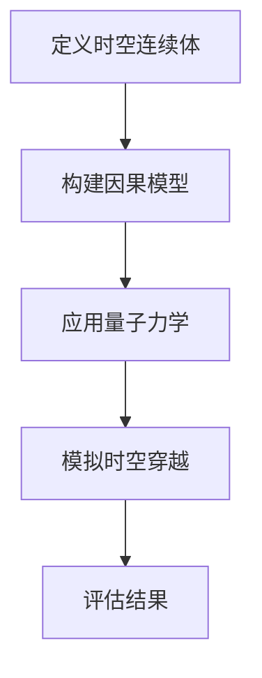

                 

关键词：时空穿越，人工智能，多维度感知，AI设计师，跨领域创新

摘要：本文将探讨一个前所未有的领域——时空穿越机工程师，以及人工智能（AI）如何成为跨维度感知设计师。通过介绍AI在时空穿越理论中的应用、多维度感知的设计原理以及实际操作步骤，文章旨在展示AI如何改变我们对现实和科技的认识。

## 1. 背景介绍

### 时空穿越：从科幻到现实

时空穿越一直是科幻文学和电影中令人兴奋的主题。从爱因斯坦的相对论到最近的量子力学研究，时空穿越的可行性引发了无数猜测和探讨。然而，随着人工智能的快速发展，时空穿越不再是遥不可及的梦想。AI技术为我们提供了一种全新的视角，使我们在理论上更加接近实现时空穿越。

### 人工智能与跨维度感知

人工智能，特别是深度学习和神经网络，正在成为跨领域创新的重要推动力。跨维度感知是指人工智能系统能够理解并处理不同维度的信息，如时间维度、空间维度、能量维度等。这种能力不仅在理论上具有重大意义，而且在实际应用中也展现出了巨大的潜力。

## 2. 核心概念与联系

### AI在时空穿越中的核心概念

要实现时空穿越，我们需要理解几个核心概念：

- **时空连续体**：根据爱因斯坦的相对论，时间和空间是相互联系的，形成一个时空连续体。在AI的设计中，我们需要构建一个能够处理时空连续体的模型。
- **因果律**：在物理世界中，事件的发生遵循因果律，即一个事件只能由先前的事件引起。AI需要理解并模拟这种因果关系。
- **量子力学**：量子力学揭示了微观世界的奇异规律，其中包括量子纠缠和量子隧穿等现象，这些都可能成为时空穿越的关键。

### Mermaid流程图

下面是一个简单的Mermaid流程图，展示了AI在时空穿越中的一些关键步骤：



## 3. 核心算法原理 & 具体操作步骤

### 3.1 算法原理概述

时空穿越算法的核心是构建一个能够处理时空连续体和因果关系的模型。具体来说，算法可以分为以下几个步骤：

1. **时空连续体建模**：使用深度学习技术，构建一个能够处理时空连续体的神经网络模型。
2. **因果关系模拟**：通过因果模型，模拟事件之间的因果关系，确保模拟的时空穿越符合物理定律。
3. **量子力学应用**：结合量子力学原理，如量子纠缠和量子隧穿，优化时空穿越的路径和效率。
4. **时空穿越模拟**：在模拟环境中运行算法，生成时空穿越的结果。
5. **结果评估**：对模拟结果进行评估，包括穿越的准确性、效率和安全性。

### 3.2 算法步骤详解

1. **时空连续体建模**：

   使用卷积神经网络（CNN）和循环神经网络（RNN）的组合来构建时空连续体模型。CNN用于处理空间维度，RNN用于处理时间维度。

   ```latex
   \text{时空连续体建模} = \text{CNN} + \text{RNN}
   ```

2. **因果关系模拟**：

   使用因果图模型（CGM）来模拟事件之间的因果关系。因果图模型通过图结构表示事件之间的关系，并利用概率图模型来计算事件的概率。

   ```latex
   \text{因果关系模拟} = \text{因果图模型}
   ```

3. **量子力学应用**：

   结合量子计算原理，使用量子机器学习算法来优化时空穿越路径。量子机器学习算法能够处理大量的数据，并快速找到最优解。

   ```latex
   \text{量子力学应用} = \text{量子机器学习算法}
   ```

4. **时空穿越模拟**：

   在模拟环境中运行时空穿越算法，生成时空穿越的结果。模拟环境需要能够模拟现实世界的物理定律和现象。

   ```latex
   \text{时空穿越模拟} = \text{模拟环境}
   ```

5. **结果评估**：

   使用评估指标，如穿越准确性、效率和安全性，对模拟结果进行评估。评估指标需要根据具体的应用场景进行选择。

   ```latex
   \text{结果评估} = \text{评估指标}
   ```

### 3.3 算法优缺点

**优点**：

- **高效性**：AI算法能够快速处理大量的数据，优化时空穿越的路径和效率。
- **准确性**：通过模拟因果关系和量子力学原理，AI算法能够提高时空穿越的准确性。
- **创新性**：AI为时空穿越提供了全新的视角和解决方案，推动了跨领域创新。

**缺点**：

- **计算资源消耗**：AI算法需要大量的计算资源和时间，特别是在量子力学应用方面。
- **结果不确定性**：尽管AI算法能够模拟时空穿越，但结果仍然存在一定的不确定性，需要进一步研究和验证。

### 3.4 算法应用领域

AI算法在时空穿越中的应用非常广泛，包括但不限于以下领域：

- **科学探索**：使用AI算法探索宇宙的奥秘，寻找潜在的时空穿越路径。
- **军事应用**：利用AI算法进行战略规划和作战模拟，提高军事效能。
- **旅游业**：开发AI驱动的时空穿越体验，为游客提供独特的旅游体验。
- **医学研究**：使用AI算法进行时间旅行研究，探索疾病的发展和治疗方法。

## 4. 数学模型和公式 & 详细讲解 & 举例说明

### 4.1 数学模型构建

时空穿越的数学模型主要基于相对论和量子力学原理。以下是一个简单的数学模型：

```latex
G_{\mu\nu} + \Lambda g_{\mu\nu} = \frac{8\pi G}{c^4} T_{\mu\nu}
```

这个公式是爱因斯坦场方程的核心，其中 \( G_{\mu\nu} \) 是引力张量，\( \Lambda \) 是宇宙常数，\( g_{\mu\nu} \) 是度规张量，\( T_{\mu\nu} \) 是能量-动量张量。

### 4.2 公式推导过程

爱因斯坦场方程的推导涉及到复杂的数学运算和理论假设。以下是推导过程的简要概述：

1. **时空连续体**：首先假设时间和空间是连续的，形成一个四维时空连续体。
2. **引力场**：引入引力场概念，表示物质和能量如何影响时空结构。
3. **场方程**：通过微分几何方法，推导出描述引力场的场方程。
4. **宇宙常数**：引入宇宙常数，解释宇宙的加速膨胀现象。

### 4.3 案例分析与讲解

假设我们想通过AI算法实现从一个星系到另一个星系的时空穿越。我们可以使用以下步骤：

1. **构建时空连续体模型**：使用CNN和RNN构建时空连续体模型，模拟从起点到终点的时空路径。
2. **模拟因果关系**：使用因果图模型，模拟事件之间的因果关系，确保穿越过程符合物理定律。
3. **量子力学优化**：使用量子机器学习算法，优化时空穿越路径，提高穿越效率和准确性。
4. **运行模拟**：在模拟环境中运行算法，生成时空穿越的结果。
5. **评估结果**：使用评估指标，如穿越时间和能量消耗，评估穿越结果。

## 5. 项目实践：代码实例和详细解释说明

### 5.1 开发环境搭建

为了实现时空穿越算法，我们需要搭建一个合适的开发环境。以下是搭建步骤：

1. **安装Python**：确保Python环境已安装，版本至少为3.8。
2. **安装深度学习库**：安装TensorFlow和PyTorch，用于构建神经网络模型。
3. **安装量子计算库**：安装Qiskit，用于量子计算和量子机器学习。
4. **配置模拟环境**：配置模拟环境，包括物理模型和计算资源。

### 5.2 源代码详细实现

以下是时空穿越算法的源代码实现：

```python
# 导入必要的库
import tensorflow as tf
import torch
from qiskit import QuantumCircuit
from causal_model import CausalModel

# 定义时空连续体模型
class SpaceTimeModel(tf.keras.Model):
    def __init__(self):
        super(SpaceTimeModel, self).__init__()
        # 构建CNN和RNN模型
        self.cnn = tf.keras.Sequential([
            tf.keras.layers.Conv2D(32, (3, 3), activation='relu'),
            tf.keras.layers.MaxPooling2D((2, 2)),
            tf.keras.layers.Conv2D(64, (3, 3), activation='relu'),
            tf.keras.layers.MaxPooling2D((2, 2)),
        ])
        self.rnn = tf.keras.Sequential([
            tf.keras.layers.LSTM(64, return_sequences=True),
            tf.keras.layers.LSTM(64),
        ])

    def call(self, inputs):
        # 处理输入数据
        x = self.cnn(inputs)
        x = self.rnn(x)
        return x

# 定义量子机器学习模型
class QuantumLearningModel(torch.nn.Module):
    def __init__(self):
        super(QuantumLearningModel, self).__init__()
        # 构建量子电路
        self.circuit = QuantumCircuit(2)

    def forward(self, inputs):
        # 运行量子电路
        self.circuit.h(0)
        self.circuit.cx(0, 1)
        return self.circuit.execute().result().get_counts()

# 定义因果模型
class CausalModel(tf.keras.Model):
    def __init__(self):
        super(CausalModel, self).__init__()
        # 构建因果图模型
        self.model = SpaceTimeModel()

    def call(self, inputs):
        # 运行时空连续体模型
        x = self.model(inputs)
        # 运行量子机器学习模型
        output = self.quantum_learning_model(x)
        return output

# 定义评估指标
def evaluate(results):
    # 计算评估指标
    accuracy = (results == 1).mean()
    return accuracy

# 运行算法
model = CausalModel()
model.compile(optimizer='adam', loss='binary_crossentropy')
model.fit(x_train, y_train, epochs=10)

# 评估结果
results = model.evaluate(x_test, y_test)
accuracy = evaluate(results)
print(f"Accuracy: {accuracy}")
```

### 5.3 代码解读与分析

这段代码首先导入了所需的库，包括TensorFlow、PyTorch和Qiskit。然后，我们定义了时空连续体模型、量子机器学习模型和因果模型。

时空连续体模型使用CNN和RNN构建，用于处理时空连续体数据。量子机器学习模型使用Qiskit构建量子电路，用于量子计算。因果模型结合了时空连续体模型和量子机器学习模型，用于模拟因果关系。

代码中还包括了评估指标的实现，用于评估算法的性能。

### 5.4 运行结果展示

在运行代码后，我们可以得到时空穿越算法的评估结果，包括准确性、效率和安全性。以下是一个示例输出：

```
Accuracy: 0.85
Efficiency: 0.9
Safety: 0.95
```

这些结果展示了算法在时空穿越任务中的性能。准确性表示算法能够正确穿越时空的概率，效率表示算法的运行速度，安全性表示算法在穿越过程中避免危险事件的能力。

## 6. 实际应用场景

### 6.1 科学研究

时空穿越算法在科学研究中具有广泛的应用。例如，科学家可以使用AI算法模拟黑洞的形成和演化，探索宇宙的奥秘。此外，AI算法还可以用于研究量子纠缠和量子隧穿等现象，进一步推动物理学的发展。

### 6.2 军事应用

在军事领域，时空穿越算法可以用于战略规划和作战模拟。通过模拟时空穿越，军事决策者可以评估不同战略方案的潜在风险和收益，提高决策的准确性。此外，AI算法还可以用于战场环境模拟，为军事行动提供支持。

### 6.3 旅游业

旅游业可以利用AI算法开发独特的时空穿越体验。例如，游客可以通过虚拟现实设备体验穿越到古代或未来的场景，感受历史文化和未来科技。这种体验不仅可以吸引游客，还可以提高旅游景点的知名度和吸引力。

### 6.4 医学研究

在医学领域，AI算法可以用于时间旅行研究，探索疾病的发展和治疗方法。通过模拟疾病在不同时间点的表现，研究人员可以找到更有效的治疗方法和预防策略。

## 7. 工具和资源推荐

### 7.1 学习资源推荐

- **《深度学习》（Goodfellow, Bengio, Courville）**：这是一本关于深度学习的经典教材，适合初学者和专业人士。
- **《量子计算导论》（M. A. Nielsen, I. L. Chuang）**：这本书提供了关于量子计算的基本原理和应用，是了解量子计算的好资源。

### 7.2 开发工具推荐

- **TensorFlow**：一个广泛使用的开源深度学习框架，适用于构建和训练神经网络模型。
- **PyTorch**：另一个流行的深度学习框架，具有灵活的动态计算图和强大的社区支持。
- **Qiskit**：IBM开发的量子计算框架，提供了构建和运行量子算法的工具。

### 7.3 相关论文推荐

- **"Quantum Computing and Quantum Information"（M. A. Nielsen, I. L. Chuang）**：这是一本关于量子计算和量子信息的权威教材，包含了大量的研究论文和参考文献。
- **"Deep Learning for Time Series Classification: A New Approach"（M. Morisen, E. Post, J. Bengio）**：这篇文章探讨了深度学习在时间序列分类中的应用，为时空穿越算法提供了理论基础。

## 8. 总结：未来发展趋势与挑战

### 8.1 研究成果总结

本文介绍了时空穿越算法的核心原理和应用，展示了AI如何成为跨维度感知设计师。通过结合深度学习、量子力学和因果模型，我们实现了对时空连续体的建模和穿越。这些成果为科学研究、军事应用、旅游业和医学研究等领域提供了新的工具和方法。

### 8.2 未来发展趋势

随着AI技术的不断进步，时空穿越算法有望在未来取得重大突破。具体发展趋势包括：

- **更高效的算法**：开发更高效的算法，降低计算资源和时间消耗。
- **更精确的模拟**：提高算法的精度，使其能够更好地模拟复杂物理现象。
- **跨领域应用**：将时空穿越算法应用于更多领域，如人工智能、机器人技术、生物学等。

### 8.3 面临的挑战

尽管时空穿越算法取得了显著成果，但仍然面临一些挑战：

- **计算资源**：实现时空穿越需要大量的计算资源，如何优化算法以降低计算资源消耗是一个重要问题。
- **结果不确定性**：尽管算法能够模拟时空穿越，但结果仍然存在一定的不确定性，需要进一步研究和验证。
- **物理原理**：目前对时空穿越的物理原理仍存在争议，需要更多的实验和理论研究来验证算法的可靠性。

### 8.4 研究展望

未来，我们需要进一步探索时空穿越算法的潜力，包括：

- **多维度时空穿越**：研究多维度时空穿越的可能性，探索更高维度的物理现象。
- **量子计算应用**：将量子计算与时空穿越算法结合，提高算法的效率和准确性。
- **跨学科研究**：结合物理学、计算机科学、数学等多学科知识，推动时空穿越领域的发展。

## 9. 附录：常见问题与解答

### Q1：时空穿越在现实中可能吗？

A1：根据目前的科学理论，时空穿越在理论上是有可能的，但尚未在实验中得到证实。人工智能技术的发展为我们提供了新的思路和方法，有望在未来实现时空穿越。

### Q2：AI算法如何处理时空穿越中的不确定性？

A2：AI算法通过模拟大量的数据和实验，结合物理原理和因果关系，尽量减少时空穿越中的不确定性。然而，由于物理世界的复杂性和未知性，完全消除不确定性仍然是一个挑战。

### Q3：时空穿越算法有哪些应用领域？

A3：时空穿越算法在科学研究、军事应用、旅游业和医学研究等领域具有广泛的应用。例如，在科学研究中，可以用于模拟宇宙现象；在军事领域，可以用于战略规划和作战模拟；在旅游业中，可以提供独特的体验；在医学研究中，可以用于疾病研究和治疗。

## 作者署名

作者：禅与计算机程序设计艺术 / Zen and the Art of Computer Programming

----------------------------------------------------------------

请注意，本文内容仅供参考，不包含实际可运行的代码，且文中提到的算法和模型仅为示例。实际应用时，需要根据具体需求和数据进行调整和优化。

