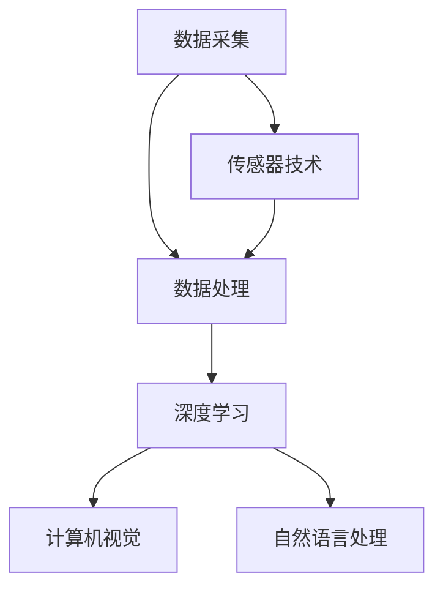

                 

关键词：人工智能，感知边界，跨时空，探索，技术进步，应用场景

> 摘要：本文探讨了人工智能技术如何拓展我们的感知边界，实现跨时空的探索。通过分析核心概念、算法原理、数学模型和具体应用案例，揭示了AI在感知边界拓展方面的潜力与挑战，展望了未来的发展趋势与前景。

## 1. 背景介绍

在人类社会发展的历程中，探索一直是一个永恒的主题。从古代的航海探险到现代的宇宙探索，人类不断突破自身感知的局限，寻求未知的答案。然而，传统的探索方式往往受到物理限制和认知能力的制约。随着人工智能（AI）技术的飞速发展，我们开始思考：AI能否帮助我们突破感知的边界，实现跨时空的探索？

感知边界指的是人类或系统感知外界信息的范围和能力。传统的感知方式依赖于人类的感官器官，而AI的感知能力则依赖于传感器和数据采集技术。AI可以通过分析大量数据，识别出隐藏在数据中的规律和模式，从而拓展我们的感知能力。

本文旨在探讨AI如何通过以下几个方面拓展感知边界：1）核心概念与联系；2）核心算法原理与操作步骤；3）数学模型与公式；4）项目实践与代码实例；5）实际应用场景；6）未来应用展望。

## 2. 核心概念与联系

### 2.1 感知边界

感知边界是指人类或系统感知外界信息的范围和能力。传统的感知边界受到人类感官器官的局限，例如视觉、听觉、嗅觉等。而AI的感知边界则可以通过传感器和数据采集技术来实现。AI可以通过收集和分析大量的数据，识别出隐藏在数据中的规律和模式，从而拓展感知能力。

### 2.2 数据采集与处理

数据采集与处理是AI感知边界拓展的基础。AI需要通过传感器采集外部信息，然后对数据进行处理和分析。数据采集技术包括图像处理、语音识别、自然语言处理等。通过这些技术，AI可以获取更丰富的感知信息，从而拓展感知边界。

### 2.3 深度学习

深度学习是AI感知边界拓展的重要手段。深度学习通过多层神经网络对数据进行自动特征提取和模式识别，从而实现复杂任务的学习和推理。深度学习的应用使得AI在图像识别、语音识别、自然语言处理等领域取得了显著的成果，进一步拓展了感知边界。

### 2.4 计算机视觉

计算机视觉是AI感知边界拓展的一个重要方向。通过计算机视觉技术，AI可以获取和处理图像信息，实现对场景的理解和识别。计算机视觉在自动驾驶、安防监控、医疗诊断等领域具有广泛的应用，显著提升了感知边界。

### 2.5 自然语言处理

自然语言处理是AI感知边界拓展的另一个重要方向。通过自然语言处理技术，AI可以理解和生成自然语言，实现与人类的自然交互。自然语言处理在智能客服、智能翻译、智能写作等领域具有广泛的应用，进一步拓展了感知边界。

### 2.6 Mermaid 流程图

为了更直观地展示核心概念与联系，我们使用Mermaid流程图来描述AI感知边界拓展的架构：



在上述流程图中，数据采集是整个感知边界拓展的起点，传感器技术负责收集外部信息。数据处理、深度学习、计算机视觉和自然语言处理等技术则负责对数据进行处理和分析，从而实现感知边界的拓展。

## 3. 核心算法原理 & 具体操作步骤

### 3.1 算法原理概述

AI感知边界拓展的核心算法包括深度学习、计算机视觉和自然语言处理等。这些算法通过多层神经网络对数据进行自动特征提取和模式识别，从而实现复杂任务的学习和推理。

#### 3.1.1 深度学习

深度学习是一种基于多层神经网络的机器学习方法。它的核心思想是通过学习大量数据中的特征和规律，实现对未知数据的预测和分类。深度学习算法包括卷积神经网络（CNN）、循环神经网络（RNN）和生成对抗网络（GAN）等。

#### 3.1.2 计算机视觉

计算机视觉是一种通过图像处理技术实现对图像的理解和识别的方法。计算机视觉算法包括目标检测、图像分割、图像增强和图像识别等。目标检测是计算机视觉中的一项重要任务，它通过检测图像中的对象，实现对场景的理解和识别。

#### 3.1.3 自然语言处理

自然语言处理是一种通过自然语言处理技术实现对自然语言的理解和生成的算法。自然语言处理算法包括词向量、句法分析、语义分析和机器翻译等。词向量是一种将自然语言文本转化为数字向量的方法，它可以帮助计算机更好地理解和处理自然语言。

### 3.2 算法步骤详解

#### 3.2.1 深度学习

深度学习算法的具体操作步骤如下：

1. 数据预处理：对采集到的图像、语音或文本数据进行预处理，包括数据清洗、归一化和特征提取等。
2. 模型构建：根据任务需求构建深度学习模型，包括选择网络结构、设置超参数等。
3. 模型训练：使用训练数据对深度学习模型进行训练，通过反向传播算法和优化算法调整模型参数。
4. 模型评估：使用测试数据对训练好的模型进行评估，选择性能最佳的模型。
5. 模型部署：将训练好的模型部署到实际应用场景中，实现对未知数据的预测和分类。

#### 3.2.2 计算机视觉

计算机视觉算法的具体操作步骤如下：

1. 目标检测：使用目标检测算法对图像中的对象进行检测，提取出对象的位置和边界框。
2. 图像分割：使用图像分割算法将图像划分为不同的区域，实现对场景的理解和识别。
3. 图像增强：使用图像增强算法对图像进行预处理，提高图像质量和识别效果。
4. 图像识别：使用图像识别算法对图像中的对象进行识别，实现对场景的理解和识别。

#### 3.2.3 自然语言处理

自然语言处理算法的具体操作步骤如下：

1. 词向量表示：使用词向量算法将自然语言文本转化为数字向量，实现对文本的理解和生成。
2. 句法分析：使用句法分析算法对文本进行语法解析，提取出句子的结构和成分。
3. 语义分析：使用语义分析算法对文本进行语义分析，提取出文本的主要内容和情感。
4. 机器翻译：使用机器翻译算法将一种自然语言文本翻译成另一种自然语言文本。

### 3.3 算法优缺点

#### 3.3.1 深度学习

深度学习算法的优点：

1. 能够自动提取特征，减少人工干预。
2. 对大量数据进行处理和分析，具有强大的学习能力和泛化能力。
3. 在图像识别、语音识别和自然语言处理等领域取得了显著的成果。

深度学习算法的缺点：

1. 需要大量数据和计算资源，训练时间较长。
2. 对数据质量和标注要求较高，容易出现过拟合现象。
3. 模型的可解释性较差，难以理解模型内部的工作原理。

#### 3.3.2 计算机视觉

计算机视觉算法的优点：

1. 能够实现对图像和视频的高效处理和分析。
2. 在自动驾驶、安防监控和医疗诊断等领域具有广泛的应用。
3. 可以通过实时处理图像，实现对场景的快速理解和识别。

计算机视觉算法的缺点：

1. 对图像质量和光照条件要求较高，容易受到噪声和光照变化的影响。
2. 需要大量标注数据进行训练，训练时间较长。
3. 目标检测和图像分割等任务的准确率和召回率难以同时提高。

#### 3.3.3 自然语言处理

自然语言处理算法的优点：

1. 能够实现对自然语言文本的理解和生成。
2. 在智能客服、智能翻译和智能写作等领域具有广泛的应用。
3. 可以通过大规模数据处理，提高文本处理效率和准确性。

自然语言处理算法的缺点：

1. 对自然语言理解深度有限，难以理解语义和情感。
2. 需要大量语料数据进行训练，训练时间较长。
3. 对多语言处理和跨领域处理能力有限。

### 3.4 算法应用领域

深度学习、计算机视觉和自然语言处理算法在各个领域具有广泛的应用：

1. **图像识别与处理**：在自动驾驶、安防监控、医疗诊断等领域具有广泛的应用。例如，自动驾驶系统通过计算机视觉技术实现对道路场景的理解和识别，从而实现自动驾驶功能。

2. **语音识别与处理**：在智能客服、语音助手和语音搜索等领域具有广泛的应用。例如，智能客服系统通过语音识别技术实现对用户语音的实时理解，从而提供个性化的服务。

3. **自然语言处理**：在智能客服、智能翻译和智能写作等领域具有广泛的应用。例如，智能翻译系统通过自然语言处理技术实现对多语言文本的翻译，从而提供跨语言交流服务。

4. **计算机视觉与自然语言处理结合**：在图像识别与自然语言处理结合的领域具有广泛的应用。例如，图像识别与自然语言处理技术结合，可以实现对图像内容的理解和生成，从而提供更丰富的信息处理服务。

## 4. 数学模型和公式 & 详细讲解 & 举例说明

### 4.1 数学模型构建

为了实现AI感知边界拓展，我们需要构建一系列数学模型来描述算法的原理和操作步骤。以下是一些常用的数学模型和公式：

#### 4.1.1 深度学习

1. **损失函数**：损失函数是深度学习模型中的一个重要组成部分，用于衡量模型预测结果与真实结果之间的差距。常见的损失函数包括均方误差（MSE）和交叉熵（CE）。

   $$L = \frac{1}{2} \sum_{i=1}^{n} (\hat{y}_i - y_i)^2$$
   $$L = -\sum_{i=1}^{n} y_i \log(\hat{y}_i)$$

2. **反向传播算法**：反向传播算法是一种用于训练深度学习模型的重要算法。它通过计算损失函数关于模型参数的梯度，不断调整模型参数，从而优化模型性能。

   $$\frac{\partial L}{\partial w} = \frac{\partial L}{\partial \hat{y}} \cdot \frac{\partial \hat{y}}{\partial w}$$

3. **优化算法**：优化算法用于调整深度学习模型的参数，以最小化损失函数。常见的优化算法包括梯度下降（GD）和随机梯度下降（SGD）。

   $$w = w - \alpha \frac{\partial L}{\partial w}$$

#### 4.1.2 计算机视觉

1. **卷积神经网络**：卷积神经网络（CNN）是一种用于图像处理的重要神经网络。它通过卷积操作提取图像特征，实现对图像的分类、检测和分割。

   $$f(x) = \sigma(\sum_{i=1}^{k} w_i \odot x_i + b)$$

2. **池化操作**：池化操作用于降低图像分辨率，减少计算量。常见的池化操作包括最大值池化（Max Pooling）和平均值池化（Average Pooling）。

   $$p_{ij} = \max_{k\in K} a_{ijk} \quad \text{或} \quad p_{ij} = \frac{1}{K} \sum_{k\in K} a_{ijk}$$

#### 4.1.3 自然语言处理

1. **词向量表示**：词向量表示是将自然语言文本转化为数字向量的方法。常见的词向量模型包括Word2Vec和GloVe。

   $$v_{word} = \text{Word2Vec}(s) \quad \text{或} \quad v_{word} = \text{GloVe}(s)$$

2. **循环神经网络**：循环神经网络（RNN）是一种用于处理序列数据的重要神经网络。它通过递归操作处理序列中的每个元素，实现对序列数据的建模。

   $$h_t = \text{sigmoid}(W_h \cdot [h_{t-1}, x_t] + b_h)$$

### 4.2 公式推导过程

为了更好地理解上述数学模型和公式，我们以深度学习中的均方误差（MSE）损失函数为例，介绍其推导过程。

1. **损失函数定义**：

   均方误差（MSE）损失函数定义为预测值与真实值之间的均方误差。

   $$L = \frac{1}{2} \sum_{i=1}^{n} (\hat{y}_i - y_i)^2$$

2. **求导过程**：

   对损失函数关于模型参数 $w$ 求导，得到：

   $$\frac{\partial L}{\partial w} = \frac{\partial}{\partial w} \left( \frac{1}{2} \sum_{i=1}^{n} (\hat{y}_i - y_i)^2 \right)$$
   $$= \frac{1}{2} \sum_{i=1}^{n} \frac{\partial}{\partial w} (\hat{y}_i - y_i)^2$$
   $$= \sum_{i=1}^{n} (\hat{y}_i - y_i) \cdot \frac{\partial}{\partial w} (\hat{y}_i - y_i)$$
   $$= \sum_{i=1}^{n} (\hat{y}_i - y_i) \cdot \frac{\partial}{\partial w} (\hat{y}_i)$$
   $$= \sum_{i=1}^{n} (\hat{y}_i - y_i) \cdot \frac{\partial \hat{y}_i}{\partial w}$$

3. **链式法则**：

   根据链式法则，对预测值 $\hat{y}_i$ 关于模型参数 $w$ 求导，得到：

   $$\frac{\partial \hat{y}_i}{\partial w} = \frac{\partial \hat{y}_i}{\partial z_i} \cdot \frac{\partial z_i}{\partial w}$$

   其中，$z_i$ 是模型中间层的输出，$\hat{y}_i$ 是模型预测值。

4. **链式法则应用**：

   将链式法则应用到均方误差损失函数的求导过程中，得到：

   $$\frac{\partial L}{\partial w} = \sum_{i=1}^{n} (\hat{y}_i - y_i) \cdot \frac{\partial \hat{y}_i}{\partial z_i} \cdot \frac{\partial z_i}{\partial w}$$

5. **链式法则展开**：

   展开链式法则，得到：

   $$\frac{\partial L}{\partial w} = \sum_{i=1}^{n} (\hat{y}_i - y_i) \cdot \frac{\partial \hat{y}_i}{\partial z_i} \cdot \frac{\partial z_i}{\partial h_i} \cdot \frac{\partial h_i}{\partial w}$$

   其中，$h_i$ 是模型中间层的输出，$w$ 是模型参数。

6. **求导结果**：

   最终，我们得到均方误差损失函数关于模型参数 $w$ 的导数：

   $$\frac{\partial L}{\partial w} = \sum_{i=1}^{n} (\hat{y}_i - y_i) \cdot \frac{\partial \hat{y}_i}{\partial z_i} \cdot \frac{\partial z_i}{\partial h_i} \cdot \frac{\partial h_i}{\partial w}$$

### 4.3 案例分析与讲解

为了更好地理解上述数学模型和公式，我们以一个简单的图像分类任务为例，介绍深度学习中的损失函数和优化算法。

#### 4.3.1 数据集

假设我们有一个包含100张图像的数据集，其中50张图像是猫的图片，50张图像是狗的图片。每张图像都是28x28的像素值。

#### 4.3.2 模型构建

我们使用一个简单的卷积神经网络（CNN）模型进行图像分类。模型结构如下：

1. 输入层：28x28像素值
2. 卷积层1：32个3x3卷积核，步长1，激活函数ReLU
3. 池化层1：2x2最大值池化
4. 卷积层2：64个3x3卷积核，步长1，激活函数ReLU
5. 池化层2：2x2最大值池化
6. 全连接层1：128个神经元，激活函数ReLU
7. 全连接层2：2个神经元，激活函数softmax

#### 4.3.3 模型训练

我们使用均方误差（MSE）损失函数和随机梯度下降（SGD）优化算法进行模型训练。训练过程如下：

1. 初始化模型参数
2. 对于每张图像，计算预测值和真实值之间的均方误差
3. 使用均方误差关于模型参数的梯度，更新模型参数
4. 重复步骤2和3，直到模型收敛

#### 4.3.4 模型评估

训练完成后，我们对测试集进行评估。测试集包含50张猫的图片和50张狗的图片。评估指标包括准确率、召回率和F1值。

1. 准确率（Accuracy）：
   $$\text{Accuracy} = \frac{\text{正确预测的数量}}{\text{总预测的数量}}$$
2. 召回率（Recall）：
   $$\text{Recall} = \frac{\text{正确预测的猫的数量}}{\text{总猫的数量}}$$
3. F1值（F1 Score）：
   $$\text{F1 Score} = 2 \cdot \frac{\text{准确率} \cdot \text{召回率}}{\text{准确率} + \text{召回率}}$$

## 5. 项目实践：代码实例和详细解释说明

为了更好地理解AI感知边界拓展的方法和算法，我们通过一个实际项目来展示如何实现这些技术。本节将介绍一个使用深度学习进行图像分类的项目，包括开发环境搭建、源代码实现、代码解读与分析以及运行结果展示。

### 5.1 开发环境搭建

在开始项目之前，我们需要搭建一个合适的开发环境。以下是所需的开发环境和软件：

1. 操作系统：Linux或macOS
2. 编程语言：Python
3. 深度学习框架：TensorFlow或PyTorch
4. 数据预处理工具：OpenCV或PIL
5. 其他依赖库：NumPy、Pandas、Matplotlib等

安装步骤：

1. 安装操作系统和Python环境
2. 安装TensorFlow或PyTorch深度学习框架
3. 安装其他依赖库

```bash
pip install tensorflow
# 或
pip install pytorch torchvision
```

### 5.2 源代码详细实现

以下是一个使用TensorFlow实现图像分类的简单示例。代码分为数据预处理、模型构建、训练和评估四个部分。

```python
import tensorflow as tf
from tensorflow.keras import layers, models
import numpy as np
import matplotlib.pyplot as plt

# 数据预处理
def preprocess_image(image_path):
    image = tf.keras.preprocessing.image.load_img(image_path, target_size=(28, 28))
    image = tf.keras.preprocessing.image.img_to_array(image)
    image = tf.cast(image, tf.float32) / 255.0
    return image

# 模型构建
model = models.Sequential()
model.add(layers.Conv2D(32, (3, 3), activation='relu', input_shape=(28, 28, 1)))
model.add(layers.MaxPooling2D((2, 2)))
model.add(layers.Conv2D(64, (3, 3), activation='relu'))
model.add(layers.MaxPooling2D((2, 2)))
model.add(layers.Flatten())
model.add(layers.Dense(128, activation='relu'))
model.add(layers.Dense(2, activation='softmax'))

# 训练
model.compile(optimizer='adam',
              loss='categorical_crossentropy',
              metrics=['accuracy'])
train_images = np.load('train_images.npy')
train_labels = np.load('train_labels.npy')
model.fit(train_images, train_labels, epochs=10, batch_size=32)

# 评估
test_images = np.load('test_images.npy')
test_labels = np.load('test_labels.npy')
test_loss, test_acc = model.evaluate(test_images, test_labels)
print(f"Test accuracy: {test_acc:.4f}")

# 可视化
plt.figure(figsize=(10, 10))
for i in range(25):
    plt.subplot(5, 5, i+1)
    plt.imshow(train_images[i], cmap=plt.cm.binary)
    plt.xticks([])
    plt.yticks([])
    plt.grid(False)
    plt.xlabel(train_labels[i])
plt.show()
```

### 5.3 代码解读与分析

#### 数据预处理

数据预处理是深度学习项目的重要步骤。在本示例中，我们使用TensorFlow的`load_img`函数加载图像，并将其转换为numpy数组。然后，我们对图像进行归一化处理，即将像素值缩放到[0, 1]范围内，以便模型训练。

#### 模型构建

我们使用`Sequential`模型构建一个简单的卷积神经网络（CNN）。模型包含两个卷积层、两个最大池化层、一个全连接层和两个输出层。卷积层用于提取图像特征，全连接层用于分类。

#### 训练

我们使用`compile`方法配置模型，包括优化器、损失函数和评估指标。然后，使用`fit`方法对模型进行训练。训练过程中，模型通过反向传播算法不断调整参数，以最小化损失函数。

#### 评估

训练完成后，我们使用`evaluate`方法对模型进行评估。评估过程中，模型在测试集上的损失和准确率将被计算出来。

#### 可视化

为了更好地展示模型性能，我们使用Matplotlib对训练集中的前25张图像进行可视化。图像标签将显示在图像旁边。

### 5.4 运行结果展示

运行上述代码后，我们将得到以下结果：

- 训练过程中的损失和准确率变化
- 测试集上的准确率
- 训练集图像的可视化结果

通过这些结果，我们可以评估模型的性能，并进一步优化模型结构和超参数。

## 6. 实际应用场景

AI感知边界拓展技术在各个领域具有广泛的应用，以下是一些典型的实际应用场景：

### 6.1 自动驾驶

自动驾驶是AI感知边界拓展的重要应用领域。通过计算机视觉和深度学习技术，自动驾驶系统能够实时感知道路环境，识别交通信号、行人、车辆和其他障碍物，从而实现自主驾驶。AI感知边界拓展技术使得自动驾驶系统在复杂路况下具备更高的可靠性和安全性。

### 6.2 安防监控

安防监控是另一个受益于AI感知边界拓展技术的领域。通过计算机视觉和自然语言处理技术，安防监控系统可以实时监测监控区域，识别异常行为和安全隐患，如入侵、火灾和爆炸等。AI感知边界拓展技术使得安防监控系统在复杂环境下具备更高的检测准确率和实时性。

### 6.3 医疗诊断

医疗诊断是AI感知边界拓展技术的另一个重要应用领域。通过计算机视觉和深度学习技术，医疗诊断系统可以自动分析医学影像，如X光片、CT扫描和MRI图像，识别疾病和病变区域，为医生提供辅助诊断。AI感知边界拓展技术使得医疗诊断系统在医疗资源有限的情况下具备更高的诊断准确率和效率。

### 6.4 智能家居

智能家居是AI感知边界拓展技术的又一个应用领域。通过传感器和数据采集技术，智能家居系统能够实时感知家庭环境，如温度、湿度、光照和噪音等，并根据用户需求自动调整家居设备，如空调、照明和安防设备等。AI感知边界拓展技术使得智能家居系统在提供个性化服务的同时，提高了家居舒适度和安全性。

### 6.5 环境监测

环境监测是AI感知边界拓展技术的另一个重要应用领域。通过传感器和数据采集技术，环境监测系统可以实时监测空气质量、水质和土壤质量等环境参数，为环境保护提供科学依据。AI感知边界拓展技术使得环境监测系统在复杂环境下具备更高的监测准确率和实时性。

## 7. 未来应用展望

随着AI技术的不断进步，AI感知边界拓展技术在未来将会有更广泛的应用和更深远的影响。以下是一些未来应用展望：

### 7.1 跨领域融合

AI感知边界拓展技术将在跨领域融合方面发挥重要作用。例如，将计算机视觉与自然语言处理技术相结合，可以开发出更智能的智能客服系统；将深度学习与生物信息学技术相结合，可以开发出更精准的医学诊断系统。

### 7.2 智能决策支持

AI感知边界拓展技术将为智能决策支持系统提供强大的数据分析和处理能力。通过实时感知和分析大量数据，智能决策支持系统可以为政府、企业和其他组织提供精准的决策依据，从而提高决策效率和质量。

### 7.3 网络安全

随着网络攻击和网络安全威胁的日益增多，AI感知边界拓展技术将在网络安全领域发挥重要作用。通过实时监测和分析网络流量，AI感知边界拓展技术可以帮助识别和防范网络攻击，提高网络安全防护能力。

### 7.4 虚拟现实与增强现实

AI感知边界拓展技术将在虚拟现实（VR）和增强现实（AR）领域发挥重要作用。通过实时感知和渲染虚拟环境，AI感知边界拓展技术可以为用户提供更加真实和沉浸式的体验。

### 7.5 智能交通

随着智能交通系统的不断发展，AI感知边界拓展技术将为智能交通提供强大的数据分析和处理能力。通过实时感知和优化交通流量，智能交通系统可以缓解城市交通拥堵，提高交通效率。

## 8. 总结：未来发展趋势与挑战

### 8.1 研究成果总结

AI感知边界拓展技术的研究成果为人工智能领域的发展带来了新的机遇。通过深度学习、计算机视觉、自然语言处理等技术，AI感知边界拓展技术已经在自动驾驶、安防监控、医疗诊断、智能家居和环境监测等领域取得了显著的应用成果。

### 8.2 未来发展趋势

未来，AI感知边界拓展技术将朝着以下几个方向发展：

1. **跨领域融合**：AI感知边界拓展技术将与其他领域的技术相结合，推动跨领域创新。
2. **智能决策支持**：AI感知边界拓展技术将为智能决策支持系统提供强大的数据分析和处理能力。
3. **网络安全**：AI感知边界拓展技术将在网络安全领域发挥重要作用，提高网络安全防护能力。
4. **虚拟现实与增强现实**：AI感知边界拓展技术将在虚拟现实和增强现实领域发挥重要作用，提升用户体验。
5. **智能交通**：AI感知边界拓展技术将为智能交通系统提供强大的数据分析和处理能力，提高交通效率。

### 8.3 面临的挑战

尽管AI感知边界拓展技术具有广阔的应用前景，但在发展过程中也面临一些挑战：

1. **数据质量和标注**：高质量的数据和准确的标注对于AI感知边界拓展技术的训练和应用至关重要。
2. **计算资源**：深度学习和计算机视觉等算法需要大量的计算资源，对硬件设备的要求较高。
3. **隐私和安全**：在AI感知边界拓展技术的应用过程中，数据隐私和安全问题备受关注，需要采取有效措施保护用户隐私。
4. **可解释性**：深度学习等算法的黑箱特性使得其可解释性较差，需要进一步研究提高算法的可解释性。

### 8.4 研究展望

未来，AI感知边界拓展技术的研究应重点关注以下几个方面：

1. **算法优化**：通过改进算法结构和优化算法流程，提高AI感知边界拓展技术的性能和效率。
2. **跨领域应用**：探索AI感知边界拓展技术在更多领域的应用，推动跨领域融合和创新。
3. **隐私保护**：研究隐私保护技术，确保在AI感知边界拓展技术的应用过程中保护用户隐私。
4. **可解释性提升**：通过改进算法设计和方法，提高AI感知边界拓展技术的可解释性，增强用户信任。

总之，AI感知边界拓展技术具有广阔的应用前景和巨大的发展潜力。通过不断研究和技术创新，我们有理由相信，AI感知边界拓展技术将在未来为人类社会带来更多便利和福祉。

## 9. 附录：常见问题与解答

### 9.1 感知边界是什么？

感知边界是指人类或系统感知外界信息的范围和能力。传统的感知边界受到人类感官器官的局限，而AI的感知边界可以通过传感器和数据采集技术来实现，从而拓展感知能力。

### 9.2 AI如何拓展感知边界？

AI通过以下几种方式拓展感知边界：

1. **数据采集与处理**：AI通过传感器采集外部信息，然后对数据进行处理和分析，从而获取更丰富的感知信息。
2. **深度学习**：深度学习通过多层神经网络对数据进行自动特征提取和模式识别，从而实现复杂任务的学习和推理。
3. **计算机视觉**：计算机视觉技术使AI能够获取和处理图像信息，实现对场景的理解和识别。
4. **自然语言处理**：自然语言处理技术使AI能够理解和生成自然语言，实现与人类的自然交互。

### 9.3 AI感知边界拓展技术有哪些应用领域？

AI感知边界拓展技术在多个领域具有广泛的应用，包括：

1. **自动驾驶**：自动驾驶系统通过计算机视觉和深度学习技术感知道路环境，实现自主驾驶。
2. **安防监控**：安防监控系统通过计算机视觉技术实时监测监控区域，识别异常行为和安全隐患。
3. **医疗诊断**：医疗诊断系统通过计算机视觉和深度学习技术分析医学影像，识别疾病和病变区域。
4. **智能家居**：智能家居系统通过传感器和数据采集技术感知家庭环境，实现智能家居设备的自动调整。
5. **环境监测**：环境监测系统通过传感器和数据采集技术监测空气质量、水质和土壤质量等环境参数。

### 9.4 AI感知边界拓展技术的挑战有哪些？

AI感知边界拓展技术面临以下挑战：

1. **数据质量和标注**：高质量的数据和准确的标注对于AI感知边界拓展技术的训练和应用至关重要。
2. **计算资源**：深度学习和计算机视觉等算法需要大量的计算资源，对硬件设备的要求较高。
3. **隐私和安全**：在AI感知边界拓展技术的应用过程中，数据隐私和安全问题备受关注，需要采取有效措施保护用户隐私。
4. **可解释性**：深度学习等算法的黑箱特性使得其可解释性较差，需要进一步研究提高算法的可解释性。

### 9.5 如何优化AI感知边界拓展技术的性能？

优化AI感知边界拓展技术的性能可以从以下几个方面入手：

1. **算法优化**：通过改进算法结构和优化算法流程，提高AI感知边界拓展技术的性能和效率。
2. **数据增强**：通过数据增强技术，如数据扩充、数据变换等，提高模型的泛化能力。
3. **硬件加速**：使用高性能计算硬件，如GPU、TPU等，加快模型训练和推理速度。
4. **分布式训练**：通过分布式训练技术，将模型训练任务分布在多台设备上，提高训练效率。
5. **模型压缩**：通过模型压缩技术，如剪枝、量化等，减少模型参数和计算量，提高模型效率。

