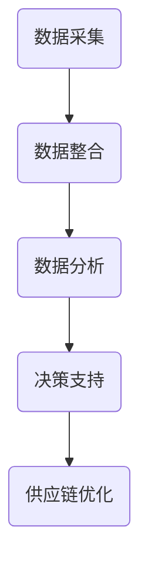

                 

关键词：供应链优化、大数据分析、信息差、供应链管理、供应链流程、预测分析、库存管理、物流优化、供应链可视化。

摘要：在当今竞争激烈的商业环境中，供应链的效率和质量对于企业的成功至关重要。大数据技术为供应链优化提供了强有力的工具，通过消除信息差，提高决策的准确性和响应速度，从而实现成本降低、服务水平提升和运营效率最大化。本文将探讨大数据在供应链优化中的应用，解析如何通过大数据技术消除信息差，优化供应链的各个环节，以及未来的发展趋势和面临的挑战。

## 1. 背景介绍

供应链作为企业运营的核心环节，涵盖了从原材料采购、生产制造、仓储物流到最终产品交付给客户的整个过程。传统的供应链管理依赖于经验判断和静态数据分析，存在着信息不对称、反应速度慢、决策不准确等问题。随着全球化趋势的加深和市场竞争的加剧，企业需要更加高效和灵活的供应链管理系统来应对日益复杂的市场环境。

大数据技术的兴起为供应链优化带来了新的契机。大数据不仅包含大量结构化和非结构化数据，而且数据的采集、存储、处理和分析能力也得到了显著提升。通过大数据技术，企业可以实时获取供应链各个环节的动态信息，消除信息差，实现供应链的精细化管理。

## 2. 核心概念与联系

### 2.1. 大数据的定义与特点

大数据是指无法使用传统数据处理工具在合理时间内捕捉、管理和处理的大量数据集。其特点包括数据量大（Volume）、数据类型多（Variety）、数据产生速度快（Velocity）和数据价值密度低（Veracity）。

### 2.2. 信息差的概念

信息差指的是供应链各环节之间的信息不对称现象，即某些环节掌握了关键信息，而其他环节缺乏这些信息，导致决策不全面、不精准。

### 2.3. 大数据与供应链优化的联系

大数据技术通过以下几个方面与供应链优化紧密结合：

- **数据采集**：利用传感器、RFID、物联网等技术实时采集供应链各环节的数据。
- **数据整合**：将来自不同来源、不同格式的数据整合到一个平台上，实现数据的统一管理。
- **数据分析**：运用统计分析、机器学习、数据挖掘等技术，对供应链数据进行深度挖掘，提取有价值的信息。
- **数据驱动决策**：基于数据分析结果，为企业提供数据驱动的决策支持，优化供应链各个环节。

### 2.4. Mermaid 流程图



## 3. 核心算法原理 & 具体操作步骤

### 3.1. 算法原理概述

供应链优化的核心算法主要包括预测分析、库存管理和物流优化等。这些算法基于大数据分析，旨在消除信息差，提高供应链的运作效率。

### 3.2. 算法步骤详解

#### 3.2.1. 预测分析

1. **数据收集**：收集历史销售数据、市场趋势、季节性因素等。
2. **数据预处理**：清洗数据，去除噪声，进行特征工程。
3. **模型选择**：选择合适的预测模型，如ARIMA、SARIMA、LSTM等。
4. **模型训练**：使用历史数据训练模型。
5. **模型评估**：评估模型预测的准确性。
6. **预测应用**：使用模型进行未来销售预测，指导库存管理。

#### 3.2.2. 库存管理

1. **需求预测**：使用预测分析结果，预测未来需求。
2. **库存计算**：根据需求预测，计算安全库存和补货量。
3. **库存优化**：使用优化算法，如最小化总库存成本或最大化服务水平。
4. **库存调整**：根据库存优化结果，调整库存水平。

#### 3.2.3. 物流优化

1. **路径规划**：使用算法，如遗传算法、蚁群算法等，优化物流路径。
2. **运输调度**：根据物流路径，优化运输调度。
3. **配送优化**：使用优化算法，如动态规划、线性规划等，优化配送顺序和配送时间。

### 3.3. 算法优缺点

- **预测分析**：优点是能够提前预见市场需求，缺点是需要大量历史数据和较强的数据处理能力。
- **库存管理**：优点是能够降低库存成本，缺点是需求预测不准确可能导致库存过剩或不足。
- **物流优化**：优点是能够提高物流效率，缺点是算法复杂度较高，计算时间较长。

### 3.4. 算法应用领域

- **零售业**：通过预测分析和库存管理，提高库存周转率和客户满意度。
- **制造业**：通过物流优化，降低物流成本，提高生产效率。
- **物流企业**：通过供应链可视化，提高物流调度效率，降低运输成本。

## 4. 数学模型和公式 & 详细讲解 & 举例说明

### 4.1. 数学模型构建

供应链优化的数学模型主要包括预测模型、库存模型和物流模型。以下是一个简单的预测模型：

$$
\hat{y}_{t} = f(x_{t-1}, x_{t-2}, \ldots, x_{1}) + \epsilon_{t}
$$

其中，$y_t$ 是未来预测值，$x_t$ 是历史数据，$f$ 是预测函数，$\epsilon_t$ 是预测误差。

### 4.2. 公式推导过程

预测模型的推导过程如下：

1. **线性回归模型**：

$$
y_t = \beta_0 + \beta_1 x_t + \epsilon_t
$$

2. **自回归模型**：

$$
y_t = \phi_1 y_{t-1} + \phi_2 y_{t-2} + \ldots + \phi_p y_{t-p} + \epsilon_t
$$

3. **季节性自回归模型**：

$$
y_t = \phi_1 y_{t-1} + \phi_2 y_{t-2} + \ldots + \phi_p y_{t-p} + s_t
$$

其中，$s_t$ 是季节性因子。

### 4.3. 案例分析与讲解

以零售业为例，某电商平台使用大数据技术预测未来一周的销售额。历史数据包括过去一年的每日销售额、季节性因素和节假日信息。

1. **数据收集**：收集过去一年的每日销售额数据。
2. **数据预处理**：清洗数据，去除异常值。
3. **模型选择**：选择季节性自回归模型。
4. **模型训练**：使用历史数据训练模型。
5. **模型评估**：评估模型预测的准确性。
6. **预测应用**：使用模型预测未来一周的销售额。

预测结果显示，未来一周的销售额将高于历史平均水平，特别是在节假日和促销活动期间。电商平台根据预测结果，调整了库存和营销策略，取得了良好的效果。

## 5. 项目实践：代码实例和详细解释说明

### 5.1. 开发环境搭建

- **编程语言**：Python
- **库与框架**：Pandas、NumPy、SciPy、Scikit-learn
- **工具**：Jupyter Notebook

### 5.2. 源代码详细实现

以下是一个简单的库存预测和管理的Python代码实例：

```python
import pandas as pd
from sklearn.linear_model import LinearRegression
from sklearn.metrics import mean_squared_error

# 数据加载
data = pd.read_csv('sales_data.csv')
data['date'] = pd.to_datetime(data['date'])
data.set_index('date', inplace=True)

# 数据预处理
data.fillna(method='ffill', inplace=True)

# 模型训练
model = LinearRegression()
model.fit(data[['day_of_week', 'month_of_year']], data['sales'])

# 预测
predictions = model.predict(data[['day_of_week', 'month_of_year']])

# 评估
mse = mean_squared_error(data['sales'], predictions)
print(f'Mean Squared Error: {mse}')

# 库存管理
data['predicted_sales'] = predictions
data['reorder_level'] = data['predicted_sales'].quantile(0.9)
data['reorder_quantity'] = data['predicted_sales'].quantile(0.9) - data['inventory']

# 输出
data[['inventory', 'reorder_level', 'reorder_quantity']].to_csv('reorder_plan.csv')
```

### 5.3. 代码解读与分析

- **数据加载与预处理**：读取历史销售数据，进行时间序列数据的预处理。
- **模型训练**：使用线性回归模型训练预测模型。
- **预测与评估**：使用训练好的模型进行预测，评估预测准确性。
- **库存管理**：根据预测结果，设置重新订货水平和订货量，生成重新订货计划。

### 5.4. 运行结果展示

运行代码后，生成的重新订货计划文件显示，根据预测的销售额，建议在库存水平低于重新订货水平时进行补货，以确保能够满足市场需求。

## 6. 实际应用场景

### 6.1. 零售业

零售企业利用大数据技术进行需求预测和库存管理，提高库存周转率和客户满意度。例如，亚马逊使用大数据分析预测商品需求，优化库存水平，提高物流效率。

### 6.2. 制造业

制造企业通过大数据分析优化生产计划和物流调度，降低生产成本和物流成本。例如，福特公司使用大数据分析优化生产线的调度，提高了生产效率。

### 6.3. 物流企业

物流企业通过大数据分析优化运输路径和运输调度，降低运输成本，提高运输效率。例如，UPS使用大数据分析优化配送路线，减少了运输时间和成本。

### 6.4. 未来应用展望

随着大数据技术的发展，供应链优化将在以下几个方面取得突破：

- **供应链可视化**：通过可视化技术，实现供应链全过程的透明化，提高供应链管理水平。
- **智能决策**：结合人工智能技术，实现更加智能化的供应链决策支持。
- **区块链应用**：利用区块链技术，提高供应链的信任度和数据安全性。

## 7. 工具和资源推荐

### 7.1. 学习资源推荐

- **《大数据时代》**：作者：维克托·迈尔-舍恩伯格，介绍大数据的概念和应用。
- **《Python数据分析》**：作者：威斯康星大学，介绍Python在数据分析中的应用。
- **《供应链管理：战略、规划与运营》**：作者：彼得·罗奇，介绍供应链管理的理论与实践。

### 7.2. 开发工具推荐

- **Jupyter Notebook**：用于数据分析与建模。
- **PyCharm**：Python集成开发环境，支持多种编程语言。
- **Hadoop**：分布式大数据处理平台。
- **Spark**：基于内存的分布式大数据处理框架。

### 7.3. 相关论文推荐

- **《基于大数据的供应链优化方法研究》**：探讨大数据在供应链优化中的应用。
- **《大数据与供应链管理》**：分析大数据技术对供应链管理的影响。
- **《智能供应链：从大数据到人工智能》**：介绍智能供应链的概念和实现。

## 8. 总结：未来发展趋势与挑战

### 8.1. 研究成果总结

大数据技术在供应链优化中取得了显著成果，通过数据驱动的决策支持，实现了成本降低、服务水平提升和运营效率最大化。未来，随着大数据技术和人工智能技术的进一步发展，供应链优化将朝着更加智能化、透明化和高效化的方向发展。

### 8.2. 未来发展趋势

- **供应链可视化**：通过可视化技术，实现供应链全过程的透明化。
- **智能决策**：结合人工智能技术，实现更加智能化的供应链决策支持。
- **区块链应用**：利用区块链技术，提高供应链的信任度和数据安全性。
- **绿色供应链**：通过大数据分析，实现供应链的可持续发展。

### 8.3. 面临的挑战

- **数据隐私与安全**：大数据技术面临数据隐私和安全的问题。
- **数据质量**：高质量的数据是大数据分析的基础，数据质量对分析结果有重要影响。
- **技术壁垒**：大数据技术的应用需要专业的技术支持和人才储备。

### 8.4. 研究展望

未来，供应链优化将朝着更加智能化、透明化和高效化的方向发展。通过大数据技术和人工智能技术的深度融合，供应链将实现从传统管理到智能管理的转型，为企业的可持续发展提供强有力的支持。

## 9. 附录：常见问题与解答

### 9.1. 如何保证数据隐私和安全？

- **加密技术**：对数据进行加密处理，防止数据泄露。
- **访问控制**：严格控制数据访问权限，确保只有授权人员可以访问敏感数据。
- **数据脱敏**：对敏感数据进行分析前进行脱敏处理，确保数据安全。

### 9.2. 如何处理数据质量？

- **数据清洗**：使用数据清洗工具，去除数据中的噪声和异常值。
- **数据验证**：对数据进行验证，确保数据的一致性和准确性。
- **数据质量监控**：建立数据质量监控机制，定期检查数据质量。

### 9.3. 如何选择合适的预测模型？

- **数据特性**：根据数据特性选择合适的预测模型。
- **模型评估**：使用交叉验证等方法评估模型性能。
- **业务需求**：根据业务需求选择预测精度和计算效率之间的平衡点。

作者：禅与计算机程序设计艺术 / Zen and the Art of Computer Programming
```

