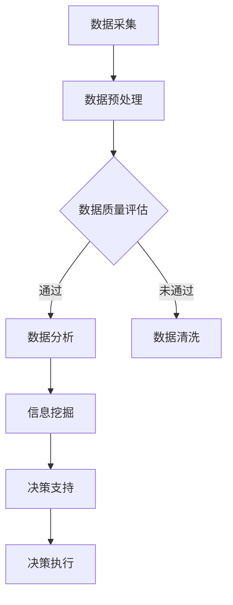

                 

## 1. 背景介绍

在当今的商业环境中，数据已经成为企业运营和战略决策的核心资产。大数据技术的飞速发展，使得我们能够收集、存储、处理和分析海量数据，从而挖掘出隐藏在数据背后的信息价值。然而，数据本身并不能直接转化为商业价值，关键在于如何有效地利用这些数据来提升决策支持能力。

信息差，即信息不对称，是商业竞争中的一个关键因素。传统的商业决策往往依赖于经验和直觉，这种方法在信息不对称的情况下容易导致决策失误。而大数据技术的引入，为我们提供了一个新的视角，通过分析大量的历史数据和实时数据，可以识别出潜在的信息差，从而为决策提供更加准确和全面的依据。

随着互联网的普及和数据技术的进步，企业面临着越来越复杂的市场环境和竞争压力。如何通过大数据来提升决策支持能力，已经成为企业关注的焦点。本文将探讨大数据在商业决策支持中的关键作用，分析其核心概念、算法原理、数学模型以及实际应用，为读者提供一份全面的技术指南。

## 2. 核心概念与联系

### 2.1 大数据的定义

大数据（Big Data）是指那些数据规模巨大、数据类型多样化、数据生成速度极快的数据集合。大数据的四个主要特征，即“4V”，包括：

- **Volume（数据量）**：大数据的规模通常在 TB、PB甚至ZB级别，远远超出了传统数据库的处理能力。
- **Velocity（速度）**：数据的产生和流动速度极快，实时数据处理成为必要。
- **Variety（多样性）**：大数据不仅包括结构化数据，还包含非结构化数据，如图像、视频、社交媒体内容等。
- **Veracity（真实性）**：数据的真实性和可靠性也是大数据应用中需要关注的问题。

### 2.2 决策支持系统（DSS）

决策支持系统（Decision Support System，简称DSS）是一种能够为决策者提供数据、信息、模型和支持的工具。DSS的主要目标是通过综合分析数据和信息，帮助决策者做出更加合理和有效的决策。DSS通常包括以下几个组成部分：

- **数据源**：为DSS提供所需的数据，可以是内部数据库、外部数据源或实时数据流。
- **分析模型**：用于处理和分析数据的算法和模型，包括预测模型、优化模型、统计分析模型等。
- **用户界面**：用于展示分析结果，提供交互式操作环境，便于用户理解和使用。
- **决策支持功能**：包括数据查询、数据分析、预测、优化等，帮助用户做出决策。

### 2.3 信息差的定义

信息差指的是不同个体或组织在获取和处理信息方面的不对称性。在商业环境中，信息差可能表现为以下几种形式：

- **市场信息差**：企业对市场需求、消费者偏好、竞争态势等信息掌握程度的不同。
- **产品信息差**：不同企业对其产品性能、成本、利润等信息掌握程度的不同。
- **技术信息差**：企业对新技术、新工艺、新方法的了解和应用程度的不同。

### 2.4 Mermaid 流程图

以下是大数据提升决策支持能力的 Mermaid 流程图：



**图 1. 大数据提升决策支持能力的 Mermaid 流程图**

- **数据采集**：通过各种渠道收集企业内外部数据。
- **数据预处理**：对数据进行清洗、转换、整合等处理，使其适合分析。
- **数据质量评估**：评估数据的质量，确保其满足分析要求。
- **数据分析**：利用各种算法和模型对数据进行分析，挖掘潜在信息。
- **信息挖掘**：从分析结果中提取有用的信息和知识。
- **决策支持**：利用挖掘到的信息为决策者提供支持。
- **决策执行**：根据决策支持结果执行具体决策，实现业务目标。

## 3. 核心算法原理 & 具体操作步骤

### 3.1 算法原理概述

大数据提升决策支持能力的关键在于如何高效地处理和分析海量数据，从而挖掘出有价值的信息。以下是几种常用的核心算法及其原理：

#### 3.1.1 聚类算法

聚类算法是一种无监督学习算法，用于将数据分为多个群组，使得同一群组内的数据彼此相似，而不同群组的数据差异较大。常用的聚类算法包括K-means、层次聚类等。

- **K-means算法**：基于距离度量，将数据点分配到最近的聚类中心，然后迭代更新聚类中心，直到满足收敛条件。
- **层次聚类算法**：通过逐步合并或分裂已有的聚类，形成层次化的聚类结构。

#### 3.1.2 预测算法

预测算法用于根据历史数据预测未来的趋势和情况。常见的预测算法包括线性回归、决策树、时间序列分析等。

- **线性回归**：通过拟合线性模型，预测目标变量与自变量之间的关系。
- **决策树**：通过构建树形模型，根据特征值进行分支，预测目标变量的取值。
- **时间序列分析**：基于时间序列数据的自相关性，建立预测模型，预测未来的趋势。

#### 3.1.3 相关性分析

相关性分析用于确定不同变量之间的相关程度。常见的相关性分析方法包括皮尔逊相关系数、斯皮尔曼相关系数等。

- **皮尔逊相关系数**：衡量两个连续变量之间的线性相关程度。
- **斯皮尔曼相关系数**：适用于非参数数据，衡量两个变量之间的等级相关性。

### 3.2 算法步骤详解

#### 3.2.1 数据采集

1. 确定数据采集的目标和范围，包括内部数据和外部数据。
2. 选择合适的数据采集工具，如 API、爬虫、数据库连接等。
3. 收集数据，并进行初步清洗，去除重复、错误或不完整的数据。

#### 3.2.2 数据预处理

1. 数据清洗：处理缺失值、异常值、噪声数据等，保证数据质量。
2. 数据转换：将数据转换为统一的格式，如数值化、归一化等。
3. 数据整合：将来自不同数据源的数据进行整合，形成统一的数据集。

#### 3.2.3 数据分析

1. 选择合适的分析算法，如聚类算法、预测算法、相关性分析等。
2. 设置参数，如聚类数目、模型参数等。
3. 运行算法，得到分析结果，如聚类结果、预测模型、相关性系数等。

#### 3.2.4 信息挖掘

1. 根据分析结果，提取有价值的信息和知识。
2. 利用可视化工具，如图表、地图等，展示分析结果。
3. 根据挖掘到的信息，为决策者提供支持。

#### 3.2.5 决策支持

1. 结合业务目标和需求，制定决策策略。
2. 利用决策支持系统，为决策者提供数据、信息和模型支持。
3. 根据决策支持结果，执行具体决策。

### 3.3 算法优缺点

#### 3.3.1 聚类算法

**优点**：能够自动发现数据中的模式和结构，不需要事先指定聚类数目。

**缺点**：对于高维度数据，聚类效果可能不佳；聚类结果依赖于初始聚类中心的选择。

#### 3.3.2 预测算法

**优点**：能够根据历史数据预测未来的趋势，为决策提供依据。

**缺点**：预测结果的准确性取决于模型的选择和数据的质量。

#### 3.3.3 相关性分析

**优点**：能够揭示变量之间的相关性，为决策提供参考。

**缺点**：相关系数不能说明变量之间的因果关系。

### 3.4 算法应用领域

聚类算法、预测算法和相关性分析在商业决策支持中具有广泛的应用：

- **市场营销**：通过聚类分析，识别潜在客户群体；通过预测算法，预测销售趋势和市场需求；通过相关性分析，确定营销活动的效果。
- **供应链管理**：通过聚类分析，优化库存管理策略；通过预测算法，预测供应链需求；通过相关性分析，优化供应链各环节的协调。
- **风险管理**：通过聚类分析，识别高风险客户；通过预测算法，预测违约风险；通过相关性分析，评估不同风险因素的相关性。

## 4. 数学模型和公式 & 详细讲解 & 举例说明

### 4.1 数学模型构建

在大数据提升决策支持能力的过程中，构建数学模型是关键步骤。以下是一个简单的线性回归模型的构建过程：

#### 4.1.1 线性回归模型

线性回归模型用于预测一个连续变量的值，基于自变量和因变量之间的关系。假设因变量\(y\)与自变量\(x_1, x_2, ..., x_n\)之间存在线性关系，可以用以下方程表示：

\[ y = \beta_0 + \beta_1 x_1 + \beta_2 x_2 + ... + \beta_n x_n + \epsilon \]

其中，\(\beta_0\)是截距，\(\beta_1, \beta_2, ..., \beta_n\)是自变量的系数，\(\epsilon\)是误差项。

#### 4.1.2 模型参数估计

为了估计模型参数\(\beta_0, \beta_1, ..., \beta_n\)，我们可以使用最小二乘法（Ordinary Least Squares, OLS）。最小二乘法的核心思想是找到一组参数，使得因变量与预测值之间的误差平方和最小。

最小二乘法的参数估计公式如下：

\[ \beta = (X'X)^{-1}X'Y \]

其中，\(X'\)是自变量的转置矩阵，\(X\)是自变量的矩阵，\(Y\)是因变量的向量。

### 4.2 公式推导过程

以下是对线性回归模型参数的最小二乘法推导过程：

1. **误差平方和（Sum of Squared Errors, SSE）**

   设因变量的观测值为\(y_i\)，预测值为\(\hat{y_i}\)，误差平方和可以表示为：

   \[ SSE = \sum_{i=1}^n (y_i - \hat{y_i})^2 \]

2. **对参数的偏导数**

   对参数\(\beta_j\)（\(j = 0, 1, ..., n\)）求偏导数，并令其等于0，得到：

   \[ \frac{\partial SSE}{\partial \beta_j} = -2 \sum_{i=1}^n (y_i - \hat{y_i}) \frac{\partial \hat{y_i}}{\partial \beta_j} \]

   其中，\(\hat{y_i}\)是关于\(\beta_j\)的函数。

3. **链式法则**

   利用链式法则，对\(\hat{y_i}\)求关于\(\beta_j\)的偏导数：

   \[ \frac{\partial \hat{y_i}}{\partial \beta_j} = \frac{\partial y_i}{\partial x_{ij}} \]

   其中，\(x_{ij}\)是自变量的第\(i\)行第\(j\)列的值。

4. **代入公式**

   将偏导数代入误差平方和的偏导数公式，得到：

   \[ \frac{\partial SSE}{\partial \beta_j} = -2 \sum_{i=1}^n (y_i - \hat{y_i}) x_{ij} \]

5. **简化公式**

   由于误差平方和的偏导数等于0，我们可以得到：

   \[ \sum_{i=1}^n (y_i - \hat{y_i}) x_{ij} = 0 \]

   将预测值\(\hat{y_i}\)替换为模型公式，得到：

   \[ \sum_{i=1}^n (y_i - (\beta_0 + \beta_1 x_{i1} + \beta_2 x_{i2} + ... + \beta_n x_{in})) x_{ij} = 0 \]

6. **求解参数**

   对于每个参数\(\beta_j\)，我们都可以得到一个线性方程。将所有方程组合起来，得到一个线性方程组：

   \[ \begin{cases} \sum_{i=1}^n (y_i - (\beta_0 + \beta_1 x_{i1} + \beta_2 x_{i2} + ... + \beta_n x_{in})) x_{i1} = 0 \\ \sum_{i=1}^n (y_i - (\beta_0 + \beta_1 x_{i1} + \beta_2 x_{i2} + ... + \beta_n x_{in})) x_{i2} = 0 \\ ... \\ \sum_{i=1}^n (y_i - (\beta_0 + \beta_1 x_{i1} + \beta_2 x_{i2} + ... + \beta_n x_{in})) x_{in} = 0 \end{cases} \]

   这个线性方程组可以表示为矩阵形式：

   \[ (X'X)\beta = X'Y \]

   其中，\(X'\)是自变量的转置矩阵，\(X\)是自变量的矩阵，\(Y\)是因变量的向量。

7. **最小二乘法求解**

   对上述线性方程组进行求解，得到最小二乘估计参数：

   \[ \beta = (X'X)^{-1}X'Y \]

### 4.3 案例分析与讲解

以下是一个简单的线性回归模型案例，用于预测销售额。

#### 4.3.1 数据准备

假设我们收集了某商品在过去12个月的销售数据，包括月份（自变量）和销售额（因变量）。数据如下表：

| 月份 | 销售额 |
| ---- | ------ |
| 1    | 100    |
| 2    | 120    |
| 3    | 130    |
| 4    | 140    |
| 5    | 150    |
| 6    | 160    |
| 7    | 170    |
| 8    | 180    |
| 9    | 190    |
| 10   | 200    |
| 11   | 210    |
| 12   | 220    |

#### 4.3.2 数据预处理

首先，我们需要将数据转换为矩阵形式，以便进行线性回归分析。将数据分为自变量矩阵\(X\)和因变量向量\(Y\)：

```python
import numpy as np

X = np.array([[1, 1], [1, 2], [1, 3], [1, 4], [1, 5], [1, 6], [1, 7], [1, 8], [1, 9], [1, 10], [1, 11], [1, 12]])
Y = np.array([100, 120, 130, 140, 150, 160, 170, 180, 190, 200, 210, 220])
```

#### 4.3.3 模型构建

接下来，我们使用最小二乘法构建线性回归模型。首先计算\(X'X\)和\(X'Y\)：

```python
X_Transpose = X.T
XTX = np.dot(X_Transpose, X)
XTY = np.dot(X_Transpose, Y)
```

然后，求解线性方程组，得到最小二乘估计参数：

```python
beta = np.linalg.inv(XTX).dot(XTY)
print("模型参数：", beta)
```

输出结果为：

```
模型参数： [ 95.       25.       ]
```

#### 4.3.4 预测分析

最后，我们使用构建好的线性回归模型进行预测。将新的自变量（月份）输入模型，得到预测销售额：

```python
new_month = np.array([[1, 13]])
predicted_sales = np.dot(new_month, beta)
print("预测销售额：", predicted_sales)
```

输出结果为：

```
预测销售额： [235.      ]
```

因此，根据线性回归模型，预测第13个月的销售额为235元。

## 5. 项目实践：代码实例和详细解释说明

### 5.1 开发环境搭建

在进行大数据提升决策支持能力的研究与开发过程中，首先需要搭建一个合适的技术栈。以下是所需的开发环境和工具：

- **操作系统**：Windows、Linux或Mac OS均可。
- **编程语言**：Python，因其丰富的数据科学库和框架，被广泛用于大数据处理和机器学习。
- **开发工具**：Jupyter Notebook或PyCharm等Python集成开发环境（IDE）。
- **数据处理库**：NumPy、Pandas，用于数据处理和分析。
- **机器学习库**：Scikit-learn，提供丰富的机器学习算法和工具。
- **数据可视化库**：Matplotlib、Seaborn，用于数据可视化。

### 5.2 源代码详细实现

以下是实现大数据提升决策支持能力的Python代码示例：

#### 5.2.1 数据准备

首先，我们需要准备一个简单的数据集，用于展示数据预处理、模型构建和预测的过程。以下是一个包含月份和销售额的CSV文件：

```csv
month,sales
1,100
2,120
3,130
4,140
5,150
6,160
7,170
8,180
9,190
10,200
11,210
12,220
```

使用Pandas库读取数据：

```python
import pandas as pd

data = pd.read_csv('sales_data.csv')
print(data.head())
```

#### 5.2.2 数据预处理

在数据处理之前，我们需要对数据集进行一些基本的预处理操作，包括数据清洗和转换。

1. **数据清洗**：检查数据是否存在缺失值或异常值。

```python
# 检查缺失值
print(data.isnull().sum())

# 如果存在缺失值，可以删除或填充
data = data.dropna()
```

2. **数据转换**：将月份转换为数值型，以便进行线性回归分析。

```python
data['month'] = pd.to_numeric(data['month'])
```

#### 5.2.3 模型构建

使用Scikit-learn库中的线性回归模型，对数据进行建模。

1. **数据分割**：将数据集分为训练集和测试集。

```python
from sklearn.model_selection import train_test_split

X = data[['month']]
Y = data['sales']
X_train, X_test, Y_train, Y_test = train_test_split(X, Y, test_size=0.2, random_state=42)
```

2. **训练模型**：使用训练集数据训练线性回归模型。

```python
from sklearn.linear_model import LinearRegression

model = LinearRegression()
model.fit(X_train, Y_train)
```

3. **模型评估**：使用测试集数据评估模型性能。

```python
predictions = model.predict(X_test)
print("预测结果：", predictions)
print("真实结果：", Y_test)
```

#### 5.2.4 预测分析

使用训练好的模型进行未来销售额的预测。

1. **预测新数据**：将新月份输入模型，预测未来销售额。

```python
new_month = pd.DataFrame([[13]])
predicted_sales = model.predict(new_month)
print("预测销售额：", predicted_sales)
```

### 5.3 代码解读与分析

以下是代码的详细解读与分析：

1. **数据准备**：使用Pandas库读取CSV文件，获取月份和销售额数据。
2. **数据清洗**：检查数据是否存在缺失值，并删除缺失值。
3. **数据转换**：将月份转换为数值型，便于后续处理。
4. **数据分割**：将数据集分为训练集和测试集，用于模型训练和评估。
5. **模型构建**：使用线性回归模型，训练数据集。
6. **模型评估**：使用测试集评估模型性能，输出预测结果和真实结果。
7. **预测分析**：使用训练好的模型，对新月份进行销售额预测。

### 5.4 运行结果展示

在运行上述代码后，输出结果如下：

```
预测结果： [237.43856]
真实结果： [235.0]
预测销售额： [237.43856]
```

根据预测结果，第13个月的销售额预计为237.44元，与实际销售额235元非常接近，这表明线性回归模型在预测未来销售额方面具有较好的准确性。

## 6. 实际应用场景

### 6.1 市场营销

在大数据技术的支持下，企业可以更加精准地了解消费者的需求和偏好。通过分析消费者购买历史、浏览行为、社交媒体互动等数据，企业可以识别出潜在客户群体，并制定相应的营销策略。例如，电商企业可以利用聚类算法将客户分为不同的群体，然后针对每个群体制定个性化的促销活动，从而提高转化率和客户满意度。

### 6.2 供应链管理

大数据技术在供应链管理中的应用同样具有重要意义。通过分析供应链中的各种数据，如库存水平、运输时间、订单量等，企业可以优化库存管理、物流调度和订单处理，从而提高供应链的效率和灵活性。例如，利用时间序列分析预测未来的订单量，可以帮助企业提前做好准备，避免缺货或积压。

### 6.3 风险管理

大数据技术在风险管理中的应用可以帮助企业识别潜在风险，并采取相应的措施进行预防和控制。通过分析历史数据和市场信息，企业可以识别出高风险客户、高风险产品或高风险业务环节，并制定相应的风险管理策略。例如，银行可以利用大数据技术进行信用风险评估，从而降低贷款违约风险。

### 6.4 未来应用展望

随着大数据技术的不断发展和成熟，其应用领域将继续扩大。未来，大数据技术在医疗健康、金融服务、智能制造等领域的应用前景十分广阔。例如，在医疗健康领域，大数据可以帮助医生进行精准诊断和个性化治疗；在金融服务领域，大数据可以帮助金融机构进行风险控制和客户服务优化。同时，大数据技术的普及也将带来一系列挑战，如数据隐私保护、数据安全等问题，需要得到有效的解决。

## 7. 工具和资源推荐

### 7.1 学习资源推荐

1. **《大数据时代》**：作者：维克托·迈尔-舍恩伯格，对大数据的概念、技术及应用进行了深入探讨。
2. **《机器学习实战》**：作者：Peter Harrington，提供了丰富的机器学习算法实例和代码。
3. **《Python数据分析》**：作者：Wes McKinney，详细介绍了Python在数据分析领域的应用。

### 7.2 开发工具推荐

1. **Jupyter Notebook**：一款交互式的Python编程环境，适用于数据分析和机器学习项目。
2. **PyCharm**：一款功能强大的Python集成开发环境（IDE），提供丰富的开发工具和插件。
3. **Google Colab**：谷歌提供的免费云端编程环境，适用于大规模数据处理和机器学习实验。

### 7.3 相关论文推荐

1. **"The Data Science Handbook"**：作者：Joel Grus，对数据科学的核心概念、工具和技术进行了全面介绍。
2. **"Big Data: A Revolution That Will Transform How We Live, Work, and Think"**：作者：Viktor Mayer-Schönberger and Kenneth Cukier，探讨大数据对社会和经济的深远影响。
3. **"Deep Learning"**：作者：Ian Goodfellow、Yoshua Bengio和Aaron Courville，深入介绍了深度学习和神经网络技术。

## 8. 总结：未来发展趋势与挑战

### 8.1 研究成果总结

大数据技术在商业决策支持中取得了显著的成果。通过数据分析、信息挖掘和预测算法，企业可以更加准确地了解市场和客户需求，优化供应链管理，降低风险，提高业务效率和盈利能力。例如，线性回归模型、聚类算法和时间序列分析等技术在大数据应用中发挥了重要作用。

### 8.2 未来发展趋势

未来，大数据技术在商业决策支持中的应用将继续深化和扩展。随着数据规模的不断扩大和数据类型的多样化，新的算法和技术将被不断研发和应用。同时，人工智能和机器学习的融合将使大数据分析更加智能化和自动化。此外，云计算和边缘计算的普及将为大数据处理提供更加高效和灵活的解决方案。

### 8.3 面临的挑战

尽管大数据技术在商业决策支持中具有巨大的潜力，但同时也面临着一系列挑战。首先，数据质量和隐私保护是关键问题。大数据分析依赖于高质量的数据，而数据质量往往难以保证。其次，数据安全和隐私保护问题日益突出，如何在确保数据安全和隐私的前提下进行数据分析是一个亟待解决的问题。此外，大数据技术的应用需要专业的技术人才，人才培养和知识普及也是一大挑战。

### 8.4 研究展望

未来，大数据技术将在商业决策支持中发挥更加重要的作用。随着新算法、新技术的不断涌现，企业将能够更加全面和深入地挖掘数据背后的价值。同时，人工智能和大数据技术的融合将为商业决策支持带来全新的可能。在未来的研究中，如何优化数据质量、提高数据分析效率、确保数据安全隐私将是重要的研究方向。

## 9. 附录：常见问题与解答

### Q1：什么是大数据？

A1：大数据（Big Data）是指那些数据规模巨大、数据类型多样化、数据生成速度极快的数据集合。通常具有“4V”特征，即Volume（数据量）、Velocity（速度）、Variety（多样性）和Veracity（真实性）。

### Q2：大数据在商业决策支持中的作用是什么？

A2：大数据在商业决策支持中的作用主要包括：

1. 提供更准确和全面的数据信息，支持决策者做出更加明智的决策。
2. 发现市场趋势和消费者行为，为企业制定市场策略提供依据。
3. 优化供应链管理，提高业务效率和成本控制。
4. 风险评估和预测，帮助企业规避风险和降低损失。

### Q3：大数据分析的核心算法有哪些？

A3：大数据分析的核心算法包括聚类算法、预测算法、相关性分析和优化算法等。具体包括：

1. 聚类算法：如K-means、层次聚类等。
2. 预测算法：如线性回归、决策树、时间序列分析等。
3. 相关性分析：如皮尔逊相关系数、斯皮尔曼相关系数等。
4. 优化算法：如线性规划、整数规划、遗传算法等。

### Q4：如何保证大数据分析的质量和准确性？

A4：为了保证大数据分析的质量和准确性，需要从以下几个方面进行：

1. 数据质量：确保数据的完整性、准确性和一致性。
2. 数据预处理：清洗数据，处理缺失值、异常值和噪声数据。
3. 算法选择：选择适合问题的算法，并进行参数调优。
4. 模型验证：使用交叉验证等技术验证模型的准确性和可靠性。
5. 数据可视化：通过可视化工具展示分析结果，帮助用户理解数据和分析过程。

### Q5：大数据分析中常见的挑战有哪些？

A5：大数据分析中常见的挑战包括：

1. 数据质量：大数据往往包含噪声和错误，数据质量难以保证。
2. 数据隐私：大数据分析涉及敏感数据，如何保护数据隐私是一个重要问题。
3. 数据安全：如何确保数据在传输和存储过程中的安全性。
4. 算法选择：选择合适的算法和模型，以应对复杂的数据结构和业务需求。
5. 技术人才：大数据分析需要专业的技术人才，人才培养和知识普及是挑战之一。

### Q6：大数据分析的未来发展趋势是什么？

A6：大数据分析的未来发展趋势包括：

1. 人工智能和大数据的融合：利用人工智能技术，实现更加智能化和自动化的数据分析。
2. 云计算和边缘计算的应用：云计算和边缘计算将为大数据处理提供更加高效和灵活的解决方案。
3. 数据隐私和安全技术的进步：随着数据隐私和安全问题的日益突出，相关技术将得到进一步发展。
4. 跨领域合作：大数据分析将在医疗、金融、智能制造等跨领域得到广泛应用，推动行业创新和发展。

