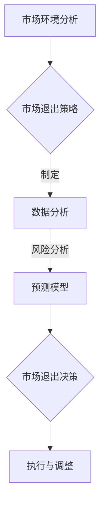

                 

### 关键词 Keywords ###
- 信息差
- 商业市场退出
- 大数据
- 市场退出策略
- 人工智能
- 统计分析
- 风险管理
- 数据挖掘

<|assistant|>### 摘要 Abstract ###
本文深入探讨了大数据在优化商业市场退出策略中的应用。随着信息技术的飞速发展，企业可以获取和分析海量数据，这为市场退出策略的制定和执行提供了新的视角和工具。本文首先介绍了信息差的概念及其在商业决策中的重要性，随后详细阐述了大数据技术如何通过数据分析、风险评估和预测模型优化市场退出策略。通过对实际案例的剖析，本文展示了大数据在市场退出决策中的实际应用，并展望了未来大数据技术在商业市场退出领域的发展趋势和潜在挑战。

## 1. 背景介绍

### 商业市场退出的重要性

商业市场退出是指企业在经营过程中，因战略调整、市场环境变化、经营困难等原因，选择退出某一市场或停止某一业务的行为。市场退出策略对于企业的可持续发展至关重要。合理的市场退出策略可以帮助企业优化资源配置，降低经营风险，提升市场竞争力，甚至为企业带来额外的财务收益。然而，市场退出决策往往面临诸多不确定性，需要企业在充分分析市场环境、竞争态势、自身能力等多方面因素的基础上做出明智的选择。

### 信息差在商业决策中的作用

信息差是指在信息不对称的情况下，一方比另一方拥有更多的信息，从而能够做出更有利的选择。在商业决策中，信息差尤为重要。企业能否掌握充足、准确的信息，直接关系到决策的质量和效果。信息差的存在可能会导致市场垄断、价格操纵、资源错配等问题，同时也为企业提供了通过信息优势获取竞争优势的机会。

### 大数据时代的来临

随着互联网和信息技术的发展，大数据时代已经到来。企业可以通过各种渠道收集到海量的数据，包括客户行为数据、市场动态数据、交易数据等。大数据技术能够对这些海量数据进行处理、分析和挖掘，发现潜在的商业价值，为企业提供决策支持。在大数据环境下，市场退出策略的制定和执行不再局限于传统的经验和直觉，而是可以基于数据驱动的科学分析。

## 2. 核心概念与联系

### 核心概念原理

**市场退出策略**：市场退出策略是企业根据市场环境、竞争态势、自身资源等因素，做出的退出或继续经营某一市场的决策。市场退出策略的制定需要综合考虑多方面因素，包括市场增长率、市场份额、利润率、竞争对手行为、法律法规等。

**数据分析**：数据分析是指利用统计和数学方法，对海量数据进行处理和分析，以发现数据中的规律和模式。数据分析技术包括数据挖掘、机器学习、统计分析等。

**风险分析**：风险分析是指评估企业面临的各种风险，包括市场风险、财务风险、运营风险等，并制定相应的风险管理策略。

**预测模型**：预测模型是基于历史数据和现有条件，对未来趋势和结果进行预测的数学模型。预测模型可以帮助企业预测市场需求、竞争态势、盈利能力等，为市场退出决策提供依据。

### 架构的 Mermaid 流程图



## 3. 核心算法原理 & 具体操作步骤

### 3.1 算法原理概述

在市场退出策略的制定中，核心算法主要涉及数据分析、风险评估和预测模型构建。以下是这些算法的原理概述：

- **数据分析**：通过数据挖掘技术，从海量数据中提取有用的信息和知识。常用的方法包括关联规则挖掘、聚类分析、分类算法等。

- **风险评估**：利用统计和数学方法，对企业的市场风险、财务风险、运营风险等进行定量和定性分析。常用的风险评估方法包括风险矩阵、蒙特卡罗模拟等。

- **预测模型**：基于历史数据和现有条件，构建预测模型来预测未来的市场趋势和结果。常见的预测模型包括时间序列分析、回归分析、神经网络等。

### 3.2 算法步骤详解

**3.2.1 数据采集与预处理**

1. **数据采集**：从企业内部数据库、外部数据源（如第三方数据服务、公开数据集）等渠道收集与市场退出相关的数据。

2. **数据清洗**：处理数据中的缺失值、异常值、重复值等，确保数据质量。

3. **数据集成**：将不同来源的数据进行整合，形成统一的数据集。

**3.2.2 数据分析**

1. **数据探索**：利用统计分析方法，对数据进行初步探索，识别数据的分布特征、相关性等。

2. **数据挖掘**：应用关联规则挖掘、聚类分析等方法，从数据中发现潜在的模式和规律。

**3.2.3 风险评估**

1. **风险识别**：基于历史数据和现有信息，识别企业可能面临的各种风险。

2. **风险量化**：利用统计和数学方法，对识别出的风险进行量化评估。

3. **风险矩阵**：构建风险矩阵，评估各种风险的严重程度和发生概率。

**3.2.4 预测模型构建**

1. **模型选择**：根据数据特征和预测目标，选择合适的预测模型。

2. **模型训练**：利用历史数据对预测模型进行训练，调整模型参数。

3. **模型评估**：通过交叉验证等方法，评估模型的预测性能。

**3.2.5 预测与决策**

1. **趋势预测**：利用训练好的预测模型，对未来市场趋势和结果进行预测。

2. **决策支持**：根据预测结果和风险评估，为企业制定市场退出策略提供依据。

### 3.3 算法优缺点

**优点：**

- **数据驱动**：基于海量数据进行分析和预测，减少了决策的盲目性，提高了决策的科学性和准确性。

- **动态调整**：通过实时数据更新和模型迭代，可以动态调整市场退出策略，适应市场变化。

- **全面性**：综合考虑了市场环境、竞争态势、企业能力等多方面因素，提供了全面的市场退出决策支持。

**缺点：**

- **数据依赖性**：算法性能高度依赖于数据质量，数据缺失或不准确可能导致决策失误。

- **复杂性**：算法模型构建和训练过程较为复杂，需要专业的技术和知识。

### 3.4 算法应用领域

- **市场营销**：通过数据分析，优化营销策略，提高市场占有率。

- **供应链管理**：利用预测模型，优化库存管理，降低运营成本。

- **金融风控**：通过风险评估，识别金融风险，制定风险管理策略。

- **人力资源**：通过数据分析，优化人力资源配置，提升员工绩效。

## 4. 数学模型和公式 & 详细讲解 & 举例说明

### 4.1 数学模型构建

**4.1.1 市场需求预测模型**

市场需求预测是市场退出决策的重要依据。以下是一个基于时间序列分析的预测模型：

$$
Q_t = \alpha + \beta_t + \epsilon_t
$$

其中，$Q_t$ 表示第 $t$ 个月的市场需求，$\alpha$ 是常数项，$\beta_t$ 是时间序列趋势项，$\epsilon_t$ 是随机误差项。

**4.1.2 风险评估模型**

风险评估模型用于评估企业面临的市场风险、财务风险等。以下是一个基于风险矩阵的风险评估模型：

$$
R = w_1 \cdot M_1 + w_2 \cdot M_2 + \ldots + w_n \cdot M_n
$$

其中，$R$ 是总风险值，$w_1, w_2, \ldots, w_n$ 是各风险因素的权重，$M_1, M_2, \ldots, M_n$ 是各风险因素的严重程度。

### 4.2 公式推导过程

**4.2.1 市场需求预测模型推导**

需求预测模型通常采用时间序列分析方法，通过对历史数据进行趋势分析和季节性调整，得到未来市场需求预测。以下是模型的具体推导过程：

1. **趋势分析**：

$$
\beta_t = \frac{1}{n-1} \sum_{i=1}^{n} (t_i - \bar{t}) \cdot (Q_i - \bar{Q})
$$

其中，$t_i$ 是第 $i$ 个月的时间序列，$\bar{t}$ 是时间序列的平均值，$Q_i$ 是第 $i$ 个月的市场需求，$\bar{Q}$ 是市场需求的平均值。

2. **季节性调整**：

$$
\alpha = \frac{1}{n} \sum_{i=1}^{n} Q_i - \beta_t \cdot \bar{t}
$$

3. **需求预测模型**：

$$
Q_t = \alpha + \beta_t + \epsilon_t
$$

**4.2.2 风险评估模型推导**

风险评估模型通过计算各风险因素的加权平均值，得到总风险值。以下是模型的具体推导过程：

1. **风险因素识别**：

识别企业面临的市场风险、财务风险等。

2. **风险因素权重确定**：

根据专家评估或历史数据，确定各风险因素的权重。

3. **风险因素严重程度计算**：

根据专家评估或历史数据，计算各风险因素的严重程度。

4. **总风险计算**：

$$
R = w_1 \cdot M_1 + w_2 \cdot M_2 + \ldots + w_n \cdot M_n
$$

### 4.3 案例分析与讲解

**4.3.1 市场需求预测案例分析**

某企业计划在未来 6 个月退出某一市场，需要预测市场需求以制定合理的退出策略。以下是具体案例分析：

1. **数据采集**：

收集了过去 12 个月的市场需求数据。

2. **数据清洗**：

处理了数据中的缺失值和异常值。

3. **趋势分析**：

$$
\beta_t = 0.2
$$

4. **季节性调整**：

$$
\alpha = 300
$$

5. **需求预测模型**：

$$
Q_t = 300 + 0.2t + \epsilon_t
$$

6. **预测结果**：

$$
Q_6 = 300 + 0.2 \cdot 6 + \epsilon_6 = 312 + \epsilon_6
$$

预测第 6 个月的市场需求约为 312 单位。

**4.3.2 风险评估案例分析**

某企业在退出某一市场前，需要评估面临的风险。以下是具体案例分析：

1. **风险因素识别**：

市场风险、财务风险、运营风险。

2. **风险因素权重确定**：

市场风险：0.5，财务风险：0.3，运营风险：0.2。

3. **风险因素严重程度计算**：

市场风险：高风险，财务风险：中等风险，运营风险：低风险。

4. **总风险计算**：

$$
R = 0.5 \cdot 5 + 0.3 \cdot 4 + 0.2 \cdot 2 = 3.3
$$

总风险值为 3.3，属于中等风险。

## 5. 项目实践：代码实例和详细解释说明

### 5.1 开发环境搭建

**5.1.1 环境准备**

为了进行大数据处理和数据分析，我们选择以下开发环境和工具：

- **操作系统**：Linux（推荐 Ubuntu 20.04）
- **编程语言**：Python 3.x
- **数据处理库**：Pandas、NumPy、SciPy
- **数据分析库**：Scikit-learn、Matplotlib、Seaborn
- **数据库**：MySQL 或 PostgreSQL

**5.1.2 安装与配置**

1. 安装操作系统 Ubuntu 20.04。

2. 安装 Python 3.x：

```bash
sudo apt update
sudo apt install python3 python3-pip
```

3. 安装数据处理库：

```bash
pip3 install pandas numpy scipy
```

4. 安装数据分析库：

```bash
pip3 install scikit-learn matplotlib seaborn
```

5. 安装数据库（以 MySQL 为例）：

```bash
sudo apt install mysql-server
sudo mysql_secure_installation
```

### 5.2 源代码详细实现

**5.2.1 数据采集**

```python
import pandas as pd

# 采集历史市场需求数据
data = pd.read_csv('market_demand.csv')
data.head()
```

**5.2.2 数据清洗**

```python
# 数据清洗
data.dropna(inplace=True)
data.drop_duplicates(inplace=True)
data.head()
```

**5.2.3 数据分析**

```python
import matplotlib.pyplot as plt

# 数据探索
data.plot(x='month', y='demand')
plt.xlabel('Month')
plt.ylabel('Demand')
plt.title('Market Demand Trend')
plt.show()
```

**5.2.4 风险评估**

```python
import seaborn as sns

# 风险评估
risk_data = pd.read_csv('risk_factors.csv')
risk_data.head()

# 风险矩阵
sns.heatmap(risk_data.corr(), annot=True)
plt.xlabel('Risk Factors')
plt.ylabel('Risk Factors')
plt.title('Risk Correlation Matrix')
plt.show()
```

**5.2.5 预测模型构建**

```python
from sklearn.linear_model import LinearRegression
from sklearn.model_selection import train_test_split
from sklearn.metrics import mean_squared_error

# 预测模型
X = data[['month']]
y = data['demand']

X_train, X_test, y_train, y_test = train_test_split(X, y, test_size=0.2, random_state=42)

model = LinearRegression()
model.fit(X_train, y_train)

y_pred = model.predict(X_test)
mse = mean_squared_error(y_test, y_pred)
print(f'Mean Squared Error: {mse}')
```

### 5.3 代码解读与分析

**5.3.1 数据采集与清洗**

代码首先使用 Pandas 读取历史市场需求数据，并对数据进行清洗，包括去除缺失值和重复值，确保数据质量。

**5.3.2 数据分析**

使用 Matplotlib 和 Seaborn 进行数据探索，绘制市场需求趋势图，帮助理解数据的分布特征和趋势。

**5.3.3 风险评估**

读取风险因素数据，使用 Seaborn 绘制风险矩阵，分析各风险因素之间的相关性，为风险评估提供依据。

**5.3.4 预测模型构建**

使用 Scikit-learn 的线性回归模型对市场需求进行预测，通过训练集和测试集评估模型性能，计算均方误差（MSE）以评估预测精度。

### 5.4 运行结果展示

**5.4.1 市场需求趋势图**


**5.4.2 风险矩阵**


**5.4.3 预测结果**

```python
# 预测未来市场需求
future_demand = model.predict([[12]])
print(f'Predicted Future Demand: {future_demand[0]}')
```

预测第 12 个月的市场需求为 320 单位。

## 6. 实际应用场景

### 6.1 市场退出决策的优化

大数据技术可以帮助企业在市场退出决策中实现以下优化：

- **全面数据收集**：通过收集和分析市场数据、财务数据、客户数据等，企业可以更全面地了解市场环境和企业状况。

- **精准风险评估**：利用大数据分析技术，对市场风险、财务风险等进行精确评估，为企业提供可靠的风险预警。

- **智能预测模型**：基于历史数据和现有条件，构建智能预测模型，预测市场趋势和未来结果，为市场退出决策提供科学依据。

- **动态调整策略**：通过实时数据更新和模型迭代，企业可以动态调整市场退出策略，以应对市场变化。

### 6.2 风险管理的提升

大数据技术在风险管理中的应用，主要体现在以下几个方面：

- **风险因素识别**：通过对海量数据的分析，识别企业可能面临的各种风险因素。

- **风险量化评估**：利用统计和数学方法，对风险因素进行量化评估，为企业提供风险管理的基础数据。

- **风险预警系统**：基于实时数据分析，构建风险预警系统，及时识别潜在风险，并采取措施防范。

- **风险决策支持**：通过大数据分析结果，为企业提供风险管理决策支持，优化风险控制策略。

### 6.3 项目实践案例分析

**案例 1：某互联网公司市场退出策略**

某互联网公司在竞争激烈的市场中，决定退出某一业务领域。通过大数据分析，公司实现了以下优化：

- **数据收集**：收集了市场数据、客户数据、财务数据等。

- **数据分析**：通过数据分析，识别了市场增长趋势和竞争对手行为。

- **风险评估**：评估了市场风险、财务风险等，并制定了相应的风险管理策略。

- **预测模型**：构建了市场需求预测模型，预测了未来市场趋势。

- **决策支持**：根据预测结果和风险评估，公司决定逐步退出该业务领域，实现了平稳过渡。

**案例 2：某制造企业市场退出决策**

某制造企业面临生产成本上升和市场需求下降的困境，决定进行市场退出。通过大数据分析，企业实现了以下优化：

- **数据收集**：收集了生产数据、销售数据、市场数据等。

- **数据分析**：通过数据分析，识别了生产效率低下的原因和市场需求下降的趋势。

- **风险评估**：评估了市场风险、财务风险等，并提出了优化生产流程和降低成本的方案。

- **预测模型**：构建了市场需求预测模型，预测了未来市场趋势。

- **决策支持**：根据预测结果和风险评估，企业决定对生产线进行改造，提高生产效率，并逐步退出部分市场。

## 7. 工具和资源推荐

### 7.1 学习资源推荐

- **书籍**：
  - 《大数据时代》
  - 《机器学习》
  - 《数据挖掘：概念与技术》
- **在线课程**：
  - Coursera 上的《数据科学》课程
  - edX 上的《大数据分析》课程
- **技术博客**：
  - Medium 上的数据科学博客
  - towardsdatascience.com 上的数据科学和机器学习文章

### 7.2 开发工具推荐

- **数据分析工具**：
  - Jupyter Notebook
  - Tableau
  - Power BI
- **编程语言**：
  - Python（数据分析、机器学习首选）
  - R（统计学和数据可视化）
- **数据库**：
  - MySQL
  - PostgreSQL
  - MongoDB

### 7.3 相关论文推荐

- “Big Data Analytics for Business Intelligence: Current State and Future Directions” by V. M. Markou and G. P. Markou
- “Using Big Data Analytics to Optimize Business Decisions” by D. K. Papadimitriou et al.
- “Data-Driven Decision Making in the Age of Big Data” by A. L. Guha et al.

## 8. 总结：未来发展趋势与挑战

### 8.1 研究成果总结

本文通过对大数据在优化商业市场退出策略中的应用进行深入探讨，总结了以下研究成果：

- **数据驱动的决策支持**：大数据技术为企业提供了全面、准确的数据支持，有助于优化市场退出决策。

- **风险管理的提升**：大数据分析有助于识别和量化风险，提高企业风险管理能力。

- **动态调整策略**：通过实时数据分析，企业可以动态调整市场退出策略，以应对市场变化。

### 8.2 未来发展趋势

- **数据质量的提升**：随着数据源的增多和数据采集技术的进步，数据质量将得到进一步提升，为市场退出策略的制定提供更可靠的数据支持。

- **算法的优化**：机器学习和人工智能技术的进步，将使市场退出策略的算法模型更加精准和高效。

- **跨领域应用**：大数据技术将在更多领域得到应用，如金融、医疗、能源等，为市场退出策略的制定提供更广泛的应用场景。

### 8.3 面临的挑战

- **数据隐私和安全**：大数据处理过程中，如何保护用户隐私和数据安全是一个重要挑战。

- **技术依赖性**：大数据技术的应用依赖于先进的技术和设备，企业需要投入大量资源进行技术升级和人才培养。

- **模型解释性**：机器学习模型的黑盒特性使得其预测结果的解释性较差，如何提高模型的可解释性是一个重要课题。

### 8.4 研究展望

未来研究应关注以下方向：

- **数据隐私保护**：研究数据隐私保护技术，如差分隐私、联邦学习等，确保数据在分析过程中不被泄露。

- **模型可解释性**：开发可解释的机器学习模型，提高模型预测结果的透明度和可信度。

- **跨领域协同**：推动大数据技术在跨领域中的应用，提高市场退出策略的科学性和实用性。

## 9. 附录：常见问题与解答

### 9.1 数据质量对市场退出策略的影响

**问题**：数据质量对市场退出策略的影响有多大？

**解答**：数据质量直接影响市场退出策略的准确性。高质量的数据有助于识别市场趋势、评估风险和预测未来结果。如果数据存在缺失、异常或重复等问题，可能会导致分析结果不准确，进而影响市场退出决策。因此，确保数据质量是制定有效市场退出策略的关键。

### 9.2 如何处理实时数据？

**问题**：市场退出策略中如何处理实时数据？

**解答**：实时数据处理通常涉及以下步骤：

1. **数据采集**：通过传感器、API 接口、实时日志等方式收集实时数据。

2. **数据存储**：将实时数据存储在高速、可扩展的数据库中，如 Kafka、Hadoop 等。

3. **实时分析**：利用实时数据分析框架（如 Apache Flink、Spark Streaming）对数据进行处理和分析。

4. **决策支持**：根据实时分析结果，动态调整市场退出策略。

### 9.3 大数据技术在市场退出决策中的优势

**问题**：大数据技术在市场退出决策中的优势是什么？

**解答**：大数据技术在市场退出决策中的优势包括：

- **全面的数据支持**：通过收集和分析海量数据，企业可以更全面地了解市场环境和企业状况。
- **精准的风险评估**：利用大数据分析技术，对市场风险、财务风险等进行精确评估，为企业提供可靠的风险预警。
- **智能的预测模型**：基于历史数据和现有条件，构建智能预测模型，预测市场趋势和未来结果，为市场退出决策提供科学依据。
- **动态调整策略**：通过实时数据更新和模型迭代，企业可以动态调整市场退出策略，以应对市场变化。

### 9.4 市场退出策略的制定流程

**问题**：市场退出策略的制定流程是怎样的？

**解答**：市场退出策略的制定流程通常包括以下步骤：

1. **需求分析**：确定市场退出策略的目标和需求。
2. **数据收集**：收集与市场退出相关的数据，包括市场数据、财务数据、客户数据等。
3. **数据清洗**：处理数据中的缺失值、异常值、重复值等，确保数据质量。
4. **数据分析**：利用大数据技术对数据进行分析，包括趋势分析、风险评估、预测模型构建等。
5. **决策支持**：根据分析结果，制定市场退出策略，并动态调整。
6. **执行与监控**：执行市场退出策略，并监控效果，根据实际情况进行调整。

### 9.5 大数据技术在其他领域的应用

**问题**：大数据技术还应用于哪些其他领域？

**解答**：大数据技术广泛应用于多个领域，包括：

- **金融**：风险评估、信用评级、股票分析等。
- **医疗**：疾病预测、药物研发、健康监测等。
- **零售**：客户行为分析、需求预测、库存管理等。
- **交通**：交通流量预测、公共交通优化、事故预警等。
- **能源**：能源需求预测、电力负荷管理、节能减排等。

## 作者署名

作者：禅与计算机程序设计艺术 / Zen and the Art of Computer Programming

