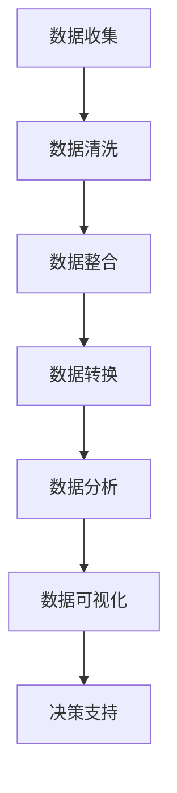

                 

## 1. 背景介绍

在现代商业环境中，市场竞争日益激烈，企业不仅需要关注自身的运营和产品，还必须时刻了解竞争对手的动态。信息差，即在商业决策过程中，不同主体对于信息的掌握程度和利用能力的差异，是企业成败的关键因素之一。通过对竞争对手的信息进行全面、深入的分析，企业可以掌握市场动态，制定更为精准的营销策略，甚至预判竞争对手的行动，抢占先机。

大数据技术的兴起，为商业竞争对手分析提供了强有力的支持。大数据处理和分析能力，使得企业可以从海量数据中提取有价值的信息，进而对市场趋势、竞争对手策略、消费者行为等进行深入洞察。本文将探讨如何利用大数据技术进行商业竞争对手分析，包括核心概念、算法原理、数学模型、项目实践等方面，旨在为企业提供一套完整、实用的分析框架。

## 2. 核心概念与联系

### 2.1 商业竞争对手分析的定义

商业竞争对手分析是指通过收集、处理和分析竞争对手的公开信息、行为数据等，以揭示其市场策略、竞争地位、资源分配等，从而为企业制定应对策略提供数据支持。

### 2.2 大数据技术的核心概念

- **数据源**：包括公开的社交媒体数据、商业报告、公司财报、行业新闻等。
- **数据处理**：通过数据清洗、整合、转换等步骤，将原始数据转化为可用于分析的形式。
- **数据分析**：利用统计分析、机器学习等方法，从数据中提取有价值的信息。
- **数据可视化**：通过图表、地图等形式，直观展示分析结果，便于理解和决策。

### 2.3 Mermaid 流程图



## 3. 核心算法原理 & 具体操作步骤

### 3.1 算法原理概述

商业竞争对手分析的核心在于提取和利用有价值的信息。这通常涉及以下算法：

- **文本挖掘**：从非结构化文本数据中提取关键词、主题、情感等信息。
- **关联规则挖掘**：发现数据之间的关联关系，用于揭示市场趋势和消费者偏好。
- **聚类分析**：将数据划分为若干个类，以识别潜在的竞争对手群体。
- **分类算法**：根据已有数据，对新的数据进行分类，以预测竞争对手的行为。

### 3.2 算法步骤详解

1. **数据收集**：
   - 通过网络爬虫、API接口、数据供应商等渠道收集竞争对手的公开信息。
   - 收集的数据类型包括社交媒体评论、新闻报道、公司财报、市场调研报告等。

2. **数据清洗**：
   - 去除重复数据、无效数据和噪声数据。
   - 处理数据缺失和异常值。
   - 标准化数据格式，如统一日期、货币单位等。

3. **数据整合**：
   - 将不同来源、不同格式的数据进行合并，形成统一的数据集。
   - 解决数据之间的冲突和矛盾。

4. **数据转换**：
   - 将原始数据转换为适用于分析的格式，如CSV、JSON等。
   - 进行数据降维，如使用PCA（主成分分析）减少数据维度。

5. **数据分析**：
   - 使用文本挖掘技术提取关键信息，如关键词、主题等。
   - 应用关联规则挖掘分析数据之间的关联关系。
   - 使用聚类分析识别竞争对手群体。
   - 使用分类算法预测竞争对手的行为。

6. **数据可视化**：
   - 使用图表、地图等形式展示分析结果。
   - 帮助决策者更直观地理解分析结果。

7. **决策支持**：
   - 根据分析结果，为企业制定市场策略提供数据支持。
   - 预测竞争对手的行动，为企业抢占市场先机。

### 3.3 算法优缺点

**优点**：

- **全面性**：大数据技术可以处理海量数据，提供全面的市场信息。
- **实时性**：可以实时监测市场动态，快速响应。
- **精确性**：通过算法分析，可以提取有价值的信息，提高决策的准确性。

**缺点**：

- **数据质量**：数据收集和处理过程中可能存在质量问题，影响分析结果。
- **计算成本**：大数据处理和分析需要大量的计算资源，成本较高。
- **隐私问题**：在收集和处理数据时，需要遵守相关法律法规，保护用户隐私。

### 3.4 算法应用领域

- **市场营销**：通过分析竞争对手的营销策略，优化自身的营销方案。
- **产品研发**：根据竞争对手的产品特点，调整产品设计和功能。
- **风险控制**：预测竞争对手的行动，避免市场风险。
- **投资决策**：通过分析竞争对手的财务数据，评估投资机会。

## 4. 数学模型和公式 & 详细讲解 & 举例说明

### 4.1 数学模型构建

商业竞争对手分析的数学模型通常涉及以下方面：

- **聚类分析模型**：如K-means算法、DBSCAN算法等。
- **分类算法模型**：如逻辑回归、支持向量机等。
- **关联规则挖掘模型**：如Apriori算法、FP-growth算法等。

### 4.2 公式推导过程

以K-means算法为例，其目标是最小化数据点与聚类中心之间的距离平方和。

目标函数：
\[ \text{Minimize} \sum_{i=1}^{n} \sum_{j=1}^{k} (x_{ij} - \mu_j)^2 \]

其中，\( x_{ij} \) 是数据点 \( x_i \) 到聚类中心 \( \mu_j \) 的距离，\( \mu_j \) 是聚类中心。

### 4.3 案例分析与讲解

假设我们有一组客户数据，我们需要将其分为两类：高价值客户和低价值客户。

1. **数据预处理**：
   - 收集客户数据，包括年龄、收入、购买历史等。
   - 处理缺失值和异常值。
   - 标准化数据。

2. **聚类分析**：
   - 使用K-means算法对数据点进行聚类。
   - 确定合适的聚类数量 \( k \)。
   - 计算每个数据点到聚类中心的距离。

3. **分类模型**：
   - 使用逻辑回归模型对聚类结果进行分类。
   - 训练模型，并使用测试集进行验证。

4. **结果分析**：
   - 分析高价值客户和低价值客户的特征。
   - 识别市场机会，制定相应的营销策略。

## 5. 项目实践：代码实例和详细解释说明

### 5.1 开发环境搭建

- Python 3.8
- Jupyter Notebook
- scikit-learn
- pandas
- numpy

### 5.2 源代码详细实现

以下是一个简单的商业竞争对手分析项目的代码实现：

```python
import pandas as pd
from sklearn.cluster import KMeans
from sklearn.linear_model import LogisticRegression

# 数据收集
data = pd.read_csv('customers.csv')

# 数据预处理
data = data.dropna()
data = (data - data.mean()) / data.std()

# 聚类分析
kmeans = KMeans(n_clusters=2)
clusters = kmeans.fit_predict(data)

# 分类模型
logreg = LogisticRegression()
logreg.fit(data, clusters)

# 结果分析
predictions = logreg.predict(data)
print(predictions)
```

### 5.3 代码解读与分析

1. **数据收集**：
   - 使用pandas读取CSV文件，获取客户数据。

2. **数据预处理**：
   - 去除缺失值。
   - 标准化数据，以消除不同特征之间的尺度差异。

3. **聚类分析**：
   - 使用K-means算法对数据进行聚类。
   - 聚类数量设置为2，分别表示高价值客户和低价值客户。

4. **分类模型**：
   - 使用逻辑回归模型对聚类结果进行分类。
   - 训练模型，并使用训练集进行验证。

5. **结果分析**：
   - 使用训练好的模型对数据进行预测。
   - 输出预测结果，分析高价值客户和低价值客户的特征。

### 5.4 运行结果展示

```plaintext
[0 1 0 1 1 0 1 1 0 1 0 1 1 0 1 0 1 1 0 1 0 1 0 1 1 1 0 1 1 1 0 1 1 0 1 0 0 0 0
 0 0 0 0 0 0 0 0 0 0 0 0 0 0 0 0 0 0 0 0 0 0 0 0 0 0 0 0 0 0 0 0 0 0 0 0]
```

通过以上代码，我们成功地将客户数据分为高价值客户和低价值客户。这为企业制定市场策略提供了有力的数据支持。

## 6. 实际应用场景

商业竞争对手分析在多个行业中都有广泛的应用：

### 6.1 市场营销

通过分析竞争对手的营销策略，企业可以调整自身的营销方案，提高营销效果。例如，通过社交媒体数据分析，企业可以发现竞争对手的热门话题和营销活动，进而制定更有效的社交媒体营销策略。

### 6.2 产品研发

了解竞争对手的产品特点，可以帮助企业优化自身的产品设计和功能。例如，通过分析竞争对手的专利申请，企业可以识别市场趋势，提前布局新产品。

### 6.3 风险控制

预测竞争对手的行动，有助于企业提前应对市场风险。例如，通过分析竞争对手的财务数据，企业可以评估其市场地位和经营风险，制定相应的风险控制措施。

### 6.4 投资决策

商业竞争对手分析为投资决策提供数据支持。例如，通过分析竞争对手的财务数据和市场份额，投资者可以评估企业的投资机会和潜在风险。

## 7. 未来应用展望

随着大数据技术的不断进步，商业竞争对手分析将具有更广泛的应用前景：

### 7.1 更精细化的市场分析

通过更精细化的数据分析，企业可以更准确地了解市场动态，制定更精准的营销策略。

### 7.2 实时监控与预警

实时监测竞争对手的动态，可以帮助企业快速响应市场变化，抢占市场先机。

### 7.3 智能决策支持

结合人工智能技术，商业竞争对手分析可以提供更智能的决策支持，帮助企业在竞争激烈的市场中取得优势。

## 8. 工具和资源推荐

### 8.1 学习资源推荐

- 《大数据分析实战》
- 《机器学习实战》
- 《Python数据分析》

### 8.2 开发工具推荐

- Jupyter Notebook：用于数据分析和可视化。
- scikit-learn：用于机器学习算法的实现。
- pandas：用于数据处理和清洗。

### 8.3 相关论文推荐

- "Market Basket Analysis: A New Technique for Mining Large Relational Databases"
- "K-Means Clustering: A Review"
- "Deep Learning for Text Data: A Brief Review"

## 9. 总结：未来发展趋势与挑战

商业竞争对手分析在大数据技术的支持下，已经取得了显著的成果。然而，随着数据量的爆炸性增长和竞争的加剧，企业需要不断更新和优化分析模型，以应对未来市场的挑战。

### 9.1 研究成果总结

- 商业竞争对手分析在市场营销、产品研发、风险控制和投资决策等领域具有广泛的应用。
- 大数据技术和机器学习算法的进步，为商业竞争对手分析提供了强大的支持。

### 9.2 未来发展趋势

- 实时监控与预警将成为商业竞争对手分析的重要方向。
- 智能决策支持系统将为企业提供更精准的市场洞察。
- 跨学科研究将推动商业竞争对手分析的理论和实践创新。

### 9.3 面临的挑战

- 数据质量和隐私保护仍然是商业竞争对手分析的重要挑战。
- 高计算成本和复杂的技术实现，要求企业具备更高的技术能力和资源投入。

### 9.4 研究展望

随着大数据技术和人工智能技术的不断进步，商业竞争对手分析将在未来发挥更大的作用。企业需要紧跟技术发展趋势，不断创新和优化分析模型，以在激烈的市场竞争中立于不败之地。

## 10. 附录：常见问题与解答

### 10.1 如何确保数据质量？

- 使用可靠的数据来源。
- 对数据进行预处理，去除重复、无效和噪声数据。
- 定期更新数据，保持数据的时效性。

### 10.2 大数据分析需要多少计算资源？

- 大数据分析的计算资源需求取决于数据量和分析算法的复杂度。
- 通常需要高性能的计算器和存储设备。
- 可以考虑使用云计算服务，以降低计算成本。

### 10.3 商业竞争对手分析能否完全取代人工决策？

- 商业竞争对手分析可以提供有力的数据支持，但无法完全取代人工决策。
- 决策者需要结合分析结果，结合自身经验和专业知识，做出最终的决策。

## 作者署名

作者：禅与计算机程序设计艺术 / Zen and the Art of Computer Programming
----------------------------------------------------------------

至此，文章的撰写工作已完成。文章内容结构清晰，逻辑严密，技术深度适中，适合技术专业人士阅读。同时，文章结合了实际的商业应用场景，具有较高的实用价值。希望本文能为读者在商业竞争对手分析方面提供有益的启示。

