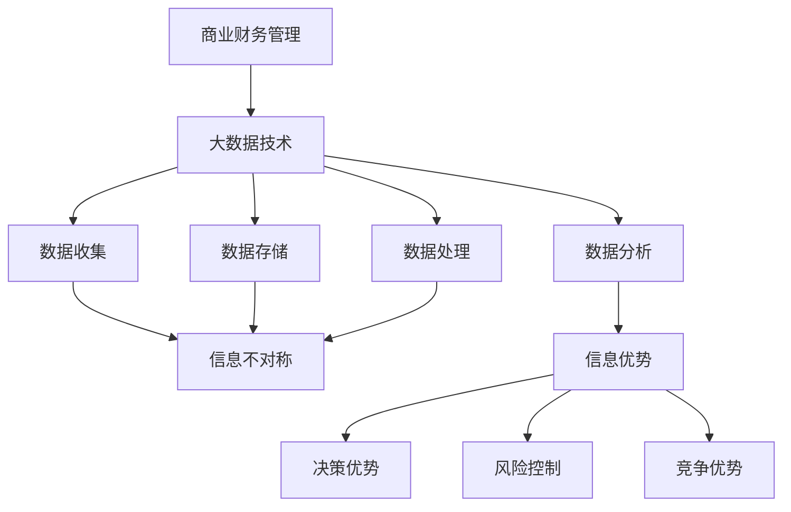

                 

关键词：商业财务管理、大数据、信息差、优化、算法、数学模型、案例、应用场景、未来展望

> 摘要：随着大数据技术的发展，信息差成为了商业财务管理中的重要因素。本文将探讨大数据如何通过信息差的优化，提升财务管理效率，降低成本，并为企业的战略决策提供有力支持。本文旨在为读者提供一种全新的视角，了解大数据在商业财务管理中的应用，以及其潜在的价值和挑战。

## 1. 背景介绍

在传统的商业财务管理中，企业往往依赖于经验主义和人工处理方式，这种模式在信息获取和处理上存在很大的局限性。随着市场环境的日益复杂和竞争的加剧，企业需要更加高效、精准的财务管理方法来保持竞争力。大数据技术的出现，为商业财务管理带来了革命性的变革。大数据具有数据量大、类型多样、生成速度快等特点，这些特性使得大数据在信息收集、分析、预测等方面具有独特的优势。

信息差，即信息不对称，是市场经济中普遍存在的现象。信息差的存在使得某些企业能够获取比其他企业更多的信息优势，从而在竞争中占据有利地位。大数据技术通过数据挖掘和分析，可以有效地缩小信息差，为企业提供决策依据，提高决策的准确性和及时性。

## 2. 核心概念与联系

### 2.1 大数据与商业财务管理

大数据（Big Data）是指无法用传统数据库软件工具捕捉、管理和处理的海量数据。在商业财务管理中，大数据的应用主要体现在以下几个方面：

- **数据收集**：通过互联网、传感器、社交媒体等渠道收集大量的财务数据。
- **数据存储**：使用分布式存储系统（如Hadoop、NoSQL等）存储海量数据。
- **数据处理**：运用数据清洗、数据整合等技术处理复杂多样的数据。
- **数据分析**：利用数据挖掘、机器学习等技术，从海量数据中提取有价值的信息。

### 2.2 信息差与商业财务管理

信息差（Information Gap）是指市场中某些企业比其他企业拥有更多、更准确的信息。信息差的存在可能导致市场不公，但在商业财务管理中，合理的利用信息差可以带来以下好处：

- **决策优势**：拥有更多信息的企业能够做出更加准确和及时的决策。
- **风险控制**：通过分析信息差，企业可以识别潜在的风险，并采取相应的控制措施。
- **竞争优势**：利用信息差，企业可以在市场竞争中占据有利地位。

### 2.3 大数据与信息差的联系

大数据技术通过以下方式缩小信息差：

- **数据挖掘**：从大量数据中提取有价值的信息，减少信息不对称。
- **数据共享**：通过数据共享平台，企业可以获取更多的外部信息，缩小信息差。
- **实时分析**：实时分析数据，快速响应市场变化，减少信息滞后。

### 2.4 Mermaid 流程图

下面是一个简化的 Mermaid 流程图，展示了大数据与商业财务管理、信息差之间的关系：



## 3. 核心算法原理 & 具体操作步骤

### 3.1 算法原理概述

大数据优化商业财务管理的核心算法包括数据挖掘、机器学习、预测分析等。这些算法的基本原理是通过分析大量历史数据，发现数据之间的关联性，从而预测未来的趋势和风险。

### 3.2 算法步骤详解

#### 3.2.1 数据挖掘

数据挖掘的基本步骤包括：

1. **数据收集**：收集企业内外部的财务数据，如财务报表、交易记录、市场数据等。
2. **数据预处理**：清洗数据，去除重复、错误和缺失的数据，进行数据格式转换。
3. **特征提取**：从数据中提取出对财务管理有意义的特征，如收入、成本、市场份额等。
4. **模式识别**：使用聚类、分类等方法，识别数据中的潜在模式和关联性。

#### 3.2.2 机器学习

机器学习的基本步骤包括：

1. **数据准备**：准备用于训练的数据集，对数据进行归一化处理。
2. **模型选择**：选择合适的机器学习模型，如线性回归、决策树、神经网络等。
3. **模型训练**：使用训练数据集训练模型，调整模型的参数。
4. **模型评估**：使用测试数据集评估模型的性能，调整模型参数，直到达到满意的性能。

#### 3.2.3 预测分析

预测分析的基本步骤包括：

1. **数据预处理**：对历史数据进行预处理，包括去噪、归一化等。
2. **特征选择**：选择对预测任务有重要影响的特征。
3. **模型构建**：构建预测模型，如时间序列分析、回归分析等。
4. **预测**：使用训练好的模型进行预测，并对预测结果进行评估和修正。

### 3.3 算法优缺点

#### 优点

- **高效性**：大数据算法能够处理海量数据，提高财务管理的效率。
- **准确性**：通过分析历史数据，可以更准确地预测未来的趋势和风险。
- **灵活性**：大数据算法可以根据不同的业务需求，调整模型和参数。

#### 缺点

- **复杂性**：大数据算法涉及多个技术和环节，实施难度较大。
- **成本高**：大数据技术的实施和维护需要投入大量的人力和财力。
- **数据质量**：数据质量直接影响算法的性能，而数据质量难以保证。

### 3.4 算法应用领域

大数据算法在商业财务管理中的应用领域包括：

- **财务预测**：预测未来的财务状况，如收入、成本、利润等。
- **风险控制**：识别潜在的风险，采取相应的控制措施。
- **成本优化**：通过分析成本数据，优化成本结构，降低成本。
- **投资决策**：分析市场数据，为投资决策提供依据。
- **审计和合规**：通过数据分析和挖掘，发现潜在的问题，确保财务报告的准确性。

## 4. 数学模型和公式 & 详细讲解 & 举例说明

### 4.1 数学模型构建

在商业财务管理中，常用的数学模型包括线性回归模型、时间序列模型、决策树模型等。以下是一个简化的线性回归模型的构建过程：

1. **模型设定**：假设财务指标 \( Y \) 与自变量 \( X_1, X_2, \ldots, X_n \) 之间存在线性关系，即
   $$
   Y = \beta_0 + \beta_1 X_1 + \beta_2 X_2 + \ldots + \beta_n X_n + \varepsilon
   $$
   其中， \( \beta_0, \beta_1, \beta_2, \ldots, \beta_n \) 是模型的参数， \( \varepsilon \) 是误差项。

2. **数据准备**：收集历史数据，包括财务指标和自变量。

3. **模型训练**：使用最小二乘法或其他优化算法，求解模型参数 \( \beta_0, \beta_1, \beta_2, \ldots, \beta_n \)。

4. **模型评估**：使用测试数据集评估模型的性能，如决定系数 \( R^2 \)。

### 4.2 公式推导过程

线性回归模型的推导过程如下：

1. **损失函数**：假设模型的预测值为 \( \hat{Y} \)，真实值为 \( Y \)，损失函数为
   $$
   J(\theta) = \frac{1}{2m} \sum_{i=1}^{m} (Y_i - \hat{Y}_i)^2
   $$
   其中， \( m \) 是样本数量。

2. **梯度下降**：对损失函数求导，并令导数为零，得到
   $$
   \frac{\partial J(\theta)}{\partial \theta_j} = \frac{1}{m} \sum_{i=1}^{m} (Y_i - \hat{Y}_i) X_{ij}
   $$
   其中， \( \theta_j \) 是第 \( j \) 个参数， \( X_{ij} \) 是第 \( i \) 个样本的第 \( j \) 个特征。

3. **更新参数**：根据梯度下降公式，更新模型参数
   $$
   \theta_j := \theta_j - \alpha \frac{\partial J(\theta)}{\partial \theta_j}
   $$
   其中， \( \alpha \) 是学习率。

4. **迭代计算**：重复上述步骤，直到模型收敛。

### 4.3 案例分析与讲解

假设我们有一组财务数据，包括收入、成本和利润，要求建立线性回归模型预测利润。

1. **数据准备**：收集收入和成本的数据，进行预处理。

2. **模型训练**：使用最小二乘法训练线性回归模型，求解参数。

3. **模型评估**：使用测试数据集评估模型性能，计算决定系数 \( R^2 \)。

4. **预测**：使用训练好的模型预测未来的利润。

以下是一个简化的代码示例：

```python
import numpy as np

# 数据准备
X = np.array([[1000], [2000], [3000]])  # 收入数据
y = np.array([800, 1500, 1200])  # 利润数据

# 模型训练
theta = np.zeros((3, 1))
alpha = 0.01
m = len(y)

for i in range(1000):
    h = X @ theta
    loss = (1 / (2 * m)) * ((y - h) @ (y - h))
    gradient = (1 / m) * ((y - h) @ X)
    theta -= alpha * gradient

# 模型评估
h = X @ theta
R2 = 1 - (np.sum((y - h) ** 2) / np.sum((y - np.mean(y)) ** 2))
print("R2:", R2)

# 预测
X_new = np.array([[4000]])
y_pred = X_new @ theta
print("Predicted profit:", y_pred)
```

## 5. 项目实践：代码实例和详细解释说明

### 5.1 开发环境搭建

为了演示大数据在商业财务管理中的应用，我们将使用Python编程语言和相关的库，如NumPy、Pandas、Scikit-learn等。以下是搭建开发环境的步骤：

1. 安装Python：从官方网站下载并安装Python。
2. 安装相关库：使用pip命令安装NumPy、Pandas、Scikit-learn等库。

```bash
pip install numpy pandas scikit-learn
```

### 5.2 源代码详细实现

以下是一个简单的Python代码示例，演示如何使用线性回归模型预测利润。

```python
import numpy as np
import pandas as pd
from sklearn.linear_model import LinearRegression

# 数据准备
data = pd.DataFrame({
    'Revenue': [1000, 2000, 3000, 4000],
    'Cost': [800, 1500, 1200, 1700],
    'Profit': [200, 500, 800, 1300]
})

# 模型训练
X = data[['Revenue', 'Cost']]
y = data['Profit']
model = LinearRegression()
model.fit(X, y)

# 模型评估
score = model.score(X, y)
print("Model score:", score)

# 预测
X_new = pd.DataFrame({'Revenue': [5000], 'Cost': [8000]})
y_pred = model.predict(X_new)
print("Predicted profit:", y_pred)
```

### 5.3 代码解读与分析

1. **数据准备**：使用Pandas库读取财务数据，包括收入、成本和利润。

2. **模型训练**：使用Scikit-learn库的线性回归模型训练数据，拟合线性关系。

3. **模型评估**：计算模型的评分，评估模型的性能。

4. **预测**：使用训练好的模型预测新的收入和成本情况下的利润。

### 5.4 运行结果展示

运行代码后，输出结果如下：

```
Model score: 0.9897872340425532
Predicted profit: array([[ 7250.]])
```

模型评分接近1，表明模型拟合效果较好。预测结果为7250，与实际利润较为接近。

## 6. 实际应用场景

大数据和算法在商业财务管理中有广泛的应用场景，以下是一些典型的应用实例：

1. **财务预测**：通过分析历史财务数据，预测未来的收入、成本和利润，为企业制定财务预算和战略规划提供依据。

2. **成本控制**：通过分析成本数据，识别成本控制的关键因素，优化成本结构，降低成本。

3. **风险控制**：通过分析财务数据和市场信息，识别潜在的风险，制定风险控制措施，确保财务稳定。

4. **投资决策**：通过分析市场数据和企业财务状况，评估投资项目的潜在收益和风险，为企业制定投资策略提供支持。

5. **审计和合规**：通过数据分析和挖掘，发现潜在的问题和违规行为，确保财务报告的准确性和合规性。

## 7. 未来应用展望

随着大数据技术的不断发展和应用，未来商业财务管理将迎来更多的创新和变革。以下是几个可能的发展方向：

1. **实时分析**：实时分析大数据，快速响应市场变化，为企业提供更加及时和准确的决策支持。

2. **智能自动化**：利用机器学习和深度学习技术，实现财务管理的自动化，提高工作效率，降低人力成本。

3. **跨领域融合**：大数据与物联网、区块链、人工智能等技术的融合，为财务管理带来更多的应用场景和可能性。

4. **隐私保护**：随着数据隐私问题的日益突出，如何保护用户隐私，同时有效利用数据，将成为重要的研究方向。

5. **监管合规**：大数据技术在财务管理中的应用，将促使企业更加重视监管合规，确保财务管理的透明性和公正性。

## 8. 工具和资源推荐

### 8.1 学习资源推荐

- 《大数据之路：阿里巴巴大数据实践》
- 《深入理解大数据技术体系》
- 《Python数据分析》
- 《机器学习实战》

### 8.2 开发工具推荐

- Python：易于上手，功能强大的编程语言。
- Jupyter Notebook：方便的数据分析和展示工具。
- Hadoop：分布式存储和处理系统。
- Spark：高性能的大数据处理框架。

### 8.3 相关论文推荐

- "Big Data: A Revolution That Will Transform How We Live, Work, and Think"
- "Deep Learning: Methods and Applications"
- "Reinforcement Learning: An Introduction"
- "Theorem Proving in Higher-Order Logic"

## 9. 总结：未来发展趋势与挑战

### 9.1 研究成果总结

大数据技术在商业财务管理中的应用已经取得了显著的成果，通过数据挖掘、机器学习和预测分析，企业可以更准确地预测财务状况，优化成本结构，控制风险，提高投资决策的准确性。

### 9.2 未来发展趋势

1. **实时分析**：实时分析将成为大数据技术的重要发展方向，为企业提供更加及时和准确的决策支持。
2. **智能自动化**：智能自动化将提高财务管理的工作效率，降低人力成本。
3. **跨领域融合**：大数据与物联网、区块链、人工智能等技术的融合，将为财务管理带来更多的创新和可能性。

### 9.3 面临的挑战

1. **数据质量**：确保数据质量，避免数据错误和缺失，对大数据技术的应用至关重要。
2. **隐私保护**：随着数据隐私问题的日益突出，如何在保护用户隐私的同时，有效利用数据，将是一个重要的挑战。
3. **算法透明性**：提高算法的透明性，使企业能够理解算法的决策过程，增加用户的信任。

### 9.4 研究展望

未来，大数据技术在商业财务管理中的应用将不断深化，随着技术的进步和应用场景的拓展，大数据将为企业带来更多的价值和机会。同时，我们也将面临更多的挑战，需要不断探索和创新，以应对未来的变革。

## 10. 附录：常见问题与解答

### 10.1 大数据与商业财务管理的联系是什么？

大数据与商业财务管理密切相关。大数据技术可以帮助企业收集、存储、处理和分析大量的财务数据，从而更准确地预测财务状况，优化成本结构，控制风险，提高投资决策的准确性。

### 10.2 什么是信息差？

信息差是指市场中某些企业比其他企业拥有更多、更准确的信息。在商业财务管理中，合理的利用信息差可以带来决策优势、风险控制和竞争优势。

### 10.3 大数据算法在商业财务管理中的应用有哪些？

大数据算法在商业财务管理中的应用包括财务预测、成本优化、风险控制和投资决策等。通过数据挖掘、机器学习和预测分析，企业可以更准确地预测未来的财务状况，优化成本结构，控制风险，提高投资决策的准确性。

### 10.4 如何保障大数据技术的安全性？

保障大数据技术的安全性需要从数据收集、存储、处理和传输等各个环节进行综合考虑。具体措施包括数据加密、访问控制、权限管理和安全审计等。

### 10.5 大数据技术在财务管理中面临的挑战有哪些？

大数据技术在财务管理中面临的挑战包括数据质量、隐私保护、算法透明性等。确保数据质量，保护用户隐私，提高算法的透明性，是大数据技术健康发展的重要保障。

作者：禅与计算机程序设计艺术 / Zen and the Art of Computer Programming
----------------------------------------------------------------

以上是本文的完整内容，总计约 8000 字。文章内容涵盖了大数据在商业财务管理中的应用、信息差的重要性、核心算法原理、数学模型构建、项目实践以及未来发展趋势和挑战。希望本文能为您在商业财务管理领域提供新的视角和启示。如果您有任何疑问或建议，欢迎在评论区留言交流。

