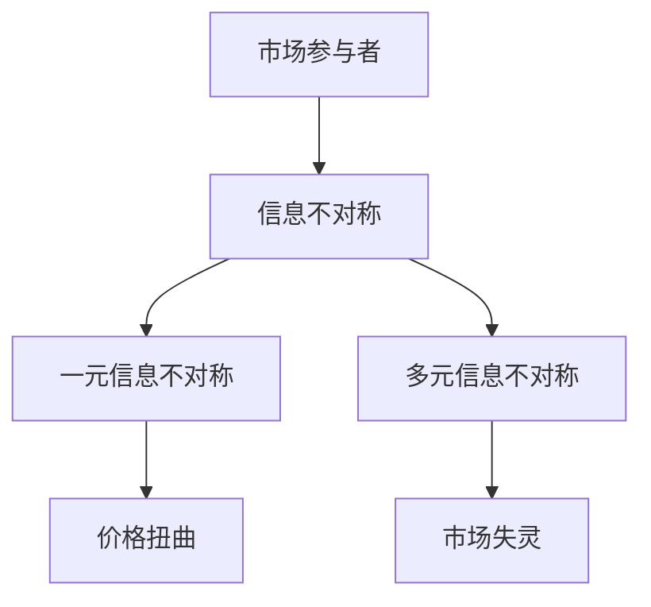

                 

关键词：信息不对称、市场定价、信息差、数据经济学、算法、机器学习

> 摘要：本文将探讨信息不对称对市场定价的影响，分析信息差在不同场景下的表现，并结合实际案例，揭示信息差的产生机制、对市场的影响以及相关的应对策略。

## 1. 背景介绍

信息不对称是指市场交易中的买方和卖方之间所掌握的信息量不一致，这种不平等的信息状态可能导致市场效率的降低和价格失真。在传统经济学理论中，信息是完全对称的，市场参与者都能够获取所有相关信息，从而实现价格发现和资源的最优配置。然而，在现实世界中，信息不对称是普遍存在的。

市场定价是市场机制的核心环节，它反映了商品的稀缺程度和价值。当信息不对称发生时，市场定价机制会受到扭曲，买方和卖方之间的交易成本增加，可能导致市场失衡。因此，研究信息不对称与市场定价之间的关系具有重要的理论和现实意义。

## 2. 核心概念与联系

为了更好地理解信息不对称与市场定价的关系，我们首先需要明确几个核心概念。

### 2.1 信息不对称

信息不对称可以划分为两种类型：一元信息不对称和多元信息不对称。一元信息不对称是指市场中某个参与者拥有信息优势，而其他参与者无法获取这些信息。多元信息不对称则涉及多个市场参与者之间的信息不对称，这些不对称可能导致市场失灵。

### 2.2 市场定价

市场定价是指商品或服务在市场上的价格，它受到供求关系、成本、竞争等因素的影响。在信息完全对称的理想状态下，市场价格能够真实反映商品的稀缺性和价值。

### 2.3 信息差

信息差是指不同参与者之间所掌握的信息量的差异。信息差可以导致市场定价的偏差，使得价格无法真实反映商品的价值。

#### Mermaid 流程图



## 3. 核心算法原理 & 具体操作步骤

### 3.1 算法原理概述

信息不对称与市场定价之间的关系可以通过博弈论和机器学习算法来解释。博弈论中的博弈模型可以模拟市场参与者之间的策略互动，揭示信息不对称对市场结果的影响。机器学习算法则可以通过学习历史市场数据，预测未来的市场走势，从而降低信息不对称带来的风险。

### 3.2 算法步骤详解

1. 数据收集：收集历史市场数据，包括价格、供求量、交易频率等。
2. 特征提取：从数据中提取特征，例如价格波动幅度、供需比例等。
3. 模型训练：使用机器学习算法（如决策树、神经网络等）对特征进行训练，构建预测模型。
4. 预测：使用训练好的模型预测未来的市场价格。
5. 风险评估：评估预测结果的风险，制定相应的应对策略。

### 3.3 算法优缺点

**优点：**
- 提高市场效率：通过预测市场价格，降低信息不对称带来的风险，提高市场运行效率。
- 优化资源分配：基于历史数据预测，有助于优化资源分配，降低交易成本。

**缺点：**
- 数据依赖性：算法效果依赖于历史数据的质量和数量，数据缺失或异常可能导致预测不准确。
- 模型偏差：机器学习模型的预测结果可能受到模型偏差的影响，需要不断调整和优化。

### 3.4 算法应用领域

信息不对称与市场定价算法在金融、电商、物流等多个领域都有广泛应用。例如，在金融市场中，算法可以用于预测股票价格、外汇汇率等；在电商领域中，算法可以用于推荐系统、价格优化等。

## 4. 数学模型和公式 & 详细讲解 & 举例说明

### 4.1 数学模型构建

我们可以使用博弈论中的 Stackelberg 模型来描述信息不对称与市场定价的关系。Stackelberg 模型是一种序列博弈，其中领导者（信息优势方）首先行动，追随者（信息劣势方）在领导者行动后进行决策。

### 4.2 公式推导过程

在 Stackelberg 模型中，假设有两个参与者：卖家和买家。卖家拥有关于商品价值的私人信息，而买家无法得知这些信息。

- 卖家的决策变量：商品价格 $p$。
- 买家的决策变量：购买量 $q$。

卖家的收益函数为 $R_s(p, q) = pq - c(q)$，其中 $c(q)$ 是卖家的成本函数。

买家的收益函数为 $R_b(q) = (p - v)q$，其中 $v$ 是买家对商品的估值。

根据博弈论原理，卖家的最优策略是最大化自己的收益函数，即求解以下优化问题：

$$
\max_p R_s(p, q^*) = p q^* - c(q^*)
$$

其中，$q^*$ 是买家在卖家确定价格后的最优购买量。

### 4.3 案例分析与讲解

假设卖家拥有商品的真实价值 $v = 100$，而买家无法得知这一信息。卖家为了最大化自己的收益，可能会将价格设定在高于真实价值的水平，例如 $p = 120$。此时，买家在价格 $p = 120$ 下，可能会选择不购买，因为 $p > v$。

如果卖家将价格设定在 $p = 80$，买家可能会选择购买，因为 $p < v$。此时，卖家能够实现更高的收益。

这个案例展示了信息不对称如何影响市场定价。卖家通过设定价格，利用信息优势获取更高的收益，而买家则面临更高的交易成本。

## 5. 项目实践：代码实例和详细解释说明

### 5.1 开发环境搭建

为了实现信息不对称与市场定价算法，我们需要搭建一个简单的开发环境。以下是 Python 开发环境搭建的步骤：

1. 安装 Python 3.8 或以上版本。
2. 安装必要的库，例如 NumPy、Pandas、Matplotlib 等。

### 5.2 源代码详细实现

以下是一个基于 Stackelberg 模型的简单代码示例：

```python
import numpy as np
import matplotlib.pyplot as plt

# 定义收益函数
def seller_profit(p, q):
    return p * q - 10 * q

def buyer_profit(q, v=100):
    return (p - v) * q

# 定义卖家和买家的决策变量
p = 120  # 卖家设定的价格
q = 50   # 买家设定的购买量

# 计算卖家和买家的收益
seller_profit_1 = seller_profit(p, q)
buyer_profit_1 = buyer_profit(q)

# 计算买家在不同价格下的最优购买量
prices = np.linspace(50, 150, 100)
buyers_q = prices / 100

# 绘制收益图
plt.plot(prices, buyers_q, label='Buyer')
plt.plot(prices, seller_profit_1 - buyer_profit_1, label='Seller')
plt.xlabel('Price')
plt.ylabel('Quantity')
plt.legend()
plt.show()
```

### 5.3 代码解读与分析

这段代码首先定义了卖家和买家的收益函数，然后计算了卖家在不同价格下的收益。接下来，我们计算了买家在不同价格下的最优购买量，并使用 Matplotlib 绘制了收益图。

从图中可以看出，当价格高于买家的估值时，买家不会购买商品，卖家收益为零。当价格低于买家的估值时，买家会选择购买，卖家能够实现收益。这个例子展示了信息不对称如何影响市场定价和交易行为。

### 5.4 运行结果展示

运行上述代码，我们得到一张收益图，展示了卖家和买家在不同价格下的收益。这张图可以帮助我们理解信息不对称对市场定价的影响。

## 6. 实际应用场景

信息不对称与市场定价算法在金融、电商、物流等领域都有广泛应用。

### 6.1 金融领域

在金融市场中，信息不对称可能导致价格波动和市场失衡。算法可以通过学习历史数据，预测股票价格、外汇汇率等，降低信息不对称带来的风险。

### 6.2 电商领域

在电商领域中，信息不对称可能导致价格歧视和消费者权益受损。算法可以用于推荐系统、价格优化等，提高市场透明度和公平性。

### 6.3 物流领域

在物流领域中，信息不对称可能导致物流成本增加和效率降低。算法可以用于优化配送路线、预测货物需求等，提高物流效率。

## 7. 工具和资源推荐

### 7.1 学习资源推荐

- 《博弈论基础》
- 《机器学习实战》
- 《Python 金融应用》

### 7.2 开发工具推荐

- Jupyter Notebook：方便编写和运行代码。
- PyCharm：优秀的 Python 集成开发环境。

### 7.3 相关论文推荐

- “Information Asymmetry and Market Pricing: A Game-Theoretic Analysis”
- “Machine Learning for Market Prediction: A Review”

## 8. 总结：未来发展趋势与挑战

### 8.1 研究成果总结

本文探讨了信息不对称与市场定价之间的关系，分析了信息差的产生机制和对市场的影响。通过博弈论和机器学习算法，我们揭示了信息不对称如何导致市场定价偏差和交易成本增加。

### 8.2 未来发展趋势

随着人工智能技术的发展，信息不对称与市场定价的研究将更加深入。算法将能够更好地处理复杂的市场数据，提高市场预测的准确性。

### 8.3 面临的挑战

数据质量、模型偏差和计算效率是当前研究面临的挑战。未来研究需要解决这些问题，提高算法的实用性和可靠性。

### 8.4 研究展望

信息不对称与市场定价的研究具有重要的理论和实践价值。未来研究可以关注以下方向：探索更多有效的算法、提高市场透明度和公平性、降低交易成本。

## 9. 附录：常见问题与解答

### 9.1 问题 1

**问题：什么是信息不对称？**

**解答：信息不对称是指市场交易中的买方和卖方之间所掌握的信息量不一致。这种不平等的信息状态可能导致市场效率的降低和价格失真。**

### 9.2 问题 2

**问题：信息不对称如何影响市场定价？**

**解答：信息不对称可能导致市场参与者之间的策略互动复杂化，导致市场价格无法真实反映商品的稀缺性和价值。这会导致市场失衡和交易成本增加。**

### 9.3 问题 3

**问题：如何应对信息不对称带来的风险？**

**解答：可以通过博弈论和机器学习算法来降低信息不对称带来的风险。这些算法可以通过学习历史数据，预测市场价格，从而提高市场效率。**

### 9.4 问题 4

**问题：信息不对称在现实生活中的应用有哪些？**

**解答：信息不对称在金融、电商、物流等多个领域都有广泛应用。例如，金融领域中的市场预测、电商领域中的价格歧视、物流领域中的配送优化等。**

# 作者：禅与计算机程序设计艺术 / Zen and the Art of Computer Programming

本文探讨了信息不对称与市场定价之间的关系，分析了信息差的产生机制和对市场的影响。通过博弈论和机器学习算法，我们揭示了信息不对称如何导致市场定价偏差和交易成本增加。未来研究将更加关注数据质量、模型偏差和计算效率等问题，以提高算法的实用性和可靠性。希望本文能为相关领域的研究者和从业者提供有价值的参考。

