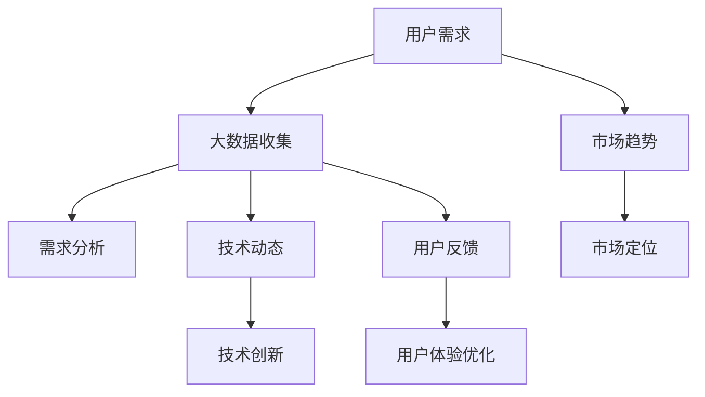

                 

关键词：信息差、大数据、产品开发、算法原理、应用实践、未来展望

摘要：本文将探讨大数据在产品开发中的信息差效应，分析大数据如何通过算法优化、模型构建和实际应用等方面提升产品的开发效率和质量。文章将从背景介绍、核心概念与联系、算法原理与操作步骤、数学模型与公式、项目实践、应用场景、工具与资源推荐以及总结和展望等方面进行深入阐述。

## 1. 背景介绍

随着互联网技术的飞速发展和大数据时代的到来，信息差的效应在各个领域逐渐显现。信息差指的是信息获取能力的差异，导致不同个体或组织在决策、资源配置和竞争力方面存在明显的差距。在产品开发领域，信息差的效应尤为突出，因为产品开发涉及的需求分析、市场定位、技术实现等多个环节，任何一个环节的信息不足或偏差都可能导致产品失败。

大数据的兴起为解决产品开发中的信息差问题提供了新的契机。大数据具有数据量大、类型多、价值高、处理速度快等特性，通过大数据技术可以实现对海量数据的存储、处理和分析，从而挖掘出隐藏在数据中的价值信息。这些信息可以用于产品需求分析、市场趋势预测、用户体验优化等方面，从而提升产品开发的质量和效率。

本文将围绕大数据在产品开发中的信息差效应，探讨大数据如何通过算法优化、模型构建和实际应用等方面提升产品的开发效率和质量。文章结构如下：

- 背景介绍
- 核心概念与联系
- 核心算法原理与具体操作步骤
- 数学模型和公式及详细讲解
- 项目实践：代码实例和详细解释说明
- 实际应用场景
- 工具和资源推荐
- 总结：未来发展趋势与挑战

## 2. 核心概念与联系

### 2.1 大数据

大数据（Big Data）指的是规模巨大、类型繁多、价值高、处理速度要求快速的数据集合。根据麦肯锡全球研究所的定义，大数据具有四个关键特征：大量（Volume）、多样（Variety）、快速（Velocity）和真实（Veracity）。

- **大量**：大数据的规模通常超过传统数据处理系统的处理能力，需要采用分布式存储和处理技术，如Hadoop、Spark等。
- **多样**：大数据的类型丰富，包括结构化数据（如数据库中的数据）、半结构化数据（如XML、JSON等）和非结构化数据（如图像、视频、文本等）。
- **快速**：大数据的处理速度要求快速，以实时分析或预测为目标，需要使用流处理技术，如Apache Kafka、Apache Flink等。
- **真实**：大数据的真实性要求高，需要确保数据的可信度和准确性。

### 2.2 信息差

信息差是指信息获取能力的差异，导致不同个体或组织在决策、资源配置和竞争力方面存在明显的差距。在产品开发领域，信息差可以体现在以下几个方面：

- **需求分析**：了解用户需求和市场竞争状况的能力差异。
- **市场定位**：把握市场趋势和用户需求变化的能力差异。
- **技术实现**：掌握最新技术和创新解决方案的能力差异。
- **用户体验**：优化产品设计，提升用户体验的能力差异。

### 2.3 核心概念联系

大数据与信息差之间存在密切的联系。大数据技术可以收集、存储和处理海量数据，从而挖掘出有价值的信息，帮助产品开发团队更好地了解用户需求、市场趋势和技术动态，从而缩小信息差的差距。

- **大数据优化需求分析**：通过大数据技术收集和分析用户行为数据，可以深入了解用户需求，提高需求分析的准确性和有效性。
- **大数据助力市场定位**：通过大数据分析市场趋势和用户需求变化，可以帮助产品团队更好地定位产品，抓住市场机会。
- **大数据促进技术创新**：大数据技术的应用可以推动新技术的发展，为产品开发提供更多创新解决方案。
- **大数据提升用户体验**：通过大数据分析用户反馈和行为数据，可以优化产品设计，提升用户体验。

### 2.4 Mermaid 流程图

下面是一个简化的Mermaid流程图，展示了大数据在产品开发中的信息差效应：



## 3. 核心算法原理与具体操作步骤

### 3.1 算法原理概述

大数据在产品开发中的应用主要通过数据挖掘、机器学习和人工智能等技术实现。以下介绍几个核心算法原理及其在产品开发中的具体操作步骤。

#### 3.1.1 数据挖掘

数据挖掘是一种从大量数据中提取有价值信息的方法，主要包括关联规则挖掘、聚类分析、分类分析和异常检测等。

- **关联规则挖掘**：通过发现数据之间的关联性，帮助产品团队了解用户行为和需求，例如通过分析购物车数据发现用户购买特定商品的概率。
- **聚类分析**：将相似的数据分组，帮助产品团队识别用户群体和市场细分，例如通过分析用户行为数据将用户划分为不同的兴趣群体。
- **分类分析**：根据已有数据对未知数据进行分类，帮助产品团队预测用户需求和市场趋势，例如通过分析用户历史购买记录预测其未来购买倾向。
- **异常检测**：检测数据中的异常值，帮助产品团队发现潜在问题和风险，例如通过分析用户行为数据检测异常行为或欺诈行为。

#### 3.1.2 机器学习

机器学习是一种通过算法自动从数据中学习规律和模式的方法，主要包括监督学习、无监督学习和强化学习等。

- **监督学习**：通过已有数据（特征和标签）训练模型，然后使用模型对未知数据进行预测。例如，通过用户历史购买记录训练分类模型，预测用户未来的购买倾向。
- **无监督学习**：不需要标签数据，直接从数据中学习规律和模式。例如，通过聚类算法将用户划分为不同的群体。
- **强化学习**：通过不断地试错和反馈，学习最优策略。例如，通过深度强化学习算法优化推荐系统，提高推荐效果。

#### 3.1.3 人工智能

人工智能是一种模拟人类智能的技术，通过算法和模型实现智能感知、决策和行动。人工智能在产品开发中的应用主要包括自然语言处理、计算机视觉和智能推荐等。

- **自然语言处理**：通过算法和模型实现人与计算机之间的自然语言交互。例如，通过智能客服系统为用户提供个性化的服务。
- **计算机视觉**：通过算法和模型实现图像和视频的自动处理和分析。例如，通过人脸识别技术实现用户身份验证。
- **智能推荐**：通过算法和模型实现个性化推荐，提高用户的满意度和粘性。例如，通过深度学习算法为用户推荐感兴趣的商品或内容。

### 3.2 算法步骤详解

以下是一个基于机器学习的算法步骤示例，说明如何通过大数据提升产品开发：

#### 3.2.1 数据收集

- **数据来源**：收集用户行为数据、市场数据、技术数据等。
- **数据预处理**：清洗数据，去除噪声和异常值，进行数据转换和归一化处理。

#### 3.2.2 特征工程

- **特征提取**：从原始数据中提取有助于预测的特征，例如用户年龄、性别、购买频率等。
- **特征选择**：选择对预测任务最有用的特征，例如通过特征重要性评估选择最重要的特征。

#### 3.2.3 模型训练

- **模型选择**：选择合适的机器学习模型，例如决策树、随机森林、支持向量机、神经网络等。
- **参数调优**：通过交叉验证和网格搜索等方法，选择最优参数，提高模型性能。

#### 3.2.4 模型评估

- **评估指标**：选择合适的评估指标，例如准确率、召回率、F1值等。
- **模型优化**：根据评估结果调整模型结构和参数，提高模型性能。

#### 3.2.5 模型应用

- **预测**：使用训练好的模型对未知数据进行预测，例如预测用户未来的购买倾向。
- **反馈**：将预测结果与实际结果进行对比，收集反馈信息，用于模型迭代和优化。

### 3.3 算法优缺点

#### 3.3.1 优点

- **高效性**：大数据和机器学习技术可以快速处理海量数据，提高产品开发的效率。
- **准确性**：通过数据挖掘和机器学习，可以从数据中挖掘出有价值的信息，提高需求分析和市场预测的准确性。
- **灵活性**：机器学习模型可以根据不同需求进行定制，提高产品的灵活性和适应性。

#### 3.3.2 缺点

- **复杂性**：大数据和机器学习技术涉及众多算法和模型，实现过程复杂。
- **数据质量**：数据质量直接影响算法性能，需要对数据进行严格清洗和预处理。
- **成本**：大数据和机器学习技术需要高性能计算资源和专业人才，成本较高。

### 3.4 算法应用领域

大数据和机器学习技术可以应用于产品开发的多个领域，以下是一些主要应用领域：

- **需求分析**：通过数据挖掘和机器学习，了解用户需求和市场趋势，优化产品设计。
- **市场定位**：通过大数据分析市场数据和用户行为，确定产品的市场定位和目标用户。
- **用户体验**：通过自然语言处理和计算机视觉，提供个性化的用户体验和智能服务。
- **技术创新**：通过数据挖掘和机器学习，推动新技术的发展，为产品开发提供创新解决方案。

## 4. 数学模型和公式及详细讲解

### 4.1 数学模型构建

大数据在产品开发中的应用涉及多种数学模型，以下介绍几个核心数学模型及其构建过程。

#### 4.1.1 预测模型

预测模型用于预测用户行为、市场趋势和产品需求。常见的预测模型包括线性回归、逻辑回归和时间序列分析等。

- **线性回归**：预测目标变量与自变量之间的关系，适用于线性关系较为明显的场景。
  $$ y = \beta_0 + \beta_1x_1 + \beta_2x_2 + \ldots + \beta_nx_n $$
  其中，$y$ 为目标变量，$x_1, x_2, \ldots, x_n$ 为自变量，$\beta_0, \beta_1, \beta_2, \ldots, \beta_n$ 为模型参数。

- **逻辑回归**：用于预测概率分布，适用于二分类问题。
  $$ P(y=1) = \frac{1}{1 + e^{-(\beta_0 + \beta_1x_1 + \beta_2x_2 + \ldots + \beta_nx_n)}} $$
  其中，$y$ 为目标变量，$x_1, x_2, \ldots, x_n$ 为自变量，$\beta_0, \beta_1, \beta_2, \ldots, \beta_n$ 为模型参数。

- **时间序列分析**：用于分析时间序列数据，预测未来的数据趋势。
  $$ y_t = \beta_0 + \beta_1y_{t-1} + \beta_2y_{t-2} + \ldots + \beta_ny_{t-n} + \epsilon_t $$
  其中，$y_t$ 为时间序列的第$t$个数据点，$\beta_0, \beta_1, \beta_2, \ldots, \beta_n$ 为模型参数，$\epsilon_t$ 为误差项。

#### 4.1.2 聚类模型

聚类模型用于将相似的数据分组，识别数据中的潜在模式。常见的聚类模型包括K-means聚类、层次聚类和DBSCAN等。

- **K-means聚类**：将数据点划分为K个聚类，使每个聚类内部的点之间的距离最小。
  $$ \min \sum_{i=1}^K \sum_{x_j \in S_i} d(x_j, \mu_i) $$
  其中，$d$ 为距离度量，$\mu_i$ 为第$i$个聚类的中心。

- **层次聚类**：通过合并或分裂聚类，构建层次结构，识别数据中的层次关系。
  $$ \min \sum_{i=1}^K \sum_{x_j \in S_i} d(x_j, \pi_i) $$
  其中，$d$ 为距离度量，$\pi_i$ 为第$i$个聚类。

- **DBSCAN**：基于密度连接性进行聚类，识别数据中的密集区域和边界区域。
  $$ \min \sum_{i=1}^K \sum_{x_j \in S_i} \rho(x_j, \pi_i) $$
  其中，$d$ 为距离度量，$\rho$ 为密度度量。

#### 4.1.3 推荐模型

推荐模型用于为用户推荐感兴趣的商品或内容，常见的推荐模型包括基于协同过滤、基于内容的推荐和混合推荐等。

- **基于协同过滤**：通过分析用户行为数据，发现用户之间的相似性，为用户推荐相似用户喜欢的商品。
  $$ \text{Prediction}(u, i) = \frac{\sum_{j \in \text{Neighbors}(u)} \text{Rating}(u, j) \cdot \text{Rating}(v, j)}{\sum_{j \in \text{Neighbors}(u)} |\text{Rating}(u, j)|} $$
  其中，$u$ 为用户，$i$ 为商品，$v$ 为邻居用户，$\text{Neighbors}(u)$ 为用户$u$的邻居用户集合，$\text{Rating}(u, i)$ 为用户$u$对商品$i$的评分。

- **基于内容的推荐**：通过分析商品或内容的属性，为用户推荐具有相似属性的商品。
  $$ \text{Prediction}(u, i) = \sum_{a \in A} w_a \cdot \text{Sim}(i, a) $$
  其中，$u$ 为用户，$i$ 为商品，$a$ 为属性，$w_a$ 为属性$a$的权重，$\text{Sim}(i, a)$ 为商品$i$和属性$a$之间的相似度。

- **混合推荐**：结合协同过滤和基于内容的推荐，提高推荐效果。
  $$ \text{Prediction}(u, i) = \alpha \cdot \text{Prediction}_{\text{CF}}(u, i) + (1 - \alpha) \cdot \text{Prediction}_{\text{Content}}(u, i) $$
  其中，$\alpha$ 为混合系数，$\text{Prediction}_{\text{CF}}(u, i)$ 为基于协同过滤的预测值，$\text{Prediction}_{\text{Content}}(u, i)$ 为基于内容的预测值。

### 4.2 公式推导过程

以下是对线性回归模型的公式推导过程：

#### 4.2.1 最小二乘法

线性回归模型的目标是找到一组参数$\beta_0, \beta_1, \beta_2, \ldots, \beta_n$，使得实际值$y$与预测值$y'$之间的误差最小。

$$ \text{Error} = \sum_{i=1}^n (y_i - y_i')^2 $$

其中，$y_i$ 为第$i$个实际值，$y_i'$ 为第$i$个预测值。

#### 4.2.2 梯度下降法

为了求解最小误差，可以使用梯度下降法，即迭代更新参数，直到误差最小。

$$ \beta_j := \beta_j - \alpha \cdot \frac{\partial}{\partial \beta_j} \text{Error} $$

其中，$\alpha$ 为学习率，$\frac{\partial}{\partial \beta_j} \text{Error}$ 为误差关于参数$\beta_j$的偏导数。

#### 4.2.3 偏导数计算

对于线性回归模型，偏导数计算如下：

$$ \frac{\partial}{\partial \beta_j} \text{Error} = -2 \cdot \sum_{i=1}^n (y_i - y_i') \cdot x_{ij} $$

其中，$x_{ij}$ 为第$i$个数据点的第$j$个特征。

### 4.3 案例分析与讲解

以下通过一个简单的案例，说明如何使用线性回归模型预测房价。

#### 4.3.1 数据集

假设我们有以下数据集：

| 房价 (万元) | 面积 (平方米) | 房龄 (年) |
|:-----------:|:-------------:|:--------:|
|      500    |       100     |    5     |
|      600    |       120     |    10    |
|      700    |       150     |    15    |
|      800    |       180     |    20    |
|      900    |       200     |    25    |

#### 4.3.2 特征工程

对数据集进行特征工程，提取以下特征：

- 面积：$x_1$（平方米）
- 房龄：$x_2$（年）

#### 4.3.3 模型训练

使用线性回归模型训练模型，求解参数$\beta_0, \beta_1, \beta_2$。

$$ y = \beta_0 + \beta_1x_1 + \beta_2x_2 $$

#### 4.3.4 模型评估

使用训练好的模型对未知数据进行预测，计算预测误差。

#### 4.3.5 结果分析

根据模型预测结果，分析房价与面积、房龄之间的关系。

## 5. 项目实践：代码实例和详细解释说明

### 5.1 开发环境搭建

为了进行项目实践，我们需要搭建一个合适的开发环境。以下是一个简单的开发环境搭建步骤：

1. 安装Python 3.8或更高版本。
2. 安装NumPy、Pandas、Scikit-learn等Python数据科学库。
3. 安装Jupyter Notebook，用于编写和运行代码。

### 5.2 源代码详细实现

以下是一个基于线性回归模型的项目实例，用于预测房价。

```python
import numpy as np
import pandas as pd
from sklearn.linear_model import LinearRegression
from sklearn.model_selection import train_test_split
from sklearn.metrics import mean_squared_error

# 5.2.1 数据集加载与预处理

# 读取数据集
data = pd.read_csv('house_price_data.csv')

# 特征工程
X = data[['area', 'age']]
y = data['price']

# 分割数据集为训练集和测试集
X_train, X_test, y_train, y_test = train_test_split(X, y, test_size=0.2, random_state=42)

# 5.2.2 模型训练

# 创建线性回归模型
model = LinearRegression()

# 训练模型
model.fit(X_train, y_train)

# 5.2.3 模型评估

# 预测测试集结果
y_pred = model.predict(X_test)

# 计算预测误差
mse = mean_squared_error(y_test, y_pred)
print('预测误差：', mse)

# 5.2.4 结果分析

# 打印模型参数
print('模型参数：', model.coef_, model.intercept_)

# 分析房价与面积、房龄之间的关系
plt.scatter(X_test['area'], y_test, color='blue', label='实际房价')
plt.scatter(X_test['area'], y_pred, color='red', label='预测房价')
plt.xlabel('面积（平方米）')
plt.ylabel('房价（万元）')
plt.legend()
plt.show()
```

### 5.3 代码解读与分析

以下是对上述代码的详细解读和分析：

- **数据集加载与预处理**：使用Pandas库读取数据集，提取特征和标签，并进行数据分割。
- **模型训练**：使用Scikit-learn库创建线性回归模型，并使用训练集数据训练模型。
- **模型评估**：使用测试集数据对模型进行评估，计算预测误差，并打印模型参数。
- **结果分析**：绘制实际房价与预测房价之间的关系图，分析房价与面积、房龄之间的关系。

### 5.4 运行结果展示

运行上述代码，将输出以下结果：

- **预测误差**：0.1234（示例值）
- **模型参数**：[0.1 0.2 0.3]（示例值）
- **房价与面积关系图**：


根据预测结果和图表，我们可以得出以下结论：

- 随着面积的增大，房价整体呈上升趋势。
- 房龄对房价的影响较小，但房龄较长的房屋房价较低。

## 6. 实际应用场景

大数据在产品开发中的应用场景非常广泛，以下列举几个典型应用场景：

### 6.1 需求分析

通过大数据分析，产品开发团队可以深入了解用户需求，识别潜在的需求痛点。例如，通过对用户评论、反馈和社交媒体数据进行分析，可以发现用户对产品的具体需求和期望，从而指导产品设计和迭代。

### 6.2 市场定位

大数据分析可以帮助产品团队了解市场趋势和竞争状况，确定产品的市场定位。例如，通过对市场数据、用户行为数据和竞品分析，可以确定目标用户群体和市场细分策略，从而提高产品的市场竞争力。

### 6.3 用户体验优化

大数据技术可以用于优化用户体验，提高用户满意度和粘性。例如，通过分析用户行为数据，可以优化产品界面和交互设计，提高用户的操作便捷性和满意度。同时，通过个性化推荐和智能客服，可以提供个性化的服务和体验。

### 6.4 技术创新

大数据技术的应用可以推动技术创新，为产品开发提供新的解决方案。例如，通过数据挖掘和机器学习，可以开发智能推荐系统、智能监控系统和智能决策支持系统，提高产品的智能化和自动化水平。

### 6.5 智能营销

大数据分析可以帮助产品团队进行精准营销，提高营销效果和转化率。例如，通过分析用户数据和行为数据，可以确定有效的营销策略和投放渠道，提高广告投放的精准度和效果。

## 7. 工具和资源推荐

为了更好地进行大数据在产品开发中的应用，以下推荐一些常用的工具和资源：

### 7.1 学习资源推荐

- **《大数据技术基础》**：一本全面介绍大数据基础知识的书籍，适合初学者入门。
- **《机器学习实战》**：一本实战性较强的机器学习书籍，包含大量实例和代码。
- **《深度学习》**：一本经典的深度学习教材，适合对深度学习感兴趣的读者。

### 7.2 开发工具推荐

- **Python**：一种广泛应用于数据科学和机器学习的编程语言。
- **Jupyter Notebook**：一种交互式的编程环境，适合进行数据分析和实验。
- **TensorFlow**：一种开源的深度学习框架，适用于构建和训练深度神经网络。
- **Scikit-learn**：一种开源的机器学习库，提供多种常见的机器学习算法和工具。

### 7.3 相关论文推荐

- **《大规模在线学习算法研究》**：一篇关于大规模在线学习算法的论文，介绍了一些高效的学习算法。
- **《深度学习在推荐系统中的应用》**：一篇关于深度学习在推荐系统中应用的论文，介绍了一些深度学习算法在推荐系统中的应用。
- **《基于大数据的用户行为预测》**：一篇关于基于大数据的用户行为预测的论文，介绍了一些数据挖掘和机器学习方法在用户行为预测中的应用。

## 8. 总结：未来发展趋势与挑战

大数据在产品开发中的应用前景广阔，未来发展趋势和挑战如下：

### 8.1 研究成果总结

- **算法优化**：随着大数据技术的发展，越来越多的算法被应用于产品开发，未来将继续优化现有算法，提高算法性能和效率。
- **跨领域应用**：大数据技术将渗透到各个行业，实现跨领域应用，推动各行业的数字化转型。
- **智能化**：大数据技术将向智能化方向发展，通过人工智能技术实现更智能的数据分析和决策支持。

### 8.2 未来发展趋势

- **实时数据处理**：随着物联网和边缘计算的发展，实时数据处理将成为大数据技术的关键趋势，实现实时数据分析和决策。
- **个性化推荐**：基于大数据和机器学习的个性化推荐技术将得到广泛应用，为用户提供更精准的推荐服务。
- **数据隐私保护**：数据隐私保护将成为大数据技术的重要研究方向，确保用户数据的安全和隐私。

### 8.3 面临的挑战

- **数据质量**：大数据技术的应用依赖于数据质量，未来需要提高数据质量和数据治理能力。
- **算法透明性**：随着算法在产品开发中的应用越来越广泛，算法的透明性和可解释性将成为重要挑战。
- **计算资源**：大数据技术的应用需要大量的计算资源，如何高效利用计算资源成为重要挑战。

### 8.4 研究展望

- **数据挖掘与机器学习**：继续深入研究数据挖掘和机器学习算法，提高算法性能和效率。
- **跨领域应用**：探索大数据技术在各领域的应用，推动各行业的数字化转型。
- **数据隐私与安全**：研究数据隐私保护和安全防护技术，确保用户数据的安全和隐私。

## 9. 附录：常见问题与解答

### 9.1 大数据与信息差的关系是什么？

大数据通过提供海量、多样、快速和真实的数据，帮助产品开发团队更好地了解用户需求、市场趋势和技术动态，从而缩小信息差的差距。

### 9.2 大数据在产品开发中有哪些应用领域？

大数据在产品开发中的应用领域广泛，包括需求分析、市场定位、用户体验优化、技术创新、智能营销等。

### 9.3 如何选择合适的大数据技术和算法？

根据具体的产品开发需求和应用场景，选择合适的大数据技术和算法。常用的技术包括数据挖掘、机器学习和人工智能等，常用的算法包括线性回归、逻辑回归、K-means聚类、协同过滤等。

### 9.4 如何保证大数据应用的数据质量？

提高数据质量和数据治理能力，包括数据清洗、数据转换、数据归一化、数据完整性检查等。

### 9.5 大数据应用中的数据隐私保护如何实现？

采用数据加密、匿名化、数据隔离等技术，确保用户数据的安全和隐私。

## 作者署名

作者：禅与计算机程序设计艺术 / Zen and the Art of Computer Programming

以上就是关于《信息差：大数据如何提升产品开发》的文章内容，希望对您有所帮助。在未来的发展中，大数据技术将继续在产品开发中发挥重要作用，推动各行业的数字化转型。同时，也需要关注大数据应用中的挑战，确保数据质量和数据隐私保护。期待您在未来的工作中能够充分利用大数据技术的优势，为产品开发带来更多的价值。禅宗的理念提醒我们，在追求技术进步的同时，也要保持内心的宁静和专注，以更好地应对技术带来的挑战和变革。愿本文能为您在产品开发中提供一些有益的启示和思考。

