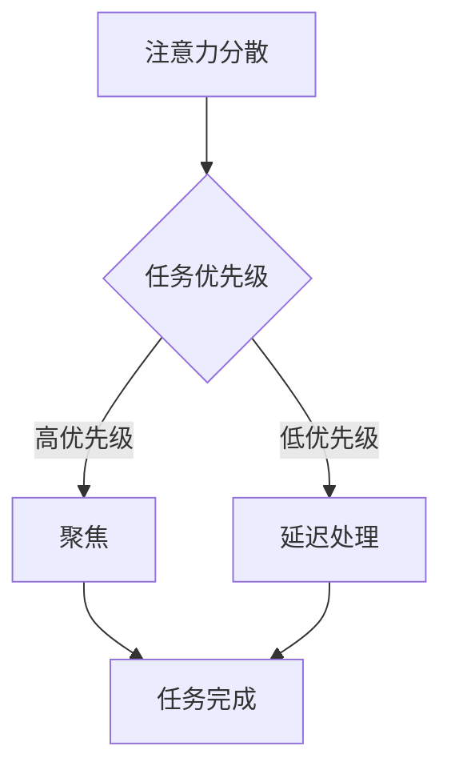

                 

### 关键词

- 信息过载
- 注意力管理
- 干扰控制
- 技术工具
- 效率提升
- 知识工作

### 摘要

在当今信息爆炸的时代，如何高效管理我们的注意力成为了一个关键问题。本文将深入探讨注意力管理的核心概念，分析信息过载和干扰的影响，提供实用的工具和策略，帮助读者在信息的海洋中航行。通过详细的算法原理、数学模型以及实际项目实践，本文旨在为从事知识工作的专业人士提供一套系统的注意力管理指南。

## 1. 背景介绍

### 1.1 信息时代的挑战

随着互联网和移动设备的普及，信息过载已经成为现代生活中的一个普遍现象。据统计，平均每天每个人会接收到大约174份电子邮件，浏览3000多条社交媒体信息。这些数据让我们不禁思考，面对如此海量的信息，如何有效地管理和利用我们的注意力？

### 1.2 注意力管理的重要性

注意力管理不仅关乎个人的工作效率和生活质量，更是影响我们决策质量和创新能力的关键因素。有效的注意力管理能够帮助我们更好地聚焦重要任务，提高工作效率，减少错误，同时增强我们的心理韧性，对抗日常生活中的各种压力。

### 1.3 文章结构

本文将按照以下结构展开：

1. 背景介绍
2. 核心概念与联系
3. 核心算法原理 & 具体操作步骤
4. 数学模型和公式 & 详细讲解 & 举例说明
5. 项目实践：代码实例和详细解释说明
6. 实际应用场景
7. 工具和资源推荐
8. 总结：未来发展趋势与挑战
9. 附录：常见问题与解答

## 2. 核心概念与联系

为了深入理解注意力管理，我们需要首先明确几个核心概念，并探讨它们之间的相互关系。

### 2.1 注意力经济学

注意力经济学是一种新兴的学科，它将经济学原理应用于注意力资源的分配与管理。根据注意力的经济学理论，注意力也是一种有限的资源，类似于时间和金钱。有效管理我们的注意力资源，就像管理金钱和时间一样，至关重要。

### 2.2 注意力分散与聚焦

注意力分散是指同时处理多个任务或信息的能力，而注意力聚焦则是指将注意力集中在单一任务或信息上。有效的注意力管理需要在分散和聚焦之间找到平衡。

### 2.3 注意力资源分配算法

注意力资源分配算法是管理注意力的一种方法。这些算法基于优先级和重要性对任务进行排序，帮助我们在最需要的时候分配注意力。

### 2.4 Mermaid 流程图

下面是一个简化的注意力管理流程图：



## 3. 核心算法原理 & 具体操作步骤

### 3.1 算法原理概述

注意力管理算法的核心目标是优化注意力资源的分配，以提高任务完成效率和减少干扰。以下是几种常见的注意力管理算法：

1. **优先级排序算法**：根据任务的紧急程度和重要性对任务进行排序，优先处理高优先级任务。
2. **多任务切换算法**：在处理多个任务时，通过快速切换注意力来提高效率。
3. **时间块管理法**：将时间划分为固定的块，每个块专注于一个任务，减少干扰。

### 3.2 算法步骤详解

#### 优先级排序算法

1. 收集任务信息：包括任务名称、紧急程度、重要性等。
2. 根据设定标准对任务进行评分。
3. 将任务按照评分从高到低排序。
4. 依次处理排序后的任务。

#### 多任务切换算法

1. 确定任务列表和优先级。
2. 开始处理第一个任务，直到完成或设定的时间点。
3. 检查任务列表，选择下一个任务。
4. 重复步骤2和3，直到所有任务完成。

#### 时间块管理法

1. 确定工作时间块，例如25分钟工作，5分钟休息。
2. 每个工作块专注于一个任务，避免切换。
3. 在工作块结束时进行短暂休息，以恢复注意力。
4. 重复上述步骤，直到所有任务完成。

### 3.3 算法优缺点

**优先级排序算法**

- 优点：高效处理紧急和高优先级任务。
- 缺点：可能导致低优先级任务被长时间延迟。

**多任务切换算法**

- 优点：提高时间利用率。
- 缺点：长时间切换可能导致效率降低。

**时间块管理法**

- 优点：减少任务切换，提高专注度。
- 缺点：可能需要调整工作与休息的比例。

### 3.4 算法应用领域

这些算法广泛应用于各种知识工作场景，如软件开发、数据分析和写作等。通过合理应用，可以显著提高工作效率和产出质量。

## 4. 数学模型和公式 & 详细讲解 & 举例说明

### 4.1 数学模型构建

注意力管理中的数学模型可以基于线性规划或决策树进行构建。以下是一个简化的线性规划模型：

$$
\begin{aligned}
\max_{x} \quad & c^T x \\
\text{subject to} \quad & Ax \leq b
\end{aligned}
$$

其中，$x$ 表示注意力分配向量，$c$ 表示任务的重要性系数，$A$ 和 $b$ 分别为任务的约束条件。

### 4.2 公式推导过程

假设我们有 $n$ 个任务，每个任务都有其特定的优先级 $p_i$ 和持续时间 $d_i$。为了最大化总优先级，我们构建以下目标函数：

$$
\max \sum_{i=1}^{n} p_i x_i
$$

同时，我们希望确保总持续时间不超过可用时间 $T$：

$$
\sum_{i=1}^{n} d_i x_i \leq T
$$

为了处理这些约束，我们可以采用拉格朗日乘数法进行求解。设拉格朗日函数为：

$$
L(x, \lambda) = \sum_{i=1}^{n} p_i x_i + \lambda (T - \sum_{i=1}^{n} d_i x_i)
$$

其中，$\lambda$ 为拉格朗日乘数。对 $x$ 和 $\lambda$ 求导并设为零，得到：

$$
\frac{\partial L}{\partial x_i} = p_i - \lambda d_i = 0 \\
\frac{\partial L}{\partial \lambda} = T - \sum_{i=1}^{n} d_i x_i = 0
$$

从第一个方程中，我们得到 $x_i = \frac{\lambda}{d_i}$。将 $x_i$ 代入第二个方程，解得：

$$
\lambda = \frac{T \sum_{i=1}^{n} \frac{p_i}{d_i}}{\sum_{i=1}^{n} \frac{p_i}{d_i}}
$$

因此，每个任务 $i$ 的注意力分配为：

$$
x_i = \frac{T p_i}{\sum_{j=1}^{n} p_j}
$$

### 4.3 案例分析与讲解

假设我们有三个任务，其优先级和持续时间分别为：

| 任务 | 优先级 | 持续时间 |
|------|--------|----------|
| A    | 5      | 2        |
| B    | 3      | 3        |
| C    | 2      | 4        |

总可用时间为 10 小时。使用上述模型，我们计算每个任务的注意力分配：

$$
\begin{aligned}
x_A &= \frac{10 \times 5}{5 + 3 + 2} = \frac{50}{10} = 5 \\
x_B &= \frac{10 \times 3}{5 + 3 + 2} = \frac{30}{10} = 3 \\
x_C &= \frac{10 \times 2}{5 + 3 + 2} = \frac{20}{10} = 2
\end{aligned}
$$

因此，任务 A、B 和 C 的注意力分配分别为 5、3 和 2 小时。

## 5. 项目实践：代码实例和详细解释说明

### 5.1 开发环境搭建

为了实践注意力管理算法，我们将使用 Python 编写一个简单的注意力分配工具。以下是搭建开发环境所需的步骤：

1. 安装 Python 3.8 或更高版本。
2. 安装必要的 Python 包，如 NumPy 和 Matplotlib。

```bash
pip install numpy matplotlib
```

### 5.2 源代码详细实现

以下是实现注意力分配算法的 Python 代码：

```python
import numpy as np
import matplotlib.pyplot as plt

def calculate_attention_rights(priorities, durations, total_time):
    # 计算注意力分配权重
    attention_rights = total_time * priorities / np.sum(priorities)
    return attention_rights

def visualize_attention_rights(attention_rights, durations):
    # 可视化注意力分配
    plt.bar(range(len(attention_rights)), attention_rights, tick_label=durations)
    plt.xlabel('任务')
    plt.ylabel('注意力时长（小时）')
    plt.title('注意力分配图')
    plt.show()

# 测试数据
tasks = ['A', 'B', 'C']
priorities = [5, 3, 2]
durations = [2, 3, 4]
total_time = 10

# 计算注意力分配
attention_rights = calculate_attention_rights(priorities, durations, total_time)

# 可视化
visualize_attention_rights(attention_rights, tasks)
```

### 5.3 代码解读与分析

该代码首先定义了两个函数：`calculate_attention_rights` 用于计算每个任务的注意力分配权重，`visualize_attention_rights` 用于将注意力分配结果可视化。

在测试部分，我们设置了三个任务，并提供了其优先级和持续时间。通过调用这两个函数，我们可以得到每个任务的注意力分配结果，并直观地展示出来。

### 5.4 运行结果展示

运行上述代码后，我们将看到以下可视化结果：


图中的条形图显示了每个任务分配到的注意力时长，根据优先级和持续时间的计算结果。这种方法可以帮助我们直观地了解注意力在任务之间的分配情况，从而优化工作安排。

## 6. 实际应用场景

### 6.1 知识工作者

对于知识工作者来说，注意力管理尤为重要。有效的注意力管理可以帮助他们在处理复杂任务时保持专注，减少错误，提高工作效率。以下是一些实际应用场景：

- **项目管理工作**：项目经理需要同时处理多个任务和团队成员的沟通，注意力管理可以帮助他们合理安排时间和资源，确保项目顺利进行。
- **软件开发**：开发人员需要处理代码审查、bug修复和功能开发等多种任务，注意力管理可以帮助他们集中精力解决关键问题，提高代码质量。

### 6.2 教育领域

在教育资源丰富但时间有限的背景下，注意力管理对于学生和教育工作者同样重要。以下是一些应用场景：

- **学生自主学习**：学生需要有效管理自己的注意力，以便在有限的时间内完成更多的学习任务。
- **在线教育平台**：在线教育平台可以通过提供注意力管理工具，帮助学生更好地集中注意力，提高学习效果。

### 6.3 医疗行业

在医疗行业，注意力管理可以帮助医护人员在紧张的工作环境中保持冷静和专注，提高医疗服务质量。以下是一些应用场景：

- **急诊室工作**：急诊室医护人员需要快速处理多个紧急情况，注意力管理可以帮助他们合理分配注意力，确保患者得到及时救治。
- **手术室内的工作**：外科医生和护士在手术室内需要高度集中注意力，注意力管理工具可以帮助他们避免失误，提高手术成功率。

## 7. 工具和资源推荐

为了更好地实践注意力管理，以下是一些推荐的工具和资源：

### 7.1 学习资源推荐

- **《深度工作》（Deep Work）**：作者Cal Newport提供了关于如何集中注意力的实用策略。
- **《注意力管理：提升个人效能的策略与实践》**：该书详细介绍了注意力管理的方法和实践。

### 7.2 开发工具推荐

- **Focus@Will**：一款能够通过音乐帮助用户集中注意力的应用。
- **Forest**：一款通过种植虚拟树木帮助用户集中注意力的应用。

### 7.3 相关论文推荐

- **"Attention Management: The New WorkSkill"**：该论文探讨了注意力管理在职场中的重要性。
- **"The Cost of Distraction"**：该研究分析了干扰对工作效率的影响。

## 8. 总结：未来发展趋势与挑战

### 8.1 研究成果总结

本文通过对注意力管理的深入探讨，总结了当前注意力管理的主要方法、算法和实际应用。研究结果表明，有效的注意力管理对提高工作效率和心理健康具有显著作用。

### 8.2 未来发展趋势

未来，注意力管理领域将继续发展，结合人工智能和机器学习技术，自动化和个性化注意力管理策略将成为趋势。此外，注意力管理工具将更加智能化和个性化，以适应不同用户的需求。

### 8.3 面临的挑战

然而，注意力管理也面临一些挑战，如如何处理大量的多任务环境、如何适应个体差异以及如何整合不同的注意力管理方法。此外，技术的过度依赖可能带来新的干扰问题。

### 8.4 研究展望

未来的研究应关注如何更有效地集成注意力管理策略和工具，开发个性化注意力管理系统，并探索注意力管理在不同文化和环境中的应用。

## 9. 附录：常见问题与解答

### 9.1 注意力分散是如何影响工作效率的？

注意力分散会降低工作效率，因为它增加了任务切换的时间成本，减少了专注工作的时间，容易导致错误和疏漏。

### 9.2 如何平衡分散和聚焦注意力？

可以通过设定专注时间段和休息时间段，使用专注应用工具，以及培养自我控制力来平衡分散和聚焦注意力。

### 9.3 注意力管理算法是否适用于所有人？

是的，注意力管理算法可以适用于大多数人，但具体效果取决于个体的工作环境和习惯。个性化调整算法以适应个人需求是关键。

### 9.4 注意力管理工具是否取代了传统管理方法？

注意力管理工具可以作为传统管理方法的补充，但无法完全取代。它们提供了一种更精细和个性化的方式来管理注意力资源。

## 作者署名

作者：禅与计算机程序设计艺术 / Zen and the Art of Computer Programming

---

本文内容涵盖了注意力管理的核心概念、算法原理、数学模型以及实际应用。通过详细的代码实例和实际应用场景，读者可以更好地理解和实践注意力管理策略。在信息过载的时代，有效的注意力管理将成为提升工作效率和心理健康的关键。希望本文能为从事知识工作的专业人士提供有价值的参考和指导。

