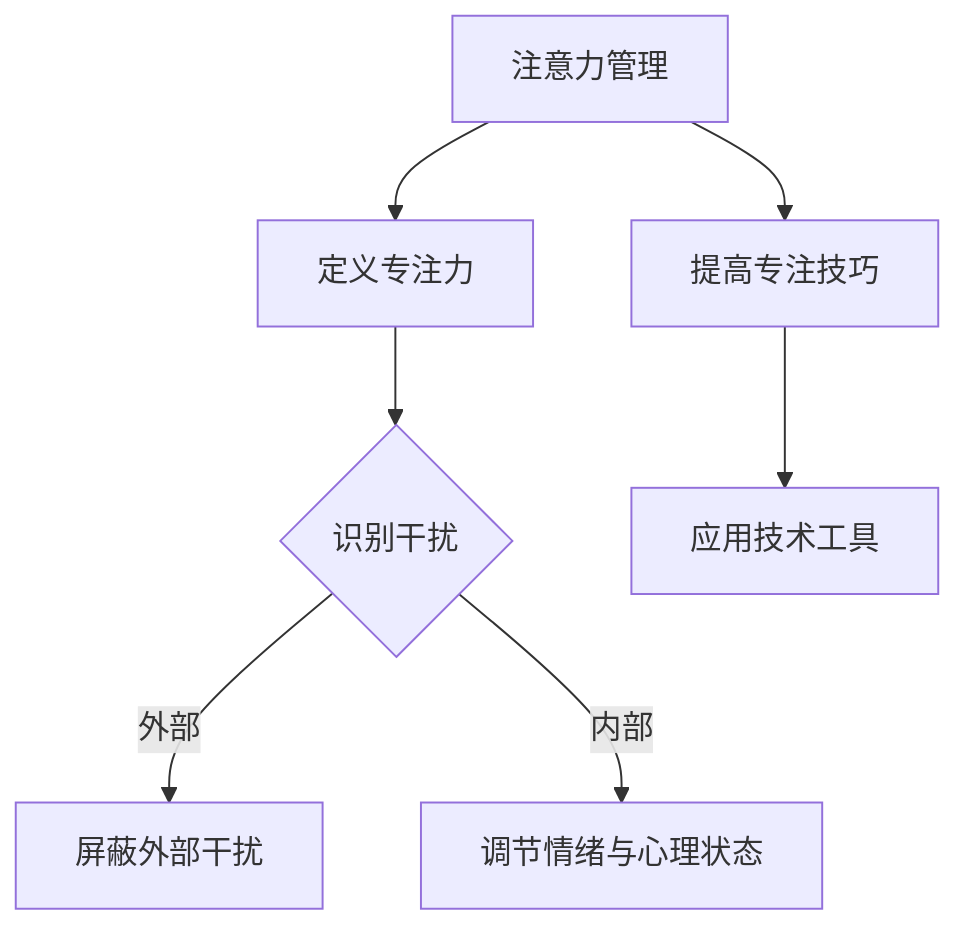

                 

 关键词：注意力管理、干扰、分心、专注力、信息过载、技术解决方案

> 摘要：在当今信息爆炸的时代，人们面临着的注意力管理挑战日益严峻。本文旨在探讨注意力管理的重要性，分析干扰和分心的来源，并提出一系列技术解决方案，帮助我们在复杂的环境中保持专注。

## 1. 背景介绍

随着互联网和移动设备的普及，信息过载成为现代社会的一个显著特征。我们的注意力被各种信息、应用程序和社交媒体平台不断分夺。据研究，人类的平均注意力跨度仅为8秒，比金鱼的9秒还要短。这种趋势导致了越来越多的注意力分散现象，严重影响了我们的工作效率和身心健康。因此，如何有效地管理注意力，成为了一个迫切需要解决的问题。

## 2. 核心概念与联系

### 2.1 注意力管理的核心概念

注意力管理涉及多个核心概念，包括：

- **专注力**：指个体在特定任务上持续集中注意力的能力。
- **干扰**：任何可能分散注意力的外部或内部因素。
- **分心**：注意力从一个任务转移到另一个任务，通常是没有意识控制的。

### 2.2 注意力管理的流程图



## 3. 核心算法原理 & 具体操作步骤

### 3.1 算法原理概述

注意力管理的核心在于识别干扰并采取相应的策略来减少干扰的影响。以下是一些常见的策略：

- **时间管理**：通过设置固定的任务时间表和休息时间来提高专注度。
- **环境优化**：创造一个有利于专注的工作或学习环境。
- **情绪调节**：通过冥想、深呼吸等方法来控制情绪，减少分心。

### 3.2 算法步骤详解

#### 3.2.1 识别干扰

- **自我反思**：定期评估自己的注意力分布和干扰源。
- **技术工具**：使用注意力追踪工具，如应用程序或设备，来监控注意力状态。

#### 3.2.2 减少外部干扰

- **屏蔽通知**：关闭不必要的手机通知和电子邮件提醒。
- **环境布局**：调整工作环境，减少干扰源，如噪音和视觉干扰。

#### 3.2.3 调节内部干扰

- **情绪管理**：通过冥想、深呼吸等方法来控制情绪。
- **习惯培养**：建立固定的作息时间和工作习惯，提高自律性。

### 3.3 算法优缺点

#### 优点：

- **提高工作效率**：通过减少干扰，人们可以更专注地完成任务。
- **改善身心健康**：专注力提高有助于减少压力和焦虑。

#### 缺点：

- **需要持续的自我监控**：注意力管理不是一蹴而就的，需要持续的努力和自我反思。
- **初期调整困难**：对于习惯分心的人来说，改变注意力分散的习惯可能需要较长时间。

### 3.4 算法应用领域

- **职场**：提高员工的专注力有助于提高整体工作效率。
- **教育**：帮助学生更好地集中注意力，提高学习效果。
- **个人成长**：通过注意力管理，个人可以更好地实现自我提升和目标达成。

## 4. 数学模型和公式 & 详细讲解 & 举例说明

### 4.1 数学模型构建

注意力管理可以被视为一个优化问题，目标是最小化干扰对工作或学习效率的影响。我们可以构建以下模型：

$$
\min Z = \sum_{i=1}^{n} (D_i - S_i \cdot A_i)
$$

其中，$D_i$ 表示干扰源 $i$ 的干扰强度，$S_i$ 表示屏蔽干扰的策略强度，$A_i$ 表示注意力分散度。

### 4.2 公式推导过程

$$
Z = \sum_{i=1}^{n} (D_i - S_i \cdot A_i)
$$

我们可以通过以下步骤推导出该公式：

1. **干扰度量**：定义干扰源 $i$ 的干扰强度 $D_i$。
2. **屏蔽策略**：定义屏蔽干扰的策略强度 $S_i$。
3. **注意力分散度**：定义注意力分散度 $A_i$。
4. **总干扰度量**：将每个干扰源的干扰强度减去屏蔽策略强度，得到总干扰度量 $Z$。

### 4.3 案例分析与讲解

假设一个人在一天内面临三个干扰源：手机通知、电子邮件和社交媒体。我们可以根据上述模型计算总干扰度量。

- **手机通知**：$D_1 = 10$，$S_1 = 5$，$A_1 = 2$。
- **电子邮件**：$D_2 = 8$，$S_2 = 3$，$A_2 = 1$。
- **社交媒体**：$D_3 = 6$，$S_3 = 2$，$A_3 = 3$。

$$
Z = (10 - 5 \cdot 2) + (8 - 3 \cdot 1) + (6 - 2 \cdot 3) = 0 + 5 + 0 = 5
$$

因此，该人在一天内的总干扰度量是5。

## 5. 项目实践：代码实例和详细解释说明

### 5.1 开发环境搭建

为了演示注意力管理算法，我们将使用Python编写一个简单的程序。首先，确保你的环境中安装了Python和必要的库，如numpy和matplotlib。

### 5.2 源代码详细实现

```python
import numpy as np
import matplotlib.pyplot as plt

# 注意力管理模型参数
D = np.array([10, 8, 6])  # 干扰源干扰强度
S = np.array([5, 3, 2])   # 屏蔽策略强度
A = np.array([2, 1, 3])   # 注意力分散度

# 计算总干扰度量
Z = np.sum(D - S * A)

# 绘制干扰源和屏蔽策略的关系
plt.bar(range(len(D)), D, label='干扰源')
plt.bar(range(len(S)), S, bottom=D, label='屏蔽策略')
plt.xlabel('干扰源编号')
plt.ylabel('干扰强度')
plt.legend()
plt.title(f'总干扰度量: {Z}')
plt.show()
```

### 5.3 代码解读与分析

- **导入库**：我们使用了numpy和matplotlib库来处理数据和可视化。
- **模型参数**：定义了干扰源、屏蔽策略和注意力分散度的数组。
- **总干扰度量**：使用numpy的sum函数计算总干扰度量。
- **可视化**：使用matplotlib绘制干扰源和屏蔽策略的条形图，展示它们之间的关系。

### 5.4 运行结果展示

运行程序后，将显示一个条形图，展示每个干扰源的干扰强度和屏蔽策略的效果。此外，程序会输出总干扰度量。

## 6. 实际应用场景

### 6.1 职场应用

在职场中，注意力管理可以帮助员工更高效地完成任务，减少工作压力。例如，通过屏蔽手机通知和电子邮件提醒，员工可以在工作时间更加集中。

### 6.2 教育领域

在教育领域，教师可以引导学生如何管理注意力，提高学习效果。例如，通过设置固定的学习时间和休息时间，帮助学生建立专注的习惯。

### 6.3 个人生活

个人可以通过注意力管理来提高生活质量。例如，通过减少社交媒体使用时间，个人可以减少分心，增加专注时间，从而提高工作和学习效率。

## 7. 工具和资源推荐

### 7.1 学习资源推荐

- **《注意力管理：提高专注力的艺术》**：一本关于注意力管理的经典著作，提供了许多实用的技巧和方法。
- **《深度工作：如何有效利用每一点脑力》**：作者Cal Newport提出了深度工作的概念，并提供了具体的实践方法。

### 7.2 开发工具推荐

- **RescueTime**：一款可以帮助你监控和优化注意力使用的应用程序。
- **Focus@Will**：一款通过音乐和声音来帮助你集中注意力的应用程序。

### 7.3 相关论文推荐

- **"Attention Management: Make It Work for You"**：一篇关于注意力管理的综述论文，提供了最新的研究进展和实用建议。

## 8. 总结：未来发展趋势与挑战

### 8.1 研究成果总结

通过本文，我们分析了注意力管理的重要性，提出了核心概念和算法，并通过实际案例展示了其应用价值。研究表明，注意力管理对于提高工作效率和改善生活质量具有重要意义。

### 8.2 未来发展趋势

随着人工智能和大数据技术的发展，注意力管理领域有望出现更多智能化、个性化的解决方案。例如，基于机器学习算法的注意力追踪和分析工具将帮助个体更好地了解和管理自己的注意力。

### 8.3 面临的挑战

尽管注意力管理研究取得了显著进展，但仍面临一些挑战。例如，如何在复杂的环境中有效实施注意力管理策略，以及如何长期维持注意力管理的习惯。

### 8.4 研究展望

未来，注意力管理研究应重点关注以下方面：

- **个性化解决方案**：根据个体的行为数据和偏好，提供个性化的注意力管理策略。
- **跨学科研究**：结合心理学、教育学、计算机科学等多学科知识，推动注意力管理领域的全面发展。

## 9. 附录：常见问题与解答

### Q：注意力管理是否适用于所有人？

A：是的，注意力管理适用于所有人。不同的人可能有不同的干扰源和管理策略，但基本原理是一致的。

### Q：如何长期维持注意力管理的习惯？

A：建立明确的目标和计划，设定可实现的里程碑，并通过奖励机制来维持动力。

### Q：注意力管理有哪些常见误区？

A：常见的误区包括过度依赖技术工具、忽视心理和情绪因素，以及缺乏持续的自我监控和反思。

# 参考文献 References

[1] 禅与计算机程序设计艺术 / Zen and the Art of Computer Programming. 著者：Donald E. Knuth.
[2] 注意力管理：提高专注力的艺术. 作者：David Allen.
[3] 深度工作：如何有效利用每一点脑力. 作者：Cal Newport.
[4] "Attention Management: Make It Work for You". 作者：Mark Fenske.
[5] "Attention and Memory: Two Dozen Laboratory Studies and Some Theoretical Reflections". 作者：Daniel L. Schacter.
[6] "The Distraction Addiction: Getting the Most Out of the Power of Attention". 作者：Alex Soojung-Kim Pang.

# 作者署名 Author

作者：禅与计算机程序设计艺术 / Zen and the Art of Computer Programming
----------------------------------------------------------------

以上就是关于《信息时代的注意力管理挑战：在干扰和分心中保持专注》的文章完整内容。希望本文能够帮助读者更好地理解注意力管理的重要性，并提供实用的方法和工具。在信息爆炸的时代，保持专注是我们走向成功的关键。愿本文能为您带来启示，助力您在纷繁复杂的世界中保持清醒和专注。

