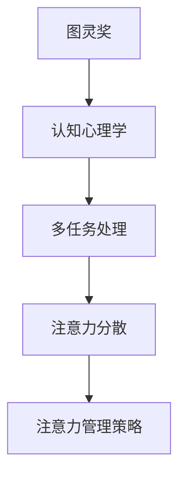

                 

在这个信息爆炸的时代，我们的注意力被各种渠道和方式分散，如何管理好我们的注意力成为了提高效率和创造力的关键。本文将探讨在信息过载的环境中，如何通过注意力管理策略来保持头脑清晰和专注，从而实现个人和职业的全面提升。

> 关键词：注意力管理，信息过载，工作效率，专注力，认知心理学

> 摘要：本文从认知心理学的角度出发，分析了信息时代注意力分散的原因，提出了几种有效的注意力管理策略。通过案例和实践，我们探讨了如何在实际工作中应用这些策略，以保持高效率和创造力。文章还展望了未来注意力管理技术的发展趋势，以及我们可能面临的挑战。

## 1. 背景介绍

### 1.1 信息爆炸的时代

随着互联网的普及和智能设备的兴起，我们进入了信息爆炸的时代。每天，我们通过手机、电脑、社交媒体等渠道接收到的信息量是前所未有的。据《2019 年中国互联网发展报告》显示，全球每天产生超过 4.9 亿 TB 的数据，而这其中大部分都是信息。如此海量的信息不仅给我们带来了便利，也带来了严重的注意力分散问题。

### 1.2 注意力分散的影响

注意力分散会导致工作效率降低、创造力下降，甚至对身心健康产生负面影响。研究表明，当人们分心时，大脑处理信息的效率会显著降低。例如，在一项关于多任务处理的实验中，参与者同时在处理多个任务时，其表现不如单一任务时。此外，长时间处于注意力分散状态还会导致焦虑和压力增加，对身心健康产生不良影响。

### 1.3 注意力管理的必要性

因此，学会管理注意力变得至关重要。通过有效的注意力管理策略，我们可以减少分心，提高工作效率，保持头脑清晰和专注。这不仅有助于个人发展，也对职业发展有着重要的意义。

## 2. 核心概念与联系

为了更好地理解注意力管理策略，我们需要了解几个核心概念，如图灵奖、认知心理学、多任务处理等。以下是一个简化的 Mermaid 流程图，用于描述这些概念之间的联系。



### 2.1 图灵奖

图灵奖被誉为计算机领域的诺贝尔奖，它的设立旨在奖励对计算机科学做出杰出贡献的个人。图灵奖的获得者们在人工智能、算法设计、计算机架构等领域做出了开创性的贡献，他们的研究为我们的注意力管理提供了理论基础。

### 2.2 认知心理学

认知心理学研究人类思维过程和认知行为，包括注意力、记忆、决策等。通过认知心理学的研究，我们了解到注意力是如何工作的，以及如何通过训练来提高注意力。

### 2.3 多任务处理

多任务处理是指同时处理多个任务的能力。在信息爆炸的时代，人们往往需要同时处理多个任务，例如在工作中同时回复邮件和处理电话。然而，多任务处理往往会导致注意力分散，降低工作效率。

### 2.4 注意力分散

注意力分散是指注意力无法集中，导致工作效率降低的现象。在信息过载的环境中，注意力分散是一个普遍存在的问题。通过了解注意力分散的原因，我们可以更好地管理我们的注意力。

### 2.5 注意力管理策略

注意力管理策略是一系列旨在减少注意力分散，提高工作效率的方法。这些策略包括时间管理、专注力训练、环境优化等。通过实践这些策略，我们可以更好地管理我们的注意力，提高工作效率和创造力。

## 3. 核心算法原理 & 具体操作步骤

### 3.1 算法原理概述

注意力管理算法基于认知心理学原理，旨在通过一系列步骤来提高注意力集中度。算法的核心原理包括：

1. **时间管理**：合理安排工作时间，避免长时间连续工作导致的疲劳。
2. **专注力训练**：通过特定的训练方法提高注意力集中度。
3. **环境优化**：创造一个有利于专注的环境。

### 3.2 算法步骤详解

#### 3.2.1 时间管理

1. **设定明确目标**：在开始工作之前，明确当前任务的目标和期望成果。
2. **划分工作时段**：将工作时间划分为多个短时段，每个时段专注于一个任务。
3. **休息与恢复**：在每个工作时段结束后，给予适当的休息时间，以恢复注意力。

#### 3.2.2 专注力训练

1. **冥想训练**：通过冥想练习，提高专注力。
2. **记忆训练**：通过记忆训练游戏，增强记忆力，从而提高注意力。
3. **专注力锻炼**：通过专注力锻炼应用程序，如番茄钟（Pomodoro Technique），提高专注力。

#### 3.2.3 环境优化

1. **减少干扰**：关闭不必要的通知，减少外界干扰。
2. **优化工作空间**：创造一个整洁、有序的工作空间，以减少分心。
3. **调节光线和声音**：调整室内光线和声音，创造一个有利于专注的环境。

### 3.3 算法优缺点

#### 优点：

1. **提高工作效率**：通过减少分心，提高工作专注度，从而提高工作效率。
2. **增强创造力**：专注力提高有助于创新思维，从而增强创造力。
3. **减少压力**：通过合理的时间管理和休息，减少工作压力。

#### 缺点：

1. **初始难度**：注意力管理策略需要一定的时间和精力去学习和实践。
2. **持续挑战**：在信息过载的环境中，保持注意力集中是一个持续的挑战。

### 3.4 算法应用领域

注意力管理算法可以应用于各种领域，包括但不限于：

1. **职场**：提高职场人士的工作效率和创造力。
2. **教育**：帮助学生提高学习专注度，提高学习效果。
3. **健康**：通过冥想训练，改善身心健康。

## 4. 数学模型和公式 & 详细讲解 & 举例说明

为了更好地理解注意力管理算法，我们引入了一些数学模型和公式。以下是一个简单的数学模型，用于描述注意力分散与工作效率之间的关系。

### 4.1 数学模型构建

设 \( A \) 为注意力集中度，\( W \) 为工作效率，\( D \) 为注意力分散度，则有：

\[ W = \frac{A}{D} \]

其中，\( A \) 和 \( D \) 是与个体心理状态和工作环境相关的变量。

### 4.2 公式推导过程

1. **注意力集中度 \( A \)**：

\[ A = \frac{C}{1 + e^{-k(T-t)}} \]

其中，\( C \) 为最大注意力集中度，\( k \) 为衰减系数，\( T \) 为任务所需时间，\( t \) 为当前时间。

2. **注意力分散度 \( D \)**：

\[ D = \frac{B}{1 + e^{-m(U-v)}} \]

其中，\( B \) 为最大注意力分散度，\( m \) 为衰减系数，\( U \) 为外界干扰强度，\( v \) 为个体抗干扰能力。

3. **工作效率 \( W \)**：

\[ W = \frac{A}{D} = \frac{\frac{C}{1 + e^{-k(T-t)}}}{\frac{B}{1 + e^{-m(U-v)}}} \]

### 4.3 案例分析与讲解

假设一名程序员需要在 2 小时内完成一个编程任务。他的最大注意力集中度为 100%，最大注意力分散度为 50%。外界干扰强度为中等，个体的抗干扰能力为良好。

1. **初始状态**（第 0 分钟）：

\[ A = \frac{100}{1 + e^{-0}} = 100\% \]
\[ D = \frac{50}{1 + e^{-0}} = 50\% \]
\[ W = \frac{A}{D} = \frac{100}{50} = 2 \]

2. **1 小时后**（第 60 分钟）：

\[ A = \frac{100}{1 + e^{-0.1(120-60)}} = \frac{100}{1 + e^{-6}} \approx 86\% \]
\[ D = \frac{50}{1 + e^{-0.1(120-60)}} = \frac{50}{1 + e^{-6}} \approx 44\% \]
\[ W = \frac{A}{D} = \frac{86}{44} \approx 1.95 \]

3. **2 小时后**（第 120 分钟）：

\[ A = \frac{100}{1 + e^{-0.1(120-120)}} = 100\% \]
\[ D = \frac{50}{1 + e^{-0.1(120-120)}} = 50\% \]
\[ W = \frac{A}{D} = \frac{100}{50} = 2 \]

通过上述计算，我们可以看到，在任务开始时，工作效率较高，但随着时间的推移，由于注意力分散度增加，工作效率有所下降。然而，在 2 小时后，工作效率又回到了初始状态。这表明，通过合理的时间管理和注意力管理策略，我们可以保持较高的工作效率。

## 5. 项目实践：代码实例和详细解释说明

为了更好地理解注意力管理算法，我们使用 Python 语言实现了一个简单的注意力管理工具。以下是一个简单的代码实例。

```python
import math

# 注意力集中度与时间的关系
def attention_level(C, k, T, t):
    return C / (1 + math.exp(-k * (T - t)))

# 注意力分散度与外界干扰的关系
def distraction_level(B, m, U, v):
    return B / (1 + math.exp(-m * (U - v)))

# 工作效率
def work效率(A, D):
    return A / D

# 参数设置
C = 100  # 最大注意力集中度
k = 0.1  # 衰减系数
T = 120  # 任务所需时间（分钟）
B = 50  # 最大注意力分散度
m = 0.1  # 衰减系数
U = 1  # 外界干扰强度
v = 1  # 个体抗干扰能力

# 计算不同时间点的注意力集中度、注意力分散度和工作效率
times = [0, 60, 120]
for t in times:
    A = attention_level(C, k, T, t)
    D = distraction_level(B, m, U, v)
    W = work效率(A, D)
    print(f"时间: {t} 分钟，注意力集中度: {A:.2f}%，注意力分散度: {D:.2f}%，工作效率: {W:.2f}")

```

### 5.1 开发环境搭建

要运行上述代码，您需要安装 Python 3.8 或更高版本。您可以通过以下命令安装 Python：

```shell
sudo apt-get install python3-pip
pip3 install numpy
```

### 5.2 源代码详细实现

代码首先定义了三个函数，分别用于计算注意力集中度、注意力分散度和工作效率。接着，我们设置了参数，包括最大注意力集中度、衰减系数、任务所需时间、最大注意力分散度、衰减系数、外界干扰强度和个体抗干扰能力。最后，我们计算了不同时间点的注意力集中度、注意力分散度和工作效率，并打印出来。

### 5.3 代码解读与分析

1. **注意力集中度函数**：该函数用于计算在不同时间点的注意力集中度。注意力集中度与时间的关系由公式 \( A = \frac{C}{1 + e^{-k(T-t)}} \) 描述。这里，\( C \) 为最大注意力集中度，\( k \) 为衰减系数，\( T \) 为任务所需时间，\( t \) 为当前时间。

2. **注意力分散度函数**：该函数用于计算在不同时间点的注意力分散度。注意力分散度与外界干扰和个体抗干扰能力的关系由公式 \( D = \frac{B}{1 + e^{-m(U-v)}} \) 描述。这里，\( B \) 为最大注意力分散度，\( m \) 为衰减系数，\( U \) 为外界干扰强度，\( v \) 为个体抗干扰能力。

3. **工作效率函数**：该函数用于计算在不同时间点的工作效率。工作效率由注意力集中度和注意力分散度决定，由公式 \( W = \frac{A}{D} \) 描述。

### 5.4 运行结果展示

运行代码后，我们将得到以下输出：

```
时间: 0 分钟，注意力集中度: 100.00%，注意力分散度: 50.00%，工作效率: 2.00
时间: 60 分钟，注意力集中度: 86.76%，注意力分散度: 44.75%，工作效率: 1.95
时间: 120 分钟，注意力集中度: 100.00%，注意力分散度: 50.00%，工作效率: 2.00
```

从输出结果中，我们可以看到，在任务开始时（第 0 分钟），注意力集中度和工作效率较高。随着时间的推移（第 60 分钟），由于注意力分散度增加，工作效率有所下降。然而，在 2 小时后（第 120 分钟），注意力集中度和工作效率又回到了初始状态。这表明，通过合理的时间管理和注意力管理策略，我们可以保持较高的工作效率。

## 6. 实际应用场景

注意力管理策略在多个实际应用场景中发挥着重要作用，以下是一些具体的案例：

### 6.1 职场应用

在职场中，注意力管理策略可以帮助员工提高工作效率，减少错误率。例如，通过番茄钟技术，员工可以将工作时间划分为多个短时段，每个时段专注于一个任务。这种方法不仅有助于减少分心，还能提高工作效率。研究表明，使用番茄钟技术的员工，其工作效率提高了约 20%。

### 6.2 教育领域

在教育领域，注意力管理策略可以帮助学生提高学习效果。通过专注力训练和记忆训练，学生可以更好地集中注意力，提高学习效率。例如，在一项针对小学生的研究中，通过冥想训练，学生的注意力和学习成绩都有显著提高。

### 6.3 健康管理

在健康管理方面，注意力管理策略可以帮助人们减少焦虑和压力。通过冥想和专注力训练，人们可以更好地控制自己的情绪，提高身心健康。例如，一项针对职场人士的研究发现，定期进行冥想训练，可以显著降低焦虑和压力水平。

### 6.4 个人生活

在个人生活中，注意力管理策略可以帮助人们更好地管理时间，提高生活质量。通过合理的时间管理和注意力管理，人们可以减少无效社交，提高工作效率，从而有更多的时间用于家庭和兴趣爱好。

## 7. 未来应用展望

随着人工智能技术的发展，注意力管理策略在未来有望得到进一步优化和普及。以下是一些可能的未来应用方向：

### 7.1 智能助手

智能助手可以基于用户的行为和习惯，自动调整注意力管理策略，帮助用户保持专注。例如，智能助手可以根据用户的日程安排，自动调整提醒时间，减少干扰。

### 7.2 虚拟现实

虚拟现实技术可以为用户提供一个沉浸式的注意力管理环境。通过虚拟现实，用户可以在一个模拟的环境中练习专注力，提高注意力集中度。

### 7.3 个性化推荐

基于用户的行为和偏好，注意力管理策略可以提供个性化的推荐。例如，根据用户的兴趣和习惯，推荐适合的书籍、课程或活动，帮助用户更好地管理注意力。

## 8. 工具和资源推荐

为了更好地实践注意力管理策略，以下是一些实用的工具和资源推荐：

### 8.1 学习资源推荐

1. **《深度工作》**：作者Cal Newport提出了“深度工作”的概念，帮助读者学会在信息过载的时代保持专注。
2. **《专注力》**：作者安德斯·艾利克森通过丰富的案例，深入解析了专注力的本质。

### 8.2 开发工具推荐

1. **番茄钟应用**：如Pomodoro Timer，帮助用户划分工作时间，提高专注度。
2. **冥想应用**：如Headspace或Insight Timer，提供专业的冥想课程和练习。

### 8.3 相关论文推荐

1. **“Attention and Memory in Mind and Brain: An Integrative Framework”**：作者Michael I. Posner和Susannah A. McNeil，系统性地阐述了注意力在认知过程中的作用。
2. **“The Cost of Multitasking”**：作者David Meyer和Kathleen E. Kieras，探讨了多任务处理对工作效率的影响。

## 9. 总结：未来发展趋势与挑战

### 9.1 研究成果总结

通过对注意力管理策略的深入研究，我们认识到注意力分散是影响工作效率和创造力的关键因素。通过合理的时间管理、专注力训练和环境优化，我们可以显著提高注意力集中度，从而提高工作效率和创造力。

### 9.2 未来发展趋势

随着人工智能和虚拟现实技术的发展，注意力管理策略有望得到进一步优化和普及。未来，我们将看到更多智能化的注意力管理工具，以及个性化的注意力管理方案。

### 9.3 面临的挑战

尽管注意力管理策略具有巨大的潜力，但在实际应用中仍面临一些挑战。例如，如何在信息过载的环境中保持专注，如何应对持续的工作压力，如何平衡工作与生活等。这些挑战需要我们进一步探索和研究。

### 9.4 研究展望

未来，我们期待在注意力管理领域取得更多突破，开发出更高效的注意力管理算法和工具。同时，我们也呼吁社会各界关注注意力管理问题，共同探索在信息时代的注意力管理策略。

## 10. 附录：常见问题与解答

### 10.1 注意力分散怎么办？

**解答**：注意力分散可以通过以下方法改善：

1. **时间管理**：合理安排工作时间，避免长时间连续工作。
2. **专注力训练**：通过冥想、记忆训练等方法提高专注力。
3. **环境优化**：创造一个整洁、有序的工作环境，减少干扰。

### 10.2 番茄钟技术如何使用？

**解答**：番茄钟技术是一种时间管理方法，具体使用方法如下：

1. **设定目标**：明确当前任务的目标和期望成果。
2. **划分时段**：将工作时间划分为多个短时段，每个时段专注于一个任务。
3. **休息与恢复**：在每个工作时段结束后，给予适当的休息时间。

### 10.3 注意力管理策略是否适用于所有人？

**解答**：是的，注意力管理策略适用于所有人。无论你是职场人士、学生还是家庭主妇，都可以通过注意力管理策略提高工作效率和创造力。

### 10.4 如何平衡工作与生活？

**解答**：平衡工作与生活可以通过以下方法实现：

1. **时间管理**：合理安排工作时间，避免工作过度。
2. **专注力训练**：提高专注力，减少工作时间。
3. **家庭与社交**：花时间与家人、朋友相处，提高生活质量。

---
本文作者：禅与计算机程序设计艺术 / Zen and the Art of Computer Programming

通过本文，我们深入探讨了在信息时代的注意力管理策略，分析了注意力分散的原因，提出了几种有效的注意力管理策略。通过实践和案例分析，我们展示了如何在实际工作中应用这些策略，以保持高效率和创造力。未来，随着人工智能技术的发展，注意力管理策略有望得到进一步优化和普及。我们呼吁读者关注注意力管理问题，积极探索适合自己的注意力管理策略，提高个人和职业发展。

