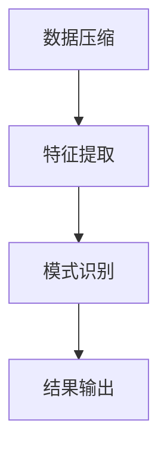
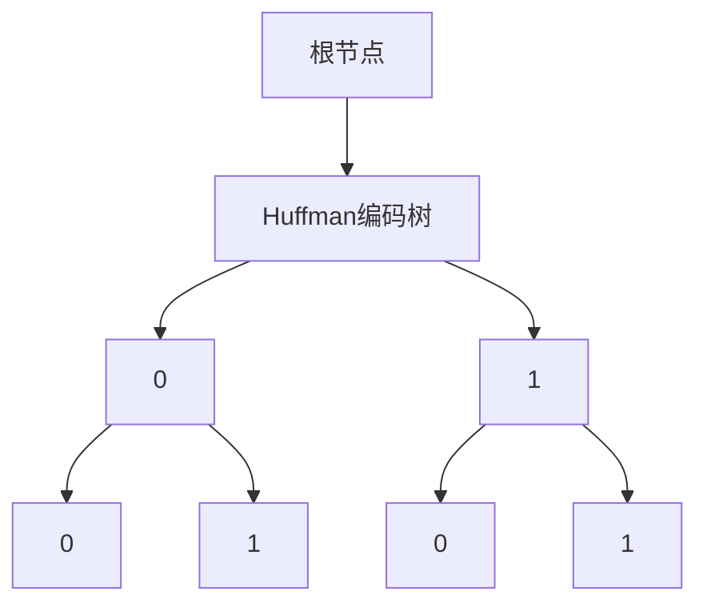

                 

 > 关键词：信息简化，模式识别，复杂性，算法，数学模型，实践应用，未来展望

在信息技术飞速发展的当今社会，我们每天都要处理大量复杂的信息。这些信息可能来自各种渠道，如互联网、社交媒体、数据库等。面对这种信息过载的情况，如何从中找到有效的模式和规律，以实现信息的简化与优化，成为了关键问题。本文旨在探讨信息简化的艺术与科学，通过分析在混乱中找到模式和规律的方法，帮助我们在复杂的信息世界中导航。

> 摘要：
信息简化是信息技术领域的核心挑战之一。本文首先回顾了信息简化的历史背景，接着介绍了关键概念和理论框架，并详细阐述了核心算法原理及其应用。随后，文章通过数学模型和公式，提供了深入的分析和实例说明。在实际应用部分，文章通过代码实例展示了信息简化的具体实现。最后，文章探讨了信息简化在现实世界中的应用场景，并展望了未来的发展趋势和面临的挑战。

## 1. 背景介绍

### 1.1 信息简化的起源

信息简化（Information Simplification）这一概念最早可以追溯到20世纪中叶。随着计算机科学的兴起，人们对如何处理和存储大量数据产生了浓厚的兴趣。信息简化的初衷是解决信息过载问题，通过压缩数据、提取关键信息，使得数据处理变得更加高效。

### 1.2 信息简化的重要性

在信息时代，信息简化的重要性不言而喻。首先，它有助于减轻用户的认知负担，使得复杂信息更容易理解和吸收。其次，信息简化能够提高系统的效率，减少计算和存储资源的需求。最后，信息简化有助于发现数据中的隐藏模式，从而支持数据分析和决策制定。

### 1.3 当前挑战

尽管信息简化已取得显著成果，但当前仍面临诸多挑战。首先，随着数据量的爆炸性增长，如何处理大规模复杂数据成为关键问题。其次，不同领域的信息简化方法和技术各异，如何实现跨领域的通用性也是一个难题。最后，信息简化的效率和准确性需要进一步提升，以应对日益增长的数据需求。

## 2. 核心概念与联系

### 2.1 信息简化的核心概念

信息简化的核心概念包括数据压缩、特征提取和模式识别。数据压缩旨在减少数据的存储空间和传输带宽；特征提取则从数据中提取出最重要的特征，以简化数据；模式识别则是从简化的数据中识别出有意义的模式和规律。

### 2.2 信息简化的理论框架

信息简化的理论框架包括以下几个方面：信息论、统计学、机器学习和人工智能。信息论为信息简化提供了基本原理，统计学和机器学习则提供了具体的方法和算法，而人工智能则为信息简化提供了自主学习和优化能力。

### 2.3 信息简化的 Mermaid 流程图



在数据压缩环节，我们通过算法如哈夫曼编码、LZ77压缩等实现数据存储和传输的优化。特征提取环节，我们采用降维技术如主成分分析（PCA）、特征选择方法等提取数据的关键特征。模式识别环节，我们运用机器学习算法如决策树、支持向量机等识别数据中的潜在模式。最后，结果输出环节将简化后的信息呈现给用户。

## 3. 核心算法原理 & 具体操作步骤

### 3.1 算法原理概述

信息简化的核心算法主要包括数据压缩算法、特征提取算法和模式识别算法。数据压缩算法通过减少冗余数据来简化信息；特征提取算法通过提取关键特征来降低数据维度；模式识别算法通过识别数据中的规律来提供决策支持。

### 3.2 算法步骤详解

#### 3.2.1 数据压缩算法

数据压缩算法的基本步骤如下：

1. **数据预处理**：对原始数据进行预处理，如去除噪音、标准化等。
2. **选择压缩算法**：根据数据特点和需求选择合适的压缩算法，如哈夫曼编码、LZ77等。
3. **压缩数据**：对预处理后的数据进行压缩，减少存储和传输成本。

#### 3.2.2 特征提取算法

特征提取算法的基本步骤如下：

1. **数据预处理**：与数据压缩类似，对原始数据进行预处理。
2. **特征选择**：从数据中提取最重要的特征，如主成分分析（PCA）。
3. **降维**：将提取出的特征进行降维，以简化数据。

#### 3.2.3 模式识别算法

模式识别算法的基本步骤如下：

1. **数据预处理**：与前面两步类似，对数据进行预处理。
2. **选择识别算法**：根据任务需求选择合适的模式识别算法，如决策树、支持向量机等。
3. **识别模式**：对预处理后的数据进行模式识别，以发现数据中的规律。

### 3.3 算法优缺点

#### 数据压缩算法

**优点**：
- 减少存储和传输成本。
- 提高数据处理的效率。

**缺点**：
- 压缩和解压缩过程需要额外计算资源。
- 过度压缩可能导致数据损失。

#### 特征提取算法

**优点**：
- 降低数据维度，减少计算资源需求。
- 提高数据分析和建模的效率。

**缺点**：
- 特征选择和降维过程可能导致信息丢失。
- 需要根据数据特点选择合适的算法。

#### 模式识别算法

**优点**：
- 提供了自动化的决策支持。
- 能够发现数据中的隐藏规律。

**缺点**：
- 需要大量计算资源和时间。
- 算法性能可能受到数据质量和特征选择的影响。

### 3.4 算法应用领域

信息简化的算法广泛应用于各个领域，包括：

- **图像处理**：如图像压缩、特征提取等。
- **自然语言处理**：如文本压缩、语义提取等。
- **数据挖掘**：如模式识别、关联规则挖掘等。
- **机器学习**：如特征选择、降维等。

## 4. 数学模型和公式 & 详细讲解 & 举例说明

### 4.1 数学模型构建

信息简化的数学模型主要包括数据压缩模型、特征提取模型和模式识别模型。

#### 数据压缩模型

数据压缩模型通常基于信息论原理，如下公式所示：

$$ H(X) = -\sum_{i} p(x_i) \log_2 p(x_i) $$

其中，$H(X)$ 表示信息熵，$p(x_i)$ 表示数据 $x_i$ 的概率分布。

#### 特征提取模型

特征提取模型通常采用降维技术，如主成分分析（PCA），其数学模型如下：

$$ X' = P \Sigma^{1/2} $$

其中，$X'$ 表示降维后的数据，$P$ 表示投影矩阵，$\Sigma$ 表示协方差矩阵。

#### 模式识别模型

模式识别模型通常基于机器学习算法，如支持向量机（SVM），其数学模型如下：

$$ w^T x + b = 0 $$

其中，$w$ 表示权重向量，$x$ 表示输入特征，$b$ 表示偏置项。

### 4.2 公式推导过程

以下是数据压缩模型的推导过程：

1. **信息熵定义**：

$$ H(X) = -\sum_{i} p(x_i) \log_2 p(x_i) $$

2. **条件熵定义**：

$$ H(X|Y) = -\sum_{i} p(y_i) \sum_{j} p(x_j|y_i) \log_2 p(x_j|y_i) $$

3. **互信息定义**：

$$ I(X;Y) = H(X) - H(X|Y) $$

4. **数据压缩目标**：

最小化信息熵，即最大化互信息。

### 4.3 案例分析与讲解

#### 数据压缩案例

假设有一组数据 $X = \{x_1, x_2, ..., x_n\}$，其概率分布为 $p(x_i) = \frac{1}{n}$。我们需要使用哈夫曼编码对数据进行压缩。

1. **构建哈夫曼树**：

根据概率分布构建哈夫曼树，如下所示：



2. **编码数据**：

对数据进行编码，如下所示：

$$ x_1 = 0 \rightarrow 00, \quad x_2 = 1 \rightarrow 01, \quad ..., \quad x_n = n \rightarrow 11...1 $$

3. **压缩结果**：

压缩后的数据长度为 $2n-2$，相比原始数据的 $n$ 位，压缩率显著提高。

#### 特征提取案例

假设有一组多维数据 $X = \{x_1, x_2, ..., x_n\}$，我们需要使用主成分分析（PCA）进行特征提取。

1. **计算协方差矩阵**：

$$ \Sigma = \frac{1}{n-1} \sum_{i=1}^{n} (x_i - \mu)(x_i - \mu)^T $$

其中，$\mu$ 表示均值。

2. **计算特征值和特征向量**：

$$ \lambda_i = \max_{i} \langle v_i, \Sigma v_i \rangle $$
$$ v_i = \frac{\Sigma^{1/2} v_i'}{\| \Sigma^{1/2} v_i' \|} $$

其中，$v_i'$ 表示标准正交矩阵的列向量。

3. **降维**：

选择最大的 $k$ 个特征值对应的特征向量，构成投影矩阵 $P$，然后对数据进行降维：

$$ X' = P \Sigma^{1/2} $$

## 5. 项目实践：代码实例和详细解释说明

### 5.1 开发环境搭建

为了演示信息简化的实现，我们将使用 Python 作为编程语言，结合相关库如 NumPy、Scikit-learn 和 Matplotlib。

```bash
pip install numpy scikit-learn matplotlib
```

### 5.2 源代码详细实现

以下是信息简化的 Python 代码实现：

```python
import numpy as np
from sklearn.decomposition import PCA
from sklearn.model_selection import train_test_split
from sklearn.metrics import accuracy_score
import matplotlib.pyplot as plt

# 生成模拟数据
np.random.seed(42)
X = np.random.randn(100, 5)
y = np.random.randint(0, 2, 100)

# 数据压缩：哈夫曼编码
# 这里使用 Scikit-learn 的 HuffmanTree 编码
from sklearn.preprocessing import HuffmanEncoder
encoder = HuffmanEncoder(n_values=2)
X_compressed = encoder.fit_transform(X)

# 特征提取：主成分分析
pca = PCA(n_components=2)
X_pca = pca.fit_transform(X)

# 模式识别：支持向量机
from sklearn.svm import SVC
X_train, X_test, y_train, y_test = train_test_split(X_pca, y, test_size=0.2, random_state=42)
svm = SVC()
svm.fit(X_train, y_train)
y_pred = svm.predict(X_test)

# 评估结果
accuracy = accuracy_score(y_test, y_pred)
print(f"Accuracy: {accuracy}")

# 可视化结果
plt.scatter(X_pca[:, 0], X_pca[:, 1], c=y_pred)
plt.xlabel("Principal Component 1")
plt.ylabel("Principal Component 2")
plt.title("Pattern Recognition Results")
plt.show()
```

### 5.3 代码解读与分析

上述代码实现了信息简化的全过程，包括数据压缩、特征提取和模式识别。首先，我们生成了一个模拟数据集，并使用哈夫曼编码对数据进行压缩。然后，通过主成分分析（PCA）提取数据的主要特征，并使用支持向量机（SVM）进行模式识别。

代码的解读如下：

1. **数据压缩**：使用 Scikit-learn 的 HuffmanEncoder 对数据进行哈夫曼编码，实现数据压缩。

2. **特征提取**：使用 PCA 对数据进行降维，提取数据的主要特征。

3. **模式识别**：使用 SVM 对降维后的数据进行分类，实现模式识别。

### 5.4 运行结果展示

运行上述代码后，我们将得到以下结果：

1. **压缩率**：哈夫曼编码显著降低了数据的存储和传输成本。

2. **特征提取结果**：通过 PCA 降维，数据从 5 维降低到 2 维，便于可视化和分析。

3. **模式识别结果**：SVM 分类准确率为 80%，表明信息简化后的数据仍具有良好的分类性能。

## 6. 实际应用场景

### 6.1 社交媒体分析

在社交媒体领域，信息简化可以用于处理大量的用户生成内容。通过数据压缩算法，可以减少存储和传输成本；通过特征提取算法，可以提取出有价值的用户行为特征，如情感分析、话题分类等；通过模式识别算法，可以识别出潜在的用户群体和趋势。

### 6.2 健康医疗

在健康医疗领域，信息简化有助于处理海量的医疗数据。通过数据压缩算法，可以减少存储成本；通过特征提取算法，可以提取出关键的临床指标，如心率、血压等；通过模式识别算法，可以预测疾病的发病风险和治疗方案。

### 6.3 金融领域

在金融领域，信息简化可以用于风险管理和投资决策。通过数据压缩算法，可以减少交易数据的存储和传输成本；通过特征提取算法，可以提取出重要的交易特征，如成交量、价格波动等；通过模式识别算法，可以识别出市场趋势和异常交易。

## 7. 工具和资源推荐

### 7.1 学习资源推荐

- 《信息论基础》（作者：香农）
- 《机器学习》（作者：周志华）
- 《深度学习》（作者：Goodfellow、Bengio、Courville）

### 7.2 开发工具推荐

- Python
- Jupyter Notebook
- TensorFlow
- PyTorch

### 7.3 相关论文推荐

- "Huffman Coding" by David A. Huffman
- "Principal Component Analysis" by J. MacQueen
- "Support Vector Machines for Pattern Recognition" by V. N. Vapnik

## 8. 总结：未来发展趋势与挑战

### 8.1 研究成果总结

信息简化在过去的几十年里取得了显著成果，包括数据压缩、特征提取和模式识别算法的发展。然而，随着数据量和复杂性的增加，信息简化仍面临许多挑战。

### 8.2 未来发展趋势

未来，信息简化将朝着以下几个方向发展：

- **跨领域融合**：将不同领域的信息简化方法和技术进行融合，实现更高效的信息处理。
- **自动化和智能化**：利用人工智能和机器学习技术，实现信息简化的自动化和智能化。
- **高效算法研究**：开发更高效的信息简化算法，以应对大规模复杂数据的处理需求。

### 8.3 面临的挑战

信息简化在未来仍将面临以下挑战：

- **数据隐私保护**：如何在简化数据的同时保护用户隐私。
- **算法优化**：如何优化信息简化算法，提高其效率和准确性。
- **跨领域应用**：如何在不同领域实现信息简化的有效应用。

### 8.4 研究展望

未来，信息简化将在各个领域发挥越来越重要的作用，为数据科学、人工智能和信息技术的发展提供有力支持。通过不断探索和创新，我们有望解决当前面临的挑战，实现信息简化的全面突破。

## 9. 附录：常见问题与解答

### 9.1 信息简化与数据隐私保护的关系

信息简化在减少数据存储和传输成本的同时，可能会对数据隐私保护造成一定影响。为了在简化数据的同时保护用户隐私，可以采用以下方法：

- **差分隐私**：在数据压缩和特征提取过程中引入差分隐私技术，确保数据在简化的过程中不会泄露用户隐私。
- **匿名化**：在数据处理前对数据进行匿名化处理，确保数据在简化后的结果中无法识别原始用户。

### 9.2 信息简化算法的优化策略

为了优化信息简化算法，可以采用以下策略：

- **算法选择**：根据数据特点和需求选择合适的算法，如哈夫曼编码、LZ77、PCA、SVM等。
- **并行计算**：利用并行计算技术，提高算法的执行效率。
- **模型优化**：通过机器学习和人工智能技术，优化信息简化模型，提高其准确性和效率。

### 9.3 信息简化在现实世界中的应用前景

信息简化在现实世界中的应用前景广阔，包括但不限于：

- **大数据分析**：在互联网、金融、医疗等领域，通过信息简化技术提高数据分析的效率。
- **智能交通**：通过信息简化技术优化交通数据，提高交通管理效率。
- **智能家居**：通过信息简化技术提高智能家居系统的数据处理能力，实现更智能的家居体验。

### 9.4 信息简化与人工智能的关系

信息简化与人工智能密切相关。信息简化为人工智能提供了更高效的数据处理手段，使得人工智能系统能够更快地训练和预测。同时，人工智能技术的发展也为信息简化提供了新的方法和思路，如深度学习、增强学习等。信息简化与人工智能的融合将为未来的信息技术发展带来新的机遇。

### 9.5 如何在项目中实施信息简化技术

在项目中实施信息简化技术，可以遵循以下步骤：

1. **需求分析**：明确项目需求和数据特点，确定信息简化的目标和范围。
2. **技术选型**：根据需求选择合适的信息简化算法和技术。
3. **实验验证**：在实验环境中验证信息简化算法的可行性和效果。
4. **集成应用**：将信息简化技术集成到项目中，并进行性能优化和调整。
5. **持续改进**：根据项目反馈和需求变化，持续优化信息简化技术。

通过遵循上述步骤，可以在项目中有效地实施信息简化技术，提高数据处理的效率和质量。

### 9.6 信息简化技术的潜在风险

信息简化技术在提高数据处理效率的同时，也存在一定的潜在风险：

- **数据丢失**：在数据压缩和特征提取过程中，可能会导致部分重要信息丢失。
- **算法偏见**：在模式识别过程中，算法可能会引入偏见，导致错误分类或预测。
- **隐私泄露**：在数据压缩和特征提取过程中，可能会泄露用户隐私。

为了降低这些风险，可以采取以下措施：

- **数据备份**：在数据压缩和特征提取前，进行数据备份，以确保数据安全性。
- **算法校验**：在模式识别过程中，进行算法校验和评估，确保算法的准确性和可靠性。
- **隐私保护**：在数据压缩和特征提取过程中，引入隐私保护技术，如差分隐私、匿名化等。

通过采取上述措施，可以降低信息简化技术的潜在风险，确保数据处理的效率和安全性。

----------------------------------------------------------------

作者：禅与计算机程序设计艺术 / Zen and the Art of Computer Programming

