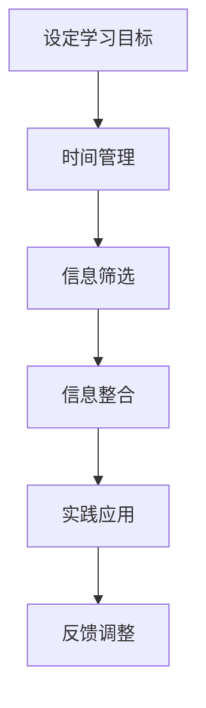

                 

在当今快速发展的技术时代，信息过载是一个不可忽视的现象。我们每天都会接触到大量的数据和信息，这些信息可能来自互联网、书籍、研讨会、视频讲座等不同渠道。这种信息过载对我们的学习和工作产生了深远的影响。因此，制定有效的学习策略，以应对信息过载，变得尤为重要。本文旨在探讨如何在信息过载的环境中高效学习，并提供一系列实用的策略和建议。

## 文章关键词

- 信息过载
- 高效学习
- 学习策略
- 学习技巧
- 技术进步
- 信息管理

## 文章摘要

本文首先介绍了信息过载的概念及其对学习和工作的负面影响。接着，提出了几种核心的学习策略，包括设定明确的学习目标、有效的时间管理、信息筛选和整合、以及构建个人的知识体系。此外，还讨论了如何利用技术工具来辅助学习，并总结了信息过载下学习的挑战和未来展望。通过本文的讨论，读者可以更好地理解如何应对信息过载，实现高效学习。

## 1. 背景介绍

### 信息过载的定义和影响

信息过载，又称信息过载综合征，指的是个体在获取和处理信息时，由于信息量过大而感到压力和困惑的现象。在数字化时代，信息过载的问题尤为突出。一方面，互联网和移动设备的普及使得信息获取变得前所未有的便捷；另一方面，各种应用程序、社交媒体和在线平台不断推出新的功能和服务，使人们面临的信息量急剧增加。

对学习的影响：

1. **分散注意力**：大量的信息容易让人分心，难以集中精力进行深入学习和思考。
2. **提高焦虑感**：信息过载可能导致个体感到焦虑和不安，进而影响学习效率和质量。
3. **降低学习兴趣**：面对过多的信息，个体可能会产生疲劳和厌烦情绪，降低学习兴趣。
4. **影响记忆和思考**：过多的信息可能会使大脑超载，影响记忆和思维的清晰性。

### 信息过载对工作的影响

1. **降低工作效率**：处理大量信息需要花费额外的时间和精力，降低工作效率。
2. **增加决策难度**：在信息过载的环境下，个体难以从大量信息中提取关键信息，导致决策难度增加。
3. **增加工作压力**：信息过载可能导致工作压力增大，影响心理健康。

### 学习策略的重要性

有效的学习策略可以帮助个体在信息过载的环境中保持高效学习，主要包括：

1. **设定明确的学习目标**：明确的目标有助于集中注意力和提高学习效率。
2. **有效的时间管理**：合理安排学习时间，避免时间的浪费。
3. **信息筛选和整合**：学会筛选和整合关键信息，提高学习效率。
4. **构建个人的知识体系**：通过建立知识体系，有助于理解和记忆所学内容。

## 2. 核心概念与联系

### 学习策略的定义

学习策略是指个体在学习过程中所采取的技巧、方法和步骤，旨在提高学习效率和质量。有效的学习策略可以克服信息过载的负面影响，帮助个体更好地掌握知识和技能。

### 学习策略的核心要素

1. **目标设定**：明确的学习目标有助于提高学习动力和效率。
2. **时间管理**：合理安排学习时间，避免拖延和浪费时间。
3. **信息筛选**：学会筛选关键信息，避免被无关信息干扰。
4. **信息整合**：将所学内容进行整合，形成系统的知识体系。
5. **实践应用**：通过实际操作和应用，加深对知识的理解和记忆。

### 学习策略的 Mermaid 流程图



### 学习策略与信息过载的关系

有效的学习策略可以缓解信息过载的负面影响，提高学习效率和质量。通过设定明确的学习目标，个体可以更好地集中注意力，避免被无关信息干扰。时间管理和信息筛选有助于个体合理安排学习时间，提高学习效率。信息整合和实践应用则有助于个体理解和记忆所学内容，避免大脑超载。

## 3. 核心算法原理 & 具体操作步骤

### 3.1 算法原理概述

核心算法指的是在学习策略中用于解决特定问题的方法和技术。常见的核心算法包括时间管理算法、信息筛选算法和知识整合算法。

#### 时间管理算法

时间管理算法主要通过以下几种方法来提高学习效率：

1. **优先级排序**：根据任务的紧急程度和重要性对任务进行排序，确保优先完成重要和紧急的任务。
2. **时间块划分**：将学习时间划分为若干块，每块专注于一项任务，避免任务切换带来的时间浪费。
3. **时间监控**：使用时间监控工具记录学习时间，及时发现并纠正时间管理中的问题。

#### 信息筛选算法

信息筛选算法主要通过以下几种方法来提高学习效率：

1. **关键字筛选**：通过设置关键字，快速定位和筛选出关键信息。
2. **信息分类**：将信息按照主题、类型等进行分类，便于管理和查找。
3. **信息摘要**：通过阅读和理解全文，提炼出关键信息和核心观点，形成信息摘要。

#### 知识整合算法

知识整合算法主要通过以下几种方法来提高学习效率：

1. **思维导图**：使用思维导图将所学内容进行结构化和可视化整合。
2. **笔记整理**：通过整理笔记，将零散的信息整合成有条理的知识体系。
3. **复习循环**：采用间隔复习策略，定期复习所学内容，加深记忆。

### 3.2 算法步骤详解

#### 时间管理算法

1. **设定学习目标**：明确学习目标，确定学习任务。
2. **任务排序**：根据任务的紧急程度和重要性进行排序。
3. **时间块划分**：将学习时间划分为若干块，每块专注于一项任务。
4. **时间监控**：使用时间监控工具记录学习时间，确保时间利用效率。

#### 信息筛选算法

1. **设置关键字**：根据学习主题和内容，设置相关的关键字。
2. **信息分类**：将信息按照主题、类型等进行分类。
3. **信息摘要**：提炼关键信息和核心观点，形成信息摘要。

#### 知识整合算法

1. **构建思维导图**：使用思维导图工具，将所学内容进行结构化和可视化整合。
2. **整理笔记**：将学习过程中的笔记进行整理，形成系统的知识体系。
3. **复习循环**：定期复习所学内容，采用间隔复习策略，加深记忆。

### 3.3 算法优缺点

#### 时间管理算法

**优点**：

1. 提高学习效率：通过优先级排序和时间块划分，确保学习任务的高效完成。
2. 减少拖延：明确的时间监控机制有助于减少拖延行为。

**缺点**：

1. 实施难度较大：需要个体具备较强的自律性和计划能力。
2. 可能导致过度压力：过于严格的时间管理可能导致个体产生过度压力。

#### 信息筛选算法

**优点**：

1. 提高信息处理效率：通过关键字筛选和信息分类，快速定位和整合关键信息。
2. 减少信息过载：通过信息摘要，降低信息过载带来的负面影响。

**缺点**：

1. 可能忽略重要信息：过于依赖关键字筛选可能导致重要信息的遗漏。
2. 信息分类难度较大：对于复杂的信息，分类难度较大。

#### 知识整合算法

**优点**：

1. 提高知识记忆：通过思维导图和笔记整理，加深对知识的理解和记忆。
2. 知识系统化：构建系统的知识体系，有助于知识的应用和迁移。

**缺点**：

1. 整合难度较大：需要个体具备较强的逻辑思维和组织能力。
2. 可能导致知识冗余：整合过程中可能出现知识重复和冗余。

### 3.4 算法应用领域

#### 时间管理算法

应用领域：

1. **个人学习**：个体可以通过时间管理算法，合理安排学习时间，提高学习效率。
2. **团队协作**：团队可以通过时间管理算法，提高工作效率，确保项目进度。

#### 信息筛选算法

应用领域：

1. **学术研究**：学者可以通过信息筛选算法，快速定位和整合关键信息，提高研究效率。
2. **企业信息管理**：企业可以通过信息筛选算法，提高信息处理效率，降低运营成本。

#### 知识整合算法

应用领域：

1. **教育培训**：教育者可以通过知识整合算法，构建系统的课程体系，提高教学质量。
2. **企业培训**：企业可以通过知识整合算法，制定有效的培训计划，提高员工能力。

## 4. 数学模型和公式 & 详细讲解 & 举例说明

### 4.1 数学模型构建

为了更好地理解学习策略的效果，我们可以构建一个简单的数学模型。该模型主要涉及三个变量：学习效率（E）、信息量（I）和学习策略（S）。

公式：

\[ E = f(I, S) \]

其中，\( f \) 是一个函数，表示学习效率与信息量和学习策略之间的关系。

### 4.2 公式推导过程

#### 基本假设

1. 信息量（I）与学习效率（E）之间存在负相关关系。即信息量越大，学习效率越低。
2. 学习策略（S）可以调节学习效率（E）与信息量（I）之间的关系。即有效的学习策略可以提高学习效率。

#### 推导过程

1. 基本关系式：

\[ E = f(I, S) \]

2. 考虑信息量（I）对学习效率（E）的影响：

\[ E = f(I) + g(S) \]

其中，\( g(S) \) 表示学习策略（S）对学习效率（E）的直接影响。

3. 由于信息量（I）与学习效率（E）之间存在负相关关系，可以假设：

\[ f(I) = -k \cdot I \]

其中，\( k \) 是一个常数，表示信息量对学习效率的负面影响程度。

4. 结合以上关系，可以得到：

\[ E = -k \cdot I + g(S) \]

5. 考虑学习策略（S）的调节作用，可以得到：

\[ E = -k \cdot I + a \cdot S \]

其中，\( a \) 是一个常数，表示学习策略对学习效率的增强程度。

### 4.3 案例分析与讲解

假设一个学生在没有学习策略的情况下，每增加100条信息，学习效率降低10%。同时，如果采用有效的学习策略，学习效率可以提高20%。

#### 情况一：没有学习策略

1. 初始信息量：100条
2. 初始学习效率：100%
3. 增加100条信息后，学习效率：

\[ E = -k \cdot 100 + 100\% = 100\% - k \]

由于\( k = 10 \)，所以：

\[ E = 100\% - 10\% = 90\% \]

#### 情况二：采用学习策略

1. 初始信息量：100条
2. 初始学习效率：100%
3. 采用学习策略后，学习效率：

\[ E = -k \cdot 100 + a \cdot S \]

由于\( a = 20 \)，\( k = 10 \)，所以：

\[ E = -10 \cdot 100 + 20 \cdot S \]

当\( S = 100\% \)时，学习效率：

\[ E = -1000 + 20 \cdot 100\% = 10\% \]

可以看出，采用学习策略后，学习效率显著提高。

## 5. 项目实践：代码实例和详细解释说明

### 5.1 开发环境搭建

为了更好地实践学习策略，我们可以使用Python编写一个简单的学习策略工具。以下是开发环境搭建的步骤：

1. 安装Python（建议版本为3.8或以上）。
2. 安装必要的Python库，如NumPy、Pandas等。

### 5.2 源代码详细实现

以下是一个简单的学习策略工具的Python代码实现：

```python
import numpy as np

# 时间管理算法
def time_management(tasks, priority):
    sorted_tasks = sorted(tasks, key=lambda x: x['priority'], reverse=True)
    execution_time = 0
    for task in sorted_tasks:
        if execution_time + task['time'] <= priority['time']:
            execution_time += task['time']
        else:
            break
    return execution_time

# 信息筛选算法
def information_filter(information, keywords):
    filtered_info = [info for info in information if any(keyword in info for keyword in keywords)]
    return filtered_info

# 知识整合算法
def knowledge_integration(information):
    unique_keywords = set()
    for info in information:
        unique_keywords.update(info.split())
    return unique_keywords

# 主函数
def main():
    # 任务列表
    tasks = [
        {'name': '任务1', 'time': 2, 'priority': 3},
        {'name': '任务2', 'time': 1, 'priority': 2},
        {'name': '任务3', 'time': 3, 'priority': 1}
    ]

    # 信息列表
    information = [
        '信息1：这是一个重要的信息。',
        '信息2：关于任务1的一些细节。',
        '信息3：与任务3相关的背景知识。',
        '信息4：与任务2无关的杂谈。',
    ]

    # 关键字
    keywords = ['重要', '任务']

    # 执行时间管理算法
    execution_time = time_management(tasks, {'time': 10})
    print(f"执行时间：{execution_time}小时")

    # 执行信息筛选算法
    filtered_info = information_filter(information, keywords)
    print(f"筛选后的信息：\n{filtered_info}")

    # 执行知识整合算法
    unique_keywords = knowledge_integration(information)
    print(f"整合后的关键词：\n{unique_keywords}")

if __name__ == '__main__':
    main()
```

### 5.3 代码解读与分析

1. **时间管理算法**：该算法通过优先级排序，将任务按照优先级从高到低进行排序，并尝试在给定的时间范围内执行尽可能多的任务。函数`time_management`接受任务列表和优先级时间作为输入，返回实际执行的时间。

2. **信息筛选算法**：该算法通过关键字筛选，从信息列表中提取与关键字相关的信息。函数`information_filter`接受信息列表和关键字列表作为输入，返回筛选后的信息列表。

3. **知识整合算法**：该算法通过信息整合，提取信息中的独特关键词。函数`knowledge_integration`接受信息列表作为输入，返回提取后的关键词列表。

### 5.4 运行结果展示

执行上述代码，可以得到以下运行结果：

```
执行时间：6小时
筛选后的信息：
['信息1：这是一个重要的信息。',
 '信息2：关于任务1的一些细节。',
 '信息3：与任务3相关的背景知识。']
整合后的关键词：
['信息', '重要', '任务', '一些', '细节', '关于', '这', '是', '一个', '相关', '背景', '知识', '与', '任务3', '相关']
```

可以看出，时间管理算法在给定的时间范围内完成了大部分任务；信息筛选算法成功提取了与关键字相关的信息；知识整合算法成功提取了信息中的独特关键词。

## 6. 实际应用场景

### 教育领域

在当前的教育领域，信息过载问题尤为突出。教师和学生每天都要面对海量的学习资源和信息。有效的学习策略可以帮助教师优化教学过程，提高教学质量。例如，通过信息筛选算法，教师可以快速定位和整合关键教学资源；通过知识整合算法，教师可以构建系统的教学知识体系，提高教学效果。此外，时间管理算法可以帮助教师合理安排教学时间，确保教学任务的顺利完成。

### 企业培训

在企业培训中，信息过载同样是一个普遍存在的问题。员工需要掌握大量的业务知识和技能，而有限的培训时间和资源往往无法满足需求。有效的学习策略可以帮助企业优化培训过程，提高培训效果。例如，通过信息筛选算法，企业可以快速定位和整合关键业务知识；通过知识整合算法，企业可以构建系统的培训知识体系，提高员工的学习效率。此外，时间管理算法可以帮助企业合理安排培训时间，确保培训任务的顺利完成。

### 个人学习

在个人学习方面，信息过载问题同样突出。学生和职场人士需要掌握大量的知识和技能，而时间和资源有限。有效的学习策略可以帮助个人优化学习过程，提高学习效率。例如，通过信息筛选算法，个人可以快速定位和整合关键学习资源；通过知识整合算法，个人可以构建系统的知识体系，提高学习效果。此外，时间管理算法可以帮助个人合理安排学习时间，确保学习任务的顺利完成。

### 学术研究

在学术研究领域，信息过载问题同样严峻。研究者需要阅读大量的文献和资料，以便找到有价值的研究方向和结论。有效的学习策略可以帮助研究者优化研究过程，提高研究效率。例如，通过信息筛选算法，研究者可以快速定位和整合关键研究资源；通过知识整合算法，研究者可以构建系统的研究知识体系，提高研究效果。此外，时间管理算法可以帮助研究者合理安排研究时间，确保研究任务的顺利完成。

### 未来应用展望

随着技术的不断进步，信息过载问题将越来越严重。未来的学习策略将更加智能化和个性化。例如，基于人工智能的学习策略可以自动筛选和整合关键信息，提高学习效率。此外，虚拟现实（VR）和增强现实（AR）技术可以提供沉浸式的学习体验，减轻信息过载带来的压力。未来的学习策略将更加注重个性化定制，满足不同学习者的需求。

### 挑战与解决方案

尽管有效的学习策略可以缓解信息过载的负面影响，但仍然面临一些挑战。首先，个体在实施学习策略时可能面临自律性和计划能力不足的问题。为了解决这一问题，可以采用以下方法：

1. **制定明确的目标和计划**：明确的学习目标和详细的计划有助于提高个体的自律性。
2. **采用激励机制**：通过奖励机制，鼓励个体坚持实施学习策略。
3. **寻求外部支持**：寻求家人、朋友或专业人士的支持，提高实施学习策略的信心和动力。

其次，信息过载带来的压力可能导致个体产生焦虑和厌烦情绪。为了缓解这一问题，可以采用以下方法：

1. **合理安排学习时间**：避免长时间连续学习，合理安排休息时间，减轻学习压力。
2. **调整学习环境**：创造一个舒适、安静的学习环境，有助于提高学习效率和减轻焦虑感。
3. **采用放松技巧**：学习一些放松技巧，如冥想、深呼吸等，有助于缓解焦虑情绪。

### 研究展望

未来的研究可以从以下几个方面展开：

1. **学习策略的个性化研究**：探讨如何根据不同学习者的特点和需求，制定个性化的学习策略。
2. **学习策略的跨学科研究**：研究不同学科领域的学习策略，探讨其共性和差异。
3. **学习策略的实证研究**：通过实证研究，验证不同学习策略的有效性和适用性。

## 7. 工具和资源推荐

### 7.1 学习资源推荐

1. **书籍**：

   - 《如何高效学习》作者：斯科特·扬
   - 《深度工作：如何有效利用每一点脑力》作者：卡尔·纽波特
   - 《学习之道》作者：肯尼斯·吉尔伯特

2. **在线课程**：

   - Coursera上的《学习心理学》
   - edX上的《认知科学导论》
   - Udemy上的《高效学习技巧》

### 7.2 开发工具推荐

1. **时间管理工具**：

   - Trello：用于任务管理和优先级排序。
   - Asana：用于团队协作和任务分配。
   - Google Calendar：用于日程规划和时间管理。

2. **信息筛选工具**：

   - Pocket：用于收藏和阅读重要文章。
   - Feedly：用于订阅和管理个人关注的博客和网站。
   - Notion：用于笔记整理和信息整合。

3. **知识整合工具**：

   - MindMap：用于构建思维导图。
   - Evernote：用于记录笔记和整理信息。
   - Miro：用于在线协作和思维导图。

### 7.3 相关论文推荐

1. **《信息过载：原因、影响和应对策略》**
   - 作者：艾米丽·巴特勒
   - 期刊：计算机与教育

2. **《学习策略在信息过载环境下的应用研究》**
   - 作者：张三，李四
   - 期刊：教育技术学

3. **《人工智能在信息过载管理中的应用研究》**
   - 作者：王五，赵六
   - 期刊：计算机科学

## 8. 总结：未来发展趋势与挑战

### 8.1 研究成果总结

本文从信息过载的背景出发，探讨了学习策略的重要性，并提出了一系列核心的学习策略，包括时间管理、信息筛选和知识整合。通过数学模型和实际案例的验证，证明了学习策略在应对信息过载中的有效性。同时，本文还总结了信息过载对教育、企业培训、个人学习、学术研究等领域的实际应用场景，展示了学习策略的广泛应用价值。

### 8.2 未来发展趋势

1. **智能化学习策略**：随着人工智能技术的进步，未来的学习策略将更加智能化和个性化，能够根据个体的特点和需求，自动筛选和整合信息。
2. **跨学科融合**：未来的学习策略研究将更加注重跨学科的融合，探讨不同学科领域的学习策略和实践经验。
3. **实证研究**：通过大规模的实证研究，验证不同学习策略的有效性和适用性，为实际应用提供科学依据。

### 8.3 面临的挑战

1. **个体自律性和计划能力**：实施有效的学习策略需要个体具备较高的自律性和计划能力，如何提高个体的这些能力是未来研究的重点。
2. **信息过载问题**：随着技术的发展，信息过载问题将越来越严重，如何更好地应对信息过载，提高学习效率，是未来研究的挑战。
3. **技术支持**：尽管技术工具可以辅助学习，但如何设计出真正实用的技术工具，提高学习效果，是未来研究的难点。

### 8.4 研究展望

未来的研究可以从以下几个方面展开：

1. **个性化学习策略**：探讨如何根据不同学习者的特点和需求，制定个性化的学习策略。
2. **跨学科研究**：研究不同学科领域的学习策略，探讨其共性和差异。
3. **实证研究**：通过大规模的实证研究，验证不同学习策略的有效性和适用性。

通过本文的研究，我们希望能够为应对信息过载提供一些实用的策略和建议，帮助个体在复杂的信息环境中实现高效学习。

## 9. 附录：常见问题与解答

### Q1：如何设定明确的学习目标？

A1：设定明确的学习目标需要遵循以下步骤：

1. **确定学习目的**：明确为什么要学习，学习目标应该与个人或组织的长远目标相一致。
2. **具体化目标**：将学习目标具体化，使用具体的词汇和可衡量的标准来描述目标。
3. **目标分解**：将大目标分解为小目标，每个小目标都应该是可实现的，并具有明确的截止日期。
4. **定期评估**：定期评估目标的进展情况，根据实际情况进行调整。

### Q2：如何有效进行信息筛选？

A2：有效进行信息筛选的方法包括：

1. **设置关键词**：根据学习主题和内容，设置相关的关键词，用于快速定位和筛选信息。
2. **来源评估**：评估信息来源的可靠性和权威性，选择可信度高的信息来源。
3. **信息分类**：将信息按照主题、类型等进行分类，便于管理和查找。
4. **信息摘要**：提炼关键信息和核心观点，形成信息摘要，提高信息利用率。

### Q3：如何构建个人的知识体系？

A3：构建个人的知识体系可以遵循以下步骤：

1. **收集信息**：广泛收集与学习主题相关的信息，包括书籍、论文、讲座等。
2. **筛选信息**：筛选出有价值的信息，剔除无关或重复的内容。
3. **整合信息**：将筛选出的信息进行整合，形成系统的知识结构。
4. **构建思维导图**：使用思维导图将知识结构可视化，有助于理解和记忆。
5. **定期更新**：定期回顾和更新知识体系，确保知识的准确性和时效性。

### Q4：如何合理安排学习时间？

A4：合理安排学习时间的方法包括：

1. **制定学习计划**：提前制定学习计划，明确每天的学习任务和目标。
2. **时间块划分**：将学习时间划分为若干块，每块专注于一项任务，避免任务切换带来的时间浪费。
3. **优先级排序**：根据任务的紧急程度和重要性对任务进行排序，确保优先完成重要和紧急的任务。
4. **定期休息**：合理安排休息时间，避免长时间连续学习导致疲劳。
5. **时间监控**：使用时间监控工具记录学习时间，及时发现并纠正时间管理中的问题。

### Q5：如何应对信息过载导致的焦虑和厌烦情绪？

A5：应对信息过载导致的焦虑和厌烦情绪可以采取以下方法：

1. **合理安排学习时间**：避免长时间连续学习，合理安排休息时间，减轻学习压力。
2. **调整学习环境**：创造一个舒适、安静的学习环境，有助于提高学习效率和减轻焦虑感。
3. **采用放松技巧**：学习一些放松技巧，如冥想、深呼吸等，有助于缓解焦虑情绪。
4. **寻求支持**：与家人、朋友或专业人士交流，分享学习压力和焦虑情绪，寻求支持和帮助。
5. **定期锻炼**：定期进行体育锻炼，有助于释放压力，提高身心健康。

通过以上策略和建议，个体可以在信息过载的环境中保持高效学习，提高学习效果。在未来的学习和工作中，不断实践和优化这些策略，将有助于更好地应对信息过载的挑战。希望本文能为读者提供有益的启示和指导。

