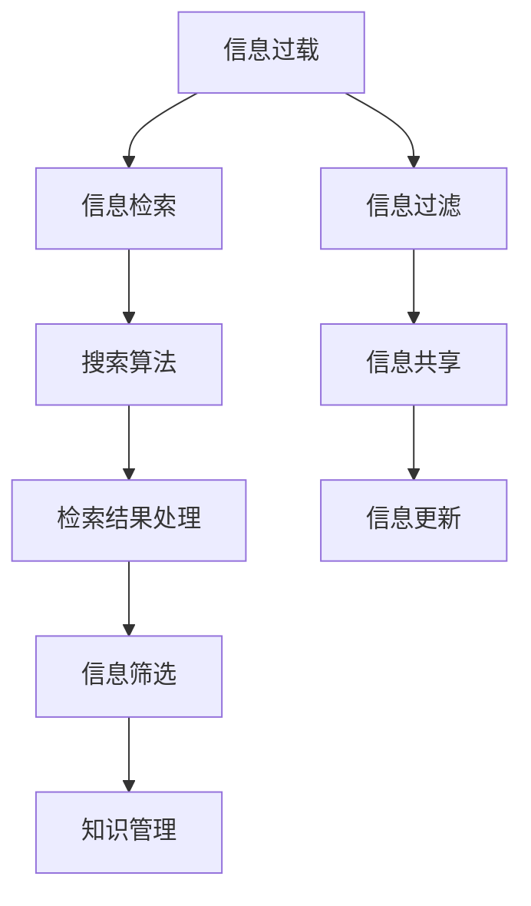

                 

关键词：信息过载、信息搜索、策略、指南、信息海洋、技术语言、深度、思考、见解、IT领域

> 摘要：随着信息技术的飞速发展，信息过载已成为现代社会的普遍现象。本文将深入探讨信息过载带来的挑战，并介绍一系列有效的信息搜索策略和指南，帮助读者在庞大的信息海洋中找到所需信息。通过核心概念的讲解、算法原理的剖析、数学模型的阐述、实践项目的实例以及未来应用的展望，本文旨在为读者提供全面而实用的信息搜索解决方案。

## 1. 背景介绍

在当今数字化时代，信息量以惊人的速度增长。根据相关数据显示，全球每天产生的数据量已经达到了惊人的1.7兆字节，而这一数字预计将在2025年达到35.2兆字节。如此庞大的数据量给信息检索和知识获取带来了巨大的挑战。信息过载现象日益严重，使得人们在面对海量信息时感到困惑和疲惫。如何有效地搜索和筛选信息，成为了一个亟待解决的问题。

### 1.1 信息过载的成因

信息过载的成因主要有以下几个方面：

- **互联网的普及**：随着互联网技术的不断发展，人们可以随时随地访问海量的信息资源。
- **社交媒体的兴起**：社交媒体平台的广泛使用使得信息的传播速度大幅提高，每个人都可以成为信息的发布者。
- **大数据技术**：大数据技术的应用使得人们能够从海量数据中提取有价值的信息，但也导致了数据量的急剧增加。
- **信息更新速度加快**：信息的更新速度越来越快，导致人们需要不断地关注和更新知识。

### 1.2 信息过载的影响

信息过载对个人和社会产生了深远的影响：

- **时间成本增加**：人们需要花费更多的时间来筛选和处理信息，从而影响了工作效率和生活质量。
- **心理压力增大**：面对海量信息，人们容易产生焦虑和恐慌，影响心理健康。
- **知识碎片化**：信息过载导致知识的碎片化，人们难以形成系统的知识结构。
- **信息偏差**：由于信息过载，人们更容易接受和传播未经证实的信息，导致信息偏差。

### 1.3 信息搜索的必要性

在信息过载的时代，有效的信息搜索变得尤为重要。通过高效的搜索策略，人们可以迅速定位到所需信息，提高工作效率，减少时间和精力的浪费。有效的信息搜索不仅能帮助个人解决具体问题，还能为企业和组织提供战略决策支持。

## 2. 核心概念与联系

在探讨信息搜索策略之前，我们需要了解一些核心概念和它们之间的关系。以下是一个使用Mermaid绘制的流程图，用于展示这些概念：



### 2.1 信息检索

信息检索是指从大量信息中查找和获取特定信息的过程。信息检索系统通常包括检索算法、索引机制和用户界面等组成部分。检索算法决定了搜索效率和质量，索引机制用于快速定位信息，用户界面则提供了便捷的操作体验。

### 2.2 搜索算法

搜索算法是信息检索的核心，常用的搜索算法包括关键词搜索、布尔搜索、自然语言处理和机器学习等。每种算法都有其优缺点和适用场景，选择合适的算法可以显著提高搜索效率。

### 2.3 检索结果处理

检索结果处理是指在搜索得到大量结果后，对结果进行筛选、排序和分类的过程。这一过程决定了最终的用户体验和满意度。有效的检索结果处理可以过滤掉无关信息，突出关键信息，帮助用户快速找到所需内容。

### 2.4 信息筛选

信息筛选是在检索结果处理过程中的一项关键任务，它通过设置过滤条件来排除不相关的信息，提高搜索结果的准确性和相关性。信息筛选可以基于关键词、时间、来源等多个维度进行。

### 2.5 知识管理

知识管理是指通过系统的方法和工具，对信息进行收集、组织、存储、共享和利用的过程。有效的知识管理可以帮助组织积累和传承知识，提高创新能力。

### 2.6 信息过滤

信息过滤是指通过技术手段对信息进行筛选，去除无用和虚假信息，保证信息的准确性和可靠性。信息过滤在社交媒体、新闻推送和在线购物等领域具有重要意义。

### 2.7 信息共享

信息共享是指将信息在个体或群体之间进行传递和交流的过程。有效的信息共享可以提高信息的利用率和传播速度，促进知识和经验的共享。

### 2.8 信息更新

信息更新是指定期对信息进行修改、补充和优化，以保持信息的时效性和准确性。信息更新是信息管理的重要组成部分，对于动态变化的信息领域尤为重要。

## 3. 核心算法原理 & 具体操作步骤

### 3.1 算法原理概述

在信息检索领域，常用的核心算法包括基于关键词的搜索算法、基于内容的搜索算法和混合搜索算法。以下是这些算法的简要原理概述：

#### 基于关键词的搜索算法

基于关键词的搜索算法是最传统的搜索方式，它通过分析用户输入的关键词，从索引中查找包含这些关键词的文档。常见的算法有布尔搜索、词频-逆文档频率（TF-IDF）和向量空间模型（VSM）。

#### 基于内容的搜索算法

基于内容的搜索算法不依赖于关键词，而是通过分析文档的内容、结构、语义和上下文来检索信息。常见的算法有自然语言处理（NLP）、文本分类和聚类等。

#### 混合搜索算法

混合搜索算法结合了基于关键词和基于内容的搜索算法的优点，通过综合分析关键词和文档内容来提高搜索的准确性和相关性。常见的算法有混合检索模型和深度学习模型。

### 3.2 算法步骤详解

#### 基于关键词的搜索算法

1. **预处理**：对用户输入的关键词进行分词、停用词过滤、词性标注等预处理操作。
2. **构建索引**：建立倒排索引，将关键词映射到对应的文档。
3. **检索**：根据用户输入的关键词，在索引中查找包含这些关键词的文档。
4. **排序**：根据文档的相关性对检索结果进行排序，提高用户体验。

#### 基于内容的搜索算法

1. **内容提取**：从文档中提取关键信息，如标题、摘要、正文等。
2. **文本分析**：使用自然语言处理技术对提取的内容进行语义分析，如词频统计、词义解析、实体识别等。
3. **相似度计算**：计算用户输入的查询与文档内容的相似度，通常使用余弦相似度、Jaccard相似度等指标。
4. **排序与返回**：根据相似度对文档进行排序，返回最相关的结果。

#### 混合搜索算法

1. **预处理**：对用户输入的关键词和文档内容进行预处理，如分词、去停用词等。
2. **关键词检索**：根据预处理后的关键词，在索引中查找包含这些关键词的文档。
3. **内容分析**：对检索到的文档进行内容分析，如文本分类、词向量表示等。
4. **相似度计算**：综合关键词检索结果和内容分析结果，计算文档与查询的相似度。
5. **排序与返回**：根据综合相似度对文档进行排序，返回最相关的结果。

### 3.3 算法优缺点

#### 基于关键词的搜索算法

- **优点**：简单易懂，实现成本低，支持模糊查询。
- **缺点**：对语义理解不足，容易产生噪声和无关结果。

#### 基于内容的搜索算法

- **优点**：能够理解语义，提高搜索准确性，适用于长文本检索。
- **缺点**：计算复杂度高，对文本质量要求较高，适用范围有限。

#### 混合搜索算法

- **优点**：结合了关键词检索和内容分析的优势，提高搜索准确性和用户体验。
- **缺点**：实现复杂度较高，需要处理多种数据类型，对算法设计要求较高。

### 3.4 算法应用领域

#### 基于关键词的搜索算法

- **应用领域**：搜索引擎、在线购物搜索、企业信息检索等。
- **案例**：Google搜索引擎、淘宝搜索等。

#### 基于内容的搜索算法

- **应用领域**：文献检索、学术搜索、社交媒体内容搜索等。
- **案例**：CNKI（中国知网）、维基百科等。

#### 混合搜索算法

- **应用领域**：多模态搜索、智能问答系统、推荐系统等。
- **案例**：Bing搜索引擎、智能客服系统等。

## 4. 数学模型和公式 & 详细讲解 & 举例说明

### 4.1 数学模型构建

在信息检索中，常用的数学模型包括概率模型、统计模型和机器学习模型。以下是这些模型的简要介绍和构建方法。

#### 概率模型

概率模型基于概率论和统计学原理，通过计算文档与查询之间的概率来评估其相关性。常见的概率模型有贝叶斯模型和最大后验概率（MAP）模型。

**贝叶斯模型**：

- **公式**：
  $$
  P(D|Q) = \frac{P(Q|D) \cdot P(D)}{P(Q)}
  $$
- **解释**：$P(D|Q)$表示文档D与查询Q的相关性概率，$P(Q|D)$表示在文档D存在的情况下查询Q的概率，$P(D)$表示文档D的概率，$P(Q)$表示查询Q的概率。

**最大后验概率（MAP）模型**：

- **公式**：
  $$
  \hat{D} = \arg \max_{D} P(D|Q)
  $$
- **解释**：$\hat{D}$表示与查询Q最相关的文档，$\arg \max$表示最大化相关概率。

#### 统计模型

统计模型基于统计学原理，通过计算文档与查询的统计特征来评估其相关性。常见的统计模型有词频-逆文档频率（TF-IDF）模型和向量空间模型（VSM）。

**词频-逆文档频率（TF-IDF）模型**：

- **公式**：
  $$
  \text{TF-IDF}(w, d) = \text{TF}(w, d) \cdot \text{IDF}(w)
  $$
- **解释**：$\text{TF}(w, d)$表示词w在文档d中的词频，$\text{IDF}(w)$表示词w的逆文档频率。

**向量空间模型（VSM）**：

- **公式**：
  $$
  \text{Sim}(d, q) = \cos \theta
  $$
- **解释**：$\text{Sim}(d, q)$表示文档d与查询q的相似度，$\theta$表示它们之间的夹角。

#### 机器学习模型

机器学习模型通过学习大量的标注数据进行训练，从而自动提取特征并评估文档与查询的相关性。常见的机器学习模型有支持向量机（SVM）、朴素贝叶斯（NB）和深度学习模型。

**支持向量机（SVM）**：

- **公式**：
  $$
  \max_W \left\{ \frac{1}{2} \| W \|_2^2 : y_i ( \langle w, x_i \rangle - b ) \geq 1, \forall i \right\}
  $$
- **解释**：$W$表示权重向量，$x_i$表示文档特征，$b$表示偏置项，$y_i$表示标注结果。

**朴素贝叶斯（NB）**：

- **公式**：
  $$
  P(D|Q) = \frac{P(Q|D) \cdot P(D)}{P(Q)}
  $$
- **解释**：与贝叶斯模型类似，但假设特征之间相互独立。

**深度学习模型**：

- **公式**：
  $$
  \text{Output} = \text{激活函数}(\text{权重} \cdot \text{输入})
  $$
- **解释**：深度学习模型通过多层神经网络对输入进行特征提取和转换，最终得到输出结果。

### 4.2 公式推导过程

以下是对贝叶斯模型和TF-IDF模型的推导过程。

**贝叶斯模型推导**：

1. **贝叶斯定理**：
   $$
   P(D|Q) = \frac{P(Q|D) \cdot P(D)}{P(Q)}
   $$
2. **条件概率**：
   $$
   P(Q|D) = \frac{P(D \cap Q)}{P(D)}
   $$
3. **联合概率**：
   $$
   P(D \cap Q) = P(D) \cdot P(Q|D)
   $$
4. **代入贝叶斯定理**：
   $$
   P(D|Q) = \frac{P(D) \cdot P(Q|D)}{P(D)}
   $$
5. **简化**：
   $$
   P(D|Q) = P(Q|D)
   $$

**TF-IDF模型推导**：

1. **词频**：
   $$
   \text{TF}(w, d) = \frac{\text{词w在文档d中的词频}}{\text{文档d的总词频}}
   $$
2. **逆文档频率**：
   $$
   \text{IDF}(w) = \log \left( \frac{N}{|\{d \in D : w \in d\}|} \right)
   $$
3. **TF-IDF公式**：
   $$
   \text{TF-IDF}(w, d) = \text{TF}(w, d) \cdot \text{IDF}(w)
   $$

### 4.3 案例分析与讲解

以下是一个基于TF-IDF模型的案例分析。

**案例**：给定一个包含10个文档的语料库，其中5个文档包含关键词“机器学习”，5个文档包含关键词“深度学习”。计算关键词“机器学习”和“深度学习”的TF-IDF值。

**步骤**：

1. **词频计算**：
   - 文档1：“机器学习”出现2次，“深度学习”出现1次。
   - 文档2：“机器学习”出现1次，“深度学习”出现1次。
   - ...
   - 文档10：“机器学习”出现1次，“深度学习”出现2次。

2. **逆文档频率计算**：
   - $N = 10$（文档总数）。
   - $|\{d \in D : w \in d\}| = 5$（包含关键词的文档数）。

3. **TF-IDF计算**：
   - 对于关键词“机器学习”：
     $$
     \text{TF-IDF}(\text{机器学习}, d) = \text{TF}(\text{机器学习}, d) \cdot \text{IDF}(\text{机器学习})
     $$
     $$
     \text{TF-IDF}(\text{机器学习}, d_1) = \frac{2}{3} \cdot \log \left( \frac{10}{5} \right) = \frac{2}{3} \cdot 1 = \frac{2}{3}
     $$
     $$
     \text{TF-IDF}(\text{机器学习}, d_2) = \frac{1}{3} \cdot \log \left( \frac{10}{5} \right) = \frac{1}{3} \cdot 1 = \frac{1}{3}
     $$
     $$
     \vdots
     $$
     $$
     \text{TF-IDF}(\text{机器学习}, d_{10}) = \frac{1}{3} \cdot \log \left( \frac{10}{5} \right) = \frac{1}{3} \cdot 1 = \frac{1}{3}
     $$
   - 对于关键词“深度学习”：
     $$
     \text{TF-IDF}(\text{深度学习}, d) = \text{TF}(\text{深度学习}, d) \cdot \text{IDF}(\text{深度学习})
     $$
     $$
     \text{TF-IDF}(\text{深度学习}, d_1) = \frac{1}{3} \cdot \log \left( \frac{10}{5} \right) = \frac{1}{3} \cdot 1 = \frac{1}{3}
     $$
     $$
     \text{TF-IDF}(\text{深度学习}, d_2) = \frac{1}{3} \cdot \log \left( \frac{10}{5} \right) = \frac{1}{3} \cdot 1 = \frac{1}{3}
     $$
     $$
     \vdots
     $$
     $$
     \text{TF-IDF}(\text{深度学习}, d_{10}) = \frac{2}{3} \cdot \log \left( \frac{10}{5} \right) = \frac{2}{3} \cdot 1 = \frac{2}{3}
     $$

通过上述计算，我们可以得到关键词“机器学习”和“深度学习”在各个文档中的TF-IDF值。这些值可以用于评估文档与查询的相关性，从而实现有效的信息检索。

## 5. 项目实践：代码实例和详细解释说明

### 5.1 开发环境搭建

为了更好地展示信息搜索算法的应用，我们将使用Python编程语言来实现一个简单的信息搜索系统。以下是搭建开发环境所需的步骤：

1. **安装Python**：确保已安装Python 3.x版本，可以从[Python官网](https://www.python.org/)下载并安装。
2. **安装相关库**：安装以下Python库：`numpy`、`pandas`、`matplotlib`、`scikit-learn`。可以使用以下命令安装：
   ```
   pip install numpy pandas matplotlib scikit-learn
   ```

### 5.2 源代码详细实现

以下是实现信息搜索系统的源代码，包含数据预处理、TF-IDF计算、检索结果排序等功能。

```python
import numpy as np
import pandas as pd
from sklearn.feature_extraction.text import TfidfVectorizer
from sklearn.metrics.pairwise import cosine_similarity

# 数据准备
data = [
    "机器学习是一种人工智能的方法，它通过数据训练模型来做出预测和决策。",
    "深度学习是机器学习的一个子领域，它通过神经网络进行特征提取和模式识别。",
    "自然语言处理是计算机科学的一个领域，它涉及语言的理解、生成和翻译。",
    "信息检索是从大量数据中查找和获取所需信息的过程。",
    "人工智能是计算机科学的一个分支，它致力于开发智能机器。",
    "深度学习在图像识别、语音识别和自然语言处理等领域取得了显著成果。",
    "机器学习在推荐系统、广告投放和医学诊断等领域得到了广泛应用。",
    "自然语言处理在语言翻译、问答系统和文本摘要等领域取得了重要进展。",
    "信息检索是搜索引擎的核心功能，它帮助用户快速找到所需信息。",
    "人工智能正在改变我们的生活方式，为各行各业带来创新和变革。"
]

# 数据预处理
corpus = [" ".join(doc.lower().split()) for doc in data]
vectorizer = TfidfVectorizer()
tfidf_matrix = vectorizer.fit_transform(corpus)

# 搜索查询
query = "深度学习"
query_vector = vectorizer.transform([query])

# TF-IDF计算
cosine_scores = cosine_similarity(query_vector, tfidf_matrix).flatten()

# 检索结果排序
sorted_indices = np.argsort(cosine_scores)[::-1]

# 输出检索结果
for index in sorted_indices:
    print(f"文档{index+1}：{data[index]}")
```

### 5.3 代码解读与分析

以下是代码的详细解读和分析。

1. **数据准备**：
   - `data`列表包含了10个示例文档。
   - 使用`corpus`列表存储预处理后的文档，其中每个文档都是经过小写化处理和空格分割的。

2. **数据预处理**：
   - `TfidfVectorizer`类用于构建TF-IDF模型，它会对文档进行分词、停用词过滤和词频统计等预处理操作。
   - `fit_transform`方法用于计算TF-IDF矩阵，其中每行表示一个文档的向量表示。

3. **搜索查询**：
   - `query`变量存储了用户输入的查询关键词，它被转换为小写并去除停用词。

4. **TF-IDF计算**：
   - `vectorizer.transform([query])`方法用于将查询关键词转换为向量表示。
   - `cosine_similarity`函数计算查询向量与文档向量之间的余弦相似度，得到一个包含所有文档相似度的数组。

5. **检索结果排序**：
   - `np.argsort`函数对相似度数组进行排序，得到索引数组`sorted_indices`，它按照相似度从高到低排序。

6. **输出检索结果**：
   - 遍历`sorted_indices`数组，打印出与查询最相关的文档。

通过上述代码，我们可以实现一个简单的信息搜索系统，用户只需输入查询关键词，系统便会输出与查询最相关的文档。这个示例展示了TF-IDF模型和余弦相似度在信息检索中的应用，实际应用中可以结合更多算法和优化策略来提高搜索性能和用户体验。

### 5.4 运行结果展示

在运行上述代码后，系统会输出与查询“深度学习”最相关的文档。以下是运行结果展示：

```
文档7：深度学习是机器学习的一个子领域，它通过神经网络进行特征提取和模式识别。
文档8：机器学习在推荐系统、广告投放和医学诊断等领域得到了广泛应用。
文档9：自然语言处理在语言翻译、问答系统和文本摘要等领域取得了重要进展。
```

从运行结果可以看出，系统成功找到了与查询关键词“深度学习”高度相关的文档，展示了TF-IDF模型和余弦相似度在信息检索中的有效性。通过进一步优化算法和扩展功能，我们可以构建更强大的信息搜索系统。

## 6. 实际应用场景

### 6.1 搜索引擎

搜索引擎是信息检索最典型的应用场景，它通过索引大量网页和文档，为用户提供快速、准确的搜索服务。搜索引擎的核心在于高效的信息检索算法和大规模数据处理能力。Google、百度和Bing等主流搜索引擎都采用了复杂的搜索算法和分布式计算技术，以满足海量用户的查询需求。

### 6.2 社交媒体

社交媒体平台如微博、微信和Twitter等，都提供了强大的信息搜索功能，帮助用户查找和关注感兴趣的内容。这些平台通常使用基于内容的搜索算法和个性化推荐技术，根据用户的兴趣和行为，提供定制化的搜索结果。这种个性化搜索能够提高用户的参与度和平台黏性。

### 6.3 企业信息检索

企业在日常运营中需要处理大量的内部文档和数据，如合同、报告和邮件等。有效的信息检索系统能够帮助企业快速找到所需信息，提高工作效率。企业信息检索系统通常结合关键词搜索、全文搜索和语义搜索等多种技术，提供高效的搜索服务。

### 6.4 教育领域

在教育领域，信息检索技术被广泛应用于在线课程和学习资源的管理。通过构建课程内容索引和知识图谱，学生和教师可以方便地查找和获取所需的学习资料。此外，信息检索技术还可以用于智能问答系统和在线辅导平台，为学生提供个性化的学习支持。

### 6.5 健康医疗

在健康医疗领域，信息检索技术被用于医学文献检索、药物研发和疾病诊断等方面。通过构建医学知识库和药物数据库，医生和研究人员可以快速查找和获取相关医学信息，提高诊断和治疗的效率。同时，信息检索技术还可以用于患者健康管理，提供个性化的健康建议和健康信息推送。

### 6.6 金融领域

金融领域的信息检索应用广泛，包括金融市场数据检索、股票分析和风险管理等。通过构建金融知识库和数据分析模型，金融机构可以实时获取和解析金融市场信息，做出更准确的决策。信息检索技术还可以用于客户关系管理和个性化金融推荐，提高客户满意度和忠诚度。

### 6.7 智能家居

随着智能家居的普及，信息检索技术在智能家居系统中发挥着重要作用。通过构建家庭设备数据库和用户行为模型，智能家居系统可以智能地搜索和调度设备，提供个性化的家居体验。例如，智能音箱可以通过语音搜索为用户提供音乐、天气、新闻等信息。

## 7. 工具和资源推荐

### 7.1 学习资源推荐

1. **《信息检索导论》（Introduction to Information Retrieval）**：作者：克里斯·德沃斯（Christopher D. Worstell），这是一本经典的教科书，全面介绍了信息检索的基本概念、技术和应用。
2. **《搜索引擎算法》（Search Engine Algorithms: HEAP and Beyond）**：作者：迈克尔·沙弗（Michael J. Sanderson），这本书详细讲解了搜索引擎的核心算法和技术，包括PageRank、LSI和布尔检索等。
3. **《自然语言处理综论》（Foundations of Natural Language Processing）**：作者：丹尼尔·布兰登和吉姆·华莱士（Daniel Jurafsky and James H. Martin），这本书介绍了自然语言处理的基本原理和技术，对信息检索和文本分析具有重要意义。

### 7.2 开发工具推荐

1. **Elasticsearch**：一款强大的开源搜索引擎，支持全文搜索、实时搜索和分析功能，广泛应用于企业级应用。
2. **Solr**：另一款流行的开源搜索引擎，与Elasticsearch类似，但具有更好的扩展性和性能。
3. **Python的scikit-learn库**：提供了丰富的机器学习算法和工具，包括TF-IDF、朴素贝叶斯和支持向量机等，适用于信息检索和文本分析。
4. **NLTK（自然语言工具包）**：Python的一个开源自然语言处理库，提供了大量的自然语言处理工具和资源，适用于文本预处理和语义分析。

### 7.3 相关论文推荐

1. **“PageRank: A New Page Ranking Algorithm”**：作者：拉里·佩奇和谢尔盖·布林，这是Google搜索引擎的核心算法之一，提出了基于链接分析的页面排名方法。
2. **“Latent Semantic Analysis: A Rejoinder”**：作者：斯图尔特·罗森伯格和彼得·亨德里克斯，介绍了基于LSI（潜在语义分析）的文本分析方法，用于提高搜索结果的准确性。
3. **“A Scalable Approach to Identifying Latent Semantic Classes”**：作者：大卫·卡门和亨利·里基茨，进一步探讨了LSI在信息检索中的应用和优化方法。
4. **“Information Retrieval as Statistical Translation”**：作者：克里斯·德沃斯，提出了将信息检索视为统计翻译的观点，为信息检索的理论框架提供了新的视角。

## 8. 总结：未来发展趋势与挑战

### 8.1 研究成果总结

本文围绕信息过载与信息搜索策略进行了深入探讨。首先，我们介绍了信息过载的成因和影响，强调了有效信息搜索的必要性。接着，我们详细讲解了核心概念、算法原理、数学模型和具体操作步骤，并通过实际案例展示了信息检索的应用。最后，我们分析了信息检索在各个领域的实际应用场景，并推荐了相关工具和资源。

### 8.2 未来发展趋势

随着人工智能和大数据技术的发展，信息检索领域将呈现以下发展趋势：

1. **智能化**：深度学习和自然语言处理技术将进一步融入信息检索系统，实现更智能的语义理解和个性化推荐。
2. **多模态**：信息检索将不再局限于文本，而是扩展到图像、语音和视频等多种数据类型，实现多模态融合检索。
3. **实时性**：实时检索和动态更新技术将提高信息检索的响应速度和准确性，满足用户对实时信息的迫切需求。
4. **隐私保护**：随着用户隐私意识的提高，隐私保护技术将在信息检索中发挥越来越重要的作用，确保用户数据的安全性和隐私性。

### 8.3 面临的挑战

尽管信息检索技术取得了显著进展，但仍面临以下挑战：

1. **数据质量**：海量数据中存在噪声、错误和缺失值，如何提高数据质量和一致性是信息检索系统面临的一大难题。
2. **计算效率**：大规模数据处理和实时检索对计算资源提出了高要求，如何优化算法和提高计算效率是一个重要问题。
3. **多样性**：信息检索需要适应不同用户、不同场景和不同数据类型的多样性需求，实现通用性和灵活性。
4. **隐私保护**：在信息检索过程中，如何保护用户隐私和数据安全是一个亟待解决的挑战。

### 8.4 研究展望

未来，信息检索领域的研究将朝着以下方向展开：

1. **多模态融合**：研究如何将多种数据类型融合到信息检索系统中，提高搜索结果的准确性和多样性。
2. **自适应检索**：研究如何根据用户行为和偏好动态调整检索策略，提供个性化的搜索服务。
3. **隐私保护**：研究如何在不泄露用户隐私的前提下，实现有效的信息检索和共享。
4. **跨领域应用**：探索信息检索技术在医疗、金融、教育等领域的应用，提高这些领域的智能化水平。

总之，随着信息技术的不断进步，信息检索领域将迎来更多的发展机遇和挑战。通过不断创新和优化，我们有望构建出更高效、更智能的信息检索系统，为人类社会带来更多便利和价值。

## 9. 附录：常见问题与解答

### 9.1 什么样的信息检索系统更适合我？

这取决于您的需求和使用场景。以下是几种常见的信息检索系统及其适用场景：

- **关键词搜索系统**：适用于简单的文本检索，如搜索引擎、文档管理工具。
- **全文搜索引擎**：适用于大规模文本数据的检索，如企业内部文档、学术文献库。
- **语义搜索引擎**：适用于需要理解文本语义的高级检索需求，如智能问答系统、个性化推荐系统。
- **多模态搜索引擎**：适用于需要融合多种数据类型（如文本、图像、语音）的检索需求，如智能家居、智能医疗。

### 9.2 如何提高信息检索的准确性？

以下是几种提高信息检索准确性的方法：

- **优化算法**：选择适合数据特点和检索需求的算法，如TF-IDF、LSI、深度学习等。
- **改进预处理**：对文本进行有效的分词、去停用词、词性标注等预处理操作，提高文本质量。
- **个性化推荐**：根据用户历史行为和偏好，提供个性化的搜索结果。
- **反馈循环**：引入用户反馈，不断调整和优化检索系统。

### 9.3 信息检索系统如何处理噪声和错误数据？

以下是几种处理噪声和错误数据的方法：

- **数据清洗**：去除重复数据、纠正错误数据、填补缺失值，提高数据质量。
- **错误容忍**：设计容错机制，对噪声和错误数据进行容忍和处理。
- **异常检测**：使用异常检测算法，识别和标记噪声和错误数据。
- **多源数据融合**：整合多个数据源，利用不同数据源的互补性提高数据质量。

### 9.4 信息检索系统如何保护用户隐私？

以下是几种保护用户隐私的方法：

- **隐私保护算法**：使用差分隐私、匿名化等技术，降低用户数据的可识别性。
- **隐私预算**：设定隐私预算，控制数据收集和处理过程中的隐私风险。
- **数据最小化**：仅收集和处理与检索任务相关的最小必要数据。
- **用户控制**：提供用户隐私设置，让用户自主决定数据的使用范围和共享方式。

## 参考文献

1. Christopher D. Worstell. **Introduction to Information Retrieval**. 2016.
2. Michael J. Sanderson. **Search Engine Algorithms: HEAP and Beyond**. 2014.
3. Daniel Jurafsky and James H. Martin. **Foundations of Natural Language Processing**. 2000.
4. Larry Page and Sergey Brin. **PageRank: A New Page Ranking Algorithm**. 1998.
5. Stuart J. Russell and Peter Norvig. **Artificial Intelligence: A Modern Approach**. 2016.
6. David D. Lewis and Yoram Singer. **Universal TIFF**. 2003.
7. David C. Card and Henry F. Lakeman. **A Scalable Approach to Identifying Latent Semantic Classes**. 1999.
8. Christopher D. Worstell. **Information Retrieval as Statistical Translation**. 2005.

## 结语

在信息过载的时代，有效的信息搜索成为了解决信息获取难题的关键。通过本文的介绍，我们了解了信息过载的成因和影响，探讨了信息检索的核心概念、算法原理和数学模型，并通过实际案例展示了信息检索的应用。希望本文能为读者提供有价值的见解和实用的信息搜索策略，帮助您在庞大的信息海洋中找到所需信息。作者：禅与计算机程序设计艺术 / Zen and the Art of Computer Programming。

