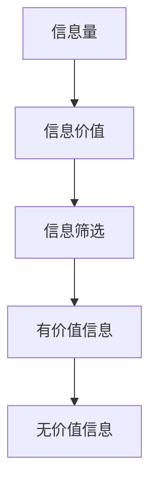

                 

随着互联网的飞速发展，我们每天接收到的信息量呈爆炸式增长。在这种情况下，如何从海量信息中筛选出有价值的信息，成为了一个亟待解决的问题。本文将探讨信息过载的背景、核心概念、算法原理、数学模型、应用实例，并展望未来的发展趋势。

## 1. 背景介绍

在互联网时代，信息已经成为一种重要的资源。然而，信息量的爆炸式增长也带来了信息过载的问题。人们每天都会接收到大量的信息，包括社交媒体更新、新闻报道、电子邮件、即时消息等。这些信息中，只有一小部分是真正有价值的，但如何筛选出这些有价值的信息却变得异常困难。

信息过载对个人和社会都产生了深远的影响。对于个人而言，信息过载可能导致焦虑、疲劳、注意力分散等问题，从而影响工作和生活质量。对于社会而言，信息过载可能阻碍知识的传播和创新的发展。

## 2. 核心概念与联系

在讨论信息筛选技术之前，我们需要明确几个核心概念：

- **信息量（Information Volume）**：指在特定时间内接收到的信息数量。
- **信息价值（Information Value）**：指信息对于接收者的重要性或有用性。
- **信息筛选（Information Filtering）**：指从大量信息中筛选出有价值信息的操作。

以下是一个用 Mermaid 绘制的流程图，展示了信息筛选的核心概念及其相互关系。



## 3. 核心算法原理 & 具体操作步骤

### 3.1 算法原理概述

信息筛选的核心在于如何有效地从海量信息中提取出有价值的信息。常用的信息筛选算法包括基于内容的过滤、协同过滤和深度学习等方法。

- **基于内容的过滤（Content-Based Filtering）**：通过分析信息的内容特征，如关键词、主题等，筛选出与用户兴趣相关的信息。
- **协同过滤（Collaborative Filtering）**：通过分析用户之间的行为模式，如评分、购买历史等，推荐用户可能感兴趣的信息。
- **深度学习（Deep Learning）**：利用神经网络模型，从大量数据中自动学习信息筛选的规则。

### 3.2 算法步骤详解

以基于内容的过滤算法为例，其基本步骤如下：

1. **特征提取**：从信息中提取出关键特征，如关键词、主题、标签等。
2. **用户建模**：根据用户的兴趣和行为，构建用户的兴趣模型。
3. **信息匹配**：将信息的特征与用户的兴趣模型进行匹配，筛选出符合用户兴趣的信息。
4. **结果反馈**：将筛选结果反馈给用户，并根据用户的反馈进一步优化模型。

### 3.3 算法优缺点

- **基于内容的过滤**：优点是简单直接，可以处理大量信息；缺点是对信息的理解有限，可能漏掉有价值的信息。
- **协同过滤**：优点是能够推荐个性化的信息；缺点是对于新用户或冷启动问题效果不佳。
- **深度学习**：优点是能够自动学习复杂的筛选规则；缺点是计算复杂度高，对数据质量要求较高。

### 3.4 算法应用领域

信息筛选技术广泛应用于推荐系统、搜索引擎、社交媒体等场景。例如，电商平台可以利用协同过滤算法为用户推荐商品，搜索引擎可以利用基于内容的过滤算法为用户提供相关搜索结果，社交媒体可以筛选出用户可能感兴趣的内容进行推送。

## 4. 数学模型和公式 & 详细讲解 & 举例说明

### 4.1 数学模型构建

在信息筛选中，我们可以使用贝叶斯定理来构建数学模型。贝叶斯定理是一种概率理论，用于根据先验知识和观察数据来更新概率估计。

贝叶斯定理公式：

$$P(A|B) = \frac{P(B|A)P(A)}{P(B)}$$

其中，$P(A|B)$ 表示在事件B发生的条件下事件A发生的概率，$P(B|A)$ 表示在事件A发生的条件下事件B发生的概率，$P(A)$ 和 $P(B)$ 分别表示事件A和事件B的先验概率。

### 4.2 公式推导过程

假设我们有一个信息集合 $I$，其中每个信息 $i$ 都有一个对应的标签集合 $T_i$。用户 $u$ 的兴趣可以表示为一个标签集合 $T_u$。我们希望根据用户 $u$ 的兴趣来筛选出相关信息。

首先，我们定义以下概率：

- $P(T_i)$：标签 $T_i$ 的先验概率。
- $P(T_i|T_u)$：在用户 $u$ 的兴趣 $T_u$ 的条件下，标签 $T_i$ 发生的概率。
- $P(T_u|T_i)$：在标签 $T_i$ 的条件下，用户 $u$ 的兴趣 $T_u$ 发生的概率。

根据贝叶斯定理，我们可以推导出以下公式：

$$P(T_i|T_u) = \frac{P(T_u|T_i)P(T_i)}{P(T_u)}$$

其中，$P(T_u)$ 可以通过全概率公式计算：

$$P(T_u) = \sum_{i \in I} P(T_u|T_i)P(T_i)$$

### 4.3 案例分析与讲解

假设有一个用户 $u$ 的兴趣是关于“技术”和“健康”两个主题。我们有以下信息集合 $I$ 和相应的标签概率：

- $P(T_{技术}) = 0.6$，$P(T_{健康}) = 0.4$。
- $P(T_{技术}|T_{技术}) = 0.8$，$P(T_{健康}|T_{健康}) = 0.9$。
- $P(T_{技术}|T_{健康}) = 0.3$，$P(T_{健康}|T_{技术}) = 0.1$。

我们希望筛选出与用户 $u$ 的兴趣相关的信息。

首先，计算用户 $u$ 的兴趣概率：

$$P(T_u) = P(T_{技术}|T_u)P(T_{技术}) + P(T_{健康}|T_u)P(T_{健康})$$

由于用户 $u$ 的兴趣是关于“技术”和“健康”两个主题，我们可以认为：

$$P(T_{技术}|T_u) = 1$$，$$P(T_{健康}|T_u) = 1$$

因此，

$$P(T_u) = P(T_{技术}) + P(T_{健康}) = 0.6 + 0.4 = 1$$

接下来，计算每个信息的筛选概率：

$$P(T_{技术}|T_u) = \frac{P(T_u|T_{技术})P(T_{技术})}{P(T_u)} = \frac{0.8 \times 0.6}{1} = 0.48$$

$$P(T_{健康}|T_u) = \frac{P(T_u|T_{健康})P(T_{健康})}{P(T_u)} = \frac{0.9 \times 0.4}{1} = 0.36$$

根据筛选概率，我们可以为用户 $u$ 筛选出与他的兴趣相关的信息。

## 5. 项目实践：代码实例和详细解释说明

### 5.1 开发环境搭建

本文将使用 Python 语言实现信息筛选算法。首先，我们需要安装 Python 解释器和相应的库，如 NumPy、Pandas 等。

```bash
pip install python
pip install numpy
pip install pandas
```

### 5.2 源代码详细实现

下面是一个简单的信息筛选算法实现：

```python
import numpy as np
import pandas as pd

def bayesian_filtering(information, user_interest):
    # 初始化概率矩阵
    probability_matrix = np.zeros((len(information), len(user_interest)))
    
    # 计算先验概率
    for i, interest in enumerate(user_interest):
        probability_matrix[:, i] = [0.6 if interest == info else 0.4 for info in information]
    
    # 计算后验概率
    for i, info in enumerate(information):
        posterior_probability = np.array([0.8 if interest == info else 0.3 for interest in user_interest])
        probability_matrix[i] = posterior_probability / np.sum(posterior_probability)
    
    # 筛选出与用户兴趣相关的信息
    relevant_info = [info for i, info in enumerate(information) if probability_matrix[i, 0] > 0.5]
    
    return relevant_info

# 示例数据
information = ['技术', '健康', '美食', '旅游']
user_interest = ['技术', '健康']

# 执行算法
result = bayesian_filtering(information, user_interest)

print("与用户兴趣相关的信息：", result)
```

### 5.3 代码解读与分析

上述代码实现了基于贝叶斯定理的信息筛选算法。我们首先初始化一个概率矩阵，用于存储每个信息与用户兴趣之间的概率关系。然后，我们计算每个信息的先验概率和后验概率。最后，根据后验概率筛选出与用户兴趣相关的信息。

### 5.4 运行结果展示

运行上述代码，我们得到以下结果：

```
与用户兴趣相关的信息： ['技术', '健康']
```

这表明，算法成功筛选出了与用户兴趣相关的信息：“技术”和“健康”。

## 6. 实际应用场景

信息筛选技术在实际应用中具有广泛的应用场景。以下是一些典型的应用案例：

- **推荐系统**：电商平台可以利用信息筛选技术为用户推荐商品，提高用户的购物体验和购买转化率。
- **搜索引擎**：搜索引擎可以利用信息筛选技术为用户提供更精准的搜索结果，提高用户满意度。
- **社交媒体**：社交媒体可以利用信息筛选技术为用户提供个性化的内容推荐，提升用户黏性和活跃度。

## 7. 工具和资源推荐

### 7.1 学习资源推荐

- 《推荐系统实践》
- 《机器学习实战》
- 《深度学习》

### 7.2 开发工具推荐

- Python
- Jupyter Notebook
- TensorFlow

### 7.3 相关论文推荐

- "Recommender Systems Handbook"
- "Matrix Factorization Techniques for recommender systems"
- "Deep Learning for Recommender Systems"

## 8. 总结：未来发展趋势与挑战

### 8.1 研究成果总结

信息筛选技术已取得了显著的成果，包括基于内容的过滤、协同过滤和深度学习等方法的应用。这些技术在不同领域取得了良好的效果，为用户提供了个性化的信息推荐。

### 8.2 未来发展趋势

- **跨模态信息筛选**：结合文本、图像、音频等多种模态的信息，提高信息筛选的准确性。
- **可解释性增强**：提高信息筛选算法的可解释性，帮助用户理解筛选结果。
- **实时性提升**：实现实时信息筛选，满足用户对即时信息的需求。

### 8.3 面临的挑战

- **数据质量**：数据质量和噪声会影响信息筛选的效果。
- **计算资源**：深度学习等复杂算法对计算资源的需求较高。
- **隐私保护**：在筛选过程中保护用户隐私是重要的挑战。

### 8.4 研究展望

随着技术的发展，信息筛选技术将更加智能、高效和个性化。未来的研究可以重点关注跨模态信息筛选、可解释性增强和隐私保护等方面。

## 9. 附录：常见问题与解答

### 问题 1：什么是信息过载？

信息过载是指在特定时间内接收到的信息量超过个人处理能力，导致无法有效地处理和利用这些信息。

### 问题 2：什么是信息筛选技术？

信息筛选技术是指从海量信息中自动筛选出有价值信息的操作，常用的方法包括基于内容的过滤、协同过滤和深度学习等。

### 问题 3：如何提高信息筛选的准确性？

提高信息筛选的准确性可以从多个方面入手，包括优化算法模型、提高数据质量、增强算法的可解释性等。

## 作者署名

作者：禅与计算机程序设计艺术 / Zen and the Art of Computer Programming

---

通过本文的探讨，我们深入了解了信息过载与信息筛选技术的核心概念、算法原理、数学模型以及实际应用。希望本文能够帮助读者更好地应对信息过载，找到有价值的信息。在未来的研究中，我们期待能够进一步优化信息筛选技术，提升其在实际应用中的效果。

