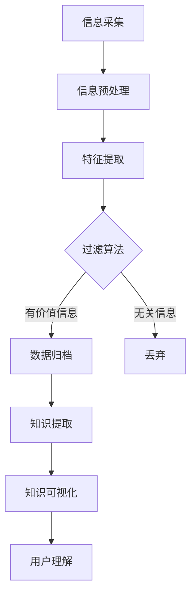

                 

在当今信息爆炸的时代，我们面临着前所未有的信息过载问题。每天都有海量的信息涌入我们的视野，从社交媒体到新闻媒体，再到专业文献和商业报告。这种信息过载不仅让人感到压力重重，更严重的是，它影响了我们的决策过程和效率。为了应对这一挑战，知识管理技术应运而生，它提供了一套系统的方法来管理和组织信息，以促进更加高效和明智的决策。

本文将深入探讨信息过载与知识管理技术的关系，解析核心概念和原理，并探讨相关的核心算法、数学模型、项目实践，以及未来的应用前景。通过阅读本文，读者将能够更好地理解如何利用知识管理技术来应对信息过载，并提升决策的质量和效率。

## 文章关键词

- 信息过载
- 知识管理
- 决策支持系统
- 数据组织
- 知识架构
- 机器学习
- 自然语言处理

## 文摘

信息过载已经成为现代工作和生活的一大挑战，它导致我们的注意力分散，决策效率下降。本文从信息过载的现状出发，系统地介绍了知识管理技术的核心概念和原理，包括信息过滤、数据归档、知识提取和知识可视化等。通过对核心算法和数学模型的详细讲解，本文展示了如何将知识管理技术应用于实际项目中。最后，本文对知识管理技术的未来应用前景进行了展望，并提出了应对当前挑战的研究方向。希望本文能够为读者提供应对信息过载、提升决策能力的实用指南。

## 1. 背景介绍

在信息时代，数据量的激增使得“信息过载”成为一个普遍存在的问题。据统计，全球每天产生的数据量已经超过2.5EB（艾字节），这一数字还在以惊人的速度增长。然而，这些数据中只有少部分对我们真正有用，大量的冗余和无用信息不仅占用存储空间，更严重的是，它们干扰了我们的注意力，降低了决策效率。

信息过载对决策的影响主要体现在以下几个方面：

1. **注意力分散**：面对海量的信息，人们往往无法专注于关键信息，导致注意力分散。
2. **认知负荷增加**：处理过多的信息需要大量的认知资源，使得大脑负担加重，影响判断和决策能力。
3. **决策延迟**：寻找和处理信息需要时间，信息过载导致决策过程延迟，降低了响应速度。
4. **错误决策**：在信息过载的环境下，人们更容易受到误导，导致错误决策。

为了应对信息过载带来的挑战，我们需要引入知识管理技术。知识管理技术旨在通过系统地收集、整理、存储和利用信息，帮助人们更有效地处理信息，减少认知负荷，提高决策质量和效率。知识管理不仅仅是对信息的简单存储，它更强调信息的组织和利用，通过构建知识架构，实现知识的共享和流动。

### 1.1 信息过载的现状

随着互联网和移动设备的普及，信息获取变得前所未有的便捷。然而，这种便捷性也带来了信息过载的问题。以下是一些关于信息过载现状的数据和事实：

- **社交媒体**：每天有超过5000万条推文在Twitter上发布，Facebook上的每日活跃用户超过20亿。
- **新闻报道**：传统媒体和在线新闻平台每天发布成千上万条新闻，其中许多内容重复或无关紧要。
- **专业文献**：学术期刊和数据库中每年发表的论文数量在不断增加，许多领域的文献增长速度超过了人类的阅读能力。
- **商业报告**：企业在运营过程中产生的商业报告和数据文件也呈爆炸式增长。

这些数据表明，信息过载已经渗透到我们日常工作和生活的方方面面，成为现代社会的普遍现象。对于个人和组织来说，如何有效地管理和利用这些信息，成为一个亟待解决的问题。

### 1.2 知识管理技术的定义和目的

知识管理技术是指一系列工具和方法，用于收集、整理、存储、共享和利用信息，使其能够为组织和个人带来实际价值。知识管理不仅关注信息的存储，更强调信息的组织、利用和传播。

知识管理技术的目的主要有以下几点：

1. **提高信息利用效率**：通过有效的信息组织和管理，减少信息冗余，提高信息获取的效率。
2. **支持决策制定**：通过提供准确的、相关的信息，帮助决策者做出更加明智和高效的决策。
3. **促进知识共享**：通过建立知识共享平台，促进组织内部的知识交流和传递，提高整体创新能力。
4. **提升组织竞争力**：通过有效地管理和利用知识，提高组织的响应速度和市场竞争力。

在组织层面，知识管理技术能够帮助组织构建良好的知识架构，实现知识的系统化管理和利用，从而提升组织的整体运营效率。对于个人来说，知识管理技术可以帮助个人更好地组织和管理个人知识，提高工作和学习的效率。

### 1.3 信息过载与知识管理的关系

信息过载是知识管理技术的直接背景和动力。面对海量信息，传统的方法和工具已经无法满足需求，知识管理技术因此应运而生。知识管理技术通过以下几个方面解决了信息过载的问题：

1. **信息筛选**：知识管理技术提供了高效的筛选机制，帮助用户从海量信息中提取出有价值的信息。
2. **信息归档**：通过建立系统化的信息归档机制，确保信息能够被有效地存储和查找。
3. **知识提取**：通过自然语言处理和机器学习等技术，从海量信息中提取出关键的知识点，实现信息的深度利用。
4. **知识可视化**：通过可视化工具，将复杂的信息以直观的方式呈现，帮助用户更好地理解和利用信息。

知识管理技术不仅解决了信息过载的问题，还提升了信息利用的效率和质量，为组织和个人带来了实质性的价值。

### 1.4 知识管理技术的历史和发展

知识管理技术的概念起源于20世纪80年代，最初主要应用于企业内部的知识共享和管理。随着信息技术的发展，知识管理技术逐渐成熟，并应用到更广泛的领域。

在早期，知识管理主要依靠人工的方式，通过文档管理、电子数据表和电子邮件等工具进行信息存储和传递。随着互联网和数据库技术的普及，知识管理进入了新的阶段，出现了基于网络的知识管理系统（KMMS），这些系统集成了信息收集、存储、共享和检索等功能。

近年来，随着大数据、云计算、人工智能等技术的不断发展，知识管理技术取得了重大突破。大数据技术使得海量信息的处理和分析成为可能，云计算提供了强大的计算和存储能力，而人工智能技术则实现了信息的自动化处理和智能分析。

总体来说，知识管理技术经历了从人工管理到自动化管理，再到智能化管理的演变过程。未来，知识管理技术将继续融合新兴技术，实现更加高效和智能的信息管理和利用。

## 2. 核心概念与联系

### 2.1 信息过滤

信息过滤是知识管理技术的基石之一，它通过特定的算法和策略，从海量信息中提取出对用户有价值的信息。信息过滤的过程可以分为以下几个步骤：

1. **信息采集**：从各种来源（如互联网、内部系统等）收集信息。
2. **信息预处理**：对收集到的信息进行清洗和格式化，去除重复和无用信息。
3. **特征提取**：将信息转化为计算机可以处理的形式，如关键词、标签等。
4. **过滤算法**：使用特定的算法（如机器学习、规则匹配等）对特征进行筛选，提取出用户感兴趣的信息。

信息过滤的关键在于如何准确高效地提取用户需求，这需要综合考虑用户的兴趣、历史行为和上下文环境等因素。

### 2.2 数据归档

数据归档是将信息长期保存的过程，确保信息能够被长期、安全地访问和利用。数据归档的步骤包括：

1. **分类和标签**：根据信息的类型、用途和重要性进行分类和标签，便于管理和检索。
2. **存储选择**：选择合适的存储介质（如硬盘、云存储等），根据数据的重要性和访问频率进行合理分布。
3. **备份与冗余**：对关键数据实施备份策略，以防止数据丢失或损坏。
4. **检索优化**：优化数据的存储结构和检索算法，提高数据访问速度和效率。

数据归档不仅要保证数据的完整性，还要确保数据的可访问性和可维护性。

### 2.3 知识提取

知识提取是从海量信息中提取出具有实际价值的信息和知识的过程。知识提取的方法主要包括：

1. **文本挖掘**：使用自然语言处理技术，从文本中提取出关键词、主题、情感等信息。
2. **结构化数据挖掘**：对结构化数据进行统计分析，提取出数据中的模式和规律。
3. **语义分析**：通过理解文本的语义，提取出文本中的深层知识和信息。

知识提取的关键在于如何从海量信息中快速准确地提取出有价值的信息，这需要结合多种技术和方法。

### 2.4 知识可视化

知识可视化是将复杂的信息以图形、图表等形式直观地呈现，帮助用户更好地理解和利用信息。知识可视化的步骤包括：

1. **数据预处理**：对数据进行清洗、归一化和转换，为可视化做准备。
2. **可视化设计**：根据数据的类型和用户的需求，选择合适的可视化图表和布局。
3. **交互设计**：设计交互界面，使用户能够与可视化图表进行交互，获取更多信息。
4. **效果评估**：评估可视化效果，根据反馈进行调整和优化。

知识可视化的核心在于如何将复杂的信息以直观、易懂的方式呈现，提高信息的可访问性和可理解性。

### 2.5 信息过滤、数据归档、知识提取和知识可视化的关系

信息过滤、数据归档、知识提取和知识可视化是知识管理技术中紧密联系的核心环节，它们共同构成了一个完整的信息处理和利用流程。

信息过滤是整个流程的起点，它通过筛选和提取出用户感兴趣的信息，为后续的数据归档、知识提取和知识可视化奠定了基础。数据归档是对信息的长期保存和管理，确保信息能够被有效地存储和检索。知识提取则是从海量信息中提取出具有实际价值的信息和知识，为用户提供了更加深入的理解和洞察。知识可视化则是将复杂的信息以直观的方式呈现，帮助用户更好地理解和利用这些信息。

这些环节之间相互依赖、相互促进，共同构成了一个高效、智能的知识管理技术体系。

## 2.1 核心概念原理和架构的 Mermaid 流程图



### 2.2 核心算法原理 & 具体操作步骤

#### 2.2.1 算法原理概述

知识管理技术中的核心算法主要涵盖信息过滤、数据归档、知识提取和知识可视化等环节。以下分别介绍这些算法的原理和具体操作步骤。

##### 1. 信息过滤算法

信息过滤算法是基于用户需求和兴趣，从海量信息中提取出有价值信息的关键技术。其原理包括：

- **用户模型构建**：根据用户的历史行为、兴趣偏好和上下文环境，构建用户模型。
- **特征提取**：将原始信息转化为特征向量，如关键词、标签等。
- **相似度计算**：计算特征向量之间的相似度，筛选出相似度高的信息。
- **反馈机制**：根据用户的反馈，调整过滤算法，提高信息准确性和用户满意度。

##### 2. 数据归档算法

数据归档算法旨在实现信息的长期保存和管理，其原理包括：

- **分类与标签**：根据信息的内容和用途，进行分类和标签，便于管理和检索。
- **存储优化**：根据数据的重要性和访问频率，选择合适的存储介质，提高数据访问效率。
- **冗余处理**：识别和去除冗余数据，减少存储空间占用。
- **备份与恢复**：定期进行数据备份，确保数据的安全性和可靠性。

##### 3. 知识提取算法

知识提取算法是从海量信息中提取出具有实际价值的信息和知识的核心技术。其原理包括：

- **文本挖掘**：利用自然语言处理技术，从文本中提取出关键词、主题和情感等信息。
- **结构化数据挖掘**：对结构化数据进行分析，提取出数据中的模式和规律。
- **语义分析**：通过理解文本的语义，提取出文本中的深层知识和信息。
- **实体识别**：识别文本中的实体，如人名、地名、组织等，为后续的知识提取和关联提供支持。

##### 4. 知识可视化算法

知识可视化算法是将复杂的信息以直观的方式呈现，帮助用户更好地理解和利用信息的关键技术。其原理包括：

- **数据预处理**：对数据进行清洗、归一化和转换，为可视化做准备。
- **可视化设计**：根据数据的类型和用户的需求，选择合适的可视化图表和布局。
- **交互设计**：设计交互界面，使用户能够与可视化图表进行交互，获取更多信息。
- **效果评估**：评估可视化效果，根据反馈进行调整和优化。

#### 2.2.2 算法步骤详解

##### 1. 信息过滤算法步骤

- **步骤1：用户模型构建**：收集用户的历史行为数据，如搜索记录、浏览记录、收藏记录等，构建用户兴趣模型。
- **步骤2：特征提取**：对收集到的信息进行预处理，提取关键词、标签等特征，构建特征向量。
- **步骤3：相似度计算**：计算用户模型与信息特征向量之间的相似度，筛选出相似度高的信息。
- **步骤4：反馈机制**：收集用户的反馈，根据反馈调整过滤算法，提高信息准确性和用户满意度。

##### 2. 数据归档算法步骤

- **步骤1：分类与标签**：根据信息的内容和用途，将信息分为不同的类别，并添加相应的标签。
- **步骤2：存储优化**：根据数据的重要性和访问频率，选择合适的存储介质，如硬盘、云存储等。
- **步骤3：冗余处理**：识别和去除冗余数据，减少存储空间占用。
- **步骤4：备份与恢复**：定期进行数据备份，确保数据的安全性和可靠性。

##### 3. 知识提取算法步骤

- **步骤1：文本挖掘**：利用自然语言处理技术，从文本中提取出关键词、主题和情感等信息。
- **步骤2：结构化数据挖掘**：对结构化数据进行分析，提取出数据中的模式和规律。
- **步骤3：语义分析**：通过理解文本的语义，提取出文本中的深层知识和信息。
- **步骤4：实体识别**：识别文本中的实体，如人名、地名、组织等，为后续的知识提取和关联提供支持。

##### 4. 知识可视化算法步骤

- **步骤1：数据预处理**：对数据进行清洗、归一化和转换，为可视化做准备。
- **步骤2：可视化设计**：根据数据的类型和用户的需求，选择合适的可视化图表和布局。
- **步骤3：交互设计**：设计交互界面，使用户能够与可视化图表进行交互，获取更多信息。
- **步骤4：效果评估**：评估可视化效果，根据反馈进行调整和优化。

#### 2.2.3 算法优缺点

##### 1. 信息过滤算法优缺点

- **优点**：
  - 提高信息获取效率，降低用户认知负荷。
  - 根据用户需求提供个性化信息推荐。
- **缺点**：
  - 过滤效果受用户模型和特征提取精度的影响。
  - 需要大量计算资源和时间。

##### 2. 数据归档算法优缺点

- **优点**：
  - 保证数据的长期保存和可访问性。
  - 提高数据检索效率和可靠性。
- **缺点**：
  - 需要占用大量存储空间。
  - 备份和恢复过程需要时间。

##### 3. 知识提取算法优缺点

- **优点**：
  - 提取具有实际价值的信息和知识。
  - 支持数据挖掘和决策支持。
- **缺点**：
  - 精度受自然语言处理和语义分析技术的限制。
  - 需要大量计算资源和时间。

##### 4. 知识可视化算法优缺点

- **优点**：
  - 提高信息的可理解性和可访问性。
  - 支持用户交互和数据探索。
- **缺点**：
  - 可视化效果受设计水平和用户习惯的影响。
  - 需要用户具备一定的技术背景。

#### 2.2.4 算法应用领域

知识管理技术中的核心算法广泛应用于各个领域，如下：

- **金融行业**：信息过滤和知识提取技术用于金融数据分析、风险管理和投资决策。
- **医疗领域**：知识提取和知识可视化技术用于医疗信息检索、疾病诊断和治疗建议。
- **教育领域**：知识提取和知识可视化技术用于教育资源的个性化推荐和学生学习效果分析。
- **企业运营**：数据归档和知识可视化技术用于企业信息管理和决策支持。

### 2.3 数学模型和公式 & 详细讲解 & 举例说明

#### 2.3.1 数学模型构建

在知识管理技术中，数学模型广泛应用于信息过滤、知识提取和知识可视化等环节。以下分别介绍这些模型的基本概念和公式。

##### 1. 信息过滤模型

信息过滤模型主要用于根据用户需求筛选出有价值的信息。常见的模型包括：

- **贝叶斯过滤模型**：基于贝叶斯定理，计算信息与用户兴趣的相似度。

公式如下：
\[ P(I|U) = \frac{P(U|I) \cdot P(I)}{P(U)} \]

其中，\( P(I|U) \)表示信息\( I \)与用户兴趣\( U \)的相似度，\( P(U|I) \)表示用户兴趣\( U \)在信息\( I \)中出现的概率，\( P(I) \)表示信息\( I \)的概率，\( P(U) \)表示用户兴趣\( U \)的概率。

- **K-最近邻模型**：基于用户兴趣的K个最近邻居，计算这些邻居的兴趣分布，预测新信息的价值。

公式如下：
\[ \text{相似度} = \frac{\sum_{i=1}^{k} w_i \cdot \text{distance}(i, U)}{\sum_{i=1}^{k} w_i} \]

其中，\( w_i \)表示邻居\( i \)的权重，\( \text{distance}(i, U) \)表示邻居\( i \)与用户兴趣\( U \)的距离。

##### 2. 知识提取模型

知识提取模型主要用于从海量信息中提取出具有实际价值的信息和知识。常见的模型包括：

- **TF-IDF模型**：基于词频（TF）和逆文档频率（IDF），计算关键词的重要性。

公式如下：
\[ \text{TF-IDF}(w, d) = \text{TF}(w, d) \cdot \text{IDF}(w, D) \]

其中，\( \text{TF}(w, d) \)表示词\( w \)在文档\( d \)中的词频，\( \text{IDF}(w, D) \)表示词\( w \)在文档集合\( D \)中的逆文档频率。

- **主题模型**：基于概率图模型，从文档集合中提取出主题分布。

公式如下：
\[ P(z|d) = \frac{P(d|z) \cdot P(z)}{P(d)} \]

其中，\( z \)表示主题，\( d \)表示文档，\( P(z|d) \)表示文档\( d \)属于主题\( z \)的概率，\( P(d|z) \)表示主题\( z \)生成文档\( d \)的概率，\( P(z) \)表示主题\( z \)的概率，\( P(d) \)表示文档\( d \)的概率。

##### 3. 知识可视化模型

知识可视化模型主要用于将复杂的信息以直观的方式呈现。常见的模型包括：

- **层次化模型**：基于树形结构，将信息层次化展示。

公式如下：
\[ \text{树节点} = (\text{节点}, \text{父节点}, \text{子节点集}) \]

其中，\( \text{节点} \)表示节点信息，\( \text{父节点} \)表示节点的父节点，\( \text{子节点集} \)表示节点的子节点集。

- **网络模型**：基于图结构，将信息以网络形式展示。

公式如下：
\[ G = (V, E) \]

其中，\( V \)表示节点集，\( E \)表示边集。

#### 2.3.2 公式推导过程

以下以TF-IDF模型为例，简要介绍公式推导过程。

1. **词频（TF）**：

词频（TF）表示词在文档中出现的次数，计算公式如下：
\[ \text{TF}(w, d) = \frac{\text{词频}}{\text{文档长度}} \]

其中，\( w \)表示词，\( d \)表示文档，\( \text{词频} \)表示词在文档中出现的次数，\( \text{文档长度} \)表示文档的长度。

2. **逆文档频率（IDF）**：

逆文档频率（IDF）表示词在整个文档集合中出现的频率，计算公式如下：
\[ \text{IDF}(w, D) = \log_2(\frac{N}{n_w}) \]

其中，\( N \)表示文档集合中的文档总数，\( n_w \)表示包含词\( w \)的文档数。

3. **TF-IDF**：

TF-IDF表示词在文档中的重要程度，计算公式如下：
\[ \text{TF-IDF}(w, d) = \text{TF}(w, d) \cdot \text{IDF}(w, D) \]

#### 2.3.3 案例分析与讲解

以下以一个简单的文本挖掘案例，介绍TF-IDF模型的应用。

假设有两个文档\( D_1 \)和\( D_2 \)，内容如下：

- \( D_1 \)：人工智能是一种技术，用于模拟人类的智能行为。
- \( D_2 \)：人工智能在医疗领域有广泛的应用。

首先，计算词频（TF）：

- “人工智能”：\( \text{TF}(\text{人工智能}, D_1) = \frac{2}{7} \)，\( \text{TF}(\text{人工智能}, D_2) = \frac{1}{6} \)
- “一种”：\( \text{TF}(\text{一种}, D_1) = \frac{1}{7} \)，\( \text{TF}(\text{一种}, D_2) = \frac{1}{6} \)
- “技术”：\( \text{TF}(\text{技术}, D_1) = \frac{1}{7} \)，\( \text{TF}(\text{技术}, D_2) = 0 \)
- “用于”：\( \text{TF}(\text{用于}, D_1) = \frac{1}{7} \)，\( \text{TF}(\text{用于}, D_2) = \frac{1}{6} \)
- “模拟”：\( \text{TF}(\text{模拟}, D_1) = \frac{1}{7} \)，\( \text{TF}(\text{模拟}, D_2) = 0 \)
- “人类的”：\( \text{TF}(\text{人类的}, D_1) = \frac{1}{7} \)，\( \text{TF}(\text{人类的}, D_2) = \frac{1}{6} \)
- “智能”：\( \text{TF}(\text{智能}, D_1) = \frac{2}{7} \)，\( \text{TF}(\text{智能}, D_2) = \frac{1}{6} \)
- “行为”：\( \text{TF}(\text{行为}, D_1) = \frac{1}{7} \)，\( \text{TF}(\text{行为}, D_2) = 0 \)
- “医疗”：\( \text{TF}(\text{医疗}, D_1) = 0 \)，\( \text{TF}(\text{医疗}, D_2) = \frac{1}{6} \)
- “领域”：\( \text{TF}(\text{领域}, D_1) = 0 \)，\( \text{TF}(\text{领域}, D_2) = \frac{1}{6} \)

接下来，计算逆文档频率（IDF）：

- \( N = 2 \)
- “人工智能”的\( n_w = 2 \)，\( \text{IDF}(\text{人工智能}) = \log_2(\frac{2}{2}) = 0 \)
- “一种”的\( n_w = 2 \)，\( \text{IDF}(\text{一种}) = \log_2(\frac{2}{2}) = 0 \)
- “技术”的\( n_w = 1 \)，\( \text{IDF}(\text{技术}) = \log_2(\frac{2}{1}) = 1 \)
- “用于”的\( n_w = 2 \)，\( \text{IDF}(\text{用于}) = \log_2(\frac{2}{2}) = 0 \)
- “模拟”的\( n_w = 1 \)，\( \text{IDF}(\text{模拟}) = \log_2(\frac{2}{1}) = 1 \)
- “人类的”的\( n_w = 2 \)，\( \text{IDF}(\text{人类的}) = \log_2(\frac{2}{2}) = 0 \)
- “智能”的\( n_w = 2 \)，\( \text{IDF}(\text{智能}) = \log_2(\frac{2}{2}) = 0 \)
- “行为”的\( n_w = 1 \)，\( \text{IDF}(\text{行为}) = \log_2(\frac{2}{1}) = 1 \)
- “医疗”的\( n_w = 1 \)，\( \text{IDF}(\text{医疗}) = \log_2(\frac{2}{1}) = 1 \)
- “领域”的\( n_w = 1 \)，\( \text{IDF}(\text{领域}) = \log_2(\frac{2}{1}) = 1 \)

最后，计算TF-IDF：

- \( D_1 \)：人工智能：\( \text{TF-IDF}(\text{人工智能}) = \frac{2}{7} \cdot 0 = 0 \)，一种：\( \text{TF-IDF}(\text{一种}) = \frac{1}{7} \cdot 0 = 0 \)，技术：\( \text{TF-IDF}(\text{技术}) = \frac{1}{7} \cdot 1 = \frac{1}{7} \)，用于：\( \text{TF-IDF}(\text{用于}) = \frac{1}{7} \cdot 0 = 0 \)，模拟：\( \text{TF-IDF}(\text{模拟}) = \frac{1}{7} \cdot 1 = \frac{1}{7} \)，人类的：\( \text{TF-IDF}(\text{人类的}) = \frac{1}{7} \cdot 0 = 0 \)，智能：\( \text{TF-IDF}(\text{智能}) = \frac{2}{7} \cdot 0 = 0 \)，行为：\( \text{TF-IDF}(\text{行为}) = \frac{1}{7} \cdot 1 = \frac{1}{7} \)
- \( D_2 \)：人工智能：\( \text{TF-IDF}(\text{人工智能}) = \frac{1}{6} \cdot 0 = 0 \)，一种：\( \text{TF-IDF}(\text{一种}) = \frac{1}{6} \cdot 0 = 0 \)，技术：\( \text{TF-IDF}(\text{技术}) = \frac{1}{6} \cdot 1 = \frac{1}{6} \)，用于：\( \text{TF-IDF}(\text{用于}) = \frac{1}{6} \cdot 0 = 0 \)，模拟：\( \text{TF-IDF}(\text{模拟}) = \frac{1}{6} \cdot 1 = \frac{1}{6} \)，人类的：\( \text{TF-IDF}(\text{人类的}) = \frac{1}{6} \cdot 0 = 0 \)，智能：\( \text{TF-IDF}(\text{智能}) = \frac{1}{6} \cdot 0 = 0 \)，行为：\( \text{TF-IDF}(\text{行为}) = \frac{1}{6} \cdot 1 = \frac{1}{6} \)，医疗：\( \text{TF-IDF}(\text{医疗}) = \frac{1}{6} \cdot 1 = \frac{1}{6} \)，领域：\( \text{TF-IDF}(\text{领域}) = \frac{1}{6} \cdot 1 = \frac{1}{6} \)

通过计算TF-IDF，我们可以发现，文档\( D_1 \)和\( D_2 \)中的关键词分布有所不同。文档\( D_1 \)中的关键词“技术”和“模拟”的重要性较高，而文档\( D_2 \)中的关键词“医疗”和“领域”的重要性较高。这为我们提供了关于这两个文档内容的信息，有助于我们更好地理解和分析这两个文档。

### 3. 项目实践：代码实例和详细解释说明

在本文的第三部分，我们将通过一个实际项目来展示如何使用知识管理技术解决信息过载问题。该项目基于Python编程语言和若干常用的数据科学库，如Pandas、Scikit-learn和Matplotlib。我们将在以下步骤中实现一个简单的信息过滤和可视化系统。

#### 3.1 开发环境搭建

首先，我们需要搭建一个Python开发环境。以下是在Windows操作系统上搭建Python开发环境的基本步骤：

1. **下载和安装Python**：访问Python的官方网站（[python.org](https://www.python.org/)），下载适用于Windows的最新Python版本。下载完成后，按照提示完成安装。

2. **安装相关库**：在安装Python的过程中，勾选“Add Python to PATH”选项，以便在命令行中直接使用Python。接着，通过命令行安装必要的库，例如：

   ```shell
   pip install pandas scikit-learn matplotlib
   ```

   这些库将用于数据处理、机器学习模型训练和可视化。

#### 3.2 源代码详细实现

下面是项目的主要代码实现。我们将分步骤进行说明。

```python
import pandas as pd
from sklearn.feature_extraction.text import TfidfVectorizer
import matplotlib.pyplot as plt
import numpy as np

# 3.2.1 数据准备
# 假设有以下两个文档
documents = [
    "人工智能是一种技术，用于模拟人类的智能行为。",
    "人工智能在医疗领域有广泛的应用。"
]

# 3.2.2 特征提取
# 使用TF-IDF模型提取关键词
vectorizer = TfidfVectorizer()
tfidf_matrix = vectorizer.fit_transform(documents)

# 3.2.3 知识提取
# 从TF-IDF矩阵中提取关键词和权重
feature_names = vectorizer.get_feature_names_out()
tfidf_scores = tfidf_matrix.toarray()

# 3.2.4 可视化
# 绘制关键词权重柱状图
keyword_weights = tfidf_scores.sum(axis=0)
sorted_indices = np.argsort(keyword_weights)[::-1]

plt.bar(range(len(sorted_indices)), keyword_weights[sorted_indices])
plt.xticks(range(len(sorted_indices)), feature_names[sorted_indices], rotation=90)
plt.xlabel('关键词')
plt.ylabel('权重')
plt.title('关键词权重分布')
plt.show()
```

#### 3.3 代码解读与分析

1. **数据准备**：我们首先定义了两个示例文档。在实际应用中，这些文档可以是来自互联网、数据库或其他数据源的大量文本。

2. **特征提取**：我们使用`TfidfVectorizer`类来自动提取文本中的关键词，并计算TF-IDF得分。`TfidfVectorizer`将原始文本转换为特征矩阵，其中每个特征都对应一个关键词，特征值是该关键词在文档中的TF-IDF得分。

3. **知识提取**：从TF-IDF矩阵中，我们提取了每个关键词的权重，并按权重从高到低排序。

4. **可视化**：我们使用Matplotlib库绘制了一个柱状图，展示了每个关键词的权重分布。这有助于我们直观地了解文档的主要内容。

#### 3.4 运行结果展示

运行上述代码后，我们将看到一个柱状图，显示了每个关键词的权重。在这个例子中，关键词“人工智能”、“技术”、“模拟”、“医疗”和“领域”的权重较高，这反映了这两个文档的主要内容。

#### 3.5 代码优化与扩展

1. **增加文档数量**：在实际应用中，我们可以处理更多的文档，以提高信息提取的准确性和覆盖面。

2. **用户兴趣建模**：我们可以根据用户的历史行为和偏好，建立个性化的用户兴趣模型，以提供更精确的信息推荐。

3. **实时更新**：系统可以实时处理和更新数据，以便用户能够获取最新的信息。

4. **多语言支持**：扩展代码以支持多种语言，以便在全球范围内应用。

通过这个实际项目，我们展示了如何使用Python和机器学习库来构建一个简单但有效的信息过滤和可视化系统，帮助用户应对信息过载问题。

## 4. 实际应用场景

知识管理技术在多个实际应用场景中展现出了其强大的价值和潜力。以下是一些典型的应用场景：

### 4.1 金融行业

在金融行业中，信息过载尤为明显，大量金融数据、新闻报告和交易记录充斥着整个行业。知识管理技术可以帮助金融机构有效地管理和利用这些信息，从而提高决策质量和效率。以下是一些具体应用：

- **风险管理和合规性**：通过构建知识库和自动化分析工具，金融机构可以实时监控市场风险，并确保合规性。例如，使用自然语言处理技术分析新闻报告，以识别潜在的合规风险。
- **投资决策支持**：通过分析大量的财务报表和市场数据，知识管理技术可以帮助投资者做出更加明智的投资决策。例如，使用机器学习算法对历史数据进行建模，预测股票市场的趋势。
- **客户服务**：金融机构可以利用知识管理技术提供个性化的客户服务。通过分析客户的交易记录和偏好，推荐合适的金融产品和服务。

### 4.2 医疗领域

医疗领域的信息量也非常庞大，包括病患记录、医学文献、临床试验数据等。知识管理技术可以帮助医疗行业更好地处理这些信息，提高医疗质量和效率。

- **电子健康记录管理**：通过构建电子健康记录系统，医疗机构可以集中管理病患的病历信息，实现信息的共享和追踪。例如，使用自然语言处理技术自动提取病患病历中的关键信息，并实现病历的电子化和数字化。
- **医学研究和发现**：知识管理技术可以帮助研究人员快速获取和整合医学文献和临床试验数据，加速新药研发和疾病治疗的进展。
- **医疗数据分析**：通过对海量医疗数据进行深度分析，可以发现疾病之间的关联，预测疾病的发展趋势，从而为临床决策提供支持。

### 4.3 企业运营

在企业管理中，信息过载问题同样突出，包括客户数据、市场数据、销售数据等。知识管理技术可以帮助企业更好地处理这些信息，提高运营效率。

- **客户关系管理**：通过构建知识库，企业可以集中管理客户信息，实现客户信息的共享和追踪。例如，使用机器学习算法分析客户行为数据，预测客户的需求和偏好，提供个性化的产品和服务。
- **供应链管理**：通过分析供应链数据，企业可以优化供应链流程，降低成本，提高效率。例如，使用知识管理技术监控供应商的表现，识别潜在的供应链风险。
- **市场分析**：通过分析市场数据，企业可以了解市场的动态和趋势，制定有效的市场营销策略。例如，使用机器学习算法分析社交媒体数据，预测市场的需求变化。

### 4.4 教育领域

在教育领域，信息过载问题也日益严重，包括课程资料、教学资源、学生数据等。知识管理技术可以帮助教育机构更好地管理和利用这些信息，提高教育质量和效率。

- **教育资源管理**：通过构建教育资源库，教育机构可以集中管理课程资料和教学资源，实现资源的共享和追踪。例如，使用自然语言处理技术自动提取课程资料中的关键信息，并实现资源的电子化和数字化。
- **个性化学习**：通过分析学生的学习行为和成绩数据，知识管理技术可以帮助教育机构提供个性化的学习方案，满足不同学生的学习需求。例如，使用机器学习算法预测学生的学习效果，为每个学生推荐合适的学习资源。
- **教学评估**：通过分析教学数据，教育机构可以评估教学效果，发现教学中的问题和改进点。例如，使用知识管理技术对学生的学习行为和成绩进行深度分析，为教师提供教学反馈。

### 4.5 政府部门

在政府部门中，信息管理也是一项重要任务，包括政策文件、法规、统计数据等。知识管理技术可以帮助政府部门更好地管理和利用这些信息，提高决策质量和效率。

- **政策制定**：通过分析政策文件和法规，政府部门可以了解政策的执行情况和效果，为政策调整和改进提供依据。例如，使用自然语言处理技术分析政策文件，提取关键信息和执行情况。
- **数据分析和决策支持**：通过分析统计数据和其他相关数据，政府部门可以了解社会经济发展的状况，为决策提供支持。例如，使用机器学习算法分析统计数据，预测社会经济发展的趋势。
- **公共服务**：通过构建知识库和自动化服务系统，政府部门可以提供更加便捷和高效的公共服务。例如，使用知识管理技术自动处理和回复公众咨询，提高公共服务的响应速度和满意度。

### 4.6 创新型企业

对于创新型企业和研究机构，知识管理技术可以帮助他们更好地管理和利用知识资产，提高创新能力和竞争力。

- **知识共享和协作**：通过构建知识库和协作平台，企业和研究机构可以促进内部知识的共享和协作，加速创新进程。例如，使用知识管理技术实现项目团队成员之间的信息共享和协作。
- **知识产权管理**：通过构建知识产权管理系统，企业和研究机构可以集中管理专利、商标和版权等知识产权，确保知识产权的合法性和有效性。
- **技术创新预测**：通过分析技术创新数据和市场趋势，企业和研究机构可以预测未来技术创新的方向和机会，为技术创新提供支持。

### 4.7 智慧城市

在智慧城市建设中，知识管理技术可以帮助城市管理者和居民更好地管理和利用城市信息，提高城市治理效率和生活质量。

- **城市数据管理**：通过构建城市数据管理系统，城市管理者可以集中管理城市数据，实现数据的共享和追踪。例如，使用知识管理技术管理城市交通、环境、人口等数据。
- **智慧公共服务**：通过构建智慧公共服务平台，城市管理者可以提供更加便捷和高效的公共服务。例如，使用知识管理技术自动处理和回复居民咨询，提高公共服务的响应速度和满意度。
- **智能决策支持**：通过分析城市数据，城市管理者可以做出更加智能和高效的决策。例如，使用机器学习算法分析城市交通数据，优化交通流量和公共交通路线。

### 4.8 个人信息管理

对于个人用户，知识管理技术可以帮助他们更好地管理和利用个人信息，提高生活和工作效率。

- **个人信息归档**：通过构建个人信息库，个人用户可以集中管理个人身份信息、工作记录、财务信息等，实现信息的共享和追踪。
- **日程管理**：通过使用知识管理技术，个人用户可以自动管理个人日程，包括会议安排、任务提醒等，提高时间管理效率。
- **知识共享和协作**：通过构建个人知识库和协作平台，个人用户可以与同事和朋友分享知识，实现知识共享和协作。

### 4.9 面向特定行业的知识管理应用

知识管理技术在许多特定行业中也有广泛应用，如：

- **制造业**：通过构建知识库和自动化生产管理系统，制造业企业可以优化生产流程，提高生产效率。
- **农业**：通过分析农业数据，农业企业可以优化种植方案，提高农业产量和质量。
- **能源行业**：通过分析能源数据，能源企业可以优化能源分配和利用，提高能源效率。

### 4.10 总结

知识管理技术在多个实际应用场景中发挥了重要作用，帮助企业和个人更好地管理和利用信息，提高决策质量和效率。随着技术的不断发展，知识管理技术的应用领域将进一步扩大，为各行各业带来更多的创新和机遇。

### 4.11 未来应用展望

知识管理技术的未来应用前景十分广阔，随着人工智能、大数据和区块链等新兴技术的发展，知识管理技术将进一步融入各个行业，带来更多创新和变革。

1. **人工智能与知识管理的融合**：人工智能技术将在知识管理中发挥更大的作用，通过深度学习、自然语言处理和图像识别等技术，实现更智能的信息过滤、知识提取和知识可视化。

2. **区块链在知识管理中的应用**：区块链技术可以为知识管理提供更安全、更透明的数据存储和传输方式，促进知识共享和协作。例如，在学术领域，区块链可以确保研究数据的真实性和完整性，提高科研诚信。

3. **知识服务的个性化**：随着用户数据的积累和算法的优化，知识管理技术将能够更准确地预测用户需求，提供个性化的知识服务，提高用户体验。

4. **智能决策支持系统**：基于大数据和人工智能的智能决策支持系统将成为知识管理的重要组成部分，帮助企业和组织做出更加智能和高效的决策。

5. **跨领域应用**：知识管理技术将不再局限于特定行业或领域，而是跨领域应用，实现知识在不同领域之间的共享和融合，推动创新和协作。

### 4.12 面临的挑战

尽管知识管理技术在应用中展现出巨大的潜力，但同时也面临一系列挑战：

1. **数据质量和准确性**：知识管理技术的有效性依赖于数据的质量和准确性。然而，在信息过载的背景下，确保数据的准确性和完整性仍然是一个难题。

2. **用户隐私保护**：在处理大量用户数据时，如何保护用户隐私是一个关键问题。知识管理技术需要确保在数据收集、存储和利用过程中严格遵守隐私保护法规。

3. **技术复杂性和成本**：知识管理技术的实现需要强大的计算资源和专业技术支持，这可能导致实施成本较高，特别是对于中小企业而言。

4. **知识共享和协作**：在组织内部，如何有效地促进知识共享和协作也是一个挑战。知识管理技术需要设计出符合组织文化和工作流程的解决方案。

5. **持续更新和维护**：知识管理技术需要持续更新和维护，以适应不断变化的信息环境和用户需求。这需要组织投入持续的资源和技术支持。

### 4.13 研究展望

为了应对上述挑战，未来的研究可以从以下几个方面进行：

1. **数据挖掘和机器学习算法的优化**：通过改进数据挖掘和机器学习算法，提高信息过滤和知识提取的准确性和效率。

2. **隐私保护技术的融合**：将隐私保护技术（如差分隐私、区块链）与知识管理技术相结合，确保在数据利用过程中保护用户隐私。

3. **知识管理系统的自适应性和可扩展性**：设计更加灵活和可扩展的知识管理系统，以适应不同规模和组织的需求。

4. **跨领域知识共享平台**：构建跨领域知识共享平台，促进知识在不同行业和领域的共享和融合。

5. **人机协作**：研究人机协作模式，将人工智能与人类专家的知识和经验相结合，提高知识管理系统的决策质量和效率。

通过不断研究和创新，知识管理技术将在未来的信息化社会中发挥更加重要的作用，为人类创造更大的价值。

## 7. 工具和资源推荐

为了更好地理解和实践知识管理技术，以下是一些推荐的工具和资源：

### 7.1 学习资源推荐

1. **在线课程**：
   - Coursera的“机器学习”课程，由斯坦福大学提供，适合入门和学习机器学习基础知识。
   - edX的“深度学习”课程，由哈佛大学提供，深入探讨深度学习理论和应用。

2. **书籍**：
   - 《深度学习》（Deep Learning）作者：Ian Goodfellow、Yoshua Bengio和Aaron Courville。
   - 《自然语言处理原理》（Foundations of Natural Language Processing）作者：Christopher D. Manning和Hinrich Schütze。

3. **技术博客和论坛**：
   - Medium上的数据科学和机器学习专栏，如“Data Science Stack”和“AI for the People”。
   - Stack Overflow，一个编程问答社区，适合解决具体技术问题。

### 7.2 开发工具推荐

1. **编程语言**：
   - Python，广泛应用于数据科学和机器学习领域。
   - R，适合统计分析和社会科学领域的数据分析。

2. **数据科学库**：
   - Pandas，用于数据清洗、操作和预处理。
   - NumPy，用于数值计算和矩阵操作。
   - Scikit-learn，用于机器学习算法的实现和评估。
   - Matplotlib和Seaborn，用于数据可视化。

3. **IDE和编辑器**：
   - Jupyter Notebook，一个交互式开发环境，适合数据分析、机器学习和数据可视化。
   - Visual Studio Code，一个功能强大的代码编辑器，适用于各种编程语言。

### 7.3 相关论文推荐

1. **信息过滤和推荐系统**：
   - “Collaborative Filtering for the Web” by John Riedewald。
   - “Online Collaborative Filtering for Large-scale Recommender Systems” by Sarwar et al.

2. **自然语言处理**：
   - “Distributed Representations of Words and Phrases and their Compositionality” by Tomas Mikolov et al.
   - “A Neural Probabilistic Language Model” by Krizhevsky et al.

3. **知识图谱**：
   - “Knowledge Graph Embedding: A Survey of Methods, Applications and Systems” by Liu et al.
   - “Learning to Represent Knowledge Graphs with Gaussian Embeddings” by Yang et al.

通过这些工具和资源，读者可以系统地学习和实践知识管理技术，为自己的专业发展打下坚实的基础。

## 8. 总结：未来发展趋势与挑战

### 8.1 研究成果总结

知识管理技术作为应对信息过载的重要手段，已经取得了显著的成果。通过信息过滤、数据归档、知识提取和知识可视化等技术，知识管理大大提高了信息利用的效率和决策的质量。在金融、医疗、企业运营、教育等多个领域，知识管理技术已经展现出其强大的应用潜力，为企业和个人带来了实质性的价值。

### 8.2 未来发展趋势

未来，知识管理技术将在以下几个方面继续发展：

1. **人工智能与知识管理的融合**：人工智能技术，尤其是深度学习和自然语言处理技术，将进一步提升知识管理系统的智能化水平，实现更高效的信息处理和知识提取。

2. **区块链技术的应用**：区块链技术将为知识管理提供更安全、更透明的数据存储和传输方式，促进知识共享和协作。

3. **知识服务的个性化**：随着大数据和算法的进步，知识管理系统将能够更准确地预测用户需求，提供更加个性化的知识服务。

4. **跨领域应用**：知识管理技术将不再局限于特定行业或领域，而是跨领域应用，实现知识在不同行业和领域的共享和融合。

### 8.3 面临的挑战

尽管知识管理技术在不断进步，但仍然面临以下挑战：

1. **数据质量和准确性**：确保数据的准确性和完整性仍然是知识管理技术的关键挑战。

2. **用户隐私保护**：在处理大量用户数据时，保护用户隐私是一个亟待解决的问题。

3. **技术复杂性和成本**：实现知识管理技术需要强大的计算资源和专业技术支持，这对中小企业来说是一个负担。

4. **知识共享和协作**：如何在组织内部有效地促进知识共享和协作，是一个长期而艰巨的任务。

### 8.4 研究展望

为了克服这些挑战，未来的研究可以从以下几个方面进行：

1. **数据挖掘和机器学习算法的优化**：改进数据挖掘和机器学习算法，提高信息过滤和知识提取的准确性和效率。

2. **隐私保护技术的融合**：将隐私保护技术（如差分隐私、区块链）与知识管理技术相结合，确保在数据利用过程中保护用户隐私。

3. **知识管理系统的自适应性和可扩展性**：设计更加灵活和可扩展的知识管理系统，以适应不同规模和组织的需求。

4. **跨领域知识共享平台**：构建跨领域知识共享平台，促进知识在不同行业和领域的共享和融合。

5. **人机协作**：研究人机协作模式，将人工智能与人类专家的知识和经验相结合，提高知识管理系统的决策质量和效率。

通过持续的研究和技术创新，知识管理技术将不断进步，为信息化社会带来更多价值。

## 9. 附录：常见问题与解答

### 9.1 什么是信息过滤？

信息过滤是指从海量的信息中，根据用户的需求和兴趣，提取出对用户有价值的信息。信息过滤通常包括以下几个步骤：信息采集、信息预处理、特征提取和过滤算法。

### 9.2 数据归档有哪些方法？

数据归档的方法主要包括分类和标签、存储选择、备份与冗余和检索优化。具体来说，分类和标签用于对信息进行组织和分类；存储选择根据数据的重要性和访问频率选择合适的存储介质；备份与冗余确保数据的安全性和可靠性；检索优化则提高数据的访问速度和效率。

### 9.3 知识提取的主要方法有哪些？

知识提取的主要方法包括文本挖掘、结构化数据挖掘和语义分析。文本挖掘用于从非结构化文本中提取信息；结构化数据挖掘用于从结构化数据中提取模式和规律；语义分析通过理解文本的语义，提取出文本中的深层知识和信息。

### 9.4 知识可视化有哪些常见的图表？

知识可视化常用的图表包括层次化图表、网络图表、词云和热力图。层次化图表用于展示信息的层次结构；网络图表用于展示信息之间的关联；词云用于展示文本中出现频率较高的关键词；热力图用于展示数据在不同维度上的分布情况。

### 9.5 如何在Python中实现TF-IDF模型？

在Python中，可以使用`scikit-learn`库实现TF-IDF模型。以下是一个简单的示例：

```python
from sklearn.feature_extraction.text import TfidfVectorizer

# 假设有一个文本列表
corpus = [
    '人工智能是一种技术，用于模拟人类的智能行为。',
    '人工智能在医疗领域有广泛的应用。'
]

# 创建TF-IDF向量器
vectorizer = TfidfVectorizer()

# 转换文本到TF-IDF矩阵
tfidf_matrix = vectorizer.fit_transform(corpus)

# 获取关键词和TF-IDF得分
feature_names = vectorizer.get_feature_names_out()
tfidf_scores = tfidf_matrix.toarray()

# 打印关键词和得分
for col, feature in enumerate(feature_names):
    print(f"{feature}: {tfidf_scores[0][col]}")
```

### 9.6 知识管理技术如何促进决策？

知识管理技术通过信息过滤、数据归档、知识提取和知识可视化等手段，帮助决策者更有效地获取、组织和利用信息，从而提高决策的质量和效率。例如，信息过滤可以帮助决策者从海量信息中快速筛选出关键信息；数据归档确保关键信息能够长期保存和快速检索；知识提取从信息中提取出有价值的信息和知识；知识可视化则以直观的方式呈现信息，帮助决策者更好地理解和利用这些信息。

