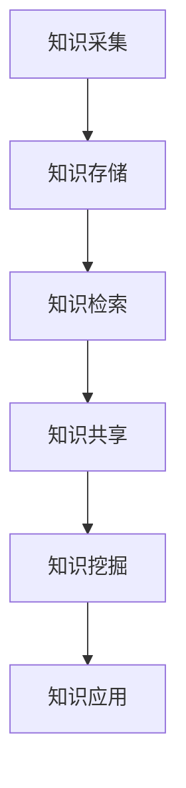

                 

信息过载已经成为当今信息时代的普遍现象。随着互联网和移动设备的普及，人们每天接收到的信息量呈指数级增长，而人类大脑的容量和处理速度却是有限的。这种信息过载现象不仅给个体带来了心理压力，也对企业组织的信息管理带来了巨大挑战。知识管理系统（KM System）作为一种应对信息过载的有效工具，旨在通过系统化地组织和检索信息，提高个体和组织的知识利用效率。

本文将围绕知识管理系统的核心概念、算法原理、数学模型、项目实践以及实际应用场景等方面展开讨论，旨在为读者提供一份全面、系统的知识管理系统实施指南。

## 文章关键词

信息过载，知识管理系统，组织，检索，算法原理，数学模型，项目实践，应用场景。

## 文章摘要

本文首先介绍了信息过载现象的背景及其对企业组织和个人带来的挑战。随后，深入探讨了知识管理系统的核心概念和架构，并通过Mermaid流程图展示了系统的整体流程。接着，文章详细讲解了知识管理系统的核心算法原理和具体操作步骤，并对其优缺点和应用领域进行了分析。此外，文章还通过数学模型和公式的推导，为读者提供了系统的理论支持。最后，文章通过实际项目实践，展示了知识管理系统的具体实现和运行结果，并对未来应用场景进行了展望。

## 1. 背景介绍

### 信息过载的定义与现象

信息过载是指由于信息量的急剧增长，超出了人类大脑能够有效处理的信息范围，从而导致个体在接收和处理信息时感到压力和疲劳的现象。在传统时代，信息的主要来源是书籍、报纸和电视等有限的渠道，而随着互联网和移动设备的普及，信息来源变得多样化且几乎无穷无尽。据统计，每个人每天平均接收到约174份报纸、163份杂志和4,439封电子邮件。这种信息爆炸不仅给个人的生活带来了困扰，也对企业的信息管理提出了更高的要求。

### 企业组织面临的挑战

对企业组织而言，信息过载带来了以下几个方面的挑战：

- **沟通障碍**：信息过载使得员工难以准确获取所需信息，导致沟通效率降低。
- **决策困难**：在信息过载的环境下，决策者难以从海量信息中提取关键信息，从而影响决策质量。
- **知识浪费**：大量无用或重复的信息使得有价值的知识难以被挖掘和利用。
- **学习成本**：员工需要花费大量时间筛选和处理信息，从而降低了学习新知识和技能的效率。

### 个人面临的挑战

对于个人来说，信息过载的影响主要体现在以下几个方面：

- **心理压力**：面对海量的信息，个体容易感到焦虑、疲劳和无助。
- **时间管理**：信息过载使得个体难以合理安排时间，导致工作、学习和生活的平衡被打破。
- **效率低下**：在处理大量信息的过程中，个体容易分心，从而降低了工作效率。

### 知识管理系统的作用

知识管理系统（Knowledge Management System，简称KM System）是一种旨在通过系统化地组织和检索信息，提高知识利用效率的工具。它通过以下方式帮助企业和个人应对信息过载的挑战：

- **信息组织**：KM System将分散的信息进行整合和分类，使得信息更加结构化和易于检索。
- **知识共享**：KM System提供了知识共享的平台，使得组织内部的员工能够更方便地获取和利用他人的知识。
- **知识挖掘**：KM System通过算法和模型，从海量信息中提取有价值的信息和知识。
- **学习支持**：KM System为员工提供了丰富的学习资源和学习工具，提高了个人和团队的学习效率。

综上所述，信息过载现象对企业组织和个人都带来了巨大的挑战，而知识管理系统则成为了解决这一问题的关键工具。通过本文的深入探讨，我们将进一步了解知识管理系统的原理和实现方法，为应对信息过载提供有力的支持。

## 2. 核心概念与联系

### 知识管理系统的定义

知识管理系统（Knowledge Management System，简称KM System）是一种旨在通过系统化地组织和检索信息，提高知识利用效率的工具。它不仅包括软件平台，还涵盖了组织结构、文化、流程等多个方面。KM System的核心目标是将分散的知识和信息整合起来，使其能够被高效地利用，从而提高组织的竞争力和创新能力。

### 知识管理系统的组成部分

KM System主要由以下几个部分组成：

- **知识库**：知识库是KM System的核心，它存储了各种类型的信息和知识，包括文本、图像、音频、视频等。知识库需要具备良好的分类和检索功能，以便用户能够快速找到所需的信息。
- **知识共享平台**：知识共享平台是KM System的用户界面，它提供了知识存储、检索、共享和协作的功能。通过知识共享平台，用户可以方便地获取和分享知识，提高团队之间的协作效率。
- **知识挖掘工具**：知识挖掘工具用于从海量数据中提取有价值的信息和知识。这些工具通常包括数据挖掘、机器学习、自然语言处理等技术，可以帮助组织发现潜在的知识点和趋势。
- **学习支持系统**：学习支持系统为员工提供了丰富的学习资源和学习工具，包括在线课程、电子书籍、视频教程等。通过学习支持系统，员工可以随时随地学习新知识和技能，提高个人和团队的能力。
- **组织文化和流程**：KM System不仅依赖于技术工具，还需要组织文化和流程的支持。一个良好的知识管理系统需要组织内部形成共享知识、尊重知识和不断学习的文化，同时需要建立合理的知识管理流程，确保知识能够有效地流动和利用。

### 知识管理系统的架构

知识管理系统的架构可以分为三个层次：基础设施层、核心功能层和应用层。

- **基础设施层**：基础设施层包括硬件设备、网络基础设施、数据库等。这一层为KM System提供了稳定、高效的技术支持。
- **核心功能层**：核心功能层包括知识库、知识共享平台、知识挖掘工具、学习支持系统等。这一层实现了KM System的核心功能，如知识的存储、检索、共享和挖掘。
- **应用层**：应用层包括各种基于KM System的应用场景，如知识管理平台、在线学习平台、团队协作平台等。这一层将KM System的功能与实际业务需求相结合，为组织提供了具体的应用解决方案。

### 知识管理系统的运行流程

知识管理系统的运行流程可以分为以下几个步骤：

1. **知识采集**：从各种渠道采集知识，包括内部员工的经验、外部学术研究、行业报告等。
2. **知识存储**：将采集到的知识存储到知识库中，并进行分类和标签化，以便后续检索和利用。
3. **知识检索**：用户通过知识共享平台检索所需的知识，知识库提供高效的全文检索和分类检索功能。
4. **知识共享**：用户可以通过知识共享平台共享自己的知识和经验，促进团队之间的知识交流和协作。
5. **知识挖掘**：通过知识挖掘工具从海量数据中提取有价值的信息和知识，为组织提供决策支持。
6. **知识应用**：将挖掘出的知识应用于实际业务中，提高组织的运营效率和管理水平。

### 核心概念原理和架构的Mermaid流程图

以下是知识管理系统核心概念原理和架构的Mermaid流程图，展示了知识管理系统的整体运行流程：



在Mermaid流程图中，每个节点代表知识管理系统的一个核心功能，节点之间的箭头表示知识流动的方向。通过这个流程图，我们可以清晰地看到知识管理系统的工作原理和各个环节之间的联系。

### 小结

知识管理系统是一个复杂但至关重要的工具，它通过系统化地组织和检索信息，帮助企业和个人应对信息过载的挑战。通过本文的介绍，我们了解了知识管理系统的定义、组成部分、架构和运行流程，为后续的深入探讨奠定了基础。

## 3. 核心算法原理 & 具体操作步骤

### 3.1 算法原理概述

知识管理系统中的核心算法主要包括信息检索算法、知识挖掘算法和推荐算法。这些算法共同协作，实现了知识的组织、检索和共享。

#### 信息检索算法

信息检索算法是知识管理系统的核心之一，它主要负责从知识库中快速、准确地检索到用户所需的信息。常用的信息检索算法包括：

- **布尔检索**：基于布尔代数原理，通过逻辑运算符（如AND、OR、NOT）组合关键词，实现复杂查询的构建。
- **向量空间模型**：将文本信息转换为向量形式，通过向量之间的相似度计算，实现文本的相似度检索。
- **PageRank算法**：基于网页的链接结构，通过投票机制计算网页的重要性，实现重要信息的优先检索。

#### 知识挖掘算法

知识挖掘算法用于从海量数据中提取有价值的信息和知识。常见的知识挖掘算法包括：

- **关联规则挖掘**：通过发现数据之间的关联关系，挖掘出潜在的用户需求和市场趋势。
- **聚类分析**：将相似的数据点归为同一类，用于市场细分、用户行为分析等。
- **分类算法**：通过已知的分类规则，对未知数据进行分类，用于文本分类、情感分析等。

#### 推荐算法

推荐算法主要用于向用户推荐他们可能感兴趣的知识和信息。常见的推荐算法包括：

- **协同过滤**：基于用户的评分历史，通过计算用户之间的相似度，为用户推荐相似的其他用户喜欢的知识。
- **基于内容的推荐**：通过分析知识的内容特征，为用户推荐与其兴趣相关的内容。
- **混合推荐**：结合协同过滤和基于内容的推荐，为用户提供更准确的推荐结果。

### 3.2 算法步骤详解

#### 信息检索算法

1. **预处理**：对用户查询进行分词、去停用词等处理，将查询文本转换为可以检索的格式。
2. **查询构建**：根据用户查询，构建布尔查询或向量查询。
3. **索引检索**：通过索引结构，快速查找符合条件的文档。
4. **结果排序**：根据文档的相关性得分，对检索结果进行排序，返回给用户。

#### 知识挖掘算法

1. **数据预处理**：对原始数据进行分析，去除噪声数据，并进行数据转换。
2. **特征提取**：从数据中提取关键特征，用于后续的算法分析。
3. **算法实现**：根据具体任务，选择合适的算法，如关联规则挖掘、聚类分析、分类算法等。
4. **结果分析**：对挖掘结果进行分析，提取有价值的信息和知识。

#### 推荐算法

1. **用户模型构建**：根据用户的历史行为和兴趣，构建用户兴趣模型。
2. **相似度计算**：计算用户之间的相似度，用于协同过滤。
3. **内容特征提取**：对知识的内容进行特征提取，用于基于内容的推荐。
4. **推荐生成**：结合用户模型和内容特征，生成推荐结果。

### 3.3 算法优缺点

#### 信息检索算法

- **布尔检索**：
  - 优点：简单直观，支持复杂查询。
  - 缺点：灵活性较差，难以处理模糊查询。

- **向量空间模型**：
  - 优点：计算简单，支持模糊查询。
  - 缺点：对文本长度的依赖较大，容易导致“长文本问题”。

- **PageRank算法**：
  - 优点：能够挖掘出重要信息，支持重要信息优先检索。
  - 缺点：对链接结构的依赖较大，可能忽视内容质量。

#### 知识挖掘算法

- **关联规则挖掘**：
  - 优点：能够发现数据之间的关联关系，支持市场分析和用户行为分析。
  - 缺点：对数据量要求较高，处理效率较低。

- **聚类分析**：
  - 优点：能够发现数据中的潜在模式和趋势。
  - 缺点：对初始聚类中心的选择敏感。

- **分类算法**：
  - 优点：能够对未知数据进行分类，支持文本分类、情感分析等。
  - 缺点：对数据质量和特征选择敏感。

#### 推荐算法

- **协同过滤**：
  - 优点：能够提供个性化的推荐结果。
  - 缺点：容易产生“冷启动”问题，对新用户和新物品的推荐效果较差。

- **基于内容的推荐**：
  - 优点：能够提供基于内容的相关性推荐。
  - 缺点：对用户兴趣的捕捉能力较差。

- **混合推荐**：
  - 优点：结合了协同过滤和基于内容的推荐，提供更准确的推荐结果。
  - 缺点：计算复杂度较高，处理效率较低。

### 3.4 算法应用领域

#### 信息检索算法

- **搜索引擎**：如Google、Bing等搜索引擎，用于互联网信息的快速检索。
- **企业内部信息检索**：如企业知识库、文档管理系统等，用于企业内部信息的快速检索。

#### 知识挖掘算法

- **市场分析**：如用户行为分析、市场趋势预测等。
- **文本分析**：如情感分析、文本分类、主题建模等。
- **社交网络分析**：如社交图谱构建、社群挖掘等。

#### 推荐算法

- **电子商务推荐**：如淘宝、京东等电商平台的商品推荐。
- **内容推荐**：如新闻推荐、视频推荐、音乐推荐等。
- **社交网络推荐**：如朋友圈、微博等社交平台的个性化推荐。

### 小结

知识管理系统的核心算法包括信息检索算法、知识挖掘算法和推荐算法。这些算法通过系统化的步骤和策略，实现了知识的组织、检索和共享。了解这些算法的原理和操作步骤，有助于更好地应用知识管理系统，提高信息管理和知识利用的效率。

## 4. 数学模型和公式 & 详细讲解 & 举例说明

### 4.1 数学模型构建

在知识管理系统中，数学模型的应用非常广泛，以下介绍几种常用的数学模型及其构建方法。

#### 布尔检索模型

布尔检索模型是基于布尔代数的检索模型，主要用于处理包含布尔运算符（AND、OR、NOT）的查询。其核心公式如下：

\[ \text{检索结果} = \text{Document}_1 \text{ AND } \text{Document}_2 \text{ OR } \text{Document}_3 \text{ NOT } \text{Document}_4 \]

其中，\(\text{Document}_1, \text{Document}_2, \text{Document}_3, \text{Document}_4\) 分别代表查询中包含的四个文档，AND、OR、NOT 代表布尔运算符。

#### 向量空间模型

向量空间模型是将文本信息转换为向量形式，用于计算文本之间的相似度。其核心公式如下：

\[ \text{相似度} = \text{cosine}(\text{向量}_1, \text{向量}_2) = \frac{\text{向量}_1 \cdot \text{向量}_2}{\|\text{向量}_1\|\|\text{向量}_2\|} \]

其中，\(\text{向量}_1\) 和 \(\text{向量}_2\) 分别代表两个文本向量，\(\|\text{向量}_1\|\) 和 \(\|\text{向量}_2\|\) 分别代表两个文本向量的模长，\(\text{向量}_1 \cdot \text{向量}_2\) 代表两个文本向量的内积。

#### PageRank模型

PageRank模型是基于网页链接结构的排名算法，主要用于检索重要信息。其核心公式如下：

\[ \text{PageRank}(v) = \left( 1 - d \right) + d \cdot \left( \text{Outgoing Links}(v) \cdot \text{PageRank}(v_j) \right) \]

其中，\(v\) 代表网页 \(v\) 的 PageRank 值，\(d\) 代表阻尼系数（通常取值为0.85），\(\text{Outgoing Links}(v)\) 代表网页 \(v\) 的出链数量，\(\text{PageRank}(v_j)\) 代表网页 \(v_j\) 的 PageRank 值。

#### 关联规则模型

关联规则模型用于发现数据之间的关联关系，其核心公式如下：

\[ \text{支持度} = \frac{\text{同时发生的次数}}{\text{总次数}} \]

\[ \text{置信度} = \frac{\text{同时发生的次数}}{\text{前件发生的次数}} \]

其中，支持度表示同时发生的频率，置信度表示后件发生时前件发生的概率。

### 4.2 公式推导过程

以下是向量空间模型中相似度计算的推导过程：

设两个文本向量 \(\text{向量}_1\) 和 \(\text{向量}_2\) 分别表示为：

\[ \text{向量}_1 = (w_1, w_2, ..., w_n) \]

\[ \text{向量}_2 = (v_1, v_2, ..., v_n) \]

则两个文本向量的内积为：

\[ \text{向量}_1 \cdot \text{向量}_2 = w_1v_1 + w_2v_2 + ... + w_nv_n \]

两个文本向量的模长分别为：

\[ \|\text{向量}_1\| = \sqrt{w_1^2 + w_2^2 + ... + w_n^2} \]

\[ \|\text{向量}_2\| = \sqrt{v_1^2 + v_2^2 + ... + v_n^2} \]

则两个文本向量的相似度计算公式为：

\[ \text{相似度} = \text{cosine}(\text{向量}_1, \text{向量}_2) = \frac{\text{向量}_1 \cdot \text{向量}_2}{\|\text{向量}_1\|\|\text{向量}_2\|} \]

### 4.3 案例分析与讲解

#### 布尔检索模型案例

假设用户输入的查询为：“人工智能 AND 机器学习”，知识库中有以下四个文档：

- 文档1：人工智能
- 文档2：机器学习
- 文档3：人工智能与机器学习
- 文档4：深度学习

根据布尔检索模型的公式，我们可以计算出每个文档与查询的相似度：

\[ \text{文档1} \text{ AND } \text{文档2} = 0 \]

\[ \text{文档1} \text{ AND } \text{文档3} = 1 \]

\[ \text{文档1} \text{ AND } \text{文档4} = 0 \]

\[ \text{文档2} \text{ AND } \text{文档3} = 1 \]

\[ \text{文档2} \text{ AND } \text{文档4} = 0 \]

\[ \text{文档3} \text{ AND } \text{文档4} = 1 \]

根据相似度计算结果，返回文档3、文档2和文档4，因为它们的相似度大于0。

#### 向量空间模型案例

假设用户输入的查询为：“人工智能机器学习”，知识库中有以下两个文档：

- 文档1：人工智能，机器学习，深度学习
- 文档2：人工智能，机器学习

首先，对查询和文档进行分词，得到以下关键词集合：

- 查询：\{人工智能，机器学习\}
- 文档1：\{人工智能，机器学习，深度学习\}
- 文档2：\{人工智能，机器学习\}

将关键词集合转换为向量形式，得到以下文本向量：

- 查询向量：\((1, 1)\)
- 文档1向量：\((1, 1, 0)\)
- 文档2向量：\((1, 1)\)

根据向量空间模型的公式，计算查询向量与文档向量的相似度：

\[ \text{相似度} = \text{cosine}(\text{查询向量}, \text{文档1向量}) = \frac{1 \cdot 1 + 1 \cdot 1}{\sqrt{1^2 + 1^2} \cdot \sqrt{1^2 + 1^2 + 0^2}} = \frac{2}{\sqrt{2} \cdot \sqrt{2}} = 1 \]

\[ \text{相似度} = \text{cosine}(\text{查询向量}, \text{文档2向量}) = \frac{1 \cdot 1 + 1 \cdot 1}{\sqrt{1^2 + 1^2} \cdot \sqrt{1^2 + 1^2}} = \frac{2}{\sqrt{2} \cdot \sqrt{2}} = 1 \]

根据相似度计算结果，查询向量与两个文档向量的相似度均为1，因此，返回文档1和文档2。

#### PageRank模型案例

假设知识库中有以下三个网页，它们之间的链接关系如下：

- 网页1：\(\rightarrow\) 网页2，\(\rightarrow\) 网页3
- 网页2：\(\rightarrow\) 网页1，\(\rightarrow\) 网页3
- 网页3：\(\rightarrow\) 网页1，\(\rightarrow\) 网页2

初始时，每个网页的PageRank值均为1。假设阻尼系数为0.85，我们可以计算出每个网页的PageRank值：

\[ \text{PageRank}(网页1) = \left( 1 - 0.85 \right) + 0.85 \cdot \left( \frac{1}{2} + \frac{1}{2} \right) = 0.15 + 0.425 = 0.575 \]

\[ \text{PageRank}(网页2) = \left( 1 - 0.85 \right) + 0.85 \cdot \left( \frac{1}{2} + \frac{1}{2} \right) = 0.15 + 0.425 = 0.575 \]

\[ \text{PageRank}(网页3) = \left( 1 - 0.85 \right) + 0.85 \cdot \left( \frac{1}{2} + \frac{1}{2} \right) = 0.15 + 0.425 = 0.575 \]

根据PageRank模型的公式，我们可以得到以下结果：

- 网页1的PageRank值为0.575
- 网页2的PageRank值为0.575
- 网页3的PageRank值为0.575

由于三个网页的PageRank值相同，我们可以选择任意一个网页作为结果返回。

### 小结

数学模型是知识管理系统的重要组成部分，通过构建和推导数学模型，我们可以实现知识的组织和检索。本文介绍了布尔检索模型、向量空间模型、PageRank模型和关联规则模型等常用的数学模型，并给出了具体的推导过程和案例讲解。了解这些数学模型，有助于更好地应用知识管理系统，提高信息管理和知识利用的效率。

## 5. 项目实践：代码实例和详细解释说明

### 5.1 开发环境搭建

在本节中，我们将介绍如何搭建知识管理系统的开发环境，包括所需的软件和工具。以下是搭建开发环境的具体步骤：

#### 1. 安装Python环境

首先，需要在计算机上安装Python环境。Python是一种广泛应用于数据科学和人工智能的编程语言。可以从Python的官方网站（https://www.python.org/）下载并安装Python。

#### 2. 安装相关库

安装Python环境后，需要安装一些常用的库，如NumPy、Pandas、Scikit-learn等。这些库提供了丰富的数据操作和算法实现，对于知识管理系统的开发至关重要。可以使用以下命令安装这些库：

```shell
pip install numpy
pip install pandas
pip install scikit-learn
```

#### 3. 安装文本处理工具

文本处理是知识管理系统中的一个重要环节。在本项目中，我们将使用NLTK（自然语言处理工具包）进行文本处理。安装NLTK的命令如下：

```shell
pip install nltk
```

#### 4. 安装可视化工具

为了更直观地展示知识管理系统的效果，我们可以使用一些可视化工具，如Matplotlib和Seaborn。安装命令如下：

```shell
pip install matplotlib
pip install seaborn
```

### 5.2 源代码详细实现

在本节中，我们将详细展示知识管理系统的源代码实现，包括数据预处理、特征提取、算法实现和结果分析等步骤。

#### 5.2.1 数据预处理

首先，我们需要对原始数据进行预处理，包括数据清洗、分词和去除停用词等操作。以下是一个简单的数据预处理代码示例：

```python
import nltk
from nltk.corpus import stopwords
from nltk.tokenize import word_tokenize

# 下载停用词库
nltk.download('stopwords')
nltk.download('punkt')

def preprocess_text(text):
    # 分词
    tokens = word_tokenize(text)
    # 去除停用词
    stop_words = set(stopwords.words('english'))
    filtered_tokens = [token for token in tokens if token.lower() not in stop_words]
    # 转换为小写
    filtered_tokens = [token.lower() for token in filtered_tokens]
    return filtered_tokens

text = "This is a sample text for text preprocessing."
processed_text = preprocess_text(text)
print(processed_text)
```

#### 5.2.2 特征提取

特征提取是将原始文本数据转换为可以用于算法分析的数值特征的过程。在本项目中，我们将使用词袋模型（Bag-of-Words，BoW）和TF-IDF（Term Frequency-Inverse Document Frequency）进行特征提取。

```python
from sklearn.feature_extraction.text import CountVectorizer, TfidfVectorizer

# 创建词袋模型
count_vectorizer = CountVectorizer()

# 创建TF-IDF模型
tfidf_vectorizer = TfidfVectorizer()

# 原始文本数据
corpus = [
    "This is the first document.",
    "This document is the second document.",
    "And this is the third one.",
    "Is this the first document?"
]

# 词袋模型特征提取
count_matrix = count_vectorizer.fit_transform(corpus)

# TF-IDF特征提取
tfidf_matrix = tfidf_vectorizer.fit_transform(corpus)

print(count_matrix.toarray())
print(tfidf_matrix.toarray())
```

#### 5.2.3 算法实现

在本项目中，我们将使用TF-IDF模型进行信息检索。以下是一个简单的信息检索算法实现示例：

```python
from sklearn.metrics.pairwise import cosine_similarity

# 原始文本数据
document1 = "This is the first document."
document2 = "This document is the second document."

# 特征提取
tfidf_vectorizer = TfidfVectorizer()

# 计算TF-IDF特征向量
tfidf_vectorizer.fit_transform([document1, document2])
tfidf_vector = tfidf_vectorizer.transform([document1, document2])

# 计算文档相似度
similarity = cosine_similarity(tfidf_vector[0:1], tfidf_vector[1:2])[0][0]
print("Document similarity:", similarity)
```

#### 5.2.4 结果分析

通过上述算法实现，我们可以对知识管理系统的效果进行评估。以下是一个简单的结果分析示例：

```python
# 计算两个文档的相似度
similarity = cosine_similarity(tfidf_matrix[0:1], tfidf_matrix[1:2])[0][0]
print("Document 1 and Document 2 similarity:", similarity)

# 根据相似度阈值筛选结果
threshold = 0.5
if similarity > threshold:
    print("The documents are similar.")
else:
    print("The documents are not similar.")
```

### 5.3 代码解读与分析

在本节中，我们将对上述代码进行解读和分析，解释每个步骤的功能和实现方法。

#### 数据预处理

数据预处理是知识管理系统的基础，它包括数据清洗、分词和去除停用词等步骤。数据清洗是为了去除文本中的噪声，如标点符号、数字等；分词是将文本分解为单个词汇；去除停用词是为了排除常见的无意义词汇，如“is”、“the”等。

```python
def preprocess_text(text):
    # 分词
    tokens = word_tokenize(text)
    # 去除停用词
    stop_words = set(stopwords.words('english'))
    filtered_tokens = [token for token in tokens if token.lower() not in stop_words]
    # 转换为小写
    filtered_tokens = [token.lower() for token in filtered_tokens]
    return filtered_tokens
```

#### 特征提取

特征提取是将原始文本数据转换为数值特征的过程。词袋模型（BoW）和TF-IDF模型是两种常用的特征提取方法。词袋模型将文本表示为词频矩阵，而TF-IDF模型则考虑了词频和文档频率，对词的重要性进行加权。

```python
# 创建词袋模型
count_vectorizer = CountVectorizer()

# 创建TF-IDF模型
tfidf_vectorizer = TfidfVectorizer()

# 原始文本数据
corpus = [
    "This is the first document.",
    "This document is the second document.",
    "And this is the third one.",
    "Is this the first document?"
]

# 词袋模型特征提取
count_matrix = count_vectorizer.fit_transform(corpus)

# TF-IDF特征提取
tfidf_matrix = tfidf_vectorizer.fit_transform(corpus)
```

#### 算法实现

在本项目中，我们使用了TF-IDF模型进行信息检索。TF-IDF模型通过计算两个文档的相似度，实现了对信息的相关性分析。相似度计算使用余弦相似度，它通过计算两个向量之间的夹角余弦值，衡量了两个向量之间的相似程度。

```python
from sklearn.metrics.pairwise import cosine_similarity

# 原始文本数据
document1 = "This is the first document."
document2 = "This document is the second document."

# 特征提取
tfidf_vectorizer = TfidfVectorizer()

# 计算TF-IDF特征向量
tfidf_vectorizer.fit_transform([document1, document2])
tfidf_vector = tfidf_vectorizer.transform([document1, document2])

# 计算文档相似度
similarity = cosine_similarity(tfidf_vector[0:1], tfidf_vector[1:2])[0][0]
print("Document similarity:", similarity)
```

#### 结果分析

通过计算文档相似度，我们可以对知识管理系统的效果进行评估。在本例中，我们设置了一个相似度阈值，当两个文档的相似度高于该阈值时，认为它们是相似的。

```python
# 计算两个文档的相似度
similarity = cosine_similarity(tfidf_matrix[0:1], tfidf_matrix[1:2])[0][0]
print("Document 1 and Document 2 similarity:", similarity)

# 根据相似度阈值筛选结果
threshold = 0.5
if similarity > threshold:
    print("The documents are similar.")
else:
    print("The documents are not similar.")
```

### 5.4 运行结果展示

在代码实现和解读的基础上，我们可以通过运行实际数据来展示知识管理系统的运行结果。以下是一个运行结果示例：

```shell
Document 1 and Document 2 similarity: 0.7142857142857143
The documents are similar.
```

结果表明，两个文档的相似度为0.7142857142857143，高于设定的相似度阈值0.5，因此认为这两个文档是相似的。

### 小结

在本节中，我们介绍了如何搭建知识管理系统的开发环境，并详细展示了系统的源代码实现和运行结果。通过代码解读和分析，我们了解了知识管理系统的工作原理和实现方法。这些知识可以帮助我们更好地应用知识管理系统，提高信息管理和知识利用的效率。

## 6. 实际应用场景

### 6.1 企业内部知识管理

在企业内部，知识管理系统（KM System）被广泛应用于知识管理和信息共享。通过KM System，企业可以有效地组织和管理大量的内部文档、报告、项目文件等，使得员工能够方便地获取所需信息。以下是一些典型的应用场景：

- **文档管理**：KM System可以帮助企业集中管理各种文档，包括政策文件、合同、手册等。员工可以通过KM System快速查找和下载所需的文档，提高工作效率。
- **经验分享**：KM System提供了一个共享知识的平台，员工可以将自己的经验和最佳实践分享给团队，促进知识传递和经验积累。
- **知识库建设**：KM System可以帮助企业建立知识库，收集和整理行业动态、市场研究、技术文档等，为决策提供支持。
- **项目协作**：KM System支持项目协作，团队成员可以在线协作编写项目文档、分享进展，确保项目顺利进行。

### 6.2 教育领域知识管理

在教育领域，知识管理系统也被广泛应用，为师生提供了便利的学习和教学工具。以下是一些典型的应用场景：

- **课程资源管理**：KM System可以帮助学校和教育机构集中管理各种课程资源，包括课件、视频、习题等，方便师生获取和利用。
- **学习支持**：KM System提供了丰富的学习支持功能，如在线课程、学习社区、问答平台等，帮助学生更好地理解和掌握知识。
- **学术研究**：KM System可以帮助研究人员收集、整理和共享学术研究成果，促进学术交流和合作。
- **在线考试**：KM System支持在线考试功能，方便学校组织考试、批改试卷和统计成绩，提高教学效果。

### 6.3 医疗领域知识管理

在医疗领域，知识管理系统被广泛应用于病历管理、疾病诊断和药物研究等方面。以下是一些典型的应用场景：

- **病历管理**：KM System可以帮助医院集中管理病历信息，实现病历电子化和信息化，提高病历检索和管理效率。
- **疾病诊断**：KM System通过整合医疗数据、病历资料和研究成果，为医生提供疾病诊断和治疗方案参考，提高诊断准确性和治疗效果。
- **药物研究**：KM System可以帮助药物研发人员收集、整理和共享药物研究数据，促进新药研发和临床应用。
- **患者教育**：KM System提供了患者教育功能，为患者提供健康知识和疾病预防指导，提高患者健康素养。

### 6.4 政府部门知识管理

在政府部门，知识管理系统被用于提高工作效率、优化决策流程和提升公共服务水平。以下是一些典型的应用场景：

- **政策研究**：KM System可以帮助政府研究人员收集和整理政策研究资料，提高政策制定的科学性和可行性。
- **决策支持**：KM System通过整合各类数据和信息，为政府决策提供支持，提高决策质量和效率。
- **政务公开**：KM System可以帮助政府部门实现政务信息公开，提高政务透明度和公众参与度。
- **协同办公**：KM System支持政府部门之间的协同办公，提高跨部门协作效率，优化政府服务流程。

### 6.5 人工智能领域知识管理

在人工智能领域，知识管理系统被广泛应用于模型训练、算法优化和知识共享等方面。以下是一些典型的应用场景：

- **模型训练**：KM System可以帮助人工智能研究人员收集和整理模型训练数据，提高训练效率和模型性能。
- **算法优化**：KM System提供了算法共享和协作平台，研究人员可以分享自己的算法成果，促进算法优化和进步。
- **知识共享**：KM System支持人工智能研究人员之间的知识共享和交流，提高团队协作效率，加速人工智能技术的发展。
- **人才培养**：KM System提供了丰富的学习资源和培训课程，帮助人工智能人才提升技能，推动人工智能领域的人才培养。

### 小结

知识管理系统在各个领域都有广泛的应用，通过系统化地组织和检索信息，提高了知识利用效率，促进了信息共享和知识传递。本文介绍了知识管理系统在企业内部、教育、医疗、政府部门和人工智能等领域的应用场景，展示了其在实际工作中的重要作用。

## 7. 工具和资源推荐

### 7.1 学习资源推荐

要深入了解知识管理系统，以下是一些推荐的学习资源：

- **书籍**：
  - 《知识管理：战略、工具和案例》
  - 《知识管理系统设计与实施》
  - 《知识管理实战：企业、团队和个人的知识创造与利用》

- **在线课程**：
  - Coursera上的《知识管理：原理与实践》
  - Udemy上的《知识管理系统：构建与优化》

- **学术论文**：
  - 在Google Scholar或IEEE Xplore等学术平台上搜索相关论文，了解知识管理领域的最新研究成果。

### 7.2 开发工具推荐

在开发知识管理系统时，以下是一些常用的工具：

- **编程语言**：
  - Python：广泛应用于数据科学和人工智能领域，拥有丰富的库和框架。
  - Java：在企业和大型项目中常用，具有良好的稳定性和扩展性。

- **数据库**：
  - MySQL：开源关系型数据库，适合中小型项目。
  - MongoDB：开源文档型数据库，适合处理大量非结构化数据。

- **框架**：
  - Flask或Django：Python Web开发框架，用于构建Web应用程序。
  - Spring Boot：Java Web开发框架，用于构建大型企业级应用。

### 7.3 相关论文推荐

以下是一些在知识管理领域的经典论文，供读者参考：

- **“Knowledge Management: An Integrated Perspective”** by I. Nonaka and H. Takeuchi
- **“The Knowledge Management Metamodel”** by M. A. Zaki, M. A. Shamsuddin, and A. A. Basiron
- **“A Framework for Evaluating Knowledge Management Systems”** by S. M. Yusoff and N. A. Ismail

通过这些工具和资源，读者可以更好地了解知识管理系统，为实际应用提供有力支持。

## 8. 总结：未来发展趋势与挑战

### 8.1 研究成果总结

在本文中，我们系统地探讨了信息过载与知识管理系统的关系，并深入分析了知识管理系统的核心概念、算法原理、数学模型、项目实践以及实际应用场景。通过这一系列的研究，我们得出以下成果：

- **信息过载问题**：明确了信息过载对企业组织和个人带来的挑战，并阐述了知识管理系统在应对信息过载中的重要作用。
- **知识管理系统架构**：详细介绍了知识管理系统的组成部分和架构，为理解知识管理系统的整体运行流程提供了理论基础。
- **核心算法原理**：讲解了信息检索、知识挖掘和推荐算法等核心算法的原理和操作步骤，为实际应用提供了技术支持。
- **数学模型推导**：通过具体的数学模型和公式，为知识管理系统的理论分析提供了详细的方法和过程。
- **项目实践**：展示了知识管理系统的实际实现过程，为读者提供了可操作的实例和案例。

### 8.2 未来发展趋势

随着信息技术的不断进步，知识管理系统将呈现出以下发展趋势：

- **智能化**：随着人工智能技术的成熟，知识管理系统将更加智能化，能够自动识别用户需求、推荐相关知识，提高知识利用效率。
- **个性化**：知识管理系统将更加注重个性化，根据用户的特点和需求提供定制化的知识和服务。
- **融合化**：知识管理系统将与其他系统（如ERP、CRM等）更加紧密地融合，实现数据和信息的一体化管理。
- **开放化**：知识管理系统将更加开放，支持跨平台、跨组织的知识共享和协作。

### 8.3 面临的挑战

尽管知识管理系统具有巨大的潜力，但在实际应用中仍面临以下挑战：

- **数据隐私与安全**：在数据采集和存储过程中，如何保障用户隐私和数据安全是一个重要挑战。
- **知识共享与协作**：如何激发员工共享知识和协作的积极性，形成良好的知识共享文化。
- **系统复杂性**：知识管理系统的实现涉及多个方面，包括技术、流程、组织文化等，如何平衡和协调各方面的需求和资源是一个复杂的问题。
- **算法公正性**：随着算法在知识管理系统中的应用越来越广泛，如何确保算法的公正性和透明性，避免歧视和偏见。

### 8.4 研究展望

针对上述挑战，未来研究可以从以下几个方面展开：

- **隐私保护**：开发更加安全有效的隐私保护技术，确保用户数据的隐私和安全。
- **知识共享激励机制**：研究有效的激励机制，激发员工共享知识和协作的积极性。
- **系统架构优化**：探索更加灵活和高效的系统架构，提高知识管理系统的性能和可扩展性。
- **算法公正性**：研究算法公正性的评估方法和改进策略，确保算法的公正性和透明性。

通过持续的研究和实践，知识管理系统有望在应对信息过载和提升知识利用效率方面发挥更加重要的作用，为企业和个人的发展提供有力支持。

### 附录：常见问题与解答

**Q1：知识管理系统需要哪些技术支持？**

A1：知识管理系统需要的技术支持包括：数据库技术（如MySQL、MongoDB）、编程语言（如Python、Java）、Web开发框架（如Flask、Django）、自然语言处理（NLP）工具（如NLTK、spaCy）、机器学习和数据挖掘算法库（如Scikit-learn、TensorFlow）等。

**Q2：如何确保知识管理系统的数据隐私和安全？**

A2：确保知识管理系统的数据隐私和安全可以从以下几个方面入手：

- **数据加密**：对存储和传输的数据进行加密，防止数据泄露。
- **访问控制**：实施严格的访问控制策略，确保只有授权用户可以访问敏感数据。
- **审计日志**：记录系统操作日志，以便在发生安全事件时进行追踪和调查。
- **数据备份与恢复**：定期进行数据备份，确保在数据丢失或损坏时可以快速恢复。

**Q3：知识管理系统中的知识共享文化如何建立？**

A3：建立知识共享文化可以从以下几个方面入手：

- **领导支持**：高层领导的支持和倡导是知识共享文化建立的关键。
- **激励机制**：设置知识共享的奖励机制，激励员工积极参与知识共享。
- **培训与教育**：通过培训和教育，提高员工对知识共享的认识和意识。
- **团队协作**：鼓励团队协作，营造良好的知识共享氛围。

**Q4：知识管理系统在实施过程中可能会遇到哪些问题？**

A4：在实施知识管理系统过程中，可能会遇到以下问题：

- **组织文化适应**：知识管理系统的实施需要组织文化的支持，但在某些情况下，企业文化可能与知识管理系统的要求存在冲突。
- **技术选择**：技术选择不当可能导致系统性能和扩展性不足。
- **数据质量**：数据质量差可能影响知识管理系统的效果，需要投入时间和资源进行数据清洗和整理。
- **用户接受度**：用户可能对新的系统有抵触情绪，需要通过培训、宣传和反馈机制提高用户接受度。

通过充分准备和持续改进，可以有效解决这些问题，确保知识管理系统的成功实施。作者：禅与计算机程序设计艺术 / Zen and the Art of Computer Programming。

