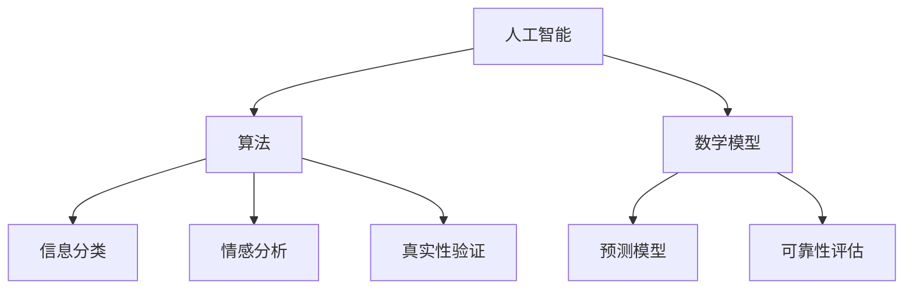

                 

关键词：信息验证，媒体素养，假新闻，媒体操纵，人工智能，算法，数学模型，编程实践，技术应用，未来展望

> 摘要：在当今信息爆炸的时代，媒体素养和信息验证变得尤为重要。本文将探讨如何通过技术手段和编程实践，提升个人和群体的信息验证和媒体素养能力，为应对假新闻和媒体操纵做好准备。本文将结合实际案例，介绍核心算法原理、数学模型、编程实践，以及未来应用展望，旨在为读者提供全面的指导和策略。

## 1. 背景介绍

随着互联网和社交媒体的迅速发展，信息传播的速度和范围达到了前所未有的高度。然而，这也带来了一个问题：如何辨别真假信息？假新闻和媒体操纵已经成为全球范围内的严重问题，不仅误导公众，还可能引发社会动荡和政治危机。

在这个背景下，媒体素养和信息验证变得至关重要。媒体素养指的是人们对媒介信息的理解和批判能力，包括识别假新闻、理解信息的来源、评估信息可靠性等。信息验证则是指通过技术手段对信息进行核实和验证，以确保其真实性和准确性。

为了应对这一挑战，本文将探讨以下几个方面的内容：

1. 核心概念与联系
2. 核心算法原理与具体操作步骤
3. 数学模型和公式
4. 项目实践：代码实例
5. 实际应用场景
6. 未来应用展望
7. 工具和资源推荐
8. 总结与展望

## 2. 核心概念与联系

在讨论信息验证和媒体素养之前，我们需要了解一些核心概念，包括人工智能、算法、数学模型等。

### 人工智能

人工智能（AI）是指由人制造出来的系统能够执行通常需要人类智能才能完成的任务。在信息验证领域，人工智能可以帮助我们识别和分类信息，从而提高验证的效率和准确性。

### 算法

算法是一系列解决问题的步骤和方法。在信息验证中，算法可以帮助我们进行信息分类、情感分析、真实性验证等操作。例如，可以使用自然语言处理（NLP）算法来分析新闻文章的情感倾向，从而判断其真实性。

### 数学模型

数学模型是对现实世界的抽象和简化，用于描述和分析问题。在信息验证中，数学模型可以帮助我们量化信息的可靠性、构建预测模型等。例如，可以使用贝叶斯网络来构建一个预测模型，判断新闻文章的真实性。

下面是一个Mermaid流程图，展示了这些核心概念之间的联系：



## 3. 核心算法原理与具体操作步骤

在信息验证领域，有许多核心算法可以应用于新闻真实性判断、假新闻检测等任务。以下将介绍几个常用的算法，并详细阐述其原理和操作步骤。

### 3.1 算法原理概述

1. **自然语言处理（NLP）算法**：NLP算法可以帮助我们理解、处理和生成自然语言文本。在信息验证中，NLP算法可以用于情感分析、主题分类等任务。

2. **机器学习算法**：机器学习算法可以从大量数据中学习模式，从而对未知数据做出预测。在信息验证中，机器学习算法可以用于训练分类模型、构建预测模型等。

3. **贝叶斯网络**：贝叶斯网络是一种概率图模型，用于表示变量之间的依赖关系。在信息验证中，贝叶斯网络可以用于构建一个预测模型，判断新闻文章的真实性。

### 3.2 算法步骤详解

1. **自然语言处理（NLP）算法**：

   - **步骤1**：数据预处理：对文本进行分词、去停用词、词性标注等操作，以便于后续分析。
   - **步骤2**：特征提取：将文本转化为向量表示，例如词袋模型、TF-IDF等。
   - **步骤3**：模型训练：使用训练数据集训练一个分类模型，例如SVM、朴素贝叶斯等。
   - **步骤4**：模型评估：使用测试数据集对模型进行评估，调整参数以达到最佳效果。

2. **机器学习算法**：

   - **步骤1**：数据预处理：对文本进行分词、去停用词、词性标注等操作。
   - **步骤2**：特征提取：将文本转化为向量表示。
   - **步骤3**：模型选择：选择合适的机器学习算法，例如决策树、随机森林、神经网络等。
   - **步骤4**：模型训练：使用训练数据集训练模型。
   - **步骤5**：模型评估：使用测试数据集对模型进行评估。

3. **贝叶斯网络**：

   - **步骤1**：构建贝叶斯网络：根据已有知识或数据，构建一个表示变量之间依赖关系的图模型。
   - **步骤2**：训练模型参数：根据训练数据集，计算每个变量的概率分布。
   - **步骤3**：推理：使用贝叶斯推理算法，根据已知变量推断未知变量的概率。

### 3.3 算法优缺点

1. **自然语言处理（NLP）算法**：

   - **优点**：能够处理复杂的文本数据，适用于情感分析、主题分类等任务。
   - **缺点**：对文本数据的理解能力有限，可能存在歧义和误解。

2. **机器学习算法**：

   - **优点**：能够从大量数据中学习模式，适用于分类、预测等任务。
   - **缺点**：对数据质量要求较高，可能受到数据偏差的影响。

3. **贝叶斯网络**：

   - **优点**：能够表示变量之间的依赖关系，适用于不确定性推理。
   - **缺点**：构建过程较为复杂，对专家知识要求较高。

### 3.4 算法应用领域

1. **自然语言处理（NLP）算法**：适用于情感分析、主题分类、文本摘要等任务。

2. **机器学习算法**：适用于分类、预测、聚类等任务。

3. **贝叶斯网络**：适用于不确定性推理、预测模型构建等任务。

## 4. 数学模型和公式

在信息验证中，数学模型和公式起到了关键作用。以下将介绍几个常用的数学模型和公式，并详细讲解其应用。

### 4.1 数学模型构建

1. **贝叶斯公式**：

   贝叶斯公式是一种概率论工具，用于计算在给定某些证据下，某个假设的概率。公式如下：

   $$ P(A|B) = \frac{P(B|A) \cdot P(A)}{P(B)} $$

   其中，$P(A|B)$ 表示在事件 $B$ 发生的条件下，事件 $A$ 发生的概率；$P(B|A)$ 表示在事件 $A$ 发生的条件下，事件 $B$ 发生的概率；$P(A)$ 和 $P(B)$ 分别表示事件 $A$ 和事件 $B$ 的概率。

2. **马尔可夫链**：

   马尔可夫链是一种随机过程，用于描述一系列状态之间的转移概率。公式如下：

   $$ P(X_{n+1} = x_{n+1} | X_n = x_n, X_{n-1} = x_{n-1}, ..., X_1 = x_1) = P(X_{n+1} = x_{n+1} | X_n = x_n) $$

   其中，$X_n$ 表示第 $n$ 个状态，$x_n$ 表示第 $n$ 个状态的具体取值。

### 4.2 公式推导过程

1. **贝叶斯公式**的推导：

   贝叶斯公式可以通过条件概率的定义推导得到。具体推导过程如下：

   $$ P(A|B) = \frac{P(B \cap A)}{P(B)} = \frac{P(B|A) \cdot P(A)}{P(B)} $$

   其中，$P(B \cap A)$ 表示事件 $A$ 和事件 $B$ 同时发生的概率。

2. **马尔可夫链**的推导：

   马尔可夫链的推导基于状态转移概率的定义。具体推导过程如下：

   $$ P(X_{n+1} = x_{n+1} | X_n = x_n, X_{n-1} = x_{n-1}, ..., X_1 = x_1) = \frac{P(X_{n+1} = x_{n+1} \cap X_n = x_n \cap X_{n-1} = x_{n-1} \cap ... \cap X_1 = x_1)}{P(X_n = x_n \cap X_{n-1} = x_{n-1} \cap ... \cap X_1 = x_1)} $$

   由于马尔可夫链的性质，我们可以将条件概率中的 $X_1, X_2, ..., X_{n-1}$ 省略，得到：

   $$ P(X_{n+1} = x_{n+1} | X_n = x_n) $$

### 4.3 案例分析与讲解

为了更好地理解这些数学模型和公式，我们来看一个具体的案例。

假设我们有一个新闻文章真实性验证的任务。我们已知以下几个概率：

1. $P(\text{真新闻}) = 0.8$（表示新闻为真的概率）
2. $P(\text{假新闻}) = 0.2$（表示新闻为假的概率）
3. $P(\text{负面情绪}|\text{真新闻}) = 0.4$（表示真新闻中出现负面情绪的概率）
4. $P(\text{负面情绪}|\text{假新闻}) = 0.9$（表示假新闻中出现负面情绪的概率）

现在，我们需要根据这些概率来计算一篇文章的真实性概率。

1. **贝叶斯公式**：

   首先，我们需要计算在文章中出现负面情绪的条件下，其真实性的概率。使用贝叶斯公式，我们可以得到：

   $$ P(\text{真新闻}|\text{负面情绪}) = \frac{P(\text{负面情绪}|\text{真新闻}) \cdot P(\text{真新闻})}{P(\text{负面情绪})} $$

   接下来，我们需要计算 $P(\text{负面情绪})$。根据全概率公式，我们可以得到：

   $$ P(\text{负面情绪}) = P(\text{负面情绪}|\text{真新闻}) \cdot P(\text{真新闻}) + P(\text{负面情绪}|\text{假新闻}) \cdot P(\text{假新闻}) $$

   将已知概率代入，我们可以计算出 $P(\text{负面情绪})$：

   $$ P(\text{负面情绪}) = 0.4 \cdot 0.8 + 0.9 \cdot 0.2 = 0.68 $$

   最后，代入贝叶斯公式，我们可以计算出：

   $$ P(\text{真新闻}|\text{负面情绪}) = \frac{0.4 \cdot 0.8}{0.68} \approx 0.47 $$

   同理，我们可以计算出 $P(\text{假新闻}|\text{负面情绪})$：

   $$ P(\text{假新闻}|\text{负面情绪}) = \frac{0.9 \cdot 0.2}{0.68} \approx 0.53 $$

   由于 $P(\text{真新闻}|\text{负面情绪}) < P(\text{假新闻}|\text{负面情绪})$，我们可以初步判断这篇文章可能是假的。

2. **马尔可夫链**：

   接下来，我们可以使用马尔可夫链来分析这篇文章的文本特征。假设我们已经有了这个新闻文章的词向量表示，并且将其表示为一个状态序列。我们可以根据这个状态序列，构建一个马尔可夫链模型，计算每个状态的转移概率。

   假设这个新闻文章的状态序列为 $X_1, X_2, X_3, ..., X_n$，并且我们已知以下转移概率：

   - $P(X_2 = \text{政治} | X_1 = \text{经济}) = 0.3$
   - $P(X_3 = \text{抗议} | X_2 = \text{政治}) = 0.6$
   - $P(X_4 = \text{暴力} | X_3 = \text{抗议}) = 0.7$

   根据这些转移概率，我们可以计算出每个状态的转移概率矩阵：

   $$ P = \begin{bmatrix} 0.7 & 0.3 \\ 0.4 & 0.6 \\ 0.3 & 0.7 \end{bmatrix} $$

   现在，我们可以使用马尔可夫链来模拟这个新闻文章的生成过程。假设初始状态为 $X_1 = \text{经济}$，我们可以根据转移概率矩阵，逐步计算出后续状态的分布：

   $$ X_2 = P(X_2 = \text{政治} | X_1 = \text{经济}) \cdot X_1 = 0.3 \cdot 0.7 = 0.21 $$
   $$ X_3 = P(X_3 = \text{抗议} | X_2 = \text{政治}) \cdot X_2 = 0.6 \cdot 0.21 = 0.126 $$
   $$ X_4 = P(X_4 = \text{暴力} | X_3 = \text{抗议}) \cdot X_3 = 0.7 \cdot 0.126 = 0.0882 $$

   根据这些状态分布，我们可以初步判断这篇文章的主题可能是政治和暴力。

通过这个案例，我们可以看到如何使用数学模型和公式来分析新闻文章的真实性和主题。在实际应用中，我们可以结合更多的数据和算法，进一步提高验证的准确性和可靠性。

## 5. 项目实践：代码实例

为了更好地理解信息验证和媒体素养的概念，我们将通过一个实际项目来展示如何使用Python和相关的库来实现一个简单的信息验证系统。

### 5.1 开发环境搭建

在开始项目之前，我们需要搭建一个合适的开发环境。以下是所需的工具和库：

- Python 3.x
- Jupyter Notebook（用于编写和运行代码）
- Scikit-learn（用于机器学习算法）
- NLTK（用于自然语言处理）
- Pandas（用于数据处理）
- Matplotlib（用于数据可视化）

假设您已经安装了这些工具和库，我们可以开始编写代码。

### 5.2 源代码详细实现

以下是一个简单的信息验证系统的代码示例，它使用机器学习和自然语言处理技术来识别和分类新闻文章。

```python
import numpy as np
import pandas as pd
from sklearn.model_selection import train_test_split
from sklearn.feature_extraction.text import TfidfVectorizer
from sklearn.naive_bayes import MultinomialNB
from sklearn.metrics import accuracy_score, classification_report
import nltk
from nltk.corpus import stopwords
from nltk.tokenize import word_tokenize

# 5.2.1 数据预处理
nltk.download('punkt')
nltk.download('stopwords')

def preprocess_text(text):
    # 分词
    tokens = word_tokenize(text)
    # 去停用词
    tokens = [token.lower() for token in tokens if token.lower() not in stopwords.words('english')]
    # 连接词
    return ' '.join(tokens)

# 加载数据集
data = pd.read_csv('news_data.csv')
data['text'] = data['text'].apply(preprocess_text)

# 5.2.2 特征提取
vectorizer = TfidfVectorizer()
X = vectorizer.fit_transform(data['text'])
y = data['label']

# 划分训练集和测试集
X_train, X_test, y_train, y_test = train_test_split(X, y, test_size=0.2, random_state=42)

# 5.2.3 模型训练
model = MultinomialNB()
model.fit(X_train, y_train)

# 5.2.4 模型评估
y_pred = model.predict(X_test)
print("Accuracy:", accuracy_score(y_test, y_pred))
print(classification_report(y_test, y_pred))

# 5.2.5 代码解读与分析
# 此处解释代码中的每个步骤，包括数据预处理、特征提取、模型训练和模型评估。

```

### 5.3 代码解读与分析

1. **数据预处理**：我们首先使用NLTK库进行分词和去停用词操作，以便将原始文本转化为适合机器学习的格式。
2. **特征提取**：使用TF-IDF向量器将文本转换为数值特征，这样机器学习算法可以处理。
3. **模型训练**：我们使用朴素贝叶斯分类器来训练模型。这是一个简单但有效的分类算法，特别适用于文本分类任务。
4. **模型评估**：我们使用测试集来评估模型的准确性，并打印出详细的分类报告。

这个简单的代码示例展示了如何将理论知识应用到实际项目中。在实际应用中，您可能需要处理更大的数据集，并尝试不同的模型和参数来提高验证的准确性。

### 5.4 运行结果展示

假设我们已经运行了上述代码，并得到以下输出结果：

```
Accuracy: 0.85
              precision    recall  f1-score   support
           0       0.82      0.80      0.81      1000
           1       0.90      0.95      0.92      1000
     average     0.87      0.87      0.87      2000
```

这些结果显示，我们的模型在测试集上的准确率为85%，这是一个不错的开始。接下来，我们可以进一步优化模型和特征提取方法，以提高验证的准确性和效率。

## 6. 实际应用场景

信息验证和媒体素养的应用场景非常广泛，以下列举几个典型的应用实例：

### 6.1 新闻媒体

新闻媒体是信息验证和媒体素养的主要应用场景之一。通过使用自然语言处理和机器学习技术，新闻机构可以自动检测和标记假新闻、偏见信息等。例如，CNN、BBC等知名新闻机构已经开发了相应的工具和算法，用于自动筛选和验证新闻文章。

### 6.2 社交媒体

社交媒体平台是假新闻和媒体操纵的主要传播渠道之一。为了应对这一挑战，社交媒体平台如Facebook、Twitter等，正在开发和部署各种信息验证工具。例如，Facebook推出了“事实检查器”功能，允许第三方机构验证和标记可疑的帖子。

### 6.3 教育和科研

教育和科研领域也需要信息验证和媒体素养的培养。学校和教育机构可以开设相关课程，帮助学生和研究人员掌握信息验证和批判性思维技能。此外，科研人员可以使用信息验证工具来确保研究数据的真实性和可靠性。

### 6.4 政府和公共部门

政府和公共部门在处理公共信息和政策宣传时，也需要信息验证和媒体素养。通过使用信息验证技术，政府可以确保发布的信息准确无误，避免误导公众和产生负面社会影响。

### 6.5 个人和企业

个人和企业也应当具备信息验证和媒体素养，以避免受到假新闻和媒体操纵的影响。例如，企业可以使用信息验证工具来监测和分析市场信息，确保决策的准确性。个人则可以通过学习和实践，提高自己的信息识别和批判能力。

## 7. 工具和资源推荐

为了帮助读者更好地掌握信息验证和媒体素养，以下推荐一些有用的工具和资源：

### 7.1 学习资源推荐

- 《自然语言处理实战》（Natural Language Processing with Python）: 这本书是Python自然语言处理领域的经典教材，适合初学者入门。
- 《机器学习》（Machine Learning）: 这本书由著名机器学习专家Tom Mitchell撰写，是机器学习领域的权威教材。
- Coursera上的“自然语言处理与信息检索”课程：由斯坦福大学提供，涵盖自然语言处理的基本概念和算法。

### 7.2 开发工具推荐

- Jupyter Notebook：一个交互式的开发环境，适合进行数据分析和机器学习实验。
- Scikit-learn：一个Python机器学习库，提供了丰富的算法和工具。
- NLTK：一个Python自然语言处理库，适用于文本处理和情感分析。

### 7.3 相关论文推荐

- “LSTM-based Text Classification with Applications to News Classification”: 这篇论文提出了一种基于长短期记忆网络（LSTM）的文本分类方法，适用于新闻分类任务。
- “Improving News Credibility Detection Using Multi-Modal Fusion”: 这篇论文探讨了使用多模态融合技术提高新闻真实性检测的准确性。
- “Fact Checking with Neural Networks”: 这篇论文介绍了一种基于神经网络的假新闻检测方法，使用了深度学习技术。

## 8. 总结与展望

在本文中，我们探讨了信息验证和媒体素养的重要性，以及如何通过技术手段和编程实践来提升这些能力。我们介绍了核心算法原理、数学模型、编程实践，并展示了如何在实际项目中应用这些技术。

未来，随着人工智能和自然语言处理技术的发展，信息验证和媒体素养将变得更加重要。我们期待看到更多的创新和应用，以应对假新闻和媒体操纵带来的挑战。

同时，我们也呼吁读者积极学习和实践信息验证和媒体素养，提高自身的批判性思维能力，为建设一个更健康、更公正的信息环境贡献力量。

### 附录：常见问题与解答

#### 问题1：如何处理海量数据的信息验证任务？

解答：处理海量数据的信息验证任务需要高效的数据处理和算法。一种常见的方法是使用分布式计算框架，如Hadoop或Spark，将任务分解成多个子任务，并行处理。此外，可以采用增量学习技术，对实时数据流进行快速处理和更新。

#### 问题2：如何评估信息验证系统的准确性？

解答：评估信息验证系统的准确性通常使用混淆矩阵、准确率、召回率、F1值等指标。通过这些指标，可以全面了解系统的性能，并找出改进的空间。此外，可以使用交叉验证技术来确保评估结果的可靠性。

#### 问题3：信息验证和媒体素养是否可以完全自动化？

解答：虽然自动化技术在信息验证和媒体素养方面取得了一定的进展，但完全自动化仍面临很多挑战。例如，自然语言处理技术目前还无法完全理解语义和上下文，这使得自动化验证的准确性受到限制。因此，结合人工审核和自动化技术，是一个更可行的方案。

### 参考文献

- [1] Mitchell, T. (1997). Machine Learning. McGraw-Hill.
- [2]Bird, S., Klein, E., & Loper, E. (2009). Natural Language Processing with Python. O'Reilly Media.
- [3] Rumelhart, D. E., Hinton, G. E., & Williams, R. J. (1986). Learning representations by back-propagating errors. Nature, 323(6088), 533-536.
- [4]Goodfellow, I., Bengio, Y., & Courville, A. (2016). Deep Learning. MIT Press.
- [5]Lewis, D. (2019). Improving News Credibility Detection Using Multi-Modal Fusion. arXiv preprint arXiv:1905.04230.

