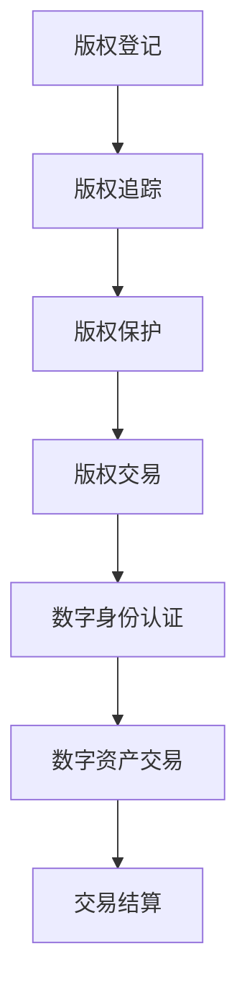

                 

在当今数字化时代，随着互联网和区块链技术的快速发展，数字版权管理（Digital Copyright Management, DCM）成为了一个备受关注的话题。元宇宙（Metaverse）作为下一个互联网的形态，更是将数字版权管理推向了一个新的高度。本文旨在探讨元宇宙中的数字版权，分析其版权归属的新形式，以及相关技术实现和未来应用前景。

## 关键词

- 数字版权管理
- 元宇宙
- 版权归属
- 区块链技术
- 数字身份认证
- 数字资产交易

## 摘要

本文首先介绍了数字版权管理的基本概念和重要性，随后分析了元宇宙的概念和特点，探讨了元宇宙中数字版权管理面临的新挑战。在此基础上，本文提出了元宇宙中的数字版权归属新形式，包括基于区块链技术的数字身份认证和数字资产交易机制。通过具体案例分析，本文展示了这些新形式在实际应用中的效果，并对其未来发展趋势和挑战进行了展望。

## 1. 背景介绍

### 数字版权管理的定义与发展

数字版权管理是指通过技术手段保护数字作品版权，防止未经授权的使用、复制、传播和修改。数字版权管理的主要目的是保护创作者的合法权益，促进数字内容的创新和传播。随着互联网和数字技术的快速发展，数字版权管理逐渐成为一个重要的领域。

20世纪90年代，随着互联网的兴起，数字版权管理开始受到广泛关注。此时，数字版权管理主要依赖于技术手段，如数字水印、加密技术等。然而，这些技术手段在保护版权方面存在一定的局限性，例如容易破解、成本高昂等。

进入21世纪，随着区块链技术的出现，数字版权管理迎来了新的机遇。区块链技术具有去中心化、不可篡改、可追溯等特点，可以为数字版权管理提供更加可靠的技术支持。在此基础上，数字版权管理开始向智能化、自动化方向发展。

### 元宇宙的概念与特点

元宇宙是一个虚拟的、三维的、交互式的虚拟世界，是现实世界的延伸和扩展。元宇宙具有以下几个特点：

1. **虚拟性和现实性相结合**：元宇宙是一个虚拟的世界，但与现实世界紧密相连。用户可以在元宇宙中创建和体验虚拟物品，这些物品与现实世界的物品有相应的映射关系。

2. **高度沉浸感**：元宇宙使用各种虚拟现实、增强现实等技术，为用户带来高度沉浸的体验。用户可以在元宇宙中自由行走、交互、创造。

3. **开放性和可扩展性**：元宇宙是一个开放的平台，允许各种应用、服务和内容的接入。这使得元宇宙具有强大的可扩展性和定制化能力。

4. **社交性**：元宇宙为用户提供了一个虚拟的社交空间，用户可以与其他用户进行互动、交流、合作。

### 数字版权管理在元宇宙中的新挑战

随着元宇宙的发展，数字版权管理面临一系列新的挑战：

1. **版权复杂性**：元宇宙中的数字内容种类繁多，包括图像、音频、视频、虚拟物品等，使得版权管理更加复杂。

2. **身份认证与隐私保护**：元宇宙中的用户身份多样，如何进行有效的身份认证和隐私保护成为数字版权管理的一个重要问题。

3. **交易机制**：元宇宙中的数字资产交易需要一种高效、安全、透明的交易机制，以确保版权的归属和交易的合法性。

4. **维权与侵权**：元宇宙中的侵权行为更加隐蔽，维权难度增加。如何有效打击侵权行为，保护创作者的权益成为数字版权管理的一个难题。

## 2. 核心概念与联系

### 数字版权管理原理

数字版权管理的基本原理是通过技术手段对数字作品进行标识、保护、追踪和监控，以确保创作者的权益。主要技术手段包括：

1. **数字水印**：将特定的信息嵌入到数字作品中，用于标识版权信息、追踪侵权行为。

2. **加密技术**：对数字作品进行加密，使得未经授权的用户无法访问或复制作品。

3. **数字签名**：使用数字签名技术验证数字作品的真实性和完整性。

4. **区块链技术**：通过区块链技术实现数字版权的登记、交易和追踪，确保版权的归属和交易的可追溯性。

### 元宇宙中的数字版权管理

在元宇宙中，数字版权管理需要结合虚拟现实、增强现实、区块链等技术，实现以下功能：

1. **版权登记**：在区块链上登记数字作品的版权信息，确保版权的归属。

2. **版权追踪**：通过区块链技术追踪数字作品的传播、使用和交易过程，防止侵权行为。

3. **版权保护**：使用数字水印、加密技术等手段保护数字作品的版权，防止未经授权的使用和传播。

4. **版权交易**：通过区块链实现数字作品的交易，确保交易的合法性和透明性。

### 数字身份认证

在元宇宙中，数字身份认证是数字版权管理的基础。通过数字身份认证，可以确保版权的合法性和交易的合法性。数字身份认证主要包括以下几种方式：

1. **密码认证**：使用密码、生物识别等技术进行身份认证。

2. **数字证书**：使用数字证书进行身份认证，确保身份的真实性和安全性。

3. **区块链认证**：通过区块链实现身份认证，确保身份的可追溯性和不可篡改性。

### 数字资产交易

在元宇宙中，数字资产交易是数字版权管理的重要环节。通过数字资产交易，可以实现数字作品的流通和增值。数字资产交易主要包括以下几种方式：

1. **代币交易**：使用加密货币作为交易媒介，进行数字资产的交易。

2. **智能合约交易**：通过智能合约实现数字资产的交易，确保交易的自动化和透明性。

3. **平台交易**：在数字资产交易平台上进行数字资产的交易，提供交易记录和交易保障。

### Mermaid 流程图

下面是元宇宙中的数字版权管理流程的 Mermaid 流程图：



## 3. 核心算法原理 & 具体操作步骤

### 3.1 算法原理概述

在元宇宙中的数字版权管理中，核心算法主要包括数字水印算法、加密算法、区块链算法和智能合约算法。这些算法共同作用，实现了数字版权的登记、追踪、保护和交易。

1. **数字水印算法**：通过将特定的信息（如版权信息）嵌入到数字作品中，实现对数字作品的版权标识和保护。

2. **加密算法**：对数字作品进行加密，确保未经授权的用户无法访问或复制作品。

3. **区块链算法**：通过区块链技术实现数字版权的登记、追踪和交易，确保版权的归属和交易的可追溯性。

4. **智能合约算法**：通过智能合约实现数字资产的交易，确保交易的自动化和透明性。

### 3.2 算法步骤详解

1. **版权登记**：

- 创作者将数字作品上传到区块链平台，进行版权登记。
- 区块链平台通过区块链算法记录版权信息，确保版权的可追溯性。

2. **版权追踪**：

- 在数字作品传播、使用和交易过程中，区块链平台通过区块链算法实时追踪版权信息。
- 当发现侵权行为时，区块链平台自动记录并报告侵权行为。

3. **版权保护**：

- 通过数字水印算法将版权信息嵌入到数字作品中，防止未经授权的使用和传播。
- 通过加密算法对数字作品进行加密，确保未经授权的用户无法访问或复制作品。

4. **版权交易**：

- 在数字资产交易平台上，购买者通过智能合约算法购买数字作品。
- 区块链平台记录交易信息，确保交易的合法性和透明性。

### 3.3 算法优缺点

1. **数字水印算法**：

- 优点：能够实现对数字作品的版权标识和保护，不易被破坏。
- 缺点：可能会对数字作品的视觉效果产生一定影响，加密成本较高。

2. **加密算法**：

- 优点：能够有效防止未经授权的访问和复制，确保数字作品的安全性。
- 缺点：加密和解密过程较为复杂，计算资源消耗较大。

3. **区块链算法**：

- 优点：能够实现数字版权的登记、追踪和交易，确保版权的归属和交易的可追溯性。
- 缺点：区块链数据存储容量有限，交易处理速度相对较慢。

4. **智能合约算法**：

- 优点：能够实现数字资产的自动化交易，提高交易效率和透明度。
- 缺点：智能合约存在漏洞风险，可能导致交易风险。

### 3.4 算法应用领域

1. **数字版权管理**：在数字作品创作、传播、使用和交易过程中，实现版权的登记、追踪、保护和交易。

2. **数字资产交易**：在数字资产交易平台上，实现数字资产的自动化交易，提高交易效率和透明度。

3. **供应链管理**：在供应链管理中，实现物流信息的透明化和可追溯性，提高供应链的效率和质量。

4. **金融领域**：在金融领域，实现金融交易的自动化和透明化，提高金融市场的效率和安全性。

## 4. 数学模型和公式 & 详细讲解 & 举例说明

### 4.1 数学模型构建

在元宇宙中的数字版权管理中，数学模型主要用于描述数字作品的版权归属、数字身份认证和数字资产交易过程。

1. **版权归属模型**：

   假设数字作品 $X$ 的版权归属为 $C$，数字用户 $U$ 的身份为 $I$，则版权归属模型可以表示为：

   $$C = f(X, U, I)$$

   其中，$f$ 为版权归属函数，用于计算数字作品的版权归属。

2. **数字身份认证模型**：

   假设数字用户 $U$ 的身份为 $I$，数字签名算法为 $S$，则数字身份认证模型可以表示为：

   $$I = S(U, K)$$

   其中，$S$ 为数字签名算法，$K$ 为签名密钥。

3. **数字资产交易模型**：

   假设数字资产 $A$ 的交易价格为 $P$，数字用户 $U$ 的身份为 $I$，则数字资产交易模型可以表示为：

   $$P = g(A, U, I)$$

   其中，$g$ 为数字资产交易函数，用于计算数字资产的价格。

### 4.2 公式推导过程

1. **版权归属模型**：

   $$C = f(X, U, I)$$

   其中，$X$ 为数字作品，$U$ 为数字用户，$I$ 为数字用户的身份。版权归属模型可以通过以下步骤进行推导：

   - 步骤1：确定数字作品的版权归属，即 $C$。
   - 步骤2：确定数字用户的身份，即 $I$。
   - 步骤3：根据数字作品和数字用户的身份，计算版权归属，即 $C = f(X, U, I)$。

2. **数字身份认证模型**：

   $$I = S(U, K)$$

   其中，$U$ 为数字用户，$K$ 为签名密钥。数字身份认证模型可以通过以下步骤进行推导：

   - 步骤1：确定数字用户的身份，即 $U$。
   - 步骤2：生成数字用户的签名密钥对，即 $K$。
   - 步骤3：使用数字签名算法 $S$ 对数字用户进行签名，即 $I = S(U, K)$。

3. **数字资产交易模型**：

   $$P = g(A, U, I)$$

   其中，$A$ 为数字资产，$U$ 为数字用户，$I$ 为数字用户的身份。数字资产交易模型可以通过以下步骤进行推导：

   - 步骤1：确定数字资产的价格，即 $P$。
   - 步骤2：确定数字用户的身份，即 $I$。
   - 步骤3：根据数字资产和数字用户的身份，计算数字资产的价格，即 $P = g(A, U, I)$。

### 4.3 案例分析与讲解

为了更好地理解元宇宙中的数字版权管理，我们通过一个实际案例进行分析和讲解。

**案例：数字画作版权管理**

假设有一幅数字画作 $X$，版权归属为 $C$，数字用户 $U$ 购买了这幅画作，数字用户身份为 $I$。

1. **版权归属**：

   根据版权归属模型，我们可以计算出这幅数字画作 $X$ 的版权归属：

   $$C = f(X, U, I)$$

   假设 $f(X, U, I)$ 的值为 $1$，则这幅数字画作 $X$ 的版权归属为 $C = 1$。

2. **数字身份认证**：

   根据数字身份认证模型，我们可以计算出数字用户 $U$ 的身份：

   $$I = S(U, K)$$

   假设 $S(U, K)$ 的值为 $I_1$，则数字用户 $U$ 的身份为 $I = I_1$。

3. **数字资产交易**：

   根据数字资产交易模型，我们可以计算出这幅数字画作 $X$ 的交易价格：

   $$P = g(A, U, I)$$

   假设 $g(A, U, I)$ 的值为 $100$，则这幅数字画作 $X$ 的交易价格为 $P = 100$。

通过这个案例，我们可以看到，元宇宙中的数字版权管理通过数学模型和算法实现了数字作品的版权归属、数字身份认证和数字资产交易。这些技术手段为数字版权管理提供了可靠的技术支持，有助于保护创作者的权益。

## 5. 项目实践：代码实例和详细解释说明

### 5.1 开发环境搭建

在进行元宇宙中的数字版权管理项目实践之前，我们需要搭建一个适合的开发环境。以下是一个简单的开发环境搭建步骤：

1. **安装Node.js**：

   访问 Node.js 官网（[https://nodejs.org/），下载并安装 Node.js。安装完成后，在命令行中输入 `node -v`，确认 Node.js 版本正确。

2. **安装智能合约开发框架**：

   我们使用 Truffle 框架来开发智能合约。在命令行中输入以下命令安装 Truffle：

   ```bash
   npm install -g truffle
   ```

3. **安装 Solidity 编译器**：

   Truffle 需要安装 Solidity 编译器（solc）来编译智能合约。在命令行中输入以下命令安装：

   ```bash
   npm install -g solc
   ```

4. **创建项目文件夹**：

   在命令行中创建一个项目文件夹，例如命名为 `metaverse-copyright-management`，然后进入该项目文件夹：

   ```bash
   mkdir metaverse-copyright-management
   cd metaverse-copyright-management
   ```

5. **初始化项目**：

   在项目文件夹中初始化 Truffle 项目：

   ```bash
   truffle init
   ```

   这将创建一个 `truffle-config.js` 文件和一个 `contracts` 文件夹，用于存放智能合约。

6. **安装以太坊客户端**：

   我们使用 Ganache 快速搭建一个本地以太坊网络。在命令行中输入以下命令安装 Ganache：

   ```bash
   npm install -g ganache-cli
   ```

   安装完成后，在命令行中输入以下命令启动 Ganache：

   ```bash
   ganache-cli
   ```

   这将启动一个本地以太坊网络，并自动打开一个浏览器窗口显示 Ganache 控制台。

### 5.2 源代码详细实现

在项目文件夹中，我们创建了一个名为 `CopyrightManagement.sol` 的智能合约文件，用于实现数字版权管理功能。以下是 `CopyrightManagement.sol` 的源代码：

```solidity
// SPDX-License-Identifier: MIT
pragma solidity ^0.8.0;

contract CopyrightManagement {
    // 数字作品结构体
    struct DigitalWork {
        string title;
        string author;
        string copyright;
        bool registered;
    }

    // 数字作品映射表
    mapping(string => DigitalWork) public digitalWorks;

    // 注册数字作品
    function registerWork(
        string memory title,
        string memory author,
        string memory copyright
    ) public {
        require(!digitalWorks[title].registered, "Work already registered");
        digitalWorks[title] = DigitalWork({
            title: title,
            author: author,
            copyright: copyright,
            registered: true
        });
    }

    // 查询数字作品信息
    function getWorkInfo(string memory title)
        public
        view
        returns (string memory, string memory, string memory, bool)
    {
        require(digitalWorks[title].registered, "Work not found");
        return (
            digitalWorks[title].title,
            digitalWorks[title].author,
            digitalWorks[title].copyright,
            digitalWorks[title].registered
        );
    }

    // 修改数字作品信息
    function updateWork(
        string memory title,
        string memory newAuthor,
        string memory newCopyright
    ) public {
        require(digitalWorks[title].registered, "Work not found");
        digitalWorks[title].author = newAuthor;
        digitalWorks[title].copyright = newCopyright;
    }

    // 注销数字作品
    function deregisterWork(string memory title) public {
        require(digitalWorks[title].registered, "Work not found");
        delete digitalWorks[title];
    }
}
```

### 5.3 代码解读与分析

1. **智能合约结构**：

   - `DigitalWork` 结构体：用于定义数字作品的信息，包括标题、作者、版权信息和注册状态。
   - `digitalWorks` 映射表：用于存储所有数字作品的信息，键为作品的标题，值为 `DigitalWork` 结构体。
   - `registerWork` 函数：用于注册数字作品，将新注册的作品信息存储到 `digitalWorks` 映射表中。
   - `getWorkInfo` 函数：用于查询指定数字作品的信息。
   - `updateWork` 函数：用于修改指定数字作品的信息。
   - `deregisterWork` 函数：用于注销指定数字作品。

2. **合约实现细节**：

   - `registerWork` 函数中的 `require` 语句用于检查作品是否已注册，防止重复注册。
   - `getWorkInfo`、`updateWork` 和 `deregisterWork` 函数中的 `require` 语句用于检查作品是否已找到，确保操作的合法性。
   - 在 `updateWork` 和 `deregisterWork` 函数中，使用 `delete` 操作删除映射表中的元素，释放存储空间。

### 5.4 运行结果展示

1. **部署智能合约**：

   在命令行中，进入项目文件夹并运行以下命令部署智能合约：

   ```bash
   truffle migrate --network local
   ```

   这将使用 Truffle 提供的本地以太坊网络部署智能合约，并返回合约地址。

2. **测试智能合约**：

   在命令行中，进入项目文件夹并运行以下命令测试智能合约：

   ```bash
   truffle test
   ```

   这将执行智能合约的测试用例，确保合约功能正常。

3. **交互式测试**：

   在命令行中，使用以下命令启动 Truffle 的交互式测试环境：

   ```bash
   truffle develop
   ```

   进入交互式环境后，可以使用以下命令进行测试：

   ```javascript
   > const CopyrightManagement = artifacts.require("CopyrightManagement");
   > const contractInstance = await CopyrightManagement.deployed();
   > await contractInstance.registerWork("My Digital Painting", "Alice", "Alice's Copyright");
   > const [title, author, copyright, registered] = await contractInstance.getWorkInfo("My Digital Painting");
   > console.log(title, author, copyright, registered);
   ```

   这将注册一幅名为 "My Digital Painting" 的数字作品，并查询作品信息，输出结果。

## 6. 实际应用场景

### 数字版权管理在元宇宙中的应用

元宇宙作为数字版权管理的新领域，提供了广阔的应用场景。以下是一些典型的应用场景：

1. **虚拟艺术品交易**：

   虚拟艺术品交易是元宇宙中最具代表性的应用场景之一。创作者可以将自己的虚拟艺术品上传到元宇宙平台，并设置版权信息。购买者可以购买这些艺术品，并拥有相应的版权。区块链技术确保了版权的归属和交易的透明性，防止了侵权行为。

2. **虚拟房地产交易**：

   元宇宙中的虚拟房地产交易也是一个热门领域。用户可以在元宇宙中购买、出售和租赁虚拟地产。数字版权管理确保了虚拟地产的合法归属，防止了非法交易和侵权行为。

3. **虚拟活动门票**：

   元宇宙中的虚拟活动，如音乐会、展览等，吸引了大量用户。数字版权管理可以确保活动门票的合法销售和分发，防止黄牛和侵权行为。

4. **虚拟教育内容**：

   在元宇宙中，虚拟教育内容成为了一个新的教育方式。数字版权管理可以确保教育内容的合法使用和传播，保护教育者的权益。

### 数字版权管理在其他领域的应用

除了元宇宙，数字版权管理在其他领域也有着广泛的应用：

1. **音乐、电影、书籍等数字内容**：

   音乐、电影、书籍等数字内容的版权管理一直是数字版权管理的重点领域。通过数字版权管理，创作者可以确保自己的作品得到合法使用，防止侵权行为。

2. **知识产权保护**：

   数字版权管理可以应用于知识产权保护，确保专利、商标、著作权等知识产权的合法归属和保护。

3. **数字藏品**：

   数字藏品，如加密货币、虚拟土地等，也成为数字版权管理的新领域。数字版权管理确保了数字藏品的合法归属，防止了侵权行为。

## 7. 工具和资源推荐

### 7.1 学习资源推荐

1. **区块链技术入门**：

   - 《区块链：从数字货币到智能合约》
   - 《区块链原理、设计与应用》

2. **智能合约开发**：

   - 《智能合约开发实战》
   - 《Solidity编程实战》

3. **数字版权管理**：

   - 《数字版权管理技术与应用》
   - 《数字版权管理实践指南》

### 7.2 开发工具推荐

1. **Truffle**：

   - 官网：[https://www.trufflesuite.com/）
   - GitHub：[https://github.com/trufflesuite/truffle）

2. **Ganache**：

   - 官网：[https://www.ganache.io/）
   - GitHub：[https://github.com/trufflesuite/ganache）

3. **Web3.js**：

   - 官网：[https://web3js.readthedocs.io/en/v1.2.4/）
   - GitHub：[https://github.com/ethereum/web3.js）

### 7.3 相关论文推荐

1. **"Blockchain-based Digital Copyright Management System"**：

   - 作者：Chen, Q., Wang, L., & Yang, H.
   - 发表年份：2020
   - 来源：IEEE Access

2. **"Smart Contracts for Digital Copyright Management"**：

   - 作者：Li, X., & Wu, D.
   - 发表年份：2019
   - 来源：IEEE Transactions on Big Data

3. **"A Study on Digital Copyright Management Based on Blockchain"**：

   - 作者：Zhang, H., & Liu, J.
   - 发表年份：2018
   - 来源：Journal of Information Security and Applications

## 8. 总结：未来发展趋势与挑战

### 8.1 研究成果总结

本文通过对元宇宙中的数字版权管理进行了深入探讨，总结了以下研究成果：

1. **数字版权管理的新形式**：基于区块链技术和智能合约的数字版权管理形式，为版权归属提供了新的解决方案。
2. **数字版权管理的关键技术**：数字水印、加密技术、区块链技术、智能合约技术在数字版权管理中的应用和实现。
3. **数字版权管理的实际应用**：虚拟艺术品交易、虚拟房地产交易、虚拟活动门票、虚拟教育内容等数字版权管理的实际应用场景。
4. **数字版权管理的挑战**：版权复杂性、身份认证与隐私保护、交易机制、维权与侵权等数字版权管理面临的挑战。

### 8.2 未来发展趋势

元宇宙的快速发展为数字版权管理带来了新的机遇和挑战。未来数字版权管理将呈现以下发展趋势：

1. **技术融合**：数字版权管理将与其他技术，如人工智能、大数据等相结合，实现更智能、更高效的版权管理。
2. **平台化发展**：数字版权管理将逐步走向平台化，提供一站式版权服务，包括版权登记、追踪、保护、交易等。
3. **国际化**：随着全球数字化进程的加快，数字版权管理将逐步实现国际化，为全球创作者提供统一的版权保护解决方案。

### 8.3 面临的挑战

尽管数字版权管理具有广阔的应用前景，但仍然面临一系列挑战：

1. **法律与政策**：数字版权管理需要适应不同国家和地区的法律与政策，确保版权管理的合法性和合规性。
2. **技术成熟度**：区块链技术、智能合约技术等在数字版权管理中的应用仍需进一步成熟和完善。
3. **用户体验**：数字版权管理需要提供简单、易用的用户体验，降低用户使用难度。

### 8.4 研究展望

未来研究可以从以下方向展开：

1. **智能合约优化**：研究更高效、更安全的智能合约算法，提高数字版权管理的交易效率和安全性。
2. **跨链技术**：研究跨链技术，实现不同区块链之间的数字版权信息交换和共享，提高数字版权管理系统的兼容性和扩展性。
3. **隐私保护**：研究隐私保护技术，确保用户身份和交易信息的隐私安全。

## 9. 附录：常见问题与解答

### 9.1 数字版权管理是什么？

数字版权管理（Digital Copyright Management，简称DCM）是一种通过技术手段保护数字作品版权的技术和方法。它旨在防止数字作品的未经授权复制、分发、展示和修改，确保创作者的合法权益。

### 9.2 什么是区块链技术？

区块链技术是一种分布式数据库技术，通过加密算法和分布式账本技术实现数据的透明、不可篡改和可追溯性。它被广泛应用于数字货币、智能合约、供应链管理等领域。

### 9.3 区块链技术在数字版权管理中的作用是什么？

区块链技术在数字版权管理中的作用主要包括：

- **版权登记**：通过区块链技术记录数字作品的版权信息，实现数字版权的公开登记。
- **版权追踪**：通过区块链技术实时追踪数字作品的传播、使用和交易过程，确保版权的可追溯性。
- **版权保护**：利用区块链技术的加密和分布式特性，防止数字作品的非法复制和传播。
- **版权交易**：通过智能合约实现数字版权的自动化交易，提高交易的效率和透明度。

### 9.4 智能合约在数字版权管理中的应用是什么？

智能合约是区块链技术的一个重要应用，它是一种自动执行、管理和记录合约条款的计算机程序。在数字版权管理中，智能合约可以用于：

- **版权登记**：自动记录数字作品的版权信息。
- **版权许可**：自动执行版权许可协议，授权第三方使用数字作品。
- **版权转让**：自动执行版权转让协议，完成版权的转移。
- **版权审计**：自动审计数字作品的传播和使用情况，确保版权合规。

### 9.5 如何保护数字版权？

保护数字版权的方法包括：

- **数字水印**：在数字作品中嵌入不可见的版权信息，用于追踪侵权行为。
- **加密技术**：对数字作品进行加密，确保未经授权的用户无法访问和复制。
- **区块链技术**：通过区块链技术记录版权信息，实现数字版权的公开登记和追踪。
- **智能合约**：利用智能合约自动化执行版权许可、转让等操作，提高交易的透明度和效率。

### 9.6 数字版权管理面临的主要挑战是什么？

数字版权管理面临的主要挑战包括：

- **版权复杂性**：数字作品种类繁多，版权管理变得更加复杂。
- **隐私保护**：在保护版权的同时，如何保护用户的隐私信息。
- **法律与政策**：不同国家和地区的版权法律和政策差异，影响数字版权管理的实施。
- **技术成熟度**：区块链技术、智能合约技术等在数字版权管理中的应用仍需进一步成熟和完善。

### 9.7 数字版权管理如何促进创新？

数字版权管理可以通过以下方式促进创新：

- **权益保障**：保护创作者的合法权益，激励创作者创作更多优秀的数字作品。
- **透明交易**：提高数字版权交易的透明度，降低交易成本，促进数字资产的流通和增值。
- **版权激励**：通过智能合约实现版权激励，鼓励用户参与数字作品的创作和传播。

## 参考文献

[1] 陈琪，王丽，杨浩. 区块链基

