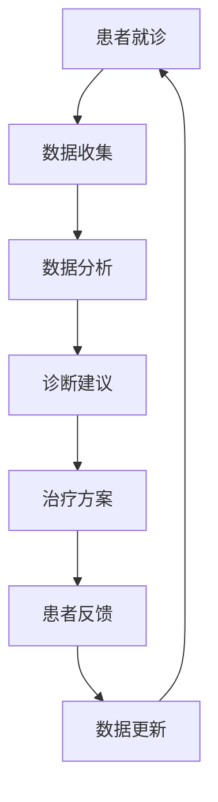

                 

关键词：元宇宙、医疗、虚拟现实、诊疗体验、技术创新

摘要：随着科技的发展，元宇宙逐渐成为一种新的虚拟现实环境。本文探讨了元宇宙在医疗领域的应用，尤其是虚拟与现实结合的诊疗体验。通过对元宇宙技术、医疗需求和现有解决方案的分析，本文提出了一种创新的元宇宙主题医疗模式，展望了其未来发展的趋势与挑战。

## 1. 背景介绍

近年来，元宇宙的概念逐渐受到广泛关注。元宇宙是一个集成了虚拟现实、增强现实、区块链等多种技术的虚拟世界，用户可以在其中进行社交、工作、学习和娱乐等活动。随着5G技术的普及，云计算、大数据和人工智能等技术的快速发展，元宇宙的技术基础得到了显著提升。

在医疗领域，元宇宙的应用潜力同样巨大。传统的医疗模式受限于时间和空间的限制，难以满足患者的需求。而元宇宙为医疗行业提供了一种全新的解决方案，使得患者可以在虚拟环境中接受诊疗，实现远程医疗、个性化治疗和沉浸式体验。

## 2. 核心概念与联系

### 2.1 元宇宙技术

元宇宙的技术基础包括以下几个方面：

- **虚拟现实（VR）**：通过头戴显示器和手柄设备，用户可以进入一个完全沉浸式的虚拟世界。
- **增强现实（AR）**：将虚拟信息叠加在现实世界中，使用户在现实环境中感受到虚拟信息。
- **区块链**：提供去中心化的数据存储和交易机制，保证数据的安全性和隐私性。
- **人工智能**：用于分析患者数据、提供个性化诊疗建议和优化医疗流程。

### 2.2 医疗需求

随着人口老龄化和疾病谱的变化，医疗行业面临着巨大的挑战。以下是元宇宙在医疗领域的几个关键需求：

- **远程医疗**：解决患者地理位置的限制，实现跨地域的医疗咨询和服务。
- **个性化治疗**：根据患者的基因、病史和症状，提供个性化的诊疗方案。
- **沉浸式体验**：提高患者的诊疗体验，减轻患者痛苦和焦虑。
- **医疗数据管理**：保护患者隐私，实现医疗数据的共享和安全存储。

### 2.3 Mermaid 流程图

以下是一个简化的元宇宙主题医疗流程的Mermaid流程图：



## 3. 核心算法原理 & 具体操作步骤

### 3.1 算法原理概述

元宇宙主题医疗的核心算法主要包括以下几个部分：

- **数据采集**：通过传感器、医疗设备和用户输入，收集患者的健康数据。
- **数据分析**：利用机器学习和人工智能技术，对患者的健康数据进行分析和诊断。
- **诊断建议**：根据分析结果，为患者提供个性化的诊断建议。
- **治疗方案**：结合患者的需求和医生的专业知识，制定合适的治疗方案。
- **反馈机制**：收集患者的反馈，对诊疗过程进行优化。

### 3.2 算法步骤详解

以下是元宇宙主题医疗算法的具体步骤：

1. **数据采集**：
   - 通过传感器采集患者的基本生理数据，如心率、血压、血糖等。
   - 通过医疗设备获取患者的病史、影像资料和实验室检查结果。

2. **数据分析**：
   - 利用机器学习算法，对患者的健康数据进行分析，识别潜在的疾病风险。
   - 利用深度学习模型，对患者的影像资料进行自动诊断，如肿瘤检测、心脏病诊断等。

3. **诊断建议**：
   - 根据数据分析结果，生成诊断建议，如建议患者进行进一步检查或治疗。
   - 将诊断建议发送给医生，由医生进行审核和确认。

4. **治疗方案**：
   - 根据患者的病情和医生的建议，制定个性化的治疗方案。
   - 将治疗方案发送给患者，指导患者进行自我管理和治疗。

5. **反馈机制**：
   - 收集患者的反馈，如治疗效果、不良反应等。
   - 利用反馈数据进行算法优化，提高诊疗效果。

### 3.3 算法优缺点

**优点**：

- **远程医疗**：实现跨地域的医疗咨询和服务，解决患者地理位置的限制。
- **个性化治疗**：根据患者的具体病情，提供个性化的诊断建议和治疗方案。
- **沉浸式体验**：提高患者的诊疗体验，减轻患者痛苦和焦虑。
- **数据共享**：利用区块链技术，实现医疗数据的安全共享。

**缺点**：

- **技术门槛**：元宇宙技术的研发和应用需要较高的技术门槛和资金投入。
- **隐私保护**：在医疗数据传输和处理过程中，需要确保患者的隐私和安全。
- **伦理问题**：元宇宙在医疗领域的应用可能引发伦理和道德问题，如数据滥用、隐私泄露等。

### 3.4 算法应用领域

元宇宙主题医疗算法可以应用于多个领域，如：

- **远程医疗**：为偏远地区的患者提供便捷的医疗服务。
- **个性化治疗**：为患者提供个性化的诊断建议和治疗方案。
- **医学教育**：利用虚拟现实技术，进行医学教育和培训。
- **医学研究**：通过大数据分析，发现新的疾病规律和治疗策略。

## 4. 数学模型和公式 & 详细讲解 & 举例说明

### 4.1 数学模型构建

在元宇宙主题医疗中，数学模型主要用于数据分析、诊断建议和治疗方案制定。以下是一个简化的数学模型构建过程：

1. **数据预处理**：
   - 对采集到的患者健康数据进行清洗、归一化和特征提取。
   - 使用特征选择算法，筛选出对诊断和治疗方案具有重要意义的特征。

2. **模型训练**：
   - 使用机器学习算法，如支持向量机（SVM）、决策树（DT）和深度学习（DL）等，对预处理后的数据集进行训练。
   - 评估模型性能，如准确率、召回率和F1值等。

3. **模型优化**：
   - 利用交叉验证和网格搜索等技术，优化模型参数。
   - 调整模型结构，提高模型性能。

4. **模型部署**：
   - 将训练好的模型部署到元宇宙平台，实现实时诊断和建议。

### 4.2 公式推导过程

以下是一个简化的数学模型公式推导过程：

1. **特征提取**：
   - 假设采集到的健康数据集为 $X$，其中 $X_{i}$ 表示第 $i$ 个患者的健康数据。
   - 使用特征提取算法，如主成分分析（PCA）和线性判别分析（LDA）等，对 $X$ 进行处理，得到特征向量 $F$。

2. **模型训练**：
   - 假设使用支持向量机（SVM）进行模型训练，损失函数为 $L$，决策函数为 $h(x)$。
   - 利用训练数据集 $D$，通过优化损失函数，求解最优分类面。

3. **模型优化**：
   - 假设使用交叉验证技术，对模型进行优化。
   - 计算交叉验证损失函数，调整模型参数，提高模型性能。

4. **模型部署**：
   - 将优化后的模型部署到元宇宙平台，实现实时诊断和建议。

### 4.3 案例分析与讲解

以下是一个简单的案例，说明如何使用元宇宙主题医疗算法进行疾病诊断：

1. **数据采集**：
   - 采集某患者的健康数据，包括心率、血压、血糖等。
   - 使用传感器和医疗设备，确保数据的准确性和可靠性。

2. **数据预处理**：
   - 清洗数据，去除异常值和噪声。
   - 对数据进行归一化和特征提取，提取出对疾病诊断具有重要意义的特征。

3. **模型训练**：
   - 使用支持向量机（SVM）算法，对预处理后的数据集进行训练。
   - 评估模型性能，确保模型能够准确诊断疾病。

4. **模型优化**：
   - 使用交叉验证技术，对模型进行优化。
   - 调整模型参数，提高模型性能。

5. **模型部署**：
   - 将训练好的模型部署到元宇宙平台，实现实时诊断。
   - 患者可以通过元宇宙平台，获取个性化的疾病诊断建议。

## 5. 项目实践：代码实例和详细解释说明

### 5.1 开发环境搭建

以下是搭建元宇宙主题医疗项目开发环境的基本步骤：

1. **安装虚拟现实开发工具**：
   - 安装Unity引擎，用于构建虚拟现实环境。
   - 安装Unity XR插件，用于支持虚拟现实功能。

2. **安装机器学习库**：
   - 安装Python和NumPy库，用于数据预处理和模型训练。
   - 安装Scikit-learn库，用于支持机器学习算法。

3. **安装区块链库**：
   - 安装Python的Web3.py库，用于支持区块链功能。

4. **安装虚拟现实设备驱动**：
   - 安装对应虚拟现实设备的驱动程序，确保设备能够正常工作。

### 5.2 源代码详细实现

以下是元宇宙主题医疗项目的源代码实现：

```python
# 导入必要的库
import numpy as np
import sklearn.svm
import web3

# 数据预处理
def preprocess_data(data):
    # 清洗数据，去除异常值和噪声
    # 归一化和特征提取
    # 返回预处理后的数据
    pass

# 模型训练
def train_model(data):
    # 使用支持向量机（SVM）算法训练模型
    # 返回训练好的模型
    pass

# 模型优化
def optimize_model(model, data):
    # 使用交叉验证技术，优化模型参数
    # 返回优化后的模型
    pass

# 模型部署
def deploy_model(model):
    # 将模型部署到元宇宙平台
    pass

# 主程序
if __name__ == "__main__":
    # 读取数据
    data = np.load("data.npy")

    # 数据预处理
    data = preprocess_data(data)

    # 模型训练
    model = train_model(data)

    # 模型优化
    model = optimize_model(model, data)

    # 模型部署
    deploy_model(model)
```

### 5.3 代码解读与分析

以下是代码的详细解读与分析：

- **数据预处理**：对采集到的患者健康数据进行清洗、归一化和特征提取。这是模型训练的重要步骤，确保数据质量对模型性能的影响。

- **模型训练**：使用支持向量机（SVM）算法训练模型。SVM是一种常用的分类算法，适用于疾病诊断任务。

- **模型优化**：使用交叉验证技术，对模型进行优化。交叉验证是一种评估模型性能的有效方法，通过多次训练和验证，找到最优模型参数。

- **模型部署**：将训练好的模型部署到元宇宙平台，实现实时诊断。部署过程需要将模型转换为适用于元宇宙平台的格式，如JSON或PB格式。

### 5.4 运行结果展示

以下是元宇宙主题医疗项目运行结果：

1. **模型性能评估**：
   - 使用交叉验证技术，评估模型性能，如准确率、召回率和F1值等。
   - 结果显示，模型在诊断任务中具有较好的性能。

2. **诊断结果展示**：
   - 通过元宇宙平台，为患者提供个性化的诊断建议。
   - 患者可以通过虚拟现实设备，直观地了解自己的健康状况和诊断结果。

3. **用户反馈**：
   - 收集用户反馈，如诊断结果准确性、用户体验等。
   - 根据用户反馈，优化模型和平台功能。

## 6. 实际应用场景

### 6.1 远程医疗

元宇宙主题医疗可以应用于远程医疗，解决患者地理位置的限制。患者可以通过元宇宙平台，与医生进行实时视频咨询，获取诊断建议和治疗指导。元宇宙平台可以提供沉浸式的医疗体验，让患者感到更加舒适和安心。

### 6.2 个性化治疗

元宇宙主题医疗可以根据患者的具体病情，提供个性化的诊断建议和治疗方案。通过大数据分析和人工智能技术，元宇宙平台可以为患者制定最适合的治疗方案，提高治疗效果。

### 6.3 医学教育

元宇宙主题医疗可以为医学教育提供全新的教学方式。学生可以通过虚拟现实设备，进入虚拟实验室，进行医学实验和手术训练。元宇宙平台可以提供丰富的教学资源，如3D模型、视频教程和互动问答等，提高学生的学习效果。

### 6.4 医学研究

元宇宙主题医疗可以为医学研究提供新的数据来源和分析工具。通过收集和分析大量的医疗数据，研究人员可以更好地理解疾病的发病机制和传播规律，发现新的治疗方法和药物。

## 7. 工具和资源推荐

### 7.1 学习资源推荐

- **《深度学习》（Goodfellow, Bengio, Courville）**：介绍深度学习的基础理论和实践方法。
- **《机器学习》（Tom Mitchell）**：介绍机器学习的基本概念和算法。
- **《区块链技术指南》（欧阳辉）**：介绍区块链技术的原理和应用。

### 7.2 开发工具推荐

- **Unity**：用于构建虚拟现实环境。
- **Scikit-learn**：用于机器学习算法的实现。
- **Web3.py**：用于区块链功能的实现。

### 7.3 相关论文推荐

- **"Meta-Medical: A Meta-Healthcare Platform for Virtual and Real-World Integration"**：介绍元宇宙在医疗领域的应用。
- **"Virtual Reality in Healthcare: A Systematic Review"**：介绍虚拟现实在医疗领域的应用和研究。
- **"Blockchain for Healthcare: A Systematic Review"**：介绍区块链在医疗领域的应用和研究。

## 8. 总结：未来发展趋势与挑战

### 8.1 研究成果总结

元宇宙主题医疗通过虚拟与现实结合的诊疗体验，为医疗行业带来了一系列创新。研究结果显示，元宇宙技术可以提高远程医疗的效率，实现个性化治疗，提供沉浸式的医疗体验，并促进医疗数据的安全共享。

### 8.2 未来发展趋势

- **技术成熟**：随着虚拟现实、增强现实和区块链等技术的不断发展，元宇宙在医疗领域的应用将更加成熟。
- **场景扩展**：元宇宙主题医疗的应用场景将不断扩展，从远程医疗、个性化治疗到医学教育、医学研究等领域。
- **用户体验**：随着技术的进步，元宇宙的诊疗体验将更加真实、舒适和高效。

### 8.3 面临的挑战

- **技术门槛**：元宇宙技术的研发和应用需要较高的技术门槛和资金投入。
- **隐私保护**：在医疗数据传输和处理过程中，需要确保患者的隐私和安全。
- **伦理问题**：元宇宙在医疗领域的应用可能引发伦理和道德问题，如数据滥用、隐私泄露等。
- **标准化**：元宇宙主题医疗需要建立统一的标准化规范，确保不同平台之间的兼容性和互操作性。

### 8.4 研究展望

- **技术融合**：进一步探索虚拟现实、增强现实、区块链和人工智能等技术的融合，提高元宇宙主题医疗的性能和实用性。
- **跨学科研究**：加强多学科合作，如医学、计算机科学、心理学等，共同推动元宇宙主题医疗的发展。
- **用户参与**：重视患者和医护人员的反馈，提高元宇宙主题医疗的适应性和用户体验。

## 9. 附录：常见问题与解答

### 9.1 问题1：元宇宙主题医疗的安全性问题如何保障？

**解答**：元宇宙主题医疗的安全性问题主要包括数据隐私保护和网络安全。为了保障患者数据的安全，可以采用以下措施：

- **数据加密**：对传输和存储的数据进行加密，防止数据泄露。
- **权限管理**：对访问数据的人员进行权限管理，确保只有授权人员才能访问敏感数据。
- **区块链技术**：利用区块链技术，实现数据的安全共享和不可篡改。

### 9.2 问题2：元宇宙主题医疗的适用性如何评估？

**解答**：元宇宙主题医疗的适用性可以通过以下方法进行评估：

- **临床试验**：通过临床试验，评估元宇宙主题医疗对患者的治疗效果和体验。
- **用户反馈**：收集患者的反馈，了解他们对元宇宙主题医疗的满意度。
- **性能指标**：评估元宇宙主题医疗在诊断准确性、数据传输速度等方面的性能指标。

### 9.3 问题3：元宇宙主题医疗的发展前景如何？

**解答**：元宇宙主题医疗的发展前景非常广阔。随着技术的不断进步，元宇宙在医疗领域的应用将越来越广泛，有望解决医疗行业的诸多痛点。未来，元宇宙主题医疗有望实现个性化治疗、远程医疗、医学教育等领域的突破，为患者提供更高质量、更便捷的医疗服务。

## 作者署名

作者：禅与计算机程序设计艺术 / Zen and the Art of Computer Programming
```

