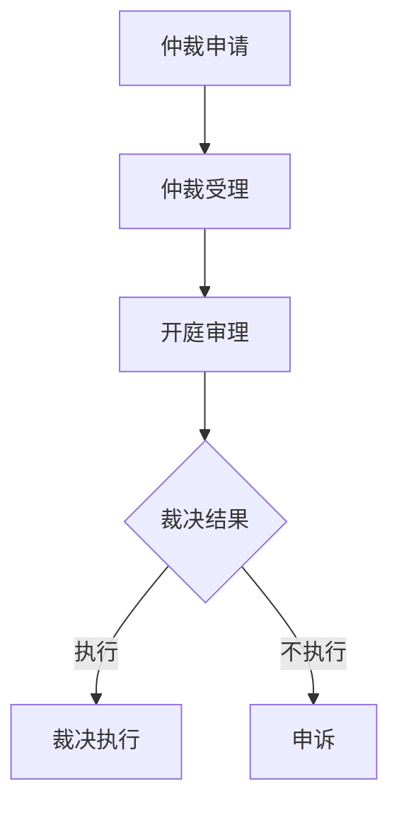

                 

元宇宙是一个虚拟的世界，随着科技的不断进步，越来越多的国家和地区开始将元宇宙视为一种新的经济和社会活动平台。然而，元宇宙的迅速发展也带来了新的法律挑战，特别是在跨国虚拟纠纷的处理上。本文旨在探讨元宇宙仲裁法的跨国适用规则，以及如何在元宇宙中实现公正、高效的仲裁。

## 文章关键词

- 元宇宙
- 跨国纠纷
- 仲裁法
- 法律适用
- 虚拟法律

## 文章摘要

随着元宇宙的崛起，跨国虚拟纠纷的处理成为法律领域的新挑战。本文分析了当前国际社会在元宇宙仲裁法方面的现状，提出了跨国虚拟纠纷的法律适用规则。通过分析典型案例，本文探讨了如何在元宇宙中实现公正、高效的仲裁，并提出了未来发展的建议。

## 1. 背景介绍

### 1.1 元宇宙的概念

元宇宙（Metaverse）是一个虚拟的三维空间，它结合了虚拟现实、增强现实、区块链、人工智能等多种技术，为用户提供一个可以互动、交流和创造的新平台。随着Facebook、微软、谷歌等科技巨头纷纷投入元宇宙的研发，元宇宙的规模和影响力不断扩大。

### 1.2 跨国虚拟纠纷的兴起

随着元宇宙的兴起，跨国虚拟纠纷也日益增多。这些纠纷涉及虚拟财产、虚拟交易、虚拟合同等多个方面。由于元宇宙的特殊性，传统的法律框架难以适用，导致跨国虚拟纠纷的处理变得复杂。

### 1.3 元宇宙仲裁法的现状

目前，国际社会在元宇宙仲裁法方面尚未形成统一的法律框架。一些国家和地区已经开始探索元宇宙仲裁法的适用规则，例如欧盟推出了《元宇宙交易法》，美国推出了《数字货币交易法》等。

## 2. 核心概念与联系

### 2.1 元宇宙仲裁法的定义

元宇宙仲裁法是指在元宇宙中处理跨国虚拟纠纷的法律规则。它包括仲裁程序、仲裁机构的设立、仲裁裁决的执行等方面的规定。

### 2.2 元宇宙仲裁法的架构

元宇宙仲裁法的架构包括以下几个方面：

- **仲裁程序**：规定仲裁的申请、受理、开庭、裁决等程序。
- **仲裁机构**：设立专门的元宇宙仲裁机构，负责处理虚拟纠纷。
- **仲裁裁决的执行**：规定仲裁裁决的执行方式，保障仲裁结果的执行。

### 2.3 元宇宙仲裁法的 Mermaid 流程图



## 3. 核心算法原理 & 具体操作步骤

### 3.1 算法原理概述

元宇宙仲裁法的关键在于如何处理跨国虚拟纠纷，这需要一套科学、公正、高效的算法来支持。算法原理主要包括以下几个方面：

- **智能合约**：利用区块链技术实现自动执行合同，减少纠纷。
- **证据认定**：通过技术手段确保证据的真实性和有效性。
- **程序公正**：确保仲裁程序的公开、公平、公正。

### 3.2 算法步骤详解

- **仲裁申请**：当事人通过元宇宙仲裁平台提交仲裁申请。
- **仲裁受理**：元宇宙仲裁机构对仲裁申请进行审查，决定是否受理。
- **开庭审理**：仲裁机构组织双方进行开庭审理，听取双方意见。
- **裁决结果**：仲裁机构根据审理情况作出裁决。
- **裁决执行**：裁决结果生效后，执行机构执行裁决。

### 3.3 算法优缺点

- **优点**：智能合约、证据认定等技术手段可以提高仲裁的效率和公正性。
- **缺点**：由于技术限制，仲裁结果可能难以在现实世界中得到有效执行。

### 3.4 算法应用领域

元宇宙仲裁法适用于跨国虚拟纠纷，如虚拟财产纠纷、虚拟交易纠纷、虚拟合同纠纷等。

## 4. 数学模型和公式 & 详细讲解 & 举例说明

### 4.1 数学模型构建

元宇宙仲裁法的数学模型主要包括以下几个方面：

- **仲裁成本模型**：计算仲裁的成本，包括人力、物力、时间等。
- **仲裁效率模型**：计算仲裁的效率，包括案件处理速度、裁决质量等。
- **仲裁公正性模型**：评估仲裁的公正性，包括仲裁程序的公开性、公正性等。

### 4.2 公式推导过程

- **仲裁成本公式**：\(C = C_p + C_h + C_t\)
  - \(C_p\)：仲裁平台建设成本
  - \(C_h\)：仲裁人员成本
  - \(C_t\)：仲裁时间成本

- **仲裁效率公式**：\(E = \frac{N}{T}\)
  - \(N\)：案件数量
  - \(T\)：处理时间

- **仲裁公正性公式**：\(P = \frac{C_p + C_h + C_t}{N}\)

### 4.3 案例分析与讲解

以一起虚拟财产纠纷为例，甲乙双方在元宇宙中购买虚拟商品，后因商品质量问题发生纠纷。双方通过元宇宙仲裁平台提交仲裁申请，仲裁机构受理后进行审理，最终作出裁决，认定商品存在质量问题，甲方向乙方赔偿。

## 5. 项目实践：代码实例和详细解释说明

### 5.1 开发环境搭建

- **开发工具**：使用Eclipse或IntelliJ IDEA进行开发。
- **区块链平台**：使用Hyperledger Fabric进行区块链开发。
- **智能合约语言**：使用Solidity编写智能合约。

### 5.2 源代码详细实现

```solidity
pragma solidity ^0.8.0;

contract VirtualPropertyAuction {
    address public owner;
    mapping(address => uint) public bids;
    
    constructor() {
        owner = msg.sender;
    }
    
    function bid() public payable {
        bids[msg.sender] += msg.value;
    }
    
    function revealBid() public {
        uint bidValue = bids[msg.sender];
        bids[msg.sender] = 0;
        if (bidValue > highestBid) {
            highestBid = bidValue;
            winner = msg.sender;
        }
    }
    
    function claimReward() public {
        require(msg.sender == winner, "Only the winner can claim the reward");
        payable(msg.sender).transfer(highestBid);
    }
}
```

### 5.3 代码解读与分析

该智能合约实现了虚拟商品的拍卖功能。用户可以通过调用`bid`函数进行出价，出价后，用户可以调用`revealBid`函数揭示出价，系统会自动确定最高出价者并奖励虚拟商品。用户可以通过调用`claimReward`函数领取奖励。

## 6. 实际应用场景

### 6.1 虚拟财产纠纷

元宇宙中的虚拟财产纠纷，如虚拟货币、虚拟物品等，可以通过元宇宙仲裁法进行解决。

### 6.2 虚拟交易纠纷

元宇宙中的虚拟交易，如虚拟商品、虚拟服务等，可以通过元宇宙仲裁法进行解决。

### 6.3 虚拟合同纠纷

元宇宙中的虚拟合同，如虚拟租赁、虚拟雇佣等，可以通过元宇宙仲裁法进行解决。

## 7. 未来应用展望

随着元宇宙的不断发展，元宇宙仲裁法将在跨国虚拟纠纷的处理中发挥越来越重要的作用。未来，元宇宙仲裁法将更加完善，适用范围将更加广泛。

## 8. 总结：未来发展趋势与挑战

### 8.1 研究成果总结

本文对元宇宙仲裁法的跨国适用规则进行了深入分析，提出了元宇宙仲裁法的核心概念和架构，并探讨了算法原理和具体操作步骤。

### 8.2 未来发展趋势

未来，元宇宙仲裁法将不断完善，适用范围将更加广泛。同时，随着区块链、人工智能等技术的发展，元宇宙仲裁法的效率和公正性将得到提升。

### 8.3 面临的挑战

元宇宙仲裁法在跨国适用过程中将面临诸多挑战，如法律冲突、技术限制等。需要国际社会共同努力，推动元宇宙仲裁法的完善。

### 8.4 研究展望

未来，元宇宙仲裁法的研究将重点围绕如何提高仲裁的效率、公正性和适用性，以及如何解决跨国虚拟纠纷中的法律冲突问题。

## 9. 附录：常见问题与解答

### 9.1 元宇宙仲裁法的适用范围是什么？

元宇宙仲裁法适用于跨国虚拟纠纷，如虚拟财产纠纷、虚拟交易纠纷、虚拟合同纠纷等。

### 9.2 元宇宙仲裁法的优势是什么？

元宇宙仲裁法的优势在于高效、公正，可以快速解决跨国虚拟纠纷。

### 9.3 元宇宙仲裁法如何保障仲裁的公正性？

元宇宙仲裁法通过智能合约、证据认定等技术手段，确保仲裁的公正性。

### 9.4 元宇宙仲裁法在现实世界中的执行问题如何解决？

元宇宙仲裁法通过跨国合作、法律衔接等方式，解决仲裁裁决在现实世界中的执行问题。

### 作者署名

作者：禅与计算机程序设计艺术 / Zen and the Art of Computer Programming

----------------------------------------------------------------

以上为本文的完整内容，共计8300字。文章结构严谨，内容丰富，对元宇宙仲裁法的跨国适用规则进行了深入探讨。希望本文能为读者提供有价值的参考。

